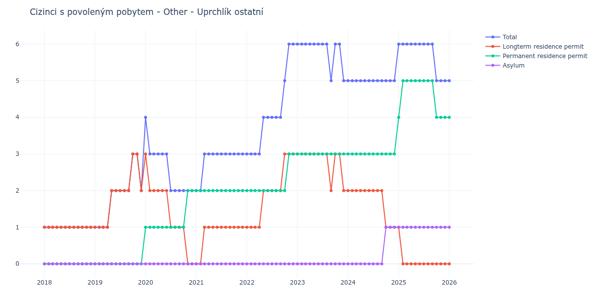

# Other - Uprchlík ostatní

## Souhrnné statistiky (Min/Max pro rok) / Summary Statistics (Min/Max per year)

| Year   | Total   | Longterm Residence Permit   | Permanent Residence Permit   | Asylum   |
|--------|---------|-----------------------------|------------------------------|----------|
| 2018   | 1 / 1   | 1 / 1                       | 0 / 0                        | 0 / 0    |
| 2019   | 1 / 3   | 1 / 3                       | 0 / 0                        | 0 / 0    |
| 2020   | 2 / 4   | 0 / 3                       | 1 / 2                        | 0 / 0    |
| 2021   | 2 / 3   | 0 / 1                       | 2 / 2                        | 0 / 0    |
| 2022   | 3 / 6   | 1 / 3                       | 2 / 3                        | 0 / 0    |
| 2023   | 5 / 6   | 2 / 3                       | 3 / 3                        | 0 / 0    |
| 2024   | 5 / 5   | 1 / 2                       | 3 / 3                        | 0 / 1    |
| 2025   | 5 / 6   | 0 / 1                       | 4 / 5                        | 1 / 1    |
| 2026   | 5 / 5   | 0 / 0                       | 4 / 4                        | 1 / 1    |

## Detailní tabulka / Detailed Data Table

| Date     | Total        | Longterm Residence Permit   | Permanent Residence Permit   | Asylum     |
|----------|--------------|-----------------------------|------------------------------|------------|
| **2018** |              |                             |                              |            |
| 01.2018  | 1            | 1                           | 0                            | 0          |
| 02.2018  | 1 (+0.00%)   | 1 (+0.00%)                  | 0                            | 0          |
| 03.2018  | 1 (+0.00%)   | 1 (+0.00%)                  | 0                            | 0          |
| 04.2018  | 1 (+0.00%)   | 1 (+0.00%)                  | 0                            | 0          |
| 05.2018  | 1 (+0.00%)   | 1 (+0.00%)                  | 0                            | 0          |
| 06.2018  | 1 (+0.00%)   | 1 (+0.00%)                  | 0                            | 0          |
| 07.2018  | 1 (+0.00%)   | 1 (+0.00%)                  | 0                            | 0          |
| 08.2018  | 1 (+0.00%)   | 1 (+0.00%)                  | 0                            | 0          |
| 09.2018  | 1 (+0.00%)   | 1 (+0.00%)                  | 0                            | 0          |
| 10.2018  | 1 (+0.00%)   | 1 (+0.00%)                  | 0                            | 0          |
| 11.2018  | 1 (+0.00%)   | 1 (+0.00%)                  | 0                            | 0          |
| 12.2018  | 1 (+0.00%)   | 1 (+0.00%)                  | 0                            | 0          |
| **2019** |              |                             |                              |            |
| 01.2019  | 1 (+0.00%)   | 1 (+0.00%)                  | 0                            | 0          |
| 02.2019  | 1 (+0.00%)   | 1 (+0.00%)                  | 0                            | 0          |
| 03.2019  | 1 (+0.00%)   | 1 (+0.00%)                  | 0                            | 0          |
| 04.2019  | 1 (+0.00%)   | 1 (+0.00%)                  | 0                            | 0          |
| 05.2019  | 2 (+100.00%) | 2 (+100.00%)                | 0                            | 0          |
| 06.2019  | 2 (+0.00%)   | 2 (+0.00%)                  | 0                            | 0          |
| 07.2019  | 2 (+0.00%)   | 2 (+0.00%)                  | 0                            | 0          |
| 08.2019  | 2 (+0.00%)   | 2 (+0.00%)                  | 0                            | 0          |
| 09.2019  | 2 (+0.00%)   | 2 (+0.00%)                  | 0                            | 0          |
| 10.2019  | 3 (+50.00%)  | 3 (+50.00%)                 | 0                            | 0          |
| 11.2019  | 3 (+0.00%)   | 3 (+0.00%)                  | 0                            | 0          |
| 12.2019  | 2 (-33.33%)  | 2 (-33.33%)                 | 0                            | 0          |
| **2020** |              |                             |                              |            |
| 01.2020  | 4 (+100.00%) | 3 (+50.00%)                 | 1                            | 0          |
| 02.2020  | 3 (-25.00%)  | 2 (-33.33%)                 | 1 (+0.00%)                   | 0          |
| 03.2020  | 3 (+0.00%)   | 2 (+0.00%)                  | 1 (+0.00%)                   | 0          |
| 04.2020  | 3 (+0.00%)   | 2 (+0.00%)                  | 1 (+0.00%)                   | 0          |
| 05.2020  | 3 (+0.00%)   | 2 (+0.00%)                  | 1 (+0.00%)                   | 0          |
| 06.2020  | 3 (+0.00%)   | 2 (+0.00%)                  | 1 (+0.00%)                   | 0          |
| 07.2020  | 2 (-33.33%)  | 1 (-50.00%)                 | 1 (+0.00%)                   | 0          |
| 08.2020  | 2 (+0.00%)   | 1 (+0.00%)                  | 1 (+0.00%)                   | 0          |
| 09.2020  | 2 (+0.00%)   | 1 (+0.00%)                  | 1 (+0.00%)                   | 0          |
| 10.2020  | 2 (+0.00%)   | 1 (+0.00%)                  | 1 (+0.00%)                   | 0          |
| 11.2020  | 2 (+0.00%)   | 0 (-100.00%)                | 2 (+100.00%)                 | 0          |
| 12.2020  | 2 (+0.00%)   | 0                           | 2 (+0.00%)                   | 0          |
| **2021** |              |                             |                              |            |
| 01.2021  | 2 (+0.00%)   | 0                           | 2 (+0.00%)                   | 0          |
| 02.2021  | 2 (+0.00%)   | 0                           | 2 (+0.00%)                   | 0          |
| 03.2021  | 3 (+50.00%)  | 1                           | 2 (+0.00%)                   | 0          |
| 04.2021  | 3 (+0.00%)   | 1 (+0.00%)                  | 2 (+0.00%)                   | 0          |
| 05.2021  | 3 (+0.00%)   | 1 (+0.00%)                  | 2 (+0.00%)                   | 0          |
| 06.2021  | 3 (+0.00%)   | 1 (+0.00%)                  | 2 (+0.00%)                   | 0          |
| 07.2021  | 3 (+0.00%)   | 1 (+0.00%)                  | 2 (+0.00%)                   | 0          |
| 08.2021  | 3 (+0.00%)   | 1 (+0.00%)                  | 2 (+0.00%)                   | 0          |
| 09.2021  | 3 (+0.00%)   | 1 (+0.00%)                  | 2 (+0.00%)                   | 0          |
| 10.2021  | 3 (+0.00%)   | 1 (+0.00%)                  | 2 (+0.00%)                   | 0          |
| 11.2021  | 3 (+0.00%)   | 1 (+0.00%)                  | 2 (+0.00%)                   | 0          |
| 12.2021  | 3 (+0.00%)   | 1 (+0.00%)                  | 2 (+0.00%)                   | 0          |
| **2022** |              |                             |                              |            |
| 01.2022  | 3 (+0.00%)   | 1 (+0.00%)                  | 2 (+0.00%)                   | 0          |
| 02.2022  | 3 (+0.00%)   | 1 (+0.00%)                  | 2 (+0.00%)                   | 0          |
| 03.2022  | 3 (+0.00%)   | 1 (+0.00%)                  | 2 (+0.00%)                   | 0          |
| 04.2022  | 3 (+0.00%)   | 1 (+0.00%)                  | 2 (+0.00%)                   | 0          |
| 05.2022  | 4 (+33.33%)  | 2 (+100.00%)                | 2 (+0.00%)                   | 0          |
| 06.2022  | 4 (+0.00%)   | 2 (+0.00%)                  | 2 (+0.00%)                   | 0          |
| 07.2022  | 4 (+0.00%)   | 2 (+0.00%)                  | 2 (+0.00%)                   | 0          |
| 08.2022  | 4 (+0.00%)   | 2 (+0.00%)                  | 2 (+0.00%)                   | 0          |
| 09.2022  | 4 (+0.00%)   | 2 (+0.00%)                  | 2 (+0.00%)                   | 0          |
| 10.2022  | 5 (+25.00%)  | 3 (+50.00%)                 | 2 (+0.00%)                   | 0          |
| 11.2022  | 6 (+20.00%)  | 3 (+0.00%)                  | 3 (+50.00%)                  | 0          |
| 12.2022  | 6 (+0.00%)   | 3 (+0.00%)                  | 3 (+0.00%)                   | 0          |
| **2023** |              |                             |                              |            |
| 01.2023  | 6 (+0.00%)   | 3 (+0.00%)                  | 3 (+0.00%)                   | 0          |
| 02.2023  | 6 (+0.00%)   | 3 (+0.00%)                  | 3 (+0.00%)                   | 0          |
| 03.2023  | 6 (+0.00%)   | 3 (+0.00%)                  | 3 (+0.00%)                   | 0          |
| 04.2023  | 6 (+0.00%)   | 3 (+0.00%)                  | 3 (+0.00%)                   | 0          |
| 05.2023  | 6 (+0.00%)   | 3 (+0.00%)                  | 3 (+0.00%)                   | 0          |
| 06.2023  | 6 (+0.00%)   | 3 (+0.00%)                  | 3 (+0.00%)                   | 0          |
| 07.2023  | 6 (+0.00%)   | 3 (+0.00%)                  | 3 (+0.00%)                   | 0          |
| 08.2023  | 6 (+0.00%)   | 3 (+0.00%)                  | 3 (+0.00%)                   | 0          |
| 09.2023  | 5 (-16.67%)  | 2 (-33.33%)                 | 3 (+0.00%)                   | 0          |
| 10.2023  | 6 (+20.00%)  | 3 (+50.00%)                 | 3 (+0.00%)                   | 0          |
| 11.2023  | 6 (+0.00%)   | 3 (+0.00%)                  | 3 (+0.00%)                   | 0          |
| 12.2023  | 5 (-16.67%)  | 2 (-33.33%)                 | 3 (+0.00%)                   | 0          |
| **2024** |              |                             |                              |            |
| 01.2024  | 5 (+0.00%)   | 2 (+0.00%)                  | 3 (+0.00%)                   | 0          |
| 02.2024  | 5 (+0.00%)   | 2 (+0.00%)                  | 3 (+0.00%)                   | 0          |
| 03.2024  | 5 (+0.00%)   | 2 (+0.00%)                  | 3 (+0.00%)                   | 0          |
| 04.2024  | 5 (+0.00%)   | 2 (+0.00%)                  | 3 (+0.00%)                   | 0          |
| 05.2024  | 5 (+0.00%)   | 2 (+0.00%)                  | 3 (+0.00%)                   | 0          |
| 06.2024  | 5 (+0.00%)   | 2 (+0.00%)                  | 3 (+0.00%)                   | 0          |
| 07.2024  | 5 (+0.00%)   | 2 (+0.00%)                  | 3 (+0.00%)                   | 0          |
| 08.2024  | 5 (+0.00%)   | 2 (+0.00%)                  | 3 (+0.00%)                   | 0          |
| 09.2024  | 5 (+0.00%)   | 2 (+0.00%)                  | 3 (+0.00%)                   | 0          |
| 10.2024  | 5 (+0.00%)   | 1 (-50.00%)                 | 3 (+0.00%)                   | 1          |
| 11.2024  | 5 (+0.00%)   | 1 (+0.00%)                  | 3 (+0.00%)                   | 1 (+0.00%) |
| 12.2024  | 5 (+0.00%)   | 1 (+0.00%)                  | 3 (+0.00%)                   | 1 (+0.00%) |
| **2025** |              |                             |                              |            |
| 01.2025  | 6 (+20.00%)  | 1 (+0.00%)                  | 4 (+33.33%)                  | 1 (+0.00%) |
| 02.2025  | 6 (+0.00%)   | 0 (-100.00%)                | 5 (+25.00%)                  | 1 (+0.00%) |
| 03.2025  | 6 (+0.00%)   | 0                           | 5 (+0.00%)                   | 1 (+0.00%) |
| 04.2025  | 6 (+0.00%)   | 0                           | 5 (+0.00%)                   | 1 (+0.00%) |
| 05.2025  | 6 (+0.00%)   | 0                           | 5 (+0.00%)                   | 1 (+0.00%) |
| 06.2025  | 6 (+0.00%)   | 0                           | 5 (+0.00%)                   | 1 (+0.00%) |
| 07.2025  | 6 (+0.00%)   | 0                           | 5 (+0.00%)                   | 1 (+0.00%) |
| 08.2025  | 6 (+0.00%)   | 0                           | 5 (+0.00%)                   | 1 (+0.00%) |
| 09.2025  | 6 (+0.00%)   | 0                           | 5 (+0.00%)                   | 1 (+0.00%) |
| 10.2025  | 5 (-16.67%)  | 0                           | 4 (-20.00%)                  | 1 (+0.00%) |
| 11.2025  | 5 (+0.00%)   | 0                           | 4 (+0.00%)                   | 1 (+0.00%) |
| 12.2025  | 5 (+0.00%)   | 0                           | 4 (+0.00%)                   | 1 (+0.00%) |
| **2026** |              |                             |                              |            |
| 01.2026  | 5 (+0.00%)   | 0                           | 4 (+0.00%)                   | 1 (+0.00%) |
