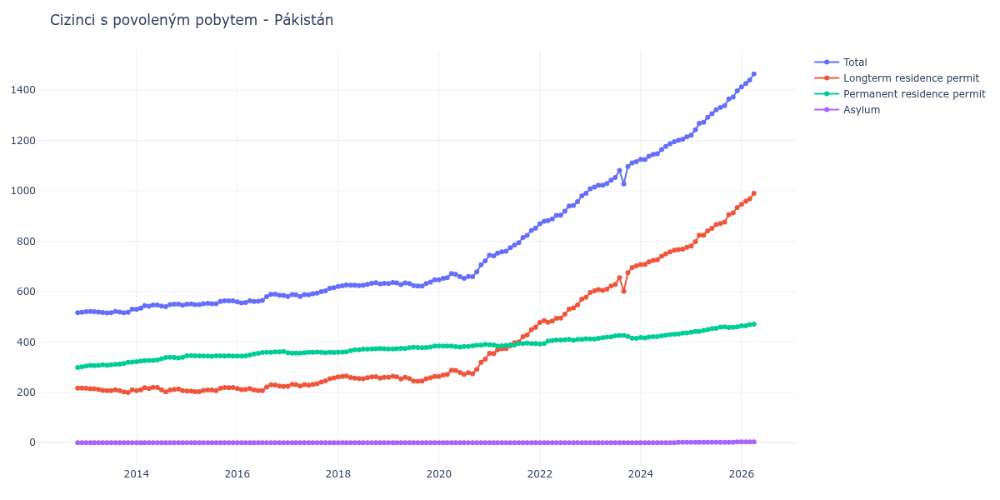

# Pákistán

## Souhrnné statistiky (Min/Max pro rok) / Summary Statistics (Min/Max per year)

| Year   | Total         | Longterm Residence Permit   | Permanent Residence Permit   | Asylum   |
|--------|---------------|-----------------------------|------------------------------|----------|
| 2012   | 516 / 518     | 217 / 217                   | 299 / 301                    | 0 / 0    |
| 2013   | 515 / 530     | 199 / 216                   | 304 / 320                    | 0 / 0    |
| 2014   | 529 / 550     | 202 / 220                   | 322 / 339                    | 0 / 0    |
| 2015   | 548 / 563     | 203 / 219                   | 343 / 346                    | 0 / 0    |
| 2016   | 555 / 590     | 207 / 230                   | 344 / 362                    | 0 / 0    |
| 2017   | 581 / 615     | 224 / 257                   | 356 / 360                    | 0 / 0    |
| 2018   | 620 / 635     | 254 / 265                   | 359 / 374                    | 0 / 0    |
| 2019   | 622 / 647     | 244 / 264                   | 372 / 384                    | 0 / 0    |
| 2020   | 647 / 722     | 263 / 332                   | 380 / 390                    | 0 / 0    |
| 2021   | 742 / 852     | 354 / 458                   | 384 / 395                    | 0 / 0    |
| 2022   | 869 / 990     | 477 / 577                   | 392 / 413                    | 0 / 0    |
| 2023   | 1 008 / 1 116 | 596 / 702                   | 412 / 426                    | 0 / 0    |
| 2024   | 1 124 / 1 214 | 707 / 776                   | 416 / 436                    | 0 / 2    |
| 2025   | 1 221 / 1 397 | 781 / 934                   | 438 / 460                    | 2 / 3    |
| 2026   | 1 413 / 1 464 | 946 / 990                   | 464 / 471                    | 3 / 3    |

## Detailní tabulka / Detailed Data Table

| Date     | Total          | Longterm Residence Permit   | Permanent Residence Permit   | Asylum      |
|----------|----------------|-----------------------------|------------------------------|-------------|
| **2012** |                |                             |                              |             |
| 11.2012  | 516            | 217                         | 299                          | 0           |
| 12.2012  | 518 (+0.39%)   | 217 (+0.00%)                | 301 (+0.67%)                 | 0           |
| **2013** |                |                             |                              |             |
| 01.2013  | 520 (+0.39%)   | 216 (-0.46%)                | 304 (+1.00%)                 | 0           |
| 02.2013  | 521 (+0.19%)   | 214 (-0.93%)                | 307 (+0.99%)                 | 0           |
| 03.2013  | 520 (-0.19%)   | 214 (+0.00%)                | 306 (-0.33%)                 | 0           |
| 04.2013  | 519 (-0.19%)   | 212 (-0.93%)                | 307 (+0.33%)                 | 0           |
| 05.2013  | 517 (-0.39%)   | 208 (-1.89%)                | 309 (+0.65%)                 | 0           |
| 06.2013  | 515 (-0.39%)   | 207 (-0.48%)                | 308 (-0.32%)                 | 0           |
| 07.2013  | 516 (+0.19%)   | 207 (+0.00%)                | 309 (+0.32%)                 | 0           |
| 08.2013  | 521 (+0.97%)   | 210 (+1.45%)                | 311 (+0.65%)                 | 0           |
| 09.2013  | 519 (-0.38%)   | 207 (-1.43%)                | 312 (+0.32%)                 | 0           |
| 10.2013  | 516 (-0.58%)   | 202 (-2.42%)                | 314 (+0.64%)                 | 0           |
| 11.2013  | 518 (+0.39%)   | 199 (-1.49%)                | 319 (+1.59%)                 | 0           |
| 12.2013  | 530 (+2.32%)   | 210 (+5.53%)                | 320 (+0.31%)                 | 0           |
| **2014** |                |                             |                              |             |
| 01.2014  | 529 (-0.19%)   | 207 (-1.43%)                | 322 (+0.63%)                 | 0           |
| 02.2014  | 534 (+0.95%)   | 210 (+1.45%)                | 324 (+0.62%)                 | 0           |
| 03.2014  | 544 (+1.87%)   | 218 (+3.81%)                | 326 (+0.62%)                 | 0           |
| 04.2014  | 542 (-0.37%)   | 215 (-1.38%)                | 327 (+0.31%)                 | 0           |
| 05.2014  | 547 (+0.92%)   | 220 (+2.33%)                | 327 (+0.00%)                 | 0           |
| 06.2014  | 547 (+0.00%)   | 219 (-0.45%)                | 328 (+0.31%)                 | 0           |
| 07.2014  | 543 (-0.73%)   | 210 (-4.11%)                | 333 (+1.52%)                 | 0           |
| 08.2014  | 540 (-0.55%)   | 202 (-3.81%)                | 338 (+1.50%)                 | 0           |
| 09.2014  | 548 (+1.48%)   | 209 (+3.47%)                | 339 (+0.30%)                 | 0           |
| 10.2014  | 550 (+0.36%)   | 212 (+1.44%)                | 338 (-0.29%)                 | 0           |
| 11.2014  | 550 (+0.00%)   | 213 (+0.47%)                | 337 (-0.30%)                 | 0           |
| 12.2014  | 546 (-0.73%)   | 207 (-2.82%)                | 339 (+0.59%)                 | 0           |
| **2015** |                |                             |                              |             |
| 01.2015  | 550 (+0.73%)   | 205 (-0.97%)                | 345 (+1.77%)                 | 0           |
| 02.2015  | 551 (+0.18%)   | 205 (+0.00%)                | 346 (+0.29%)                 | 0           |
| 03.2015  | 548 (-0.54%)   | 203 (-0.98%)                | 345 (-0.29%)                 | 0           |
| 04.2015  | 548 (+0.00%)   | 203 (+0.00%)                | 345 (+0.00%)                 | 0           |
| 05.2015  | 552 (+0.73%)   | 208 (+2.46%)                | 344 (-0.29%)                 | 0           |
| 06.2015  | 553 (+0.18%)   | 209 (+0.48%)                | 344 (+0.00%)                 | 0           |
| 07.2015  | 552 (-0.18%)   | 209 (+0.00%)                | 343 (-0.29%)                 | 0           |
| 08.2015  | 552 (+0.00%)   | 207 (-0.96%)                | 345 (+0.58%)                 | 0           |
| 09.2015  | 561 (+1.63%)   | 216 (+4.35%)                | 345 (+0.00%)                 | 0           |
| 10.2015  | 563 (+0.36%)   | 219 (+1.39%)                | 344 (-0.29%)                 | 0           |
| 11.2015  | 563 (+0.00%)   | 218 (-0.46%)                | 345 (+0.29%)                 | 0           |
| 12.2015  | 563 (+0.00%)   | 219 (+0.46%)                | 344 (-0.29%)                 | 0           |
| **2016** |                |                             |                              |             |
| 01.2016  | 559 (-0.71%)   | 215 (-1.83%)                | 344 (+0.00%)                 | 0           |
| 02.2016  | 555 (-0.72%)   | 211 (-1.86%)                | 344 (+0.00%)                 | 0           |
| 03.2016  | 557 (+0.36%)   | 212 (+0.47%)                | 345 (+0.29%)                 | 0           |
| 04.2016  | 563 (+1.08%)   | 215 (+1.42%)                | 348 (+0.87%)                 | 0           |
| 05.2016  | 561 (-0.36%)   | 209 (-2.79%)                | 352 (+1.15%)                 | 0           |
| 06.2016  | 562 (+0.18%)   | 207 (-0.96%)                | 355 (+0.85%)                 | 0           |
| 07.2016  | 565 (+0.53%)   | 207 (+0.00%)                | 358 (+0.85%)                 | 0           |
| 08.2016  | 580 (+2.65%)   | 221 (+6.76%)                | 359 (+0.28%)                 | 0           |
| 09.2016  | 589 (+1.55%)   | 230 (+4.07%)                | 359 (+0.00%)                 | 0           |
| 10.2016  | 590 (+0.17%)   | 229 (-0.43%)                | 361 (+0.56%)                 | 0           |
| 11.2016  | 586 (-0.68%)   | 225 (-1.75%)                | 361 (+0.00%)                 | 0           |
| 12.2016  | 585 (-0.17%)   | 223 (-0.89%)                | 362 (+0.28%)                 | 0           |
| **2017** |                |                             |                              |             |
| 01.2017  | 581 (-0.68%)   | 224 (+0.45%)                | 357 (-1.38%)                 | 0           |
| 02.2017  | 588 (+1.20%)   | 232 (+3.57%)                | 356 (-0.28%)                 | 0           |
| 03.2017  | 587 (-0.17%)   | 231 (-0.43%)                | 356 (+0.00%)                 | 0           |
| 04.2017  | 581 (-1.02%)   | 225 (-2.60%)                | 356 (+0.00%)                 | 0           |
| 05.2017  | 588 (+1.20%)   | 231 (+2.67%)                | 357 (+0.28%)                 | 0           |
| 06.2017  | 587 (-0.17%)   | 228 (-1.30%)                | 359 (+0.56%)                 | 0           |
| 07.2017  | 591 (+0.68%)   | 232 (+1.75%)                | 359 (+0.00%)                 | 0           |
| 08.2017  | 594 (+0.51%)   | 234 (+0.86%)                | 360 (+0.28%)                 | 0           |
| 09.2017  | 600 (+1.01%)   | 241 (+2.99%)                | 359 (-0.28%)                 | 0           |
| 10.2017  | 603 (+0.50%)   | 246 (+2.07%)                | 357 (-0.56%)                 | 0           |
| 11.2017  | 613 (+1.66%)   | 254 (+3.25%)                | 359 (+0.56%)                 | 0           |
| 12.2017  | 615 (+0.33%)   | 257 (+1.18%)                | 358 (-0.28%)                 | 0           |
| **2018** |                |                             |                              |             |
| 01.2018  | 620 (+0.81%)   | 261 (+1.56%)                | 359 (+0.28%)                 | 0           |
| 02.2018  | 623 (+0.48%)   | 263 (+0.77%)                | 360 (+0.28%)                 | 0           |
| 03.2018  | 626 (+0.48%)   | 265 (+0.76%)                | 361 (+0.28%)                 | 0           |
| 04.2018  | 625 (-0.16%)   | 259 (-2.26%)                | 366 (+1.39%)                 | 0           |
| 05.2018  | 625 (+0.00%)   | 256 (-1.16%)                | 369 (+0.82%)                 | 0           |
| 06.2018  | 624 (-0.16%)   | 255 (-0.39%)                | 369 (+0.00%)                 | 0           |
| 07.2018  | 625 (+0.16%)   | 254 (-0.39%)                | 371 (+0.54%)                 | 0           |
| 08.2018  | 629 (+0.64%)   | 258 (+1.57%)                | 371 (+0.00%)                 | 0           |
| 09.2018  | 633 (+0.64%)   | 261 (+1.16%)                | 372 (+0.27%)                 | 0           |
| 10.2018  | 635 (+0.32%)   | 262 (+0.38%)                | 373 (+0.27%)                 | 0           |
| 11.2018  | 630 (-0.79%)   | 256 (-2.29%)                | 374 (+0.27%)                 | 0           |
| 12.2018  | 633 (+0.48%)   | 260 (+1.56%)                | 373 (-0.27%)                 | 0           |
| **2019** |                |                             |                              |             |
| 01.2019  | 632 (-0.16%)   | 260 (+0.00%)                | 372 (-0.27%)                 | 0           |
| 02.2019  | 636 (+0.63%)   | 264 (+1.54%)                | 372 (+0.00%)                 | 0           |
| 03.2019  | 634 (-0.31%)   | 261 (-1.14%)                | 373 (+0.27%)                 | 0           |
| 04.2019  | 628 (-0.95%)   | 253 (-3.07%)                | 375 (+0.54%)                 | 0           |
| 05.2019  | 634 (+0.96%)   | 260 (+2.77%)                | 374 (-0.27%)                 | 0           |
| 06.2019  | 632 (-0.32%)   | 255 (-1.92%)                | 377 (+0.80%)                 | 0           |
| 07.2019  | 624 (-1.27%)   | 245 (-3.92%)                | 379 (+0.53%)                 | 0           |
| 08.2019  | 622 (-0.32%)   | 244 (-0.41%)                | 378 (-0.26%)                 | 0           |
| 09.2019  | 622 (+0.00%)   | 245 (+0.41%)                | 377 (-0.26%)                 | 0           |
| 10.2019  | 632 (+1.61%)   | 254 (+3.67%)                | 378 (+0.27%)                 | 0           |
| 11.2019  | 638 (+0.95%)   | 258 (+1.57%)                | 380 (+0.53%)                 | 0           |
| 12.2019  | 647 (+1.41%)   | 263 (+1.94%)                | 384 (+1.05%)                 | 0           |
| **2020** |                |                             |                              |             |
| 01.2020  | 647 (+0.00%)   | 263 (+0.00%)                | 384 (+0.00%)                 | 0           |
| 02.2020  | 653 (+0.93%)   | 269 (+2.28%)                | 384 (+0.00%)                 | 0           |
| 03.2020  | 655 (+0.31%)   | 271 (+0.74%)                | 384 (+0.00%)                 | 0           |
| 04.2020  | 672 (+2.60%)   | 288 (+6.27%)                | 384 (+0.00%)                 | 0           |
| 05.2020  | 668 (-0.60%)   | 287 (-0.35%)                | 381 (-0.78%)                 | 0           |
| 06.2020  | 659 (-1.35%)   | 279 (-2.79%)                | 380 (-0.26%)                 | 0           |
| 07.2020  | 653 (-0.91%)   | 271 (-2.87%)                | 382 (+0.53%)                 | 0           |
| 08.2020  | 660 (+1.07%)   | 278 (+2.58%)                | 382 (+0.00%)                 | 0           |
| 09.2020  | 659 (-0.15%)   | 274 (-1.44%)                | 385 (+0.79%)                 | 0           |
| 10.2020  | 678 (+2.88%)   | 291 (+6.20%)                | 387 (+0.52%)                 | 0           |
| 11.2020  | 706 (+4.13%)   | 319 (+9.62%)                | 387 (+0.00%)                 | 0           |
| 12.2020  | 722 (+2.27%)   | 332 (+4.08%)                | 390 (+0.78%)                 | 0           |
| **2021** |                |                             |                              |             |
| 01.2021  | 744 (+3.05%)   | 355 (+6.93%)                | 389 (-0.26%)                 | 0           |
| 02.2021  | 742 (-0.27%)   | 354 (-0.28%)                | 388 (-0.26%)                 | 0           |
| 03.2021  | 753 (+1.48%)   | 369 (+4.24%)                | 384 (-1.03%)                 | 0           |
| 04.2021  | 758 (+0.66%)   | 373 (+1.08%)                | 385 (+0.26%)                 | 0           |
| 05.2021  | 760 (+0.26%)   | 374 (+0.27%)                | 386 (+0.26%)                 | 0           |
| 06.2021  | 774 (+1.84%)   | 385 (+2.94%)                | 389 (+0.78%)                 | 0           |
| 07.2021  | 785 (+1.42%)   | 397 (+3.12%)                | 388 (-0.26%)                 | 0           |
| 08.2021  | 794 (+1.15%)   | 400 (+0.76%)                | 394 (+1.55%)                 | 0           |
| 09.2021  | 815 (+2.64%)   | 421 (+5.25%)                | 394 (+0.00%)                 | 0           |
| 10.2021  | 823 (+0.98%)   | 428 (+1.66%)                | 395 (+0.25%)                 | 0           |
| 11.2021  | 843 (+2.43%)   | 449 (+4.91%)                | 394 (-0.25%)                 | 0           |
| 12.2021  | 852 (+1.07%)   | 458 (+2.00%)                | 394 (+0.00%)                 | 0           |
| **2022** |                |                             |                              |             |
| 01.2022  | 869 (+2.00%)   | 477 (+4.15%)                | 392 (-0.51%)                 | 0           |
| 02.2022  | 879 (+1.15%)   | 485 (+1.68%)                | 394 (+0.51%)                 | 0           |
| 03.2022  | 882 (+0.34%)   | 478 (-1.44%)                | 404 (+2.54%)                 | 0           |
| 04.2022  | 888 (+0.68%)   | 483 (+1.05%)                | 405 (+0.25%)                 | 0           |
| 05.2022  | 902 (+1.58%)   | 494 (+2.28%)                | 408 (+0.74%)                 | 0           |
| 06.2022  | 903 (+0.11%)   | 495 (+0.20%)                | 408 (+0.00%)                 | 0           |
| 07.2022  | 919 (+1.77%)   | 510 (+3.03%)                | 409 (+0.25%)                 | 0           |
| 08.2022  | 940 (+2.29%)   | 530 (+3.92%)                | 410 (+0.24%)                 | 0           |
| 09.2022  | 942 (+0.21%)   | 535 (+0.94%)                | 407 (-0.73%)                 | 0           |
| 10.2022  | 957 (+1.59%)   | 547 (+2.24%)                | 410 (+0.74%)                 | 0           |
| 11.2022  | 980 (+2.40%)   | 570 (+4.20%)                | 410 (+0.00%)                 | 0           |
| 12.2022  | 990 (+1.02%)   | 577 (+1.23%)                | 413 (+0.73%)                 | 0           |
| **2023** |                |                             |                              |             |
| 01.2023  | 1 008 (+1.82%) | 596 (+3.29%)                | 412 (-0.24%)                 | 0           |
| 02.2023  | 1 015 (+0.69%) | 603 (+1.17%)                | 412 (+0.00%)                 | 0           |
| 03.2023  | 1 022 (+0.69%) | 608 (+0.83%)                | 414 (+0.49%)                 | 0           |
| 04.2023  | 1 022 (+0.00%) | 605 (-0.49%)                | 417 (+0.72%)                 | 0           |
| 05.2023  | 1 029 (+0.68%) | 610 (+0.83%)                | 419 (+0.48%)                 | 0           |
| 06.2023  | 1 042 (+1.26%) | 622 (+1.97%)                | 420 (+0.24%)                 | 0           |
| 07.2023  | 1 053 (+1.06%) | 629 (+1.13%)                | 424 (+0.95%)                 | 0           |
| 08.2023  | 1 081 (+2.66%) | 655 (+4.13%)                | 426 (+0.47%)                 | 0           |
| 09.2023  | 1 027 (-5.00%) | 601 (-8.24%)                | 426 (+0.00%)                 | 0           |
| 10.2023  | 1 097 (+6.82%) | 675 (+12.31%)               | 422 (-0.94%)                 | 0           |
| 11.2023  | 1 111 (+1.28%) | 696 (+3.11%)                | 415 (-1.66%)                 | 0           |
| 12.2023  | 1 116 (+0.45%) | 702 (+0.86%)                | 414 (-0.24%)                 | 0           |
| **2024** |                |                             |                              |             |
| 01.2024  | 1 125 (+0.81%) | 707 (+0.71%)                | 418 (+0.97%)                 | 0           |
| 02.2024  | 1 124 (-0.09%) | 708 (+0.14%)                | 416 (-0.48%)                 | 0           |
| 03.2024  | 1 137 (+1.16%) | 718 (+1.41%)                | 419 (+0.72%)                 | 0           |
| 04.2024  | 1 145 (+0.70%) | 724 (+0.84%)                | 421 (+0.48%)                 | 0           |
| 05.2024  | 1 147 (+0.17%) | 726 (+0.28%)                | 421 (+0.00%)                 | 0           |
| 06.2024  | 1 164 (+1.48%) | 740 (+1.93%)                | 424 (+0.71%)                 | 0           |
| 07.2024  | 1 176 (+1.03%) | 749 (+1.22%)                | 427 (+0.71%)                 | 0           |
| 08.2024  | 1 187 (+0.94%) | 758 (+1.20%)                | 429 (+0.47%)                 | 0           |
| 09.2024  | 1 195 (+0.67%) | 764 (+0.79%)                | 431 (+0.47%)                 | 0           |
| 10.2024  | 1 201 (+0.50%) | 767 (+0.39%)                | 432 (+0.23%)                 | 2           |
| 11.2024  | 1 205 (+0.33%) | 768 (+0.13%)                | 435 (+0.69%)                 | 2 (+0.00%)  |
| 12.2024  | 1 214 (+0.75%) | 776 (+1.04%)                | 436 (+0.23%)                 | 2 (+0.00%)  |
| **2025** |                |                             |                              |             |
| 01.2025  | 1 221 (+0.58%) | 781 (+0.64%)                | 438 (+0.46%)                 | 2 (+0.00%)  |
| 02.2025  | 1 242 (+1.72%) | 798 (+2.18%)                | 442 (+0.91%)                 | 2 (+0.00%)  |
| 03.2025  | 1 268 (+2.09%) | 824 (+3.26%)                | 442 (+0.00%)                 | 2 (+0.00%)  |
| 04.2025  | 1 272 (+0.32%) | 824 (+0.00%)                | 446 (+0.90%)                 | 2 (+0.00%)  |
| 05.2025  | 1 292 (+1.57%) | 841 (+2.06%)                | 449 (+0.67%)                 | 2 (+0.00%)  |
| 06.2025  | 1 306 (+1.08%) | 851 (+1.19%)                | 453 (+0.89%)                 | 2 (+0.00%)  |
| 07.2025  | 1 322 (+1.23%) | 866 (+1.76%)                | 454 (+0.22%)                 | 2 (+0.00%)  |
| 08.2025  | 1 331 (+0.68%) | 870 (+0.46%)                | 459 (+1.10%)                 | 2 (+0.00%)  |
| 09.2025  | 1 338 (+0.53%) | 876 (+0.69%)                | 460 (+0.22%)                 | 2 (+0.00%)  |
| 10.2025  | 1 365 (+2.02%) | 906 (+3.42%)                | 457 (-0.65%)                 | 2 (+0.00%)  |
| 11.2025  | 1 372 (+0.51%) | 912 (+0.66%)                | 458 (+0.22%)                 | 2 (+0.00%)  |
| 12.2025  | 1 397 (+1.82%) | 934 (+2.41%)                | 460 (+0.44%)                 | 3 (+50.00%) |
| **2026** |                |                             |                              |             |
| 01.2026  | 1 413 (+1.15%) | 946 (+1.28%)                | 464 (+0.87%)                 | 3 (+0.00%)  |
| 02.2026  | 1 426 (+0.92%) | 959 (+1.37%)                | 464 (+0.00%)                 | 3 (+0.00%)  |
| 03.2026  | 1 440 (+0.98%) | 968 (+0.94%)                | 469 (+1.08%)                 | 3 (+0.00%)  |
| 04.2026  | 1 464 (+1.67%) | 990 (+2.27%)                | 471 (+0.43%)                 | 3 (+0.00%)  |
