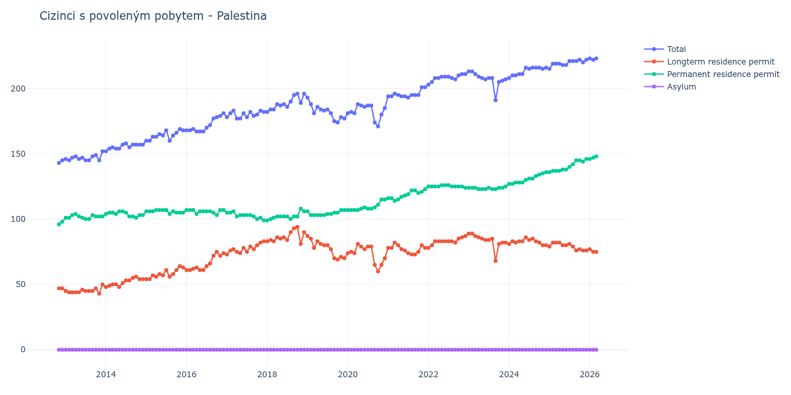

# Palestina

## Souhrnné statistiky (Min/Max pro rok) / Summary Statistics (Min/Max per year)

| Year   | Total     | Longterm Residence Permit   | Permanent Residence Permit   | Asylum   |
|--------|-----------|-----------------------------|------------------------------|----------|
| 2012   | 143 / 145 | 47 / 47                     | 96 / 98                      | 0 / 0    |
| 2013   | 145 / 152 | 43 / 50                     | 100 / 104                    | 0 / 0    |
| 2014   | 152 / 158 | 48 / 56                     | 101 / 106                    | 0 / 0    |
| 2015   | 160 / 169 | 54 / 64                     | 104 / 107                    | 0 / 0    |
| 2016   | 167 / 181 | 61 / 75                     | 103 / 107                    | 0 / 0    |
| 2017   | 177 / 183 | 73 / 83                     | 99 / 106                     | 0 / 0    |
| 2018   | 182 / 196 | 81 / 94                     | 99 / 108                     | 0 / 0    |
| 2019   | 174 / 193 | 69 / 87                     | 103 / 107                    | 0 / 0    |
| 2020   | 171 / 188 | 60 / 81                     | 107 / 115                    | 0 / 0    |
| 2021   | 193 / 201 | 73 / 82                     | 114 / 123                    | 0 / 0    |
| 2022   | 203 / 211 | 78 / 87                     | 124 / 126                    | 0 / 0    |
| 2023   | 191 / 213 | 68 / 89                     | 123 / 125                    | 0 / 0    |
| 2024   | 208 / 216 | 80 / 86                     | 127 / 136                    | 0 / 0    |
| 2025   | 215 / 222 | 76 / 82                     | 136 / 146                    | 0 / 0    |

## Detailní tabulka / Detailed Data Table

| Date     | Total        | Longterm Residence Permit   | Permanent Residence Permit   | Asylum   |
|----------|--------------|-----------------------------|------------------------------|----------|
| **2012** |              |                             |                              |          |
| 11.2012  | 143          | 47                          | 96                           | 0        |
| 12.2012  | 145 (+1.40%) | 47 (+0.00%)                 | 98 (+2.08%)                  | 0        |
| **2013** |              |                             |                              |          |
| 01.2013  | 146 (+0.69%) | 45 (-4.26%)                 | 101 (+3.06%)                 | 0        |
| 02.2013  | 145 (-0.68%) | 44 (-2.22%)                 | 101 (+0.00%)                 | 0        |
| 03.2013  | 147 (+1.38%) | 44 (+0.00%)                 | 103 (+1.98%)                 | 0        |
| 04.2013  | 148 (+0.68%) | 44 (+0.00%)                 | 104 (+0.97%)                 | 0        |
| 05.2013  | 146 (-1.35%) | 44 (+0.00%)                 | 102 (-1.92%)                 | 0        |
| 06.2013  | 147 (+0.68%) | 46 (+4.55%)                 | 101 (-0.98%)                 | 0        |
| 07.2013  | 145 (-1.36%) | 45 (-2.17%)                 | 100 (-0.99%)                 | 0        |
| 08.2013  | 145 (+0.00%) | 45 (+0.00%)                 | 100 (+0.00%)                 | 0        |
| 09.2013  | 148 (+2.07%) | 45 (+0.00%)                 | 103 (+3.00%)                 | 0        |
| 10.2013  | 149 (+0.68%) | 47 (+4.44%)                 | 102 (-0.97%)                 | 0        |
| 11.2013  | 145 (-2.68%) | 43 (-8.51%)                 | 102 (+0.00%)                 | 0        |
| 12.2013  | 152 (+4.83%) | 50 (+16.28%)                | 102 (+0.00%)                 | 0        |
| **2014** |              |                             |                              |          |
| 01.2014  | 152 (+0.00%) | 48 (-4.00%)                 | 104 (+1.96%)                 | 0        |
| 02.2014  | 154 (+1.32%) | 49 (+2.08%)                 | 105 (+0.96%)                 | 0        |
| 03.2014  | 155 (+0.65%) | 50 (+2.04%)                 | 105 (+0.00%)                 | 0        |
| 04.2014  | 154 (-0.65%) | 50 (+0.00%)                 | 104 (-0.95%)                 | 0        |
| 05.2014  | 154 (+0.00%) | 48 (-4.00%)                 | 106 (+1.92%)                 | 0        |
| 06.2014  | 157 (+1.95%) | 51 (+6.25%)                 | 106 (+0.00%)                 | 0        |
| 07.2014  | 158 (+0.64%) | 53 (+3.92%)                 | 105 (-0.94%)                 | 0        |
| 08.2014  | 155 (-1.90%) | 53 (+0.00%)                 | 102 (-2.86%)                 | 0        |
| 09.2014  | 157 (+1.29%) | 55 (+3.77%)                 | 102 (+0.00%)                 | 0        |
| 10.2014  | 157 (+0.00%) | 56 (+1.82%)                 | 101 (-0.98%)                 | 0        |
| 11.2014  | 157 (+0.00%) | 54 (-3.57%)                 | 103 (+1.98%)                 | 0        |
| 12.2014  | 157 (+0.00%) | 54 (+0.00%)                 | 103 (+0.00%)                 | 0        |
| **2015** |              |                             |                              |          |
| 01.2015  | 160 (+1.91%) | 54 (+0.00%)                 | 106 (+2.91%)                 | 0        |
| 02.2015  | 160 (+0.00%) | 54 (+0.00%)                 | 106 (+0.00%)                 | 0        |
| 03.2015  | 163 (+1.88%) | 57 (+5.56%)                 | 106 (+0.00%)                 | 0        |
| 04.2015  | 163 (+0.00%) | 56 (-1.75%)                 | 107 (+0.94%)                 | 0        |
| 05.2015  | 165 (+1.23%) | 58 (+3.57%)                 | 107 (+0.00%)                 | 0        |
| 06.2015  | 164 (-0.61%) | 57 (-1.72%)                 | 107 (+0.00%)                 | 0        |
| 07.2015  | 168 (+2.44%) | 61 (+7.02%)                 | 107 (+0.00%)                 | 0        |
| 08.2015  | 160 (-4.76%) | 56 (-8.20%)                 | 104 (-2.80%)                 | 0        |
| 09.2015  | 164 (+2.50%) | 58 (+3.57%)                 | 106 (+1.92%)                 | 0        |
| 10.2015  | 166 (+1.22%) | 61 (+5.17%)                 | 105 (-0.94%)                 | 0        |
| 11.2015  | 169 (+1.81%) | 64 (+4.92%)                 | 105 (+0.00%)                 | 0        |
| 12.2015  | 168 (-0.59%) | 63 (-1.56%)                 | 105 (+0.00%)                 | 0        |
| **2016** |              |                             |                              |          |
| 01.2016  | 168 (+0.00%) | 61 (-3.17%)                 | 107 (+1.90%)                 | 0        |
| 02.2016  | 168 (+0.00%) | 61 (+0.00%)                 | 107 (+0.00%)                 | 0        |
| 03.2016  | 169 (+0.60%) | 62 (+1.64%)                 | 107 (+0.00%)                 | 0        |
| 04.2016  | 167 (-1.18%) | 63 (+1.61%)                 | 104 (-2.80%)                 | 0        |
| 05.2016  | 167 (+0.00%) | 61 (-3.17%)                 | 106 (+1.92%)                 | 0        |
| 06.2016  | 167 (+0.00%) | 61 (+0.00%)                 | 106 (+0.00%)                 | 0        |
| 07.2016  | 170 (+1.80%) | 64 (+4.92%)                 | 106 (+0.00%)                 | 0        |
| 08.2016  | 172 (+1.18%) | 66 (+3.12%)                 | 106 (+0.00%)                 | 0        |
| 09.2016  | 177 (+2.91%) | 72 (+9.09%)                 | 105 (-0.94%)                 | 0        |
| 10.2016  | 178 (+0.56%) | 75 (+4.17%)                 | 103 (-1.90%)                 | 0        |
| 11.2016  | 179 (+0.56%) | 72 (-4.00%)                 | 107 (+3.88%)                 | 0        |
| 12.2016  | 181 (+1.12%) | 74 (+2.78%)                 | 107 (+0.00%)                 | 0        |
| **2017** |              |                             |                              |          |
| 01.2017  | 178 (-1.66%) | 73 (-1.35%)                 | 105 (-1.87%)                 | 0        |
| 02.2017  | 181 (+1.69%) | 76 (+4.11%)                 | 105 (+0.00%)                 | 0        |
| 03.2017  | 183 (+1.10%) | 77 (+1.32%)                 | 106 (+0.95%)                 | 0        |
| 04.2017  | 177 (-3.28%) | 75 (-2.60%)                 | 102 (-3.77%)                 | 0        |
| 05.2017  | 177 (+0.00%) | 74 (-1.33%)                 | 103 (+0.98%)                 | 0        |
| 06.2017  | 181 (+2.26%) | 78 (+5.41%)                 | 103 (+0.00%)                 | 0        |
| 07.2017  | 178 (-1.66%) | 75 (-3.85%)                 | 103 (+0.00%)                 | 0        |
| 08.2017  | 182 (+2.25%) | 79 (+5.33%)                 | 103 (+0.00%)                 | 0        |
| 09.2017  | 179 (-1.65%) | 77 (-2.53%)                 | 102 (-0.97%)                 | 0        |
| 10.2017  | 180 (+0.56%) | 80 (+3.90%)                 | 100 (-1.96%)                 | 0        |
| 11.2017  | 183 (+1.67%) | 82 (+2.50%)                 | 101 (+1.00%)                 | 0        |
| 12.2017  | 182 (-0.55%) | 83 (+1.22%)                 | 99 (-1.98%)                  | 0        |
| **2018** |              |                             |                              |          |
| 01.2018  | 182 (+0.00%) | 83 (+0.00%)                 | 99 (+0.00%)                  | 0        |
| 02.2018  | 184 (+1.10%) | 84 (+1.20%)                 | 100 (+1.01%)                 | 0        |
| 03.2018  | 184 (+0.00%) | 83 (-1.19%)                 | 101 (+1.00%)                 | 0        |
| 04.2018  | 188 (+2.17%) | 86 (+3.61%)                 | 102 (+0.99%)                 | 0        |
| 05.2018  | 187 (-0.53%) | 85 (-1.16%)                 | 102 (+0.00%)                 | 0        |
| 06.2018  | 188 (+0.53%) | 86 (+1.18%)                 | 102 (+0.00%)                 | 0        |
| 07.2018  | 186 (-1.06%) | 84 (-2.33%)                 | 102 (+0.00%)                 | 0        |
| 08.2018  | 190 (+2.15%) | 90 (+7.14%)                 | 100 (-1.96%)                 | 0        |
| 09.2018  | 195 (+2.63%) | 93 (+3.33%)                 | 102 (+2.00%)                 | 0        |
| 10.2018  | 196 (+0.51%) | 94 (+1.08%)                 | 102 (+0.00%)                 | 0        |
| 11.2018  | 189 (-3.57%) | 81 (-13.83%)                | 108 (+5.88%)                 | 0        |
| 12.2018  | 196 (+3.70%) | 90 (+11.11%)                | 106 (-1.85%)                 | 0        |
| **2019** |              |                             |                              |          |
| 01.2019  | 193 (-1.53%) | 87 (-3.33%)                 | 106 (+0.00%)                 | 0        |
| 02.2019  | 188 (-2.59%) | 85 (-2.30%)                 | 103 (-2.83%)                 | 0        |
| 03.2019  | 181 (-3.72%) | 78 (-8.24%)                 | 103 (+0.00%)                 | 0        |
| 04.2019  | 186 (+2.76%) | 83 (+6.41%)                 | 103 (+0.00%)                 | 0        |
| 05.2019  | 184 (-1.08%) | 81 (-2.41%)                 | 103 (+0.00%)                 | 0        |
| 06.2019  | 183 (-0.54%) | 80 (-1.23%)                 | 103 (+0.00%)                 | 0        |
| 07.2019  | 184 (+0.55%) | 80 (+0.00%)                 | 104 (+0.97%)                 | 0        |
| 08.2019  | 181 (-1.63%) | 77 (-3.75%)                 | 104 (+0.00%)                 | 0        |
| 09.2019  | 175 (-3.31%) | 70 (-9.09%)                 | 105 (+0.96%)                 | 0        |
| 10.2019  | 174 (-0.57%) | 69 (-1.43%)                 | 105 (+0.00%)                 | 0        |
| 11.2019  | 178 (+2.30%) | 71 (+2.90%)                 | 107 (+1.90%)                 | 0        |
| 12.2019  | 177 (-0.56%) | 70 (-1.41%)                 | 107 (+0.00%)                 | 0        |
| **2020** |              |                             |                              |          |
| 01.2020  | 181 (+2.26%) | 74 (+5.71%)                 | 107 (+0.00%)                 | 0        |
| 02.2020  | 182 (+0.55%) | 75 (+1.35%)                 | 107 (+0.00%)                 | 0        |
| 03.2020  | 181 (-0.55%) | 74 (-1.33%)                 | 107 (+0.00%)                 | 0        |
| 04.2020  | 188 (+3.87%) | 81 (+9.46%)                 | 107 (+0.00%)                 | 0        |
| 05.2020  | 187 (-0.53%) | 79 (-2.47%)                 | 108 (+0.93%)                 | 0        |
| 06.2020  | 186 (-0.53%) | 77 (-2.53%)                 | 109 (+0.93%)                 | 0        |
| 07.2020  | 187 (+0.54%) | 79 (+2.60%)                 | 108 (-0.92%)                 | 0        |
| 08.2020  | 187 (+0.00%) | 79 (+0.00%)                 | 108 (+0.00%)                 | 0        |
| 09.2020  | 174 (-6.95%) | 65 (-17.72%)                | 109 (+0.93%)                 | 0        |
| 10.2020  | 171 (-1.72%) | 60 (-7.69%)                 | 111 (+1.83%)                 | 0        |
| 11.2020  | 180 (+5.26%) | 65 (+8.33%)                 | 115 (+3.60%)                 | 0        |
| 12.2020  | 185 (+2.78%) | 70 (+7.69%)                 | 115 (+0.00%)                 | 0        |
| **2021** |              |                             |                              |          |
| 01.2021  | 194 (+4.86%) | 78 (+11.43%)                | 116 (+0.87%)                 | 0        |
| 02.2021  | 194 (+0.00%) | 78 (+0.00%)                 | 116 (+0.00%)                 | 0        |
| 03.2021  | 196 (+1.03%) | 82 (+5.13%)                 | 114 (-1.72%)                 | 0        |
| 04.2021  | 195 (-0.51%) | 80 (-2.44%)                 | 115 (+0.88%)                 | 0        |
| 05.2021  | 194 (-0.51%) | 77 (-3.75%)                 | 117 (+1.74%)                 | 0        |
| 06.2021  | 194 (+0.00%) | 76 (-1.30%)                 | 118 (+0.85%)                 | 0        |
| 07.2021  | 193 (-0.52%) | 74 (-2.63%)                 | 119 (+0.85%)                 | 0        |
| 08.2021  | 195 (+1.04%) | 73 (-1.35%)                 | 122 (+2.52%)                 | 0        |
| 09.2021  | 195 (+0.00%) | 73 (+0.00%)                 | 122 (+0.00%)                 | 0        |
| 10.2021  | 195 (+0.00%) | 75 (+2.74%)                 | 120 (-1.64%)                 | 0        |
| 11.2021  | 201 (+3.08%) | 80 (+6.67%)                 | 121 (+0.83%)                 | 0        |
| 12.2021  | 201 (+0.00%) | 78 (-2.50%)                 | 123 (+1.65%)                 | 0        |
| **2022** |              |                             |                              |          |
| 01.2022  | 203 (+1.00%) | 78 (+0.00%)                 | 125 (+1.63%)                 | 0        |
| 02.2022  | 205 (+0.99%) | 80 (+2.56%)                 | 125 (+0.00%)                 | 0        |
| 03.2022  | 208 (+1.46%) | 83 (+3.75%)                 | 125 (+0.00%)                 | 0        |
| 04.2022  | 208 (+0.00%) | 83 (+0.00%)                 | 125 (+0.00%)                 | 0        |
| 05.2022  | 209 (+0.48%) | 83 (+0.00%)                 | 126 (+0.80%)                 | 0        |
| 06.2022  | 209 (+0.00%) | 83 (+0.00%)                 | 126 (+0.00%)                 | 0        |
| 07.2022  | 209 (+0.00%) | 83 (+0.00%)                 | 126 (+0.00%)                 | 0        |
| 08.2022  | 208 (-0.48%) | 83 (+0.00%)                 | 125 (-0.79%)                 | 0        |
| 09.2022  | 207 (-0.48%) | 82 (-1.20%)                 | 125 (+0.00%)                 | 0        |
| 10.2022  | 210 (+1.45%) | 85 (+3.66%)                 | 125 (+0.00%)                 | 0        |
| 11.2022  | 211 (+0.48%) | 86 (+1.18%)                 | 125 (+0.00%)                 | 0        |
| 12.2022  | 211 (+0.00%) | 87 (+1.16%)                 | 124 (-0.80%)                 | 0        |
| **2023** |              |                             |                              |          |
| 01.2023  | 213 (+0.95%) | 89 (+2.30%)                 | 124 (+0.00%)                 | 0        |
| 02.2023  | 213 (+0.00%) | 89 (+0.00%)                 | 124 (+0.00%)                 | 0        |
| 03.2023  | 211 (-0.94%) | 87 (-2.25%)                 | 124 (+0.00%)                 | 0        |
| 04.2023  | 209 (-0.95%) | 86 (-1.15%)                 | 123 (-0.81%)                 | 0        |
| 05.2023  | 208 (-0.48%) | 85 (-1.16%)                 | 123 (+0.00%)                 | 0        |
| 06.2023  | 207 (-0.48%) | 84 (-1.18%)                 | 123 (+0.00%)                 | 0        |
| 07.2023  | 208 (+0.48%) | 84 (+0.00%)                 | 124 (+0.81%)                 | 0        |
| 08.2023  | 208 (+0.00%) | 85 (+1.19%)                 | 123 (-0.81%)                 | 0        |
| 09.2023  | 191 (-8.17%) | 68 (-20.00%)                | 123 (+0.00%)                 | 0        |
| 10.2023  | 205 (+7.33%) | 81 (+19.12%)                | 124 (+0.81%)                 | 0        |
| 11.2023  | 206 (+0.49%) | 82 (+1.23%)                 | 124 (+0.00%)                 | 0        |
| 12.2023  | 207 (+0.49%) | 82 (+0.00%)                 | 125 (+0.81%)                 | 0        |
| **2024** |              |                             |                              |          |
| 01.2024  | 208 (+0.48%) | 81 (-1.22%)                 | 127 (+1.60%)                 | 0        |
| 02.2024  | 210 (+0.96%) | 83 (+2.47%)                 | 127 (+0.00%)                 | 0        |
| 03.2024  | 210 (+0.00%) | 82 (-1.20%)                 | 128 (+0.79%)                 | 0        |
| 04.2024  | 211 (+0.48%) | 83 (+1.22%)                 | 128 (+0.00%)                 | 0        |
| 05.2024  | 211 (+0.00%) | 83 (+0.00%)                 | 128 (+0.00%)                 | 0        |
| 06.2024  | 216 (+2.37%) | 86 (+3.61%)                 | 130 (+1.56%)                 | 0        |
| 07.2024  | 215 (-0.46%) | 84 (-2.33%)                 | 131 (+0.77%)                 | 0        |
| 08.2024  | 216 (+0.47%) | 85 (+1.19%)                 | 131 (+0.00%)                 | 0        |
| 09.2024  | 216 (+0.00%) | 83 (-2.35%)                 | 133 (+1.53%)                 | 0        |
| 10.2024  | 216 (+0.00%) | 82 (-1.20%)                 | 134 (+0.75%)                 | 0        |
| 11.2024  | 215 (-0.46%) | 80 (-2.44%)                 | 135 (+0.75%)                 | 0        |
| 12.2024  | 216 (+0.47%) | 80 (+0.00%)                 | 136 (+0.74%)                 | 0        |
| **2025** |              |                             |                              |          |
| 01.2025  | 215 (-0.46%) | 79 (-1.25%)                 | 136 (+0.00%)                 | 0        |
| 02.2025  | 219 (+1.86%) | 82 (+3.80%)                 | 137 (+0.74%)                 | 0        |
| 03.2025  | 219 (+0.00%) | 82 (+0.00%)                 | 137 (+0.00%)                 | 0        |
| 04.2025  | 219 (+0.00%) | 82 (+0.00%)                 | 137 (+0.00%)                 | 0        |
| 05.2025  | 218 (-0.46%) | 80 (-2.44%)                 | 138 (+0.73%)                 | 0        |
| 06.2025  | 218 (+0.00%) | 80 (+0.00%)                 | 138 (+0.00%)                 | 0        |
| 07.2025  | 221 (+1.38%) | 81 (+1.25%)                 | 140 (+1.45%)                 | 0        |
| 08.2025  | 221 (+0.00%) | 79 (-2.47%)                 | 142 (+1.43%)                 | 0        |
| 09.2025  | 221 (+0.00%) | 76 (-3.80%)                 | 145 (+2.11%)                 | 0        |
| 10.2025  | 222 (+0.45%) | 77 (+1.32%)                 | 145 (+0.00%)                 | 0        |
| 11.2025  | 220 (-0.90%) | 76 (-1.30%)                 | 144 (-0.69%)                 | 0        |
| 12.2025  | 222 (+0.91%) | 76 (+0.00%)                 | 146 (+1.39%)                 | 0        |
