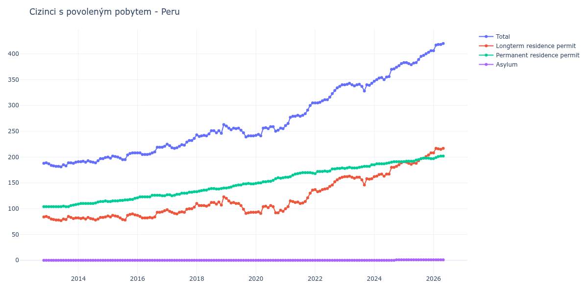

# Peru

## Souhrnné statistiky (Min/Max pro rok) / Summary Statistics (Min/Max per year)

| Year   | Total     | Longterm Residence Permit   | Permanent Residence Permit   | Asylum   |
|--------|-----------|-----------------------------|------------------------------|----------|
| 2012   | 188 / 189 | 84 / 85                     | 104 / 104                    | 0 / 0    |
| 2013   | 181 / 190 | 77 / 85                     | 104 / 108                    | 0 / 0    |
| 2014   | 189 / 199 | 78 / 84                     | 109 / 115                    | 0 / 0    |
| 2015   | 195 / 208 | 78 / 90                     | 114 / 120                    | 0 / 0    |
| 2016   | 205 / 221 | 82 / 96                     | 121 / 126                    | 0 / 0    |
| 2017   | 217 / 236 | 90 / 103                    | 125 / 133                    | 0 / 0    |
| 2018   | 240 / 263 | 105 / 123                   | 133 / 140                    | 0 / 0    |
| 2019   | 239 / 260 | 91 / 120                    | 140 / 149                    | 0 / 0    |
| 2020   | 241 / 259 | 91 / 106                    | 149 / 160                    | 0 / 0    |
| 2021   | 261 / 305 | 100 / 136                   | 161 / 170                    | 0 / 0    |
| 2022   | 305 / 340 | 133 / 161                   | 168 / 179                    | 0 / 0    |
| 2023   | 328 / 343 | 146 / 163                   | 178 / 185                    | 0 / 0    |
| 2024   | 347 / 381 | 162 / 189                   | 185 / 191                    | 0 / 1    |
| 2025   | 379 / 406 | 186 / 208                   | 191 / 198                    | 1 / 1    |
| 2026   | 406 / 420 | 208 / 217                   | 197 / 202                    | 1 / 1    |

## Detailní tabulka / Detailed Data Table

| Date     | Total        | Longterm Residence Permit   | Permanent Residence Permit   | Asylum     |
|----------|--------------|-----------------------------|------------------------------|------------|
| **2012** |              |                             |                              |            |
| 11.2012  | 188          | 84                          | 104                          | 0          |
| 12.2012  | 189 (+0.53%) | 85 (+1.19%)                 | 104 (+0.00%)                 | 0          |
| **2013** |              |                             |                              |            |
| 01.2013  | 187 (-1.06%) | 83 (-2.35%)                 | 104 (+0.00%)                 | 0          |
| 02.2013  | 184 (-1.60%) | 80 (-3.61%)                 | 104 (+0.00%)                 | 0          |
| 03.2013  | 183 (-0.54%) | 79 (-1.25%)                 | 104 (+0.00%)                 | 0          |
| 04.2013  | 182 (-0.55%) | 78 (-1.27%)                 | 104 (+0.00%)                 | 0          |
| 05.2013  | 182 (+0.00%) | 78 (+0.00%)                 | 104 (+0.00%)                 | 0          |
| 06.2013  | 181 (-0.55%) | 77 (-1.28%)                 | 104 (+0.00%)                 | 0          |
| 07.2013  | 185 (+2.21%) | 80 (+3.90%)                 | 105 (+0.96%)                 | 0          |
| 08.2013  | 183 (-1.08%) | 79 (-1.25%)                 | 104 (-0.95%)                 | 0          |
| 09.2013  | 189 (+3.28%) | 85 (+7.59%)                 | 104 (+0.00%)                 | 0          |
| 10.2013  | 189 (+0.00%) | 83 (-2.35%)                 | 106 (+1.92%)                 | 0          |
| 11.2013  | 188 (-0.53%) | 81 (-2.41%)                 | 107 (+0.94%)                 | 0          |
| 12.2013  | 190 (+1.06%) | 82 (+1.23%)                 | 108 (+0.93%)                 | 0          |
| **2014** |              |                             |                              |            |
| 01.2014  | 191 (+0.53%) | 82 (+0.00%)                 | 109 (+0.93%)                 | 0          |
| 02.2014  | 191 (+0.00%) | 81 (-1.22%)                 | 110 (+0.92%)                 | 0          |
| 03.2014  | 192 (+0.52%) | 82 (+1.23%)                 | 110 (+0.00%)                 | 0          |
| 04.2014  | 190 (-1.04%) | 80 (-2.44%)                 | 110 (+0.00%)                 | 0          |
| 05.2014  | 193 (+1.58%) | 83 (+3.75%)                 | 110 (+0.00%)                 | 0          |
| 06.2014  | 191 (-1.04%) | 81 (-2.41%)                 | 110 (+0.00%)                 | 0          |
| 07.2014  | 190 (-0.52%) | 80 (-1.23%)                 | 110 (+0.00%)                 | 0          |
| 08.2014  | 189 (-0.53%) | 78 (-2.50%)                 | 111 (+0.91%)                 | 0          |
| 09.2014  | 193 (+2.12%) | 80 (+2.56%)                 | 113 (+1.80%)                 | 0          |
| 10.2014  | 197 (+2.07%) | 83 (+3.75%)                 | 114 (+0.88%)                 | 0          |
| 11.2014  | 197 (+0.00%) | 83 (+0.00%)                 | 114 (+0.00%)                 | 0          |
| 12.2014  | 199 (+1.02%) | 84 (+1.20%)                 | 115 (+0.88%)                 | 0          |
| **2015** |              |                             |                              |            |
| 01.2015  | 200 (+0.50%) | 86 (+2.38%)                 | 114 (-0.87%)                 | 0          |
| 02.2015  | 198 (-1.00%) | 84 (-2.33%)                 | 114 (+0.00%)                 | 0          |
| 03.2015  | 202 (+2.02%) | 87 (+3.57%)                 | 115 (+0.88%)                 | 0          |
| 04.2015  | 201 (-0.50%) | 86 (-1.15%)                 | 115 (+0.00%)                 | 0          |
| 05.2015  | 200 (-0.50%) | 85 (-1.16%)                 | 115 (+0.00%)                 | 0          |
| 06.2015  | 198 (-1.00%) | 82 (-3.53%)                 | 116 (+0.87%)                 | 0          |
| 07.2015  | 195 (-1.52%) | 79 (-3.66%)                 | 116 (+0.00%)                 | 0          |
| 08.2015  | 195 (+0.00%) | 78 (-1.27%)                 | 117 (+0.86%)                 | 0          |
| 09.2015  | 204 (+4.62%) | 87 (+11.54%)                | 117 (+0.00%)                 | 0          |
| 10.2015  | 207 (+1.47%) | 89 (+2.30%)                 | 118 (+0.85%)                 | 0          |
| 11.2015  | 208 (+0.48%) | 90 (+1.12%)                 | 118 (+0.00%)                 | 0          |
| 12.2015  | 208 (+0.00%) | 88 (-2.22%)                 | 120 (+1.69%)                 | 0          |
| **2016** |              |                             |                              |            |
| 01.2016  | 208 (+0.00%) | 87 (-1.14%)                 | 121 (+0.83%)                 | 0          |
| 02.2016  | 208 (+0.00%) | 85 (-2.30%)                 | 123 (+1.65%)                 | 0          |
| 03.2016  | 205 (-1.44%) | 82 (-3.53%)                 | 123 (+0.00%)                 | 0          |
| 04.2016  | 205 (+0.00%) | 82 (+0.00%)                 | 123 (+0.00%)                 | 0          |
| 05.2016  | 205 (+0.00%) | 82 (+0.00%)                 | 123 (+0.00%)                 | 0          |
| 06.2016  | 206 (+0.49%) | 83 (+1.22%)                 | 123 (+0.00%)                 | 0          |
| 07.2016  | 208 (+0.97%) | 82 (-1.20%)                 | 126 (+2.44%)                 | 0          |
| 08.2016  | 210 (+0.96%) | 84 (+2.44%)                 | 126 (+0.00%)                 | 0          |
| 09.2016  | 219 (+4.29%) | 93 (+10.71%)                | 126 (+0.00%)                 | 0          |
| 10.2016  | 219 (+0.00%) | 93 (+0.00%)                 | 126 (+0.00%)                 | 0          |
| 11.2016  | 219 (+0.00%) | 94 (+1.08%)                 | 125 (-0.79%)                 | 0          |
| 12.2016  | 221 (+0.91%) | 96 (+2.13%)                 | 125 (+0.00%)                 | 0          |
| **2017** |              |                             |                              |            |
| 01.2017  | 225 (+1.81%) | 98 (+2.08%)                 | 127 (+1.60%)                 | 0          |
| 02.2017  | 222 (-1.33%) | 95 (-3.06%)                 | 127 (+0.00%)                 | 0          |
| 03.2017  | 218 (-1.80%) | 93 (-2.11%)                 | 125 (-1.57%)                 | 0          |
| 04.2017  | 217 (-0.46%) | 91 (-2.15%)                 | 126 (+0.80%)                 | 0          |
| 05.2017  | 218 (+0.46%) | 90 (-1.10%)                 | 128 (+1.59%)                 | 0          |
| 06.2017  | 221 (+1.38%) | 93 (+3.33%)                 | 128 (+0.00%)                 | 0          |
| 07.2017  | 224 (+1.36%) | 94 (+1.08%)                 | 130 (+1.56%)                 | 0          |
| 08.2017  | 223 (-0.45%) | 93 (-1.06%)                 | 130 (+0.00%)                 | 0          |
| 09.2017  | 229 (+2.69%) | 99 (+6.45%)                 | 130 (+0.00%)                 | 0          |
| 10.2017  | 232 (+1.31%) | 100 (+1.01%)                | 132 (+1.54%)                 | 0          |
| 11.2017  | 232 (+0.00%) | 100 (+0.00%)                | 132 (+0.00%)                 | 0          |
| 12.2017  | 236 (+1.72%) | 103 (+3.00%)                | 133 (+0.76%)                 | 0          |
| **2018** |              |                             |                              |            |
| 01.2018  | 243 (+2.97%) | 110 (+6.80%)                | 133 (+0.00%)                 | 0          |
| 02.2018  | 240 (-1.23%) | 106 (-3.64%)                | 134 (+0.75%)                 | 0          |
| 03.2018  | 241 (+0.42%) | 106 (+0.00%)                | 135 (+0.75%)                 | 0          |
| 04.2018  | 242 (+0.41%) | 106 (+0.00%)                | 136 (+0.74%)                 | 0          |
| 05.2018  | 241 (-0.41%) | 105 (-0.94%)                | 136 (+0.00%)                 | 0          |
| 06.2018  | 245 (+1.66%) | 107 (+1.90%)                | 138 (+1.47%)                 | 0          |
| 07.2018  | 251 (+2.45%) | 112 (+4.67%)                | 139 (+0.72%)                 | 0          |
| 08.2018  | 251 (+0.00%) | 112 (+0.00%)                | 139 (+0.00%)                 | 0          |
| 09.2018  | 247 (-1.59%) | 109 (-2.68%)                | 138 (-0.72%)                 | 0          |
| 10.2018  | 251 (+1.62%) | 113 (+3.67%)                | 138 (+0.00%)                 | 0          |
| 11.2018  | 246 (-1.99%) | 107 (-5.31%)                | 139 (+0.72%)                 | 0          |
| 12.2018  | 263 (+6.91%) | 123 (+14.95%)               | 140 (+0.72%)                 | 0          |
| **2019** |              |                             |                              |            |
| 01.2019  | 260 (-1.14%) | 120 (-2.44%)                | 140 (+0.00%)                 | 0          |
| 02.2019  | 256 (-1.54%) | 115 (-4.17%)                | 141 (+0.71%)                 | 0          |
| 03.2019  | 253 (-1.17%) | 111 (-3.48%)                | 142 (+0.71%)                 | 0          |
| 04.2019  | 256 (+1.19%) | 112 (+0.90%)                | 144 (+1.41%)                 | 0          |
| 05.2019  | 255 (-0.39%) | 110 (-1.79%)                | 145 (+0.69%)                 | 0          |
| 06.2019  | 256 (+0.39%) | 110 (+0.00%)                | 146 (+0.69%)                 | 0          |
| 07.2019  | 252 (-1.56%) | 106 (-3.64%)                | 146 (+0.00%)                 | 0          |
| 08.2019  | 247 (-1.98%) | 99 (-6.60%)                 | 148 (+1.37%)                 | 0          |
| 09.2019  | 239 (-3.24%) | 91 (-8.08%)                 | 148 (+0.00%)                 | 0          |
| 10.2019  | 241 (+0.84%) | 92 (+1.10%)                 | 149 (+0.68%)                 | 0          |
| 11.2019  | 241 (+0.00%) | 93 (+1.09%)                 | 148 (-0.67%)                 | 0          |
| 12.2019  | 241 (+0.00%) | 93 (+0.00%)                 | 148 (+0.00%)                 | 0          |
| **2020** |              |                             |                              |            |
| 01.2020  | 242 (+0.41%) | 93 (+0.00%)                 | 149 (+0.68%)                 | 0          |
| 02.2020  | 244 (+0.83%) | 94 (+1.08%)                 | 150 (+0.67%)                 | 0          |
| 03.2020  | 241 (-1.23%) | 91 (-3.19%)                 | 150 (+0.00%)                 | 0          |
| 04.2020  | 256 (+6.22%) | 104 (+14.29%)               | 152 (+1.33%)                 | 0          |
| 05.2020  | 257 (+0.39%) | 105 (+0.96%)                | 152 (+0.00%)                 | 0          |
| 06.2020  | 255 (-0.78%) | 102 (-2.86%)                | 153 (+0.66%)                 | 0          |
| 07.2020  | 259 (+1.57%) | 106 (+3.92%)                | 153 (+0.00%)                 | 0          |
| 08.2020  | 259 (+0.00%) | 104 (-1.89%)                | 155 (+1.31%)                 | 0          |
| 09.2020  | 250 (-3.47%) | 92 (-11.54%)                | 158 (+1.94%)                 | 0          |
| 10.2020  | 252 (+0.80%) | 92 (+0.00%)                 | 160 (+1.27%)                 | 0          |
| 11.2020  | 256 (+1.59%) | 97 (+5.43%)                 | 159 (-0.62%)                 | 0          |
| 12.2020  | 255 (-0.39%) | 95 (-2.06%)                 | 160 (+0.63%)                 | 0          |
| **2021** |              |                             |                              |            |
| 01.2021  | 261 (+2.35%) | 100 (+5.26%)                | 161 (+0.63%)                 | 0          |
| 02.2021  | 265 (+1.53%) | 104 (+4.00%)                | 161 (+0.00%)                 | 0          |
| 03.2021  | 277 (+4.53%) | 115 (+10.58%)               | 162 (+0.62%)                 | 0          |
| 04.2021  | 279 (+0.72%) | 114 (-0.87%)                | 165 (+1.85%)                 | 0          |
| 05.2021  | 279 (+0.00%) | 112 (-1.75%)                | 167 (+1.21%)                 | 0          |
| 06.2021  | 281 (+0.72%) | 113 (+0.89%)                | 168 (+0.60%)                 | 0          |
| 07.2021  | 279 (-0.71%) | 110 (-2.65%)                | 169 (+0.60%)                 | 0          |
| 08.2021  | 281 (+0.72%) | 111 (+0.91%)                | 170 (+0.59%)                 | 0          |
| 09.2021  | 284 (+1.07%) | 114 (+2.70%)                | 170 (+0.00%)                 | 0          |
| 10.2021  | 291 (+2.46%) | 121 (+6.14%)                | 170 (+0.00%)                 | 0          |
| 11.2021  | 300 (+3.09%) | 130 (+7.44%)                | 170 (+0.00%)                 | 0          |
| 12.2021  | 305 (+1.67%) | 136 (+4.62%)                | 169 (-0.59%)                 | 0          |
| **2022** |              |                             |                              |            |
| 01.2022  | 305 (+0.00%) | 137 (+0.74%)                | 168 (-0.59%)                 | 0          |
| 02.2022  | 305 (+0.00%) | 133 (-2.92%)                | 172 (+2.38%)                 | 0          |
| 03.2022  | 306 (+0.33%) | 134 (+0.75%)                | 172 (+0.00%)                 | 0          |
| 04.2022  | 309 (+0.98%) | 137 (+2.24%)                | 172 (+0.00%)                 | 0          |
| 05.2022  | 311 (+0.65%) | 138 (+0.73%)                | 173 (+0.58%)                 | 0          |
| 06.2022  | 311 (+0.00%) | 139 (+0.72%)                | 172 (-0.58%)                 | 0          |
| 07.2022  | 316 (+1.61%) | 143 (+2.88%)                | 173 (+0.58%)                 | 0          |
| 08.2022  | 323 (+2.22%) | 146 (+2.10%)                | 177 (+2.31%)                 | 0          |
| 09.2022  | 329 (+1.86%) | 152 (+4.11%)                | 177 (+0.00%)                 | 0          |
| 10.2022  | 334 (+1.52%) | 156 (+2.63%)                | 178 (+0.56%)                 | 0          |
| 11.2022  | 337 (+0.90%) | 159 (+1.92%)                | 178 (+0.00%)                 | 0          |
| 12.2022  | 340 (+0.89%) | 161 (+1.26%)                | 179 (+0.56%)                 | 0          |
| **2023** |              |                             |                              |            |
| 01.2023  | 340 (+0.00%) | 162 (+0.62%)                | 178 (-0.56%)                 | 0          |
| 02.2023  | 341 (+0.29%) | 162 (+0.00%)                | 179 (+0.56%)                 | 0          |
| 03.2023  | 343 (+0.59%) | 163 (+0.62%)                | 180 (+0.56%)                 | 0          |
| 04.2023  | 340 (-0.87%) | 161 (-1.23%)                | 179 (-0.56%)                 | 0          |
| 05.2023  | 338 (-0.59%) | 159 (-1.24%)                | 179 (+0.00%)                 | 0          |
| 06.2023  | 340 (+0.59%) | 161 (+1.26%)                | 179 (+0.00%)                 | 0          |
| 07.2023  | 341 (+0.29%) | 161 (+0.00%)                | 180 (+0.56%)                 | 0          |
| 08.2023  | 337 (-1.17%) | 156 (-3.11%)                | 181 (+0.56%)                 | 0          |
| 09.2023  | 328 (-2.67%) | 146 (-6.41%)                | 182 (+0.55%)                 | 0          |
| 10.2023  | 340 (+3.66%) | 158 (+8.22%)                | 182 (+0.00%)                 | 0          |
| 11.2023  | 339 (-0.29%) | 157 (-0.63%)                | 182 (+0.00%)                 | 0          |
| 12.2023  | 343 (+1.18%) | 158 (+0.64%)                | 185 (+1.65%)                 | 0          |
| **2024** |              |                             |                              |            |
| 01.2024  | 347 (+1.17%) | 162 (+2.53%)                | 185 (+0.00%)                 | 0          |
| 02.2024  | 350 (+0.86%) | 163 (+0.62%)                | 187 (+1.08%)                 | 0          |
| 03.2024  | 353 (+0.86%) | 166 (+1.84%)                | 187 (+0.00%)                 | 0          |
| 04.2024  | 354 (+0.28%) | 167 (+0.60%)                | 187 (+0.00%)                 | 0          |
| 05.2024  | 350 (-1.13%) | 163 (-2.40%)                | 187 (+0.00%)                 | 0          |
| 06.2024  | 355 (+1.43%) | 167 (+2.45%)                | 188 (+0.53%)                 | 0          |
| 07.2024  | 356 (+0.28%) | 167 (+0.00%)                | 189 (+0.53%)                 | 0          |
| 08.2024  | 370 (+3.93%) | 180 (+7.78%)                | 190 (+0.53%)                 | 0          |
| 09.2024  | 371 (+0.27%) | 180 (+0.00%)                | 191 (+0.53%)                 | 0          |
| 10.2024  | 374 (+0.81%) | 182 (+1.11%)                | 191 (+0.00%)                 | 1          |
| 11.2024  | 377 (+0.80%) | 185 (+1.65%)                | 191 (+0.00%)                 | 1 (+0.00%) |
| 12.2024  | 381 (+1.06%) | 189 (+2.16%)                | 191 (+0.00%)                 | 1 (+0.00%) |
| **2025** |              |                             |                              |            |
| 01.2025  | 383 (+0.52%) | 191 (+1.06%)                | 191 (+0.00%)                 | 1 (+0.00%) |
| 02.2025  | 383 (+0.00%) | 190 (-0.52%)                | 192 (+0.52%)                 | 1 (+0.00%) |
| 03.2025  | 381 (-0.52%) | 188 (-1.05%)                | 192 (+0.00%)                 | 1 (+0.00%) |
| 04.2025  | 379 (-0.52%) | 186 (-1.06%)                | 192 (+0.00%)                 | 1 (+0.00%) |
| 05.2025  | 382 (+0.79%) | 189 (+1.61%)                | 192 (+0.00%)                 | 1 (+0.00%) |
| 06.2025  | 383 (+0.26%) | 188 (-0.53%)                | 194 (+1.04%)                 | 1 (+0.00%) |
| 07.2025  | 389 (+1.57%) | 193 (+2.66%)                | 195 (+0.52%)                 | 1 (+0.00%) |
| 08.2025  | 395 (+1.54%) | 197 (+2.07%)                | 197 (+1.03%)                 | 1 (+0.00%) |
| 09.2025  | 397 (+0.51%) | 198 (+0.51%)                | 198 (+0.51%)                 | 1 (+0.00%) |
| 10.2025  | 400 (+0.76%) | 201 (+1.52%)                | 198 (+0.00%)                 | 1 (+0.00%) |
| 11.2025  | 403 (+0.75%) | 204 (+1.49%)                | 198 (+0.00%)                 | 1 (+0.00%) |
| 12.2025  | 406 (+0.74%) | 208 (+1.96%)                | 197 (-0.51%)                 | 1 (+0.00%) |
| **2026** |              |                             |                              |            |
| 01.2026  | 406 (+0.00%) | 208 (+0.00%)                | 197 (+0.00%)                 | 1 (+0.00%) |
| 02.2026  | 417 (+2.71%) | 217 (+4.33%)                | 199 (+1.02%)                 | 1 (+0.00%) |
| 03.2026  | 418 (+0.24%) | 216 (-0.46%)                | 201 (+1.01%)                 | 1 (+0.00%) |
| 04.2026  | 418 (+0.00%) | 215 (-0.46%)                | 202 (+0.50%)                 | 1 (+0.00%) |
| 05.2026  | 420 (+0.48%) | 217 (+0.93%)                | 202 (+0.00%)                 | 1 (+0.00%) |
