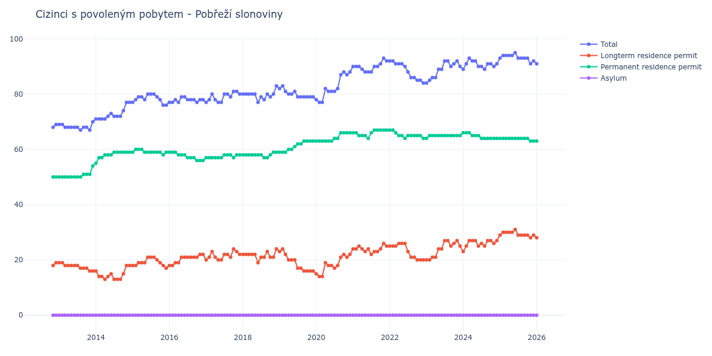

# Pobřeží slonoviny

## Souhrnné statistiky (Min/Max pro rok) / Summary Statistics (Min/Max per year)

| Year   | Total   | Longterm Residence Permit   | Permanent Residence Permit   | Asylum   |
|--------|---------|-----------------------------|------------------------------|----------|
| 2012   | 68 / 69 | 18 / 19                     | 50 / 50                      | 0 / 0    |
| 2013   | 67 / 70 | 16 / 19                     | 50 / 54                      | 0 / 0    |
| 2014   | 71 / 77 | 13 / 18                     | 55 / 59                      | 0 / 0    |
| 2015   | 76 / 80 | 17 / 21                     | 58 / 60                      | 0 / 0    |
| 2016   | 77 / 79 | 18 / 22                     | 56 / 59                      | 0 / 0    |
| 2017   | 77 / 81 | 20 / 24                     | 57 / 58                      | 0 / 0    |
| 2018   | 77 / 83 | 19 / 24                     | 57 / 59                      | 0 / 0    |
| 2019   | 79 / 83 | 16 / 24                     | 59 / 63                      | 0 / 0    |
| 2020   | 77 / 88 | 14 / 22                     | 63 / 66                      | 0 / 0    |
| 2021   | 88 / 93 | 22 / 26                     | 64 / 67                      | 0 / 0    |
| 2022   | 84 / 92 | 20 / 26                     | 64 / 67                      | 0 / 0    |
| 2023   | 84 / 92 | 20 / 27                     | 64 / 65                      | 0 / 0    |
| 2024   | 89 / 93 | 23 / 27                     | 64 / 66                      | 0 / 0    |
| 2025   | 91 / 95 | 28 / 31                     | 63 / 64                      | 0 / 0    |
| 2026   | 91 / 91 | 28 / 28                     | 63 / 63                      | 0 / 0    |

## Detailní tabulka / Detailed Data Table

| Date     | Total       | Longterm Residence Permit   | Permanent Residence Permit   | Asylum   |
|----------|-------------|-----------------------------|------------------------------|----------|
| **2012** |             |                             |                              |          |
| 11.2012  | 68          | 18                          | 50                           | 0        |
| 12.2012  | 69 (+1.47%) | 19 (+5.56%)                 | 50 (+0.00%)                  | 0        |
| **2013** |             |                             |                              |          |
| 01.2013  | 69 (+0.00%) | 19 (+0.00%)                 | 50 (+0.00%)                  | 0        |
| 02.2013  | 69 (+0.00%) | 19 (+0.00%)                 | 50 (+0.00%)                  | 0        |
| 03.2013  | 68 (-1.45%) | 18 (-5.26%)                 | 50 (+0.00%)                  | 0        |
| 04.2013  | 68 (+0.00%) | 18 (+0.00%)                 | 50 (+0.00%)                  | 0        |
| 05.2013  | 68 (+0.00%) | 18 (+0.00%)                 | 50 (+0.00%)                  | 0        |
| 06.2013  | 68 (+0.00%) | 18 (+0.00%)                 | 50 (+0.00%)                  | 0        |
| 07.2013  | 68 (+0.00%) | 18 (+0.00%)                 | 50 (+0.00%)                  | 0        |
| 08.2013  | 67 (-1.47%) | 17 (-5.56%)                 | 50 (+0.00%)                  | 0        |
| 09.2013  | 68 (+1.49%) | 17 (+0.00%)                 | 51 (+2.00%)                  | 0        |
| 10.2013  | 68 (+0.00%) | 17 (+0.00%)                 | 51 (+0.00%)                  | 0        |
| 11.2013  | 67 (-1.47%) | 16 (-5.88%)                 | 51 (+0.00%)                  | 0        |
| 12.2013  | 70 (+4.48%) | 16 (+0.00%)                 | 54 (+5.88%)                  | 0        |
| **2014** |             |                             |                              |          |
| 01.2014  | 71 (+1.43%) | 16 (+0.00%)                 | 55 (+1.85%)                  | 0        |
| 02.2014  | 71 (+0.00%) | 14 (-12.50%)                | 57 (+3.64%)                  | 0        |
| 03.2014  | 71 (+0.00%) | 14 (+0.00%)                 | 57 (+0.00%)                  | 0        |
| 04.2014  | 71 (+0.00%) | 13 (-7.14%)                 | 58 (+1.75%)                  | 0        |
| 05.2014  | 72 (+1.41%) | 14 (+7.69%)                 | 58 (+0.00%)                  | 0        |
| 06.2014  | 73 (+1.39%) | 15 (+7.14%)                 | 58 (+0.00%)                  | 0        |
| 07.2014  | 72 (-1.37%) | 13 (-13.33%)                | 59 (+1.72%)                  | 0        |
| 08.2014  | 72 (+0.00%) | 13 (+0.00%)                 | 59 (+0.00%)                  | 0        |
| 09.2014  | 72 (+0.00%) | 13 (+0.00%)                 | 59 (+0.00%)                  | 0        |
| 10.2014  | 74 (+2.78%) | 15 (+15.38%)                | 59 (+0.00%)                  | 0        |
| 11.2014  | 77 (+4.05%) | 18 (+20.00%)                | 59 (+0.00%)                  | 0        |
| 12.2014  | 77 (+0.00%) | 18 (+0.00%)                 | 59 (+0.00%)                  | 0        |
| **2015** |             |                             |                              |          |
| 01.2015  | 77 (+0.00%) | 18 (+0.00%)                 | 59 (+0.00%)                  | 0        |
| 02.2015  | 78 (+1.30%) | 18 (+0.00%)                 | 60 (+1.69%)                  | 0        |
| 03.2015  | 79 (+1.28%) | 19 (+5.56%)                 | 60 (+0.00%)                  | 0        |
| 04.2015  | 79 (+0.00%) | 19 (+0.00%)                 | 60 (+0.00%)                  | 0        |
| 05.2015  | 78 (-1.27%) | 19 (+0.00%)                 | 59 (-1.67%)                  | 0        |
| 06.2015  | 80 (+2.56%) | 21 (+10.53%)                | 59 (+0.00%)                  | 0        |
| 07.2015  | 80 (+0.00%) | 21 (+0.00%)                 | 59 (+0.00%)                  | 0        |
| 08.2015  | 80 (+0.00%) | 21 (+0.00%)                 | 59 (+0.00%)                  | 0        |
| 09.2015  | 79 (-1.25%) | 20 (-4.76%)                 | 59 (+0.00%)                  | 0        |
| 10.2015  | 78 (-1.27%) | 19 (-5.00%)                 | 59 (+0.00%)                  | 0        |
| 11.2015  | 76 (-2.56%) | 18 (-5.26%)                 | 58 (-1.69%)                  | 0        |
| 12.2015  | 76 (+0.00%) | 17 (-5.56%)                 | 59 (+1.72%)                  | 0        |
| **2016** |             |                             |                              |          |
| 01.2016  | 77 (+1.32%) | 18 (+5.88%)                 | 59 (+0.00%)                  | 0        |
| 02.2016  | 77 (+0.00%) | 18 (+0.00%)                 | 59 (+0.00%)                  | 0        |
| 03.2016  | 78 (+1.30%) | 19 (+5.56%)                 | 59 (+0.00%)                  | 0        |
| 04.2016  | 77 (-1.28%) | 19 (+0.00%)                 | 58 (-1.69%)                  | 0        |
| 05.2016  | 79 (+2.60%) | 21 (+10.53%)                | 58 (+0.00%)                  | 0        |
| 06.2016  | 79 (+0.00%) | 21 (+0.00%)                 | 58 (+0.00%)                  | 0        |
| 07.2016  | 78 (-1.27%) | 21 (+0.00%)                 | 57 (-1.72%)                  | 0        |
| 08.2016  | 78 (+0.00%) | 21 (+0.00%)                 | 57 (+0.00%)                  | 0        |
| 09.2016  | 78 (+0.00%) | 21 (+0.00%)                 | 57 (+0.00%)                  | 0        |
| 10.2016  | 77 (-1.28%) | 21 (+0.00%)                 | 56 (-1.75%)                  | 0        |
| 11.2016  | 78 (+1.30%) | 22 (+4.76%)                 | 56 (+0.00%)                  | 0        |
| 12.2016  | 78 (+0.00%) | 22 (+0.00%)                 | 56 (+0.00%)                  | 0        |
| **2017** |             |                             |                              |          |
| 01.2017  | 77 (-1.28%) | 20 (-9.09%)                 | 57 (+1.79%)                  | 0        |
| 02.2017  | 78 (+1.30%) | 21 (+5.00%)                 | 57 (+0.00%)                  | 0        |
| 03.2017  | 80 (+2.56%) | 23 (+9.52%)                 | 57 (+0.00%)                  | 0        |
| 04.2017  | 78 (-2.50%) | 21 (-8.70%)                 | 57 (+0.00%)                  | 0        |
| 05.2017  | 77 (-1.28%) | 20 (-4.76%)                 | 57 (+0.00%)                  | 0        |
| 06.2017  | 77 (+0.00%) | 20 (+0.00%)                 | 57 (+0.00%)                  | 0        |
| 07.2017  | 80 (+3.90%) | 22 (+10.00%)                | 58 (+1.75%)                  | 0        |
| 08.2017  | 80 (+0.00%) | 22 (+0.00%)                 | 58 (+0.00%)                  | 0        |
| 09.2017  | 79 (-1.25%) | 21 (-4.55%)                 | 58 (+0.00%)                  | 0        |
| 10.2017  | 81 (+2.53%) | 24 (+14.29%)                | 57 (-1.72%)                  | 0        |
| 11.2017  | 81 (+0.00%) | 23 (-4.17%)                 | 58 (+1.75%)                  | 0        |
| 12.2017  | 80 (-1.23%) | 22 (-4.35%)                 | 58 (+0.00%)                  | 0        |
| **2018** |             |                             |                              |          |
| 01.2018  | 80 (+0.00%) | 22 (+0.00%)                 | 58 (+0.00%)                  | 0        |
| 02.2018  | 80 (+0.00%) | 22 (+0.00%)                 | 58 (+0.00%)                  | 0        |
| 03.2018  | 80 (+0.00%) | 22 (+0.00%)                 | 58 (+0.00%)                  | 0        |
| 04.2018  | 80 (+0.00%) | 22 (+0.00%)                 | 58 (+0.00%)                  | 0        |
| 05.2018  | 80 (+0.00%) | 22 (+0.00%)                 | 58 (+0.00%)                  | 0        |
| 06.2018  | 77 (-3.75%) | 19 (-13.64%)                | 58 (+0.00%)                  | 0        |
| 07.2018  | 79 (+2.60%) | 21 (+10.53%)                | 58 (+0.00%)                  | 0        |
| 08.2018  | 78 (-1.27%) | 21 (+0.00%)                 | 57 (-1.72%)                  | 0        |
| 09.2018  | 80 (+2.56%) | 23 (+9.52%)                 | 57 (+0.00%)                  | 0        |
| 10.2018  | 79 (-1.25%) | 21 (-8.70%)                 | 58 (+1.75%)                  | 0        |
| 11.2018  | 80 (+1.27%) | 21 (+0.00%)                 | 59 (+1.72%)                  | 0        |
| 12.2018  | 83 (+3.75%) | 24 (+14.29%)                | 59 (+0.00%)                  | 0        |
| **2019** |             |                             |                              |          |
| 01.2019  | 82 (-1.20%) | 23 (-4.17%)                 | 59 (+0.00%)                  | 0        |
| 02.2019  | 83 (+1.22%) | 24 (+4.35%)                 | 59 (+0.00%)                  | 0        |
| 03.2019  | 81 (-2.41%) | 22 (-8.33%)                 | 59 (+0.00%)                  | 0        |
| 04.2019  | 80 (-1.23%) | 20 (-9.09%)                 | 60 (+1.69%)                  | 0        |
| 05.2019  | 80 (+0.00%) | 20 (+0.00%)                 | 60 (+0.00%)                  | 0        |
| 06.2019  | 81 (+1.25%) | 20 (+0.00%)                 | 61 (+1.67%)                  | 0        |
| 07.2019  | 79 (-2.47%) | 17 (-15.00%)                | 62 (+1.64%)                  | 0        |
| 08.2019  | 79 (+0.00%) | 17 (+0.00%)                 | 62 (+0.00%)                  | 0        |
| 09.2019  | 79 (+0.00%) | 16 (-5.88%)                 | 63 (+1.61%)                  | 0        |
| 10.2019  | 79 (+0.00%) | 16 (+0.00%)                 | 63 (+0.00%)                  | 0        |
| 11.2019  | 79 (+0.00%) | 16 (+0.00%)                 | 63 (+0.00%)                  | 0        |
| 12.2019  | 79 (+0.00%) | 16 (+0.00%)                 | 63 (+0.00%)                  | 0        |
| **2020** |             |                             |                              |          |
| 01.2020  | 78 (-1.27%) | 15 (-6.25%)                 | 63 (+0.00%)                  | 0        |
| 02.2020  | 77 (-1.28%) | 14 (-6.67%)                 | 63 (+0.00%)                  | 0        |
| 03.2020  | 77 (+0.00%) | 14 (+0.00%)                 | 63 (+0.00%)                  | 0        |
| 04.2020  | 82 (+6.49%) | 19 (+35.71%)                | 63 (+0.00%)                  | 0        |
| 05.2020  | 81 (-1.22%) | 18 (-5.26%)                 | 63 (+0.00%)                  | 0        |
| 06.2020  | 81 (+0.00%) | 18 (+0.00%)                 | 63 (+0.00%)                  | 0        |
| 07.2020  | 81 (+0.00%) | 17 (-5.56%)                 | 64 (+1.59%)                  | 0        |
| 08.2020  | 82 (+1.23%) | 18 (+5.88%)                 | 64 (+0.00%)                  | 0        |
| 09.2020  | 87 (+6.10%) | 21 (+16.67%)                | 66 (+3.12%)                  | 0        |
| 10.2020  | 88 (+1.15%) | 22 (+4.76%)                 | 66 (+0.00%)                  | 0        |
| 11.2020  | 87 (-1.14%) | 21 (-4.55%)                 | 66 (+0.00%)                  | 0        |
| 12.2020  | 88 (+1.15%) | 22 (+4.76%)                 | 66 (+0.00%)                  | 0        |
| **2021** |             |                             |                              |          |
| 01.2021  | 90 (+2.27%) | 24 (+9.09%)                 | 66 (+0.00%)                  | 0        |
| 02.2021  | 90 (+0.00%) | 24 (+0.00%)                 | 66 (+0.00%)                  | 0        |
| 03.2021  | 90 (+0.00%) | 25 (+4.17%)                 | 65 (-1.52%)                  | 0        |
| 04.2021  | 89 (-1.11%) | 24 (-4.00%)                 | 65 (+0.00%)                  | 0        |
| 05.2021  | 88 (-1.12%) | 23 (-4.17%)                 | 65 (+0.00%)                  | 0        |
| 06.2021  | 88 (+0.00%) | 24 (+4.35%)                 | 64 (-1.54%)                  | 0        |
| 07.2021  | 88 (+0.00%) | 22 (-8.33%)                 | 66 (+3.12%)                  | 0        |
| 08.2021  | 90 (+2.27%) | 23 (+4.55%)                 | 67 (+1.52%)                  | 0        |
| 09.2021  | 90 (+0.00%) | 23 (+0.00%)                 | 67 (+0.00%)                  | 0        |
| 10.2021  | 91 (+1.11%) | 24 (+4.35%)                 | 67 (+0.00%)                  | 0        |
| 11.2021  | 93 (+2.20%) | 26 (+8.33%)                 | 67 (+0.00%)                  | 0        |
| 12.2021  | 92 (-1.08%) | 25 (-3.85%)                 | 67 (+0.00%)                  | 0        |
| **2022** |             |                             |                              |          |
| 01.2022  | 92 (+0.00%) | 25 (+0.00%)                 | 67 (+0.00%)                  | 0        |
| 02.2022  | 92 (+0.00%) | 25 (+0.00%)                 | 67 (+0.00%)                  | 0        |
| 03.2022  | 91 (-1.09%) | 25 (+0.00%)                 | 66 (-1.49%)                  | 0        |
| 04.2022  | 91 (+0.00%) | 26 (+4.00%)                 | 65 (-1.52%)                  | 0        |
| 05.2022  | 91 (+0.00%) | 26 (+0.00%)                 | 65 (+0.00%)                  | 0        |
| 06.2022  | 90 (-1.10%) | 26 (+0.00%)                 | 64 (-1.54%)                  | 0        |
| 07.2022  | 88 (-2.22%) | 23 (-11.54%)                | 65 (+1.56%)                  | 0        |
| 08.2022  | 86 (-2.27%) | 21 (-8.70%)                 | 65 (+0.00%)                  | 0        |
| 09.2022  | 86 (+0.00%) | 21 (+0.00%)                 | 65 (+0.00%)                  | 0        |
| 10.2022  | 85 (-1.16%) | 20 (-4.76%)                 | 65 (+0.00%)                  | 0        |
| 11.2022  | 85 (+0.00%) | 20 (+0.00%)                 | 65 (+0.00%)                  | 0        |
| 12.2022  | 84 (-1.18%) | 20 (+0.00%)                 | 64 (-1.54%)                  | 0        |
| **2023** |             |                             |                              |          |
| 01.2023  | 84 (+0.00%) | 20 (+0.00%)                 | 64 (+0.00%)                  | 0        |
| 02.2023  | 85 (+1.19%) | 20 (+0.00%)                 | 65 (+1.56%)                  | 0        |
| 03.2023  | 86 (+1.18%) | 21 (+5.00%)                 | 65 (+0.00%)                  | 0        |
| 04.2023  | 86 (+0.00%) | 21 (+0.00%)                 | 65 (+0.00%)                  | 0        |
| 05.2023  | 89 (+3.49%) | 24 (+14.29%)                | 65 (+0.00%)                  | 0        |
| 06.2023  | 89 (+0.00%) | 24 (+0.00%)                 | 65 (+0.00%)                  | 0        |
| 07.2023  | 92 (+3.37%) | 27 (+12.50%)                | 65 (+0.00%)                  | 0        |
| 08.2023  | 92 (+0.00%) | 27 (+0.00%)                 | 65 (+0.00%)                  | 0        |
| 09.2023  | 90 (-2.17%) | 25 (-7.41%)                 | 65 (+0.00%)                  | 0        |
| 10.2023  | 91 (+1.11%) | 26 (+4.00%)                 | 65 (+0.00%)                  | 0        |
| 11.2023  | 92 (+1.10%) | 27 (+3.85%)                 | 65 (+0.00%)                  | 0        |
| 12.2023  | 90 (-2.17%) | 25 (-7.41%)                 | 65 (+0.00%)                  | 0        |
| **2024** |             |                             |                              |          |
| 01.2024  | 89 (-1.11%) | 23 (-8.00%)                 | 66 (+1.54%)                  | 0        |
| 02.2024  | 91 (+2.25%) | 25 (+8.70%)                 | 66 (+0.00%)                  | 0        |
| 03.2024  | 93 (+2.20%) | 27 (+8.00%)                 | 66 (+0.00%)                  | 0        |
| 04.2024  | 92 (-1.08%) | 27 (+0.00%)                 | 65 (-1.52%)                  | 0        |
| 05.2024  | 92 (+0.00%) | 27 (+0.00%)                 | 65 (+0.00%)                  | 0        |
| 06.2024  | 90 (-2.17%) | 25 (-7.41%)                 | 65 (+0.00%)                  | 0        |
| 07.2024  | 90 (+0.00%) | 26 (+4.00%)                 | 64 (-1.54%)                  | 0        |
| 08.2024  | 89 (-1.11%) | 25 (-3.85%)                 | 64 (+0.00%)                  | 0        |
| 09.2024  | 91 (+2.25%) | 27 (+8.00%)                 | 64 (+0.00%)                  | 0        |
| 10.2024  | 91 (+0.00%) | 27 (+0.00%)                 | 64 (+0.00%)                  | 0        |
| 11.2024  | 90 (-1.10%) | 26 (-3.70%)                 | 64 (+0.00%)                  | 0        |
| 12.2024  | 91 (+1.11%) | 27 (+3.85%)                 | 64 (+0.00%)                  | 0        |
| **2025** |             |                             |                              |          |
| 01.2025  | 93 (+2.20%) | 29 (+7.41%)                 | 64 (+0.00%)                  | 0        |
| 02.2025  | 94 (+1.08%) | 30 (+3.45%)                 | 64 (+0.00%)                  | 0        |
| 03.2025  | 94 (+0.00%) | 30 (+0.00%)                 | 64 (+0.00%)                  | 0        |
| 04.2025  | 94 (+0.00%) | 30 (+0.00%)                 | 64 (+0.00%)                  | 0        |
| 05.2025  | 94 (+0.00%) | 30 (+0.00%)                 | 64 (+0.00%)                  | 0        |
| 06.2025  | 95 (+1.06%) | 31 (+3.33%)                 | 64 (+0.00%)                  | 0        |
| 07.2025  | 93 (-2.11%) | 29 (-6.45%)                 | 64 (+0.00%)                  | 0        |
| 08.2025  | 93 (+0.00%) | 29 (+0.00%)                 | 64 (+0.00%)                  | 0        |
| 09.2025  | 93 (+0.00%) | 29 (+0.00%)                 | 64 (+0.00%)                  | 0        |
| 10.2025  | 93 (+0.00%) | 29 (+0.00%)                 | 64 (+0.00%)                  | 0        |
| 11.2025  | 91 (-2.15%) | 28 (-3.45%)                 | 63 (-1.56%)                  | 0        |
| 12.2025  | 92 (+1.10%) | 29 (+3.57%)                 | 63 (+0.00%)                  | 0        |
| **2026** |             |                             |                              |          |
| 01.2026  | 91 (-1.09%) | 28 (-3.45%)                 | 63 (+0.00%)                  | 0        |
