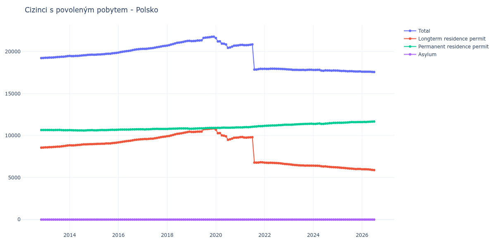

# Polsko

## Souhrnné statistiky (Min/Max pro rok) / Summary Statistics (Min/Max per year)

| Year   | Total           | Longterm Residence Permit   | Permanent Residence Permit   | Asylum   |
|--------|-----------------|-----------------------------|------------------------------|----------|
| 2012   | 19 225 / 19 235 | 8 564 / 8 577               | 10 658 / 10 661              | 0 / 0    |
| 2013   | 19 256 / 19 452 | 8 595 / 8 812               | 10 635 / 10 670              | 0 / 0    |
| 2014   | 19 459 / 19 626 | 8 824 / 8 978               | 10 603 / 10 652              | 0 / 0    |
| 2015   | 19 611 / 19 840 | 8 987 / 9 154               | 10 624 / 10 689              | 0 / 0    |
| 2016   | 19 879 / 20 305 | 9 185 / 9 552               | 10 694 / 10 753              | 0 / 0    |
| 2017   | 20 316 / 20 669 | 9 567 / 9 881               | 10 728 / 10 795              | 0 / 0    |
| 2018   | 20 708 / 21 279 | 9 919 / 10 464              | 10 789 / 10 847              | 0 / 0    |
| 2019   | 21 242 / 21 767 | 10 423 / 10 861             | 10 813 / 10 911              | 0 / 0    |
| 2020   | 20 435 / 21 610 | 9 498 / 10 701              | 10 909 / 10 970              | 0 / 0    |
| 2021   | 17 857 / 20 850 | 6 775 / 9 826               | 10 969 / 11 129              | 0 / 0    |
| 2022   | 17 884 / 17 952 | 6 599 / 6 778               | 11 160 / 11 285              | 0 / 0    |
| 2023   | 17 800 / 17 871 | 6 414 / 6 581               | 11 290 / 11 418              | 0 / 0    |
| 2024   | 17 711 / 17 822 | 6 221 / 6 419               | 11 387 / 11 514              | 0 / 0    |
| 2025   | 17 619 / 17 733 | 6 018 / 6 213               | 11 520 / 11 609              | 0 / 0    |
| 2026   | 17 565 / 17 604 | 5 892 / 5 991               | 11 610 / 11 673              | 0 / 0    |

## Detailní tabulka / Detailed Data Table

| Date     | Total            | Longterm Residence Permit   | Permanent Residence Permit   | Asylum   |
|----------|------------------|-----------------------------|------------------------------|----------|
| **2012** |                  |                             |                              |          |
| 11.2012  | 19 225           | 8 564                       | 10 661                       | 0        |
| 12.2012  | 19 235 (+0.05%)  | 8 577 (+0.15%)              | 10 658 (-0.03%)              | 0        |
| **2013** |                  |                             |                              |          |
| 01.2013  | 19 256 (+0.11%)  | 8 595 (+0.21%)              | 10 661 (+0.03%)              | 0        |
| 02.2013  | 19 262 (+0.03%)  | 8 599 (+0.05%)              | 10 663 (+0.02%)              | 0        |
| 03.2013  | 19 284 (+0.11%)  | 8 620 (+0.24%)              | 10 664 (+0.01%)              | 0        |
| 04.2013  | 19 281 (-0.02%)  | 8 624 (+0.05%)              | 10 657 (-0.07%)              | 0        |
| 05.2013  | 19 301 (+0.10%)  | 8 650 (+0.30%)              | 10 651 (-0.06%)              | 0        |
| 06.2013  | 19 325 (+0.12%)  | 8 657 (+0.08%)              | 10 668 (+0.16%)              | 0        |
| 07.2013  | 19 343 (+0.09%)  | 8 682 (+0.29%)              | 10 661 (-0.07%)              | 0        |
| 08.2013  | 19 356 (+0.07%)  | 8 686 (+0.05%)              | 10 670 (+0.08%)              | 0        |
| 09.2013  | 19 378 (+0.11%)  | 8 724 (+0.44%)              | 10 654 (-0.15%)              | 0        |
| 10.2013  | 19 387 (+0.05%)  | 8 749 (+0.29%)              | 10 638 (-0.15%)              | 0        |
| 11.2013  | 19 421 (+0.18%)  | 8 786 (+0.42%)              | 10 635 (-0.03%)              | 0        |
| 12.2013  | 19 452 (+0.16%)  | 8 812 (+0.30%)              | 10 640 (+0.05%)              | 0        |
| **2014** |                  |                             |                              |          |
| 01.2014  | 19 481 (+0.15%)  | 8 836 (+0.27%)              | 10 645 (+0.05%)              | 0        |
| 02.2014  | 19 459 (-0.11%)  | 8 824 (-0.14%)              | 10 635 (-0.09%)              | 0        |
| 03.2014  | 19 459 (+0.00%)  | 8 828 (+0.05%)              | 10 631 (-0.04%)              | 0        |
| 04.2014  | 19 474 (+0.08%)  | 8 850 (+0.25%)              | 10 624 (-0.07%)              | 0        |
| 05.2014  | 19 483 (+0.05%)  | 8 873 (+0.26%)              | 10 610 (-0.13%)              | 0        |
| 06.2014  | 19 499 (+0.08%)  | 8 891 (+0.20%)              | 10 608 (-0.02%)              | 0        |
| 07.2014  | 19 531 (+0.16%)  | 8 923 (+0.36%)              | 10 608 (+0.00%)              | 0        |
| 08.2014  | 19 551 (+0.10%)  | 8 948 (+0.28%)              | 10 603 (-0.05%)              | 0        |
| 09.2014  | 19 571 (+0.10%)  | 8 954 (+0.07%)              | 10 617 (+0.13%)              | 0        |
| 10.2014  | 19 601 (+0.15%)  | 8 960 (+0.07%)              | 10 641 (+0.23%)              | 0        |
| 11.2014  | 19 615 (+0.07%)  | 8 978 (+0.20%)              | 10 637 (-0.04%)              | 0        |
| 12.2014  | 19 626 (+0.06%)  | 8 974 (-0.04%)              | 10 652 (+0.14%)              | 0        |
| **2015** |                  |                             |                              |          |
| 01.2015  | 19 611 (-0.08%)  | 8 987 (+0.14%)              | 10 624 (-0.26%)              | 0        |
| 02.2015  | 19 630 (+0.10%)  | 9 005 (+0.20%)              | 10 625 (+0.01%)              | 0        |
| 03.2015  | 19 654 (+0.12%)  | 9 015 (+0.11%)              | 10 639 (+0.13%)              | 0        |
| 04.2015  | 19 656 (+0.01%)  | 9 012 (-0.03%)              | 10 644 (+0.05%)              | 0        |
| 05.2015  | 19 681 (+0.13%)  | 9 023 (+0.12%)              | 10 658 (+0.13%)              | 0        |
| 06.2015  | 19 684 (+0.02%)  | 9 030 (+0.08%)              | 10 654 (-0.04%)              | 0        |
| 07.2015  | 19 724 (+0.20%)  | 9 069 (+0.43%)              | 10 655 (+0.01%)              | 0        |
| 08.2015  | 19 736 (+0.06%)  | 9 068 (-0.01%)              | 10 668 (+0.12%)              | 0        |
| 09.2015  | 19 738 (+0.01%)  | 9 069 (+0.01%)              | 10 669 (+0.01%)              | 0        |
| 10.2015  | 19 787 (+0.25%)  | 9 098 (+0.32%)              | 10 689 (+0.19%)              | 0        |
| 11.2015  | 19 806 (+0.10%)  | 9 127 (+0.32%)              | 10 679 (-0.09%)              | 0        |
| 12.2015  | 19 840 (+0.17%)  | 9 154 (+0.30%)              | 10 686 (+0.07%)              | 0        |
| **2016** |                  |                             |                              |          |
| 01.2016  | 19 879 (+0.20%)  | 9 185 (+0.34%)              | 10 694 (+0.07%)              | 0        |
| 02.2016  | 19 936 (+0.29%)  | 9 228 (+0.47%)              | 10 708 (+0.13%)              | 0        |
| 03.2016  | 19 971 (+0.18%)  | 9 262 (+0.37%)              | 10 709 (+0.01%)              | 0        |
| 04.2016  | 20 008 (+0.19%)  | 9 296 (+0.37%)              | 10 712 (+0.03%)              | 0        |
| 05.2016  | 20 044 (+0.18%)  | 9 334 (+0.41%)              | 10 710 (-0.02%)              | 0        |
| 06.2016  | 20 072 (+0.14%)  | 9 357 (+0.25%)              | 10 715 (+0.05%)              | 0        |
| 07.2016  | 20 111 (+0.19%)  | 9 386 (+0.31%)              | 10 725 (+0.09%)              | 0        |
| 08.2016  | 20 170 (+0.29%)  | 9 433 (+0.50%)              | 10 737 (+0.11%)              | 0        |
| 09.2016  | 20 216 (+0.23%)  | 9 478 (+0.48%)              | 10 738 (+0.01%)              | 0        |
| 10.2016  | 20 257 (+0.20%)  | 9 512 (+0.36%)              | 10 745 (+0.07%)              | 0        |
| 11.2016  | 20 279 (+0.11%)  | 9 530 (+0.19%)              | 10 749 (+0.04%)              | 0        |
| 12.2016  | 20 305 (+0.13%)  | 9 552 (+0.23%)              | 10 753 (+0.04%)              | 0        |
| **2017** |                  |                             |                              |          |
| 01.2017  | 20 316 (+0.05%)  | 9 567 (+0.16%)              | 10 749 (-0.04%)              | 0        |
| 02.2017  | 20 322 (+0.03%)  | 9 594 (+0.28%)              | 10 728 (-0.20%)              | 0        |
| 03.2017  | 20 331 (+0.04%)  | 9 580 (-0.15%)              | 10 751 (+0.21%)              | 0        |
| 04.2017  | 20 359 (+0.14%)  | 9 608 (+0.29%)              | 10 751 (+0.00%)              | 0        |
| 05.2017  | 20 390 (+0.15%)  | 9 631 (+0.24%)              | 10 759 (+0.07%)              | 0        |
| 06.2017  | 20 411 (+0.10%)  | 9 631 (+0.00%)              | 10 780 (+0.20%)              | 0        |
| 07.2017  | 20 462 (+0.25%)  | 9 675 (+0.46%)              | 10 787 (+0.06%)              | 0        |
| 08.2017  | 20 513 (+0.25%)  | 9 718 (+0.44%)              | 10 795 (+0.07%)              | 0        |
| 09.2017  | 20 547 (+0.17%)  | 9 766 (+0.49%)              | 10 781 (-0.13%)              | 0        |
| 10.2017  | 20 594 (+0.23%)  | 9 809 (+0.44%)              | 10 785 (+0.04%)              | 0        |
| 11.2017  | 20 645 (+0.25%)  | 9 856 (+0.48%)              | 10 789 (+0.04%)              | 0        |
| 12.2017  | 20 669 (+0.12%)  | 9 881 (+0.25%)              | 10 788 (-0.01%)              | 0        |
| **2018** |                  |                             |                              |          |
| 01.2018  | 20 708 (+0.19%)  | 9 919 (+0.38%)              | 10 789 (+0.01%)              | 0        |
| 02.2018  | 20 761 (+0.26%)  | 9 954 (+0.35%)              | 10 807 (+0.17%)              | 0        |
| 03.2018  | 20 831 (+0.34%)  | 10 016 (+0.62%)             | 10 815 (+0.07%)              | 0        |
| 04.2018  | 20 895 (+0.31%)  | 10 074 (+0.58%)             | 10 821 (+0.06%)              | 0        |
| 05.2018  | 20 963 (+0.33%)  | 10 146 (+0.71%)             | 10 817 (-0.04%)              | 0        |
| 06.2018  | 21 039 (+0.36%)  | 10 206 (+0.59%)             | 10 833 (+0.15%)              | 0        |
| 07.2018  | 21 072 (+0.16%)  | 10 231 (+0.24%)             | 10 841 (+0.07%)              | 0        |
| 08.2018  | 21 109 (+0.18%)  | 10 267 (+0.35%)             | 10 842 (+0.01%)              | 0        |
| 09.2018  | 21 157 (+0.23%)  | 10 312 (+0.44%)             | 10 845 (+0.03%)              | 0        |
| 10.2018  | 21 208 (+0.24%)  | 10 363 (+0.49%)             | 10 845 (+0.00%)              | 0        |
| 11.2018  | 21 259 (+0.24%)  | 10 412 (+0.47%)             | 10 847 (+0.02%)              | 0        |
| 12.2018  | 21 279 (+0.09%)  | 10 464 (+0.50%)             | 10 815 (-0.30%)              | 0        |
| **2019** |                  |                             |                              |          |
| 01.2019  | 21 242 (-0.17%)  | 10 429 (-0.33%)             | 10 813 (-0.02%)              | 0        |
| 02.2019  | 21 247 (+0.02%)  | 10 423 (-0.06%)             | 10 824 (+0.10%)              | 0        |
| 03.2019  | 21 265 (+0.08%)  | 10 435 (+0.12%)             | 10 830 (+0.06%)              | 0        |
| 04.2019  | 21 308 (+0.20%)  | 10 462 (+0.26%)             | 10 846 (+0.15%)              | 0        |
| 05.2019  | 21 315 (+0.03%)  | 10 462 (+0.00%)             | 10 853 (+0.06%)              | 0        |
| 06.2019  | 21 335 (+0.09%)  | 10 478 (+0.15%)             | 10 857 (+0.04%)              | 0        |
| 07.2019  | 21 618 (+1.33%)  | 10 753 (+2.62%)             | 10 865 (+0.07%)              | 0        |
| 08.2019  | 21 658 (+0.19%)  | 10 777 (+0.22%)             | 10 881 (+0.15%)              | 0        |
| 09.2019  | 21 681 (+0.11%)  | 10 785 (+0.07%)             | 10 896 (+0.14%)              | 0        |
| 10.2019  | 21 711 (+0.14%)  | 10 808 (+0.21%)             | 10 903 (+0.06%)              | 0        |
| 11.2019  | 21 749 (+0.18%)  | 10 838 (+0.28%)             | 10 911 (+0.07%)              | 0        |
| 12.2019  | 21 767 (+0.08%)  | 10 861 (+0.21%)             | 10 906 (-0.05%)              | 0        |
| **2020** |                  |                             |                              |          |
| 01.2020  | 21 610 (-0.72%)  | 10 701 (-1.47%)             | 10 909 (+0.03%)              | 0        |
| 02.2020  | 21 198 (-1.91%)  | 10 281 (-3.92%)             | 10 917 (+0.07%)              | 0        |
| 03.2020  | 21 209 (+0.05%)  | 10 295 (+0.14%)             | 10 914 (-0.03%)              | 0        |
| 04.2020  | 20 947 (-1.24%)  | 10 017 (-2.70%)             | 10 930 (+0.15%)              | 0        |
| 05.2020  | 20 929 (-0.09%)  | 9 989 (-0.28%)              | 10 940 (+0.09%)              | 0        |
| 06.2020  | 20 846 (-0.40%)  | 9 918 (-0.71%)              | 10 928 (-0.11%)              | 0        |
| 07.2020  | 20 435 (-1.97%)  | 9 498 (-4.23%)              | 10 937 (+0.08%)              | 0        |
| 08.2020  | 20 489 (+0.26%)  | 9 554 (+0.59%)              | 10 935 (-0.02%)              | 0        |
| 09.2020  | 20 588 (+0.48%)  | 9 644 (+0.94%)              | 10 944 (+0.08%)              | 0        |
| 10.2020  | 20 693 (+0.51%)  | 9 742 (+1.02%)              | 10 951 (+0.06%)              | 0        |
| 11.2020  | 20 714 (+0.10%)  | 9 746 (+0.04%)              | 10 968 (+0.16%)              | 0        |
| 12.2020  | 20 733 (+0.09%)  | 9 763 (+0.17%)              | 10 970 (+0.02%)              | 0        |
| **2021** |                  |                             |                              |          |
| 01.2021  | 20 786 (+0.26%)  | 9 812 (+0.50%)              | 10 974 (+0.04%)              | 0        |
| 02.2021  | 20 795 (+0.04%)  | 9 826 (+0.14%)              | 10 969 (-0.05%)              | 0        |
| 03.2021  | 20 758 (-0.18%)  | 9 767 (-0.60%)              | 10 991 (+0.20%)              | 0        |
| 04.2021  | 20 763 (+0.02%)  | 9 752 (-0.15%)              | 11 011 (+0.18%)              | 0        |
| 05.2021  | 20 773 (+0.05%)  | 9 776 (+0.25%)              | 10 997 (-0.13%)              | 0        |
| 06.2021  | 20 805 (+0.15%)  | 9 784 (+0.08%)              | 11 021 (+0.22%)              | 0        |
| 07.2021  | 20 850 (+0.22%)  | 9 802 (+0.18%)              | 11 048 (+0.24%)              | 0        |
| 08.2021  | 17 857 (-14.35%) | 6 783 (-30.80%)             | 11 074 (+0.24%)              | 0        |
| 09.2021  | 17 861 (+0.02%)  | 6 775 (-0.12%)              | 11 086 (+0.11%)              | 0        |
| 10.2021  | 17 902 (+0.23%)  | 6 789 (+0.21%)              | 11 113 (+0.24%)              | 0        |
| 11.2021  | 17 940 (+0.21%)  | 6 820 (+0.46%)              | 11 120 (+0.06%)              | 0        |
| 12.2021  | 17 936 (-0.02%)  | 6 807 (-0.19%)              | 11 129 (+0.08%)              | 0        |
| **2022** |                  |                             |                              |          |
| 01.2022  | 17 938 (+0.01%)  | 6 778 (-0.43%)              | 11 160 (+0.28%)              | 0        |
| 02.2022  | 17 935 (-0.02%)  | 6 769 (-0.13%)              | 11 166 (+0.05%)              | 0        |
| 03.2022  | 17 926 (-0.05%)  | 6 753 (-0.24%)              | 11 173 (+0.06%)              | 0        |
| 04.2022  | 17 950 (+0.13%)  | 6 758 (+0.07%)              | 11 192 (+0.17%)              | 0        |
| 05.2022  | 17 950 (+0.00%)  | 6 751 (-0.10%)              | 11 199 (+0.06%)              | 0        |
| 06.2022  | 17 952 (+0.01%)  | 6 745 (-0.09%)              | 11 207 (+0.07%)              | 0        |
| 07.2022  | 17 941 (-0.06%)  | 6 727 (-0.27%)              | 11 214 (+0.06%)              | 0        |
| 08.2022  | 17 948 (+0.04%)  | 6 714 (-0.19%)              | 11 234 (+0.18%)              | 0        |
| 09.2022  | 17 934 (-0.08%)  | 6 688 (-0.39%)              | 11 246 (+0.11%)              | 0        |
| 10.2022  | 17 919 (-0.08%)  | 6 656 (-0.48%)              | 11 263 (+0.15%)              | 0        |
| 11.2022  | 17 903 (-0.09%)  | 6 619 (-0.56%)              | 11 284 (+0.19%)              | 0        |
| 12.2022  | 17 884 (-0.11%)  | 6 599 (-0.30%)              | 11 285 (+0.01%)              | 0        |
| **2023** |                  |                             |                              |          |
| 01.2023  | 17 871 (-0.07%)  | 6 581 (-0.27%)              | 11 290 (+0.04%)              | 0        |
| 02.2023  | 17 852 (-0.11%)  | 6 558 (-0.35%)              | 11 294 (+0.04%)              | 0        |
| 03.2023  | 17 823 (-0.16%)  | 6 516 (-0.64%)              | 11 307 (+0.12%)              | 0        |
| 04.2023  | 17 817 (-0.03%)  | 6 495 (-0.32%)              | 11 322 (+0.13%)              | 0        |
| 05.2023  | 17 825 (+0.04%)  | 6 487 (-0.12%)              | 11 338 (+0.14%)              | 0        |
| 06.2023  | 17 802 (-0.13%)  | 6 457 (-0.46%)              | 11 345 (+0.06%)              | 0        |
| 07.2023  | 17 812 (+0.06%)  | 6 448 (-0.14%)              | 11 364 (+0.17%)              | 0        |
| 08.2023  | 17 819 (+0.04%)  | 6 442 (-0.09%)              | 11 377 (+0.11%)              | 0        |
| 09.2023  | 17 800 (-0.11%)  | 6 414 (-0.43%)              | 11 386 (+0.08%)              | 0        |
| 10.2023  | 17 822 (+0.12%)  | 6 429 (+0.23%)              | 11 393 (+0.06%)              | 0        |
| 11.2023  | 17 826 (+0.02%)  | 6 425 (-0.06%)              | 11 401 (+0.07%)              | 0        |
| 12.2023  | 17 837 (+0.06%)  | 6 419 (-0.09%)              | 11 418 (+0.15%)              | 0        |
| **2024** |                  |                             |                              |          |
| 01.2024  | 17 810 (-0.15%)  | 6 419 (+0.00%)              | 11 391 (-0.24%)              | 0        |
| 02.2024  | 17 801 (-0.05%)  | 6 408 (-0.17%)              | 11 393 (+0.02%)              | 0        |
| 03.2024  | 17 817 (+0.09%)  | 6 408 (+0.00%)              | 11 409 (+0.14%)              | 0        |
| 04.2024  | 17 822 (+0.03%)  | 6 389 (-0.30%)              | 11 433 (+0.21%)              | 0        |
| 05.2024  | 17 730 (-0.52%)  | 6 340 (-0.77%)              | 11 390 (-0.38%)              | 0        |
| 06.2024  | 17 711 (-0.11%)  | 6 324 (-0.25%)              | 11 387 (-0.03%)              | 0        |
| 07.2024  | 17 753 (+0.24%)  | 6 333 (+0.14%)              | 11 420 (+0.29%)              | 0        |
| 08.2024  | 17 741 (-0.07%)  | 6 302 (-0.49%)              | 11 439 (+0.17%)              | 0        |
| 09.2024  | 17 746 (+0.03%)  | 6 274 (-0.44%)              | 11 472 (+0.29%)              | 0        |
| 10.2024  | 17 724 (-0.12%)  | 6 247 (-0.43%)              | 11 477 (+0.04%)              | 0        |
| 11.2024  | 17 748 (+0.14%)  | 6 234 (-0.21%)              | 11 514 (+0.32%)              | 0        |
| 12.2024  | 17 733 (-0.08%)  | 6 221 (-0.21%)              | 11 512 (-0.02%)              | 0        |
| **2025** |                  |                             |                              |          |
| 01.2025  | 17 733 (+0.00%)  | 6 213 (-0.13%)              | 11 520 (+0.07%)              | 0        |
| 02.2025  | 17 711 (-0.12%)  | 6 191 (-0.35%)              | 11 520 (+0.00%)              | 0        |
| 03.2025  | 17 690 (-0.12%)  | 6 167 (-0.39%)              | 11 523 (+0.03%)              | 0        |
| 04.2025  | 17 695 (+0.03%)  | 6 155 (-0.19%)              | 11 540 (+0.15%)              | 0        |
| 05.2025  | 17 675 (-0.11%)  | 6 124 (-0.50%)              | 11 551 (+0.10%)              | 0        |
| 06.2025  | 17 653 (-0.12%)  | 6 094 (-0.49%)              | 11 559 (+0.07%)              | 0        |
| 07.2025  | 17 660 (+0.04%)  | 6 078 (-0.26%)              | 11 582 (+0.20%)              | 0        |
| 08.2025  | 17 665 (+0.03%)  | 6 060 (-0.30%)              | 11 605 (+0.20%)              | 0        |
| 09.2025  | 17 629 (-0.20%)  | 6 038 (-0.36%)              | 11 591 (-0.12%)              | 0        |
| 10.2025  | 17 619 (-0.06%)  | 6 018 (-0.33%)              | 11 601 (+0.09%)              | 0        |
| 11.2025  | 17 627 (+0.05%)  | 6 023 (+0.08%)              | 11 604 (+0.03%)              | 0        |
| 12.2025  | 17 631 (+0.02%)  | 6 022 (-0.02%)              | 11 609 (+0.04%)              | 0        |
| **2026** |                  |                             |                              |          |
| 01.2026  | 17 604 (-0.15%)  | 5 991 (-0.51%)              | 11 613 (+0.03%)              | 0        |
| 02.2026  | 17 603 (-0.01%)  | 5 986 (-0.08%)              | 11 617 (+0.03%)              | 0        |
| 03.2026  | 17 601 (-0.01%)  | 5 991 (+0.08%)              | 11 610 (-0.06%)              | 0        |
| 04.2026  | 17 600 (-0.01%)  | 5 972 (-0.32%)              | 11 628 (+0.16%)              | 0        |
| 05.2026  | 17 597 (-0.02%)  | 5 957 (-0.25%)              | 11 640 (+0.10%)              | 0        |
| 06.2026  | 17 575 (-0.13%)  | 5 920 (-0.62%)              | 11 655 (+0.13%)              | 0        |
| 07.2026  | 17 565 (-0.06%)  | 5 892 (-0.47%)              | 11 673 (+0.15%)              | 0        |
