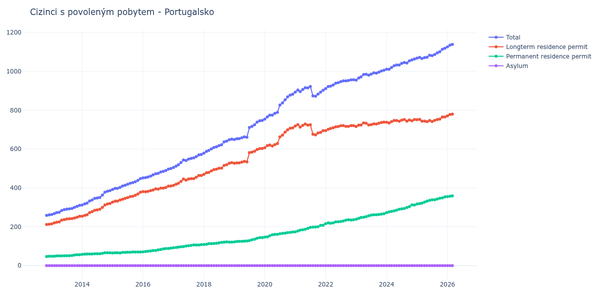

# Portugalsko

## Souhrnné statistiky (Min/Max pro rok) / Summary Statistics (Min/Max per year)

| Year   | Total         | Longterm Residence Permit   | Permanent Residence Permit   | Asylum   |
|--------|---------------|-----------------------------|------------------------------|----------|
| 2012   | 259 / 261     | 212 / 213                   | 47 / 48                      | 0 / 0    |
| 2013   | 263 / 310     | 215 / 254                   | 48 / 56                      | 0 / 0    |
| 2014   | 312 / 386     | 254 / 320                   | 58 / 66                      | 0 / 0    |
| 2015   | 392 / 448     | 327 / 378                   | 65 / 70                      | 0 / 0    |
| 2016   | 452 / 500     | 380 / 410                   | 71 / 90                      | 0 / 0    |
| 2017   | 505 / 572     | 413 / 464                   | 92 / 108                     | 0 / 0    |
| 2018   | 579 / 651     | 470 / 530                   | 109 / 122                    | 0 / 0    |
| 2019   | 649 / 747     | 527 / 603                   | 122 / 144                    | 0 / 0    |
| 2020   | 754 / 882     | 607 / 709                   | 147 / 173                    | 0 / 0    |
| 2021   | 872 / 922     | 673 / 729                   | 174 / 208                    | 0 / 0    |
| 2022   | 911 / 957     | 695 / 721                   | 216 / 236                    | 0 / 0    |
| 2023   | 955 / 1 006   | 716 / 739                   | 239 / 267                    | 0 / 0    |
| 2024   | 1 011 / 1 064 | 734 / 752                   | 273 / 313                    | 0 / 0    |
| 2025   | 1 066 / 1 119 | 741 / 765                   | 317 / 354                    | 0 / 0    |
| 2026   | 1 126 / 1 139 | 771 / 780                   | 355 / 359                    | 0 / 0    |

## Detailní tabulka / Detailed Data Table

| Date     | Total          | Longterm Residence Permit   | Permanent Residence Permit   | Asylum   |
|----------|----------------|-----------------------------|------------------------------|----------|
| **2012** |                |                             |                              |          |
| 11.2012  | 259            | 212                         | 47                           | 0        |
| 12.2012  | 261 (+0.77%)   | 213 (+0.47%)                | 48 (+2.13%)                  | 0        |
| **2013** |                |                             |                              |          |
| 01.2013  | 263 (+0.77%)   | 215 (+0.94%)                | 48 (+0.00%)                  | 0        |
| 02.2013  | 268 (+1.90%)   | 220 (+2.33%)                | 48 (+0.00%)                  | 0        |
| 03.2013  | 273 (+1.87%)   | 223 (+1.36%)                | 50 (+4.17%)                  | 0        |
| 04.2013  | 275 (+0.73%)   | 225 (+0.90%)                | 50 (+0.00%)                  | 0        |
| 05.2013  | 284 (+3.27%)   | 234 (+4.00%)                | 50 (+0.00%)                  | 0        |
| 06.2013  | 288 (+1.41%)   | 237 (+1.28%)                | 51 (+2.00%)                  | 0        |
| 07.2013  | 291 (+1.04%)   | 240 (+1.27%)                | 51 (+0.00%)                  | 0        |
| 08.2013  | 292 (+0.34%)   | 241 (+0.42%)                | 51 (+0.00%)                  | 0        |
| 09.2013  | 294 (+0.68%)   | 242 (+0.41%)                | 52 (+1.96%)                  | 0        |
| 10.2013  | 300 (+2.04%)   | 245 (+1.24%)                | 55 (+5.77%)                  | 0        |
| 11.2013  | 305 (+1.67%)   | 249 (+1.63%)                | 56 (+1.82%)                  | 0        |
| 12.2013  | 310 (+1.64%)   | 254 (+2.01%)                | 56 (+0.00%)                  | 0        |
| **2014** |                |                             |                              |          |
| 01.2014  | 312 (+0.65%)   | 254 (+0.00%)                | 58 (+3.57%)                  | 0        |
| 02.2014  | 318 (+1.92%)   | 259 (+1.97%)                | 59 (+1.72%)                  | 0        |
| 03.2014  | 322 (+1.26%)   | 262 (+1.16%)                | 60 (+1.69%)                  | 0        |
| 04.2014  | 333 (+3.42%)   | 273 (+4.20%)                | 60 (+0.00%)                  | 0        |
| 05.2014  | 338 (+1.50%)   | 278 (+1.83%)                | 60 (+0.00%)                  | 0        |
| 06.2014  | 346 (+2.37%)   | 285 (+2.52%)                | 61 (+1.67%)                  | 0        |
| 07.2014  | 348 (+0.58%)   | 287 (+0.70%)                | 61 (+0.00%)                  | 0        |
| 08.2014  | 351 (+0.86%)   | 290 (+1.05%)                | 61 (+0.00%)                  | 0        |
| 09.2014  | 363 (+3.42%)   | 300 (+3.45%)                | 63 (+3.28%)                  | 0        |
| 10.2014  | 378 (+4.13%)   | 312 (+4.00%)                | 66 (+4.76%)                  | 0        |
| 11.2014  | 383 (+1.32%)   | 317 (+1.60%)                | 66 (+0.00%)                  | 0        |
| 12.2014  | 386 (+0.78%)   | 320 (+0.95%)                | 66 (+0.00%)                  | 0        |
| **2015** |                |                             |                              |          |
| 01.2015  | 392 (+1.55%)   | 327 (+2.19%)                | 65 (-1.52%)                  | 0        |
| 02.2015  | 398 (+1.53%)   | 332 (+1.53%)                | 66 (+1.54%)                  | 0        |
| 03.2015  | 398 (+0.00%)   | 332 (+0.00%)                | 66 (+0.00%)                  | 0        |
| 04.2015  | 403 (+1.26%)   | 338 (+1.81%)                | 65 (-1.52%)                  | 0        |
| 05.2015  | 410 (+1.74%)   | 342 (+1.18%)                | 68 (+4.62%)                  | 0        |
| 06.2015  | 414 (+0.98%)   | 346 (+1.17%)                | 68 (+0.00%)                  | 0        |
| 07.2015  | 419 (+1.21%)   | 350 (+1.16%)                | 69 (+1.47%)                  | 0        |
| 08.2015  | 424 (+1.19%)   | 355 (+1.43%)                | 69 (+0.00%)                  | 0        |
| 09.2015  | 427 (+0.71%)   | 357 (+0.56%)                | 70 (+1.45%)                  | 0        |
| 10.2015  | 432 (+1.17%)   | 362 (+1.40%)                | 70 (+0.00%)                  | 0        |
| 11.2015  | 439 (+1.62%)   | 369 (+1.93%)                | 70 (+0.00%)                  | 0        |
| 12.2015  | 448 (+2.05%)   | 378 (+2.44%)                | 70 (+0.00%)                  | 0        |
| **2016** |                |                             |                              |          |
| 01.2016  | 452 (+0.89%)   | 381 (+0.79%)                | 71 (+1.43%)                  | 0        |
| 02.2016  | 453 (+0.22%)   | 380 (-0.26%)                | 73 (+2.82%)                  | 0        |
| 03.2016  | 456 (+0.66%)   | 382 (+0.53%)                | 74 (+1.37%)                  | 0        |
| 04.2016  | 461 (+1.10%)   | 386 (+1.05%)                | 75 (+1.35%)                  | 0        |
| 05.2016  | 467 (+1.30%)   | 389 (+0.78%)                | 78 (+4.00%)                  | 0        |
| 06.2016  | 473 (+1.28%)   | 395 (+1.54%)                | 78 (+0.00%)                  | 0        |
| 07.2016  | 475 (+0.42%)   | 394 (-0.25%)                | 81 (+3.85%)                  | 0        |
| 08.2016  | 482 (+1.47%)   | 399 (+1.27%)                | 83 (+2.47%)                  | 0        |
| 09.2016  | 485 (+0.62%)   | 399 (+0.00%)                | 86 (+3.61%)                  | 0        |
| 10.2016  | 490 (+1.03%)   | 402 (+0.75%)                | 88 (+2.33%)                  | 0        |
| 11.2016  | 497 (+1.43%)   | 409 (+1.74%)                | 88 (+0.00%)                  | 0        |
| 12.2016  | 500 (+0.60%)   | 410 (+0.24%)                | 90 (+2.27%)                  | 0        |
| **2017** |                |                             |                              |          |
| 01.2017  | 505 (+1.00%)   | 413 (+0.73%)                | 92 (+2.22%)                  | 0        |
| 02.2017  | 512 (+1.39%)   | 419 (+1.45%)                | 93 (+1.09%)                  | 0        |
| 03.2017  | 519 (+1.37%)   | 424 (+1.19%)                | 95 (+2.15%)                  | 0        |
| 04.2017  | 531 (+2.31%)   | 434 (+2.36%)                | 97 (+2.11%)                  | 0        |
| 05.2017  | 544 (+2.45%)   | 446 (+2.76%)                | 98 (+1.03%)                  | 0        |
| 06.2017  | 541 (-0.55%)   | 440 (-1.35%)                | 101 (+3.06%)                 | 0        |
| 07.2017  | 548 (+1.29%)   | 446 (+1.36%)                | 102 (+0.99%)                 | 0        |
| 08.2017  | 552 (+0.73%)   | 448 (+0.45%)                | 104 (+1.96%)                 | 0        |
| 09.2017  | 555 (+0.54%)   | 448 (+0.00%)                | 107 (+2.88%)                 | 0        |
| 10.2017  | 561 (+1.08%)   | 455 (+1.56%)                | 106 (-0.93%)                 | 0        |
| 11.2017  | 570 (+1.60%)   | 464 (+1.98%)                | 106 (+0.00%)                 | 0        |
| 12.2017  | 572 (+0.35%)   | 464 (+0.00%)                | 108 (+1.89%)                 | 0        |
| **2018** |                |                             |                              |          |
| 01.2018  | 579 (+1.22%)   | 470 (+1.29%)                | 109 (+0.93%)                 | 0        |
| 02.2018  | 588 (+1.55%)   | 478 (+1.70%)                | 110 (+0.92%)                 | 0        |
| 03.2018  | 593 (+0.85%)   | 480 (+0.42%)                | 113 (+2.73%)                 | 0        |
| 04.2018  | 601 (+1.35%)   | 488 (+1.67%)                | 113 (+0.00%)                 | 0        |
| 05.2018  | 608 (+1.16%)   | 494 (+1.23%)                | 114 (+0.88%)                 | 0        |
| 06.2018  | 612 (+0.66%)   | 497 (+0.61%)                | 115 (+0.88%)                 | 0        |
| 07.2018  | 618 (+0.98%)   | 501 (+0.80%)                | 117 (+1.74%)                 | 0        |
| 08.2018  | 622 (+0.65%)   | 502 (+0.20%)                | 120 (+2.56%)                 | 0        |
| 09.2018  | 637 (+2.41%)   | 516 (+2.79%)                | 121 (+0.83%)                 | 0        |
| 10.2018  | 641 (+0.63%)   | 519 (+0.58%)                | 122 (+0.83%)                 | 0        |
| 11.2018  | 648 (+1.09%)   | 527 (+1.54%)                | 121 (-0.82%)                 | 0        |
| 12.2018  | 651 (+0.46%)   | 530 (+0.57%)                | 121 (+0.00%)                 | 0        |
| **2019** |                |                             |                              |          |
| 01.2019  | 649 (-0.31%)   | 527 (-0.57%)                | 122 (+0.83%)                 | 0        |
| 02.2019  | 653 (+0.62%)   | 529 (+0.38%)                | 124 (+1.64%)                 | 0        |
| 03.2019  | 654 (+0.15%)   | 529 (+0.00%)                | 125 (+0.81%)                 | 0        |
| 04.2019  | 658 (+0.61%)   | 533 (+0.76%)                | 125 (+0.00%)                 | 0        |
| 05.2019  | 663 (+0.76%)   | 537 (+0.75%)                | 126 (+0.80%)                 | 0        |
| 06.2019  | 661 (-0.30%)   | 534 (-0.56%)                | 127 (+0.79%)                 | 0        |
| 07.2019  | 711 (+7.56%)   | 582 (+8.99%)                | 129 (+1.57%)                 | 0        |
| 08.2019  | 717 (+0.84%)   | 584 (+0.34%)                | 133 (+3.10%)                 | 0        |
| 09.2019  | 725 (+1.12%)   | 589 (+0.86%)                | 136 (+2.26%)                 | 0        |
| 10.2019  | 739 (+1.93%)   | 598 (+1.53%)                | 141 (+3.68%)                 | 0        |
| 11.2019  | 746 (+0.95%)   | 602 (+0.67%)                | 144 (+2.13%)                 | 0        |
| 12.2019  | 747 (+0.13%)   | 603 (+0.17%)                | 144 (+0.00%)                 | 0        |
| **2020** |                |                             |                              |          |
| 01.2020  | 754 (+0.94%)   | 607 (+0.66%)                | 147 (+2.08%)                 | 0        |
| 02.2020  | 766 (+1.59%)   | 618 (+1.81%)                | 148 (+0.68%)                 | 0        |
| 03.2020  | 775 (+1.17%)   | 621 (+0.49%)                | 154 (+4.05%)                 | 0        |
| 04.2020  | 775 (+0.00%)   | 616 (-0.81%)                | 159 (+3.25%)                 | 0        |
| 05.2020  | 784 (+1.16%)   | 623 (+1.14%)                | 161 (+1.26%)                 | 0        |
| 06.2020  | 789 (+0.64%)   | 628 (+0.80%)                | 161 (+0.00%)                 | 0        |
| 07.2020  | 827 (+4.82%)   | 663 (+5.57%)                | 164 (+1.86%)                 | 0        |
| 08.2020  | 838 (+1.33%)   | 672 (+1.36%)                | 166 (+1.22%)                 | 0        |
| 09.2020  | 854 (+1.91%)   | 687 (+2.23%)                | 167 (+0.60%)                 | 0        |
| 10.2020  | 869 (+1.76%)   | 699 (+1.75%)                | 170 (+1.80%)                 | 0        |
| 11.2020  | 878 (+1.04%)   | 707 (+1.14%)                | 171 (+0.59%)                 | 0        |
| 12.2020  | 882 (+0.46%)   | 709 (+0.28%)                | 173 (+1.17%)                 | 0        |
| **2021** |                |                             |                              |          |
| 01.2021  | 893 (+1.25%)   | 719 (+1.41%)                | 174 (+0.58%)                 | 0        |
| 02.2021  | 904 (+1.23%)   | 726 (+0.97%)                | 178 (+2.30%)                 | 0        |
| 03.2021  | 896 (-0.88%)   | 713 (-1.79%)                | 183 (+2.81%)                 | 0        |
| 04.2021  | 907 (+1.23%)   | 722 (+1.26%)                | 185 (+1.09%)                 | 0        |
| 05.2021  | 916 (+0.99%)   | 729 (+0.97%)                | 187 (+1.08%)                 | 0        |
| 06.2021  | 915 (-0.11%)   | 723 (-0.82%)                | 192 (+2.67%)                 | 0        |
| 07.2021  | 922 (+0.77%)   | 725 (+0.28%)                | 197 (+2.60%)                 | 0        |
| 08.2021  | 874 (-5.21%)   | 676 (-6.76%)                | 198 (+0.51%)                 | 0        |
| 09.2021  | 872 (-0.23%)   | 673 (-0.44%)                | 199 (+0.51%)                 | 0        |
| 10.2021  | 883 (+1.26%)   | 683 (+1.49%)                | 200 (+0.50%)                 | 0        |
| 11.2021  | 893 (+1.13%)   | 686 (+0.44%)                | 207 (+3.50%)                 | 0        |
| 12.2021  | 903 (+1.12%)   | 695 (+1.31%)                | 208 (+0.48%)                 | 0        |
| **2022** |                |                             |                              |          |
| 01.2022  | 911 (+0.89%)   | 695 (+0.00%)                | 216 (+3.85%)                 | 0        |
| 02.2022  | 922 (+1.21%)   | 702 (+1.01%)                | 220 (+1.85%)                 | 0        |
| 03.2022  | 924 (+0.22%)   | 706 (+0.57%)                | 218 (-0.91%)                 | 0        |
| 04.2022  | 930 (+0.65%)   | 710 (+0.57%)                | 220 (+0.92%)                 | 0        |
| 05.2022  | 939 (+0.97%)   | 714 (+0.56%)                | 225 (+2.27%)                 | 0        |
| 06.2022  | 942 (+0.32%)   | 716 (+0.28%)                | 226 (+0.44%)                 | 0        |
| 07.2022  | 947 (+0.53%)   | 720 (+0.56%)                | 227 (+0.44%)                 | 0        |
| 08.2022  | 951 (+0.42%)   | 721 (+0.14%)                | 230 (+1.32%)                 | 0        |
| 09.2022  | 951 (+0.00%)   | 717 (-0.55%)                | 234 (+1.74%)                 | 0        |
| 10.2022  | 953 (+0.21%)   | 717 (+0.00%)                | 236 (+0.85%)                 | 0        |
| 11.2022  | 956 (+0.31%)   | 721 (+0.56%)                | 235 (-0.42%)                 | 0        |
| 12.2022  | 957 (+0.10%)   | 721 (+0.00%)                | 236 (+0.43%)                 | 0        |
| **2023** |                |                             |                              |          |
| 01.2023  | 955 (-0.21%)   | 716 (-0.69%)                | 239 (+1.27%)                 | 0        |
| 02.2023  | 966 (+1.15%)   | 723 (+0.98%)                | 243 (+1.67%)                 | 0        |
| 03.2023  | 972 (+0.62%)   | 724 (+0.14%)                | 248 (+2.06%)                 | 0        |
| 04.2023  | 984 (+1.23%)   | 735 (+1.52%)                | 249 (+0.40%)                 | 0        |
| 05.2023  | 985 (+0.10%)   | 733 (-0.27%)                | 252 (+1.20%)                 | 0        |
| 06.2023  | 981 (-0.41%)   | 724 (-1.23%)                | 257 (+1.98%)                 | 0        |
| 07.2023  | 986 (+0.51%)   | 726 (+0.28%)                | 260 (+1.17%)                 | 0        |
| 08.2023  | 992 (+0.61%)   | 730 (+0.55%)                | 262 (+0.77%)                 | 0        |
| 09.2023  | 991 (-0.10%)   | 729 (-0.14%)                | 262 (+0.00%)                 | 0        |
| 10.2023  | 996 (+0.50%)   | 733 (+0.55%)                | 263 (+0.38%)                 | 0        |
| 11.2023  | 1 002 (+0.60%) | 737 (+0.55%)                | 265 (+0.76%)                 | 0        |
| 12.2023  | 1 006 (+0.40%) | 739 (+0.27%)                | 267 (+0.75%)                 | 0        |
| **2024** |                |                             |                              |          |
| 01.2024  | 1 011 (+0.50%) | 738 (-0.14%)                | 273 (+2.25%)                 | 0        |
| 02.2024  | 1 011 (+0.00%) | 734 (-0.54%)                | 277 (+1.47%)                 | 0        |
| 03.2024  | 1 020 (+0.89%) | 741 (+0.95%)                | 279 (+0.72%)                 | 0        |
| 04.2024  | 1 029 (+0.88%) | 747 (+0.81%)                | 282 (+1.08%)                 | 0        |
| 05.2024  | 1 033 (+0.39%) | 747 (+0.00%)                | 286 (+1.42%)                 | 0        |
| 06.2024  | 1 033 (+0.00%) | 743 (-0.54%)                | 290 (+1.40%)                 | 0        |
| 07.2024  | 1 041 (+0.77%) | 749 (+0.81%)                | 292 (+0.69%)                 | 0        |
| 08.2024  | 1 046 (+0.48%) | 752 (+0.40%)                | 294 (+0.68%)                 | 0        |
| 09.2024  | 1 043 (-0.29%) | 744 (-1.06%)                | 299 (+1.70%)                 | 0        |
| 10.2024  | 1 054 (+1.05%) | 750 (+0.81%)                | 304 (+1.67%)                 | 0        |
| 11.2024  | 1 059 (+0.47%) | 746 (-0.53%)                | 313 (+2.96%)                 | 0        |
| 12.2024  | 1 064 (+0.47%) | 752 (+0.80%)                | 312 (-0.32%)                 | 0        |
| **2025** |                |                             |                              |          |
| 01.2025  | 1 068 (+0.38%) | 751 (-0.13%)                | 317 (+1.60%)                 | 0        |
| 02.2025  | 1 072 (+0.37%) | 753 (+0.27%)                | 319 (+0.63%)                 | 0        |
| 03.2025  | 1 066 (-0.56%) | 744 (-1.20%)                | 322 (+0.94%)                 | 0        |
| 04.2025  | 1 071 (+0.47%) | 744 (+0.00%)                | 327 (+1.55%)                 | 0        |
| 05.2025  | 1 073 (+0.19%) | 741 (-0.40%)                | 332 (+1.53%)                 | 0        |
| 06.2025  | 1 083 (+0.93%) | 747 (+0.81%)                | 336 (+1.20%)                 | 0        |
| 07.2025  | 1 081 (-0.18%) | 742 (-0.67%)                | 339 (+0.89%)                 | 0        |
| 08.2025  | 1 087 (+0.56%) | 748 (+0.81%)                | 339 (+0.00%)                 | 0        |
| 09.2025  | 1 095 (+0.74%) | 752 (+0.53%)                | 343 (+1.18%)                 | 0        |
| 10.2025  | 1 101 (+0.55%) | 754 (+0.27%)                | 347 (+1.17%)                 | 0        |
| 11.2025  | 1 114 (+1.18%) | 765 (+1.46%)                | 349 (+0.58%)                 | 0        |
| 12.2025  | 1 119 (+0.45%) | 765 (+0.00%)                | 354 (+1.43%)                 | 0        |
| **2026** |                |                             |                              |          |
| 01.2026  | 1 126 (+0.63%) | 771 (+0.78%)                | 355 (+0.28%)                 | 0        |
| 02.2026  | 1 135 (+0.80%) | 778 (+0.91%)                | 357 (+0.56%)                 | 0        |
| 03.2026  | 1 139 (+0.35%) | 780 (+0.26%)                | 359 (+0.56%)                 | 0        |
