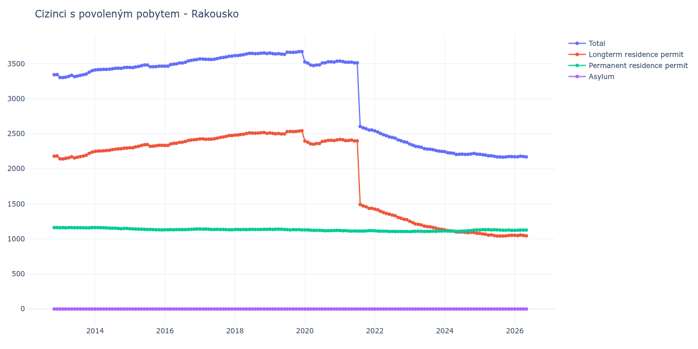

# Rakousko

## Souhrnné statistiky (Min/Max pro rok) / Summary Statistics (Min/Max per year)

| Year   | Total         | Longterm Residence Permit   | Permanent Residence Permit   | Asylum   |
|--------|---------------|-----------------------------|------------------------------|----------|
| 2012   | 3 343 / 3 345 | 2 181 / 2 183               | 1 162 / 1 162                | 0 / 0    |
| 2013   | 3 302 / 3 400 | 2 140 / 2 238               | 1 158 / 1 162                | 0 / 0    |
| 2014   | 3 410 / 3 447 | 2 249 / 2 297               | 1 146 / 1 161                | 0 / 0    |
| 2015   | 3 444 / 3 482 | 2 300 / 2 347               | 1 129 / 1 145                | 0 / 0    |
| 2016   | 3 465 / 3 560 | 2 334 / 2 419               | 1 131 / 1 141                | 0 / 0    |
| 2017   | 3 559 / 3 607 | 2 422 / 2 476               | 1 130 / 1 142                | 0 / 0    |
| 2018   | 3 615 / 3 654 | 2 481 / 2 518               | 1 133 / 1 137                | 0 / 0    |
| 2019   | 3 632 / 3 672 | 2 498 / 2 543               | 1 128 / 1 139                | 0 / 0    |
| 2020   | 3 472 / 3 535 | 2 350 / 2 413               | 1 116 / 1 129                | 0 / 0    |
| 2021   | 2 554 / 3 538 | 1 436 / 2 418               | 1 111 / 1 120                | 0 / 0    |
| 2022   | 2 378 / 2 541 | 1 273 / 1 425               | 1 105 / 1 116                | 0 / 0    |
| 2023   | 2 248 / 2 353 | 1 136 / 1 250               | 1 103 / 1 112                | 0 / 0    |
| 2024   | 2 205 / 2 245 | 1 081 / 1 131               | 1 107 / 1 128                | 0 / 0    |
| 2025   | 2 166 / 2 207 | 1 042 / 1 078               | 1 123 / 1 132                | 0 / 0    |

## Detailní tabulka / Detailed Data Table

| Date     | Total           | Longterm Residence Permit   | Permanent Residence Permit   | Asylum   |
|----------|-----------------|-----------------------------|------------------------------|----------|
| **2012** |                 |                             |                              |          |
| 11.2012  | 3 343           | 2 181                       | 1 162                        | 0        |
| 12.2012  | 3 345 (+0.06%)  | 2 183 (+0.09%)              | 1 162 (+0.00%)               | 0        |
| **2013** |                 |                             |                              |          |
| 01.2013  | 3 303 (-1.26%)  | 2 143 (-1.83%)              | 1 160 (-0.17%)               | 0        |
| 02.2013  | 3 302 (-0.03%)  | 2 140 (-0.14%)              | 1 162 (+0.17%)               | 0        |
| 03.2013  | 3 307 (+0.15%)  | 2 149 (+0.42%)              | 1 158 (-0.34%)               | 0        |
| 04.2013  | 3 319 (+0.36%)  | 2 157 (+0.37%)              | 1 162 (+0.35%)               | 0        |
| 05.2013  | 3 334 (+0.45%)  | 2 173 (+0.74%)              | 1 161 (-0.09%)               | 0        |
| 06.2013  | 3 315 (-0.57%)  | 2 156 (-0.78%)              | 1 159 (-0.17%)               | 0        |
| 07.2013  | 3 324 (+0.27%)  | 2 165 (+0.42%)              | 1 159 (+0.00%)               | 0        |
| 08.2013  | 3 333 (+0.27%)  | 2 174 (+0.42%)              | 1 159 (+0.00%)               | 0        |
| 09.2013  | 3 342 (+0.27%)  | 2 183 (+0.41%)              | 1 159 (+0.00%)               | 0        |
| 10.2013  | 3 353 (+0.33%)  | 2 195 (+0.55%)              | 1 158 (-0.09%)               | 0        |
| 11.2013  | 3 377 (+0.72%)  | 2 219 (+1.09%)              | 1 158 (+0.00%)               | 0        |
| 12.2013  | 3 400 (+0.68%)  | 2 238 (+0.86%)              | 1 162 (+0.35%)               | 0        |
| **2014** |                 |                             |                              |          |
| 01.2014  | 3 410 (+0.29%)  | 2 249 (+0.49%)              | 1 161 (-0.09%)               | 0        |
| 02.2014  | 3 415 (+0.15%)  | 2 254 (+0.22%)              | 1 161 (+0.00%)               | 0        |
| 03.2014  | 3 416 (+0.03%)  | 2 256 (+0.09%)              | 1 160 (-0.09%)               | 0        |
| 04.2014  | 3 418 (+0.06%)  | 2 258 (+0.09%)              | 1 160 (+0.00%)               | 0        |
| 05.2014  | 3 419 (+0.03%)  | 2 261 (+0.13%)              | 1 158 (-0.17%)               | 0        |
| 06.2014  | 3 420 (+0.03%)  | 2 266 (+0.22%)              | 1 154 (-0.35%)               | 0        |
| 07.2014  | 3 427 (+0.20%)  | 2 273 (+0.31%)              | 1 154 (+0.00%)               | 0        |
| 08.2014  | 3 433 (+0.18%)  | 2 280 (+0.31%)              | 1 153 (-0.09%)               | 0        |
| 09.2014  | 3 435 (+0.06%)  | 2 285 (+0.22%)              | 1 150 (-0.26%)               | 0        |
| 10.2014  | 3 433 (-0.06%)  | 2 287 (+0.09%)              | 1 146 (-0.35%)               | 0        |
| 11.2014  | 3 443 (+0.29%)  | 2 294 (+0.31%)              | 1 149 (+0.26%)               | 0        |
| 12.2014  | 3 447 (+0.12%)  | 2 297 (+0.13%)              | 1 150 (+0.09%)               | 0        |
| **2015** |                 |                             |                              |          |
| 01.2015  | 3 445 (-0.06%)  | 2 300 (+0.13%)              | 1 145 (-0.43%)               | 0        |
| 02.2015  | 3 444 (-0.03%)  | 2 301 (+0.04%)              | 1 143 (-0.17%)               | 0        |
| 03.2015  | 3 455 (+0.32%)  | 2 314 (+0.56%)              | 1 141 (-0.17%)               | 0        |
| 04.2015  | 3 460 (+0.14%)  | 2 321 (+0.30%)              | 1 139 (-0.18%)               | 0        |
| 05.2015  | 3 471 (+0.32%)  | 2 333 (+0.52%)              | 1 138 (-0.09%)               | 0        |
| 06.2015  | 3 481 (+0.29%)  | 2 344 (+0.47%)              | 1 137 (-0.09%)               | 0        |
| 07.2015  | 3 482 (+0.03%)  | 2 347 (+0.13%)              | 1 135 (-0.18%)               | 0        |
| 08.2015  | 3 456 (-0.75%)  | 2 321 (-1.11%)              | 1 135 (+0.00%)               | 0        |
| 09.2015  | 3 456 (+0.00%)  | 2 323 (+0.09%)              | 1 133 (-0.18%)               | 0        |
| 10.2015  | 3 459 (+0.09%)  | 2 329 (+0.26%)              | 1 130 (-0.26%)               | 0        |
| 11.2015  | 3 465 (+0.17%)  | 2 335 (+0.26%)              | 1 130 (+0.00%)               | 0        |
| 12.2015  | 3 464 (-0.03%)  | 2 335 (+0.00%)              | 1 129 (-0.09%)               | 0        |
| **2016** |                 |                             |                              |          |
| 01.2016  | 3 465 (+0.03%)  | 2 334 (-0.04%)              | 1 131 (+0.18%)               | 0        |
| 02.2016  | 3 465 (+0.00%)  | 2 334 (+0.00%)              | 1 131 (+0.00%)               | 0        |
| 03.2016  | 3 487 (+0.63%)  | 2 354 (+0.86%)              | 1 133 (+0.18%)               | 0        |
| 04.2016  | 3 493 (+0.17%)  | 2 362 (+0.34%)              | 1 131 (-0.18%)               | 0        |
| 05.2016  | 3 498 (+0.14%)  | 2 366 (+0.17%)              | 1 132 (+0.09%)               | 0        |
| 06.2016  | 3 510 (+0.34%)  | 2 378 (+0.51%)              | 1 132 (+0.00%)               | 0        |
| 07.2016  | 3 511 (+0.03%)  | 2 379 (+0.04%)              | 1 132 (+0.00%)               | 0        |
| 08.2016  | 3 521 (+0.28%)  | 2 389 (+0.42%)              | 1 132 (+0.00%)               | 0        |
| 09.2016  | 3 540 (+0.54%)  | 2 405 (+0.67%)              | 1 135 (+0.27%)               | 0        |
| 10.2016  | 3 547 (+0.20%)  | 2 411 (+0.25%)              | 1 136 (+0.09%)               | 0        |
| 11.2016  | 3 554 (+0.20%)  | 2 415 (+0.17%)              | 1 139 (+0.26%)               | 0        |
| 12.2016  | 3 560 (+0.17%)  | 2 419 (+0.17%)              | 1 141 (+0.18%)               | 0        |
| **2017** |                 |                             |                              |          |
| 01.2017  | 3 569 (+0.25%)  | 2 427 (+0.33%)              | 1 142 (+0.09%)               | 0        |
| 02.2017  | 3 566 (-0.08%)  | 2 427 (+0.00%)              | 1 139 (-0.26%)               | 0        |
| 03.2017  | 3 563 (-0.08%)  | 2 422 (-0.21%)              | 1 141 (+0.18%)               | 0        |
| 04.2017  | 3 562 (-0.03%)  | 2 424 (+0.08%)              | 1 138 (-0.26%)               | 0        |
| 05.2017  | 3 559 (-0.08%)  | 2 424 (+0.00%)              | 1 135 (-0.26%)               | 0        |
| 06.2017  | 3 564 (+0.14%)  | 2 429 (+0.21%)              | 1 135 (+0.00%)               | 0        |
| 07.2017  | 3 573 (+0.25%)  | 2 437 (+0.33%)              | 1 136 (+0.09%)               | 0        |
| 08.2017  | 3 583 (+0.28%)  | 2 448 (+0.45%)              | 1 135 (-0.09%)               | 0        |
| 09.2017  | 3 589 (+0.17%)  | 2 454 (+0.25%)              | 1 135 (+0.00%)               | 0        |
| 10.2017  | 3 596 (+0.20%)  | 2 463 (+0.37%)              | 1 133 (-0.18%)               | 0        |
| 11.2017  | 3 606 (+0.28%)  | 2 476 (+0.53%)              | 1 130 (-0.26%)               | 0        |
| 12.2017  | 3 607 (+0.03%)  | 2 476 (+0.00%)              | 1 131 (+0.09%)               | 0        |
| **2018** |                 |                             |                              |          |
| 01.2018  | 3 615 (+0.22%)  | 2 481 (+0.20%)              | 1 134 (+0.27%)               | 0        |
| 02.2018  | 3 617 (+0.06%)  | 2 483 (+0.08%)              | 1 134 (+0.00%)               | 0        |
| 03.2018  | 3 622 (+0.14%)  | 2 489 (+0.24%)              | 1 133 (-0.09%)               | 0        |
| 04.2018  | 3 628 (+0.17%)  | 2 493 (+0.16%)              | 1 135 (+0.18%)               | 0        |
| 05.2018  | 3 638 (+0.28%)  | 2 505 (+0.48%)              | 1 133 (-0.18%)               | 0        |
| 06.2018  | 3 647 (+0.25%)  | 2 512 (+0.28%)              | 1 135 (+0.18%)               | 0        |
| 07.2018  | 3 648 (+0.03%)  | 2 511 (-0.04%)              | 1 137 (+0.18%)               | 0        |
| 08.2018  | 3 642 (-0.16%)  | 2 508 (-0.12%)              | 1 134 (-0.26%)               | 0        |
| 09.2018  | 3 644 (+0.05%)  | 2 510 (+0.08%)              | 1 134 (+0.00%)               | 0        |
| 10.2018  | 3 649 (+0.14%)  | 2 514 (+0.16%)              | 1 135 (+0.09%)               | 0        |
| 11.2018  | 3 654 (+0.14%)  | 2 518 (+0.16%)              | 1 136 (+0.09%)               | 0        |
| 12.2018  | 3 644 (-0.27%)  | 2 507 (-0.44%)              | 1 137 (+0.09%)               | 0        |
| **2019** |                 |                             |                              |          |
| 01.2019  | 3 651 (+0.19%)  | 2 513 (+0.24%)              | 1 138 (+0.09%)               | 0        |
| 02.2019  | 3 642 (-0.25%)  | 2 507 (-0.24%)              | 1 135 (-0.26%)               | 0        |
| 03.2019  | 3 639 (-0.08%)  | 2 500 (-0.28%)              | 1 139 (+0.35%)               | 0        |
| 04.2019  | 3 642 (+0.08%)  | 2 504 (+0.16%)              | 1 138 (-0.09%)               | 0        |
| 05.2019  | 3 636 (-0.16%)  | 2 498 (-0.24%)              | 1 138 (+0.00%)               | 0        |
| 06.2019  | 3 632 (-0.11%)  | 2 498 (+0.00%)              | 1 134 (-0.35%)               | 0        |
| 07.2019  | 3 663 (+0.85%)  | 2 530 (+1.28%)              | 1 133 (-0.09%)               | 0        |
| 08.2019  | 3 661 (-0.05%)  | 2 533 (+0.12%)              | 1 128 (-0.44%)               | 0        |
| 09.2019  | 3 662 (+0.03%)  | 2 530 (-0.12%)              | 1 132 (+0.35%)               | 0        |
| 10.2019  | 3 664 (+0.05%)  | 2 534 (+0.16%)              | 1 130 (-0.18%)               | 0        |
| 11.2019  | 3 672 (+0.22%)  | 2 540 (+0.24%)              | 1 132 (+0.18%)               | 0        |
| 12.2019  | 3 672 (+0.00%)  | 2 543 (+0.12%)              | 1 129 (-0.27%)               | 0        |
| **2020** |                 |                             |                              |          |
| 01.2020  | 3 525 (-4.00%)  | 2 397 (-5.74%)              | 1 128 (-0.09%)               | 0        |
| 02.2020  | 3 509 (-0.45%)  | 2 380 (-0.71%)              | 1 129 (+0.09%)               | 0        |
| 03.2020  | 3 481 (-0.80%)  | 2 357 (-0.97%)              | 1 124 (-0.44%)               | 0        |
| 04.2020  | 3 472 (-0.26%)  | 2 350 (-0.30%)              | 1 122 (-0.18%)               | 0        |
| 05.2020  | 3 482 (+0.29%)  | 2 360 (+0.43%)              | 1 122 (+0.00%)               | 0        |
| 06.2020  | 3 483 (+0.03%)  | 2 360 (+0.00%)              | 1 123 (+0.09%)               | 0        |
| 07.2020  | 3 510 (+0.78%)  | 2 389 (+1.23%)              | 1 121 (-0.18%)               | 0        |
| 08.2020  | 3 512 (+0.06%)  | 2 396 (+0.29%)              | 1 116 (-0.45%)               | 0        |
| 09.2020  | 3 526 (+0.40%)  | 2 407 (+0.46%)              | 1 119 (+0.27%)               | 0        |
| 10.2020  | 3 526 (+0.00%)  | 2 407 (+0.00%)              | 1 119 (+0.00%)               | 0        |
| 11.2020  | 3 523 (-0.09%)  | 2 403 (-0.17%)              | 1 120 (+0.09%)               | 0        |
| 12.2020  | 3 535 (+0.34%)  | 2 413 (+0.42%)              | 1 122 (+0.18%)               | 0        |
| **2021** |                 |                             |                              |          |
| 01.2021  | 3 538 (+0.08%)  | 2 418 (+0.21%)              | 1 120 (-0.18%)               | 0        |
| 02.2021  | 3 531 (-0.20%)  | 2 415 (-0.12%)              | 1 116 (-0.36%)               | 0        |
| 03.2021  | 3 521 (-0.28%)  | 2 403 (-0.50%)              | 1 118 (+0.18%)               | 0        |
| 04.2021  | 3 520 (-0.03%)  | 2 405 (+0.08%)              | 1 115 (-0.27%)               | 0        |
| 05.2021  | 3 523 (+0.09%)  | 2 411 (+0.25%)              | 1 112 (-0.27%)               | 0        |
| 06.2021  | 3 512 (-0.31%)  | 2 398 (-0.54%)              | 1 114 (+0.18%)               | 0        |
| 07.2021  | 3 512 (+0.00%)  | 2 399 (+0.04%)              | 1 113 (-0.09%)               | 0        |
| 08.2021  | 2 603 (-25.88%) | 1 492 (-37.81%)             | 1 111 (-0.18%)               | 0        |
| 09.2021  | 2 584 (-0.73%)  | 1 471 (-1.41%)              | 1 113 (+0.18%)               | 0        |
| 10.2021  | 2 572 (-0.46%)  | 1 458 (-0.88%)              | 1 114 (+0.09%)               | 0        |
| 11.2021  | 2 554 (-0.70%)  | 1 436 (-1.51%)              | 1 118 (+0.36%)               | 0        |
| 12.2021  | 2 554 (+0.00%)  | 1 436 (+0.00%)              | 1 118 (+0.00%)               | 0        |
| **2022** |                 |                             |                              |          |
| 01.2022  | 2 541 (-0.51%)  | 1 425 (-0.77%)              | 1 116 (-0.18%)               | 0        |
| 02.2022  | 2 525 (-0.63%)  | 1 414 (-0.77%)              | 1 111 (-0.45%)               | 0        |
| 03.2022  | 2 504 (-0.83%)  | 1 394 (-1.41%)              | 1 110 (-0.09%)               | 0        |
| 04.2022  | 2 488 (-0.64%)  | 1 378 (-1.15%)              | 1 110 (+0.00%)               | 0        |
| 05.2022  | 2 472 (-0.64%)  | 1 362 (-1.16%)              | 1 110 (+0.00%)               | 0        |
| 06.2022  | 2 457 (-0.61%)  | 1 352 (-0.73%)              | 1 105 (-0.45%)               | 0        |
| 07.2022  | 2 448 (-0.37%)  | 1 341 (-0.81%)              | 1 107 (+0.18%)               | 0        |
| 08.2022  | 2 437 (-0.45%)  | 1 332 (-0.67%)              | 1 105 (-0.18%)               | 0        |
| 09.2022  | 2 413 (-0.98%)  | 1 308 (-1.80%)              | 1 105 (+0.00%)               | 0        |
| 10.2022  | 2 400 (-0.54%)  | 1 294 (-1.07%)              | 1 106 (+0.09%)               | 0        |
| 11.2022  | 2 386 (-0.58%)  | 1 281 (-1.00%)              | 1 105 (-0.09%)               | 0        |
| 12.2022  | 2 378 (-0.34%)  | 1 273 (-0.62%)              | 1 105 (+0.00%)               | 0        |
| **2023** |                 |                             |                              |          |
| 01.2023  | 2 353 (-1.05%)  | 1 250 (-1.81%)              | 1 103 (-0.18%)               | 0        |
| 02.2023  | 2 339 (-0.59%)  | 1 232 (-1.44%)              | 1 107 (+0.36%)               | 0        |
| 03.2023  | 2 321 (-0.77%)  | 1 214 (-1.46%)              | 1 107 (+0.00%)               | 0        |
| 04.2023  | 2 316 (-0.22%)  | 1 207 (-0.58%)              | 1 109 (+0.18%)               | 0        |
| 05.2023  | 2 307 (-0.39%)  | 1 200 (-0.58%)              | 1 107 (-0.18%)               | 0        |
| 06.2023  | 2 289 (-0.78%)  | 1 183 (-1.42%)              | 1 106 (-0.09%)               | 0        |
| 07.2023  | 2 283 (-0.26%)  | 1 176 (-0.59%)              | 1 107 (+0.09%)               | 0        |
| 08.2023  | 2 279 (-0.18%)  | 1 172 (-0.34%)              | 1 107 (+0.00%)               | 0        |
| 09.2023  | 2 273 (-0.26%)  | 1 164 (-0.68%)              | 1 109 (+0.18%)               | 0        |
| 10.2023  | 2 261 (-0.53%)  | 1 153 (-0.95%)              | 1 108 (-0.09%)               | 0        |
| 11.2023  | 2 252 (-0.40%)  | 1 141 (-1.04%)              | 1 111 (+0.27%)               | 0        |
| 12.2023  | 2 248 (-0.18%)  | 1 136 (-0.44%)              | 1 112 (+0.09%)               | 0        |
| **2024** |                 |                             |                              |          |
| 01.2024  | 2 245 (-0.13%)  | 1 131 (-0.44%)              | 1 114 (+0.18%)               | 0        |
| 02.2024  | 2 230 (-0.67%)  | 1 118 (-1.15%)              | 1 112 (-0.18%)               | 0        |
| 03.2024  | 2 226 (-0.18%)  | 1 116 (-0.18%)              | 1 110 (-0.18%)               | 0        |
| 04.2024  | 2 221 (-0.22%)  | 1 110 (-0.54%)              | 1 111 (+0.09%)               | 0        |
| 05.2024  | 2 205 (-0.72%)  | 1 098 (-1.08%)              | 1 107 (-0.36%)               | 0        |
| 06.2024  | 2 207 (+0.09%)  | 1 098 (+0.00%)              | 1 109 (+0.18%)               | 0        |
| 07.2024  | 2 210 (+0.14%)  | 1 098 (+0.00%)              | 1 112 (+0.27%)               | 0        |
| 08.2024  | 2 205 (-0.23%)  | 1 093 (-0.46%)              | 1 112 (+0.00%)               | 0        |
| 09.2024  | 2 207 (+0.09%)  | 1 089 (-0.37%)              | 1 118 (+0.54%)               | 0        |
| 10.2024  | 2 212 (+0.23%)  | 1 093 (+0.37%)              | 1 119 (+0.09%)               | 0        |
| 11.2024  | 2 219 (+0.32%)  | 1 092 (-0.09%)              | 1 127 (+0.71%)               | 0        |
| 12.2024  | 2 209 (-0.45%)  | 1 081 (-1.01%)              | 1 128 (+0.09%)               | 0        |
| **2025** |                 |                             |                              |          |
| 01.2025  | 2 207 (-0.09%)  | 1 078 (-0.28%)              | 1 129 (+0.09%)               | 0        |
| 02.2025  | 2 202 (-0.23%)  | 1 070 (-0.74%)              | 1 132 (+0.27%)               | 0        |
| 03.2025  | 2 198 (-0.18%)  | 1 067 (-0.28%)              | 1 131 (-0.09%)               | 0        |
| 04.2025  | 2 186 (-0.55%)  | 1 054 (-1.22%)              | 1 132 (+0.09%)               | 0        |
| 05.2025  | 2 187 (+0.05%)  | 1 058 (+0.38%)              | 1 129 (-0.27%)               | 0        |
| 06.2025  | 2 178 (-0.41%)  | 1 048 (-0.95%)              | 1 130 (+0.09%)               | 0        |
| 07.2025  | 2 171 (-0.32%)  | 1 042 (-0.57%)              | 1 129 (-0.09%)               | 0        |
| 08.2025  | 2 169 (-0.09%)  | 1 042 (+0.00%)              | 1 127 (-0.18%)               | 0        |
| 09.2025  | 2 166 (-0.14%)  | 1 042 (+0.00%)              | 1 124 (-0.27%)               | 0        |
| 10.2025  | 2 169 (+0.14%)  | 1 044 (+0.19%)              | 1 125 (+0.09%)               | 0        |
| 11.2025  | 2 177 (+0.37%)  | 1 050 (+0.57%)              | 1 127 (+0.18%)               | 0        |
| 12.2025  | 2 175 (-0.09%)  | 1 052 (+0.19%)              | 1 123 (-0.35%)               | 0        |
