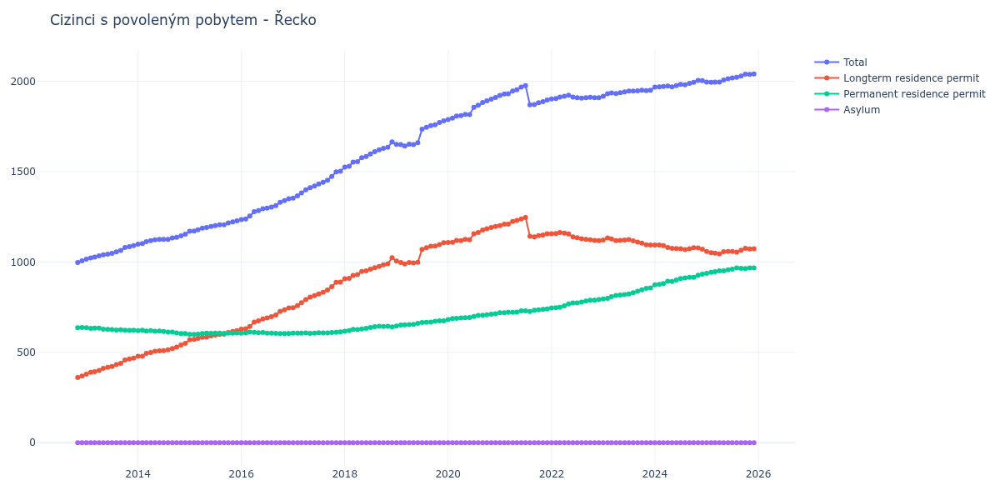

# Řecko

## Souhrnné statistiky (Min/Max pro rok) / Summary Statistics (Min/Max per year)

| Year   | Total Min/Max   | Longterm Residence Permit Min/Max   | Permanent Residence Permit Min/Max   | Asylum Min/Max   |
|--------|-----------------|-------------------------------------|--------------------------------------|------------------|
| 2012   | 997 / 1 007     | 361 / 369                           | 636 / 638                            | 0 / 0            |
| 2013   | 1 016 / 1 091   | 379 / 468                           | 622 / 637                            | 0 / 0            |
| 2014   | 1 099 / 1 154   | 479 / 550                           | 604 / 623                            | 0 / 0            |
| 2015   | 1 170 / 1 228   | 570 / 620                           | 600 / 608                            | 0 / 0            |
| 2016   | 1 235 / 1 350   | 628 / 746                           | 604 / 612                            | 0 / 0            |
| 2017   | 1 354 / 1 503   | 747 / 889                           | 605 / 614                            | 0 / 0            |
| 2018   | 1 525 / 1 665   | 908 / 1 024                         | 617 / 645                            | 0 / 0            |
| 2019   | 1 642 / 1 782   | 989 / 1 107                         | 646 / 675                            | 0 / 0            |
| 2020   | 1 789 / 1 911   | 1 108 / 1 197                       | 681 / 714                            | 0 / 0            |
| 2021   | 1 870 / 1 977   | 1 139 / 1 247                       | 720 / 740                            | 0 / 0            |
| 2022   | 1 903 / 1 923   | 1 118 / 1 163                       | 746 / 792                            | 0 / 0            |
| 2023   | 1 918 / 1 951   | 1 094 / 1 133                       | 796 / 857                            | 0 / 0            |
| 2024   | 1 968 / 2 005   | 1 069 / 1 094                       | 874 / 933                            | 0 / 0            |
| 2025   | 1 995 / 2 041   | 1 045 / 1 076                       | 937 / 967                            | 0 / 0            |

## Detailní tabulka / Detailed Data Table

| Date     | Total          | Longterm Residence Permit   | Permanent Residence Permit   | Asylum   |
|----------|----------------|-----------------------------|------------------------------|----------|
| **2012** |                |                             |                              |          |
| 11.2012  | 997            | 361                         | 636                          | 0        |
| 12.2012  | 1 007 (+1.00%) | 369 (+2.22%)                | 638 (+0.31%)                 | 0        |
| **2013** |                |                             |                              |          |
| 01.2013  | 1 016 (+0.89%) | 379 (+2.71%)                | 637 (-0.16%)                 | 0        |
| 02.2013  | 1 023 (+0.69%) | 390 (+2.90%)                | 633 (-0.63%)                 | 0        |
| 03.2013  | 1 027 (+0.39%) | 393 (+0.77%)                | 634 (+0.16%)                 | 0        |
| 04.2013  | 1 034 (+0.68%) | 400 (+1.78%)                | 634 (+0.00%)                 | 0        |
| 05.2013  | 1 040 (+0.58%) | 412 (+3.00%)                | 628 (-0.95%)                 | 0        |
| 06.2013  | 1 044 (+0.38%) | 417 (+1.21%)                | 627 (-0.16%)                 | 0        |
| 07.2013  | 1 048 (+0.38%) | 422 (+1.20%)                | 626 (-0.16%)                 | 0        |
| 08.2013  | 1 056 (+0.76%) | 432 (+2.37%)                | 624 (-0.32%)                 | 0        |
| 09.2013  | 1 064 (+0.76%) | 439 (+1.62%)                | 625 (+0.16%)                 | 0        |
| 10.2013  | 1 081 (+1.60%) | 458 (+4.33%)                | 623 (-0.32%)                 | 0        |
| 11.2013  | 1 085 (+0.37%) | 463 (+1.09%)                | 622 (-0.16%)                 | 0        |
| 12.2013  | 1 091 (+0.55%) | 468 (+1.08%)                | 623 (+0.16%)                 | 0        |
| **2014** |                |                             |                              |          |
| 01.2014  | 1 099 (+0.73%) | 479 (+2.35%)                | 620 (-0.48%)                 | 0        |
| 02.2014  | 1 102 (+0.27%) | 479 (+0.00%)                | 623 (+0.48%)                 | 0        |
| 03.2014  | 1 113 (+1.00%) | 495 (+3.34%)                | 618 (-0.80%)                 | 0        |
| 04.2014  | 1 119 (+0.54%) | 499 (+0.81%)                | 620 (+0.32%)                 | 0        |
| 05.2014  | 1 123 (+0.36%) | 506 (+1.40%)                | 617 (-0.48%)                 | 0        |
| 06.2014  | 1 126 (+0.27%) | 508 (+0.40%)                | 618 (+0.16%)                 | 0        |
| 07.2014  | 1 126 (+0.00%) | 510 (+0.39%)                | 616 (-0.32%)                 | 0        |
| 08.2014  | 1 126 (+0.00%) | 514 (+0.78%)                | 612 (-0.65%)                 | 0        |
| 09.2014  | 1 133 (+0.62%) | 521 (+1.36%)                | 612 (+0.00%)                 | 0        |
| 10.2014  | 1 137 (+0.35%) | 529 (+1.54%)                | 608 (-0.65%)                 | 0        |
| 11.2014  | 1 145 (+0.70%) | 541 (+2.27%)                | 604 (-0.66%)                 | 0        |
| 12.2014  | 1 154 (+0.79%) | 550 (+1.66%)                | 604 (+0.00%)                 | 0        |
| **2015** |                |                             |                              |          |
| 01.2015  | 1 170 (+1.39%) | 570 (+3.64%)                | 600 (-0.66%)                 | 0        |
| 02.2015  | 1 172 (+0.17%) | 572 (+0.35%)                | 600 (+0.00%)                 | 0        |
| 03.2015  | 1 179 (+0.60%) | 578 (+1.05%)                | 601 (+0.17%)                 | 0        |
| 04.2015  | 1 188 (+0.76%) | 584 (+1.04%)                | 604 (+0.50%)                 | 0        |
| 05.2015  | 1 191 (+0.25%) | 585 (+0.17%)                | 606 (+0.33%)                 | 0        |
| 06.2015  | 1 197 (+0.50%) | 592 (+1.20%)                | 605 (-0.17%)                 | 0        |
| 07.2015  | 1 202 (+0.42%) | 596 (+0.68%)                | 606 (+0.17%)                 | 0        |
| 08.2015  | 1 206 (+0.33%) | 600 (+0.67%)                | 606 (+0.00%)                 | 0        |
| 09.2015  | 1 206 (+0.00%) | 601 (+0.17%)                | 605 (-0.17%)                 | 0        |
| 10.2015  | 1 217 (+0.91%) | 610 (+1.50%)                | 607 (+0.33%)                 | 0        |
| 11.2015  | 1 222 (+0.41%) | 616 (+0.98%)                | 606 (-0.16%)                 | 0        |
| 12.2015  | 1 228 (+0.49%) | 620 (+0.65%)                | 608 (+0.33%)                 | 0        |
| **2016** |                |                             |                              |          |
| 01.2016  | 1 235 (+0.57%) | 628 (+1.29%)                | 607 (-0.16%)                 | 0        |
| 02.2016  | 1 239 (+0.32%) | 631 (+0.48%)                | 608 (+0.16%)                 | 0        |
| 03.2016  | 1 255 (+1.29%) | 643 (+1.90%)                | 612 (+0.66%)                 | 0        |
| 04.2016  | 1 279 (+1.91%) | 668 (+3.89%)                | 611 (-0.16%)                 | 0        |
| 05.2016  | 1 284 (+0.39%) | 675 (+1.05%)                | 609 (-0.33%)                 | 0        |
| 06.2016  | 1 295 (+0.86%) | 685 (+1.48%)                | 610 (+0.16%)                 | 0        |
| 07.2016  | 1 298 (+0.23%) | 691 (+0.88%)                | 607 (-0.49%)                 | 0        |
| 08.2016  | 1 304 (+0.46%) | 698 (+1.01%)                | 606 (-0.16%)                 | 0        |
| 09.2016  | 1 312 (+0.61%) | 707 (+1.29%)                | 605 (-0.17%)                 | 0        |
| 10.2016  | 1 331 (+1.45%) | 727 (+2.83%)                | 604 (-0.17%)                 | 0        |
| 11.2016  | 1 340 (+0.68%) | 736 (+1.24%)                | 604 (+0.00%)                 | 0        |
| 12.2016  | 1 350 (+0.75%) | 746 (+1.36%)                | 604 (+0.00%)                 | 0        |
| **2017** |                |                             |                              |          |
| 01.2017  | 1 354 (+0.30%) | 747 (+0.13%)                | 607 (+0.50%)                 | 0        |
| 02.2017  | 1 366 (+0.89%) | 759 (+1.61%)                | 607 (+0.00%)                 | 0        |
| 03.2017  | 1 382 (+1.17%) | 775 (+2.11%)                | 607 (+0.00%)                 | 0        |
| 04.2017  | 1 400 (+1.30%) | 792 (+2.19%)                | 608 (+0.16%)                 | 0        |
| 05.2017  | 1 411 (+0.79%) | 806 (+1.77%)                | 605 (-0.49%)                 | 0        |
| 06.2017  | 1 421 (+0.71%) | 814 (+0.99%)                | 607 (+0.33%)                 | 0        |
| 07.2017  | 1 432 (+0.77%) | 823 (+1.11%)                | 609 (+0.33%)                 | 0        |
| 08.2017  | 1 441 (+0.63%) | 833 (+1.22%)                | 608 (-0.16%)                 | 0        |
| 09.2017  | 1 453 (+0.83%) | 845 (+1.44%)                | 608 (+0.00%)                 | 0        |
| 10.2017  | 1 474 (+1.45%) | 864 (+2.25%)                | 610 (+0.33%)                 | 0        |
| 11.2017  | 1 499 (+1.70%) | 888 (+2.78%)                | 611 (+0.16%)                 | 0        |
| 12.2017  | 1 503 (+0.27%) | 889 (+0.11%)                | 614 (+0.49%)                 | 0        |
| **2018** |                |                             |                              |          |
| 01.2018  | 1 525 (+1.46%) | 908 (+2.14%)                | 617 (+0.49%)                 | 0        |
| 02.2018  | 1 530 (+0.33%) | 910 (+0.22%)                | 620 (+0.49%)                 | 0        |
| 03.2018  | 1 553 (+1.50%) | 926 (+1.76%)                | 627 (+1.13%)                 | 0        |
| 04.2018  | 1 556 (+0.19%) | 930 (+0.43%)                | 626 (-0.16%)                 | 0        |
| 05.2018  | 1 578 (+1.41%) | 948 (+1.94%)                | 630 (+0.64%)                 | 0        |
| 06.2018  | 1 584 (+0.38%) | 951 (+0.32%)                | 633 (+0.48%)                 | 0        |
| 07.2018  | 1 598 (+0.88%) | 960 (+0.95%)                | 638 (+0.79%)                 | 0        |
| 08.2018  | 1 611 (+0.81%) | 969 (+0.94%)                | 642 (+0.63%)                 | 0        |
| 09.2018  | 1 621 (+0.62%) | 976 (+0.72%)                | 645 (+0.47%)                 | 0        |
| 10.2018  | 1 629 (+0.49%) | 985 (+0.92%)                | 644 (-0.16%)                 | 0        |
| 11.2018  | 1 635 (+0.37%) | 990 (+0.51%)                | 645 (+0.16%)                 | 0        |
| 12.2018  | 1 665 (+1.83%) | 1 024 (+3.43%)              | 641 (-0.62%)                 | 0        |
| **2019** |                |                             |                              |          |
| 01.2019  | 1 651 (-0.84%) | 1 005 (-1.86%)              | 646 (+0.78%)                 | 0        |
| 02.2019  | 1 650 (-0.06%) | 998 (-0.70%)                | 652 (+0.93%)                 | 0        |
| 03.2019  | 1 642 (-0.48%) | 989 (-0.90%)                | 653 (+0.15%)                 | 0        |
| 04.2019  | 1 652 (+0.61%) | 998 (+0.91%)                | 654 (+0.15%)                 | 0        |
| 05.2019  | 1 650 (-0.12%) | 995 (-0.30%)                | 655 (+0.15%)                 | 0        |
| 06.2019  | 1 660 (+0.61%) | 999 (+0.40%)                | 661 (+0.92%)                 | 0        |
| 07.2019  | 1 735 (+4.52%) | 1 070 (+7.11%)              | 665 (+0.61%)                 | 0        |
| 08.2019  | 1 746 (+0.63%) | 1 079 (+0.84%)              | 667 (+0.30%)                 | 0        |
| 09.2019  | 1 755 (+0.52%) | 1 087 (+0.74%)              | 668 (+0.15%)                 | 0        |
| 10.2019  | 1 760 (+0.28%) | 1 088 (+0.09%)              | 672 (+0.60%)                 | 0        |
| 11.2019  | 1 772 (+0.68%) | 1 097 (+0.83%)              | 675 (+0.45%)                 | 0        |
| 12.2019  | 1 782 (+0.56%) | 1 107 (+0.91%)              | 675 (+0.00%)                 | 0        |
| **2020** |                |                             |                              |          |
| 01.2020  | 1 789 (+0.39%) | 1 108 (+0.09%)              | 681 (+0.89%)                 | 0        |
| 02.2020  | 1 796 (+0.39%) | 1 109 (+0.09%)              | 687 (+0.88%)                 | 0        |
| 03.2020  | 1 808 (+0.67%) | 1 120 (+0.99%)              | 688 (+0.15%)                 | 0        |
| 04.2020  | 1 810 (+0.11%) | 1 119 (-0.09%)              | 691 (+0.44%)                 | 0        |
| 05.2020  | 1 817 (+0.39%) | 1 125 (+0.54%)              | 692 (+0.14%)                 | 0        |
| 06.2020  | 1 816 (-0.06%) | 1 123 (-0.18%)              | 693 (+0.14%)                 | 0        |
| 07.2020  | 1 856 (+2.20%) | 1 157 (+3.03%)              | 699 (+0.87%)                 | 0        |
| 08.2020  | 1 868 (+0.65%) | 1 164 (+0.61%)              | 704 (+0.72%)                 | 0        |
| 09.2020  | 1 883 (+0.80%) | 1 177 (+1.12%)              | 706 (+0.28%)                 | 0        |
| 10.2020  | 1 892 (+0.48%) | 1 184 (+0.59%)              | 708 (+0.28%)                 | 0        |
| 11.2020  | 1 902 (+0.53%) | 1 191 (+0.59%)              | 711 (+0.42%)                 | 0        |
| 12.2020  | 1 911 (+0.47%) | 1 197 (+0.50%)              | 714 (+0.42%)                 | 0        |
| **2021** |                |                             |                              |          |
| 01.2021  | 1 922 (+0.58%) | 1 202 (+0.42%)              | 720 (+0.84%)                 | 0        |
| 02.2021  | 1 930 (+0.42%) | 1 210 (+0.67%)              | 720 (+0.00%)                 | 0        |
| 03.2021  | 1 932 (+0.10%) | 1 210 (+0.00%)              | 722 (+0.28%)                 | 0        |
| 04.2021  | 1 947 (+0.78%) | 1 225 (+1.24%)              | 722 (+0.00%)                 | 0        |
| 05.2021  | 1 953 (+0.31%) | 1 230 (+0.41%)              | 723 (+0.14%)                 | 0        |
| 06.2021  | 1 968 (+0.77%) | 1 238 (+0.65%)              | 730 (+0.97%)                 | 0        |
| 07.2021  | 1 977 (+0.46%) | 1 247 (+0.73%)              | 730 (+0.00%)                 | 0        |
| 08.2021  | 1 870 (-5.41%) | 1 143 (-8.34%)              | 727 (-0.41%)                 | 0        |
| 09.2021  | 1 872 (+0.11%) | 1 139 (-0.35%)              | 733 (+0.83%)                 | 0        |
| 10.2021  | 1 882 (+0.53%) | 1 146 (+0.61%)              | 736 (+0.41%)                 | 0        |
| 11.2021  | 1 888 (+0.32%) | 1 150 (+0.35%)              | 738 (+0.27%)                 | 0        |
| 12.2021  | 1 897 (+0.48%) | 1 157 (+0.61%)              | 740 (+0.27%)                 | 0        |
| **2022** |                |                             |                              |          |
| 01.2022  | 1 903 (+0.32%) | 1 157 (+0.00%)              | 746 (+0.81%)                 | 0        |
| 02.2022  | 1 905 (+0.11%) | 1 158 (+0.09%)              | 747 (+0.13%)                 | 0        |
| 03.2022  | 1 913 (+0.42%) | 1 163 (+0.43%)              | 750 (+0.40%)                 | 0        |
| 04.2022  | 1 918 (+0.26%) | 1 160 (-0.26%)              | 758 (+1.07%)                 | 0        |
| 05.2022  | 1 923 (+0.26%) | 1 155 (-0.43%)              | 768 (+1.32%)                 | 0        |
| 06.2022  | 1 913 (-0.52%) | 1 139 (-1.39%)              | 774 (+0.78%)                 | 0        |
| 07.2022  | 1 909 (-0.21%) | 1 135 (-0.35%)              | 774 (+0.00%)                 | 0        |
| 08.2022  | 1 907 (-0.10%) | 1 129 (-0.53%)              | 778 (+0.52%)                 | 0        |
| 09.2022  | 1 909 (+0.10%) | 1 125 (-0.35%)              | 784 (+0.77%)                 | 0        |
| 10.2022  | 1 912 (+0.16%) | 1 123 (-0.18%)              | 789 (+0.64%)                 | 0        |
| 11.2022  | 1 909 (-0.16%) | 1 120 (-0.27%)              | 789 (+0.00%)                 | 0        |
| 12.2022  | 1 910 (+0.05%) | 1 118 (-0.18%)              | 792 (+0.38%)                 | 0        |
| **2023** |                |                             |                              |          |
| 01.2023  | 1 918 (+0.42%) | 1 122 (+0.36%)              | 796 (+0.51%)                 | 0        |
| 02.2023  | 1 932 (+0.73%) | 1 133 (+0.98%)              | 799 (+0.38%)                 | 0        |
| 03.2023  | 1 936 (+0.21%) | 1 128 (-0.44%)              | 808 (+1.13%)                 | 0        |
| 04.2023  | 1 933 (-0.15%) | 1 118 (-0.89%)              | 815 (+0.87%)                 | 0        |
| 05.2023  | 1 937 (+0.21%) | 1 120 (+0.18%)              | 817 (+0.25%)                 | 0        |
| 06.2023  | 1 942 (+0.26%) | 1 122 (+0.18%)              | 820 (+0.37%)                 | 0        |
| 07.2023  | 1 947 (+0.26%) | 1 124 (+0.18%)              | 823 (+0.37%)                 | 0        |
| 08.2023  | 1 947 (+0.00%) | 1 117 (-0.62%)              | 830 (+0.85%)                 | 0        |
| 09.2023  | 1 948 (+0.05%) | 1 110 (-0.63%)              | 838 (+0.96%)                 | 0        |
| 10.2023  | 1 951 (+0.15%) | 1 105 (-0.45%)              | 846 (+0.95%)                 | 0        |
| 11.2023  | 1 949 (-0.10%) | 1 095 (-0.90%)              | 854 (+0.95%)                 | 0        |
| 12.2023  | 1 951 (+0.10%) | 1 094 (-0.09%)              | 857 (+0.35%)                 | 0        |
| **2024** |                |                             |                              |          |
| 01.2024  | 1 968 (+0.87%) | 1 094 (+0.00%)              | 874 (+1.98%)                 | 0        |
| 02.2024  | 1 970 (+0.10%) | 1 094 (+0.00%)              | 876 (+0.23%)                 | 0        |
| 03.2024  | 1 972 (+0.10%) | 1 091 (-0.27%)              | 881 (+0.57%)                 | 0        |
| 04.2024  | 1 974 (+0.10%) | 1 080 (-1.01%)              | 894 (+1.48%)                 | 0        |
| 05.2024  | 1 969 (-0.25%) | 1 076 (-0.37%)              | 893 (-0.11%)                 | 0        |
| 06.2024  | 1 976 (+0.36%) | 1 075 (-0.09%)              | 901 (+0.90%)                 | 0        |
| 07.2024  | 1 983 (+0.35%) | 1 074 (-0.09%)              | 909 (+0.89%)                 | 0        |
| 08.2024  | 1 981 (-0.10%) | 1 069 (-0.47%)              | 912 (+0.33%)                 | 0        |
| 09.2024  | 1 989 (+0.40%) | 1 073 (+0.37%)              | 916 (+0.44%)                 | 0        |
| 10.2024  | 1 995 (+0.30%) | 1 079 (+0.56%)              | 916 (+0.00%)                 | 0        |
| 11.2024  | 2 005 (+0.50%) | 1 078 (-0.09%)              | 927 (+1.20%)                 | 0        |
| 12.2024  | 2 004 (-0.05%) | 1 071 (-0.65%)              | 933 (+0.65%)                 | 0        |
| **2025** |                |                             |                              |          |
| 01.2025  | 1 996 (-0.40%) | 1 059 (-1.12%)              | 937 (+0.43%)                 | 0        |
| 02.2025  | 1 995 (-0.05%) | 1 052 (-0.66%)              | 943 (+0.64%)                 | 0        |
| 03.2025  | 1 996 (+0.05%) | 1 049 (-0.29%)              | 947 (+0.42%)                 | 0        |
| 04.2025  | 1 996 (+0.00%) | 1 045 (-0.38%)              | 951 (+0.42%)                 | 0        |
| 05.2025  | 2 008 (+0.60%) | 1 057 (+1.15%)              | 951 (+0.00%)                 | 0        |
| 06.2025  | 2 015 (+0.35%) | 1 058 (+0.09%)              | 957 (+0.63%)                 | 0        |
| 07.2025  | 2 019 (+0.20%) | 1 058 (+0.00%)              | 961 (+0.42%)                 | 0        |
| 08.2025  | 2 022 (+0.15%) | 1 055 (-0.28%)              | 967 (+0.62%)                 | 0        |
| 09.2025  | 2 030 (+0.40%) | 1 065 (+0.95%)              | 965 (-0.21%)                 | 0        |
| 10.2025  | 2 040 (+0.49%) | 1 076 (+1.03%)              | 964 (-0.10%)                 | 0        |
| 11.2025  | 2 039 (-0.05%) | 1 072 (-0.37%)              | 967 (+0.31%)                 | 0        |
| 12.2025  | 2 041 (+0.10%) | 1 074 (+0.19%)              | 967 (+0.00%)                 | 0        |
