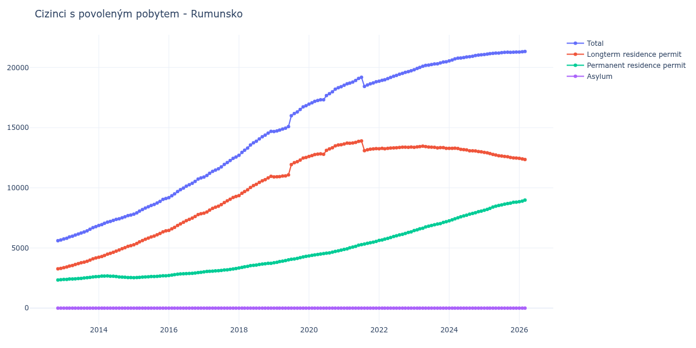

# Rumunsko

## Souhrnné statistiky (Min/Max pro rok) / Summary Statistics (Min/Max per year)

| Year   | Total           | Longterm Residence Permit   | Permanent Residence Permit   | Asylum   |
|--------|-----------------|-----------------------------|------------------------------|----------|
| 2012   | 5 598 / 5 664   | 3 264 / 3 306               | 2 334 / 2 358                | 0 / 0    |
| 2013   | 5 745 / 6 777   | 3 359 / 4 167               | 2 386 / 2 610                | 0 / 0    |
| 2014   | 6 867 / 7 741   | 4 234 / 5 199               | 2 542 / 2 673                | 0 / 0    |
| 2015   | 7 804 / 9 116   | 5 270 / 6 428               | 2 534 / 2 691                | 0 / 0    |
| 2016   | 9 178 / 10 826  | 6 464 / 7 847               | 2 714 / 2 979                | 0 / 0    |
| 2017   | 10 898 / 12 562 | 7 891 / 9 274               | 3 007 / 3 288                | 0 / 0    |
| 2018   | 12 696 / 14 684 | 9 352 / 10 955              | 3 344 / 3 729                | 0 / 0    |
| 2019   | 14 673 / 16 824 | 10 905 / 12 526             | 3 768 / 4 298                | 0 / 0    |
| 2020   | 16 950 / 18 396 | 12 610 / 13 579             | 4 340 / 4 817                | 0 / 0    |
| 2021   | 18 424 / 19 180 | 13 093 / 13 896             | 4 880 / 5 545                | 0 / 0    |
| 2022   | 18 864 / 19 724 | 13 240 / 13 389             | 5 624 / 6 335                | 0 / 0    |
| 2023   | 19 816 / 20 469 | 13 283 / 13 458             | 6 451 / 7 186                | 0 / 0    |
| 2024   | 20 544 / 21 049 | 12 986 / 13 295             | 7 259 / 8 063                | 0 / 0    |
| 2025   | 21 073 / 21 287 | 12 472 / 12 937             | 8 136 / 8 815                | 0 / 0    |
| 2026   | 21 287 / 21 330 | 12 356 / 12 443             | 8 844 / 8 974                | 0 / 0    |

## Detailní tabulka / Detailed Data Table

| Date     | Total           | Longterm Residence Permit   | Permanent Residence Permit   | Asylum   |
|----------|-----------------|-----------------------------|------------------------------|----------|
| **2012** |                 |                             |                              |          |
| 11.2012  | 5 598           | 3 264                       | 2 334                        | 0        |
| 12.2012  | 5 664 (+1.18%)  | 3 306 (+1.29%)              | 2 358 (+1.03%)               | 0        |
| **2013** |                 |                             |                              |          |
| 01.2013  | 5 745 (+1.43%)  | 3 359 (+1.60%)              | 2 386 (+1.19%)               | 0        |
| 02.2013  | 5 813 (+1.18%)  | 3 425 (+1.96%)              | 2 388 (+0.08%)               | 0        |
| 03.2013  | 5 914 (+1.74%)  | 3 495 (+2.04%)              | 2 419 (+1.30%)               | 0        |
| 04.2013  | 5 974 (+1.01%)  | 3 547 (+1.49%)              | 2 427 (+0.33%)               | 0        |
| 05.2013  | 6 070 (+1.61%)  | 3 632 (+2.40%)              | 2 438 (+0.45%)               | 0        |
| 06.2013  | 6 156 (+1.42%)  | 3 700 (+1.87%)              | 2 456 (+0.74%)               | 0        |
| 07.2013  | 6 247 (+1.48%)  | 3 773 (+1.97%)              | 2 474 (+0.73%)               | 0        |
| 08.2013  | 6 332 (+1.36%)  | 3 825 (+1.38%)              | 2 507 (+1.33%)               | 0        |
| 09.2013  | 6 425 (+1.47%)  | 3 898 (+1.91%)              | 2 527 (+0.80%)               | 0        |
| 10.2013  | 6 551 (+1.96%)  | 3 991 (+2.39%)              | 2 560 (+1.31%)               | 0        |
| 11.2013  | 6 686 (+2.06%)  | 4 100 (+2.73%)              | 2 586 (+1.02%)               | 0        |
| 12.2013  | 6 777 (+1.36%)  | 4 167 (+1.63%)              | 2 610 (+0.93%)               | 0        |
| **2014** |                 |                             |                              |          |
| 01.2014  | 6 867 (+1.33%)  | 4 234 (+1.61%)              | 2 633 (+0.88%)               | 0        |
| 02.2014  | 6 944 (+1.12%)  | 4 286 (+1.23%)              | 2 658 (+0.95%)               | 0        |
| 03.2014  | 7 049 (+1.51%)  | 4 380 (+2.19%)              | 2 669 (+0.41%)               | 0        |
| 04.2014  | 7 150 (+1.43%)  | 4 477 (+2.21%)              | 2 673 (+0.15%)               | 0        |
| 05.2014  | 7 208 (+0.81%)  | 4 554 (+1.72%)              | 2 654 (-0.71%)               | 0        |
| 06.2014  | 7 295 (+1.21%)  | 4 638 (+1.84%)              | 2 657 (+0.11%)               | 0        |
| 07.2014  | 7 370 (+1.03%)  | 4 737 (+2.13%)              | 2 633 (-0.90%)               | 0        |
| 08.2014  | 7 424 (+0.73%)  | 4 829 (+1.94%)              | 2 595 (-1.44%)               | 0        |
| 09.2014  | 7 512 (+1.19%)  | 4 936 (+2.22%)              | 2 576 (-0.73%)               | 0        |
| 10.2014  | 7 591 (+1.05%)  | 5 030 (+1.90%)              | 2 561 (-0.58%)               | 0        |
| 11.2014  | 7 686 (+1.25%)  | 5 138 (+2.15%)              | 2 548 (-0.51%)               | 0        |
| 12.2014  | 7 741 (+0.72%)  | 5 199 (+1.19%)              | 2 542 (-0.24%)               | 0        |
| **2015** |                 |                             |                              |          |
| 01.2015  | 7 804 (+0.81%)  | 5 270 (+1.37%)              | 2 534 (-0.31%)               | 0        |
| 02.2015  | 7 914 (+1.41%)  | 5 373 (+1.95%)              | 2 541 (+0.28%)               | 0        |
| 03.2015  | 8 061 (+1.86%)  | 5 507 (+2.49%)              | 2 554 (+0.51%)               | 0        |
| 04.2015  | 8 197 (+1.69%)  | 5 620 (+2.05%)              | 2 577 (+0.90%)               | 0        |
| 05.2015  | 8 312 (+1.40%)  | 5 719 (+1.76%)              | 2 593 (+0.62%)               | 0        |
| 06.2015  | 8 422 (+1.32%)  | 5 821 (+1.78%)              | 2 601 (+0.31%)               | 0        |
| 07.2015  | 8 538 (+1.38%)  | 5 913 (+1.58%)              | 2 625 (+0.92%)               | 0        |
| 08.2015  | 8 620 (+0.96%)  | 5 991 (+1.32%)              | 2 629 (+0.15%)               | 0        |
| 09.2015  | 8 740 (+1.39%)  | 6 098 (+1.79%)              | 2 642 (+0.49%)               | 0        |
| 10.2015  | 8 873 (+1.52%)  | 6 212 (+1.87%)              | 2 661 (+0.72%)               | 0        |
| 11.2015  | 9 033 (+1.80%)  | 6 342 (+2.09%)              | 2 691 (+1.13%)               | 0        |
| 12.2015  | 9 116 (+0.92%)  | 6 428 (+1.36%)              | 2 688 (-0.11%)               | 0        |
| **2016** |                 |                             |                              |          |
| 01.2016  | 9 178 (+0.68%)  | 6 464 (+0.56%)              | 2 714 (+0.97%)               | 0        |
| 02.2016  | 9 337 (+1.73%)  | 6 586 (+1.89%)              | 2 751 (+1.36%)               | 0        |
| 03.2016  | 9 498 (+1.72%)  | 6 717 (+1.99%)              | 2 781 (+1.09%)               | 0        |
| 04.2016  | 9 687 (+1.99%)  | 6 870 (+2.28%)              | 2 817 (+1.29%)               | 0        |
| 05.2016  | 9 840 (+1.58%)  | 7 001 (+1.91%)              | 2 839 (+0.78%)               | 0        |
| 06.2016  | 9 983 (+1.45%)  | 7 131 (+1.86%)              | 2 852 (+0.46%)               | 0        |
| 07.2016  | 10 132 (+1.49%) | 7 262 (+1.84%)              | 2 870 (+0.63%)               | 0        |
| 08.2016  | 10 254 (+1.20%) | 7 372 (+1.51%)              | 2 882 (+0.42%)               | 0        |
| 09.2016  | 10 379 (+1.22%) | 7 484 (+1.52%)              | 2 895 (+0.45%)               | 0        |
| 10.2016  | 10 531 (+1.46%) | 7 615 (+1.75%)              | 2 916 (+0.73%)               | 0        |
| 11.2016  | 10 725 (+1.84%) | 7 777 (+2.13%)              | 2 948 (+1.10%)               | 0        |
| 12.2016  | 10 826 (+0.94%) | 7 847 (+0.90%)              | 2 979 (+1.05%)               | 0        |
| **2017** |                 |                             |                              |          |
| 01.2017  | 10 898 (+0.67%) | 7 891 (+0.56%)              | 3 007 (+0.94%)               | 0        |
| 02.2017  | 11 032 (+1.23%) | 7 988 (+1.23%)              | 3 044 (+1.23%)               | 0        |
| 03.2017  | 11 206 (+1.58%) | 8 145 (+1.97%)              | 3 061 (+0.56%)               | 0        |
| 04.2017  | 11 359 (+1.37%) | 8 287 (+1.74%)              | 3 072 (+0.36%)               | 0        |
| 05.2017  | 11 475 (+1.02%) | 8 383 (+1.16%)              | 3 092 (+0.65%)               | 0        |
| 06.2017  | 11 586 (+0.97%) | 8 474 (+1.09%)              | 3 112 (+0.65%)               | 0        |
| 07.2017  | 11 734 (+1.28%) | 8 600 (+1.49%)              | 3 134 (+0.71%)               | 0        |
| 08.2017  | 11 939 (+1.75%) | 8 775 (+2.03%)              | 3 164 (+0.96%)               | 0        |
| 09.2017  | 12 102 (+1.37%) | 8 919 (+1.64%)              | 3 183 (+0.60%)               | 0        |
| 10.2017  | 12 268 (+1.37%) | 9 050 (+1.47%)              | 3 218 (+1.10%)               | 0        |
| 11.2017  | 12 447 (+1.46%) | 9 193 (+1.58%)              | 3 254 (+1.12%)               | 0        |
| 12.2017  | 12 562 (+0.92%) | 9 274 (+0.88%)              | 3 288 (+1.04%)               | 0        |
| **2018** |                 |                             |                              |          |
| 01.2018  | 12 696 (+1.07%) | 9 352 (+0.84%)              | 3 344 (+1.70%)               | 0        |
| 02.2018  | 12 940 (+1.92%) | 9 549 (+2.11%)              | 3 391 (+1.41%)               | 0        |
| 03.2018  | 13 119 (+1.38%) | 9 688 (+1.46%)              | 3 431 (+1.18%)               | 0        |
| 04.2018  | 13 305 (+1.42%) | 9 831 (+1.48%)              | 3 474 (+1.25%)               | 0        |
| 05.2018  | 13 552 (+1.86%) | 10 026 (+1.98%)             | 3 526 (+1.50%)               | 0        |
| 06.2018  | 13 733 (+1.34%) | 10 177 (+1.51%)             | 3 556 (+0.85%)               | 0        |
| 07.2018  | 13 873 (+1.02%) | 10 288 (+1.09%)             | 3 585 (+0.82%)               | 0        |
| 08.2018  | 14 069 (+1.41%) | 10 447 (+1.55%)             | 3 622 (+1.03%)               | 0        |
| 09.2018  | 14 248 (+1.27%) | 10 579 (+1.26%)             | 3 669 (+1.30%)               | 0        |
| 10.2018  | 14 373 (+0.88%) | 10 681 (+0.96%)             | 3 692 (+0.63%)               | 0        |
| 11.2018  | 14 542 (+1.18%) | 10 817 (+1.27%)             | 3 725 (+0.89%)               | 0        |
| 12.2018  | 14 684 (+0.98%) | 10 955 (+1.28%)             | 3 729 (+0.11%)               | 0        |
| **2019** |                 |                             |                              |          |
| 01.2019  | 14 673 (-0.07%) | 10 905 (-0.46%)             | 3 768 (+1.05%)               | 0        |
| 02.2019  | 14 727 (+0.37%) | 10 914 (+0.08%)             | 3 813 (+1.19%)               | 0        |
| 03.2019  | 14 798 (+0.48%) | 10 931 (+0.16%)             | 3 867 (+1.42%)               | 0        |
| 04.2019  | 14 882 (+0.57%) | 10 979 (+0.44%)             | 3 903 (+0.93%)               | 0        |
| 05.2019  | 14 951 (+0.46%) | 10 995 (+0.15%)             | 3 956 (+1.36%)               | 0        |
| 06.2019  | 15 085 (+0.90%) | 11 069 (+0.67%)             | 4 016 (+1.52%)               | 0        |
| 07.2019  | 15 993 (+6.02%) | 11 935 (+7.82%)             | 4 058 (+1.05%)               | 0        |
| 08.2019  | 16 168 (+1.09%) | 12 081 (+1.22%)             | 4 087 (+0.71%)               | 0        |
| 09.2019  | 16 310 (+0.88%) | 12 176 (+0.79%)             | 4 134 (+1.15%)               | 0        |
| 10.2019  | 16 504 (+1.19%) | 12 309 (+1.09%)             | 4 195 (+1.48%)               | 0        |
| 11.2019  | 16 722 (+1.32%) | 12 472 (+1.32%)             | 4 250 (+1.31%)               | 0        |
| 12.2019  | 16 824 (+0.61%) | 12 526 (+0.43%)             | 4 298 (+1.13%)               | 0        |
| **2020** |                 |                             |                              |          |
| 01.2020  | 16 950 (+0.75%) | 12 610 (+0.67%)             | 4 340 (+0.98%)               | 0        |
| 02.2020  | 17 067 (+0.69%) | 12 678 (+0.54%)             | 4 389 (+1.13%)               | 0        |
| 03.2020  | 17 188 (+0.71%) | 12 767 (+0.70%)             | 4 421 (+0.73%)               | 0        |
| 04.2020  | 17 257 (+0.40%) | 12 804 (+0.29%)             | 4 453 (+0.72%)               | 0        |
| 05.2020  | 17 321 (+0.37%) | 12 825 (+0.16%)             | 4 496 (+0.97%)               | 0        |
| 06.2020  | 17 313 (-0.05%) | 12 782 (-0.34%)             | 4 531 (+0.78%)               | 0        |
| 07.2020  | 17 669 (+2.06%) | 13 107 (+2.54%)             | 4 562 (+0.68%)               | 0        |
| 08.2020  | 17 819 (+0.85%) | 13 226 (+0.91%)             | 4 593 (+0.68%)               | 0        |
| 09.2020  | 17 979 (+0.90%) | 13 329 (+0.78%)             | 4 650 (+1.24%)               | 0        |
| 10.2020  | 18 191 (+1.18%) | 13 484 (+1.16%)             | 4 707 (+1.23%)               | 0        |
| 11.2020  | 18 313 (+0.67%) | 13 555 (+0.53%)             | 4 758 (+1.08%)               | 0        |
| 12.2020  | 18 396 (+0.45%) | 13 579 (+0.18%)             | 4 817 (+1.24%)               | 0        |
| **2021** |                 |                             |                              |          |
| 01.2021  | 18 518 (+0.66%) | 13 638 (+0.43%)             | 4 880 (+1.31%)               | 0        |
| 02.2021  | 18 640 (+0.66%) | 13 710 (+0.53%)             | 4 930 (+1.02%)               | 0        |
| 03.2021  | 18 707 (+0.36%) | 13 697 (-0.09%)             | 5 010 (+1.62%)               | 0        |
| 04.2021  | 18 793 (+0.46%) | 13 723 (+0.19%)             | 5 070 (+1.20%)               | 0        |
| 05.2021  | 18 914 (+0.64%) | 13 777 (+0.39%)             | 5 137 (+1.32%)               | 0        |
| 06.2021  | 19 086 (+0.91%) | 13 861 (+0.61%)             | 5 225 (+1.71%)               | 0        |
| 07.2021  | 19 180 (+0.49%) | 13 896 (+0.25%)             | 5 284 (+1.13%)               | 0        |
| 08.2021  | 18 424 (-3.94%) | 13 093 (-5.78%)             | 5 331 (+0.89%)               | 0        |
| 09.2021  | 18 541 (+0.64%) | 13 157 (+0.49%)             | 5 384 (+0.99%)               | 0        |
| 10.2021  | 18 640 (+0.53%) | 13 208 (+0.39%)             | 5 432 (+0.89%)               | 0        |
| 11.2021  | 18 716 (+0.41%) | 13 227 (+0.14%)             | 5 489 (+1.05%)               | 0        |
| 12.2021  | 18 806 (+0.48%) | 13 261 (+0.26%)             | 5 545 (+1.02%)               | 0        |
| **2022** |                 |                             |                              |          |
| 01.2022  | 18 864 (+0.31%) | 13 240 (-0.16%)             | 5 624 (+1.42%)               | 0        |
| 02.2022  | 18 934 (+0.37%) | 13 275 (+0.26%)             | 5 659 (+0.62%)               | 0        |
| 03.2022  | 18 978 (+0.23%) | 13 246 (-0.22%)             | 5 732 (+1.29%)               | 0        |
| 04.2022  | 19 076 (+0.52%) | 13 281 (+0.26%)             | 5 795 (+1.10%)               | 0        |
| 05.2022  | 19 177 (+0.53%) | 13 307 (+0.20%)             | 5 870 (+1.29%)               | 0        |
| 06.2022  | 19 268 (+0.47%) | 13 320 (+0.10%)             | 5 948 (+1.33%)               | 0        |
| 07.2022  | 19 343 (+0.39%) | 13 330 (+0.08%)             | 6 013 (+1.09%)               | 0        |
| 08.2022  | 19 437 (+0.49%) | 13 349 (+0.14%)             | 6 088 (+1.25%)               | 0        |
| 09.2022  | 19 512 (+0.39%) | 13 378 (+0.22%)             | 6 134 (+0.76%)               | 0        |
| 10.2022  | 19 592 (+0.41%) | 13 380 (+0.01%)             | 6 212 (+1.27%)               | 0        |
| 11.2022  | 19 656 (+0.33%) | 13 370 (-0.07%)             | 6 286 (+1.19%)               | 0        |
| 12.2022  | 19 724 (+0.35%) | 13 389 (+0.14%)             | 6 335 (+0.78%)               | 0        |
| **2023** |                 |                             |                              |          |
| 01.2023  | 19 816 (+0.47%) | 13 365 (-0.18%)             | 6 451 (+1.83%)               | 0        |
| 02.2023  | 19 915 (+0.50%) | 13 405 (+0.30%)             | 6 510 (+0.91%)               | 0        |
| 03.2023  | 20 010 (+0.48%) | 13 423 (+0.13%)             | 6 587 (+1.18%)               | 0        |
| 04.2023  | 20 100 (+0.45%) | 13 458 (+0.26%)             | 6 642 (+0.83%)               | 0        |
| 05.2023  | 20 169 (+0.34%) | 13 425 (-0.25%)             | 6 744 (+1.54%)               | 0        |
| 06.2023  | 20 203 (+0.17%) | 13 390 (-0.26%)             | 6 813 (+1.02%)               | 0        |
| 07.2023  | 20 248 (+0.22%) | 13 381 (-0.07%)             | 6 867 (+0.79%)               | 0        |
| 08.2023  | 20 292 (+0.22%) | 13 360 (-0.16%)             | 6 932 (+0.95%)               | 0        |
| 09.2023  | 20 308 (+0.08%) | 13 313 (-0.35%)             | 6 995 (+0.91%)               | 0        |
| 10.2023  | 20 375 (+0.33%) | 13 345 (+0.24%)             | 7 030 (+0.50%)               | 0        |
| 11.2023  | 20 453 (+0.38%) | 13 336 (-0.07%)             | 7 117 (+1.24%)               | 0        |
| 12.2023  | 20 469 (+0.08%) | 13 283 (-0.40%)             | 7 186 (+0.97%)               | 0        |
| **2024** |                 |                             |                              |          |
| 01.2024  | 20 544 (+0.37%) | 13 285 (+0.02%)             | 7 259 (+1.02%)               | 0        |
| 02.2024  | 20 618 (+0.36%) | 13 277 (-0.06%)             | 7 341 (+1.13%)               | 0        |
| 03.2024  | 20 716 (+0.48%) | 13 295 (+0.14%)             | 7 421 (+1.09%)               | 0        |
| 04.2024  | 20 774 (+0.28%) | 13 262 (-0.25%)             | 7 512 (+1.23%)               | 0        |
| 05.2024  | 20 788 (+0.07%) | 13 200 (-0.47%)             | 7 588 (+1.01%)               | 0        |
| 06.2024  | 20 826 (+0.18%) | 13 167 (-0.25%)             | 7 659 (+0.94%)               | 0        |
| 07.2024  | 20 868 (+0.20%) | 13 145 (-0.17%)             | 7 723 (+0.84%)               | 0        |
| 08.2024  | 20 891 (+0.11%) | 13 080 (-0.49%)             | 7 811 (+1.14%)               | 0        |
| 09.2024  | 20 935 (+0.21%) | 13 071 (-0.07%)             | 7 864 (+0.68%)               | 0        |
| 10.2024  | 20 992 (+0.27%) | 13 058 (-0.10%)             | 7 934 (+0.89%)               | 0        |
| 11.2024  | 21 027 (+0.17%) | 13 009 (-0.38%)             | 8 018 (+1.06%)               | 0        |
| 12.2024  | 21 049 (+0.10%) | 12 986 (-0.18%)             | 8 063 (+0.56%)               | 0        |
| **2025** |                 |                             |                              |          |
| 01.2025  | 21 073 (+0.11%) | 12 937 (-0.38%)             | 8 136 (+0.91%)               | 0        |
| 02.2025  | 21 113 (+0.19%) | 12 904 (-0.26%)             | 8 209 (+0.90%)               | 0        |
| 03.2025  | 21 148 (+0.17%) | 12 852 (-0.40%)             | 8 296 (+1.06%)               | 0        |
| 04.2025  | 21 172 (+0.11%) | 12 778 (-0.58%)             | 8 394 (+1.18%)               | 0        |
| 05.2025  | 21 201 (+0.14%) | 12 731 (-0.37%)             | 8 470 (+0.91%)               | 0        |
| 06.2025  | 21 202 (+0.00%) | 12 669 (-0.49%)             | 8 533 (+0.74%)               | 0        |
| 07.2025  | 21 233 (+0.15%) | 12 647 (-0.17%)             | 8 586 (+0.62%)               | 0        |
| 08.2025  | 21 253 (+0.09%) | 12 608 (-0.31%)             | 8 645 (+0.69%)               | 0        |
| 09.2025  | 21 274 (+0.10%) | 12 583 (-0.20%)             | 8 691 (+0.53%)               | 0        |
| 10.2025  | 21 254 (-0.09%) | 12 526 (-0.45%)             | 8 728 (+0.43%)               | 0        |
| 11.2025  | 21 272 (+0.08%) | 12 480 (-0.37%)             | 8 792 (+0.73%)               | 0        |
| 12.2025  | 21 287 (+0.07%) | 12 472 (-0.06%)             | 8 815 (+0.26%)               | 0        |
| **2026** |                 |                             |                              |          |
| 01.2026  | 21 287 (+0.00%) | 12 443 (-0.23%)             | 8 844 (+0.33%)               | 0        |
| 02.2026  | 21 304 (+0.08%) | 12 406 (-0.30%)             | 8 898 (+0.61%)               | 0        |
| 03.2026  | 21 330 (+0.12%) | 12 356 (-0.40%)             | 8 974 (+0.85%)               | 0        |
