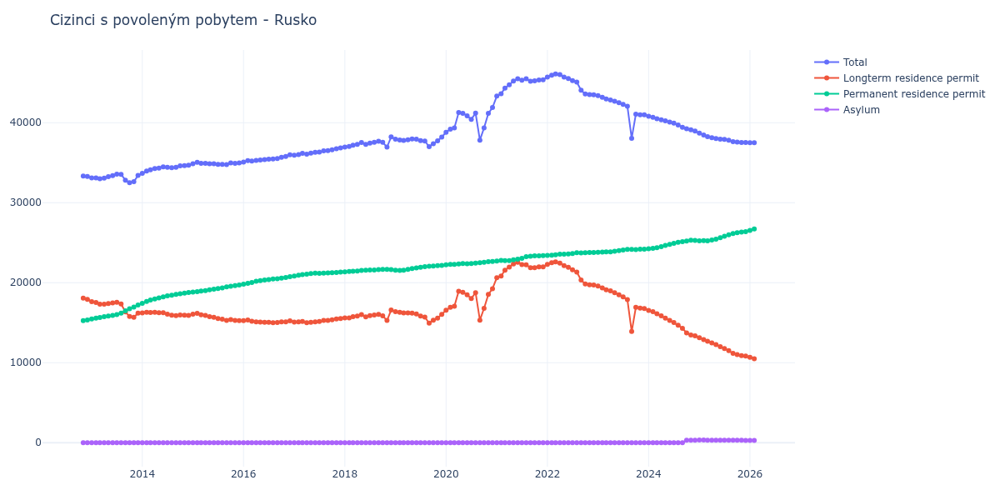

# Rusko

## Souhrnné statistiky (Min/Max pro rok) / Summary Statistics (Min/Max per year)

| Year   | Total           | Longterm Residence Permit   | Permanent Residence Permit   | Asylum    |
|--------|-----------------|-----------------------------|------------------------------|-----------|
| 2012   | 33 281 / 33 339 | 17 930 / 18 084             | 15 255 / 15 351              | 0 / 0     |
| 2013   | 32 514 / 33 581 | 15 676 / 17 619             | 15 472 / 17 224              | 0 / 0     |
| 2014   | 33 662 / 34 684 | 15 897 / 16 306             | 17 428 / 18 770              | 0 / 0     |
| 2015   | 34 757 / 35 060 | 15 269 / 16 172             | 18 825 / 19 703              | 0 / 0     |
| 2016   | 35 083 / 35 987 | 15 001 / 15 338             | 19 824 / 20 763              | 0 / 0     |
| 2017   | 35 928 / 36 840 | 14 989 / 15 521             | 20 841 / 21 319              | 0 / 0     |
| 2018   | 36 955 / 38 223 | 15 283 / 16 588             | 21 361 / 21 672              | 0 / 0     |
| 2019   | 37 000 / 38 207 | 14 947 / 16 372             | 21 541 / 22 158              | 0 / 0     |
| 2020   | 37 827 / 41 907 | 15 320 / 19 259             | 22 243 / 22 648              | 0 / 0     |
| 2021   | 43 328 / 45 506 | 20 615 / 22 543             | 22 713 / 23 376              | 0 / 0     |
| 2022   | 43 498 / 46 098 | 19 715 / 22 600             | 23 413 / 23 783              | 0 / 0     |
| 2023   | 38 063 / 43 383 | 13 895 / 19 580             | 23 803 / 24 207              | 0 / 0     |
| 2024   | 38 970 / 40 804 | 13 369 / 16 550             | 24 254 / 25 320              | 0 / 323   |
| 2025   | 37 517 / 38 698 | 10 844 / 13 127             | 25 245 / 26 385              | 295 / 327 |
| 2026   | 37 504 / 37 510 | 10 497 / 10 668             | 26 546 / 26 712              | 295 / 296 |

## Detailní tabulka / Detailed Data Table

| Date     | Total           | Longterm Residence Permit   | Permanent Residence Permit   | Asylum       |
|----------|-----------------|-----------------------------|------------------------------|--------------|
| **2012** |                 |                             |                              |              |
| 11.2012  | 33 339          | 18 084                      | 15 255                       | 0            |
| 12.2012  | 33 281 (-0.17%) | 17 930 (-0.85%)             | 15 351 (+0.63%)              | 0            |
| **2013** |                 |                             |                              |              |
| 01.2013  | 33 091 (-0.57%) | 17 619 (-1.73%)             | 15 472 (+0.79%)              | 0            |
| 02.2013  | 33 099 (+0.02%) | 17 527 (-0.52%)             | 15 572 (+0.65%)              | 0            |
| 03.2013  | 32 986 (-0.34%) | 17 328 (-1.14%)             | 15 658 (+0.55%)              | 0            |
| 04.2013  | 33 063 (+0.23%) | 17 307 (-0.12%)             | 15 756 (+0.63%)              | 0            |
| 05.2013  | 33 247 (+0.56%) | 17 403 (+0.55%)             | 15 844 (+0.56%)              | 0            |
| 06.2013  | 33 387 (+0.42%) | 17 466 (+0.36%)             | 15 921 (+0.49%)              | 0            |
| 07.2013  | 33 581 (+0.58%) | 17 566 (+0.57%)             | 16 015 (+0.59%)              | 0            |
| 08.2013  | 33 556 (-0.07%) | 17 349 (-1.24%)             | 16 207 (+1.20%)              | 0            |
| 09.2013  | 32 827 (-2.17%) | 16 351 (-5.75%)             | 16 476 (+1.66%)              | 0            |
| 10.2013  | 32 514 (-0.95%) | 15 774 (-3.53%)             | 16 740 (+1.60%)              | 0            |
| 11.2013  | 32 625 (+0.34%) | 15 676 (-0.62%)             | 16 949 (+1.25%)              | 0            |
| 12.2013  | 33 415 (+2.42%) | 16 191 (+3.29%)             | 17 224 (+1.62%)              | 0            |
| **2014** |                 |                             |                              |              |
| 01.2014  | 33 662 (+0.74%) | 16 234 (+0.27%)             | 17 428 (+1.18%)              | 0            |
| 02.2014  | 33 969 (+0.91%) | 16 306 (+0.44%)             | 17 663 (+1.35%)              | 0            |
| 03.2014  | 34 112 (+0.42%) | 16 275 (-0.19%)             | 17 837 (+0.99%)              | 0            |
| 04.2014  | 34 270 (+0.46%) | 16 303 (+0.17%)             | 17 967 (+0.73%)              | 0            |
| 05.2014  | 34 331 (+0.18%) | 16 240 (-0.39%)             | 18 091 (+0.69%)              | 0            |
| 06.2014  | 34 473 (+0.41%) | 16 250 (+0.06%)             | 18 223 (+0.73%)              | 0            |
| 07.2014  | 34 435 (-0.11%) | 16 072 (-1.10%)             | 18 363 (+0.77%)              | 0            |
| 08.2014  | 34 372 (-0.18%) | 15 928 (-0.90%)             | 18 444 (+0.44%)              | 0            |
| 09.2014  | 34 438 (+0.19%) | 15 897 (-0.19%)             | 18 541 (+0.53%)              | 0            |
| 10.2014  | 34 602 (+0.48%) | 15 975 (+0.49%)             | 18 627 (+0.46%)              | 0            |
| 11.2014  | 34 640 (+0.11%) | 15 944 (-0.19%)             | 18 696 (+0.37%)              | 0            |
| 12.2014  | 34 684 (+0.13%) | 15 914 (-0.19%)             | 18 770 (+0.40%)              | 0            |
| **2015** |                 |                             |                              |              |
| 01.2015  | 34 884 (+0.58%) | 16 059 (+0.91%)             | 18 825 (+0.29%)              | 0            |
| 02.2015  | 35 060 (+0.50%) | 16 172 (+0.70%)             | 18 888 (+0.33%)              | 0            |
| 03.2015  | 34 938 (-0.35%) | 15 982 (-1.17%)             | 18 956 (+0.36%)              | 0            |
| 04.2015  | 34 937 (-0.00%) | 15 921 (-0.38%)             | 19 016 (+0.32%)              | 0            |
| 05.2015  | 34 865 (-0.21%) | 15 749 (-1.08%)             | 19 116 (+0.53%)              | 0            |
| 06.2015  | 34 869 (+0.01%) | 15 686 (-0.40%)             | 19 183 (+0.35%)              | 0            |
| 07.2015  | 34 787 (-0.24%) | 15 519 (-1.06%)             | 19 268 (+0.44%)              | 0            |
| 08.2015  | 34 799 (+0.03%) | 15 440 (-0.51%)             | 19 359 (+0.47%)              | 0            |
| 09.2015  | 34 757 (-0.12%) | 15 282 (-1.02%)             | 19 475 (+0.60%)              | 0            |
| 10.2015  | 34 977 (+0.63%) | 15 405 (+0.80%)             | 19 572 (+0.50%)              | 0            |
| 11.2015  | 34 919 (-0.17%) | 15 283 (-0.79%)             | 19 636 (+0.33%)              | 0            |
| 12.2015  | 34 972 (+0.15%) | 15 269 (-0.09%)             | 19 703 (+0.34%)              | 0            |
| **2016** |                 |                             |                              |              |
| 01.2016  | 35 083 (+0.32%) | 15 259 (-0.07%)             | 19 824 (+0.61%)              | 0            |
| 02.2016  | 35 260 (+0.50%) | 15 338 (+0.52%)             | 19 922 (+0.49%)              | 0            |
| 03.2016  | 35 214 (-0.13%) | 15 177 (-1.05%)             | 20 037 (+0.58%)              | 0            |
| 04.2016  | 35 294 (+0.23%) | 15 107 (-0.46%)             | 20 187 (+0.75%)              | 0            |
| 05.2016  | 35 342 (+0.14%) | 15 082 (-0.17%)             | 20 260 (+0.36%)              | 0            |
| 06.2016  | 35 386 (+0.12%) | 15 050 (-0.21%)             | 20 336 (+0.38%)              | 0            |
| 07.2016  | 35 435 (+0.14%) | 15 043 (-0.05%)             | 20 392 (+0.28%)              | 0            |
| 08.2016  | 35 475 (+0.11%) | 15 001 (-0.28%)             | 20 474 (+0.40%)              | 0            |
| 09.2016  | 35 512 (+0.10%) | 15 027 (+0.17%)             | 20 485 (+0.05%)              | 0            |
| 10.2016  | 35 680 (+0.47%) | 15 102 (+0.50%)             | 20 578 (+0.45%)              | 0            |
| 11.2016  | 35 776 (+0.27%) | 15 112 (+0.07%)             | 20 664 (+0.42%)              | 0            |
| 12.2016  | 35 987 (+0.59%) | 15 224 (+0.74%)             | 20 763 (+0.48%)              | 0            |
| **2017** |                 |                             |                              |              |
| 01.2017  | 35 928 (-0.16%) | 15 087 (-0.90%)             | 20 841 (+0.38%)              | 0            |
| 02.2017  | 36 022 (+0.26%) | 15 095 (+0.05%)             | 20 927 (+0.41%)              | 0            |
| 03.2017  | 36 174 (+0.42%) | 15 157 (+0.41%)             | 21 017 (+0.43%)              | 0            |
| 04.2017  | 36 065 (-0.30%) | 14 989 (-1.11%)             | 21 076 (+0.28%)              | 0            |
| 05.2017  | 36 190 (+0.35%) | 15 051 (+0.41%)             | 21 139 (+0.30%)              | 0            |
| 06.2017  | 36 298 (+0.30%) | 15 106 (+0.37%)             | 21 192 (+0.25%)              | 0            |
| 07.2017  | 36 343 (+0.12%) | 15 169 (+0.42%)             | 21 174 (-0.08%)              | 0            |
| 08.2017  | 36 484 (+0.39%) | 15 286 (+0.77%)             | 21 198 (+0.11%)              | 0            |
| 09.2017  | 36 502 (+0.05%) | 15 285 (-0.01%)             | 21 217 (+0.09%)              | 0            |
| 10.2017  | 36 607 (+0.29%) | 15 363 (+0.51%)             | 21 244 (+0.13%)              | 0            |
| 11.2017  | 36 739 (+0.36%) | 15 461 (+0.64%)             | 21 278 (+0.16%)              | 0            |
| 12.2017  | 36 840 (+0.27%) | 15 521 (+0.39%)             | 21 319 (+0.19%)              | 0            |
| **2018** |                 |                             |                              |              |
| 01.2018  | 36 964 (+0.34%) | 15 603 (+0.53%)             | 21 361 (+0.20%)              | 0            |
| 02.2018  | 37 034 (+0.19%) | 15 613 (+0.06%)             | 21 421 (+0.28%)              | 0            |
| 03.2018  | 37 201 (+0.45%) | 15 759 (+0.94%)             | 21 442 (+0.10%)              | 0            |
| 04.2018  | 37 303 (+0.27%) | 15 834 (+0.48%)             | 21 469 (+0.13%)              | 0            |
| 05.2018  | 37 535 (+0.62%) | 16 007 (+1.09%)             | 21 528 (+0.27%)              | 0            |
| 06.2018  | 37 303 (-0.62%) | 15 727 (-1.75%)             | 21 576 (+0.22%)              | 0            |
| 07.2018  | 37 453 (+0.40%) | 15 874 (+0.93%)             | 21 579 (+0.01%)              | 0            |
| 08.2018  | 37 551 (+0.26%) | 15 967 (+0.59%)             | 21 584 (+0.02%)              | 0            |
| 09.2018  | 37 687 (+0.36%) | 16 045 (+0.49%)             | 21 642 (+0.27%)              | 0            |
| 10.2018  | 37 544 (-0.38%) | 15 873 (-1.07%)             | 21 671 (+0.13%)              | 0            |
| 11.2018  | 36 955 (-1.57%) | 15 283 (-3.72%)             | 21 672 (+0.00%)              | 0            |
| 12.2018  | 38 223 (+3.43%) | 16 588 (+8.54%)             | 21 635 (-0.17%)              | 0            |
| **2019** |                 |                             |                              |              |
| 01.2019  | 37 947 (-0.72%) | 16 372 (-1.30%)             | 21 575 (-0.28%)              | 0            |
| 02.2019  | 37 843 (-0.27%) | 16 302 (-0.43%)             | 21 541 (-0.16%)              | 0            |
| 03.2019  | 37 792 (-0.13%) | 16 216 (-0.53%)             | 21 576 (+0.16%)              | 0            |
| 04.2019  | 37 878 (+0.23%) | 16 218 (+0.01%)             | 21 660 (+0.39%)              | 0            |
| 05.2019  | 37 961 (+0.22%) | 16 200 (-0.11%)             | 21 761 (+0.47%)              | 0            |
| 06.2019  | 37 947 (-0.04%) | 16 092 (-0.67%)             | 21 855 (+0.43%)              | 0            |
| 07.2019  | 37 760 (-0.49%) | 15 825 (-1.66%)             | 21 935 (+0.37%)              | 0            |
| 08.2019  | 37 717 (-0.11%) | 15 701 (-0.78%)             | 22 016 (+0.37%)              | 0            |
| 09.2019  | 37 000 (-1.90%) | 14 947 (-4.80%)             | 22 053 (+0.17%)              | 0            |
| 10.2019  | 37 382 (+1.03%) | 15 302 (+2.38%)             | 22 080 (+0.12%)              | 0            |
| 11.2019  | 37 727 (+0.92%) | 15 584 (+1.84%)             | 22 143 (+0.29%)              | 0            |
| 12.2019  | 38 207 (+1.27%) | 16 049 (+2.98%)             | 22 158 (+0.07%)              | 0            |
| **2020** |                 |                             |                              |              |
| 01.2020  | 38 800 (+1.55%) | 16 557 (+3.17%)             | 22 243 (+0.38%)              | 0            |
| 02.2020  | 39 208 (+1.05%) | 16 917 (+2.17%)             | 22 291 (+0.22%)              | 0            |
| 03.2020  | 39 363 (+0.40%) | 17 064 (+0.87%)             | 22 299 (+0.04%)              | 0            |
| 04.2020  | 41 274 (+4.85%) | 18 940 (+10.99%)            | 22 334 (+0.16%)              | 0            |
| 05.2020  | 41 186 (-0.21%) | 18 791 (-0.79%)             | 22 395 (+0.27%)              | 0            |
| 06.2020  | 40 875 (-0.76%) | 18 500 (-1.55%)             | 22 375 (-0.09%)              | 0            |
| 07.2020  | 40 427 (-1.10%) | 18 023 (-2.58%)             | 22 404 (+0.13%)              | 0            |
| 08.2020  | 41 203 (+1.92%) | 18 758 (+4.08%)             | 22 445 (+0.18%)              | 0            |
| 09.2020  | 37 827 (-8.19%) | 15 320 (-18.33%)            | 22 507 (+0.28%)              | 0            |
| 10.2020  | 39 348 (+4.02%) | 16 801 (+9.67%)             | 22 547 (+0.18%)              | 0            |
| 11.2020  | 41 165 (+4.62%) | 18 533 (+10.31%)            | 22 632 (+0.38%)              | 0            |
| 12.2020  | 41 907 (+1.80%) | 19 259 (+3.92%)             | 22 648 (+0.07%)              | 0            |
| **2021** |                 |                             |                              |              |
| 01.2021  | 43 328 (+3.39%) | 20 615 (+7.04%)             | 22 713 (+0.29%)              | 0            |
| 02.2021  | 43 621 (+0.68%) | 20 838 (+1.08%)             | 22 783 (+0.31%)              | 0            |
| 03.2021  | 44 332 (+1.63%) | 21 574 (+3.53%)             | 22 758 (-0.11%)              | 0            |
| 04.2021  | 44 733 (+0.90%) | 21 966 (+1.82%)             | 22 767 (+0.04%)              | 0            |
| 05.2021  | 45 210 (+1.07%) | 22 356 (+1.78%)             | 22 854 (+0.38%)              | 0            |
| 06.2021  | 45 488 (+0.61%) | 22 543 (+0.84%)             | 22 945 (+0.40%)              | 0            |
| 07.2021  | 45 310 (-0.39%) | 22 266 (-1.23%)             | 23 044 (+0.43%)              | 0            |
| 08.2021  | 45 506 (+0.43%) | 22 253 (-0.06%)             | 23 253 (+0.91%)              | 0            |
| 09.2021  | 45 176 (-0.73%) | 21 867 (-1.73%)             | 23 309 (+0.24%)              | 0            |
| 10.2021  | 45 231 (+0.12%) | 21 867 (+0.00%)             | 23 364 (+0.24%)              | 0            |
| 11.2021  | 45 344 (+0.25%) | 21 976 (+0.50%)             | 23 368 (+0.02%)              | 0            |
| 12.2021  | 45 365 (+0.05%) | 21 989 (+0.06%)             | 23 376 (+0.03%)              | 0            |
| **2022** |                 |                             |                              |              |
| 01.2022  | 45 708 (+0.76%) | 22 295 (+1.39%)             | 23 413 (+0.16%)              | 0            |
| 02.2022  | 45 929 (+0.48%) | 22 493 (+0.89%)             | 23 436 (+0.10%)              | 0            |
| 03.2022  | 46 098 (+0.37%) | 22 600 (+0.48%)             | 23 498 (+0.26%)              | 0            |
| 04.2022  | 46 016 (-0.18%) | 22 457 (-0.63%)             | 23 559 (+0.26%)              | 0            |
| 05.2022  | 45 697 (-0.69%) | 22 125 (-1.48%)             | 23 572 (+0.06%)              | 0            |
| 06.2022  | 45 513 (-0.40%) | 21 925 (-0.90%)             | 23 588 (+0.07%)              | 0            |
| 07.2022  | 45 268 (-0.54%) | 21 612 (-1.43%)             | 23 656 (+0.29%)              | 0            |
| 08.2022  | 45 081 (-0.41%) | 21 328 (-1.31%)             | 23 753 (+0.41%)              | 0            |
| 09.2022  | 44 059 (-2.27%) | 20 331 (-4.67%)             | 23 728 (-0.11%)              | 0            |
| 10.2022  | 43 594 (-1.06%) | 19 853 (-2.35%)             | 23 741 (+0.05%)              | 0            |
| 11.2022  | 43 517 (-0.18%) | 19 750 (-0.52%)             | 23 767 (+0.11%)              | 0            |
| 12.2022  | 43 498 (-0.04%) | 19 715 (-0.18%)             | 23 783 (+0.07%)              | 0            |
| **2023** |                 |                             |                              |              |
| 01.2023  | 43 383 (-0.26%) | 19 580 (-0.68%)             | 23 803 (+0.08%)              | 0            |
| 02.2023  | 43 192 (-0.44%) | 19 357 (-1.14%)             | 23 835 (+0.13%)              | 0            |
| 03.2023  | 42 985 (-0.48%) | 19 122 (-1.21%)             | 23 863 (+0.12%)              | 0            |
| 04.2023  | 42 844 (-0.33%) | 18 975 (-0.77%)             | 23 869 (+0.03%)              | 0            |
| 05.2023  | 42 681 (-0.38%) | 18 751 (-1.18%)             | 23 930 (+0.26%)              | 0            |
| 06.2023  | 42 505 (-0.41%) | 18 498 (-1.35%)             | 24 007 (+0.32%)              | 0            |
| 07.2023  | 42 305 (-0.47%) | 18 218 (-1.51%)             | 24 087 (+0.33%)              | 0            |
| 08.2023  | 42 052 (-0.60%) | 17 882 (-1.84%)             | 24 170 (+0.34%)              | 0            |
| 09.2023  | 38 063 (-9.49%) | 13 895 (-22.30%)            | 24 168 (-0.01%)              | 0            |
| 10.2023  | 41 065 (+7.89%) | 16 924 (+21.80%)            | 24 141 (-0.11%)              | 0            |
| 11.2023  | 41 004 (-0.15%) | 16 817 (-0.63%)             | 24 187 (+0.19%)              | 0            |
| 12.2023  | 40 990 (-0.03%) | 16 783 (-0.20%)             | 24 207 (+0.08%)              | 0            |
| **2024** |                 |                             |                              |              |
| 01.2024  | 40 804 (-0.45%) | 16 550 (-1.39%)             | 24 254 (+0.19%)              | 0            |
| 02.2024  | 40 670 (-0.33%) | 16 369 (-1.09%)             | 24 301 (+0.19%)              | 0            |
| 03.2024  | 40 498 (-0.42%) | 16 123 (-1.50%)             | 24 375 (+0.30%)              | 0            |
| 04.2024  | 40 367 (-0.32%) | 15 850 (-1.69%)             | 24 517 (+0.58%)              | 0            |
| 05.2024  | 40 243 (-0.31%) | 15 583 (-1.68%)             | 24 660 (+0.58%)              | 0            |
| 06.2024  | 40 073 (-0.42%) | 15 290 (-1.88%)             | 24 783 (+0.50%)              | 0            |
| 07.2024  | 39 950 (-0.31%) | 15 028 (-1.71%)             | 24 922 (+0.56%)              | 0            |
| 08.2024  | 39 728 (-0.56%) | 14 682 (-2.30%)             | 25 046 (+0.50%)              | 0            |
| 09.2024  | 39 420 (-0.78%) | 14 294 (-2.64%)             | 25 126 (+0.32%)              | 0            |
| 10.2024  | 39 248 (-0.44%) | 13 724 (-3.99%)             | 25 203 (+0.31%)              | 321          |
| 11.2024  | 39 114 (-0.34%) | 13 474 (-1.82%)             | 25 320 (+0.46%)              | 320 (-0.31%) |
| 12.2024  | 38 970 (-0.37%) | 13 369 (-0.78%)             | 25 278 (-0.17%)              | 323 (+0.94%) |
| **2025** |                 |                             |                              |              |
| 01.2025  | 38 698 (-0.70%) | 13 127 (-1.81%)             | 25 245 (-0.13%)              | 326 (+0.93%) |
| 02.2025  | 38 470 (-0.59%) | 12 880 (-1.88%)             | 25 263 (+0.07%)              | 327 (+0.31%) |
| 03.2025  | 38 253 (-0.56%) | 12 692 (-1.46%)             | 25 247 (-0.06%)              | 314 (-3.98%) |
| 04.2025  | 38 120 (-0.35%) | 12 470 (-1.75%)             | 25 333 (+0.34%)              | 317 (+0.96%) |
| 05.2025  | 38 029 (-0.24%) | 12 271 (-1.60%)             | 25 440 (+0.42%)              | 318 (+0.32%) |
| 06.2025  | 37 958 (-0.19%) | 12 006 (-2.16%)             | 25 633 (+0.76%)              | 319 (+0.31%) |
| 07.2025  | 37 916 (-0.11%) | 11 784 (-1.85%)             | 25 808 (+0.68%)              | 324 (+1.57%) |
| 08.2025  | 37 807 (-0.29%) | 11 500 (-2.41%)             | 25 983 (+0.68%)              | 324 (+0.00%) |
| 09.2025  | 37 631 (-0.47%) | 11 161 (-2.95%)             | 26 153 (+0.65%)              | 317 (-2.16%) |
| 10.2025  | 37 574 (-0.15%) | 11 024 (-1.23%)             | 26 243 (+0.34%)              | 307 (-3.15%) |
| 11.2025  | 37 517 (-0.15%) | 10 888 (-1.23%)             | 26 329 (+0.33%)              | 300 (-2.28%) |
| 12.2025  | 37 524 (+0.02%) | 10 844 (-0.40%)             | 26 385 (+0.21%)              | 295 (-1.67%) |
| **2026** |                 |                             |                              |              |
| 01.2026  | 37 510 (-0.04%) | 10 668 (-1.62%)             | 26 546 (+0.61%)              | 296 (+0.34%) |
| 02.2026  | 37 504 (-0.02%) | 10 497 (-1.60%)             | 26 712 (+0.63%)              | 295 (-0.34%) |
