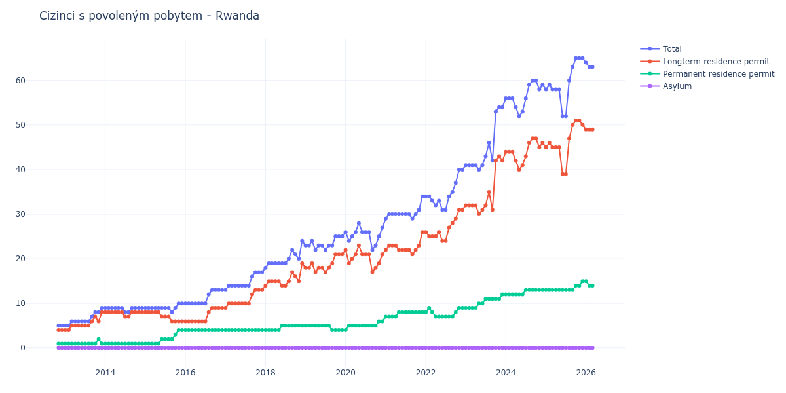

# Rwanda

## Souhrnné statistiky (Min/Max pro rok) / Summary Statistics (Min/Max per year)

| Year   | Total   | Longterm Residence Permit   | Permanent Residence Permit   | Asylum   |
|--------|---------|-----------------------------|------------------------------|----------|
| 2012   | 5 / 5   | 4 / 4                       | 1 / 1                        | 0 / 0    |
| 2013   | 5 / 9   | 4 / 8                       | 1 / 2                        | 0 / 0    |
| 2014   | 8 / 9   | 7 / 8                       | 1 / 1                        | 0 / 0    |
| 2015   | 8 / 10  | 6 / 8                       | 1 / 4                        | 0 / 0    |
| 2016   | 10 / 13 | 6 / 9                       | 4 / 4                        | 0 / 0    |
| 2017   | 13 / 17 | 9 / 13                      | 4 / 4                        | 0 / 0    |
| 2018   | 18 / 24 | 14 / 19                     | 4 / 5                        | 0 / 0    |
| 2019   | 22 / 25 | 17 / 21                     | 4 / 5                        | 0 / 0    |
| 2020   | 22 / 28 | 17 / 23                     | 4 / 6                        | 0 / 0    |
| 2021   | 29 / 34 | 21 / 26                     | 7 / 8                        | 0 / 0    |
| 2022   | 31 / 40 | 24 / 31                     | 7 / 9                        | 0 / 0    |
| 2023   | 40 / 54 | 30 / 43                     | 9 / 12                       | 0 / 0    |
| 2024   | 52 / 60 | 40 / 47                     | 12 / 13                      | 0 / 0    |
| 2025   | 52 / 65 | 39 / 51                     | 13 / 15                      | 0 / 0    |

## Detailní tabulka / Detailed Data Table

| Date     | Total        | Longterm Residence Permit   | Permanent Residence Permit   | Asylum   |
|----------|--------------|-----------------------------|------------------------------|----------|
| **2012** |              |                             |                              |          |
| 11.2012  | 5            | 4                           | 1                            | 0        |
| 12.2012  | 5 (+0.00%)   | 4 (+0.00%)                  | 1 (+0.00%)                   | 0        |
| **2013** |              |                             |                              |          |
| 01.2013  | 5 (+0.00%)   | 4 (+0.00%)                  | 1 (+0.00%)                   | 0        |
| 02.2013  | 5 (+0.00%)   | 4 (+0.00%)                  | 1 (+0.00%)                   | 0        |
| 03.2013  | 6 (+20.00%)  | 5 (+25.00%)                 | 1 (+0.00%)                   | 0        |
| 04.2013  | 6 (+0.00%)   | 5 (+0.00%)                  | 1 (+0.00%)                   | 0        |
| 05.2013  | 6 (+0.00%)   | 5 (+0.00%)                  | 1 (+0.00%)                   | 0        |
| 06.2013  | 6 (+0.00%)   | 5 (+0.00%)                  | 1 (+0.00%)                   | 0        |
| 07.2013  | 6 (+0.00%)   | 5 (+0.00%)                  | 1 (+0.00%)                   | 0        |
| 08.2013  | 6 (+0.00%)   | 5 (+0.00%)                  | 1 (+0.00%)                   | 0        |
| 09.2013  | 7 (+16.67%)  | 6 (+20.00%)                 | 1 (+0.00%)                   | 0        |
| 10.2013  | 8 (+14.29%)  | 7 (+16.67%)                 | 1 (+0.00%)                   | 0        |
| 11.2013  | 8 (+0.00%)   | 6 (-14.29%)                 | 2 (+100.00%)                 | 0        |
| 12.2013  | 9 (+12.50%)  | 8 (+33.33%)                 | 1 (-50.00%)                  | 0        |
| **2014** |              |                             |                              |          |
| 01.2014  | 9 (+0.00%)   | 8 (+0.00%)                  | 1 (+0.00%)                   | 0        |
| 02.2014  | 9 (+0.00%)   | 8 (+0.00%)                  | 1 (+0.00%)                   | 0        |
| 03.2014  | 9 (+0.00%)   | 8 (+0.00%)                  | 1 (+0.00%)                   | 0        |
| 04.2014  | 9 (+0.00%)   | 8 (+0.00%)                  | 1 (+0.00%)                   | 0        |
| 05.2014  | 9 (+0.00%)   | 8 (+0.00%)                  | 1 (+0.00%)                   | 0        |
| 06.2014  | 9 (+0.00%)   | 8 (+0.00%)                  | 1 (+0.00%)                   | 0        |
| 07.2014  | 8 (-11.11%)  | 7 (-12.50%)                 | 1 (+0.00%)                   | 0        |
| 08.2014  | 8 (+0.00%)   | 7 (+0.00%)                  | 1 (+0.00%)                   | 0        |
| 09.2014  | 9 (+12.50%)  | 8 (+14.29%)                 | 1 (+0.00%)                   | 0        |
| 10.2014  | 9 (+0.00%)   | 8 (+0.00%)                  | 1 (+0.00%)                   | 0        |
| 11.2014  | 9 (+0.00%)   | 8 (+0.00%)                  | 1 (+0.00%)                   | 0        |
| 12.2014  | 9 (+0.00%)   | 8 (+0.00%)                  | 1 (+0.00%)                   | 0        |
| **2015** |              |                             |                              |          |
| 01.2015  | 9 (+0.00%)   | 8 (+0.00%)                  | 1 (+0.00%)                   | 0        |
| 02.2015  | 9 (+0.00%)   | 8 (+0.00%)                  | 1 (+0.00%)                   | 0        |
| 03.2015  | 9 (+0.00%)   | 8 (+0.00%)                  | 1 (+0.00%)                   | 0        |
| 04.2015  | 9 (+0.00%)   | 8 (+0.00%)                  | 1 (+0.00%)                   | 0        |
| 05.2015  | 9 (+0.00%)   | 8 (+0.00%)                  | 1 (+0.00%)                   | 0        |
| 06.2015  | 9 (+0.00%)   | 7 (-12.50%)                 | 2 (+100.00%)                 | 0        |
| 07.2015  | 9 (+0.00%)   | 7 (+0.00%)                  | 2 (+0.00%)                   | 0        |
| 08.2015  | 9 (+0.00%)   | 7 (+0.00%)                  | 2 (+0.00%)                   | 0        |
| 09.2015  | 8 (-11.11%)  | 6 (-14.29%)                 | 2 (+0.00%)                   | 0        |
| 10.2015  | 9 (+12.50%)  | 6 (+0.00%)                  | 3 (+50.00%)                  | 0        |
| 11.2015  | 10 (+11.11%) | 6 (+0.00%)                  | 4 (+33.33%)                  | 0        |
| 12.2015  | 10 (+0.00%)  | 6 (+0.00%)                  | 4 (+0.00%)                   | 0        |
| **2016** |              |                             |                              |          |
| 01.2016  | 10 (+0.00%)  | 6 (+0.00%)                  | 4 (+0.00%)                   | 0        |
| 02.2016  | 10 (+0.00%)  | 6 (+0.00%)                  | 4 (+0.00%)                   | 0        |
| 03.2016  | 10 (+0.00%)  | 6 (+0.00%)                  | 4 (+0.00%)                   | 0        |
| 04.2016  | 10 (+0.00%)  | 6 (+0.00%)                  | 4 (+0.00%)                   | 0        |
| 05.2016  | 10 (+0.00%)  | 6 (+0.00%)                  | 4 (+0.00%)                   | 0        |
| 06.2016  | 10 (+0.00%)  | 6 (+0.00%)                  | 4 (+0.00%)                   | 0        |
| 07.2016  | 10 (+0.00%)  | 6 (+0.00%)                  | 4 (+0.00%)                   | 0        |
| 08.2016  | 12 (+20.00%) | 8 (+33.33%)                 | 4 (+0.00%)                   | 0        |
| 09.2016  | 13 (+8.33%)  | 9 (+12.50%)                 | 4 (+0.00%)                   | 0        |
| 10.2016  | 13 (+0.00%)  | 9 (+0.00%)                  | 4 (+0.00%)                   | 0        |
| 11.2016  | 13 (+0.00%)  | 9 (+0.00%)                  | 4 (+0.00%)                   | 0        |
| 12.2016  | 13 (+0.00%)  | 9 (+0.00%)                  | 4 (+0.00%)                   | 0        |
| **2017** |              |                             |                              |          |
| 01.2017  | 13 (+0.00%)  | 9 (+0.00%)                  | 4 (+0.00%)                   | 0        |
| 02.2017  | 14 (+7.69%)  | 10 (+11.11%)                | 4 (+0.00%)                   | 0        |
| 03.2017  | 14 (+0.00%)  | 10 (+0.00%)                 | 4 (+0.00%)                   | 0        |
| 04.2017  | 14 (+0.00%)  | 10 (+0.00%)                 | 4 (+0.00%)                   | 0        |
| 05.2017  | 14 (+0.00%)  | 10 (+0.00%)                 | 4 (+0.00%)                   | 0        |
| 06.2017  | 14 (+0.00%)  | 10 (+0.00%)                 | 4 (+0.00%)                   | 0        |
| 07.2017  | 14 (+0.00%)  | 10 (+0.00%)                 | 4 (+0.00%)                   | 0        |
| 08.2017  | 14 (+0.00%)  | 10 (+0.00%)                 | 4 (+0.00%)                   | 0        |
| 09.2017  | 16 (+14.29%) | 12 (+20.00%)                | 4 (+0.00%)                   | 0        |
| 10.2017  | 17 (+6.25%)  | 13 (+8.33%)                 | 4 (+0.00%)                   | 0        |
| 11.2017  | 17 (+0.00%)  | 13 (+0.00%)                 | 4 (+0.00%)                   | 0        |
| 12.2017  | 17 (+0.00%)  | 13 (+0.00%)                 | 4 (+0.00%)                   | 0        |
| **2018** |              |                             |                              |          |
| 01.2018  | 18 (+5.88%)  | 14 (+7.69%)                 | 4 (+0.00%)                   | 0        |
| 02.2018  | 19 (+5.56%)  | 15 (+7.14%)                 | 4 (+0.00%)                   | 0        |
| 03.2018  | 19 (+0.00%)  | 15 (+0.00%)                 | 4 (+0.00%)                   | 0        |
| 04.2018  | 19 (+0.00%)  | 15 (+0.00%)                 | 4 (+0.00%)                   | 0        |
| 05.2018  | 19 (+0.00%)  | 15 (+0.00%)                 | 4 (+0.00%)                   | 0        |
| 06.2018  | 19 (+0.00%)  | 14 (-6.67%)                 | 5 (+25.00%)                  | 0        |
| 07.2018  | 19 (+0.00%)  | 14 (+0.00%)                 | 5 (+0.00%)                   | 0        |
| 08.2018  | 20 (+5.26%)  | 15 (+7.14%)                 | 5 (+0.00%)                   | 0        |
| 09.2018  | 22 (+10.00%) | 17 (+13.33%)                | 5 (+0.00%)                   | 0        |
| 10.2018  | 21 (-4.55%)  | 16 (-5.88%)                 | 5 (+0.00%)                   | 0        |
| 11.2018  | 20 (-4.76%)  | 15 (-6.25%)                 | 5 (+0.00%)                   | 0        |
| 12.2018  | 24 (+20.00%) | 19 (+26.67%)                | 5 (+0.00%)                   | 0        |
| **2019** |              |                             |                              |          |
| 01.2019  | 23 (-4.17%)  | 18 (-5.26%)                 | 5 (+0.00%)                   | 0        |
| 02.2019  | 23 (+0.00%)  | 18 (+0.00%)                 | 5 (+0.00%)                   | 0        |
| 03.2019  | 24 (+4.35%)  | 19 (+5.56%)                 | 5 (+0.00%)                   | 0        |
| 04.2019  | 22 (-8.33%)  | 17 (-10.53%)                | 5 (+0.00%)                   | 0        |
| 05.2019  | 23 (+4.55%)  | 18 (+5.88%)                 | 5 (+0.00%)                   | 0        |
| 06.2019  | 23 (+0.00%)  | 18 (+0.00%)                 | 5 (+0.00%)                   | 0        |
| 07.2019  | 22 (-4.35%)  | 17 (-5.56%)                 | 5 (+0.00%)                   | 0        |
| 08.2019  | 23 (+4.55%)  | 18 (+5.88%)                 | 5 (+0.00%)                   | 0        |
| 09.2019  | 23 (+0.00%)  | 19 (+5.56%)                 | 4 (-20.00%)                  | 0        |
| 10.2019  | 25 (+8.70%)  | 21 (+10.53%)                | 4 (+0.00%)                   | 0        |
| 11.2019  | 25 (+0.00%)  | 21 (+0.00%)                 | 4 (+0.00%)                   | 0        |
| 12.2019  | 25 (+0.00%)  | 21 (+0.00%)                 | 4 (+0.00%)                   | 0        |
| **2020** |              |                             |                              |          |
| 01.2020  | 26 (+4.00%)  | 22 (+4.76%)                 | 4 (+0.00%)                   | 0        |
| 02.2020  | 24 (-7.69%)  | 19 (-13.64%)                | 5 (+25.00%)                  | 0        |
| 03.2020  | 25 (+4.17%)  | 20 (+5.26%)                 | 5 (+0.00%)                   | 0        |
| 04.2020  | 26 (+4.00%)  | 21 (+5.00%)                 | 5 (+0.00%)                   | 0        |
| 05.2020  | 28 (+7.69%)  | 23 (+9.52%)                 | 5 (+0.00%)                   | 0        |
| 06.2020  | 26 (-7.14%)  | 21 (-8.70%)                 | 5 (+0.00%)                   | 0        |
| 07.2020  | 26 (+0.00%)  | 21 (+0.00%)                 | 5 (+0.00%)                   | 0        |
| 08.2020  | 26 (+0.00%)  | 21 (+0.00%)                 | 5 (+0.00%)                   | 0        |
| 09.2020  | 22 (-15.38%) | 17 (-19.05%)                | 5 (+0.00%)                   | 0        |
| 10.2020  | 23 (+4.55%)  | 18 (+5.88%)                 | 5 (+0.00%)                   | 0        |
| 11.2020  | 25 (+8.70%)  | 19 (+5.56%)                 | 6 (+20.00%)                  | 0        |
| 12.2020  | 27 (+8.00%)  | 21 (+10.53%)                | 6 (+0.00%)                   | 0        |
| **2021** |              |                             |                              |          |
| 01.2021  | 29 (+7.41%)  | 22 (+4.76%)                 | 7 (+16.67%)                  | 0        |
| 02.2021  | 30 (+3.45%)  | 23 (+4.55%)                 | 7 (+0.00%)                   | 0        |
| 03.2021  | 30 (+0.00%)  | 23 (+0.00%)                 | 7 (+0.00%)                   | 0        |
| 04.2021  | 30 (+0.00%)  | 23 (+0.00%)                 | 7 (+0.00%)                   | 0        |
| 05.2021  | 30 (+0.00%)  | 22 (-4.35%)                 | 8 (+14.29%)                  | 0        |
| 06.2021  | 30 (+0.00%)  | 22 (+0.00%)                 | 8 (+0.00%)                   | 0        |
| 07.2021  | 30 (+0.00%)  | 22 (+0.00%)                 | 8 (+0.00%)                   | 0        |
| 08.2021  | 30 (+0.00%)  | 22 (+0.00%)                 | 8 (+0.00%)                   | 0        |
| 09.2021  | 29 (-3.33%)  | 21 (-4.55%)                 | 8 (+0.00%)                   | 0        |
| 10.2021  | 30 (+3.45%)  | 22 (+4.76%)                 | 8 (+0.00%)                   | 0        |
| 11.2021  | 31 (+3.33%)  | 23 (+4.55%)                 | 8 (+0.00%)                   | 0        |
| 12.2021  | 34 (+9.68%)  | 26 (+13.04%)                | 8 (+0.00%)                   | 0        |
| **2022** |              |                             |                              |          |
| 01.2022  | 34 (+0.00%)  | 26 (+0.00%)                 | 8 (+0.00%)                   | 0        |
| 02.2022  | 34 (+0.00%)  | 25 (-3.85%)                 | 9 (+12.50%)                  | 0        |
| 03.2022  | 33 (-2.94%)  | 25 (+0.00%)                 | 8 (-11.11%)                  | 0        |
| 04.2022  | 32 (-3.03%)  | 25 (+0.00%)                 | 7 (-12.50%)                  | 0        |
| 05.2022  | 33 (+3.12%)  | 26 (+4.00%)                 | 7 (+0.00%)                   | 0        |
| 06.2022  | 31 (-6.06%)  | 24 (-7.69%)                 | 7 (+0.00%)                   | 0        |
| 07.2022  | 31 (+0.00%)  | 24 (+0.00%)                 | 7 (+0.00%)                   | 0        |
| 08.2022  | 34 (+9.68%)  | 27 (+12.50%)                | 7 (+0.00%)                   | 0        |
| 09.2022  | 35 (+2.94%)  | 28 (+3.70%)                 | 7 (+0.00%)                   | 0        |
| 10.2022  | 37 (+5.71%)  | 29 (+3.57%)                 | 8 (+14.29%)                  | 0        |
| 11.2022  | 40 (+8.11%)  | 31 (+6.90%)                 | 9 (+12.50%)                  | 0        |
| 12.2022  | 40 (+0.00%)  | 31 (+0.00%)                 | 9 (+0.00%)                   | 0        |
| **2023** |              |                             |                              |          |
| 01.2023  | 41 (+2.50%)  | 32 (+3.23%)                 | 9 (+0.00%)                   | 0        |
| 02.2023  | 41 (+0.00%)  | 32 (+0.00%)                 | 9 (+0.00%)                   | 0        |
| 03.2023  | 41 (+0.00%)  | 32 (+0.00%)                 | 9 (+0.00%)                   | 0        |
| 04.2023  | 41 (+0.00%)  | 32 (+0.00%)                 | 9 (+0.00%)                   | 0        |
| 05.2023  | 40 (-2.44%)  | 30 (-6.25%)                 | 10 (+11.11%)                 | 0        |
| 06.2023  | 41 (+2.50%)  | 31 (+3.33%)                 | 10 (+0.00%)                  | 0        |
| 07.2023  | 43 (+4.88%)  | 32 (+3.23%)                 | 11 (+10.00%)                 | 0        |
| 08.2023  | 46 (+6.98%)  | 35 (+9.38%)                 | 11 (+0.00%)                  | 0        |
| 09.2023  | 42 (-8.70%)  | 31 (-11.43%)                | 11 (+0.00%)                  | 0        |
| 10.2023  | 53 (+26.19%) | 42 (+35.48%)                | 11 (+0.00%)                  | 0        |
| 11.2023  | 54 (+1.89%)  | 43 (+2.38%)                 | 11 (+0.00%)                  | 0        |
| 12.2023  | 54 (+0.00%)  | 42 (-2.33%)                 | 12 (+9.09%)                  | 0        |
| **2024** |              |                             |                              |          |
| 01.2024  | 56 (+3.70%)  | 44 (+4.76%)                 | 12 (+0.00%)                  | 0        |
| 02.2024  | 56 (+0.00%)  | 44 (+0.00%)                 | 12 (+0.00%)                  | 0        |
| 03.2024  | 56 (+0.00%)  | 44 (+0.00%)                 | 12 (+0.00%)                  | 0        |
| 04.2024  | 54 (-3.57%)  | 42 (-4.55%)                 | 12 (+0.00%)                  | 0        |
| 05.2024  | 52 (-3.70%)  | 40 (-4.76%)                 | 12 (+0.00%)                  | 0        |
| 06.2024  | 53 (+1.92%)  | 41 (+2.50%)                 | 12 (+0.00%)                  | 0        |
| 07.2024  | 56 (+5.66%)  | 43 (+4.88%)                 | 13 (+8.33%)                  | 0        |
| 08.2024  | 59 (+5.36%)  | 46 (+6.98%)                 | 13 (+0.00%)                  | 0        |
| 09.2024  | 60 (+1.69%)  | 47 (+2.17%)                 | 13 (+0.00%)                  | 0        |
| 10.2024  | 60 (+0.00%)  | 47 (+0.00%)                 | 13 (+0.00%)                  | 0        |
| 11.2024  | 58 (-3.33%)  | 45 (-4.26%)                 | 13 (+0.00%)                  | 0        |
| 12.2024  | 59 (+1.72%)  | 46 (+2.22%)                 | 13 (+0.00%)                  | 0        |
| **2025** |              |                             |                              |          |
| 01.2025  | 58 (-1.69%)  | 45 (-2.17%)                 | 13 (+0.00%)                  | 0        |
| 02.2025  | 59 (+1.72%)  | 46 (+2.22%)                 | 13 (+0.00%)                  | 0        |
| 03.2025  | 58 (-1.69%)  | 45 (-2.17%)                 | 13 (+0.00%)                  | 0        |
| 04.2025  | 58 (+0.00%)  | 45 (+0.00%)                 | 13 (+0.00%)                  | 0        |
| 05.2025  | 58 (+0.00%)  | 45 (+0.00%)                 | 13 (+0.00%)                  | 0        |
| 06.2025  | 52 (-10.34%) | 39 (-13.33%)                | 13 (+0.00%)                  | 0        |
| 07.2025  | 52 (+0.00%)  | 39 (+0.00%)                 | 13 (+0.00%)                  | 0        |
| 08.2025  | 60 (+15.38%) | 47 (+20.51%)                | 13 (+0.00%)                  | 0        |
| 09.2025  | 63 (+5.00%)  | 50 (+6.38%)                 | 13 (+0.00%)                  | 0        |
| 10.2025  | 65 (+3.17%)  | 51 (+2.00%)                 | 14 (+7.69%)                  | 0        |
| 11.2025  | 65 (+0.00%)  | 51 (+0.00%)                 | 14 (+0.00%)                  | 0        |
| 12.2025  | 65 (+0.00%)  | 50 (-1.96%)                 | 15 (+7.14%)                  | 0        |
