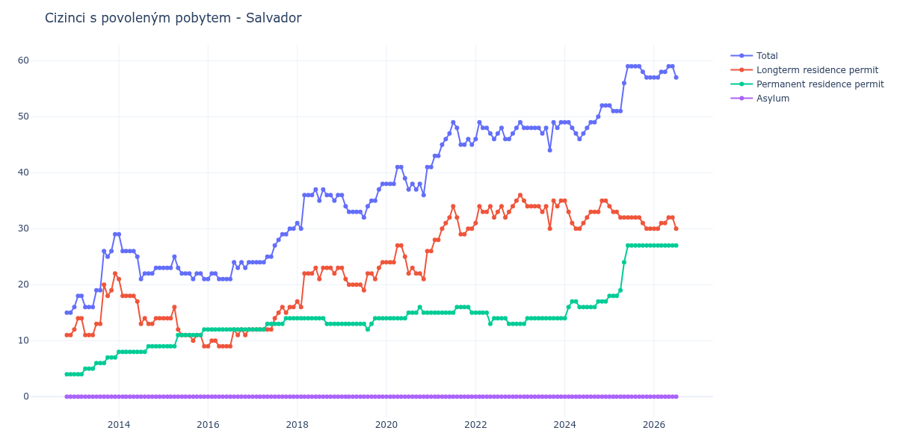

# Salvador

## Souhrnné statistiky (Min/Max pro rok) / Summary Statistics (Min/Max per year)

| Year   | Total   | Longterm Residence Permit   | Permanent Residence Permit   | Asylum   |
|--------|---------|-----------------------------|------------------------------|----------|
| 2012   | 15 / 15 | 11 / 11                     | 4 / 4                        | 0 / 0    |
| 2013   | 16 / 29 | 11 / 22                     | 4 / 7                        | 0 / 0    |
| 2014   | 21 / 29 | 13 / 21                     | 8 / 9                        | 0 / 0    |
| 2015   | 21 / 25 | 9 / 16                      | 9 / 12                       | 0 / 0    |
| 2016   | 21 / 24 | 9 / 12                      | 12 / 12                      | 0 / 0    |
| 2017   | 24 / 30 | 12 / 16                     | 12 / 14                      | 0 / 0    |
| 2018   | 30 / 37 | 16 / 23                     | 13 / 14                      | 0 / 0    |
| 2019   | 32 / 38 | 19 / 24                     | 12 / 14                      | 0 / 0    |
| 2020   | 36 / 41 | 21 / 27                     | 14 / 16                      | 0 / 0    |
| 2021   | 41 / 49 | 26 / 34                     | 15 / 16                      | 0 / 0    |
| 2022   | 46 / 49 | 31 / 35                     | 13 / 15                      | 0 / 0    |
| 2023   | 44 / 49 | 30 / 36                     | 13 / 14                      | 0 / 0    |
| 2024   | 46 / 52 | 30 / 35                     | 14 / 17                      | 0 / 0    |
| 2025   | 51 / 59 | 30 / 34                     | 18 / 27                      | 0 / 0    |
| 2026   | 57 / 59 | 30 / 32                     | 27 / 27                      | 0 / 0    |

## Detailní tabulka / Detailed Data Table

| Date     | Total        | Longterm Residence Permit   | Permanent Residence Permit   | Asylum   |
|----------|--------------|-----------------------------|------------------------------|----------|
| **2012** |              |                             |                              |          |
| 11.2012  | 15           | 11                          | 4                            | 0        |
| 12.2012  | 15 (+0.00%)  | 11 (+0.00%)                 | 4 (+0.00%)                   | 0        |
| **2013** |              |                             |                              |          |
| 01.2013  | 16 (+6.67%)  | 12 (+9.09%)                 | 4 (+0.00%)                   | 0        |
| 02.2013  | 18 (+12.50%) | 14 (+16.67%)                | 4 (+0.00%)                   | 0        |
| 03.2013  | 18 (+0.00%)  | 14 (+0.00%)                 | 4 (+0.00%)                   | 0        |
| 04.2013  | 16 (-11.11%) | 11 (-21.43%)                | 5 (+25.00%)                  | 0        |
| 05.2013  | 16 (+0.00%)  | 11 (+0.00%)                 | 5 (+0.00%)                   | 0        |
| 06.2013  | 16 (+0.00%)  | 11 (+0.00%)                 | 5 (+0.00%)                   | 0        |
| 07.2013  | 19 (+18.75%) | 13 (+18.18%)                | 6 (+20.00%)                  | 0        |
| 08.2013  | 19 (+0.00%)  | 13 (+0.00%)                 | 6 (+0.00%)                   | 0        |
| 09.2013  | 26 (+36.84%) | 20 (+53.85%)                | 6 (+0.00%)                   | 0        |
| 10.2013  | 25 (-3.85%)  | 18 (-10.00%)                | 7 (+16.67%)                  | 0        |
| 11.2013  | 26 (+4.00%)  | 19 (+5.56%)                 | 7 (+0.00%)                   | 0        |
| 12.2013  | 29 (+11.54%) | 22 (+15.79%)                | 7 (+0.00%)                   | 0        |
| **2014** |              |                             |                              |          |
| 01.2014  | 29 (+0.00%)  | 21 (-4.55%)                 | 8 (+14.29%)                  | 0        |
| 02.2014  | 26 (-10.34%) | 18 (-14.29%)                | 8 (+0.00%)                   | 0        |
| 03.2014  | 26 (+0.00%)  | 18 (+0.00%)                 | 8 (+0.00%)                   | 0        |
| 04.2014  | 26 (+0.00%)  | 18 (+0.00%)                 | 8 (+0.00%)                   | 0        |
| 05.2014  | 26 (+0.00%)  | 18 (+0.00%)                 | 8 (+0.00%)                   | 0        |
| 06.2014  | 25 (-3.85%)  | 17 (-5.56%)                 | 8 (+0.00%)                   | 0        |
| 07.2014  | 21 (-16.00%) | 13 (-23.53%)                | 8 (+0.00%)                   | 0        |
| 08.2014  | 22 (+4.76%)  | 14 (+7.69%)                 | 8 (+0.00%)                   | 0        |
| 09.2014  | 22 (+0.00%)  | 13 (-7.14%)                 | 9 (+12.50%)                  | 0        |
| 10.2014  | 22 (+0.00%)  | 13 (+0.00%)                 | 9 (+0.00%)                   | 0        |
| 11.2014  | 23 (+4.55%)  | 14 (+7.69%)                 | 9 (+0.00%)                   | 0        |
| 12.2014  | 23 (+0.00%)  | 14 (+0.00%)                 | 9 (+0.00%)                   | 0        |
| **2015** |              |                             |                              |          |
| 01.2015  | 23 (+0.00%)  | 14 (+0.00%)                 | 9 (+0.00%)                   | 0        |
| 02.2015  | 23 (+0.00%)  | 14 (+0.00%)                 | 9 (+0.00%)                   | 0        |
| 03.2015  | 23 (+0.00%)  | 14 (+0.00%)                 | 9 (+0.00%)                   | 0        |
| 04.2015  | 25 (+8.70%)  | 16 (+14.29%)                | 9 (+0.00%)                   | 0        |
| 05.2015  | 23 (-8.00%)  | 12 (-25.00%)                | 11 (+22.22%)                 | 0        |
| 06.2015  | 22 (-4.35%)  | 11 (-8.33%)                 | 11 (+0.00%)                  | 0        |
| 07.2015  | 22 (+0.00%)  | 11 (+0.00%)                 | 11 (+0.00%)                  | 0        |
| 08.2015  | 22 (+0.00%)  | 11 (+0.00%)                 | 11 (+0.00%)                  | 0        |
| 09.2015  | 21 (-4.55%)  | 10 (-9.09%)                 | 11 (+0.00%)                  | 0        |
| 10.2015  | 22 (+4.76%)  | 11 (+10.00%)                | 11 (+0.00%)                  | 0        |
| 11.2015  | 22 (+0.00%)  | 11 (+0.00%)                 | 11 (+0.00%)                  | 0        |
| 12.2015  | 21 (-4.55%)  | 9 (-18.18%)                 | 12 (+9.09%)                  | 0        |
| **2016** |              |                             |                              |          |
| 01.2016  | 21 (+0.00%)  | 9 (+0.00%)                  | 12 (+0.00%)                  | 0        |
| 02.2016  | 22 (+4.76%)  | 10 (+11.11%)                | 12 (+0.00%)                  | 0        |
| 03.2016  | 22 (+0.00%)  | 10 (+0.00%)                 | 12 (+0.00%)                  | 0        |
| 04.2016  | 21 (-4.55%)  | 9 (-10.00%)                 | 12 (+0.00%)                  | 0        |
| 05.2016  | 21 (+0.00%)  | 9 (+0.00%)                  | 12 (+0.00%)                  | 0        |
| 06.2016  | 21 (+0.00%)  | 9 (+0.00%)                  | 12 (+0.00%)                  | 0        |
| 07.2016  | 21 (+0.00%)  | 9 (+0.00%)                  | 12 (+0.00%)                  | 0        |
| 08.2016  | 24 (+14.29%) | 12 (+33.33%)                | 12 (+0.00%)                  | 0        |
| 09.2016  | 23 (-4.17%)  | 11 (-8.33%)                 | 12 (+0.00%)                  | 0        |
| 10.2016  | 24 (+4.35%)  | 12 (+9.09%)                 | 12 (+0.00%)                  | 0        |
| 11.2016  | 23 (-4.17%)  | 11 (-8.33%)                 | 12 (+0.00%)                  | 0        |
| 12.2016  | 24 (+4.35%)  | 12 (+9.09%)                 | 12 (+0.00%)                  | 0        |
| **2017** |              |                             |                              |          |
| 01.2017  | 24 (+0.00%)  | 12 (+0.00%)                 | 12 (+0.00%)                  | 0        |
| 02.2017  | 24 (+0.00%)  | 12 (+0.00%)                 | 12 (+0.00%)                  | 0        |
| 03.2017  | 24 (+0.00%)  | 12 (+0.00%)                 | 12 (+0.00%)                  | 0        |
| 04.2017  | 24 (+0.00%)  | 12 (+0.00%)                 | 12 (+0.00%)                  | 0        |
| 05.2017  | 25 (+4.17%)  | 12 (+0.00%)                 | 13 (+8.33%)                  | 0        |
| 06.2017  | 25 (+0.00%)  | 12 (+0.00%)                 | 13 (+0.00%)                  | 0        |
| 07.2017  | 27 (+8.00%)  | 14 (+16.67%)                | 13 (+0.00%)                  | 0        |
| 08.2017  | 28 (+3.70%)  | 15 (+7.14%)                 | 13 (+0.00%)                  | 0        |
| 09.2017  | 29 (+3.57%)  | 16 (+6.67%)                 | 13 (+0.00%)                  | 0        |
| 10.2017  | 29 (+0.00%)  | 15 (-6.25%)                 | 14 (+7.69%)                  | 0        |
| 11.2017  | 30 (+3.45%)  | 16 (+6.67%)                 | 14 (+0.00%)                  | 0        |
| 12.2017  | 30 (+0.00%)  | 16 (+0.00%)                 | 14 (+0.00%)                  | 0        |
| **2018** |              |                             |                              |          |
| 01.2018  | 31 (+3.33%)  | 17 (+6.25%)                 | 14 (+0.00%)                  | 0        |
| 02.2018  | 30 (-3.23%)  | 16 (-5.88%)                 | 14 (+0.00%)                  | 0        |
| 03.2018  | 36 (+20.00%) | 22 (+37.50%)                | 14 (+0.00%)                  | 0        |
| 04.2018  | 36 (+0.00%)  | 22 (+0.00%)                 | 14 (+0.00%)                  | 0        |
| 05.2018  | 36 (+0.00%)  | 22 (+0.00%)                 | 14 (+0.00%)                  | 0        |
| 06.2018  | 37 (+2.78%)  | 23 (+4.55%)                 | 14 (+0.00%)                  | 0        |
| 07.2018  | 35 (-5.41%)  | 21 (-8.70%)                 | 14 (+0.00%)                  | 0        |
| 08.2018  | 37 (+5.71%)  | 23 (+9.52%)                 | 14 (+0.00%)                  | 0        |
| 09.2018  | 36 (-2.70%)  | 23 (+0.00%)                 | 13 (-7.14%)                  | 0        |
| 10.2018  | 36 (+0.00%)  | 23 (+0.00%)                 | 13 (+0.00%)                  | 0        |
| 11.2018  | 35 (-2.78%)  | 22 (-4.35%)                 | 13 (+0.00%)                  | 0        |
| 12.2018  | 36 (+2.86%)  | 23 (+4.55%)                 | 13 (+0.00%)                  | 0        |
| **2019** |              |                             |                              |          |
| 01.2019  | 36 (+0.00%)  | 23 (+0.00%)                 | 13 (+0.00%)                  | 0        |
| 02.2019  | 34 (-5.56%)  | 21 (-8.70%)                 | 13 (+0.00%)                  | 0        |
| 03.2019  | 33 (-2.94%)  | 20 (-4.76%)                 | 13 (+0.00%)                  | 0        |
| 04.2019  | 33 (+0.00%)  | 20 (+0.00%)                 | 13 (+0.00%)                  | 0        |
| 05.2019  | 33 (+0.00%)  | 20 (+0.00%)                 | 13 (+0.00%)                  | 0        |
| 06.2019  | 33 (+0.00%)  | 20 (+0.00%)                 | 13 (+0.00%)                  | 0        |
| 07.2019  | 32 (-3.03%)  | 19 (-5.00%)                 | 13 (+0.00%)                  | 0        |
| 08.2019  | 34 (+6.25%)  | 22 (+15.79%)                | 12 (-7.69%)                  | 0        |
| 09.2019  | 35 (+2.94%)  | 22 (+0.00%)                 | 13 (+8.33%)                  | 0        |
| 10.2019  | 35 (+0.00%)  | 21 (-4.55%)                 | 14 (+7.69%)                  | 0        |
| 11.2019  | 37 (+5.71%)  | 23 (+9.52%)                 | 14 (+0.00%)                  | 0        |
| 12.2019  | 38 (+2.70%)  | 24 (+4.35%)                 | 14 (+0.00%)                  | 0        |
| **2020** |              |                             |                              |          |
| 01.2020  | 38 (+0.00%)  | 24 (+0.00%)                 | 14 (+0.00%)                  | 0        |
| 02.2020  | 38 (+0.00%)  | 24 (+0.00%)                 | 14 (+0.00%)                  | 0        |
| 03.2020  | 38 (+0.00%)  | 24 (+0.00%)                 | 14 (+0.00%)                  | 0        |
| 04.2020  | 41 (+7.89%)  | 27 (+12.50%)                | 14 (+0.00%)                  | 0        |
| 05.2020  | 41 (+0.00%)  | 27 (+0.00%)                 | 14 (+0.00%)                  | 0        |
| 06.2020  | 39 (-4.88%)  | 25 (-7.41%)                 | 14 (+0.00%)                  | 0        |
| 07.2020  | 37 (-5.13%)  | 22 (-12.00%)                | 15 (+7.14%)                  | 0        |
| 08.2020  | 38 (+2.70%)  | 23 (+4.55%)                 | 15 (+0.00%)                  | 0        |
| 09.2020  | 37 (-2.63%)  | 22 (-4.35%)                 | 15 (+0.00%)                  | 0        |
| 10.2020  | 38 (+2.70%)  | 22 (+0.00%)                 | 16 (+6.67%)                  | 0        |
| 11.2020  | 36 (-5.26%)  | 21 (-4.55%)                 | 15 (-6.25%)                  | 0        |
| 12.2020  | 41 (+13.89%) | 26 (+23.81%)                | 15 (+0.00%)                  | 0        |
| **2021** |              |                             |                              |          |
| 01.2021  | 41 (+0.00%)  | 26 (+0.00%)                 | 15 (+0.00%)                  | 0        |
| 02.2021  | 43 (+4.88%)  | 28 (+7.69%)                 | 15 (+0.00%)                  | 0        |
| 03.2021  | 43 (+0.00%)  | 28 (+0.00%)                 | 15 (+0.00%)                  | 0        |
| 04.2021  | 45 (+4.65%)  | 30 (+7.14%)                 | 15 (+0.00%)                  | 0        |
| 05.2021  | 46 (+2.22%)  | 31 (+3.33%)                 | 15 (+0.00%)                  | 0        |
| 06.2021  | 47 (+2.17%)  | 32 (+3.23%)                 | 15 (+0.00%)                  | 0        |
| 07.2021  | 49 (+4.26%)  | 34 (+6.25%)                 | 15 (+0.00%)                  | 0        |
| 08.2021  | 48 (-2.04%)  | 32 (-5.88%)                 | 16 (+6.67%)                  | 0        |
| 09.2021  | 45 (-6.25%)  | 29 (-9.38%)                 | 16 (+0.00%)                  | 0        |
| 10.2021  | 45 (+0.00%)  | 29 (+0.00%)                 | 16 (+0.00%)                  | 0        |
| 11.2021  | 46 (+2.22%)  | 30 (+3.45%)                 | 16 (+0.00%)                  | 0        |
| 12.2021  | 45 (-2.17%)  | 30 (+0.00%)                 | 15 (-6.25%)                  | 0        |
| **2022** |              |                             |                              |          |
| 01.2022  | 46 (+2.22%)  | 31 (+3.33%)                 | 15 (+0.00%)                  | 0        |
| 02.2022  | 49 (+6.52%)  | 34 (+9.68%)                 | 15 (+0.00%)                  | 0        |
| 03.2022  | 48 (-2.04%)  | 33 (-2.94%)                 | 15 (+0.00%)                  | 0        |
| 04.2022  | 48 (+0.00%)  | 33 (+0.00%)                 | 15 (+0.00%)                  | 0        |
| 05.2022  | 47 (-2.08%)  | 34 (+3.03%)                 | 13 (-13.33%)                 | 0        |
| 06.2022  | 46 (-2.13%)  | 32 (-5.88%)                 | 14 (+7.69%)                  | 0        |
| 07.2022  | 47 (+2.17%)  | 33 (+3.12%)                 | 14 (+0.00%)                  | 0        |
| 08.2022  | 48 (+2.13%)  | 34 (+3.03%)                 | 14 (+0.00%)                  | 0        |
| 09.2022  | 46 (-4.17%)  | 32 (-5.88%)                 | 14 (+0.00%)                  | 0        |
| 10.2022  | 46 (+0.00%)  | 33 (+3.12%)                 | 13 (-7.14%)                  | 0        |
| 11.2022  | 47 (+2.17%)  | 34 (+3.03%)                 | 13 (+0.00%)                  | 0        |
| 12.2022  | 48 (+2.13%)  | 35 (+2.94%)                 | 13 (+0.00%)                  | 0        |
| **2023** |              |                             |                              |          |
| 01.2023  | 49 (+2.08%)  | 36 (+2.86%)                 | 13 (+0.00%)                  | 0        |
| 02.2023  | 48 (-2.04%)  | 35 (-2.78%)                 | 13 (+0.00%)                  | 0        |
| 03.2023  | 48 (+0.00%)  | 34 (-2.86%)                 | 14 (+7.69%)                  | 0        |
| 04.2023  | 48 (+0.00%)  | 34 (+0.00%)                 | 14 (+0.00%)                  | 0        |
| 05.2023  | 48 (+0.00%)  | 34 (+0.00%)                 | 14 (+0.00%)                  | 0        |
| 06.2023  | 48 (+0.00%)  | 34 (+0.00%)                 | 14 (+0.00%)                  | 0        |
| 07.2023  | 47 (-2.08%)  | 33 (-2.94%)                 | 14 (+0.00%)                  | 0        |
| 08.2023  | 48 (+2.13%)  | 34 (+3.03%)                 | 14 (+0.00%)                  | 0        |
| 09.2023  | 44 (-8.33%)  | 30 (-11.76%)                | 14 (+0.00%)                  | 0        |
| 10.2023  | 49 (+11.36%) | 35 (+16.67%)                | 14 (+0.00%)                  | 0        |
| 11.2023  | 48 (-2.04%)  | 34 (-2.86%)                 | 14 (+0.00%)                  | 0        |
| 12.2023  | 49 (+2.08%)  | 35 (+2.94%)                 | 14 (+0.00%)                  | 0        |
| **2024** |              |                             |                              |          |
| 01.2024  | 49 (+0.00%)  | 35 (+0.00%)                 | 14 (+0.00%)                  | 0        |
| 02.2024  | 49 (+0.00%)  | 33 (-5.71%)                 | 16 (+14.29%)                 | 0        |
| 03.2024  | 48 (-2.04%)  | 31 (-6.06%)                 | 17 (+6.25%)                  | 0        |
| 04.2024  | 47 (-2.08%)  | 30 (-3.23%)                 | 17 (+0.00%)                  | 0        |
| 05.2024  | 46 (-2.13%)  | 30 (+0.00%)                 | 16 (-5.88%)                  | 0        |
| 06.2024  | 47 (+2.17%)  | 31 (+3.33%)                 | 16 (+0.00%)                  | 0        |
| 07.2024  | 48 (+2.13%)  | 32 (+3.23%)                 | 16 (+0.00%)                  | 0        |
| 08.2024  | 49 (+2.08%)  | 33 (+3.12%)                 | 16 (+0.00%)                  | 0        |
| 09.2024  | 49 (+0.00%)  | 33 (+0.00%)                 | 16 (+0.00%)                  | 0        |
| 10.2024  | 50 (+2.04%)  | 33 (+0.00%)                 | 17 (+6.25%)                  | 0        |
| 11.2024  | 52 (+4.00%)  | 35 (+6.06%)                 | 17 (+0.00%)                  | 0        |
| 12.2024  | 52 (+0.00%)  | 35 (+0.00%)                 | 17 (+0.00%)                  | 0        |
| **2025** |              |                             |                              |          |
| 01.2025  | 52 (+0.00%)  | 34 (-2.86%)                 | 18 (+5.88%)                  | 0        |
| 02.2025  | 51 (-1.92%)  | 33 (-2.94%)                 | 18 (+0.00%)                  | 0        |
| 03.2025  | 51 (+0.00%)  | 33 (+0.00%)                 | 18 (+0.00%)                  | 0        |
| 04.2025  | 51 (+0.00%)  | 32 (-3.03%)                 | 19 (+5.56%)                  | 0        |
| 05.2025  | 56 (+9.80%)  | 32 (+0.00%)                 | 24 (+26.32%)                 | 0        |
| 06.2025  | 59 (+5.36%)  | 32 (+0.00%)                 | 27 (+12.50%)                 | 0        |
| 07.2025  | 59 (+0.00%)  | 32 (+0.00%)                 | 27 (+0.00%)                  | 0        |
| 08.2025  | 59 (+0.00%)  | 32 (+0.00%)                 | 27 (+0.00%)                  | 0        |
| 09.2025  | 59 (+0.00%)  | 32 (+0.00%)                 | 27 (+0.00%)                  | 0        |
| 10.2025  | 58 (-1.69%)  | 31 (-3.12%)                 | 27 (+0.00%)                  | 0        |
| 11.2025  | 57 (-1.72%)  | 30 (-3.23%)                 | 27 (+0.00%)                  | 0        |
| 12.2025  | 57 (+0.00%)  | 30 (+0.00%)                 | 27 (+0.00%)                  | 0        |
| **2026** |              |                             |                              |          |
| 01.2026  | 57 (+0.00%)  | 30 (+0.00%)                 | 27 (+0.00%)                  | 0        |
| 02.2026  | 57 (+0.00%)  | 30 (+0.00%)                 | 27 (+0.00%)                  | 0        |
| 03.2026  | 58 (+1.75%)  | 31 (+3.33%)                 | 27 (+0.00%)                  | 0        |
| 04.2026  | 58 (+0.00%)  | 31 (+0.00%)                 | 27 (+0.00%)                  | 0        |
| 05.2026  | 59 (+1.72%)  | 32 (+3.23%)                 | 27 (+0.00%)                  | 0        |
| 06.2026  | 59 (+0.00%)  | 32 (+0.00%)                 | 27 (+0.00%)                  | 0        |
| 07.2026  | 57 (-3.39%)  | 30 (-6.25%)                 | 27 (+0.00%)                  | 0        |
