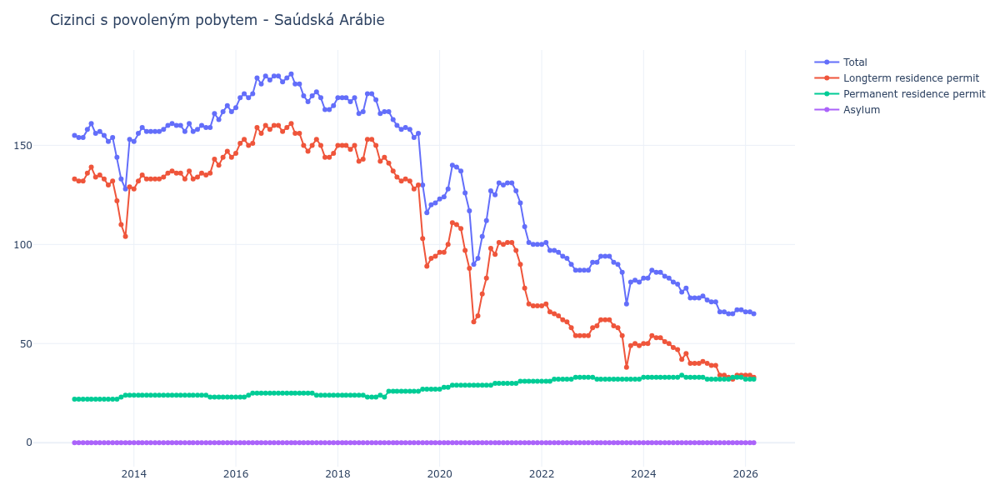

# Saúdská Arábie

## Souhrnné statistiky (Min/Max pro rok) / Summary Statistics (Min/Max per year)

| Year   | Total     | Longterm Residence Permit   | Permanent Residence Permit   | Asylum   |
|--------|-----------|-----------------------------|------------------------------|----------|
| 2012   | 154 / 155 | 132 / 133                   | 22 / 22                      | 0 / 0    |
| 2013   | 128 / 161 | 104 / 139                   | 22 / 24                      | 0 / 0    |
| 2014   | 152 / 161 | 128 / 137                   | 24 / 24                      | 0 / 0    |
| 2015   | 157 / 170 | 133 / 147                   | 23 / 24                      | 0 / 0    |
| 2016   | 169 / 185 | 146 / 160                   | 23 / 25                      | 0 / 0    |
| 2017   | 168 / 186 | 144 / 161                   | 24 / 25                      | 0 / 0    |
| 2018   | 166 / 176 | 142 / 153                   | 23 / 24                      | 0 / 0    |
| 2019   | 116 / 167 | 89 / 141                    | 26 / 27                      | 0 / 0    |
| 2020   | 90 / 140  | 61 / 111                    | 27 / 29                      | 0 / 0    |
| 2021   | 100 / 131 | 69 / 101                    | 29 / 31                      | 0 / 0    |
| 2022   | 87 / 101  | 54 / 70                     | 31 / 33                      | 0 / 0    |
| 2023   | 70 / 94   | 38 / 62                     | 32 / 33                      | 0 / 0    |
| 2024   | 73 / 87   | 40 / 54                     | 33 / 34                      | 0 / 0    |
| 2025   | 65 / 74   | 32 / 41                     | 32 / 33                      | 0 / 0    |

## Detailní tabulka / Detailed Data Table

| Date     | Total         | Longterm Residence Permit   | Permanent Residence Permit   | Asylum   |
|----------|---------------|-----------------------------|------------------------------|----------|
| **2012** |               |                             |                              |          |
| 11.2012  | 155           | 133                         | 22                           | 0        |
| 12.2012  | 154 (-0.65%)  | 132 (-0.75%)                | 22 (+0.00%)                  | 0        |
| **2013** |               |                             |                              |          |
| 01.2013  | 154 (+0.00%)  | 132 (+0.00%)                | 22 (+0.00%)                  | 0        |
| 02.2013  | 158 (+2.60%)  | 136 (+3.03%)                | 22 (+0.00%)                  | 0        |
| 03.2013  | 161 (+1.90%)  | 139 (+2.21%)                | 22 (+0.00%)                  | 0        |
| 04.2013  | 156 (-3.11%)  | 134 (-3.60%)                | 22 (+0.00%)                  | 0        |
| 05.2013  | 157 (+0.64%)  | 135 (+0.75%)                | 22 (+0.00%)                  | 0        |
| 06.2013  | 155 (-1.27%)  | 133 (-1.48%)                | 22 (+0.00%)                  | 0        |
| 07.2013  | 152 (-1.94%)  | 130 (-2.26%)                | 22 (+0.00%)                  | 0        |
| 08.2013  | 154 (+1.32%)  | 132 (+1.54%)                | 22 (+0.00%)                  | 0        |
| 09.2013  | 144 (-6.49%)  | 122 (-7.58%)                | 22 (+0.00%)                  | 0        |
| 10.2013  | 133 (-7.64%)  | 110 (-9.84%)                | 23 (+4.55%)                  | 0        |
| 11.2013  | 128 (-3.76%)  | 104 (-5.45%)                | 24 (+4.35%)                  | 0        |
| 12.2013  | 153 (+19.53%) | 129 (+24.04%)               | 24 (+0.00%)                  | 0        |
| **2014** |               |                             |                              |          |
| 01.2014  | 152 (-0.65%)  | 128 (-0.78%)                | 24 (+0.00%)                  | 0        |
| 02.2014  | 156 (+2.63%)  | 132 (+3.12%)                | 24 (+0.00%)                  | 0        |
| 03.2014  | 159 (+1.92%)  | 135 (+2.27%)                | 24 (+0.00%)                  | 0        |
| 04.2014  | 157 (-1.26%)  | 133 (-1.48%)                | 24 (+0.00%)                  | 0        |
| 05.2014  | 157 (+0.00%)  | 133 (+0.00%)                | 24 (+0.00%)                  | 0        |
| 06.2014  | 157 (+0.00%)  | 133 (+0.00%)                | 24 (+0.00%)                  | 0        |
| 07.2014  | 157 (+0.00%)  | 133 (+0.00%)                | 24 (+0.00%)                  | 0        |
| 08.2014  | 158 (+0.64%)  | 134 (+0.75%)                | 24 (+0.00%)                  | 0        |
| 09.2014  | 160 (+1.27%)  | 136 (+1.49%)                | 24 (+0.00%)                  | 0        |
| 10.2014  | 161 (+0.63%)  | 137 (+0.74%)                | 24 (+0.00%)                  | 0        |
| 11.2014  | 160 (-0.62%)  | 136 (-0.73%)                | 24 (+0.00%)                  | 0        |
| 12.2014  | 160 (+0.00%)  | 136 (+0.00%)                | 24 (+0.00%)                  | 0        |
| **2015** |               |                             |                              |          |
| 01.2015  | 157 (-1.88%)  | 133 (-2.21%)                | 24 (+0.00%)                  | 0        |
| 02.2015  | 161 (+2.55%)  | 137 (+3.01%)                | 24 (+0.00%)                  | 0        |
| 03.2015  | 157 (-2.48%)  | 133 (-2.92%)                | 24 (+0.00%)                  | 0        |
| 04.2015  | 158 (+0.64%)  | 134 (+0.75%)                | 24 (+0.00%)                  | 0        |
| 05.2015  | 160 (+1.27%)  | 136 (+1.49%)                | 24 (+0.00%)                  | 0        |
| 06.2015  | 159 (-0.62%)  | 135 (-0.74%)                | 24 (+0.00%)                  | 0        |
| 07.2015  | 159 (+0.00%)  | 136 (+0.74%)                | 23 (-4.17%)                  | 0        |
| 08.2015  | 166 (+4.40%)  | 143 (+5.15%)                | 23 (+0.00%)                  | 0        |
| 09.2015  | 163 (-1.81%)  | 140 (-2.10%)                | 23 (+0.00%)                  | 0        |
| 10.2015  | 167 (+2.45%)  | 144 (+2.86%)                | 23 (+0.00%)                  | 0        |
| 11.2015  | 170 (+1.80%)  | 147 (+2.08%)                | 23 (+0.00%)                  | 0        |
| 12.2015  | 167 (-1.76%)  | 144 (-2.04%)                | 23 (+0.00%)                  | 0        |
| **2016** |               |                             |                              |          |
| 01.2016  | 169 (+1.20%)  | 146 (+1.39%)                | 23 (+0.00%)                  | 0        |
| 02.2016  | 174 (+2.96%)  | 151 (+3.42%)                | 23 (+0.00%)                  | 0        |
| 03.2016  | 176 (+1.15%)  | 153 (+1.32%)                | 23 (+0.00%)                  | 0        |
| 04.2016  | 174 (-1.14%)  | 150 (-1.96%)                | 24 (+4.35%)                  | 0        |
| 05.2016  | 176 (+1.15%)  | 151 (+0.67%)                | 25 (+4.17%)                  | 0        |
| 06.2016  | 184 (+4.55%)  | 159 (+5.30%)                | 25 (+0.00%)                  | 0        |
| 07.2016  | 181 (-1.63%)  | 156 (-1.89%)                | 25 (+0.00%)                  | 0        |
| 08.2016  | 185 (+2.21%)  | 160 (+2.56%)                | 25 (+0.00%)                  | 0        |
| 09.2016  | 183 (-1.08%)  | 158 (-1.25%)                | 25 (+0.00%)                  | 0        |
| 10.2016  | 185 (+1.09%)  | 160 (+1.27%)                | 25 (+0.00%)                  | 0        |
| 11.2016  | 185 (+0.00%)  | 160 (+0.00%)                | 25 (+0.00%)                  | 0        |
| 12.2016  | 182 (-1.62%)  | 157 (-1.88%)                | 25 (+0.00%)                  | 0        |
| **2017** |               |                             |                              |          |
| 01.2017  | 184 (+1.10%)  | 159 (+1.27%)                | 25 (+0.00%)                  | 0        |
| 02.2017  | 186 (+1.09%)  | 161 (+1.26%)                | 25 (+0.00%)                  | 0        |
| 03.2017  | 181 (-2.69%)  | 156 (-3.11%)                | 25 (+0.00%)                  | 0        |
| 04.2017  | 181 (+0.00%)  | 156 (+0.00%)                | 25 (+0.00%)                  | 0        |
| 05.2017  | 175 (-3.31%)  | 150 (-3.85%)                | 25 (+0.00%)                  | 0        |
| 06.2017  | 172 (-1.71%)  | 147 (-2.00%)                | 25 (+0.00%)                  | 0        |
| 07.2017  | 175 (+1.74%)  | 150 (+2.04%)                | 25 (+0.00%)                  | 0        |
| 08.2017  | 177 (+1.14%)  | 153 (+2.00%)                | 24 (-4.00%)                  | 0        |
| 09.2017  | 174 (-1.69%)  | 150 (-1.96%)                | 24 (+0.00%)                  | 0        |
| 10.2017  | 168 (-3.45%)  | 144 (-4.00%)                | 24 (+0.00%)                  | 0        |
| 11.2017  | 168 (+0.00%)  | 144 (+0.00%)                | 24 (+0.00%)                  | 0        |
| 12.2017  | 170 (+1.19%)  | 146 (+1.39%)                | 24 (+0.00%)                  | 0        |
| **2018** |               |                             |                              |          |
| 01.2018  | 174 (+2.35%)  | 150 (+2.74%)                | 24 (+0.00%)                  | 0        |
| 02.2018  | 174 (+0.00%)  | 150 (+0.00%)                | 24 (+0.00%)                  | 0        |
| 03.2018  | 174 (+0.00%)  | 150 (+0.00%)                | 24 (+0.00%)                  | 0        |
| 04.2018  | 172 (-1.15%)  | 148 (-1.33%)                | 24 (+0.00%)                  | 0        |
| 05.2018  | 174 (+1.16%)  | 150 (+1.35%)                | 24 (+0.00%)                  | 0        |
| 06.2018  | 166 (-4.60%)  | 142 (-5.33%)                | 24 (+0.00%)                  | 0        |
| 07.2018  | 167 (+0.60%)  | 143 (+0.70%)                | 24 (+0.00%)                  | 0        |
| 08.2018  | 176 (+5.39%)  | 153 (+6.99%)                | 23 (-4.17%)                  | 0        |
| 09.2018  | 176 (+0.00%)  | 153 (+0.00%)                | 23 (+0.00%)                  | 0        |
| 10.2018  | 173 (-1.70%)  | 150 (-1.96%)                | 23 (+0.00%)                  | 0        |
| 11.2018  | 166 (-4.05%)  | 142 (-5.33%)                | 24 (+4.35%)                  | 0        |
| 12.2018  | 167 (+0.60%)  | 144 (+1.41%)                | 23 (-4.17%)                  | 0        |
| **2019** |               |                             |                              |          |
| 01.2019  | 167 (+0.00%)  | 141 (-2.08%)                | 26 (+13.04%)                 | 0        |
| 02.2019  | 163 (-2.40%)  | 137 (-2.84%)                | 26 (+0.00%)                  | 0        |
| 03.2019  | 160 (-1.84%)  | 134 (-2.19%)                | 26 (+0.00%)                  | 0        |
| 04.2019  | 158 (-1.25%)  | 132 (-1.49%)                | 26 (+0.00%)                  | 0        |
| 05.2019  | 159 (+0.63%)  | 133 (+0.76%)                | 26 (+0.00%)                  | 0        |
| 06.2019  | 158 (-0.63%)  | 132 (-0.75%)                | 26 (+0.00%)                  | 0        |
| 07.2019  | 154 (-2.53%)  | 128 (-3.03%)                | 26 (+0.00%)                  | 0        |
| 08.2019  | 156 (+1.30%)  | 130 (+1.56%)                | 26 (+0.00%)                  | 0        |
| 09.2019  | 130 (-16.67%) | 103 (-20.77%)               | 27 (+3.85%)                  | 0        |
| 10.2019  | 116 (-10.77%) | 89 (-13.59%)                | 27 (+0.00%)                  | 0        |
| 11.2019  | 120 (+3.45%)  | 93 (+4.49%)                 | 27 (+0.00%)                  | 0        |
| 12.2019  | 121 (+0.83%)  | 94 (+1.08%)                 | 27 (+0.00%)                  | 0        |
| **2020** |               |                             |                              |          |
| 01.2020  | 123 (+1.65%)  | 96 (+2.13%)                 | 27 (+0.00%)                  | 0        |
| 02.2020  | 124 (+0.81%)  | 96 (+0.00%)                 | 28 (+3.70%)                  | 0        |
| 03.2020  | 128 (+3.23%)  | 100 (+4.17%)                | 28 (+0.00%)                  | 0        |
| 04.2020  | 140 (+9.38%)  | 111 (+11.00%)               | 29 (+3.57%)                  | 0        |
| 05.2020  | 139 (-0.71%)  | 110 (-0.90%)                | 29 (+0.00%)                  | 0        |
| 06.2020  | 137 (-1.44%)  | 108 (-1.82%)                | 29 (+0.00%)                  | 0        |
| 07.2020  | 126 (-8.03%)  | 97 (-10.19%)                | 29 (+0.00%)                  | 0        |
| 08.2020  | 117 (-7.14%)  | 88 (-9.28%)                 | 29 (+0.00%)                  | 0        |
| 09.2020  | 90 (-23.08%)  | 61 (-30.68%)                | 29 (+0.00%)                  | 0        |
| 10.2020  | 93 (+3.33%)   | 64 (+4.92%)                 | 29 (+0.00%)                  | 0        |
| 11.2020  | 104 (+11.83%) | 75 (+17.19%)                | 29 (+0.00%)                  | 0        |
| 12.2020  | 112 (+7.69%)  | 83 (+10.67%)                | 29 (+0.00%)                  | 0        |
| **2021** |               |                             |                              |          |
| 01.2021  | 127 (+13.39%) | 98 (+18.07%)                | 29 (+0.00%)                  | 0        |
| 02.2021  | 125 (-1.57%)  | 95 (-3.06%)                 | 30 (+3.45%)                  | 0        |
| 03.2021  | 131 (+4.80%)  | 101 (+6.32%)                | 30 (+0.00%)                  | 0        |
| 04.2021  | 130 (-0.76%)  | 100 (-0.99%)                | 30 (+0.00%)                  | 0        |
| 05.2021  | 131 (+0.77%)  | 101 (+1.00%)                | 30 (+0.00%)                  | 0        |
| 06.2021  | 131 (+0.00%)  | 101 (+0.00%)                | 30 (+0.00%)                  | 0        |
| 07.2021  | 127 (-3.05%)  | 97 (-3.96%)                 | 30 (+0.00%)                  | 0        |
| 08.2021  | 121 (-4.72%)  | 90 (-7.22%)                 | 31 (+3.33%)                  | 0        |
| 09.2021  | 109 (-9.92%)  | 78 (-13.33%)                | 31 (+0.00%)                  | 0        |
| 10.2021  | 101 (-7.34%)  | 70 (-10.26%)                | 31 (+0.00%)                  | 0        |
| 11.2021  | 100 (-0.99%)  | 69 (-1.43%)                 | 31 (+0.00%)                  | 0        |
| 12.2021  | 100 (+0.00%)  | 69 (+0.00%)                 | 31 (+0.00%)                  | 0        |
| **2022** |               |                             |                              |          |
| 01.2022  | 100 (+0.00%)  | 69 (+0.00%)                 | 31 (+0.00%)                  | 0        |
| 02.2022  | 101 (+1.00%)  | 70 (+1.45%)                 | 31 (+0.00%)                  | 0        |
| 03.2022  | 97 (-3.96%)   | 66 (-5.71%)                 | 31 (+0.00%)                  | 0        |
| 04.2022  | 97 (+0.00%)   | 65 (-1.52%)                 | 32 (+3.23%)                  | 0        |
| 05.2022  | 96 (-1.03%)   | 64 (-1.54%)                 | 32 (+0.00%)                  | 0        |
| 06.2022  | 94 (-2.08%)   | 62 (-3.12%)                 | 32 (+0.00%)                  | 0        |
| 07.2022  | 93 (-1.06%)   | 61 (-1.61%)                 | 32 (+0.00%)                  | 0        |
| 08.2022  | 90 (-3.23%)   | 58 (-4.92%)                 | 32 (+0.00%)                  | 0        |
| 09.2022  | 87 (-3.33%)   | 54 (-6.90%)                 | 33 (+3.12%)                  | 0        |
| 10.2022  | 87 (+0.00%)   | 54 (+0.00%)                 | 33 (+0.00%)                  | 0        |
| 11.2022  | 87 (+0.00%)   | 54 (+0.00%)                 | 33 (+0.00%)                  | 0        |
| 12.2022  | 87 (+0.00%)   | 54 (+0.00%)                 | 33 (+0.00%)                  | 0        |
| **2023** |               |                             |                              |          |
| 01.2023  | 91 (+4.60%)   | 58 (+7.41%)                 | 33 (+0.00%)                  | 0        |
| 02.2023  | 91 (+0.00%)   | 59 (+1.72%)                 | 32 (-3.03%)                  | 0        |
| 03.2023  | 94 (+3.30%)   | 62 (+5.08%)                 | 32 (+0.00%)                  | 0        |
| 04.2023  | 94 (+0.00%)   | 62 (+0.00%)                 | 32 (+0.00%)                  | 0        |
| 05.2023  | 94 (+0.00%)   | 62 (+0.00%)                 | 32 (+0.00%)                  | 0        |
| 06.2023  | 91 (-3.19%)   | 59 (-4.84%)                 | 32 (+0.00%)                  | 0        |
| 07.2023  | 90 (-1.10%)   | 58 (-1.69%)                 | 32 (+0.00%)                  | 0        |
| 08.2023  | 86 (-4.44%)   | 54 (-6.90%)                 | 32 (+0.00%)                  | 0        |
| 09.2023  | 70 (-18.60%)  | 38 (-29.63%)                | 32 (+0.00%)                  | 0        |
| 10.2023  | 81 (+15.71%)  | 49 (+28.95%)                | 32 (+0.00%)                  | 0        |
| 11.2023  | 82 (+1.23%)   | 50 (+2.04%)                 | 32 (+0.00%)                  | 0        |
| 12.2023  | 81 (-1.22%)   | 49 (-2.00%)                 | 32 (+0.00%)                  | 0        |
| **2024** |               |                             |                              |          |
| 01.2024  | 83 (+2.47%)   | 50 (+2.04%)                 | 33 (+3.12%)                  | 0        |
| 02.2024  | 83 (+0.00%)   | 50 (+0.00%)                 | 33 (+0.00%)                  | 0        |
| 03.2024  | 87 (+4.82%)   | 54 (+8.00%)                 | 33 (+0.00%)                  | 0        |
| 04.2024  | 86 (-1.15%)   | 53 (-1.85%)                 | 33 (+0.00%)                  | 0        |
| 05.2024  | 86 (+0.00%)   | 53 (+0.00%)                 | 33 (+0.00%)                  | 0        |
| 06.2024  | 84 (-2.33%)   | 51 (-3.77%)                 | 33 (+0.00%)                  | 0        |
| 07.2024  | 83 (-1.19%)   | 50 (-1.96%)                 | 33 (+0.00%)                  | 0        |
| 08.2024  | 81 (-2.41%)   | 48 (-4.00%)                 | 33 (+0.00%)                  | 0        |
| 09.2024  | 80 (-1.23%)   | 47 (-2.08%)                 | 33 (+0.00%)                  | 0        |
| 10.2024  | 76 (-5.00%)   | 42 (-10.64%)                | 34 (+3.03%)                  | 0        |
| 11.2024  | 78 (+2.63%)   | 45 (+7.14%)                 | 33 (-2.94%)                  | 0        |
| 12.2024  | 73 (-6.41%)   | 40 (-11.11%)                | 33 (+0.00%)                  | 0        |
| **2025** |               |                             |                              |          |
| 01.2025  | 73 (+0.00%)   | 40 (+0.00%)                 | 33 (+0.00%)                  | 0        |
| 02.2025  | 73 (+0.00%)   | 40 (+0.00%)                 | 33 (+0.00%)                  | 0        |
| 03.2025  | 74 (+1.37%)   | 41 (+2.50%)                 | 33 (+0.00%)                  | 0        |
| 04.2025  | 72 (-2.70%)   | 40 (-2.44%)                 | 32 (-3.03%)                  | 0        |
| 05.2025  | 71 (-1.39%)   | 39 (-2.50%)                 | 32 (+0.00%)                  | 0        |
| 06.2025  | 71 (+0.00%)   | 39 (+0.00%)                 | 32 (+0.00%)                  | 0        |
| 07.2025  | 66 (-7.04%)   | 34 (-12.82%)                | 32 (+0.00%)                  | 0        |
| 08.2025  | 66 (+0.00%)   | 34 (+0.00%)                 | 32 (+0.00%)                  | 0        |
| 09.2025  | 65 (-1.52%)   | 33 (-2.94%)                 | 32 (+0.00%)                  | 0        |
| 10.2025  | 65 (+0.00%)   | 32 (-3.03%)                 | 33 (+3.12%)                  | 0        |
| 11.2025  | 67 (+3.08%)   | 34 (+6.25%)                 | 33 (+0.00%)                  | 0        |
| 12.2025  | 67 (+0.00%)   | 34 (+0.00%)                 | 33 (+0.00%)                  | 0        |
