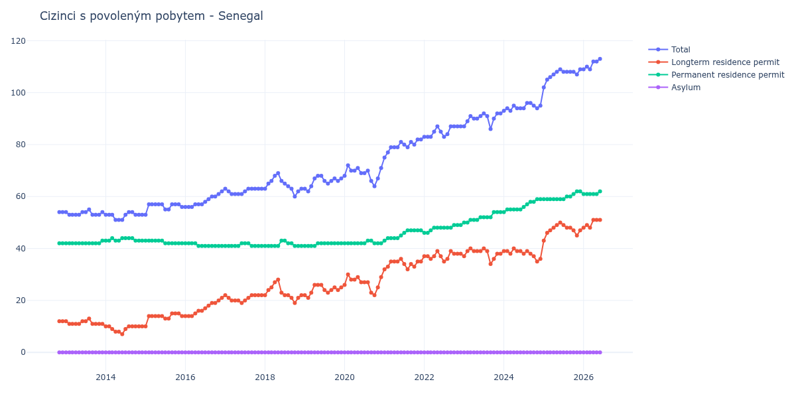

# Senegal

## Souhrnné statistiky (Min/Max pro rok) / Summary Statistics (Min/Max per year)

| Year   | Total     | Longterm Residence Permit   | Permanent Residence Permit   | Asylum   |
|--------|-----------|-----------------------------|------------------------------|----------|
| 2012   | 54 / 54   | 12 / 12                     | 42 / 42                      | 0 / 0    |
| 2013   | 53 / 55   | 11 / 13                     | 42 / 43                      | 0 / 0    |
| 2014   | 51 / 54   | 7 / 10                      | 43 / 44                      | 0 / 0    |
| 2015   | 53 / 57   | 10 / 15                     | 42 / 43                      | 0 / 0    |
| 2016   | 56 / 62   | 14 / 21                     | 41 / 42                      | 0 / 0    |
| 2017   | 61 / 63   | 19 / 22                     | 41 / 42                      | 0 / 0    |
| 2018   | 60 / 69   | 19 / 28                     | 41 / 43                      | 0 / 0    |
| 2019   | 62 / 68   | 21 / 26                     | 41 / 42                      | 0 / 0    |
| 2020   | 64 / 72   | 22 / 30                     | 42 / 43                      | 0 / 0    |
| 2021   | 75 / 82   | 32 / 36                     | 43 / 47                      | 0 / 0    |
| 2022   | 83 / 87   | 35 / 39                     | 46 / 49                      | 0 / 0    |
| 2023   | 86 / 92   | 34 / 40                     | 50 / 54                      | 0 / 0    |
| 2024   | 93 / 96   | 35 / 40                     | 54 / 59                      | 0 / 0    |
| 2025   | 102 / 109 | 43 / 50                     | 59 / 62                      | 0 / 0    |
| 2026   | 109 / 113 | 48 / 51                     | 61 / 62                      | 0 / 0    |

## Detailní tabulka / Detailed Data Table

| Date     | Total        | Longterm Residence Permit   | Permanent Residence Permit   | Asylum   |
|----------|--------------|-----------------------------|------------------------------|----------|
| **2012** |              |                             |                              |          |
| 11.2012  | 54           | 12                          | 42                           | 0        |
| 12.2012  | 54 (+0.00%)  | 12 (+0.00%)                 | 42 (+0.00%)                  | 0        |
| **2013** |              |                             |                              |          |
| 01.2013  | 54 (+0.00%)  | 12 (+0.00%)                 | 42 (+0.00%)                  | 0        |
| 02.2013  | 53 (-1.85%)  | 11 (-8.33%)                 | 42 (+0.00%)                  | 0        |
| 03.2013  | 53 (+0.00%)  | 11 (+0.00%)                 | 42 (+0.00%)                  | 0        |
| 04.2013  | 53 (+0.00%)  | 11 (+0.00%)                 | 42 (+0.00%)                  | 0        |
| 05.2013  | 53 (+0.00%)  | 11 (+0.00%)                 | 42 (+0.00%)                  | 0        |
| 06.2013  | 54 (+1.89%)  | 12 (+9.09%)                 | 42 (+0.00%)                  | 0        |
| 07.2013  | 54 (+0.00%)  | 12 (+0.00%)                 | 42 (+0.00%)                  | 0        |
| 08.2013  | 55 (+1.85%)  | 13 (+8.33%)                 | 42 (+0.00%)                  | 0        |
| 09.2013  | 53 (-3.64%)  | 11 (-15.38%)                | 42 (+0.00%)                  | 0        |
| 10.2013  | 53 (+0.00%)  | 11 (+0.00%)                 | 42 (+0.00%)                  | 0        |
| 11.2013  | 53 (+0.00%)  | 11 (+0.00%)                 | 42 (+0.00%)                  | 0        |
| 12.2013  | 54 (+1.89%)  | 11 (+0.00%)                 | 43 (+2.38%)                  | 0        |
| **2014** |              |                             |                              |          |
| 01.2014  | 53 (-1.85%)  | 10 (-9.09%)                 | 43 (+0.00%)                  | 0        |
| 02.2014  | 53 (+0.00%)  | 10 (+0.00%)                 | 43 (+0.00%)                  | 0        |
| 03.2014  | 53 (+0.00%)  | 9 (-10.00%)                 | 44 (+2.33%)                  | 0        |
| 04.2014  | 51 (-3.77%)  | 8 (-11.11%)                 | 43 (-2.27%)                  | 0        |
| 05.2014  | 51 (+0.00%)  | 8 (+0.00%)                  | 43 (+0.00%)                  | 0        |
| 06.2014  | 51 (+0.00%)  | 7 (-12.50%)                 | 44 (+2.33%)                  | 0        |
| 07.2014  | 53 (+3.92%)  | 9 (+28.57%)                 | 44 (+0.00%)                  | 0        |
| 08.2014  | 54 (+1.89%)  | 10 (+11.11%)                | 44 (+0.00%)                  | 0        |
| 09.2014  | 54 (+0.00%)  | 10 (+0.00%)                 | 44 (+0.00%)                  | 0        |
| 10.2014  | 53 (-1.85%)  | 10 (+0.00%)                 | 43 (-2.27%)                  | 0        |
| 11.2014  | 53 (+0.00%)  | 10 (+0.00%)                 | 43 (+0.00%)                  | 0        |
| 12.2014  | 53 (+0.00%)  | 10 (+0.00%)                 | 43 (+0.00%)                  | 0        |
| **2015** |              |                             |                              |          |
| 01.2015  | 53 (+0.00%)  | 10 (+0.00%)                 | 43 (+0.00%)                  | 0        |
| 02.2015  | 57 (+7.55%)  | 14 (+40.00%)                | 43 (+0.00%)                  | 0        |
| 03.2015  | 57 (+0.00%)  | 14 (+0.00%)                 | 43 (+0.00%)                  | 0        |
| 04.2015  | 57 (+0.00%)  | 14 (+0.00%)                 | 43 (+0.00%)                  | 0        |
| 05.2015  | 57 (+0.00%)  | 14 (+0.00%)                 | 43 (+0.00%)                  | 0        |
| 06.2015  | 57 (+0.00%)  | 14 (+0.00%)                 | 43 (+0.00%)                  | 0        |
| 07.2015  | 55 (-3.51%)  | 13 (-7.14%)                 | 42 (-2.33%)                  | 0        |
| 08.2015  | 55 (+0.00%)  | 13 (+0.00%)                 | 42 (+0.00%)                  | 0        |
| 09.2015  | 57 (+3.64%)  | 15 (+15.38%)                | 42 (+0.00%)                  | 0        |
| 10.2015  | 57 (+0.00%)  | 15 (+0.00%)                 | 42 (+0.00%)                  | 0        |
| 11.2015  | 57 (+0.00%)  | 15 (+0.00%)                 | 42 (+0.00%)                  | 0        |
| 12.2015  | 56 (-1.75%)  | 14 (-6.67%)                 | 42 (+0.00%)                  | 0        |
| **2016** |              |                             |                              |          |
| 01.2016  | 56 (+0.00%)  | 14 (+0.00%)                 | 42 (+0.00%)                  | 0        |
| 02.2016  | 56 (+0.00%)  | 14 (+0.00%)                 | 42 (+0.00%)                  | 0        |
| 03.2016  | 56 (+0.00%)  | 14 (+0.00%)                 | 42 (+0.00%)                  | 0        |
| 04.2016  | 57 (+1.79%)  | 15 (+7.14%)                 | 42 (+0.00%)                  | 0        |
| 05.2016  | 57 (+0.00%)  | 16 (+6.67%)                 | 41 (-2.38%)                  | 0        |
| 06.2016  | 57 (+0.00%)  | 16 (+0.00%)                 | 41 (+0.00%)                  | 0        |
| 07.2016  | 58 (+1.75%)  | 17 (+6.25%)                 | 41 (+0.00%)                  | 0        |
| 08.2016  | 59 (+1.72%)  | 18 (+5.88%)                 | 41 (+0.00%)                  | 0        |
| 09.2016  | 60 (+1.69%)  | 19 (+5.56%)                 | 41 (+0.00%)                  | 0        |
| 10.2016  | 60 (+0.00%)  | 19 (+0.00%)                 | 41 (+0.00%)                  | 0        |
| 11.2016  | 61 (+1.67%)  | 20 (+5.26%)                 | 41 (+0.00%)                  | 0        |
| 12.2016  | 62 (+1.64%)  | 21 (+5.00%)                 | 41 (+0.00%)                  | 0        |
| **2017** |              |                             |                              |          |
| 01.2017  | 63 (+1.61%)  | 22 (+4.76%)                 | 41 (+0.00%)                  | 0        |
| 02.2017  | 62 (-1.59%)  | 21 (-4.55%)                 | 41 (+0.00%)                  | 0        |
| 03.2017  | 61 (-1.61%)  | 20 (-4.76%)                 | 41 (+0.00%)                  | 0        |
| 04.2017  | 61 (+0.00%)  | 20 (+0.00%)                 | 41 (+0.00%)                  | 0        |
| 05.2017  | 61 (+0.00%)  | 20 (+0.00%)                 | 41 (+0.00%)                  | 0        |
| 06.2017  | 61 (+0.00%)  | 19 (-5.00%)                 | 42 (+2.44%)                  | 0        |
| 07.2017  | 62 (+1.64%)  | 20 (+5.26%)                 | 42 (+0.00%)                  | 0        |
| 08.2017  | 63 (+1.61%)  | 21 (+5.00%)                 | 42 (+0.00%)                  | 0        |
| 09.2017  | 63 (+0.00%)  | 22 (+4.76%)                 | 41 (-2.38%)                  | 0        |
| 10.2017  | 63 (+0.00%)  | 22 (+0.00%)                 | 41 (+0.00%)                  | 0        |
| 11.2017  | 63 (+0.00%)  | 22 (+0.00%)                 | 41 (+0.00%)                  | 0        |
| 12.2017  | 63 (+0.00%)  | 22 (+0.00%)                 | 41 (+0.00%)                  | 0        |
| **2018** |              |                             |                              |          |
| 01.2018  | 63 (+0.00%)  | 22 (+0.00%)                 | 41 (+0.00%)                  | 0        |
| 02.2018  | 65 (+3.17%)  | 24 (+9.09%)                 | 41 (+0.00%)                  | 0        |
| 03.2018  | 66 (+1.54%)  | 25 (+4.17%)                 | 41 (+0.00%)                  | 0        |
| 04.2018  | 68 (+3.03%)  | 27 (+8.00%)                 | 41 (+0.00%)                  | 0        |
| 05.2018  | 69 (+1.47%)  | 28 (+3.70%)                 | 41 (+0.00%)                  | 0        |
| 06.2018  | 66 (-4.35%)  | 23 (-17.86%)                | 43 (+4.88%)                  | 0        |
| 07.2018  | 65 (-1.52%)  | 22 (-4.35%)                 | 43 (+0.00%)                  | 0        |
| 08.2018  | 64 (-1.54%)  | 22 (+0.00%)                 | 42 (-2.33%)                  | 0        |
| 09.2018  | 63 (-1.56%)  | 21 (-4.55%)                 | 42 (+0.00%)                  | 0        |
| 10.2018  | 60 (-4.76%)  | 19 (-9.52%)                 | 41 (-2.38%)                  | 0        |
| 11.2018  | 62 (+3.33%)  | 21 (+10.53%)                | 41 (+0.00%)                  | 0        |
| 12.2018  | 63 (+1.61%)  | 22 (+4.76%)                 | 41 (+0.00%)                  | 0        |
| **2019** |              |                             |                              |          |
| 01.2019  | 63 (+0.00%)  | 22 (+0.00%)                 | 41 (+0.00%)                  | 0        |
| 02.2019  | 62 (-1.59%)  | 21 (-4.55%)                 | 41 (+0.00%)                  | 0        |
| 03.2019  | 64 (+3.23%)  | 23 (+9.52%)                 | 41 (+0.00%)                  | 0        |
| 04.2019  | 67 (+4.69%)  | 26 (+13.04%)                | 41 (+0.00%)                  | 0        |
| 05.2019  | 68 (+1.49%)  | 26 (+0.00%)                 | 42 (+2.44%)                  | 0        |
| 06.2019  | 68 (+0.00%)  | 26 (+0.00%)                 | 42 (+0.00%)                  | 0        |
| 07.2019  | 66 (-2.94%)  | 24 (-7.69%)                 | 42 (+0.00%)                  | 0        |
| 08.2019  | 65 (-1.52%)  | 23 (-4.17%)                 | 42 (+0.00%)                  | 0        |
| 09.2019  | 66 (+1.54%)  | 24 (+4.35%)                 | 42 (+0.00%)                  | 0        |
| 10.2019  | 67 (+1.52%)  | 25 (+4.17%)                 | 42 (+0.00%)                  | 0        |
| 11.2019  | 66 (-1.49%)  | 24 (-4.00%)                 | 42 (+0.00%)                  | 0        |
| 12.2019  | 67 (+1.52%)  | 25 (+4.17%)                 | 42 (+0.00%)                  | 0        |
| **2020** |              |                             |                              |          |
| 01.2020  | 68 (+1.49%)  | 26 (+4.00%)                 | 42 (+0.00%)                  | 0        |
| 02.2020  | 72 (+5.88%)  | 30 (+15.38%)                | 42 (+0.00%)                  | 0        |
| 03.2020  | 70 (-2.78%)  | 28 (-6.67%)                 | 42 (+0.00%)                  | 0        |
| 04.2020  | 70 (+0.00%)  | 28 (+0.00%)                 | 42 (+0.00%)                  | 0        |
| 05.2020  | 71 (+1.43%)  | 29 (+3.57%)                 | 42 (+0.00%)                  | 0        |
| 06.2020  | 69 (-2.82%)  | 27 (-6.90%)                 | 42 (+0.00%)                  | 0        |
| 07.2020  | 69 (+0.00%)  | 27 (+0.00%)                 | 42 (+0.00%)                  | 0        |
| 08.2020  | 70 (+1.45%)  | 27 (+0.00%)                 | 43 (+2.38%)                  | 0        |
| 09.2020  | 66 (-5.71%)  | 23 (-14.81%)                | 43 (+0.00%)                  | 0        |
| 10.2020  | 64 (-3.03%)  | 22 (-4.35%)                 | 42 (-2.33%)                  | 0        |
| 11.2020  | 67 (+4.69%)  | 25 (+13.64%)                | 42 (+0.00%)                  | 0        |
| 12.2020  | 71 (+5.97%)  | 29 (+16.00%)                | 42 (+0.00%)                  | 0        |
| **2021** |              |                             |                              |          |
| 01.2021  | 75 (+5.63%)  | 32 (+10.34%)                | 43 (+2.38%)                  | 0        |
| 02.2021  | 77 (+2.67%)  | 33 (+3.12%)                 | 44 (+2.33%)                  | 0        |
| 03.2021  | 79 (+2.60%)  | 35 (+6.06%)                 | 44 (+0.00%)                  | 0        |
| 04.2021  | 79 (+0.00%)  | 35 (+0.00%)                 | 44 (+0.00%)                  | 0        |
| 05.2021  | 79 (+0.00%)  | 35 (+0.00%)                 | 44 (+0.00%)                  | 0        |
| 06.2021  | 81 (+2.53%)  | 36 (+2.86%)                 | 45 (+2.27%)                  | 0        |
| 07.2021  | 80 (-1.23%)  | 34 (-5.56%)                 | 46 (+2.22%)                  | 0        |
| 08.2021  | 79 (-1.25%)  | 32 (-5.88%)                 | 47 (+2.17%)                  | 0        |
| 09.2021  | 81 (+2.53%)  | 34 (+6.25%)                 | 47 (+0.00%)                  | 0        |
| 10.2021  | 80 (-1.23%)  | 33 (-2.94%)                 | 47 (+0.00%)                  | 0        |
| 11.2021  | 82 (+2.50%)  | 35 (+6.06%)                 | 47 (+0.00%)                  | 0        |
| 12.2021  | 82 (+0.00%)  | 35 (+0.00%)                 | 47 (+0.00%)                  | 0        |
| **2022** |              |                             |                              |          |
| 01.2022  | 83 (+1.22%)  | 37 (+5.71%)                 | 46 (-2.13%)                  | 0        |
| 02.2022  | 83 (+0.00%)  | 37 (+0.00%)                 | 46 (+0.00%)                  | 0        |
| 03.2022  | 83 (+0.00%)  | 36 (-2.70%)                 | 47 (+2.17%)                  | 0        |
| 04.2022  | 85 (+2.41%)  | 37 (+2.78%)                 | 48 (+2.13%)                  | 0        |
| 05.2022  | 87 (+2.35%)  | 39 (+5.41%)                 | 48 (+0.00%)                  | 0        |
| 06.2022  | 85 (-2.30%)  | 37 (-5.13%)                 | 48 (+0.00%)                  | 0        |
| 07.2022  | 83 (-2.35%)  | 35 (-5.41%)                 | 48 (+0.00%)                  | 0        |
| 08.2022  | 84 (+1.20%)  | 36 (+2.86%)                 | 48 (+0.00%)                  | 0        |
| 09.2022  | 87 (+3.57%)  | 39 (+8.33%)                 | 48 (+0.00%)                  | 0        |
| 10.2022  | 87 (+0.00%)  | 38 (-2.56%)                 | 49 (+2.08%)                  | 0        |
| 11.2022  | 87 (+0.00%)  | 38 (+0.00%)                 | 49 (+0.00%)                  | 0        |
| 12.2022  | 87 (+0.00%)  | 38 (+0.00%)                 | 49 (+0.00%)                  | 0        |
| **2023** |              |                             |                              |          |
| 01.2023  | 87 (+0.00%)  | 37 (-2.63%)                 | 50 (+2.04%)                  | 0        |
| 02.2023  | 89 (+2.30%)  | 39 (+5.41%)                 | 50 (+0.00%)                  | 0        |
| 03.2023  | 91 (+2.25%)  | 40 (+2.56%)                 | 51 (+2.00%)                  | 0        |
| 04.2023  | 90 (-1.10%)  | 39 (-2.50%)                 | 51 (+0.00%)                  | 0        |
| 05.2023  | 90 (+0.00%)  | 39 (+0.00%)                 | 51 (+0.00%)                  | 0        |
| 06.2023  | 91 (+1.11%)  | 39 (+0.00%)                 | 52 (+1.96%)                  | 0        |
| 07.2023  | 92 (+1.10%)  | 40 (+2.56%)                 | 52 (+0.00%)                  | 0        |
| 08.2023  | 91 (-1.09%)  | 39 (-2.50%)                 | 52 (+0.00%)                  | 0        |
| 09.2023  | 86 (-5.49%)  | 34 (-12.82%)                | 52 (+0.00%)                  | 0        |
| 10.2023  | 90 (+4.65%)  | 36 (+5.88%)                 | 54 (+3.85%)                  | 0        |
| 11.2023  | 92 (+2.22%)  | 38 (+5.56%)                 | 54 (+0.00%)                  | 0        |
| 12.2023  | 92 (+0.00%)  | 38 (+0.00%)                 | 54 (+0.00%)                  | 0        |
| **2024** |              |                             |                              |          |
| 01.2024  | 93 (+1.09%)  | 39 (+2.63%)                 | 54 (+0.00%)                  | 0        |
| 02.2024  | 94 (+1.08%)  | 39 (+0.00%)                 | 55 (+1.85%)                  | 0        |
| 03.2024  | 93 (-1.06%)  | 38 (-2.56%)                 | 55 (+0.00%)                  | 0        |
| 04.2024  | 95 (+2.15%)  | 40 (+5.26%)                 | 55 (+0.00%)                  | 0        |
| 05.2024  | 94 (-1.05%)  | 39 (-2.50%)                 | 55 (+0.00%)                  | 0        |
| 06.2024  | 94 (+0.00%)  | 39 (+0.00%)                 | 55 (+0.00%)                  | 0        |
| 07.2024  | 94 (+0.00%)  | 38 (-2.56%)                 | 56 (+1.82%)                  | 0        |
| 08.2024  | 96 (+2.13%)  | 39 (+2.63%)                 | 57 (+1.79%)                  | 0        |
| 09.2024  | 96 (+0.00%)  | 38 (-2.56%)                 | 58 (+1.75%)                  | 0        |
| 10.2024  | 95 (-1.04%)  | 37 (-2.63%)                 | 58 (+0.00%)                  | 0        |
| 11.2024  | 94 (-1.05%)  | 35 (-5.41%)                 | 59 (+1.72%)                  | 0        |
| 12.2024  | 95 (+1.06%)  | 36 (+2.86%)                 | 59 (+0.00%)                  | 0        |
| **2025** |              |                             |                              |          |
| 01.2025  | 102 (+7.37%) | 43 (+19.44%)                | 59 (+0.00%)                  | 0        |
| 02.2025  | 105 (+2.94%) | 46 (+6.98%)                 | 59 (+0.00%)                  | 0        |
| 03.2025  | 106 (+0.95%) | 47 (+2.17%)                 | 59 (+0.00%)                  | 0        |
| 04.2025  | 107 (+0.94%) | 48 (+2.13%)                 | 59 (+0.00%)                  | 0        |
| 05.2025  | 108 (+0.93%) | 49 (+2.08%)                 | 59 (+0.00%)                  | 0        |
| 06.2025  | 109 (+0.93%) | 50 (+2.04%)                 | 59 (+0.00%)                  | 0        |
| 07.2025  | 108 (-0.92%) | 49 (-2.00%)                 | 59 (+0.00%)                  | 0        |
| 08.2025  | 108 (+0.00%) | 48 (-2.04%)                 | 60 (+1.69%)                  | 0        |
| 09.2025  | 108 (+0.00%) | 48 (+0.00%)                 | 60 (+0.00%)                  | 0        |
| 10.2025  | 108 (+0.00%) | 47 (-2.08%)                 | 61 (+1.67%)                  | 0        |
| 11.2025  | 107 (-0.93%) | 45 (-4.26%)                 | 62 (+1.64%)                  | 0        |
| 12.2025  | 109 (+1.87%) | 47 (+4.44%)                 | 62 (+0.00%)                  | 0        |
| **2026** |              |                             |                              |          |
| 01.2026  | 109 (+0.00%) | 48 (+2.13%)                 | 61 (-1.61%)                  | 0        |
| 02.2026  | 110 (+0.92%) | 49 (+2.08%)                 | 61 (+0.00%)                  | 0        |
| 03.2026  | 109 (-0.91%) | 48 (-2.04%)                 | 61 (+0.00%)                  | 0        |
| 04.2026  | 112 (+2.75%) | 51 (+6.25%)                 | 61 (+0.00%)                  | 0        |
| 05.2026  | 112 (+0.00%) | 51 (+0.00%)                 | 61 (+0.00%)                  | 0        |
| 06.2026  | 113 (+0.89%) | 51 (+0.00%)                 | 62 (+1.64%)                  | 0        |
