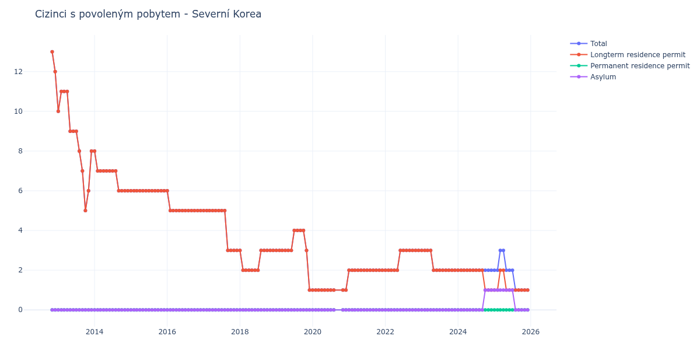

# Severní Korea

## Souhrnné statistiky (Min/Max pro rok) / Summary Statistics (Min/Max per year)

| Year   | Total Min/Max   | Longterm Residence Permit Min/Max   | Permanent Residence Permit Min/Max   | Asylum Min/Max   |
|--------|-----------------|-------------------------------------|--------------------------------------|------------------|
| 2012   | 12 / 13         | 12 / 13                             | 0 / 0                                | 0 / 0            |
| 2013   | 5 / 11          | 5 / 11                              | 0 / 0                                | 0 / 0            |
| 2014   | 6 / 8           | 6 / 8                               | 0 / 0                                | 0 / 0            |
| 2015   | 6 / 6           | 6 / 6                               | 0 / 0                                | 0 / 0            |
| 2016   | 5 / 6           | 5 / 6                               | 0 / 0                                | 0 / 0            |
| 2017   | 3 / 5           | 3 / 5                               | 0 / 0                                | 0 / 0            |
| 2018   | 2 / 3           | 2 / 3                               | 0 / 0                                | 0 / 0            |
| 2019   | 1 / 4           | 1 / 4                               | 0 / 0                                | 0 / 0            |
| 2020   | 1 / 1           | 1 / 1                               | 0 / 0                                | 0 / 0            |
| 2021   | 2 / 2           | 2 / 2                               | 0 / 0                                | 0 / 0            |
| 2022   | 2 / 3           | 2 / 3                               | 0 / 0                                | 0 / 0            |
| 2023   | 2 / 3           | 2 / 3                               | 0 / 0                                | 0 / 0            |
| 2024   | 2 / 2           | 1 / 2                               | 0 / 0                                | 0 / 1            |
| 2025   | 1 / 3           | 1 / 2                               | 0 / 0                                | 0 / 1            |

## Detailní tabulka / Detailed Data Table

| Date     | Total        | Longterm Residence Permit   | Permanent Residence Permit   | Asylum       |
|----------|--------------|-----------------------------|------------------------------|--------------|
| **2012** |              |                             |                              |              |
| 11.2012  | 13           | 13                          | 0                            | 0            |
| 12.2012  | 12 (-7.69%)  | 12 (-7.69%)                 | 0                            | 0            |
| **2013** |              |                             |                              |              |
| 01.2013  | 10 (-16.67%) | 10 (-16.67%)                | 0                            | 0            |
| 02.2013  | 11 (+10.00%) | 11 (+10.00%)                | 0                            | 0            |
| 03.2013  | 11 (+0.00%)  | 11 (+0.00%)                 | 0                            | 0            |
| 04.2013  | 11 (+0.00%)  | 11 (+0.00%)                 | 0                            | 0            |
| 05.2013  | 9 (-18.18%)  | 9 (-18.18%)                 | 0                            | 0            |
| 06.2013  | 9 (+0.00%)   | 9 (+0.00%)                  | 0                            | 0            |
| 07.2013  | 9 (+0.00%)   | 9 (+0.00%)                  | 0                            | 0            |
| 08.2013  | 8 (-11.11%)  | 8 (-11.11%)                 | 0                            | 0            |
| 09.2013  | 7 (-12.50%)  | 7 (-12.50%)                 | 0                            | 0            |
| 10.2013  | 5 (-28.57%)  | 5 (-28.57%)                 | 0                            | 0            |
| 11.2013  | 6 (+20.00%)  | 6 (+20.00%)                 | 0                            | 0            |
| 12.2013  | 8 (+33.33%)  | 8 (+33.33%)                 | 0                            | 0            |
| **2014** |              |                             |                              |              |
| 01.2014  | 8 (+0.00%)   | 8 (+0.00%)                  | 0                            | 0            |
| 02.2014  | 7 (-12.50%)  | 7 (-12.50%)                 | 0                            | 0            |
| 03.2014  | 7 (+0.00%)   | 7 (+0.00%)                  | 0                            | 0            |
| 04.2014  | 7 (+0.00%)   | 7 (+0.00%)                  | 0                            | 0            |
| 05.2014  | 7 (+0.00%)   | 7 (+0.00%)                  | 0                            | 0            |
| 06.2014  | 7 (+0.00%)   | 7 (+0.00%)                  | 0                            | 0            |
| 07.2014  | 7 (+0.00%)   | 7 (+0.00%)                  | 0                            | 0            |
| 08.2014  | 7 (+0.00%)   | 7 (+0.00%)                  | 0                            | 0            |
| 09.2014  | 6 (-14.29%)  | 6 (-14.29%)                 | 0                            | 0            |
| 10.2014  | 6 (+0.00%)   | 6 (+0.00%)                  | 0                            | 0            |
| 11.2014  | 6 (+0.00%)   | 6 (+0.00%)                  | 0                            | 0            |
| 12.2014  | 6 (+0.00%)   | 6 (+0.00%)                  | 0                            | 0            |
| **2015** |              |                             |                              |              |
| 01.2015  | 6 (+0.00%)   | 6 (+0.00%)                  | 0                            | 0            |
| 02.2015  | 6 (+0.00%)   | 6 (+0.00%)                  | 0                            | 0            |
| 03.2015  | 6 (+0.00%)   | 6 (+0.00%)                  | 0                            | 0            |
| 04.2015  | 6 (+0.00%)   | 6 (+0.00%)                  | 0                            | 0            |
| 05.2015  | 6 (+0.00%)   | 6 (+0.00%)                  | 0                            | 0            |
| 06.2015  | 6 (+0.00%)   | 6 (+0.00%)                  | 0                            | 0            |
| 07.2015  | 6 (+0.00%)   | 6 (+0.00%)                  | 0                            | 0            |
| 08.2015  | 6 (+0.00%)   | 6 (+0.00%)                  | 0                            | 0            |
| 09.2015  | 6 (+0.00%)   | 6 (+0.00%)                  | 0                            | 0            |
| 10.2015  | 6 (+0.00%)   | 6 (+0.00%)                  | 0                            | 0            |
| 11.2015  | 6 (+0.00%)   | 6 (+0.00%)                  | 0                            | 0            |
| 12.2015  | 6 (+0.00%)   | 6 (+0.00%)                  | 0                            | 0            |
| **2016** |              |                             |                              |              |
| 01.2016  | 6 (+0.00%)   | 6 (+0.00%)                  | 0                            | 0            |
| 02.2016  | 5 (-16.67%)  | 5 (-16.67%)                 | 0                            | 0            |
| 03.2016  | 5 (+0.00%)   | 5 (+0.00%)                  | 0                            | 0            |
| 04.2016  | 5 (+0.00%)   | 5 (+0.00%)                  | 0                            | 0            |
| 05.2016  | 5 (+0.00%)   | 5 (+0.00%)                  | 0                            | 0            |
| 06.2016  | 5 (+0.00%)   | 5 (+0.00%)                  | 0                            | 0            |
| 07.2016  | 5 (+0.00%)   | 5 (+0.00%)                  | 0                            | 0            |
| 08.2016  | 5 (+0.00%)   | 5 (+0.00%)                  | 0                            | 0            |
| 09.2016  | 5 (+0.00%)   | 5 (+0.00%)                  | 0                            | 0            |
| 10.2016  | 5 (+0.00%)   | 5 (+0.00%)                  | 0                            | 0            |
| 11.2016  | 5 (+0.00%)   | 5 (+0.00%)                  | 0                            | 0            |
| 12.2016  | 5 (+0.00%)   | 5 (+0.00%)                  | 0                            | 0            |
| **2017** |              |                             |                              |              |
| 01.2017  | 5 (+0.00%)   | 5 (+0.00%)                  | 0                            | 0            |
| 02.2017  | 5 (+0.00%)   | 5 (+0.00%)                  | 0                            | 0            |
| 03.2017  | 5 (+0.00%)   | 5 (+0.00%)                  | 0                            | 0            |
| 04.2017  | 5 (+0.00%)   | 5 (+0.00%)                  | 0                            | 0            |
| 05.2017  | 5 (+0.00%)   | 5 (+0.00%)                  | 0                            | 0            |
| 06.2017  | 5 (+0.00%)   | 5 (+0.00%)                  | 0                            | 0            |
| 07.2017  | 5 (+0.00%)   | 5 (+0.00%)                  | 0                            | 0            |
| 08.2017  | 5 (+0.00%)   | 5 (+0.00%)                  | 0                            | 0            |
| 09.2017  | 3 (-40.00%)  | 3 (-40.00%)                 | 0                            | 0            |
| 10.2017  | 3 (+0.00%)   | 3 (+0.00%)                  | 0                            | 0            |
| 11.2017  | 3 (+0.00%)   | 3 (+0.00%)                  | 0                            | 0            |
| 12.2017  | 3 (+0.00%)   | 3 (+0.00%)                  | 0                            | 0            |
| **2018** |              |                             |                              |              |
| 01.2018  | 3 (+0.00%)   | 3 (+0.00%)                  | 0                            | 0            |
| 02.2018  | 2 (-33.33%)  | 2 (-33.33%)                 | 0                            | 0            |
| 03.2018  | 2 (+0.00%)   | 2 (+0.00%)                  | 0                            | 0            |
| 04.2018  | 2 (+0.00%)   | 2 (+0.00%)                  | 0                            | 0            |
| 05.2018  | 2 (+0.00%)   | 2 (+0.00%)                  | 0                            | 0            |
| 06.2018  | 2 (+0.00%)   | 2 (+0.00%)                  | 0                            | 0            |
| 07.2018  | 2 (+0.00%)   | 2 (+0.00%)                  | 0                            | 0            |
| 08.2018  | 3 (+50.00%)  | 3 (+50.00%)                 | 0                            | 0            |
| 09.2018  | 3 (+0.00%)   | 3 (+0.00%)                  | 0                            | 0            |
| 10.2018  | 3 (+0.00%)   | 3 (+0.00%)                  | 0                            | 0            |
| 11.2018  | 3 (+0.00%)   | 3 (+0.00%)                  | 0                            | 0            |
| 12.2018  | 3 (+0.00%)   | 3 (+0.00%)                  | 0                            | 0            |
| **2019** |              |                             |                              |              |
| 01.2019  | 3 (+0.00%)   | 3 (+0.00%)                  | 0                            | 0            |
| 02.2019  | 3 (+0.00%)   | 3 (+0.00%)                  | 0                            | 0            |
| 03.2019  | 3 (+0.00%)   | 3 (+0.00%)                  | 0                            | 0            |
| 04.2019  | 3 (+0.00%)   | 3 (+0.00%)                  | 0                            | 0            |
| 05.2019  | 3 (+0.00%)   | 3 (+0.00%)                  | 0                            | 0            |
| 06.2019  | 3 (+0.00%)   | 3 (+0.00%)                  | 0                            | 0            |
| 07.2019  | 4 (+33.33%)  | 4 (+33.33%)                 | 0                            | 0            |
| 08.2019  | 4 (+0.00%)   | 4 (+0.00%)                  | 0                            | 0            |
| 09.2019  | 4 (+0.00%)   | 4 (+0.00%)                  | 0                            | 0            |
| 10.2019  | 4 (+0.00%)   | 4 (+0.00%)                  | 0                            | 0            |
| 11.2019  | 3 (-25.00%)  | 3 (-25.00%)                 | 0                            | 0            |
| 12.2019  | 1 (-66.67%)  | 1 (-66.67%)                 | 0                            | 0            |
| **2020** |              |                             |                              |              |
| 01.2020  | 1 (+0.00%)   | 1 (+0.00%)                  | 0                            | 0            |
| 02.2020  | 1 (+0.00%)   | 1 (+0.00%)                  | 0                            | 0            |
| 03.2020  | 1 (+0.00%)   | 1 (+0.00%)                  | 0                            | 0            |
| 04.2020  | 1 (+0.00%)   | 1 (+0.00%)                  | 0                            | 0            |
| 05.2020  | 1 (+0.00%)   | 1 (+0.00%)                  | 0                            | 0            |
| 06.2020  | 1 (+0.00%)   | 1 (+0.00%)                  | 0                            | 0            |
| 07.2020  | 1 (+0.00%)   | 1 (+0.00%)                  | 0                            | 0            |
| 08.2020  | 1 (+0.00%)   | 1 (+0.00%)                  | 0                            | 0            |
| 11.2020  | 1 (+0.00%)   | 1 (+0.00%)                  | 0                            | 0            |
| 12.2020  | 1 (+0.00%)   | 1 (+0.00%)                  | 0                            | 0            |
| **2021** |              |                             |                              |              |
| 01.2021  | 2 (+100.00%) | 2 (+100.00%)                | 0                            | 0            |
| 02.2021  | 2 (+0.00%)   | 2 (+0.00%)                  | 0                            | 0            |
| 03.2021  | 2 (+0.00%)   | 2 (+0.00%)                  | 0                            | 0            |
| 04.2021  | 2 (+0.00%)   | 2 (+0.00%)                  | 0                            | 0            |
| 05.2021  | 2 (+0.00%)   | 2 (+0.00%)                  | 0                            | 0            |
| 06.2021  | 2 (+0.00%)   | 2 (+0.00%)                  | 0                            | 0            |
| 07.2021  | 2 (+0.00%)   | 2 (+0.00%)                  | 0                            | 0            |
| 08.2021  | 2 (+0.00%)   | 2 (+0.00%)                  | 0                            | 0            |
| 09.2021  | 2 (+0.00%)   | 2 (+0.00%)                  | 0                            | 0            |
| 10.2021  | 2 (+0.00%)   | 2 (+0.00%)                  | 0                            | 0            |
| 11.2021  | 2 (+0.00%)   | 2 (+0.00%)                  | 0                            | 0            |
| 12.2021  | 2 (+0.00%)   | 2 (+0.00%)                  | 0                            | 0            |
| **2022** |              |                             |                              |              |
| 01.2022  | 2 (+0.00%)   | 2 (+0.00%)                  | 0                            | 0            |
| 02.2022  | 2 (+0.00%)   | 2 (+0.00%)                  | 0                            | 0            |
| 03.2022  | 2 (+0.00%)   | 2 (+0.00%)                  | 0                            | 0            |
| 04.2022  | 2 (+0.00%)   | 2 (+0.00%)                  | 0                            | 0            |
| 05.2022  | 2 (+0.00%)   | 2 (+0.00%)                  | 0                            | 0            |
| 06.2022  | 3 (+50.00%)  | 3 (+50.00%)                 | 0                            | 0            |
| 07.2022  | 3 (+0.00%)   | 3 (+0.00%)                  | 0                            | 0            |
| 08.2022  | 3 (+0.00%)   | 3 (+0.00%)                  | 0                            | 0            |
| 09.2022  | 3 (+0.00%)   | 3 (+0.00%)                  | 0                            | 0            |
| 10.2022  | 3 (+0.00%)   | 3 (+0.00%)                  | 0                            | 0            |
| 11.2022  | 3 (+0.00%)   | 3 (+0.00%)                  | 0                            | 0            |
| 12.2022  | 3 (+0.00%)   | 3 (+0.00%)                  | 0                            | 0            |
| **2023** |              |                             |                              |              |
| 01.2023  | 3 (+0.00%)   | 3 (+0.00%)                  | 0                            | 0            |
| 02.2023  | 3 (+0.00%)   | 3 (+0.00%)                  | 0                            | 0            |
| 03.2023  | 3 (+0.00%)   | 3 (+0.00%)                  | 0                            | 0            |
| 04.2023  | 3 (+0.00%)   | 3 (+0.00%)                  | 0                            | 0            |
| 05.2023  | 2 (-33.33%)  | 2 (-33.33%)                 | 0                            | 0            |
| 06.2023  | 2 (+0.00%)   | 2 (+0.00%)                  | 0                            | 0            |
| 07.2023  | 2 (+0.00%)   | 2 (+0.00%)                  | 0                            | 0            |
| 08.2023  | 2 (+0.00%)   | 2 (+0.00%)                  | 0                            | 0            |
| 09.2023  | 2 (+0.00%)   | 2 (+0.00%)                  | 0                            | 0            |
| 10.2023  | 2 (+0.00%)   | 2 (+0.00%)                  | 0                            | 0            |
| 11.2023  | 2 (+0.00%)   | 2 (+0.00%)                  | 0                            | 0            |
| 12.2023  | 2 (+0.00%)   | 2 (+0.00%)                  | 0                            | 0            |
| **2024** |              |                             |                              |              |
| 01.2024  | 2 (+0.00%)   | 2 (+0.00%)                  | 0                            | 0            |
| 02.2024  | 2 (+0.00%)   | 2 (+0.00%)                  | 0                            | 0            |
| 03.2024  | 2 (+0.00%)   | 2 (+0.00%)                  | 0                            | 0            |
| 04.2024  | 2 (+0.00%)   | 2 (+0.00%)                  | 0                            | 0            |
| 05.2024  | 2 (+0.00%)   | 2 (+0.00%)                  | 0                            | 0            |
| 06.2024  | 2 (+0.00%)   | 2 (+0.00%)                  | 0                            | 0            |
| 07.2024  | 2 (+0.00%)   | 2 (+0.00%)                  | 0                            | 0            |
| 08.2024  | 2 (+0.00%)   | 2 (+0.00%)                  | 0                            | 0            |
| 09.2024  | 2 (+0.00%)   | 2 (+0.00%)                  | 0                            | 0            |
| 10.2024  | 2 (+0.00%)   | 1 (-50.00%)                 | 0                            | 1            |
| 11.2024  | 2 (+0.00%)   | 1 (+0.00%)                  | 0                            | 1 (+0.00%)   |
| 12.2024  | 2 (+0.00%)   | 1 (+0.00%)                  | 0                            | 1 (+0.00%)   |
| **2025** |              |                             |                              |              |
| 01.2025  | 2 (+0.00%)   | 1 (+0.00%)                  | 0                            | 1 (+0.00%)   |
| 02.2025  | 2 (+0.00%)   | 1 (+0.00%)                  | 0                            | 1 (+0.00%)   |
| 03.2025  | 3 (+50.00%)  | 2 (+100.00%)                | 0                            | 1 (+0.00%)   |
| 04.2025  | 3 (+0.00%)   | 2 (+0.00%)                  | 0                            | 1 (+0.00%)   |
| 05.2025  | 2 (-33.33%)  | 1 (-50.00%)                 | 0                            | 1 (+0.00%)   |
| 06.2025  | 2 (+0.00%)   | 1 (+0.00%)                  | 0                            | 1 (+0.00%)   |
| 07.2025  | 2 (+0.00%)   | 1 (+0.00%)                  | 0                            | 1 (+0.00%)   |
| 08.2025  | 1 (-50.00%)  | 1 (+0.00%)                  | 0                            | 0 (-100.00%) |
| 09.2025  | 1 (+0.00%)   | 1 (+0.00%)                  | 0                            | 0            |
| 10.2025  | 1 (+0.00%)   | 1 (+0.00%)                  | 0                            | 0            |
| 11.2025  | 1 (+0.00%)   | 1 (+0.00%)                  | 0                            | 0            |
| 12.2025  | 1 (+0.00%)   | 1 (+0.00%)                  | 0                            | 0            |
