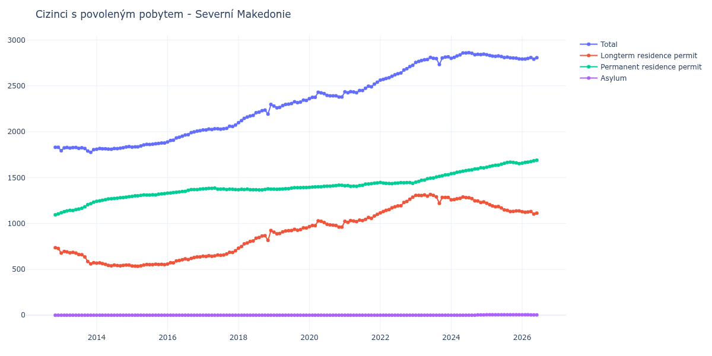

# Severní Makedonie

## Souhrnné statistiky (Min/Max pro rok) / Summary Statistics (Min/Max per year)

| Year   | Total         | Longterm Residence Permit   | Permanent Residence Permit   | Asylum   |
|--------|---------------|-----------------------------|------------------------------|----------|
| 2012   | 1 830 / 1 831 | 727 / 735                   | 1 095 / 1 104                | 0 / 0    |
| 2013   | 1 775 / 1 828 | 559 / 696                   | 1 117 / 1 232                | 0 / 0    |
| 2014   | 1 809 / 1 838 | 539 / 570                   | 1 242 / 1 292                | 0 / 0    |
| 2015   | 1 832 / 1 878 | 534 / 557                   | 1 295 / 1 326                | 0 / 0    |
| 2016   | 1 888 / 2 011 | 558 / 636                   | 1 330 / 1 375                | 0 / 0    |
| 2017   | 2 020 / 2 073 | 641 / 703                   | 1 369 / 1 385                | 0 / 0    |
| 2018   | 2 099 / 2 297 | 731 / 923                   | 1 366 / 1 377                | 0 / 0    |
| 2019   | 2 261 / 2 345 | 888 / 952                   | 1 373 / 1 393                | 0 / 0    |
| 2020   | 2 360 / 2 430 | 961 / 1 029                 | 1 394 / 1 418                | 0 / 0    |
| 2021   | 2 425 / 2 541 | 1 012 / 1 099               | 1 405 / 1 442                | 0 / 0    |
| 2022   | 2 563 / 2 725 | 1 116 / 1 287               | 1 434 / 1 447                | 0 / 0    |
| 2023   | 2 732 / 2 816 | 1 219 / 1 317               | 1 450 / 1 532                | 0 / 0    |
| 2024   | 2 801 / 2 862 | 1 229 / 1 289               | 1 543 / 1 608                | 0 / 4    |
| 2025   | 2 794 / 2 840 | 1 131 / 1 221               | 1 614 / 1 669                | 5 / 5    |
| 2026   | 2 791 / 2 809 | 1 103 / 1 130               | 1 658 / 1 690                | 4 / 5    |

## Detailní tabulka / Detailed Data Table

| Date     | Total          | Longterm Residence Permit   | Permanent Residence Permit   | Asylum      |
|----------|----------------|-----------------------------|------------------------------|-------------|
| **2012** |                |                             |                              |             |
| 11.2012  | 1 830          | 735                         | 1 095                        | 0           |
| 12.2012  | 1 831 (+0.05%) | 727 (-1.09%)                | 1 104 (+0.82%)               | 0           |
| **2013** |                |                             |                              |             |
| 01.2013  | 1 794 (-2.02%) | 677 (-6.88%)                | 1 117 (+1.18%)               | 0           |
| 02.2013  | 1 824 (+1.67%) | 696 (+2.81%)                | 1 128 (+0.98%)               | 0           |
| 03.2013  | 1 828 (+0.22%) | 691 (-0.72%)                | 1 137 (+0.80%)               | 0           |
| 04.2013  | 1 823 (-0.27%) | 680 (-1.59%)                | 1 143 (+0.53%)               | 0           |
| 05.2013  | 1 827 (+0.22%) | 685 (+0.74%)                | 1 142 (-0.09%)               | 0           |
| 06.2013  | 1 828 (+0.05%) | 677 (-1.17%)                | 1 151 (+0.79%)               | 0           |
| 07.2013  | 1 819 (-0.49%) | 662 (-2.22%)                | 1 157 (+0.52%)               | 0           |
| 08.2013  | 1 825 (+0.33%) | 659 (-0.45%)                | 1 166 (+0.78%)               | 0           |
| 09.2013  | 1 818 (-0.38%) | 636 (-3.49%)                | 1 182 (+1.37%)               | 0           |
| 10.2013  | 1 790 (-1.54%) | 586 (-7.86%)                | 1 204 (+1.86%)               | 0           |
| 11.2013  | 1 775 (-0.84%) | 559 (-4.61%)                | 1 216 (+1.00%)               | 0           |
| 12.2013  | 1 804 (+1.63%) | 572 (+2.33%)                | 1 232 (+1.32%)               | 0           |
| **2014** |                |                             |                              |             |
| 01.2014  | 1 809 (+0.28%) | 567 (-0.87%)                | 1 242 (+0.81%)               | 0           |
| 02.2014  | 1 817 (+0.44%) | 570 (+0.53%)                | 1 247 (+0.40%)               | 0           |
| 03.2014  | 1 815 (-0.11%) | 562 (-1.40%)                | 1 253 (+0.48%)               | 0           |
| 04.2014  | 1 815 (+0.00%) | 555 (-1.25%)                | 1 260 (+0.56%)               | 0           |
| 05.2014  | 1 811 (-0.22%) | 544 (-1.98%)                | 1 267 (+0.56%)               | 0           |
| 06.2014  | 1 809 (-0.11%) | 539 (-0.92%)                | 1 270 (+0.24%)               | 0           |
| 07.2014  | 1 818 (+0.50%) | 546 (+1.30%)                | 1 272 (+0.16%)               | 0           |
| 08.2014  | 1 816 (-0.11%) | 541 (-0.92%)                | 1 275 (+0.24%)               | 0           |
| 09.2014  | 1 820 (+0.22%) | 539 (-0.37%)                | 1 281 (+0.47%)               | 0           |
| 10.2014  | 1 825 (+0.27%) | 543 (+0.74%)                | 1 282 (+0.08%)               | 0           |
| 11.2014  | 1 834 (+0.49%) | 547 (+0.74%)                | 1 287 (+0.39%)               | 0           |
| 12.2014  | 1 838 (+0.22%) | 546 (-0.18%)                | 1 292 (+0.39%)               | 0           |
| **2015** |                |                             |                              |             |
| 01.2015  | 1 832 (-0.33%) | 537 (-1.65%)                | 1 295 (+0.23%)               | 0           |
| 02.2015  | 1 836 (+0.22%) | 535 (-0.37%)                | 1 301 (+0.46%)               | 0           |
| 03.2015  | 1 835 (-0.05%) | 534 (-0.19%)                | 1 301 (+0.00%)               | 0           |
| 04.2015  | 1 845 (+0.54%) | 539 (+0.94%)                | 1 306 (+0.38%)               | 0           |
| 05.2015  | 1 857 (+0.65%) | 546 (+1.30%)                | 1 311 (+0.38%)               | 0           |
| 06.2015  | 1 863 (+0.32%) | 553 (+1.28%)                | 1 310 (-0.08%)               | 0           |
| 07.2015  | 1 861 (-0.11%) | 551 (-0.36%)                | 1 310 (+0.00%)               | 0           |
| 08.2015  | 1 864 (+0.16%) | 551 (+0.00%)                | 1 313 (+0.23%)               | 0           |
| 09.2015  | 1 869 (+0.27%) | 557 (+1.09%)                | 1 312 (-0.08%)               | 0           |
| 10.2015  | 1 872 (+0.16%) | 553 (-0.72%)                | 1 319 (+0.53%)               | 0           |
| 11.2015  | 1 877 (+0.27%) | 554 (+0.18%)                | 1 323 (+0.30%)               | 0           |
| 12.2015  | 1 878 (+0.05%) | 552 (-0.36%)                | 1 326 (+0.23%)               | 0           |
| **2016** |                |                             |                              |             |
| 01.2016  | 1 888 (+0.53%) | 558 (+1.09%)                | 1 330 (+0.30%)               | 0           |
| 02.2016  | 1 905 (+0.90%) | 572 (+2.51%)                | 1 333 (+0.23%)               | 0           |
| 03.2016  | 1 908 (+0.16%) | 570 (-0.35%)                | 1 338 (+0.38%)               | 0           |
| 04.2016  | 1 933 (+1.31%) | 592 (+3.86%)                | 1 341 (+0.22%)               | 0           |
| 05.2016  | 1 941 (+0.41%) | 597 (+0.84%)                | 1 344 (+0.22%)               | 0           |
| 06.2016  | 1 952 (+0.57%) | 604 (+1.17%)                | 1 348 (+0.30%)               | 0           |
| 07.2016  | 1 964 (+0.61%) | 614 (+1.66%)                | 1 350 (+0.15%)               | 0           |
| 08.2016  | 1 968 (+0.20%) | 606 (-1.30%)                | 1 362 (+0.89%)               | 0           |
| 09.2016  | 1 990 (+1.12%) | 620 (+2.31%)                | 1 370 (+0.59%)               | 0           |
| 10.2016  | 1 998 (+0.40%) | 629 (+1.45%)                | 1 369 (-0.07%)               | 0           |
| 11.2016  | 2 006 (+0.40%) | 636 (+1.11%)                | 1 370 (+0.07%)               | 0           |
| 12.2016  | 2 011 (+0.25%) | 636 (+0.00%)                | 1 375 (+0.36%)               | 0           |
| **2017** |                |                             |                              |             |
| 01.2017  | 2 020 (+0.45%) | 643 (+1.10%)                | 1 377 (+0.15%)               | 0           |
| 02.2017  | 2 020 (+0.00%) | 641 (-0.31%)                | 1 379 (+0.15%)               | 0           |
| 03.2017  | 2 030 (+0.50%) | 648 (+1.09%)                | 1 382 (+0.22%)               | 0           |
| 04.2017  | 2 025 (-0.25%) | 642 (-0.93%)                | 1 383 (+0.07%)               | 0           |
| 05.2017  | 2 032 (+0.35%) | 647 (+0.78%)                | 1 385 (+0.14%)               | 0           |
| 06.2017  | 2 032 (+0.00%) | 657 (+1.55%)                | 1 375 (-0.72%)               | 0           |
| 07.2017  | 2 028 (-0.20%) | 654 (-0.46%)                | 1 374 (-0.07%)               | 0           |
| 08.2017  | 2 032 (+0.20%) | 656 (+0.31%)                | 1 376 (+0.15%)               | 0           |
| 09.2017  | 2 037 (+0.25%) | 668 (+1.83%)                | 1 369 (-0.51%)               | 0           |
| 10.2017  | 2 060 (+1.13%) | 685 (+2.54%)                | 1 375 (+0.44%)               | 0           |
| 11.2017  | 2 056 (-0.19%) | 684 (-0.15%)                | 1 372 (-0.22%)               | 0           |
| 12.2017  | 2 073 (+0.83%) | 703 (+2.78%)                | 1 370 (-0.15%)               | 0           |
| **2018** |                |                             |                              |             |
| 01.2018  | 2 099 (+1.25%) | 731 (+3.98%)                | 1 368 (-0.15%)               | 0           |
| 02.2018  | 2 121 (+1.05%) | 749 (+2.46%)                | 1 372 (+0.29%)               | 0           |
| 03.2018  | 2 146 (+1.18%) | 777 (+3.74%)                | 1 369 (-0.22%)               | 0           |
| 04.2018  | 2 161 (+0.70%) | 787 (+1.29%)                | 1 374 (+0.37%)               | 0           |
| 05.2018  | 2 171 (+0.46%) | 803 (+2.03%)                | 1 368 (-0.44%)               | 0           |
| 06.2018  | 2 178 (+0.32%) | 810 (+0.87%)                | 1 368 (+0.00%)               | 0           |
| 07.2018  | 2 207 (+1.33%) | 839 (+3.58%)                | 1 368 (+0.00%)               | 0           |
| 08.2018  | 2 213 (+0.27%) | 847 (+0.95%)                | 1 366 (-0.15%)               | 0           |
| 09.2018  | 2 230 (+0.77%) | 864 (+2.01%)                | 1 366 (+0.00%)               | 0           |
| 10.2018  | 2 237 (+0.31%) | 866 (+0.23%)                | 1 371 (+0.37%)               | 0           |
| 11.2018  | 2 193 (-1.97%) | 816 (-5.77%)                | 1 377 (+0.44%)               | 0           |
| 12.2018  | 2 297 (+4.74%) | 923 (+13.11%)               | 1 374 (-0.22%)               | 0           |
| **2019** |                |                             |                              |             |
| 01.2019  | 2 280 (-0.74%) | 905 (-1.95%)                | 1 375 (+0.07%)               | 0           |
| 02.2019  | 2 261 (-0.83%) | 888 (-1.88%)                | 1 373 (-0.15%)               | 0           |
| 03.2019  | 2 266 (+0.22%) | 891 (+0.34%)                | 1 375 (+0.15%)               | 0           |
| 04.2019  | 2 284 (+0.79%) | 908 (+1.91%)                | 1 376 (+0.07%)               | 0           |
| 05.2019  | 2 298 (+0.61%) | 919 (+1.21%)                | 1 379 (+0.22%)               | 0           |
| 06.2019  | 2 301 (+0.13%) | 922 (+0.33%)                | 1 379 (+0.00%)               | 0           |
| 07.2019  | 2 308 (+0.30%) | 923 (+0.11%)                | 1 385 (+0.44%)               | 0           |
| 08.2019  | 2 327 (+0.82%) | 936 (+1.41%)                | 1 391 (+0.43%)               | 0           |
| 09.2019  | 2 317 (-0.43%) | 926 (-1.07%)                | 1 391 (+0.00%)               | 0           |
| 10.2019  | 2 323 (+0.26%) | 933 (+0.76%)                | 1 390 (-0.07%)               | 0           |
| 11.2019  | 2 345 (+0.95%) | 952 (+2.04%)                | 1 393 (+0.22%)               | 0           |
| 12.2019  | 2 342 (-0.13%) | 950 (-0.21%)                | 1 392 (-0.07%)               | 0           |
| **2020** |                |                             |                              |             |
| 01.2020  | 2 360 (+0.77%) | 966 (+1.68%)                | 1 394 (+0.14%)               | 0           |
| 02.2020  | 2 375 (+0.64%) | 978 (+1.24%)                | 1 397 (+0.22%)               | 0           |
| 03.2020  | 2 376 (+0.04%) | 977 (-0.10%)                | 1 399 (+0.14%)               | 0           |
| 04.2020  | 2 430 (+2.27%) | 1 029 (+5.32%)              | 1 401 (+0.14%)               | 0           |
| 05.2020  | 2 424 (-0.25%) | 1 023 (-0.58%)              | 1 401 (+0.00%)               | 0           |
| 06.2020  | 2 416 (-0.33%) | 1 011 (-1.17%)              | 1 405 (+0.29%)               | 0           |
| 07.2020  | 2 397 (-0.79%) | 991 (-1.98%)                | 1 406 (+0.07%)               | 0           |
| 08.2020  | 2 392 (-0.21%) | 985 (-0.61%)                | 1 407 (+0.07%)               | 0           |
| 09.2020  | 2 391 (-0.04%) | 981 (-0.41%)                | 1 410 (+0.21%)               | 0           |
| 10.2020  | 2 392 (+0.04%) | 978 (-0.31%)                | 1 414 (+0.28%)               | 0           |
| 11.2020  | 2 379 (-0.54%) | 961 (-1.74%)                | 1 418 (+0.28%)               | 0           |
| 12.2020  | 2 378 (-0.04%) | 961 (+0.00%)                | 1 417 (-0.07%)               | 0           |
| **2021** |                |                             |                              |             |
| 01.2021  | 2 435 (+2.40%) | 1 023 (+6.45%)              | 1 412 (-0.35%)               | 0           |
| 02.2021  | 2 425 (-0.41%) | 1 012 (-1.08%)              | 1 413 (+0.07%)               | 0           |
| 03.2021  | 2 436 (+0.45%) | 1 031 (+1.88%)              | 1 405 (-0.57%)               | 0           |
| 04.2021  | 2 433 (-0.12%) | 1 027 (-0.39%)              | 1 406 (+0.07%)               | 0           |
| 05.2021  | 2 426 (-0.29%) | 1 021 (-0.58%)              | 1 405 (-0.07%)               | 0           |
| 06.2021  | 2 449 (+0.95%) | 1 036 (+1.47%)              | 1 413 (+0.57%)               | 0           |
| 07.2021  | 2 449 (+0.00%) | 1 032 (-0.39%)              | 1 417 (+0.28%)               | 0           |
| 08.2021  | 2 474 (+1.02%) | 1 044 (+1.16%)              | 1 430 (+0.92%)               | 0           |
| 09.2021  | 2 496 (+0.89%) | 1 065 (+2.01%)              | 1 431 (+0.07%)               | 0           |
| 10.2021  | 2 490 (-0.24%) | 1 056 (-0.85%)              | 1 434 (+0.21%)               | 0           |
| 11.2021  | 2 520 (+1.20%) | 1 081 (+2.37%)              | 1 439 (+0.35%)               | 0           |
| 12.2021  | 2 541 (+0.83%) | 1 099 (+1.67%)              | 1 442 (+0.21%)               | 0           |
| **2022** |                |                             |                              |             |
| 01.2022  | 2 563 (+0.87%) | 1 116 (+1.55%)              | 1 447 (+0.35%)               | 0           |
| 02.2022  | 2 571 (+0.31%) | 1 130 (+1.25%)              | 1 441 (-0.41%)               | 0           |
| 03.2022  | 2 580 (+0.35%) | 1 143 (+1.15%)              | 1 437 (-0.28%)               | 0           |
| 04.2022  | 2 588 (+0.31%) | 1 152 (+0.79%)              | 1 436 (-0.07%)               | 0           |
| 05.2022  | 2 605 (+0.66%) | 1 171 (+1.65%)              | 1 434 (-0.14%)               | 0           |
| 06.2022  | 2 621 (+0.61%) | 1 182 (+0.94%)              | 1 439 (+0.35%)               | 0           |
| 07.2022  | 2 632 (+0.42%) | 1 191 (+0.76%)              | 1 441 (+0.14%)               | 0           |
| 08.2022  | 2 640 (+0.30%) | 1 194 (+0.25%)              | 1 446 (+0.35%)               | 0           |
| 09.2022  | 2 673 (+1.25%) | 1 229 (+2.93%)              | 1 444 (-0.14%)               | 0           |
| 10.2022  | 2 687 (+0.52%) | 1 241 (+0.98%)              | 1 446 (+0.14%)               | 0           |
| 11.2022  | 2 710 (+0.86%) | 1 265 (+1.93%)              | 1 445 (-0.07%)               | 0           |
| 12.2022  | 2 725 (+0.55%) | 1 287 (+1.74%)              | 1 438 (-0.48%)               | 0           |
| **2023** |                |                             |                              |             |
| 01.2023  | 2 756 (+1.14%) | 1 306 (+1.48%)              | 1 450 (+0.83%)               | 0           |
| 02.2023  | 2 766 (+0.36%) | 1 307 (+0.08%)              | 1 459 (+0.62%)               | 0           |
| 03.2023  | 2 777 (+0.40%) | 1 305 (-0.15%)              | 1 472 (+0.89%)               | 0           |
| 04.2023  | 2 784 (+0.25%) | 1 311 (+0.46%)              | 1 473 (+0.07%)               | 0           |
| 05.2023  | 2 787 (+0.11%) | 1 299 (-0.92%)              | 1 488 (+1.02%)               | 0           |
| 06.2023  | 2 811 (+0.86%) | 1 317 (+1.39%)              | 1 494 (+0.40%)               | 0           |
| 07.2023  | 2 801 (-0.36%) | 1 306 (-0.84%)              | 1 495 (+0.07%)               | 0           |
| 08.2023  | 2 798 (-0.11%) | 1 291 (-1.15%)              | 1 507 (+0.80%)               | 0           |
| 09.2023  | 2 732 (-2.36%) | 1 219 (-5.58%)              | 1 513 (+0.40%)               | 0           |
| 10.2023  | 2 804 (+2.64%) | 1 284 (+5.33%)              | 1 520 (+0.46%)               | 0           |
| 11.2023  | 2 813 (+0.32%) | 1 284 (+0.00%)              | 1 529 (+0.59%)               | 0           |
| 12.2023  | 2 816 (+0.11%) | 1 284 (+0.00%)              | 1 532 (+0.20%)               | 0           |
| **2024** |                |                             |                              |             |
| 01.2024  | 2 801 (-0.53%) | 1 258 (-2.02%)              | 1 543 (+0.72%)               | 0           |
| 02.2024  | 2 810 (+0.32%) | 1 262 (+0.32%)              | 1 548 (+0.32%)               | 0           |
| 03.2024  | 2 827 (+0.60%) | 1 269 (+0.55%)              | 1 558 (+0.65%)               | 0           |
| 04.2024  | 2 837 (+0.35%) | 1 274 (+0.39%)              | 1 563 (+0.32%)               | 0           |
| 05.2024  | 2 859 (+0.78%) | 1 289 (+1.18%)              | 1 570 (+0.45%)               | 0           |
| 06.2024  | 2 858 (-0.03%) | 1 282 (-0.54%)              | 1 576 (+0.38%)               | 0           |
| 07.2024  | 2 862 (+0.14%) | 1 280 (-0.16%)              | 1 582 (+0.38%)               | 0           |
| 08.2024  | 2 855 (-0.24%) | 1 271 (-0.70%)              | 1 584 (+0.13%)               | 0           |
| 09.2024  | 2 840 (-0.53%) | 1 246 (-1.97%)              | 1 594 (+0.63%)               | 0           |
| 10.2024  | 2 845 (+0.18%) | 1 245 (-0.08%)              | 1 596 (+0.13%)               | 4           |
| 11.2024  | 2 841 (-0.14%) | 1 229 (-1.29%)              | 1 608 (+0.75%)               | 4 (+0.00%)  |
| 12.2024  | 2 846 (+0.18%) | 1 236 (+0.57%)              | 1 606 (-0.12%)               | 4 (+0.00%)  |
| **2025** |                |                             |                              |             |
| 01.2025  | 2 840 (-0.21%) | 1 221 (-1.21%)              | 1 614 (+0.50%)               | 5 (+25.00%) |
| 02.2025  | 2 831 (-0.32%) | 1 205 (-1.31%)              | 1 621 (+0.43%)               | 5 (+0.00%)  |
| 03.2025  | 2 825 (-0.21%) | 1 192 (-1.08%)              | 1 628 (+0.43%)               | 5 (+0.00%)  |
| 04.2025  | 2 822 (-0.11%) | 1 182 (-0.84%)              | 1 635 (+0.43%)               | 5 (+0.00%)  |
| 05.2025  | 2 826 (+0.14%) | 1 185 (+0.25%)              | 1 636 (+0.06%)               | 5 (+0.00%)  |
| 06.2025  | 2 820 (-0.21%) | 1 169 (-1.35%)              | 1 646 (+0.61%)               | 5 (+0.00%)  |
| 07.2025  | 2 808 (-0.43%) | 1 148 (-1.80%)              | 1 655 (+0.55%)               | 5 (+0.00%)  |
| 08.2025  | 2 813 (+0.18%) | 1 143 (-0.44%)              | 1 665 (+0.60%)               | 5 (+0.00%)  |
| 09.2025  | 2 805 (-0.28%) | 1 131 (-1.05%)              | 1 669 (+0.24%)               | 5 (+0.00%)  |
| 10.2025  | 2 803 (-0.07%) | 1 132 (+0.09%)              | 1 666 (-0.18%)               | 5 (+0.00%)  |
| 11.2025  | 2 802 (-0.04%) | 1 136 (+0.35%)              | 1 661 (-0.30%)               | 5 (+0.00%)  |
| 12.2025  | 2 794 (-0.29%) | 1 136 (+0.00%)              | 1 653 (-0.48%)               | 5 (+0.00%)  |
| **2026** |                |                             |                              |             |
| 01.2026  | 2 792 (-0.07%) | 1 129 (-0.62%)              | 1 658 (+0.30%)               | 5 (+0.00%)  |
| 02.2026  | 2 792 (+0.00%) | 1 122 (-0.62%)              | 1 665 (+0.42%)               | 5 (+0.00%)  |
| 03.2026  | 2 799 (+0.25%) | 1 125 (+0.27%)              | 1 669 (+0.24%)               | 5 (+0.00%)  |
| 04.2026  | 2 809 (+0.36%) | 1 130 (+0.44%)              | 1 675 (+0.36%)               | 4 (-20.00%) |
| 05.2026  | 2 791 (-0.64%) | 1 103 (-2.39%)              | 1 684 (+0.54%)               | 4 (+0.00%)  |
| 06.2026  | 2 807 (+0.57%) | 1 113 (+0.91%)              | 1 690 (+0.36%)               | 4 (+0.00%)  |
