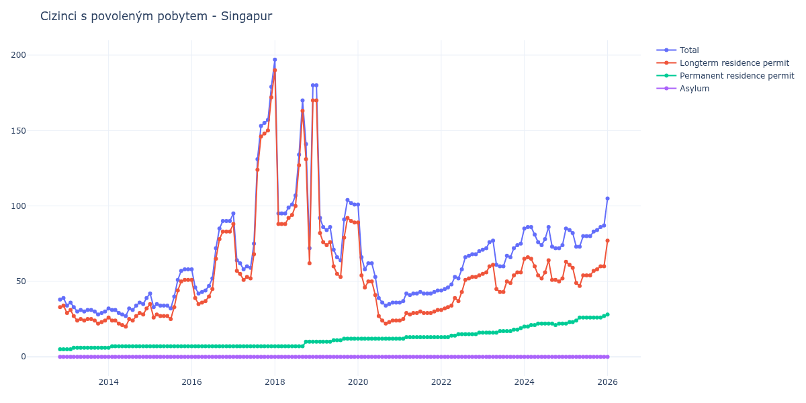

# Singapur

## Souhrnné statistiky (Min/Max pro rok) / Summary Statistics (Min/Max per year)

| Year   | Total     | Longterm Residence Permit   | Permanent Residence Permit   | Asylum   |
|--------|-----------|-----------------------------|------------------------------|----------|
| 2012   | 38 / 39   | 33 / 34                     | 5 / 5                        | 0 / 0    |
| 2013   | 28 / 36   | 22 / 31                     | 5 / 6                        | 0 / 0    |
| 2014   | 27 / 39   | 20 / 32                     | 6 / 7                        | 0 / 0    |
| 2015   | 32 / 58   | 25 / 51                     | 7 / 7                        | 0 / 0    |
| 2016   | 42 / 90   | 35 / 83                     | 7 / 7                        | 0 / 0    |
| 2017   | 58 / 179  | 51 / 172                    | 7 / 7                        | 0 / 0    |
| 2018   | 72 / 197  | 62 / 190                    | 7 / 10                       | 0 / 0    |
| 2019   | 64 / 180  | 53 / 170                    | 10 / 12                      | 0 / 0    |
| 2020   | 34 / 101  | 22 / 89                     | 12 / 12                      | 0 / 0    |
| 2021   | 36 / 44   | 24 / 31                     | 12 / 13                      | 0 / 0    |
| 2022   | 44 / 70   | 31 / 54                     | 13 / 16                      | 0 / 0    |
| 2023   | 60 / 77   | 43 / 61                     | 16 / 19                      | 0 / 0    |
| 2024   | 72 / 86   | 50 / 66                     | 20 / 22                      | 0 / 0    |
| 2025   | 73 / 87   | 47 / 63                     | 22 / 27                      | 0 / 0    |
| 2026   | 105 / 105 | 77 / 77                     | 28 / 28                      | 0 / 0    |

## Detailní tabulka / Detailed Data Table

| Date     | Total          | Longterm Residence Permit   | Permanent Residence Permit   | Asylum   |
|----------|----------------|-----------------------------|------------------------------|----------|
| **2012** |                |                             |                              |          |
| 11.2012  | 38             | 33                          | 5                            | 0        |
| 12.2012  | 39 (+2.63%)    | 34 (+3.03%)                 | 5 (+0.00%)                   | 0        |
| **2013** |                |                             |                              |          |
| 01.2013  | 34 (-12.82%)   | 29 (-14.71%)                | 5 (+0.00%)                   | 0        |
| 02.2013  | 36 (+5.88%)    | 31 (+6.90%)                 | 5 (+0.00%)                   | 0        |
| 03.2013  | 33 (-8.33%)    | 27 (-12.90%)                | 6 (+20.00%)                  | 0        |
| 04.2013  | 30 (-9.09%)    | 24 (-11.11%)                | 6 (+0.00%)                   | 0        |
| 05.2013  | 31 (+3.33%)    | 25 (+4.17%)                 | 6 (+0.00%)                   | 0        |
| 06.2013  | 30 (-3.23%)    | 24 (-4.00%)                 | 6 (+0.00%)                   | 0        |
| 07.2013  | 31 (+3.33%)    | 25 (+4.17%)                 | 6 (+0.00%)                   | 0        |
| 08.2013  | 31 (+0.00%)    | 25 (+0.00%)                 | 6 (+0.00%)                   | 0        |
| 09.2013  | 30 (-3.23%)    | 24 (-4.00%)                 | 6 (+0.00%)                   | 0        |
| 10.2013  | 28 (-6.67%)    | 22 (-8.33%)                 | 6 (+0.00%)                   | 0        |
| 11.2013  | 29 (+3.57%)    | 23 (+4.55%)                 | 6 (+0.00%)                   | 0        |
| 12.2013  | 30 (+3.45%)    | 24 (+4.35%)                 | 6 (+0.00%)                   | 0        |
| **2014** |                |                             |                              |          |
| 01.2014  | 32 (+6.67%)    | 26 (+8.33%)                 | 6 (+0.00%)                   | 0        |
| 02.2014  | 31 (-3.12%)    | 24 (-7.69%)                 | 7 (+16.67%)                  | 0        |
| 03.2014  | 31 (+0.00%)    | 24 (+0.00%)                 | 7 (+0.00%)                   | 0        |
| 04.2014  | 29 (-6.45%)    | 22 (-8.33%)                 | 7 (+0.00%)                   | 0        |
| 05.2014  | 28 (-3.45%)    | 21 (-4.55%)                 | 7 (+0.00%)                   | 0        |
| 06.2014  | 27 (-3.57%)    | 20 (-4.76%)                 | 7 (+0.00%)                   | 0        |
| 07.2014  | 32 (+18.52%)   | 25 (+25.00%)                | 7 (+0.00%)                   | 0        |
| 08.2014  | 31 (-3.12%)    | 24 (-4.00%)                 | 7 (+0.00%)                   | 0        |
| 09.2014  | 34 (+9.68%)    | 27 (+12.50%)                | 7 (+0.00%)                   | 0        |
| 10.2014  | 36 (+5.88%)    | 29 (+7.41%)                 | 7 (+0.00%)                   | 0        |
| 11.2014  | 35 (-2.78%)    | 28 (-3.45%)                 | 7 (+0.00%)                   | 0        |
| 12.2014  | 39 (+11.43%)   | 32 (+14.29%)                | 7 (+0.00%)                   | 0        |
| **2015** |                |                             |                              |          |
| 01.2015  | 42 (+7.69%)    | 35 (+9.38%)                 | 7 (+0.00%)                   | 0        |
| 02.2015  | 33 (-21.43%)   | 26 (-25.71%)                | 7 (+0.00%)                   | 0        |
| 03.2015  | 35 (+6.06%)    | 28 (+7.69%)                 | 7 (+0.00%)                   | 0        |
| 04.2015  | 34 (-2.86%)    | 27 (-3.57%)                 | 7 (+0.00%)                   | 0        |
| 05.2015  | 34 (+0.00%)    | 27 (+0.00%)                 | 7 (+0.00%)                   | 0        |
| 06.2015  | 34 (+0.00%)    | 27 (+0.00%)                 | 7 (+0.00%)                   | 0        |
| 07.2015  | 32 (-5.88%)    | 25 (-7.41%)                 | 7 (+0.00%)                   | 0        |
| 08.2015  | 40 (+25.00%)   | 33 (+32.00%)                | 7 (+0.00%)                   | 0        |
| 09.2015  | 51 (+27.50%)   | 44 (+33.33%)                | 7 (+0.00%)                   | 0        |
| 10.2015  | 57 (+11.76%)   | 50 (+13.64%)                | 7 (+0.00%)                   | 0        |
| 11.2015  | 58 (+1.75%)    | 51 (+2.00%)                 | 7 (+0.00%)                   | 0        |
| 12.2015  | 58 (+0.00%)    | 51 (+0.00%)                 | 7 (+0.00%)                   | 0        |
| **2016** |                |                             |                              |          |
| 01.2016  | 58 (+0.00%)    | 51 (+0.00%)                 | 7 (+0.00%)                   | 0        |
| 02.2016  | 46 (-20.69%)   | 39 (-23.53%)                | 7 (+0.00%)                   | 0        |
| 03.2016  | 42 (-8.70%)    | 35 (-10.26%)                | 7 (+0.00%)                   | 0        |
| 04.2016  | 43 (+2.38%)    | 36 (+2.86%)                 | 7 (+0.00%)                   | 0        |
| 05.2016  | 44 (+2.33%)    | 37 (+2.78%)                 | 7 (+0.00%)                   | 0        |
| 06.2016  | 47 (+6.82%)    | 40 (+8.11%)                 | 7 (+0.00%)                   | 0        |
| 07.2016  | 52 (+10.64%)   | 45 (+12.50%)                | 7 (+0.00%)                   | 0        |
| 08.2016  | 72 (+38.46%)   | 65 (+44.44%)                | 7 (+0.00%)                   | 0        |
| 09.2016  | 85 (+18.06%)   | 78 (+20.00%)                | 7 (+0.00%)                   | 0        |
| 10.2016  | 90 (+5.88%)    | 83 (+6.41%)                 | 7 (+0.00%)                   | 0        |
| 11.2016  | 90 (+0.00%)    | 83 (+0.00%)                 | 7 (+0.00%)                   | 0        |
| 12.2016  | 90 (+0.00%)    | 83 (+0.00%)                 | 7 (+0.00%)                   | 0        |
| **2017** |                |                             |                              |          |
| 01.2017  | 95 (+5.56%)    | 88 (+6.02%)                 | 7 (+0.00%)                   | 0        |
| 02.2017  | 64 (-32.63%)   | 57 (-35.23%)                | 7 (+0.00%)                   | 0        |
| 03.2017  | 62 (-3.12%)    | 55 (-3.51%)                 | 7 (+0.00%)                   | 0        |
| 04.2017  | 58 (-6.45%)    | 51 (-7.27%)                 | 7 (+0.00%)                   | 0        |
| 05.2017  | 60 (+3.45%)    | 53 (+3.92%)                 | 7 (+0.00%)                   | 0        |
| 06.2017  | 59 (-1.67%)    | 52 (-1.89%)                 | 7 (+0.00%)                   | 0        |
| 07.2017  | 75 (+27.12%)   | 68 (+30.77%)                | 7 (+0.00%)                   | 0        |
| 08.2017  | 131 (+74.67%)  | 124 (+82.35%)               | 7 (+0.00%)                   | 0        |
| 09.2017  | 153 (+16.79%)  | 146 (+17.74%)               | 7 (+0.00%)                   | 0        |
| 10.2017  | 155 (+1.31%)   | 148 (+1.37%)                | 7 (+0.00%)                   | 0        |
| 11.2017  | 157 (+1.29%)   | 150 (+1.35%)                | 7 (+0.00%)                   | 0        |
| 12.2017  | 179 (+14.01%)  | 172 (+14.67%)               | 7 (+0.00%)                   | 0        |
| **2018** |                |                             |                              |          |
| 01.2018  | 197 (+10.06%)  | 190 (+10.47%)               | 7 (+0.00%)                   | 0        |
| 02.2018  | 95 (-51.78%)   | 88 (-53.68%)                | 7 (+0.00%)                   | 0        |
| 03.2018  | 95 (+0.00%)    | 88 (+0.00%)                 | 7 (+0.00%)                   | 0        |
| 04.2018  | 95 (+0.00%)    | 88 (+0.00%)                 | 7 (+0.00%)                   | 0        |
| 05.2018  | 99 (+4.21%)    | 92 (+4.55%)                 | 7 (+0.00%)                   | 0        |
| 06.2018  | 101 (+2.02%)   | 94 (+2.17%)                 | 7 (+0.00%)                   | 0        |
| 07.2018  | 107 (+5.94%)   | 100 (+6.38%)                | 7 (+0.00%)                   | 0        |
| 08.2018  | 134 (+25.23%)  | 127 (+27.00%)               | 7 (+0.00%)                   | 0        |
| 09.2018  | 170 (+26.87%)  | 163 (+28.35%)               | 7 (+0.00%)                   | 0        |
| 10.2018  | 141 (-17.06%)  | 131 (-19.63%)               | 10 (+42.86%)                 | 0        |
| 11.2018  | 72 (-48.94%)   | 62 (-52.67%)                | 10 (+0.00%)                  | 0        |
| 12.2018  | 180 (+150.00%) | 170 (+174.19%)              | 10 (+0.00%)                  | 0        |
| **2019** |                |                             |                              |          |
| 01.2019  | 180 (+0.00%)   | 170 (+0.00%)                | 10 (+0.00%)                  | 0        |
| 02.2019  | 92 (-48.89%)   | 82 (-51.76%)                | 10 (+0.00%)                  | 0        |
| 03.2019  | 86 (-6.52%)    | 76 (-7.32%)                 | 10 (+0.00%)                  | 0        |
| 04.2019  | 84 (-2.33%)    | 74 (-2.63%)                 | 10 (+0.00%)                  | 0        |
| 05.2019  | 86 (+2.38%)    | 76 (+2.70%)                 | 10 (+0.00%)                  | 0        |
| 06.2019  | 71 (-17.44%)   | 60 (-21.05%)                | 11 (+10.00%)                 | 0        |
| 07.2019  | 66 (-7.04%)    | 55 (-8.33%)                 | 11 (+0.00%)                  | 0        |
| 08.2019  | 64 (-3.03%)    | 53 (-3.64%)                 | 11 (+0.00%)                  | 0        |
| 09.2019  | 91 (+42.19%)   | 79 (+49.06%)                | 12 (+9.09%)                  | 0        |
| 10.2019  | 104 (+14.29%)  | 92 (+16.46%)                | 12 (+0.00%)                  | 0        |
| 11.2019  | 102 (-1.92%)   | 90 (-2.17%)                 | 12 (+0.00%)                  | 0        |
| 12.2019  | 101 (-0.98%)   | 89 (-1.11%)                 | 12 (+0.00%)                  | 0        |
| **2020** |                |                             |                              |          |
| 01.2020  | 101 (+0.00%)   | 89 (+0.00%)                 | 12 (+0.00%)                  | 0        |
| 02.2020  | 66 (-34.65%)   | 54 (-39.33%)                | 12 (+0.00%)                  | 0        |
| 03.2020  | 58 (-12.12%)   | 46 (-14.81%)                | 12 (+0.00%)                  | 0        |
| 04.2020  | 62 (+6.90%)    | 50 (+8.70%)                 | 12 (+0.00%)                  | 0        |
| 05.2020  | 62 (+0.00%)    | 50 (+0.00%)                 | 12 (+0.00%)                  | 0        |
| 06.2020  | 53 (-14.52%)   | 41 (-18.00%)                | 12 (+0.00%)                  | 0        |
| 07.2020  | 39 (-26.42%)   | 27 (-34.15%)                | 12 (+0.00%)                  | 0        |
| 08.2020  | 36 (-7.69%)    | 24 (-11.11%)                | 12 (+0.00%)                  | 0        |
| 09.2020  | 34 (-5.56%)    | 22 (-8.33%)                 | 12 (+0.00%)                  | 0        |
| 10.2020  | 35 (+2.94%)    | 23 (+4.55%)                 | 12 (+0.00%)                  | 0        |
| 11.2020  | 36 (+2.86%)    | 24 (+4.35%)                 | 12 (+0.00%)                  | 0        |
| 12.2020  | 36 (+0.00%)    | 24 (+0.00%)                 | 12 (+0.00%)                  | 0        |
| **2021** |                |                             |                              |          |
| 01.2021  | 36 (+0.00%)    | 24 (+0.00%)                 | 12 (+0.00%)                  | 0        |
| 02.2021  | 37 (+2.78%)    | 25 (+4.17%)                 | 12 (+0.00%)                  | 0        |
| 03.2021  | 42 (+13.51%)   | 29 (+16.00%)                | 13 (+8.33%)                  | 0        |
| 04.2021  | 41 (-2.38%)    | 28 (-3.45%)                 | 13 (+0.00%)                  | 0        |
| 05.2021  | 42 (+2.44%)    | 29 (+3.57%)                 | 13 (+0.00%)                  | 0        |
| 06.2021  | 42 (+0.00%)    | 29 (+0.00%)                 | 13 (+0.00%)                  | 0        |
| 07.2021  | 43 (+2.38%)    | 30 (+3.45%)                 | 13 (+0.00%)                  | 0        |
| 08.2021  | 42 (-2.33%)    | 29 (-3.33%)                 | 13 (+0.00%)                  | 0        |
| 09.2021  | 42 (+0.00%)    | 29 (+0.00%)                 | 13 (+0.00%)                  | 0        |
| 10.2021  | 42 (+0.00%)    | 29 (+0.00%)                 | 13 (+0.00%)                  | 0        |
| 11.2021  | 43 (+2.38%)    | 30 (+3.45%)                 | 13 (+0.00%)                  | 0        |
| 12.2021  | 44 (+2.33%)    | 31 (+3.33%)                 | 13 (+0.00%)                  | 0        |
| **2022** |                |                             |                              |          |
| 01.2022  | 44 (+0.00%)    | 31 (+0.00%)                 | 13 (+0.00%)                  | 0        |
| 02.2022  | 45 (+2.27%)    | 32 (+3.23%)                 | 13 (+0.00%)                  | 0        |
| 03.2022  | 46 (+2.22%)    | 33 (+3.12%)                 | 13 (+0.00%)                  | 0        |
| 04.2022  | 48 (+4.35%)    | 34 (+3.03%)                 | 14 (+7.69%)                  | 0        |
| 05.2022  | 53 (+10.42%)   | 39 (+14.71%)                | 14 (+0.00%)                  | 0        |
| 06.2022  | 52 (-1.89%)    | 37 (-5.13%)                 | 15 (+7.14%)                  | 0        |
| 07.2022  | 58 (+11.54%)   | 43 (+16.22%)                | 15 (+0.00%)                  | 0        |
| 08.2022  | 66 (+13.79%)   | 51 (+18.60%)                | 15 (+0.00%)                  | 0        |
| 09.2022  | 67 (+1.52%)    | 52 (+1.96%)                 | 15 (+0.00%)                  | 0        |
| 10.2022  | 68 (+1.49%)    | 53 (+1.92%)                 | 15 (+0.00%)                  | 0        |
| 11.2022  | 68 (+0.00%)    | 53 (+0.00%)                 | 15 (+0.00%)                  | 0        |
| 12.2022  | 70 (+2.94%)    | 54 (+1.89%)                 | 16 (+6.67%)                  | 0        |
| **2023** |                |                             |                              |          |
| 01.2023  | 71 (+1.43%)    | 55 (+1.85%)                 | 16 (+0.00%)                  | 0        |
| 02.2023  | 72 (+1.41%)    | 56 (+1.82%)                 | 16 (+0.00%)                  | 0        |
| 03.2023  | 76 (+5.56%)    | 60 (+7.14%)                 | 16 (+0.00%)                  | 0        |
| 04.2023  | 77 (+1.32%)    | 61 (+1.67%)                 | 16 (+0.00%)                  | 0        |
| 05.2023  | 61 (-20.78%)   | 45 (-26.23%)                | 16 (+0.00%)                  | 0        |
| 06.2023  | 60 (-1.64%)    | 43 (-4.44%)                 | 17 (+6.25%)                  | 0        |
| 07.2023  | 60 (+0.00%)    | 43 (+0.00%)                 | 17 (+0.00%)                  | 0        |
| 08.2023  | 67 (+11.67%)   | 50 (+16.28%)                | 17 (+0.00%)                  | 0        |
| 09.2023  | 66 (-1.49%)    | 49 (-2.00%)                 | 17 (+0.00%)                  | 0        |
| 10.2023  | 72 (+9.09%)    | 54 (+10.20%)                | 18 (+5.88%)                  | 0        |
| 11.2023  | 74 (+2.78%)    | 56 (+3.70%)                 | 18 (+0.00%)                  | 0        |
| 12.2023  | 75 (+1.35%)    | 56 (+0.00%)                 | 19 (+5.56%)                  | 0        |
| **2024** |                |                             |                              |          |
| 01.2024  | 85 (+13.33%)   | 65 (+16.07%)                | 20 (+5.26%)                  | 0        |
| 02.2024  | 86 (+1.18%)    | 66 (+1.54%)                 | 20 (+0.00%)                  | 0        |
| 03.2024  | 86 (+0.00%)    | 65 (-1.52%)                 | 21 (+5.00%)                  | 0        |
| 04.2024  | 81 (-5.81%)    | 60 (-7.69%)                 | 21 (+0.00%)                  | 0        |
| 05.2024  | 76 (-6.17%)    | 54 (-10.00%)                | 22 (+4.76%)                  | 0        |
| 06.2024  | 74 (-2.63%)    | 52 (-3.70%)                 | 22 (+0.00%)                  | 0        |
| 07.2024  | 78 (+5.41%)    | 56 (+7.69%)                 | 22 (+0.00%)                  | 0        |
| 08.2024  | 86 (+10.26%)   | 64 (+14.29%)                | 22 (+0.00%)                  | 0        |
| 09.2024  | 73 (-15.12%)   | 51 (-20.31%)                | 22 (+0.00%)                  | 0        |
| 10.2024  | 72 (-1.37%)    | 51 (+0.00%)                 | 21 (-4.55%)                  | 0        |
| 11.2024  | 72 (+0.00%)    | 50 (-1.96%)                 | 22 (+4.76%)                  | 0        |
| 12.2024  | 74 (+2.78%)    | 52 (+4.00%)                 | 22 (+0.00%)                  | 0        |
| **2025** |                |                             |                              |          |
| 01.2025  | 85 (+14.86%)   | 63 (+21.15%)                | 22 (+0.00%)                  | 0        |
| 02.2025  | 84 (-1.18%)    | 61 (-3.17%)                 | 23 (+4.55%)                  | 0        |
| 03.2025  | 82 (-2.38%)    | 59 (-3.28%)                 | 23 (+0.00%)                  | 0        |
| 04.2025  | 73 (-10.98%)   | 49 (-16.95%)                | 24 (+4.35%)                  | 0        |
| 05.2025  | 73 (+0.00%)    | 47 (-4.08%)                 | 26 (+8.33%)                  | 0        |
| 06.2025  | 80 (+9.59%)    | 54 (+14.89%)                | 26 (+0.00%)                  | 0        |
| 07.2025  | 80 (+0.00%)    | 54 (+0.00%)                 | 26 (+0.00%)                  | 0        |
| 08.2025  | 80 (+0.00%)    | 54 (+0.00%)                 | 26 (+0.00%)                  | 0        |
| 09.2025  | 83 (+3.75%)    | 57 (+5.56%)                 | 26 (+0.00%)                  | 0        |
| 10.2025  | 84 (+1.20%)    | 58 (+1.75%)                 | 26 (+0.00%)                  | 0        |
| 11.2025  | 86 (+2.38%)    | 60 (+3.45%)                 | 26 (+0.00%)                  | 0        |
| 12.2025  | 87 (+1.16%)    | 60 (+0.00%)                 | 27 (+3.85%)                  | 0        |
| **2026** |                |                             |                              |          |
| 01.2026  | 105 (+20.69%)  | 77 (+28.33%)                | 28 (+3.70%)                  | 0        |
