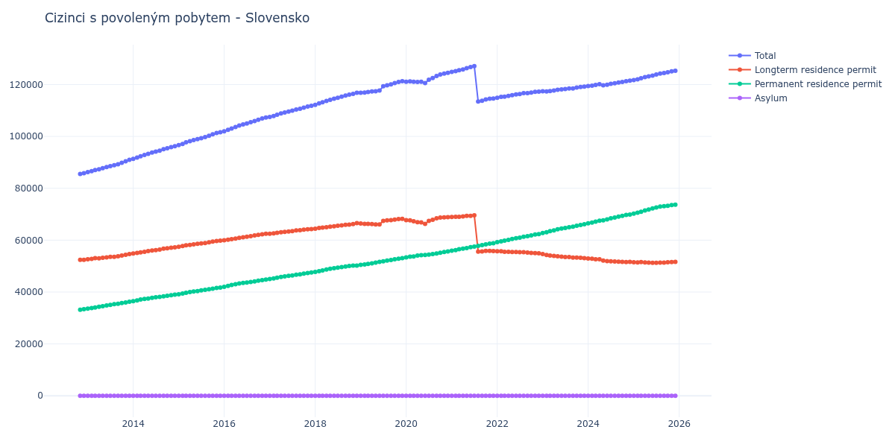

# Slovensko

## Souhrnné statistiky (Min/Max pro rok) / Summary Statistics (Min/Max per year)

| Year   | Total Min/Max     | Longterm Residence Permit Min/Max   | Permanent Residence Permit Min/Max   | Asylum Min/Max   |
|--------|-------------------|-------------------------------------|--------------------------------------|------------------|
| 2012   | 85 549 / 85 807   | 52 387 / 52 445                     | 33 162 / 33 362                      | 0 / 0            |
| 2013   | 86 209 / 90 948   | 52 610 / 54 669                     | 33 599 / 36 279                      | 0 / 0            |
| 2014   | 91 354 / 96 222   | 54 873 / 57 250                     | 36 481 / 38 972                      | 0 / 0            |
| 2015   | 96 638 / 101 589  | 57 479 / 59 850                     | 39 159 / 41 739                      | 0 / 0            |
| 2016   | 101 999 / 107 251 | 59 961 / 62 452                     | 42 038 / 44 799                      | 0 / 0            |
| 2017   | 107 502 / 111 804 | 62 486 / 64 285                     | 45 016 / 47 519                      | 0 / 0            |
| 2018   | 112 194 / 116 817 | 64 430 / 66 588                     | 47 764 / 50 229                      | 0 / 0            |
| 2019   | 116 857 / 121 278 | 66 058 / 68 233                     | 50 449 / 53 045                      | 0 / 0            |
| 2020   | 120 558 / 124 544 | 66 274 / 68 878                     | 53 339 / 55 666                      | 0 / 0            |
| 2021   | 113 439 / 127 101 | 55 612 / 69 547                     | 55 928 / 58 843                      | 0 / 0            |
| 2022   | 114 923 / 117 265 | 54 921 / 55 724                     | 59 233 / 62 344                      | 0 / 0            |
| 2023   | 117 343 / 119 182 | 53 075 / 54 616                     | 62 763 / 66 107                      | 0 / 0            |
| 2024   | 119 419 / 121 472 | 51 557 / 52 927                     | 66 492 / 69 876                      | 0 / 0            |
| 2025   | 121 699 / 125 280 | 51 238 / 51 618                     | 70 208 / 73 662                      | 0 / 0            |

## Detailní tabulka / Detailed Data Table

| Date     | Total             | Longterm Residence Permit   | Permanent Residence Permit   | Asylum   |
|----------|-------------------|-----------------------------|------------------------------|----------|
| **2012** |                   |                             |                              |          |
| 11.2012  | 85 549            | 52 387                      | 33 162                       | 0        |
| 12.2012  | 85 807 (+0.30%)   | 52 445 (+0.11%)             | 33 362 (+0.60%)              | 0        |
| **2013** |                   |                             |                              |          |
| 01.2013  | 86 209 (+0.47%)   | 52 610 (+0.31%)             | 33 599 (+0.71%)              | 0        |
| 02.2013  | 86 574 (+0.42%)   | 52 771 (+0.31%)             | 33 803 (+0.61%)              | 0        |
| 03.2013  | 87 056 (+0.56%)   | 53 032 (+0.49%)             | 34 024 (+0.65%)              | 0        |
| 04.2013  | 87 347 (+0.33%)   | 53 029 (-0.01%)             | 34 318 (+0.86%)              | 0        |
| 05.2013  | 87 756 (+0.47%)   | 53 213 (+0.35%)             | 34 543 (+0.66%)              | 0        |
| 06.2013  | 88 162 (+0.46%)   | 53 343 (+0.24%)             | 34 819 (+0.80%)              | 0        |
| 07.2013  | 88 556 (+0.45%)   | 53 534 (+0.36%)             | 35 022 (+0.58%)              | 0        |
| 08.2013  | 88 888 (+0.37%)   | 53 593 (+0.11%)             | 35 295 (+0.78%)              | 0        |
| 09.2013  | 89 273 (+0.43%)   | 53 772 (+0.33%)             | 35 501 (+0.58%)              | 0        |
| 10.2013  | 89 817 (+0.61%)   | 54 058 (+0.53%)             | 35 759 (+0.73%)              | 0        |
| 11.2013  | 90 372 (+0.62%)   | 54 387 (+0.61%)             | 35 985 (+0.63%)              | 0        |
| 12.2013  | 90 948 (+0.64%)   | 54 669 (+0.52%)             | 36 279 (+0.82%)              | 0        |
| **2014** |                   |                             |                              |          |
| 01.2014  | 91 354 (+0.45%)   | 54 873 (+0.37%)             | 36 481 (+0.56%)              | 0        |
| 02.2014  | 91 838 (+0.53%)   | 55 053 (+0.33%)             | 36 785 (+0.83%)              | 0        |
| 03.2014  | 92 367 (+0.58%)   | 55 275 (+0.40%)             | 37 092 (+0.83%)              | 0        |
| 04.2014  | 92 840 (+0.51%)   | 55 523 (+0.45%)             | 37 317 (+0.61%)              | 0        |
| 05.2014  | 93 276 (+0.47%)   | 55 780 (+0.46%)             | 37 496 (+0.48%)              | 0        |
| 06.2014  | 93 752 (+0.51%)   | 55 988 (+0.37%)             | 37 764 (+0.71%)              | 0        |
| 07.2014  | 94 174 (+0.45%)   | 56 165 (+0.32%)             | 38 009 (+0.65%)              | 0        |
| 08.2014  | 94 478 (+0.32%)   | 56 358 (+0.34%)             | 38 120 (+0.29%)              | 0        |
| 09.2014  | 95 049 (+0.60%)   | 56 703 (+0.61%)             | 38 346 (+0.59%)              | 0        |
| 10.2014  | 95 467 (+0.44%)   | 56 908 (+0.36%)             | 38 559 (+0.56%)              | 0        |
| 11.2014  | 95 896 (+0.45%)   | 57 109 (+0.35%)             | 38 787 (+0.59%)              | 0        |
| 12.2014  | 96 222 (+0.34%)   | 57 250 (+0.25%)             | 38 972 (+0.48%)              | 0        |
| **2015** |                   |                             |                              |          |
| 01.2015  | 96 638 (+0.43%)   | 57 479 (+0.40%)             | 39 159 (+0.48%)              | 0        |
| 02.2015  | 97 108 (+0.49%)   | 57 701 (+0.39%)             | 39 407 (+0.63%)              | 0        |
| 03.2015  | 97 703 (+0.61%)   | 58 028 (+0.57%)             | 39 675 (+0.68%)              | 0        |
| 04.2015  | 98 164 (+0.47%)   | 58 161 (+0.23%)             | 40 003 (+0.83%)              | 0        |
| 05.2015  | 98 598 (+0.44%)   | 58 403 (+0.42%)             | 40 195 (+0.48%)              | 0        |
| 06.2015  | 98 969 (+0.38%)   | 58 581 (+0.30%)             | 40 388 (+0.48%)              | 0        |
| 07.2015  | 99 338 (+0.37%)   | 58 716 (+0.23%)             | 40 622 (+0.58%)              | 0        |
| 08.2015  | 99 743 (+0.41%)   | 58 902 (+0.32%)             | 40 841 (+0.54%)              | 0        |
| 09.2015  | 100 241 (+0.50%)  | 59 165 (+0.45%)             | 41 076 (+0.58%)              | 0        |
| 10.2015  | 100 790 (+0.55%)  | 59 491 (+0.55%)             | 41 299 (+0.54%)              | 0        |
| 11.2015  | 101 286 (+0.49%)  | 59 707 (+0.36%)             | 41 579 (+0.68%)              | 0        |
| 12.2015  | 101 589 (+0.30%)  | 59 850 (+0.24%)             | 41 739 (+0.38%)              | 0        |
| **2016** |                   |                             |                              |          |
| 01.2016  | 101 999 (+0.40%)  | 59 961 (+0.19%)             | 42 038 (+0.72%)              | 0        |
| 02.2016  | 102 538 (+0.53%)  | 60 198 (+0.40%)             | 42 340 (+0.72%)              | 0        |
| 03.2016  | 103 072 (+0.52%)  | 60 356 (+0.26%)             | 42 716 (+0.89%)              | 0        |
| 04.2016  | 103 621 (+0.53%)  | 60 606 (+0.41%)             | 43 015 (+0.70%)              | 0        |
| 05.2016  | 104 194 (+0.55%)  | 60 863 (+0.42%)             | 43 331 (+0.73%)              | 0        |
| 06.2016  | 104 627 (+0.42%)  | 61 087 (+0.37%)             | 43 540 (+0.48%)              | 0        |
| 07.2016  | 104 994 (+0.35%)  | 61 301 (+0.35%)             | 43 693 (+0.35%)              | 0        |
| 08.2016  | 105 462 (+0.45%)  | 61 574 (+0.45%)             | 43 888 (+0.45%)              | 0        |
| 09.2016  | 105 905 (+0.42%)  | 61 821 (+0.40%)             | 44 084 (+0.45%)              | 0        |
| 10.2016  | 106 436 (+0.50%)  | 62 062 (+0.39%)             | 44 374 (+0.66%)              | 0        |
| 11.2016  | 106 897 (+0.43%)  | 62 275 (+0.34%)             | 44 622 (+0.56%)              | 0        |
| 12.2016  | 107 251 (+0.33%)  | 62 452 (+0.28%)             | 44 799 (+0.40%)              | 0        |
| **2017** |                   |                             |                              |          |
| 01.2017  | 107 502 (+0.23%)  | 62 486 (+0.05%)             | 45 016 (+0.48%)              | 0        |
| 02.2017  | 107 865 (+0.34%)  | 62 594 (+0.17%)             | 45 271 (+0.57%)              | 0        |
| 03.2017  | 108 371 (+0.47%)  | 62 813 (+0.35%)             | 45 558 (+0.63%)              | 0        |
| 04.2017  | 108 881 (+0.47%)  | 63 083 (+0.43%)             | 45 798 (+0.53%)              | 0        |
| 05.2017  | 109 190 (+0.28%)  | 63 163 (+0.13%)             | 46 027 (+0.50%)              | 0        |
| 06.2017  | 109 610 (+0.38%)  | 63 350 (+0.30%)             | 46 260 (+0.51%)              | 0        |
| 07.2017  | 109 914 (+0.28%)  | 63 501 (+0.24%)             | 46 413 (+0.33%)              | 0        |
| 08.2017  | 110 398 (+0.44%)  | 63 745 (+0.38%)             | 46 653 (+0.52%)              | 0        |
| 09.2017  | 110 672 (+0.25%)  | 63 854 (+0.17%)             | 46 818 (+0.35%)              | 0        |
| 10.2017  | 111 100 (+0.39%)  | 64 020 (+0.26%)             | 47 080 (+0.56%)              | 0        |
| 11.2017  | 111 533 (+0.39%)  | 64 215 (+0.30%)             | 47 318 (+0.51%)              | 0        |
| 12.2017  | 111 804 (+0.24%)  | 64 285 (+0.11%)             | 47 519 (+0.42%)              | 0        |
| **2018** |                   |                             |                              |          |
| 01.2018  | 112 194 (+0.35%)  | 64 430 (+0.23%)             | 47 764 (+0.52%)              | 0        |
| 02.2018  | 112 768 (+0.51%)  | 64 718 (+0.45%)             | 48 050 (+0.60%)              | 0        |
| 03.2018  | 113 177 (+0.36%)  | 64 855 (+0.21%)             | 48 322 (+0.57%)              | 0        |
| 04.2018  | 113 659 (+0.43%)  | 64 973 (+0.18%)             | 48 686 (+0.75%)              | 0        |
| 05.2018  | 114 137 (+0.42%)  | 65 182 (+0.32%)             | 48 955 (+0.55%)              | 0        |
| 06.2018  | 114 569 (+0.38%)  | 65 351 (+0.26%)             | 49 218 (+0.54%)              | 0        |
| 07.2018  | 114 914 (+0.30%)  | 65 529 (+0.27%)             | 49 385 (+0.34%)              | 0        |
| 08.2018  | 115 321 (+0.35%)  | 65 732 (+0.31%)             | 49 589 (+0.41%)              | 0        |
| 09.2018  | 115 790 (+0.41%)  | 65 942 (+0.32%)             | 49 848 (+0.52%)              | 0        |
| 10.2018  | 116 080 (+0.25%)  | 66 009 (+0.10%)             | 50 071 (+0.45%)              | 0        |
| 11.2018  | 116 403 (+0.28%)  | 66 208 (+0.30%)             | 50 195 (+0.25%)              | 0        |
| 12.2018  | 116 817 (+0.36%)  | 66 588 (+0.57%)             | 50 229 (+0.07%)              | 0        |
| **2019** |                   |                             |                              |          |
| 01.2019  | 116 857 (+0.03%)  | 66 408 (-0.27%)             | 50 449 (+0.44%)              | 0        |
| 02.2019  | 116 919 (+0.05%)  | 66 302 (-0.16%)             | 50 617 (+0.33%)              | 0        |
| 03.2019  | 117 118 (+0.17%)  | 66 281 (-0.03%)             | 50 837 (+0.43%)              | 0        |
| 04.2019  | 117 315 (+0.17%)  | 66 228 (-0.08%)             | 51 087 (+0.49%)              | 0        |
| 05.2019  | 117 418 (+0.09%)  | 66 061 (-0.25%)             | 51 357 (+0.53%)              | 0        |
| 06.2019  | 117 659 (+0.21%)  | 66 058 (-0.00%)             | 51 601 (+0.48%)              | 0        |
| 07.2019  | 119 310 (+1.40%)  | 67 432 (+2.08%)             | 51 878 (+0.54%)              | 0        |
| 08.2019  | 119 726 (+0.35%)  | 67 628 (+0.29%)             | 52 098 (+0.42%)              | 0        |
| 09.2019  | 120 098 (+0.31%)  | 67 725 (+0.14%)             | 52 373 (+0.53%)              | 0        |
| 10.2019  | 120 564 (+0.39%)  | 67 951 (+0.33%)             | 52 613 (+0.46%)              | 0        |
| 11.2019  | 121 005 (+0.37%)  | 68 168 (+0.32%)             | 52 837 (+0.43%)              | 0        |
| 12.2019  | 121 278 (+0.23%)  | 68 233 (+0.10%)             | 53 045 (+0.39%)              | 0        |
| **2020** |                   |                             |                              |          |
| 01.2020  | 121 048 (-0.19%)  | 67 709 (-0.77%)             | 53 339 (+0.55%)              | 0        |
| 02.2020  | 121 240 (+0.16%)  | 67 628 (-0.12%)             | 53 612 (+0.51%)              | 0        |
| 03.2020  | 121 036 (-0.17%)  | 67 291 (-0.50%)             | 53 745 (+0.25%)              | 0        |
| 04.2020  | 121 018 (-0.01%)  | 66 959 (-0.49%)             | 54 059 (+0.58%)              | 0        |
| 05.2020  | 121 061 (+0.04%)  | 66 821 (-0.21%)             | 54 240 (+0.33%)              | 0        |
| 06.2020  | 120 558 (-0.42%)  | 66 274 (-0.82%)             | 54 284 (+0.08%)              | 0        |
| 07.2020  | 121 876 (+1.09%)  | 67 418 (+1.73%)             | 54 458 (+0.32%)              | 0        |
| 08.2020  | 122 503 (+0.51%)  | 67 855 (+0.65%)             | 54 648 (+0.35%)              | 0        |
| 09.2020  | 123 266 (+0.62%)  | 68 428 (+0.84%)             | 54 838 (+0.35%)              | 0        |
| 10.2020  | 123 849 (+0.47%)  | 68 735 (+0.45%)             | 55 114 (+0.50%)              | 0        |
| 11.2020  | 124 216 (+0.30%)  | 68 780 (+0.07%)             | 55 436 (+0.58%)              | 0        |
| 12.2020  | 124 544 (+0.26%)  | 68 878 (+0.14%)             | 55 666 (+0.41%)              | 0        |
| **2021** |                   |                             |                              |          |
| 01.2021  | 124 858 (+0.25%)  | 68 930 (+0.08%)             | 55 928 (+0.47%)              | 0        |
| 02.2021  | 125 181 (+0.26%)  | 69 000 (+0.10%)             | 56 181 (+0.45%)              | 0        |
| 03.2021  | 125 527 (+0.28%)  | 69 022 (+0.03%)             | 56 505 (+0.58%)              | 0        |
| 04.2021  | 125 832 (+0.24%)  | 69 128 (+0.15%)             | 56 704 (+0.35%)              | 0        |
| 05.2021  | 126 331 (+0.40%)  | 69 366 (+0.34%)             | 56 965 (+0.46%)              | 0        |
| 06.2021  | 126 720 (+0.31%)  | 69 387 (+0.03%)             | 57 333 (+0.65%)              | 0        |
| 07.2021  | 127 101 (+0.30%)  | 69 547 (+0.23%)             | 57 554 (+0.39%)              | 0        |
| 08.2021  | 113 439 (-10.75%) | 55 612 (-20.04%)            | 57 827 (+0.47%)              | 0        |
| 09.2021  | 113 760 (+0.28%)  | 55 669 (+0.10%)             | 58 091 (+0.46%)              | 0        |
| 10.2021  | 114 228 (+0.41%)  | 55 871 (+0.36%)             | 58 357 (+0.46%)              | 0        |
| 11.2021  | 114 538 (+0.27%)  | 55 888 (+0.03%)             | 58 650 (+0.50%)              | 0        |
| 12.2021  | 114 630 (+0.08%)  | 55 787 (-0.18%)             | 58 843 (+0.33%)              | 0        |
| **2022** |                   |                             |                              |          |
| 01.2022  | 114 923 (+0.26%)  | 55 690 (-0.17%)             | 59 233 (+0.66%)              | 0        |
| 02.2022  | 115 244 (+0.28%)  | 55 724 (+0.06%)             | 59 520 (+0.48%)              | 0        |
| 03.2022  | 115 327 (+0.07%)  | 55 522 (-0.36%)             | 59 805 (+0.48%)              | 0        |
| 04.2022  | 115 579 (+0.22%)  | 55 488 (-0.06%)             | 60 091 (+0.48%)              | 0        |
| 05.2022  | 115 925 (+0.30%)  | 55 467 (-0.04%)             | 60 458 (+0.61%)              | 0        |
| 06.2022  | 116 173 (+0.21%)  | 55 418 (-0.09%)             | 60 755 (+0.49%)              | 0        |
| 07.2022  | 116 354 (+0.16%)  | 55 366 (-0.09%)             | 60 988 (+0.38%)              | 0        |
| 08.2022  | 116 657 (+0.26%)  | 55 349 (-0.03%)             | 61 308 (+0.52%)              | 0        |
| 09.2022  | 116 716 (+0.05%)  | 55 185 (-0.30%)             | 61 531 (+0.36%)              | 0        |
| 10.2022  | 116 913 (+0.17%)  | 55 051 (-0.24%)             | 61 862 (+0.54%)              | 0        |
| 11.2022  | 117 156 (+0.21%)  | 55 004 (-0.09%)             | 62 152 (+0.47%)              | 0        |
| 12.2022  | 117 265 (+0.09%)  | 54 921 (-0.15%)             | 62 344 (+0.31%)              | 0        |
| **2023** |                   |                             |                              |          |
| 01.2023  | 117 379 (+0.10%)  | 54 616 (-0.56%)             | 62 763 (+0.67%)              | 0        |
| 02.2023  | 117 343 (-0.03%)  | 54 306 (-0.57%)             | 63 037 (+0.44%)              | 0        |
| 03.2023  | 117 492 (+0.13%)  | 54 047 (-0.48%)             | 63 445 (+0.65%)              | 0        |
| 04.2023  | 117 678 (+0.16%)  | 53 904 (-0.26%)             | 63 774 (+0.52%)              | 0        |
| 05.2023  | 117 972 (+0.25%)  | 53 797 (-0.20%)             | 64 175 (+0.63%)              | 0        |
| 06.2023  | 118 130 (+0.13%)  | 53 675 (-0.23%)             | 64 455 (+0.44%)              | 0        |
| 07.2023  | 118 245 (+0.10%)  | 53 531 (-0.27%)             | 64 714 (+0.40%)              | 0        |
| 08.2023  | 118 498 (+0.21%)  | 53 492 (-0.07%)             | 65 006 (+0.45%)              | 0        |
| 09.2023  | 118 485 (-0.01%)  | 53 258 (-0.44%)             | 65 227 (+0.34%)              | 0        |
| 10.2023  | 118 819 (+0.28%)  | 53 281 (+0.04%)             | 65 538 (+0.48%)              | 0        |
| 11.2023  | 119 062 (+0.20%)  | 53 214 (-0.13%)             | 65 848 (+0.47%)              | 0        |
| 12.2023  | 119 182 (+0.10%)  | 53 075 (-0.26%)             | 66 107 (+0.39%)              | 0        |
| **2024** |                   |                             |                              |          |
| 01.2024  | 119 419 (+0.20%)  | 52 927 (-0.28%)             | 66 492 (+0.58%)              | 0        |
| 02.2024  | 119 584 (+0.14%)  | 52 820 (-0.20%)             | 66 764 (+0.41%)              | 0        |
| 03.2024  | 119 816 (+0.19%)  | 52 664 (-0.30%)             | 67 152 (+0.58%)              | 0        |
| 04.2024  | 120 124 (+0.26%)  | 52 600 (-0.12%)             | 67 524 (+0.55%)              | 0        |
| 05.2024  | 119 739 (-0.32%)  | 52 101 (-0.95%)             | 67 638 (+0.17%)              | 0        |
| 06.2024  | 119 920 (+0.15%)  | 51 939 (-0.31%)             | 67 981 (+0.51%)              | 0        |
| 07.2024  | 120 267 (+0.29%)  | 51 838 (-0.19%)             | 68 429 (+0.66%)              | 0        |
| 08.2024  | 120 478 (+0.18%)  | 51 788 (-0.10%)             | 68 690 (+0.38%)              | 0        |
| 09.2024  | 120 747 (+0.22%)  | 51 697 (-0.18%)             | 69 050 (+0.52%)              | 0        |
| 10.2024  | 121 020 (+0.23%)  | 51 662 (-0.07%)             | 69 358 (+0.45%)              | 0        |
| 11.2024  | 121 284 (+0.22%)  | 51 557 (-0.20%)             | 69 727 (+0.53%)              | 0        |
| 12.2024  | 121 472 (+0.16%)  | 51 596 (+0.08%)             | 69 876 (+0.21%)              | 0        |
| **2025** |                   |                             |                              |          |
| 01.2025  | 121 699 (+0.19%)  | 51 491 (-0.20%)             | 70 208 (+0.48%)              | 0        |
| 02.2025  | 122 030 (+0.27%)  | 51 448 (-0.08%)             | 70 582 (+0.53%)              | 0        |
| 03.2025  | 122 455 (+0.35%)  | 51 543 (+0.18%)             | 70 912 (+0.47%)              | 0        |
| 04.2025  | 122 869 (+0.34%)  | 51 446 (-0.19%)             | 71 423 (+0.72%)              | 0        |
| 05.2025  | 123 163 (+0.24%)  | 51 340 (-0.21%)             | 71 823 (+0.56%)              | 0        |
| 06.2025  | 123 457 (+0.24%)  | 51 238 (-0.20%)             | 72 219 (+0.55%)              | 0        |
| 07.2025  | 123 881 (+0.34%)  | 51 263 (+0.05%)             | 72 618 (+0.55%)              | 0        |
| 08.2025  | 124 245 (+0.29%)  | 51 309 (+0.09%)             | 72 936 (+0.44%)              | 0        |
| 09.2025  | 124 470 (+0.18%)  | 51 372 (+0.12%)             | 73 098 (+0.22%)              | 0        |
| 10.2025  | 124 723 (+0.20%)  | 51 479 (+0.21%)             | 73 244 (+0.20%)              | 0        |
| 11.2025  | 125 061 (+0.27%)  | 51 526 (+0.09%)             | 73 535 (+0.40%)              | 0        |
| 12.2025  | 125 280 (+0.18%)  | 51 618 (+0.18%)             | 73 662 (+0.17%)              | 0        |
