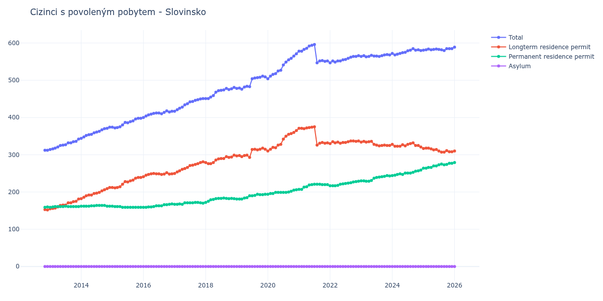

# Slovinsko

## Souhrnné statistiky (Min/Max pro rok) / Summary Statistics (Min/Max per year)

| Year   | Total     | Longterm Residence Permit   | Permanent Residence Permit   | Asylum   |
|--------|-----------|-----------------------------|------------------------------|----------|
| 2012   | 312 / 312 | 152 / 153                   | 159 / 160                    | 0 / 0    |
| 2013   | 314 / 342 | 155 / 181                   | 159 / 162                    | 0 / 0    |
| 2014   | 344 / 374 | 182 / 212                   | 162 / 164                    | 0 / 0    |
| 2015   | 372 / 398 | 211 / 239                   | 159 / 162                    | 0 / 0    |
| 2016   | 400 / 418 | 241 / 252                   | 159 / 168                    | 0 / 0    |
| 2017   | 417 / 451 | 250 / 281                   | 167 / 172                    | 0 / 0    |
| 2018   | 451 / 481 | 276 / 299                   | 172 / 184                    | 0 / 0    |
| 2019   | 476 / 511 | 293 / 318                   | 181 / 194                    | 0 / 0    |
| 2020   | 504 / 571 | 310 / 365                   | 194 / 206                    | 0 / 0    |
| 2021   | 547 / 596 | 326 / 375                   | 207 / 221                    | 0 / 0    |
| 2022   | 547 / 566 | 330 / 337                   | 217 / 229                    | 0 / 0    |
| 2023   | 563 / 569 | 324 / 336                   | 229 / 244                    | 0 / 0    |
| 2024   | 568 / 585 | 321 / 332                   | 244 / 259                    | 0 / 0    |
| 2025   | 580 / 585 | 307 / 318                   | 264 / 277                    | 0 / 0    |
| 2026   | 589 / 589 | 310 / 310                   | 279 / 279                    | 0 / 0    |

## Detailní tabulka / Detailed Data Table

| Date     | Total        | Longterm Residence Permit   | Permanent Residence Permit   | Asylum   |
|----------|--------------|-----------------------------|------------------------------|----------|
| **2012** |              |                             |                              |          |
| 11.2012  | 312          | 153                         | 159                          | 0        |
| 12.2012  | 312 (+0.00%) | 152 (-0.65%)                | 160 (+0.63%)                 | 0        |
| **2013** |              |                             |                              |          |
| 01.2013  | 314 (+0.64%) | 155 (+1.97%)                | 159 (-0.62%)                 | 0        |
| 02.2013  | 316 (+0.64%) | 156 (+0.65%)                | 160 (+0.63%)                 | 0        |
| 03.2013  | 318 (+0.63%) | 157 (+0.64%)                | 161 (+0.63%)                 | 0        |
| 04.2013  | 321 (+0.94%) | 160 (+1.91%)                | 161 (+0.00%)                 | 0        |
| 05.2013  | 325 (+1.25%) | 164 (+2.50%)                | 161 (+0.00%)                 | 0        |
| 06.2013  | 326 (+0.31%) | 165 (+0.61%)                | 161 (+0.00%)                 | 0        |
| 07.2013  | 327 (+0.31%) | 165 (+0.00%)                | 162 (+0.62%)                 | 0        |
| 08.2013  | 332 (+1.53%) | 171 (+3.64%)                | 161 (-0.62%)                 | 0        |
| 09.2013  | 332 (+0.00%) | 171 (+0.00%)                | 161 (+0.00%)                 | 0        |
| 10.2013  | 335 (+0.90%) | 174 (+1.75%)                | 161 (+0.00%)                 | 0        |
| 11.2013  | 336 (+0.30%) | 175 (+0.57%)                | 161 (+0.00%)                 | 0        |
| 12.2013  | 342 (+1.79%) | 181 (+3.43%)                | 161 (+0.00%)                 | 0        |
| **2014** |              |                             |                              |          |
| 01.2014  | 344 (+0.58%) | 182 (+0.55%)                | 162 (+0.62%)                 | 0        |
| 02.2014  | 348 (+1.16%) | 186 (+2.20%)                | 162 (+0.00%)                 | 0        |
| 03.2014  | 352 (+1.15%) | 190 (+2.15%)                | 162 (+0.00%)                 | 0        |
| 04.2014  | 354 (+0.57%) | 192 (+1.05%)                | 162 (+0.00%)                 | 0        |
| 05.2014  | 355 (+0.28%) | 192 (+0.00%)                | 163 (+0.62%)                 | 0        |
| 06.2014  | 359 (+1.13%) | 196 (+2.08%)                | 163 (+0.00%)                 | 0        |
| 07.2014  | 361 (+0.56%) | 197 (+0.51%)                | 164 (+0.61%)                 | 0        |
| 08.2014  | 363 (+0.55%) | 199 (+1.02%)                | 164 (+0.00%)                 | 0        |
| 09.2014  | 367 (+1.10%) | 203 (+2.01%)                | 164 (+0.00%)                 | 0        |
| 10.2014  | 370 (+0.82%) | 206 (+1.48%)                | 164 (+0.00%)                 | 0        |
| 11.2014  | 371 (+0.27%) | 209 (+1.46%)                | 162 (-1.22%)                 | 0        |
| 12.2014  | 374 (+0.81%) | 212 (+1.44%)                | 162 (+0.00%)                 | 0        |
| **2015** |              |                             |                              |          |
| 01.2015  | 374 (+0.00%) | 212 (+0.00%)                | 162 (+0.00%)                 | 0        |
| 02.2015  | 372 (-0.53%) | 211 (-0.47%)                | 161 (-0.62%)                 | 0        |
| 03.2015  | 373 (+0.27%) | 212 (+0.47%)                | 161 (+0.00%)                 | 0        |
| 04.2015  | 375 (+0.54%) | 214 (+0.94%)                | 161 (+0.00%)                 | 0        |
| 05.2015  | 380 (+1.33%) | 221 (+3.27%)                | 159 (-1.24%)                 | 0        |
| 06.2015  | 387 (+1.84%) | 228 (+3.17%)                | 159 (+0.00%)                 | 0        |
| 07.2015  | 386 (-0.26%) | 227 (-0.44%)                | 159 (+0.00%)                 | 0        |
| 08.2015  | 389 (+0.78%) | 230 (+1.32%)                | 159 (+0.00%)                 | 0        |
| 09.2015  | 391 (+0.51%) | 232 (+0.87%)                | 159 (+0.00%)                 | 0        |
| 10.2015  | 396 (+1.28%) | 237 (+2.16%)                | 159 (+0.00%)                 | 0        |
| 11.2015  | 398 (+0.51%) | 239 (+0.84%)                | 159 (+0.00%)                 | 0        |
| 12.2015  | 398 (+0.00%) | 239 (+0.00%)                | 159 (+0.00%)                 | 0        |
| **2016** |              |                             |                              |          |
| 01.2016  | 400 (+0.50%) | 241 (+0.84%)                | 159 (+0.00%)                 | 0        |
| 02.2016  | 404 (+1.00%) | 245 (+1.66%)                | 159 (+0.00%)                 | 0        |
| 03.2016  | 407 (+0.74%) | 247 (+0.82%)                | 160 (+0.63%)                 | 0        |
| 04.2016  | 409 (+0.49%) | 249 (+0.81%)                | 160 (+0.00%)                 | 0        |
| 05.2016  | 411 (+0.49%) | 250 (+0.40%)                | 161 (+0.63%)                 | 0        |
| 06.2016  | 412 (+0.24%) | 249 (-0.40%)                | 163 (+1.24%)                 | 0        |
| 07.2016  | 412 (+0.00%) | 249 (+0.00%)                | 163 (+0.00%)                 | 0        |
| 08.2016  | 410 (-0.49%) | 247 (-0.80%)                | 163 (+0.00%)                 | 0        |
| 09.2016  | 414 (+0.98%) | 248 (+0.40%)                | 166 (+1.84%)                 | 0        |
| 10.2016  | 418 (+0.97%) | 252 (+1.61%)                | 166 (+0.00%)                 | 0        |
| 11.2016  | 415 (-0.72%) | 248 (-1.59%)                | 167 (+0.60%)                 | 0        |
| 12.2016  | 417 (+0.48%) | 249 (+0.40%)                | 168 (+0.60%)                 | 0        |
| **2017** |              |                             |                              |          |
| 01.2017  | 417 (+0.00%) | 250 (+0.40%)                | 167 (-0.60%)                 | 0        |
| 02.2017  | 421 (+0.96%) | 254 (+1.60%)                | 167 (+0.00%)                 | 0        |
| 03.2017  | 425 (+0.95%) | 257 (+1.18%)                | 168 (+0.60%)                 | 0        |
| 04.2017  | 428 (+0.71%) | 261 (+1.56%)                | 167 (-0.60%)                 | 0        |
| 05.2017  | 434 (+1.40%) | 263 (+0.77%)                | 171 (+2.40%)                 | 0        |
| 06.2017  | 437 (+0.69%) | 266 (+1.14%)                | 171 (+0.00%)                 | 0        |
| 07.2017  | 442 (+1.14%) | 271 (+1.88%)                | 171 (+0.00%)                 | 0        |
| 08.2017  | 443 (+0.23%) | 272 (+0.37%)                | 171 (+0.00%)                 | 0        |
| 09.2017  | 446 (+0.68%) | 274 (+0.74%)                | 172 (+0.58%)                 | 0        |
| 10.2017  | 448 (+0.45%) | 276 (+0.73%)                | 172 (+0.00%)                 | 0        |
| 11.2017  | 450 (+0.45%) | 279 (+1.09%)                | 171 (-0.58%)                 | 0        |
| 12.2017  | 451 (+0.22%) | 281 (+0.72%)                | 170 (-0.58%)                 | 0        |
| **2018** |              |                             |                              |          |
| 01.2018  | 451 (+0.00%) | 279 (-0.71%)                | 172 (+1.18%)                 | 0        |
| 02.2018  | 451 (+0.00%) | 276 (-1.08%)                | 175 (+1.74%)                 | 0        |
| 03.2018  | 455 (+0.89%) | 276 (+0.00%)                | 179 (+2.29%)                 | 0        |
| 04.2018  | 459 (+0.88%) | 279 (+1.09%)                | 180 (+0.56%)                 | 0        |
| 05.2018  | 468 (+1.96%) | 286 (+2.51%)                | 182 (+1.11%)                 | 0        |
| 06.2018  | 472 (+0.85%) | 289 (+1.05%)                | 183 (+0.55%)                 | 0        |
| 07.2018  | 473 (+0.21%) | 290 (+0.35%)                | 183 (+0.00%)                 | 0        |
| 08.2018  | 474 (+0.21%) | 290 (+0.00%)                | 184 (+0.55%)                 | 0        |
| 09.2018  | 478 (+0.84%) | 295 (+1.72%)                | 183 (-0.54%)                 | 0        |
| 10.2018  | 475 (-0.63%) | 293 (-0.68%)                | 182 (-0.55%)                 | 0        |
| 11.2018  | 477 (+0.42%) | 294 (+0.34%)                | 183 (+0.55%)                 | 0        |
| 12.2018  | 481 (+0.84%) | 299 (+1.70%)                | 182 (-0.55%)                 | 0        |
| **2019** |              |                             |                              |          |
| 01.2019  | 478 (-0.62%) | 297 (-0.67%)                | 181 (-0.55%)                 | 0        |
| 02.2019  | 479 (+0.21%) | 298 (+0.34%)                | 181 (+0.00%)                 | 0        |
| 03.2019  | 476 (-0.63%) | 295 (-1.01%)                | 181 (+0.00%)                 | 0        |
| 04.2019  | 482 (+1.26%) | 298 (+1.02%)                | 184 (+1.66%)                 | 0        |
| 05.2019  | 484 (+0.41%) | 299 (+0.34%)                | 185 (+0.54%)                 | 0        |
| 06.2019  | 483 (-0.21%) | 293 (-2.01%)                | 190 (+2.70%)                 | 0        |
| 07.2019  | 504 (+4.35%) | 314 (+7.17%)                | 190 (+0.00%)                 | 0        |
| 08.2019  | 506 (+0.40%) | 315 (+0.32%)                | 191 (+0.53%)                 | 0        |
| 09.2019  | 507 (+0.20%) | 313 (-0.63%)                | 194 (+1.57%)                 | 0        |
| 10.2019  | 508 (+0.20%) | 315 (+0.64%)                | 193 (-0.52%)                 | 0        |
| 11.2019  | 511 (+0.59%) | 318 (+0.95%)                | 193 (+0.00%)                 | 0        |
| 12.2019  | 509 (-0.39%) | 315 (-0.94%)                | 194 (+0.52%)                 | 0        |
| **2020** |              |                             |                              |          |
| 01.2020  | 504 (-0.98%) | 310 (-1.59%)                | 194 (+0.00%)                 | 0        |
| 02.2020  | 511 (+1.39%) | 315 (+1.61%)                | 196 (+1.03%)                 | 0        |
| 03.2020  | 516 (+0.98%) | 320 (+1.59%)                | 196 (+0.00%)                 | 0        |
| 04.2020  | 518 (+0.39%) | 319 (-0.31%)                | 199 (+1.53%)                 | 0        |
| 05.2020  | 525 (+1.35%) | 326 (+2.19%)                | 199 (+0.00%)                 | 0        |
| 06.2020  | 527 (+0.38%) | 328 (+0.61%)                | 199 (+0.00%)                 | 0        |
| 07.2020  | 541 (+2.66%) | 342 (+4.27%)                | 199 (+0.00%)                 | 0        |
| 08.2020  | 549 (+1.48%) | 350 (+2.34%)                | 199 (+0.00%)                 | 0        |
| 09.2020  | 555 (+1.09%) | 355 (+1.43%)                | 200 (+0.50%)                 | 0        |
| 10.2020  | 559 (+0.72%) | 357 (+0.56%)                | 202 (+1.00%)                 | 0        |
| 11.2020  | 565 (+1.07%) | 360 (+0.84%)                | 205 (+1.49%)                 | 0        |
| 12.2020  | 571 (+1.06%) | 365 (+1.39%)                | 206 (+0.49%)                 | 0        |
| **2021** |              |                             |                              |          |
| 01.2021  | 578 (+1.23%) | 371 (+1.64%)                | 207 (+0.49%)                 | 0        |
| 02.2021  | 578 (+0.00%) | 371 (+0.00%)                | 207 (+0.00%)                 | 0        |
| 03.2021  | 583 (+0.87%) | 370 (-0.27%)                | 213 (+2.90%)                 | 0        |
| 04.2021  | 586 (+0.51%) | 372 (+0.54%)                | 214 (+0.47%)                 | 0        |
| 05.2021  | 592 (+1.02%) | 373 (+0.27%)                | 219 (+2.34%)                 | 0        |
| 06.2021  | 594 (+0.34%) | 374 (+0.27%)                | 220 (+0.46%)                 | 0        |
| 07.2021  | 596 (+0.34%) | 375 (+0.27%)                | 221 (+0.45%)                 | 0        |
| 08.2021  | 547 (-8.22%) | 326 (-13.07%)               | 221 (+0.00%)                 | 0        |
| 09.2021  | 552 (+0.91%) | 331 (+1.53%)                | 221 (+0.00%)                 | 0        |
| 10.2021  | 553 (+0.18%) | 333 (+0.60%)                | 220 (-0.45%)                 | 0        |
| 11.2021  | 551 (-0.36%) | 331 (-0.60%)                | 220 (+0.00%)                 | 0        |
| 12.2021  | 552 (+0.18%) | 332 (+0.30%)                | 220 (+0.00%)                 | 0        |
| **2022** |              |                             |                              |          |
| 01.2022  | 547 (-0.91%) | 330 (-0.60%)                | 217 (-1.36%)                 | 0        |
| 02.2022  | 552 (+0.91%) | 335 (+1.52%)                | 217 (+0.00%)                 | 0        |
| 03.2022  | 549 (-0.54%) | 332 (-0.90%)                | 217 (+0.00%)                 | 0        |
| 04.2022  | 552 (+0.55%) | 334 (+0.60%)                | 218 (+0.46%)                 | 0        |
| 05.2022  | 552 (+0.00%) | 331 (-0.90%)                | 221 (+1.38%)                 | 0        |
| 06.2022  | 555 (+0.54%) | 333 (+0.60%)                | 222 (+0.45%)                 | 0        |
| 07.2022  | 556 (+0.18%) | 333 (+0.00%)                | 223 (+0.45%)                 | 0        |
| 08.2022  | 559 (+0.54%) | 335 (+0.60%)                | 224 (+0.45%)                 | 0        |
| 09.2022  | 562 (+0.54%) | 337 (+0.60%)                | 225 (+0.45%)                 | 0        |
| 10.2022  | 564 (+0.36%) | 337 (+0.00%)                | 227 (+0.89%)                 | 0        |
| 11.2022  | 564 (+0.00%) | 336 (-0.30%)                | 228 (+0.44%)                 | 0        |
| 12.2022  | 566 (+0.35%) | 337 (+0.30%)                | 229 (+0.44%)                 | 0        |
| **2023** |              |                             |                              |          |
| 01.2023  | 564 (-0.35%) | 334 (-0.89%)                | 230 (+0.44%)                 | 0        |
| 02.2023  | 566 (+0.35%) | 336 (+0.60%)                | 230 (+0.00%)                 | 0        |
| 03.2023  | 563 (-0.53%) | 334 (-0.60%)                | 229 (-0.43%)                 | 0        |
| 04.2023  | 564 (+0.18%) | 335 (+0.30%)                | 229 (+0.00%)                 | 0        |
| 05.2023  | 567 (+0.53%) | 336 (+0.30%)                | 231 (+0.87%)                 | 0        |
| 06.2023  | 565 (-0.35%) | 328 (-2.38%)                | 237 (+2.60%)                 | 0        |
| 07.2023  | 565 (+0.00%) | 326 (-0.61%)                | 239 (+0.84%)                 | 0        |
| 08.2023  | 564 (-0.18%) | 324 (-0.61%)                | 240 (+0.42%)                 | 0        |
| 09.2023  | 566 (+0.35%) | 325 (+0.31%)                | 241 (+0.42%)                 | 0        |
| 10.2023  | 568 (+0.35%) | 326 (+0.31%)                | 242 (+0.41%)                 | 0        |
| 11.2023  | 569 (+0.18%) | 325 (-0.31%)                | 244 (+0.83%)                 | 0        |
| 12.2023  | 568 (-0.18%) | 325 (+0.00%)                | 243 (-0.41%)                 | 0        |
| **2024** |              |                             |                              |          |
| 01.2024  | 572 (+0.70%) | 328 (+0.92%)                | 244 (+0.41%)                 | 0        |
| 02.2024  | 568 (-0.70%) | 323 (-1.52%)                | 245 (+0.41%)                 | 0        |
| 03.2024  | 570 (+0.35%) | 323 (+0.00%)                | 247 (+0.82%)                 | 0        |
| 04.2024  | 572 (+0.35%) | 323 (+0.00%)                | 249 (+0.81%)                 | 0        |
| 05.2024  | 574 (+0.35%) | 327 (+1.24%)                | 247 (-0.80%)                 | 0        |
| 06.2024  | 575 (+0.17%) | 324 (-0.92%)                | 251 (+1.62%)                 | 0        |
| 07.2024  | 579 (+0.70%) | 328 (+1.23%)                | 251 (+0.00%)                 | 0        |
| 08.2024  | 581 (+0.35%) | 330 (+0.61%)                | 251 (+0.00%)                 | 0        |
| 09.2024  | 585 (+0.69%) | 332 (+0.61%)                | 253 (+0.80%)                 | 0        |
| 10.2024  | 581 (-0.68%) | 325 (-2.11%)                | 256 (+1.19%)                 | 0        |
| 11.2024  | 582 (+0.17%) | 325 (+0.00%)                | 257 (+0.39%)                 | 0        |
| 12.2024  | 580 (-0.34%) | 321 (-1.23%)                | 259 (+0.78%)                 | 0        |
| **2025** |              |                             |                              |          |
| 01.2025  | 581 (+0.17%) | 317 (-1.25%)                | 264 (+1.93%)                 | 0        |
| 02.2025  | 582 (+0.17%) | 318 (+0.32%)                | 264 (+0.00%)                 | 0        |
| 03.2025  | 584 (+0.34%) | 318 (+0.00%)                | 266 (+0.76%)                 | 0        |
| 04.2025  | 582 (-0.34%) | 316 (-0.63%)                | 266 (+0.00%)                 | 0        |
| 05.2025  | 583 (+0.17%) | 313 (-0.95%)                | 270 (+1.50%)                 | 0        |
| 06.2025  | 584 (+0.17%) | 314 (+0.32%)                | 270 (+0.00%)                 | 0        |
| 07.2025  | 583 (-0.17%) | 310 (-1.27%)                | 273 (+1.11%)                 | 0        |
| 08.2025  | 582 (-0.17%) | 307 (-0.97%)                | 275 (+0.73%)                 | 0        |
| 09.2025  | 580 (-0.34%) | 307 (+0.00%)                | 273 (-0.73%)                 | 0        |
| 10.2025  | 585 (+0.86%) | 311 (+1.30%)                | 274 (+0.37%)                 | 0        |
| 11.2025  | 585 (+0.00%) | 308 (-0.96%)                | 277 (+1.09%)                 | 0        |
| 12.2025  | 585 (+0.00%) | 308 (+0.00%)                | 277 (+0.00%)                 | 0        |
| **2026** |              |                             |                              |          |
| 01.2026  | 589 (+0.68%) | 310 (+0.65%)                | 279 (+0.72%)                 | 0        |
