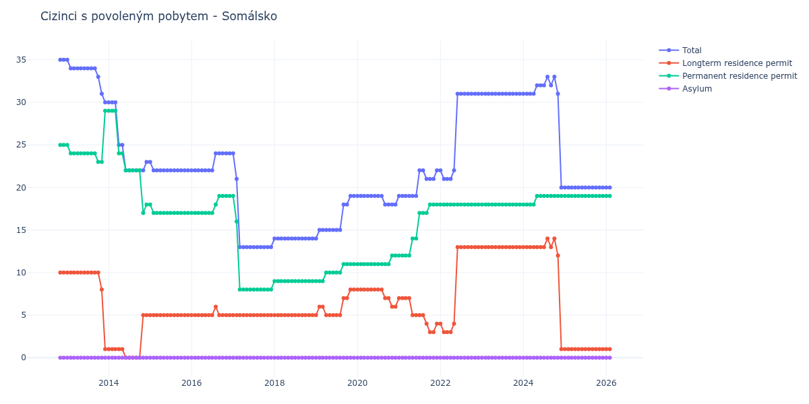

# Somálsko

## Souhrnné statistiky (Min/Max pro rok) / Summary Statistics (Min/Max per year)

| Year   | Total   | Longterm Residence Permit   | Permanent Residence Permit   | Asylum   |
|--------|---------|-----------------------------|------------------------------|----------|
| 2012   | 35 / 35 | 10 / 10                     | 25 / 25                      | 0 / 0    |
| 2013   | 30 / 35 | 1 / 10                      | 23 / 29                      | 0 / 0    |
| 2014   | 22 / 30 | 0 / 5                       | 17 / 29                      | 0 / 0    |
| 2015   | 22 / 23 | 5 / 5                       | 17 / 18                      | 0 / 0    |
| 2016   | 22 / 24 | 5 / 6                       | 17 / 19                      | 0 / 0    |
| 2017   | 13 / 24 | 5 / 5                       | 8 / 19                       | 0 / 0    |
| 2018   | 14 / 14 | 5 / 5                       | 9 / 9                        | 0 / 0    |
| 2019   | 14 / 19 | 5 / 8                       | 9 / 11                       | 0 / 0    |
| 2020   | 18 / 19 | 6 / 8                       | 11 / 12                      | 0 / 0    |
| 2021   | 19 / 22 | 3 / 7                       | 12 / 18                      | 0 / 0    |
| 2022   | 21 / 31 | 3 / 13                      | 18 / 18                      | 0 / 0    |
| 2023   | 31 / 31 | 13 / 13                     | 18 / 18                      | 0 / 0    |
| 2024   | 20 / 33 | 1 / 14                      | 18 / 19                      | 0 / 0    |
| 2025   | 20 / 20 | 1 / 1                       | 19 / 19                      | 0 / 0    |
| 2026   | 20 / 20 | 1 / 1                       | 19 / 19                      | 0 / 0    |

## Detailní tabulka / Detailed Data Table

| Date     | Total        | Longterm Residence Permit   | Permanent Residence Permit   | Asylum   |
|----------|--------------|-----------------------------|------------------------------|----------|
| **2012** |              |                             |                              |          |
| 11.2012  | 35           | 10                          | 25                           | 0        |
| 12.2012  | 35 (+0.00%)  | 10 (+0.00%)                 | 25 (+0.00%)                  | 0        |
| **2013** |              |                             |                              |          |
| 01.2013  | 35 (+0.00%)  | 10 (+0.00%)                 | 25 (+0.00%)                  | 0        |
| 02.2013  | 34 (-2.86%)  | 10 (+0.00%)                 | 24 (-4.00%)                  | 0        |
| 03.2013  | 34 (+0.00%)  | 10 (+0.00%)                 | 24 (+0.00%)                  | 0        |
| 04.2013  | 34 (+0.00%)  | 10 (+0.00%)                 | 24 (+0.00%)                  | 0        |
| 05.2013  | 34 (+0.00%)  | 10 (+0.00%)                 | 24 (+0.00%)                  | 0        |
| 06.2013  | 34 (+0.00%)  | 10 (+0.00%)                 | 24 (+0.00%)                  | 0        |
| 07.2013  | 34 (+0.00%)  | 10 (+0.00%)                 | 24 (+0.00%)                  | 0        |
| 08.2013  | 34 (+0.00%)  | 10 (+0.00%)                 | 24 (+0.00%)                  | 0        |
| 09.2013  | 34 (+0.00%)  | 10 (+0.00%)                 | 24 (+0.00%)                  | 0        |
| 10.2013  | 33 (-2.94%)  | 10 (+0.00%)                 | 23 (-4.17%)                  | 0        |
| 11.2013  | 31 (-6.06%)  | 8 (-20.00%)                 | 23 (+0.00%)                  | 0        |
| 12.2013  | 30 (-3.23%)  | 1 (-87.50%)                 | 29 (+26.09%)                 | 0        |
| **2014** |              |                             |                              |          |
| 01.2014  | 30 (+0.00%)  | 1 (+0.00%)                  | 29 (+0.00%)                  | 0        |
| 02.2014  | 30 (+0.00%)  | 1 (+0.00%)                  | 29 (+0.00%)                  | 0        |
| 03.2014  | 30 (+0.00%)  | 1 (+0.00%)                  | 29 (+0.00%)                  | 0        |
| 04.2014  | 25 (-16.67%) | 1 (+0.00%)                  | 24 (-17.24%)                 | 0        |
| 05.2014  | 25 (+0.00%)  | 1 (+0.00%)                  | 24 (+0.00%)                  | 0        |
| 06.2014  | 22 (-12.00%) | 0 (-100.00%)                | 22 (-8.33%)                  | 0        |
| 07.2014  | 22 (+0.00%)  | 0                           | 22 (+0.00%)                  | 0        |
| 08.2014  | 22 (+0.00%)  | 0                           | 22 (+0.00%)                  | 0        |
| 09.2014  | 22 (+0.00%)  | 0                           | 22 (+0.00%)                  | 0        |
| 10.2014  | 22 (+0.00%)  | 0                           | 22 (+0.00%)                  | 0        |
| 11.2014  | 22 (+0.00%)  | 5                           | 17 (-22.73%)                 | 0        |
| 12.2014  | 23 (+4.55%)  | 5 (+0.00%)                  | 18 (+5.88%)                  | 0        |
| **2015** |              |                             |                              |          |
| 01.2015  | 23 (+0.00%)  | 5 (+0.00%)                  | 18 (+0.00%)                  | 0        |
| 02.2015  | 22 (-4.35%)  | 5 (+0.00%)                  | 17 (-5.56%)                  | 0        |
| 03.2015  | 22 (+0.00%)  | 5 (+0.00%)                  | 17 (+0.00%)                  | 0        |
| 04.2015  | 22 (+0.00%)  | 5 (+0.00%)                  | 17 (+0.00%)                  | 0        |
| 05.2015  | 22 (+0.00%)  | 5 (+0.00%)                  | 17 (+0.00%)                  | 0        |
| 06.2015  | 22 (+0.00%)  | 5 (+0.00%)                  | 17 (+0.00%)                  | 0        |
| 07.2015  | 22 (+0.00%)  | 5 (+0.00%)                  | 17 (+0.00%)                  | 0        |
| 08.2015  | 22 (+0.00%)  | 5 (+0.00%)                  | 17 (+0.00%)                  | 0        |
| 09.2015  | 22 (+0.00%)  | 5 (+0.00%)                  | 17 (+0.00%)                  | 0        |
| 10.2015  | 22 (+0.00%)  | 5 (+0.00%)                  | 17 (+0.00%)                  | 0        |
| 11.2015  | 22 (+0.00%)  | 5 (+0.00%)                  | 17 (+0.00%)                  | 0        |
| 12.2015  | 22 (+0.00%)  | 5 (+0.00%)                  | 17 (+0.00%)                  | 0        |
| **2016** |              |                             |                              |          |
| 01.2016  | 22 (+0.00%)  | 5 (+0.00%)                  | 17 (+0.00%)                  | 0        |
| 02.2016  | 22 (+0.00%)  | 5 (+0.00%)                  | 17 (+0.00%)                  | 0        |
| 03.2016  | 22 (+0.00%)  | 5 (+0.00%)                  | 17 (+0.00%)                  | 0        |
| 04.2016  | 22 (+0.00%)  | 5 (+0.00%)                  | 17 (+0.00%)                  | 0        |
| 05.2016  | 22 (+0.00%)  | 5 (+0.00%)                  | 17 (+0.00%)                  | 0        |
| 06.2016  | 22 (+0.00%)  | 5 (+0.00%)                  | 17 (+0.00%)                  | 0        |
| 07.2016  | 22 (+0.00%)  | 5 (+0.00%)                  | 17 (+0.00%)                  | 0        |
| 08.2016  | 24 (+9.09%)  | 6 (+20.00%)                 | 18 (+5.88%)                  | 0        |
| 09.2016  | 24 (+0.00%)  | 5 (-16.67%)                 | 19 (+5.56%)                  | 0        |
| 10.2016  | 24 (+0.00%)  | 5 (+0.00%)                  | 19 (+0.00%)                  | 0        |
| 11.2016  | 24 (+0.00%)  | 5 (+0.00%)                  | 19 (+0.00%)                  | 0        |
| 12.2016  | 24 (+0.00%)  | 5 (+0.00%)                  | 19 (+0.00%)                  | 0        |
| **2017** |              |                             |                              |          |
| 01.2017  | 24 (+0.00%)  | 5 (+0.00%)                  | 19 (+0.00%)                  | 0        |
| 02.2017  | 21 (-12.50%) | 5 (+0.00%)                  | 16 (-15.79%)                 | 0        |
| 03.2017  | 13 (-38.10%) | 5 (+0.00%)                  | 8 (-50.00%)                  | 0        |
| 04.2017  | 13 (+0.00%)  | 5 (+0.00%)                  | 8 (+0.00%)                   | 0        |
| 05.2017  | 13 (+0.00%)  | 5 (+0.00%)                  | 8 (+0.00%)                   | 0        |
| 06.2017  | 13 (+0.00%)  | 5 (+0.00%)                  | 8 (+0.00%)                   | 0        |
| 07.2017  | 13 (+0.00%)  | 5 (+0.00%)                  | 8 (+0.00%)                   | 0        |
| 08.2017  | 13 (+0.00%)  | 5 (+0.00%)                  | 8 (+0.00%)                   | 0        |
| 09.2017  | 13 (+0.00%)  | 5 (+0.00%)                  | 8 (+0.00%)                   | 0        |
| 10.2017  | 13 (+0.00%)  | 5 (+0.00%)                  | 8 (+0.00%)                   | 0        |
| 11.2017  | 13 (+0.00%)  | 5 (+0.00%)                  | 8 (+0.00%)                   | 0        |
| 12.2017  | 13 (+0.00%)  | 5 (+0.00%)                  | 8 (+0.00%)                   | 0        |
| **2018** |              |                             |                              |          |
| 01.2018  | 14 (+7.69%)  | 5 (+0.00%)                  | 9 (+12.50%)                  | 0        |
| 02.2018  | 14 (+0.00%)  | 5 (+0.00%)                  | 9 (+0.00%)                   | 0        |
| 03.2018  | 14 (+0.00%)  | 5 (+0.00%)                  | 9 (+0.00%)                   | 0        |
| 04.2018  | 14 (+0.00%)  | 5 (+0.00%)                  | 9 (+0.00%)                   | 0        |
| 05.2018  | 14 (+0.00%)  | 5 (+0.00%)                  | 9 (+0.00%)                   | 0        |
| 06.2018  | 14 (+0.00%)  | 5 (+0.00%)                  | 9 (+0.00%)                   | 0        |
| 07.2018  | 14 (+0.00%)  | 5 (+0.00%)                  | 9 (+0.00%)                   | 0        |
| 08.2018  | 14 (+0.00%)  | 5 (+0.00%)                  | 9 (+0.00%)                   | 0        |
| 09.2018  | 14 (+0.00%)  | 5 (+0.00%)                  | 9 (+0.00%)                   | 0        |
| 10.2018  | 14 (+0.00%)  | 5 (+0.00%)                  | 9 (+0.00%)                   | 0        |
| 11.2018  | 14 (+0.00%)  | 5 (+0.00%)                  | 9 (+0.00%)                   | 0        |
| 12.2018  | 14 (+0.00%)  | 5 (+0.00%)                  | 9 (+0.00%)                   | 0        |
| **2019** |              |                             |                              |          |
| 01.2019  | 14 (+0.00%)  | 5 (+0.00%)                  | 9 (+0.00%)                   | 0        |
| 02.2019  | 15 (+7.14%)  | 6 (+20.00%)                 | 9 (+0.00%)                   | 0        |
| 03.2019  | 15 (+0.00%)  | 6 (+0.00%)                  | 9 (+0.00%)                   | 0        |
| 04.2019  | 15 (+0.00%)  | 5 (-16.67%)                 | 10 (+11.11%)                 | 0        |
| 05.2019  | 15 (+0.00%)  | 5 (+0.00%)                  | 10 (+0.00%)                  | 0        |
| 06.2019  | 15 (+0.00%)  | 5 (+0.00%)                  | 10 (+0.00%)                  | 0        |
| 07.2019  | 15 (+0.00%)  | 5 (+0.00%)                  | 10 (+0.00%)                  | 0        |
| 08.2019  | 15 (+0.00%)  | 5 (+0.00%)                  | 10 (+0.00%)                  | 0        |
| 09.2019  | 18 (+20.00%) | 7 (+40.00%)                 | 11 (+10.00%)                 | 0        |
| 10.2019  | 18 (+0.00%)  | 7 (+0.00%)                  | 11 (+0.00%)                  | 0        |
| 11.2019  | 19 (+5.56%)  | 8 (+14.29%)                 | 11 (+0.00%)                  | 0        |
| 12.2019  | 19 (+0.00%)  | 8 (+0.00%)                  | 11 (+0.00%)                  | 0        |
| **2020** |              |                             |                              |          |
| 01.2020  | 19 (+0.00%)  | 8 (+0.00%)                  | 11 (+0.00%)                  | 0        |
| 02.2020  | 19 (+0.00%)  | 8 (+0.00%)                  | 11 (+0.00%)                  | 0        |
| 03.2020  | 19 (+0.00%)  | 8 (+0.00%)                  | 11 (+0.00%)                  | 0        |
| 04.2020  | 19 (+0.00%)  | 8 (+0.00%)                  | 11 (+0.00%)                  | 0        |
| 05.2020  | 19 (+0.00%)  | 8 (+0.00%)                  | 11 (+0.00%)                  | 0        |
| 06.2020  | 19 (+0.00%)  | 8 (+0.00%)                  | 11 (+0.00%)                  | 0        |
| 07.2020  | 19 (+0.00%)  | 8 (+0.00%)                  | 11 (+0.00%)                  | 0        |
| 08.2020  | 19 (+0.00%)  | 8 (+0.00%)                  | 11 (+0.00%)                  | 0        |
| 09.2020  | 18 (-5.26%)  | 7 (-12.50%)                 | 11 (+0.00%)                  | 0        |
| 10.2020  | 18 (+0.00%)  | 7 (+0.00%)                  | 11 (+0.00%)                  | 0        |
| 11.2020  | 18 (+0.00%)  | 6 (-14.29%)                 | 12 (+9.09%)                  | 0        |
| 12.2020  | 18 (+0.00%)  | 6 (+0.00%)                  | 12 (+0.00%)                  | 0        |
| **2021** |              |                             |                              |          |
| 01.2021  | 19 (+5.56%)  | 7 (+16.67%)                 | 12 (+0.00%)                  | 0        |
| 02.2021  | 19 (+0.00%)  | 7 (+0.00%)                  | 12 (+0.00%)                  | 0        |
| 03.2021  | 19 (+0.00%)  | 7 (+0.00%)                  | 12 (+0.00%)                  | 0        |
| 04.2021  | 19 (+0.00%)  | 7 (+0.00%)                  | 12 (+0.00%)                  | 0        |
| 05.2021  | 19 (+0.00%)  | 5 (-28.57%)                 | 14 (+16.67%)                 | 0        |
| 06.2021  | 19 (+0.00%)  | 5 (+0.00%)                  | 14 (+0.00%)                  | 0        |
| 07.2021  | 22 (+15.79%) | 5 (+0.00%)                  | 17 (+21.43%)                 | 0        |
| 08.2021  | 22 (+0.00%)  | 5 (+0.00%)                  | 17 (+0.00%)                  | 0        |
| 09.2021  | 21 (-4.55%)  | 4 (-20.00%)                 | 17 (+0.00%)                  | 0        |
| 10.2021  | 21 (+0.00%)  | 3 (-25.00%)                 | 18 (+5.88%)                  | 0        |
| 11.2021  | 21 (+0.00%)  | 3 (+0.00%)                  | 18 (+0.00%)                  | 0        |
| 12.2021  | 22 (+4.76%)  | 4 (+33.33%)                 | 18 (+0.00%)                  | 0        |
| **2022** |              |                             |                              |          |
| 01.2022  | 22 (+0.00%)  | 4 (+0.00%)                  | 18 (+0.00%)                  | 0        |
| 02.2022  | 21 (-4.55%)  | 3 (-25.00%)                 | 18 (+0.00%)                  | 0        |
| 03.2022  | 21 (+0.00%)  | 3 (+0.00%)                  | 18 (+0.00%)                  | 0        |
| 04.2022  | 21 (+0.00%)  | 3 (+0.00%)                  | 18 (+0.00%)                  | 0        |
| 05.2022  | 22 (+4.76%)  | 4 (+33.33%)                 | 18 (+0.00%)                  | 0        |
| 06.2022  | 31 (+40.91%) | 13 (+225.00%)               | 18 (+0.00%)                  | 0        |
| 07.2022  | 31 (+0.00%)  | 13 (+0.00%)                 | 18 (+0.00%)                  | 0        |
| 08.2022  | 31 (+0.00%)  | 13 (+0.00%)                 | 18 (+0.00%)                  | 0        |
| 09.2022  | 31 (+0.00%)  | 13 (+0.00%)                 | 18 (+0.00%)                  | 0        |
| 10.2022  | 31 (+0.00%)  | 13 (+0.00%)                 | 18 (+0.00%)                  | 0        |
| 11.2022  | 31 (+0.00%)  | 13 (+0.00%)                 | 18 (+0.00%)                  | 0        |
| 12.2022  | 31 (+0.00%)  | 13 (+0.00%)                 | 18 (+0.00%)                  | 0        |
| **2023** |              |                             |                              |          |
| 01.2023  | 31 (+0.00%)  | 13 (+0.00%)                 | 18 (+0.00%)                  | 0        |
| 02.2023  | 31 (+0.00%)  | 13 (+0.00%)                 | 18 (+0.00%)                  | 0        |
| 03.2023  | 31 (+0.00%)  | 13 (+0.00%)                 | 18 (+0.00%)                  | 0        |
| 04.2023  | 31 (+0.00%)  | 13 (+0.00%)                 | 18 (+0.00%)                  | 0        |
| 05.2023  | 31 (+0.00%)  | 13 (+0.00%)                 | 18 (+0.00%)                  | 0        |
| 06.2023  | 31 (+0.00%)  | 13 (+0.00%)                 | 18 (+0.00%)                  | 0        |
| 07.2023  | 31 (+0.00%)  | 13 (+0.00%)                 | 18 (+0.00%)                  | 0        |
| 08.2023  | 31 (+0.00%)  | 13 (+0.00%)                 | 18 (+0.00%)                  | 0        |
| 09.2023  | 31 (+0.00%)  | 13 (+0.00%)                 | 18 (+0.00%)                  | 0        |
| 10.2023  | 31 (+0.00%)  | 13 (+0.00%)                 | 18 (+0.00%)                  | 0        |
| 11.2023  | 31 (+0.00%)  | 13 (+0.00%)                 | 18 (+0.00%)                  | 0        |
| 12.2023  | 31 (+0.00%)  | 13 (+0.00%)                 | 18 (+0.00%)                  | 0        |
| **2024** |              |                             |                              |          |
| 01.2024  | 31 (+0.00%)  | 13 (+0.00%)                 | 18 (+0.00%)                  | 0        |
| 02.2024  | 31 (+0.00%)  | 13 (+0.00%)                 | 18 (+0.00%)                  | 0        |
| 03.2024  | 31 (+0.00%)  | 13 (+0.00%)                 | 18 (+0.00%)                  | 0        |
| 04.2024  | 31 (+0.00%)  | 13 (+0.00%)                 | 18 (+0.00%)                  | 0        |
| 05.2024  | 32 (+3.23%)  | 13 (+0.00%)                 | 19 (+5.56%)                  | 0        |
| 06.2024  | 32 (+0.00%)  | 13 (+0.00%)                 | 19 (+0.00%)                  | 0        |
| 07.2024  | 32 (+0.00%)  | 13 (+0.00%)                 | 19 (+0.00%)                  | 0        |
| 08.2024  | 33 (+3.12%)  | 14 (+7.69%)                 | 19 (+0.00%)                  | 0        |
| 09.2024  | 32 (-3.03%)  | 13 (-7.14%)                 | 19 (+0.00%)                  | 0        |
| 10.2024  | 33 (+3.12%)  | 14 (+7.69%)                 | 19 (+0.00%)                  | 0        |
| 11.2024  | 31 (-6.06%)  | 12 (-14.29%)                | 19 (+0.00%)                  | 0        |
| 12.2024  | 20 (-35.48%) | 1 (-91.67%)                 | 19 (+0.00%)                  | 0        |
| **2025** |              |                             |                              |          |
| 01.2025  | 20 (+0.00%)  | 1 (+0.00%)                  | 19 (+0.00%)                  | 0        |
| 02.2025  | 20 (+0.00%)  | 1 (+0.00%)                  | 19 (+0.00%)                  | 0        |
| 03.2025  | 20 (+0.00%)  | 1 (+0.00%)                  | 19 (+0.00%)                  | 0        |
| 04.2025  | 20 (+0.00%)  | 1 (+0.00%)                  | 19 (+0.00%)                  | 0        |
| 05.2025  | 20 (+0.00%)  | 1 (+0.00%)                  | 19 (+0.00%)                  | 0        |
| 06.2025  | 20 (+0.00%)  | 1 (+0.00%)                  | 19 (+0.00%)                  | 0        |
| 07.2025  | 20 (+0.00%)  | 1 (+0.00%)                  | 19 (+0.00%)                  | 0        |
| 08.2025  | 20 (+0.00%)  | 1 (+0.00%)                  | 19 (+0.00%)                  | 0        |
| 09.2025  | 20 (+0.00%)  | 1 (+0.00%)                  | 19 (+0.00%)                  | 0        |
| 10.2025  | 20 (+0.00%)  | 1 (+0.00%)                  | 19 (+0.00%)                  | 0        |
| 11.2025  | 20 (+0.00%)  | 1 (+0.00%)                  | 19 (+0.00%)                  | 0        |
| 12.2025  | 20 (+0.00%)  | 1 (+0.00%)                  | 19 (+0.00%)                  | 0        |
| **2026** |              |                             |                              |          |
| 01.2026  | 20 (+0.00%)  | 1 (+0.00%)                  | 19 (+0.00%)                  | 0        |
| 02.2026  | 20 (+0.00%)  | 1 (+0.00%)                  | 19 (+0.00%)                  | 0        |
