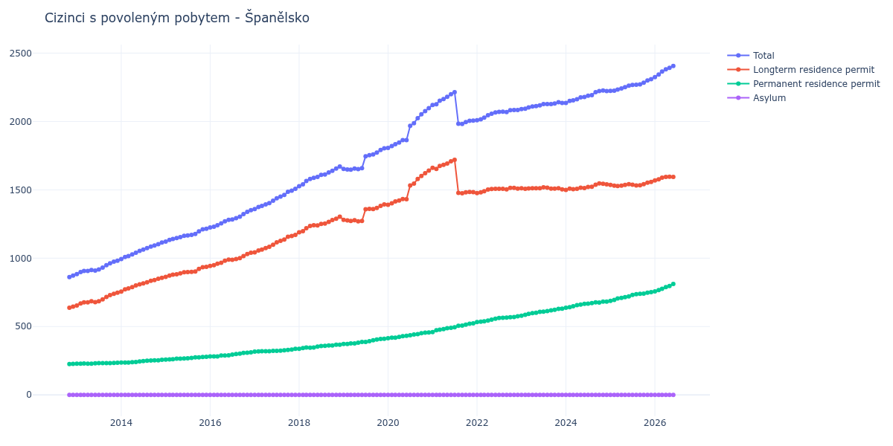

# Španělsko

## Souhrnné statistiky (Min/Max pro rok) / Summary Statistics (Min/Max per year)

| Year   | Total         | Longterm Residence Permit   | Permanent Residence Permit   | Asylum   |
|--------|---------------|-----------------------------|------------------------------|----------|
| 2012   | 862 / 873     | 637 / 646                   | 225 / 227                    | 0 / 0    |
| 2013   | 883 / 982     | 654 / 747                   | 229 / 235                    | 0 / 0    |
| 2014   | 993 / 1 114   | 756 / 857                   | 237 / 257                    | 0 / 0    |
| 2015   | 1 121 / 1 215 | 863 / 936                   | 258 / 279                    | 0 / 0    |
| 2016   | 1 225 / 1 351 | 944 / 1 040                 | 281 / 311                    | 0 / 0    |
| 2017   | 1 360 / 1 507 | 1 043 / 1 170               | 317 / 337                    | 0 / 0    |
| 2018   | 1 526 / 1 670 | 1 189 / 1 303               | 337 / 367                    | 0 / 0    |
| 2019   | 1 648 / 1 804 | 1 269 / 1 393               | 372 / 411                    | 0 / 0    |
| 2020   | 1 806 / 2 098 | 1 391 / 1 641               | 415 / 457                    | 0 / 0    |
| 2021   | 1 982 / 2 215 | 1 475 / 1 720               | 460 / 523                    | 0 / 0    |
| 2022   | 2 009 / 2 084 | 1 476 / 1 514               | 533 / 575                    | 0 / 0    |
| 2023   | 2 090 / 2 141 | 1 504 / 1 518               | 579 / 631                    | 0 / 0    |
| 2024   | 2 136 / 2 226 | 1 499 / 1 547               | 637 / 683                    | 0 / 0    |
| 2025   | 2 224 / 2 310 | 1 528 / 1 558               | 688 / 752                    | 0 / 0    |
| 2026   | 2 325 / 2 406 | 1 568 / 1 596               | 757 / 811                    | 0 / 0    |

## Detailní tabulka / Detailed Data Table

| Date     | Total           | Longterm Residence Permit   | Permanent Residence Permit   | Asylum   |
|----------|-----------------|-----------------------------|------------------------------|----------|
| **2012** |                 |                             |                              |          |
| 11.2012  | 862             | 637                         | 225                          | 0        |
| 12.2012  | 873 (+1.28%)    | 646 (+1.41%)                | 227 (+0.89%)                 | 0        |
| **2013** |                 |                             |                              |          |
| 01.2013  | 883 (+1.15%)    | 654 (+1.24%)                | 229 (+0.88%)                 | 0        |
| 02.2013  | 898 (+1.70%)    | 669 (+2.29%)                | 229 (+0.00%)                 | 0        |
| 03.2013  | 907 (+1.00%)    | 677 (+1.20%)                | 230 (+0.44%)                 | 0        |
| 04.2013  | 906 (-0.11%)    | 677 (+0.00%)                | 229 (-0.43%)                 | 0        |
| 05.2013  | 914 (+0.88%)    | 685 (+1.18%)                | 229 (+0.00%)                 | 0        |
| 06.2013  | 909 (-0.55%)    | 678 (-1.02%)                | 231 (+0.87%)                 | 0        |
| 07.2013  | 917 (+0.88%)    | 685 (+1.03%)                | 232 (+0.43%)                 | 0        |
| 08.2013  | 931 (+1.53%)    | 699 (+2.04%)                | 232 (+0.00%)                 | 0        |
| 09.2013  | 949 (+1.93%)    | 716 (+2.43%)                | 233 (+0.43%)                 | 0        |
| 10.2013  | 963 (+1.48%)    | 730 (+1.96%)                | 233 (+0.00%)                 | 0        |
| 11.2013  | 974 (+1.14%)    | 740 (+1.37%)                | 234 (+0.43%)                 | 0        |
| 12.2013  | 982 (+0.82%)    | 747 (+0.95%)                | 235 (+0.43%)                 | 0        |
| **2014** |                 |                             |                              |          |
| 01.2014  | 993 (+1.12%)    | 756 (+1.20%)                | 237 (+0.85%)                 | 0        |
| 02.2014  | 1 009 (+1.61%)  | 772 (+2.12%)                | 237 (+0.00%)                 | 0        |
| 03.2014  | 1 016 (+0.69%)  | 779 (+0.91%)                | 237 (+0.00%)                 | 0        |
| 04.2014  | 1 028 (+1.18%)  | 789 (+1.28%)                | 239 (+0.84%)                 | 0        |
| 05.2014  | 1 040 (+1.17%)  | 800 (+1.39%)                | 240 (+0.42%)                 | 0        |
| 06.2014  | 1 054 (+1.35%)  | 809 (+1.12%)                | 245 (+2.08%)                 | 0        |
| 07.2014  | 1 063 (+0.85%)  | 815 (+0.74%)                | 248 (+1.22%)                 | 0        |
| 08.2014  | 1 074 (+1.03%)  | 824 (+1.10%)                | 250 (+0.81%)                 | 0        |
| 09.2014  | 1 085 (+1.02%)  | 834 (+1.21%)                | 251 (+0.40%)                 | 0        |
| 10.2014  | 1 093 (+0.74%)  | 840 (+0.72%)                | 253 (+0.80%)                 | 0        |
| 11.2014  | 1 102 (+0.82%)  | 849 (+1.07%)                | 253 (+0.00%)                 | 0        |
| 12.2014  | 1 114 (+1.09%)  | 857 (+0.94%)                | 257 (+1.58%)                 | 0        |
| **2015** |                 |                             |                              |          |
| 01.2015  | 1 121 (+0.63%)  | 863 (+0.70%)                | 258 (+0.39%)                 | 0        |
| 02.2015  | 1 133 (+1.07%)  | 873 (+1.16%)                | 260 (+0.78%)                 | 0        |
| 03.2015  | 1 141 (+0.71%)  | 880 (+0.80%)                | 261 (+0.38%)                 | 0        |
| 04.2015  | 1 147 (+0.53%)  | 882 (+0.23%)                | 265 (+1.53%)                 | 0        |
| 05.2015  | 1 154 (+0.61%)  | 889 (+0.79%)                | 265 (+0.00%)                 | 0        |
| 06.2015  | 1 163 (+0.78%)  | 897 (+0.90%)                | 266 (+0.38%)                 | 0        |
| 07.2015  | 1 166 (+0.26%)  | 898 (+0.11%)                | 268 (+0.75%)                 | 0        |
| 08.2015  | 1 170 (+0.34%)  | 900 (+0.22%)                | 270 (+0.75%)                 | 0        |
| 09.2015  | 1 177 (+0.60%)  | 903 (+0.33%)                | 274 (+1.48%)                 | 0        |
| 10.2015  | 1 196 (+1.61%)  | 922 (+2.10%)                | 274 (+0.00%)                 | 0        |
| 11.2015  | 1 211 (+1.25%)  | 934 (+1.30%)                | 277 (+1.09%)                 | 0        |
| 12.2015  | 1 215 (+0.33%)  | 936 (+0.21%)                | 279 (+0.72%)                 | 0        |
| **2016** |                 |                             |                              |          |
| 01.2016  | 1 225 (+0.82%)  | 944 (+0.85%)                | 281 (+0.72%)                 | 0        |
| 02.2016  | 1 230 (+0.41%)  | 949 (+0.53%)                | 281 (+0.00%)                 | 0        |
| 03.2016  | 1 241 (+0.89%)  | 960 (+1.16%)                | 281 (+0.00%)                 | 0        |
| 04.2016  | 1 254 (+1.05%)  | 966 (+0.63%)                | 288 (+2.49%)                 | 0        |
| 05.2016  | 1 269 (+1.20%)  | 981 (+1.55%)                | 288 (+0.00%)                 | 0        |
| 06.2016  | 1 280 (+0.87%)  | 990 (+0.92%)                | 290 (+0.69%)                 | 0        |
| 07.2016  | 1 283 (+0.23%)  | 988 (-0.20%)                | 295 (+1.72%)                 | 0        |
| 08.2016  | 1 293 (+0.78%)  | 994 (+0.61%)                | 299 (+1.36%)                 | 0        |
| 09.2016  | 1 303 (+0.77%)  | 1 001 (+0.70%)              | 302 (+1.00%)                 | 0        |
| 10.2016  | 1 323 (+1.53%)  | 1 016 (+1.50%)              | 307 (+1.66%)                 | 0        |
| 11.2016  | 1 339 (+1.21%)  | 1 030 (+1.38%)              | 309 (+0.65%)                 | 0        |
| 12.2016  | 1 351 (+0.90%)  | 1 040 (+0.97%)              | 311 (+0.65%)                 | 0        |
| **2017** |                 |                             |                              |          |
| 01.2017  | 1 360 (+0.67%)  | 1 043 (+0.29%)              | 317 (+1.93%)                 | 0        |
| 02.2017  | 1 374 (+1.03%)  | 1 056 (+1.25%)              | 318 (+0.32%)                 | 0        |
| 03.2017  | 1 383 (+0.66%)  | 1 063 (+0.66%)              | 320 (+0.63%)                 | 0        |
| 04.2017  | 1 393 (+0.72%)  | 1 074 (+1.03%)              | 319 (-0.31%)                 | 0        |
| 05.2017  | 1 403 (+0.72%)  | 1 084 (+0.93%)              | 319 (+0.00%)                 | 0        |
| 06.2017  | 1 421 (+1.28%)  | 1 099 (+1.38%)              | 322 (+0.94%)                 | 0        |
| 07.2017  | 1 438 (+1.20%)  | 1 116 (+1.55%)              | 322 (+0.00%)                 | 0        |
| 08.2017  | 1 451 (+0.90%)  | 1 127 (+0.99%)              | 324 (+0.62%)                 | 0        |
| 09.2017  | 1 462 (+0.76%)  | 1 136 (+0.80%)              | 326 (+0.62%)                 | 0        |
| 10.2017  | 1 486 (+1.64%)  | 1 157 (+1.85%)              | 329 (+0.92%)                 | 0        |
| 11.2017  | 1 494 (+0.54%)  | 1 162 (+0.43%)              | 332 (+0.91%)                 | 0        |
| 12.2017  | 1 507 (+0.87%)  | 1 170 (+0.69%)              | 337 (+1.51%)                 | 0        |
| **2018** |                 |                             |                              |          |
| 01.2018  | 1 526 (+1.26%)  | 1 189 (+1.62%)              | 337 (+0.00%)                 | 0        |
| 02.2018  | 1 540 (+0.92%)  | 1 198 (+0.76%)              | 342 (+1.48%)                 | 0        |
| 03.2018  | 1 565 (+1.62%)  | 1 219 (+1.75%)              | 346 (+1.17%)                 | 0        |
| 04.2018  | 1 580 (+0.96%)  | 1 235 (+1.31%)              | 345 (-0.29%)                 | 0        |
| 05.2018  | 1 588 (+0.51%)  | 1 241 (+0.49%)              | 347 (+0.58%)                 | 0        |
| 06.2018  | 1 594 (+0.38%)  | 1 240 (-0.08%)              | 354 (+2.02%)                 | 0        |
| 07.2018  | 1 609 (+0.94%)  | 1 251 (+0.89%)              | 358 (+1.13%)                 | 0        |
| 08.2018  | 1 612 (+0.19%)  | 1 253 (+0.16%)              | 359 (+0.28%)                 | 0        |
| 09.2018  | 1 627 (+0.93%)  | 1 266 (+1.04%)              | 361 (+0.56%)                 | 0        |
| 10.2018  | 1 640 (+0.80%)  | 1 279 (+1.03%)              | 361 (+0.00%)                 | 0        |
| 11.2018  | 1 655 (+0.91%)  | 1 288 (+0.70%)              | 367 (+1.66%)                 | 0        |
| 12.2018  | 1 670 (+0.91%)  | 1 303 (+1.16%)              | 367 (+0.00%)                 | 0        |
| **2019** |                 |                             |                              |          |
| 01.2019  | 1 653 (-1.02%)  | 1 281 (-1.69%)              | 372 (+1.36%)                 | 0        |
| 02.2019  | 1 649 (-0.24%)  | 1 277 (-0.31%)              | 372 (+0.00%)                 | 0        |
| 03.2019  | 1 648 (-0.06%)  | 1 272 (-0.39%)              | 376 (+1.08%)                 | 0        |
| 04.2019  | 1 655 (+0.42%)  | 1 278 (+0.47%)              | 377 (+0.27%)                 | 0        |
| 05.2019  | 1 651 (-0.24%)  | 1 269 (-0.70%)              | 382 (+1.33%)                 | 0        |
| 06.2019  | 1 659 (+0.48%)  | 1 272 (+0.24%)              | 387 (+1.31%)                 | 0        |
| 07.2019  | 1 746 (+5.24%)  | 1 358 (+6.76%)              | 388 (+0.26%)                 | 0        |
| 08.2019  | 1 754 (+0.46%)  | 1 361 (+0.22%)              | 393 (+1.29%)                 | 0        |
| 09.2019  | 1 759 (+0.29%)  | 1 360 (-0.07%)              | 399 (+1.53%)                 | 0        |
| 10.2019  | 1 772 (+0.74%)  | 1 367 (+0.51%)              | 405 (+1.50%)                 | 0        |
| 11.2019  | 1 791 (+1.07%)  | 1 382 (+1.10%)              | 409 (+0.99%)                 | 0        |
| 12.2019  | 1 804 (+0.73%)  | 1 393 (+0.80%)              | 411 (+0.49%)                 | 0        |
| **2020** |                 |                             |                              |          |
| 01.2020  | 1 806 (+0.11%)  | 1 391 (-0.14%)              | 415 (+0.97%)                 | 0        |
| 02.2020  | 1 820 (+0.78%)  | 1 401 (+0.72%)              | 419 (+0.96%)                 | 0        |
| 03.2020  | 1 834 (+0.77%)  | 1 415 (+1.00%)              | 419 (+0.00%)                 | 0        |
| 04.2020  | 1 846 (+0.65%)  | 1 422 (+0.49%)              | 424 (+1.19%)                 | 0        |
| 05.2020  | 1 863 (+0.92%)  | 1 433 (+0.77%)              | 430 (+1.42%)                 | 0        |
| 06.2020  | 1 864 (+0.05%)  | 1 432 (-0.07%)              | 432 (+0.47%)                 | 0        |
| 07.2020  | 1 968 (+5.58%)  | 1 532 (+6.98%)              | 436 (+0.93%)                 | 0        |
| 08.2020  | 1 988 (+1.02%)  | 1 546 (+0.91%)              | 442 (+1.38%)                 | 0        |
| 09.2020  | 2 024 (+1.81%)  | 1 580 (+2.20%)              | 444 (+0.45%)                 | 0        |
| 10.2020  | 2 052 (+1.38%)  | 1 601 (+1.33%)              | 451 (+1.58%)                 | 0        |
| 11.2020  | 2 076 (+1.17%)  | 1 621 (+1.25%)              | 455 (+0.89%)                 | 0        |
| 12.2020  | 2 098 (+1.06%)  | 1 641 (+1.23%)              | 457 (+0.44%)                 | 0        |
| **2021** |                 |                             |                              |          |
| 01.2021  | 2 121 (+1.10%)  | 1 661 (+1.22%)              | 460 (+0.66%)                 | 0        |
| 02.2021  | 2 126 (+0.24%)  | 1 653 (-0.48%)              | 473 (+2.83%)                 | 0        |
| 03.2021  | 2 152 (+1.22%)  | 1 675 (+1.33%)              | 477 (+0.85%)                 | 0        |
| 04.2021  | 2 164 (+0.56%)  | 1 683 (+0.48%)              | 481 (+0.84%)                 | 0        |
| 05.2021  | 2 181 (+0.79%)  | 1 693 (+0.59%)              | 488 (+1.46%)                 | 0        |
| 06.2021  | 2 200 (+0.87%)  | 1 709 (+0.95%)              | 491 (+0.61%)                 | 0        |
| 07.2021  | 2 215 (+0.68%)  | 1 720 (+0.64%)              | 495 (+0.81%)                 | 0        |
| 08.2021  | 1 983 (-10.47%) | 1 478 (-14.07%)             | 505 (+2.02%)                 | 0        |
| 09.2021  | 1 982 (-0.05%)  | 1 475 (-0.20%)              | 507 (+0.40%)                 | 0        |
| 10.2021  | 1 995 (+0.66%)  | 1 481 (+0.41%)              | 514 (+1.38%)                 | 0        |
| 11.2021  | 2 005 (+0.50%)  | 1 485 (+0.27%)              | 520 (+1.17%)                 | 0        |
| 12.2021  | 2 006 (+0.05%)  | 1 483 (-0.13%)              | 523 (+0.58%)                 | 0        |
| **2022** |                 |                             |                              |          |
| 01.2022  | 2 009 (+0.15%)  | 1 476 (-0.47%)              | 533 (+1.91%)                 | 0        |
| 02.2022  | 2 016 (+0.35%)  | 1 481 (+0.34%)              | 535 (+0.38%)                 | 0        |
| 03.2022  | 2 028 (+0.60%)  | 1 490 (+0.61%)              | 538 (+0.56%)                 | 0        |
| 04.2022  | 2 046 (+0.89%)  | 1 502 (+0.81%)              | 544 (+1.12%)                 | 0        |
| 05.2022  | 2 057 (+0.54%)  | 1 506 (+0.27%)              | 551 (+1.29%)                 | 0        |
| 06.2022  | 2 066 (+0.44%)  | 1 508 (+0.13%)              | 558 (+1.27%)                 | 0        |
| 07.2022  | 2 070 (+0.19%)  | 1 507 (-0.07%)              | 563 (+0.90%)                 | 0        |
| 08.2022  | 2 072 (+0.10%)  | 1 508 (+0.07%)              | 564 (+0.18%)                 | 0        |
| 09.2022  | 2 069 (-0.14%)  | 1 504 (-0.27%)              | 565 (+0.18%)                 | 0        |
| 10.2022  | 2 082 (+0.63%)  | 1 514 (+0.66%)              | 568 (+0.53%)                 | 0        |
| 11.2022  | 2 084 (+0.10%)  | 1 514 (+0.00%)              | 570 (+0.35%)                 | 0        |
| 12.2022  | 2 084 (+0.00%)  | 1 509 (-0.33%)              | 575 (+0.88%)                 | 0        |
| **2023** |                 |                             |                              |          |
| 01.2023  | 2 090 (+0.29%)  | 1 511 (+0.13%)              | 579 (+0.70%)                 | 0        |
| 02.2023  | 2 094 (+0.19%)  | 1 508 (-0.20%)              | 586 (+1.21%)                 | 0        |
| 03.2023  | 2 103 (+0.43%)  | 1 510 (+0.13%)              | 593 (+1.19%)                 | 0        |
| 04.2023  | 2 109 (+0.29%)  | 1 511 (+0.07%)              | 598 (+0.84%)                 | 0        |
| 05.2023  | 2 113 (+0.19%)  | 1 512 (+0.07%)              | 601 (+0.50%)                 | 0        |
| 06.2023  | 2 118 (+0.24%)  | 1 511 (-0.07%)              | 607 (+1.00%)                 | 0        |
| 07.2023  | 2 127 (+0.42%)  | 1 518 (+0.46%)              | 609 (+0.33%)                 | 0        |
| 08.2023  | 2 128 (+0.05%)  | 1 515 (-0.20%)              | 613 (+0.66%)                 | 0        |
| 09.2023  | 2 127 (-0.05%)  | 1 509 (-0.40%)              | 618 (+0.82%)                 | 0        |
| 10.2023  | 2 131 (+0.19%)  | 1 509 (+0.00%)              | 622 (+0.65%)                 | 0        |
| 11.2023  | 2 141 (+0.47%)  | 1 511 (+0.13%)              | 630 (+1.29%)                 | 0        |
| 12.2023  | 2 135 (-0.28%)  | 1 504 (-0.46%)              | 631 (+0.16%)                 | 0        |
| **2024** |                 |                             |                              |          |
| 01.2024  | 2 136 (+0.05%)  | 1 499 (-0.33%)              | 637 (+0.95%)                 | 0        |
| 02.2024  | 2 150 (+0.66%)  | 1 509 (+0.67%)              | 641 (+0.63%)                 | 0        |
| 03.2024  | 2 154 (+0.19%)  | 1 505 (-0.27%)              | 649 (+1.25%)                 | 0        |
| 04.2024  | 2 163 (+0.42%)  | 1 507 (+0.13%)              | 656 (+1.08%)                 | 0        |
| 05.2024  | 2 176 (+0.60%)  | 1 516 (+0.60%)              | 660 (+0.61%)                 | 0        |
| 06.2024  | 2 179 (+0.14%)  | 1 513 (-0.20%)              | 666 (+0.91%)                 | 0        |
| 07.2024  | 2 188 (+0.41%)  | 1 521 (+0.53%)              | 667 (+0.15%)                 | 0        |
| 08.2024  | 2 193 (+0.23%)  | 1 522 (+0.07%)              | 671 (+0.60%)                 | 0        |
| 09.2024  | 2 214 (+0.96%)  | 1 537 (+0.99%)              | 677 (+0.89%)                 | 0        |
| 10.2024  | 2 222 (+0.36%)  | 1 547 (+0.65%)              | 675 (-0.30%)                 | 0        |
| 11.2024  | 2 226 (+0.18%)  | 1 544 (-0.19%)              | 682 (+1.04%)                 | 0        |
| 12.2024  | 2 223 (-0.13%)  | 1 540 (-0.26%)              | 683 (+0.15%)                 | 0        |
| **2025** |                 |                             |                              |          |
| 01.2025  | 2 224 (+0.04%)  | 1 536 (-0.26%)              | 688 (+0.73%)                 | 0        |
| 02.2025  | 2 225 (+0.04%)  | 1 531 (-0.33%)              | 694 (+0.87%)                 | 0        |
| 03.2025  | 2 233 (+0.36%)  | 1 528 (-0.20%)              | 705 (+1.59%)                 | 0        |
| 04.2025  | 2 241 (+0.36%)  | 1 531 (+0.20%)              | 710 (+0.71%)                 | 0        |
| 05.2025  | 2 251 (+0.45%)  | 1 536 (+0.33%)              | 715 (+0.70%)                 | 0        |
| 06.2025  | 2 262 (+0.49%)  | 1 542 (+0.39%)              | 720 (+0.70%)                 | 0        |
| 07.2025  | 2 268 (+0.27%)  | 1 537 (-0.32%)              | 731 (+1.53%)                 | 0        |
| 08.2025  | 2 269 (+0.04%)  | 1 532 (-0.33%)              | 737 (+0.82%)                 | 0        |
| 09.2025  | 2 272 (+0.13%)  | 1 533 (+0.07%)              | 739 (+0.27%)                 | 0        |
| 10.2025  | 2 283 (+0.48%)  | 1 542 (+0.59%)              | 741 (+0.27%)                 | 0        |
| 11.2025  | 2 300 (+0.74%)  | 1 552 (+0.65%)              | 748 (+0.94%)                 | 0        |
| 12.2025  | 2 310 (+0.43%)  | 1 558 (+0.39%)              | 752 (+0.53%)                 | 0        |
| **2026** |                 |                             |                              |          |
| 01.2026  | 2 325 (+0.65%)  | 1 568 (+0.64%)              | 757 (+0.66%)                 | 0        |
| 02.2026  | 2 343 (+0.77%)  | 1 577 (+0.57%)              | 766 (+1.19%)                 | 0        |
| 03.2026  | 2 365 (+0.94%)  | 1 589 (+0.76%)              | 776 (+1.31%)                 | 0        |
| 04.2026  | 2 382 (+0.72%)  | 1 594 (+0.31%)              | 788 (+1.55%)                 | 0        |
| 05.2026  | 2 392 (+0.42%)  | 1 596 (+0.13%)              | 796 (+1.02%)                 | 0        |
| 06.2026  | 2 406 (+0.59%)  | 1 595 (-0.06%)              | 811 (+1.88%)                 | 0        |
