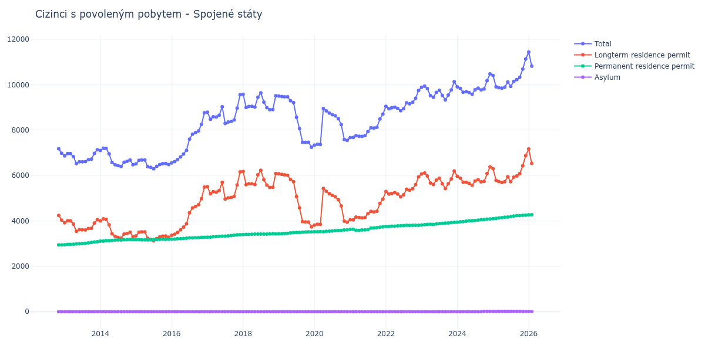

# Spojené státy

## Souhrnné statistiky (Min/Max pro rok) / Summary Statistics (Min/Max per year)

| Year   | Total           | Longterm Residence Permit   | Permanent Residence Permit   | Asylum   |
|--------|-----------------|-----------------------------|------------------------------|----------|
| 2012   | 6 976 / 7 180   | 4 034 / 4 240               | 2 940 / 2 942                | 0 / 0    |
| 2013   | 6 525 / 7 134   | 3 540 / 4 051               | 2 948 / 3 083                | 0 / 0    |
| 2014   | 6 394 / 7 197   | 3 239 / 4 087               | 3 105 / 3 181                | 0 / 0    |
| 2015   | 6 292 / 6 682   | 3 118 / 3 514               | 3 162 / 3 195                | 0 / 0    |
| 2016   | 6 555 / 8 763   | 3 366 / 5 488               | 3 189 / 3 275                | 0 / 0    |
| 2017   | 8 292 / 9 556   | 4 962 / 6 161               | 3 282 / 3 395                | 0 / 0    |
| 2018   | 8 897 / 9 643   | 5 471 / 6 228               | 3 399 / 3 428                | 0 / 0    |
| 2019   | 7 245 / 9 501   | 3 733 / 6 073               | 3 428 / 3 514                | 0 / 0    |
| 2020   | 7 333 / 8 949   | 3 810 / 5 425               | 3 523 / 3 607                | 0 / 0    |
| 2021   | 7 672 / 8 701   | 4 048 / 4 965               | 3 582 / 3 736                | 0 / 0    |
| 2022   | 8 850 / 9 745   | 5 062 / 5 936               | 3 754 / 3 809                | 0 / 0    |
| 2023   | 9 328 / 10 132  | 5 424 / 6 198               | 3 821 / 3 934                | 0 / 0    |
| 2024   | 9 576 / 10 475  | 5 568 / 6 379               | 3 942 / 4 085                | 0 / 11   |
| 2025   | 9 845 / 11 133  | 5 693 / 6 874               | 4 096 / 4 250                | 9 / 12   |
| 2026   | 10 816 / 11 437 | 6 534 / 7 164               | 4 264 / 4 273                | 9 / 9    |

## Detailní tabulka / Detailed Data Table

| Date     | Total           | Longterm Residence Permit   | Permanent Residence Permit   | Asylum       |
|----------|-----------------|-----------------------------|------------------------------|--------------|
| **2012** |                 |                             |                              |              |
| 11.2012  | 7 180           | 4 240                       | 2 940                        | 0            |
| 12.2012  | 6 976 (-2.84%)  | 4 034 (-4.86%)              | 2 942 (+0.07%)               | 0            |
| **2013** |                 |                             |                              |              |
| 01.2013  | 6 862 (-1.63%)  | 3 914 (-2.97%)              | 2 948 (+0.20%)               | 0            |
| 02.2013  | 6 968 (+1.54%)  | 4 004 (+2.30%)              | 2 964 (+0.54%)               | 0            |
| 03.2013  | 6 965 (-0.04%)  | 3 998 (-0.15%)              | 2 967 (+0.10%)               | 0            |
| 04.2013  | 6 831 (-1.92%)  | 3 856 (-3.55%)              | 2 975 (+0.27%)               | 0            |
| 05.2013  | 6 525 (-4.48%)  | 3 540 (-8.20%)              | 2 985 (+0.34%)               | 0            |
| 06.2013  | 6 601 (+1.16%)  | 3 612 (+2.03%)              | 2 989 (+0.13%)               | 0            |
| 07.2013  | 6 603 (+0.03%)  | 3 608 (-0.11%)              | 2 995 (+0.20%)               | 0            |
| 08.2013  | 6 613 (+0.15%)  | 3 602 (-0.17%)              | 3 011 (+0.53%)               | 0            |
| 09.2013  | 6 695 (+1.24%)  | 3 665 (+1.75%)              | 3 030 (+0.63%)               | 0            |
| 10.2013  | 6 717 (+0.33%)  | 3 669 (+0.11%)              | 3 048 (+0.59%)               | 0            |
| 11.2013  | 6 972 (+3.80%)  | 3 905 (+6.43%)              | 3 067 (+0.62%)               | 0            |
| 12.2013  | 7 134 (+2.32%)  | 4 051 (+3.74%)              | 3 083 (+0.52%)               | 0            |
| **2014** |                 |                             |                              |              |
| 01.2014  | 7 102 (-0.45%)  | 3 997 (-1.33%)              | 3 105 (+0.71%)               | 0            |
| 02.2014  | 7 197 (+1.34%)  | 4 087 (+2.25%)              | 3 110 (+0.16%)               | 0            |
| 03.2014  | 7 194 (-0.04%)  | 4 068 (-0.46%)              | 3 126 (+0.51%)               | 0            |
| 04.2014  | 6 952 (-3.36%)  | 3 823 (-6.02%)              | 3 129 (+0.10%)               | 0            |
| 05.2014  | 6 572 (-5.47%)  | 3 433 (-10.20%)             | 3 139 (+0.32%)               | 0            |
| 06.2014  | 6 475 (-1.48%)  | 3 324 (-3.18%)              | 3 151 (+0.38%)               | 0            |
| 07.2014  | 6 436 (-0.60%)  | 3 278 (-1.38%)              | 3 158 (+0.22%)               | 0            |
| 08.2014  | 6 394 (-0.65%)  | 3 239 (-1.19%)              | 3 155 (-0.09%)               | 0            |
| 09.2014  | 6 583 (+2.96%)  | 3 420 (+5.59%)              | 3 163 (+0.25%)               | 0            |
| 10.2014  | 6 624 (+0.62%)  | 3 449 (+0.85%)              | 3 175 (+0.38%)               | 0            |
| 11.2014  | 6 683 (+0.89%)  | 3 502 (+1.54%)              | 3 181 (+0.19%)               | 0            |
| 12.2014  | 6 476 (-3.10%)  | 3 301 (-5.74%)              | 3 175 (-0.19%)               | 0            |
| **2015** |                 |                             |                              |              |
| 01.2015  | 6 511 (+0.54%)  | 3 341 (+1.21%)              | 3 170 (-0.16%)               | 0            |
| 02.2015  | 6 670 (+2.44%)  | 3 499 (+4.73%)              | 3 171 (+0.03%)               | 0            |
| 03.2015  | 6 682 (+0.18%)  | 3 514 (+0.43%)              | 3 168 (-0.09%)               | 0            |
| 04.2015  | 6 682 (+0.00%)  | 3 514 (+0.00%)              | 3 168 (+0.00%)               | 0            |
| 05.2015  | 6 393 (-4.33%)  | 3 231 (-8.05%)              | 3 162 (-0.19%)               | 0            |
| 06.2015  | 6 355 (-0.59%)  | 3 187 (-1.36%)              | 3 168 (+0.19%)               | 0            |
| 07.2015  | 6 292 (-0.99%)  | 3 118 (-2.17%)              | 3 174 (+0.19%)               | 0            |
| 08.2015  | 6 405 (+1.80%)  | 3 226 (+3.46%)              | 3 179 (+0.16%)               | 0            |
| 09.2015  | 6 483 (+1.22%)  | 3 296 (+2.17%)              | 3 187 (+0.25%)               | 0            |
| 10.2015  | 6 519 (+0.56%)  | 3 329 (+1.00%)              | 3 190 (+0.09%)               | 0            |
| 11.2015  | 6 524 (+0.08%)  | 3 337 (+0.24%)              | 3 187 (-0.09%)               | 0            |
| 12.2015  | 6 478 (-0.71%)  | 3 283 (-1.62%)              | 3 195 (+0.25%)               | 0            |
| **2016** |                 |                             |                              |              |
| 01.2016  | 6 555 (+1.19%)  | 3 366 (+2.53%)              | 3 189 (-0.19%)               | 0            |
| 02.2016  | 6 613 (+0.88%)  | 3 412 (+1.37%)              | 3 201 (+0.38%)               | 0            |
| 03.2016  | 6 700 (+1.32%)  | 3 490 (+2.29%)              | 3 210 (+0.28%)               | 0            |
| 04.2016  | 6 820 (+1.79%)  | 3 603 (+3.24%)              | 3 217 (+0.22%)               | 0            |
| 05.2016  | 6 946 (+1.85%)  | 3 719 (+3.22%)              | 3 227 (+0.31%)               | 0            |
| 06.2016  | 7 110 (+2.36%)  | 3 873 (+4.14%)              | 3 237 (+0.31%)               | 0            |
| 07.2016  | 7 601 (+6.91%)  | 4 354 (+12.42%)             | 3 247 (+0.31%)               | 0            |
| 08.2016  | 7 818 (+2.85%)  | 4 571 (+4.98%)              | 3 247 (+0.00%)               | 0            |
| 09.2016  | 7 887 (+0.88%)  | 4 633 (+1.36%)              | 3 254 (+0.22%)               | 0            |
| 10.2016  | 7 963 (+0.96%)  | 4 709 (+1.64%)              | 3 254 (+0.00%)               | 0            |
| 11.2016  | 8 250 (+3.60%)  | 4 976 (+5.67%)              | 3 274 (+0.61%)               | 0            |
| 12.2016  | 8 763 (+6.22%)  | 5 488 (+10.29%)             | 3 275 (+0.03%)               | 0            |
| **2017** |                 |                             |                              |              |
| 01.2017  | 8 785 (+0.25%)  | 5 503 (+0.27%)              | 3 282 (+0.21%)               | 0            |
| 02.2017  | 8 477 (-3.51%)  | 5 192 (-5.65%)              | 3 285 (+0.09%)               | 0            |
| 03.2017  | 8 586 (+1.29%)  | 5 286 (+1.81%)              | 3 300 (+0.46%)               | 0            |
| 04.2017  | 8 575 (-0.13%)  | 5 266 (-0.38%)              | 3 309 (+0.27%)               | 0            |
| 05.2017  | 8 651 (+0.89%)  | 5 333 (+1.27%)              | 3 318 (+0.27%)               | 0            |
| 06.2017  | 9 028 (+4.36%)  | 5 700 (+6.88%)              | 3 328 (+0.30%)               | 0            |
| 07.2017  | 8 292 (-8.15%)  | 4 962 (-12.95%)             | 3 330 (+0.06%)               | 0            |
| 08.2017  | 8 356 (+0.77%)  | 5 015 (+1.07%)              | 3 341 (+0.33%)               | 0            |
| 09.2017  | 8 383 (+0.32%)  | 5 031 (+0.32%)              | 3 352 (+0.33%)               | 0            |
| 10.2017  | 8 446 (+0.75%)  | 5 078 (+0.93%)              | 3 368 (+0.48%)               | 0            |
| 11.2017  | 8 966 (+6.16%)  | 5 580 (+9.89%)              | 3 386 (+0.53%)               | 0            |
| 12.2017  | 9 556 (+6.58%)  | 6 161 (+10.41%)             | 3 395 (+0.27%)               | 0            |
| **2018** |                 |                             |                              |              |
| 01.2018  | 9 575 (+0.20%)  | 6 176 (+0.24%)              | 3 399 (+0.12%)               | 0            |
| 02.2018  | 8 997 (-6.04%)  | 5 593 (-9.44%)              | 3 404 (+0.15%)               | 0            |
| 03.2018  | 9 039 (+0.47%)  | 5 632 (+0.70%)              | 3 407 (+0.09%)               | 0            |
| 04.2018  | 9 048 (+0.10%)  | 5 637 (+0.09%)              | 3 411 (+0.12%)               | 0            |
| 05.2018  | 9 015 (-0.36%)  | 5 600 (-0.66%)              | 3 415 (+0.12%)               | 0            |
| 06.2018  | 9 446 (+4.78%)  | 6 030 (+7.68%)              | 3 416 (+0.03%)               | 0            |
| 07.2018  | 9 643 (+2.09%)  | 6 228 (+3.28%)              | 3 415 (-0.03%)               | 0            |
| 08.2018  | 9 231 (-4.27%)  | 5 816 (-6.62%)              | 3 415 (+0.00%)               | 0            |
| 09.2018  | 8 991 (-2.60%)  | 5 574 (-4.16%)              | 3 417 (+0.06%)               | 0            |
| 10.2018  | 8 897 (-1.05%)  | 5 471 (-1.85%)              | 3 426 (+0.26%)               | 0            |
| 11.2018  | 8 906 (+0.10%)  | 5 478 (+0.13%)              | 3 428 (+0.06%)               | 0            |
| 12.2018  | 9 510 (+6.78%)  | 6 084 (+11.06%)             | 3 426 (-0.06%)               | 0            |
| **2019** |                 |                             |                              |              |
| 01.2019  | 9 501 (-0.09%)  | 6 073 (-0.18%)              | 3 428 (+0.06%)               | 0            |
| 02.2019  | 9 480 (-0.22%)  | 6 046 (-0.44%)              | 3 434 (+0.18%)               | 0            |
| 03.2019  | 9 469 (-0.12%)  | 6 026 (-0.33%)              | 3 443 (+0.26%)               | 0            |
| 04.2019  | 9 463 (-0.06%)  | 6 010 (-0.27%)              | 3 453 (+0.29%)               | 0            |
| 05.2019  | 9 293 (-1.80%)  | 5 825 (-3.08%)              | 3 468 (+0.43%)               | 0            |
| 06.2019  | 9 206 (-0.94%)  | 5 725 (-1.72%)              | 3 481 (+0.37%)               | 0            |
| 07.2019  | 8 562 (-7.00%)  | 5 073 (-11.39%)             | 3 489 (+0.23%)               | 0            |
| 08.2019  | 8 066 (-5.79%)  | 4 574 (-9.84%)              | 3 492 (+0.09%)               | 0            |
| 09.2019  | 7 465 (-7.45%)  | 3 966 (-13.29%)             | 3 499 (+0.20%)               | 0            |
| 10.2019  | 7 466 (+0.01%)  | 3 957 (-0.23%)              | 3 509 (+0.29%)               | 0            |
| 11.2019  | 7 465 (-0.01%)  | 3 951 (-0.15%)              | 3 514 (+0.14%)               | 0            |
| 12.2019  | 7 245 (-2.95%)  | 3 733 (-5.52%)              | 3 512 (-0.06%)               | 0            |
| **2020** |                 |                             |                              |              |
| 01.2020  | 7 333 (+1.21%)  | 3 810 (+2.06%)              | 3 523 (+0.31%)               | 0            |
| 02.2020  | 7 372 (+0.53%)  | 3 848 (+1.00%)              | 3 524 (+0.03%)               | 0            |
| 03.2020  | 7 369 (-0.04%)  | 3 843 (-0.13%)              | 3 526 (+0.06%)               | 0            |
| 04.2020  | 8 949 (+21.44%) | 5 425 (+41.17%)             | 3 524 (-0.06%)               | 0            |
| 05.2020  | 8 848 (-1.13%)  | 5 304 (-2.23%)              | 3 544 (+0.57%)               | 0            |
| 06.2020  | 8 748 (-1.13%)  | 5 198 (-2.00%)              | 3 550 (+0.17%)               | 0            |
| 07.2020  | 8 680 (-0.78%)  | 5 125 (-1.40%)              | 3 555 (+0.14%)               | 0            |
| 08.2020  | 8 624 (-0.65%)  | 5 057 (-1.33%)              | 3 567 (+0.34%)               | 0            |
| 09.2020  | 8 505 (-1.38%)  | 4 930 (-2.51%)              | 3 575 (+0.22%)               | 0            |
| 10.2020  | 8 244 (-3.07%)  | 4 662 (-5.44%)              | 3 582 (+0.20%)               | 0            |
| 11.2020  | 7 586 (-7.98%)  | 3 984 (-14.54%)             | 3 602 (+0.56%)               | 0            |
| 12.2020  | 7 546 (-0.53%)  | 3 939 (-1.13%)              | 3 607 (+0.14%)               | 0            |
| **2021** |                 |                             |                              |              |
| 01.2021  | 7 672 (+1.67%)  | 4 050 (+2.82%)              | 3 622 (+0.42%)               | 0            |
| 02.2021  | 7 677 (+0.07%)  | 4 048 (-0.05%)              | 3 629 (+0.19%)               | 0            |
| 03.2021  | 7 751 (+0.96%)  | 4 168 (+2.96%)              | 3 583 (-1.27%)               | 0            |
| 04.2021  | 7 729 (-0.28%)  | 4 147 (-0.50%)              | 3 582 (-0.03%)               | 0            |
| 05.2021  | 7 724 (-0.06%)  | 4 127 (-0.48%)              | 3 597 (+0.42%)               | 0            |
| 06.2021  | 7 754 (+0.39%)  | 4 149 (+0.53%)              | 3 605 (+0.22%)               | 0            |
| 07.2021  | 7 932 (+2.30%)  | 4 323 (+4.19%)              | 3 609 (+0.11%)               | 0            |
| 08.2021  | 8 103 (+2.16%)  | 4 417 (+2.17%)              | 3 686 (+2.13%)               | 0            |
| 09.2021  | 8 088 (-0.19%)  | 4 396 (-0.48%)              | 3 692 (+0.16%)               | 0            |
| 10.2021  | 8 124 (+0.45%)  | 4 423 (+0.61%)              | 3 701 (+0.24%)               | 0            |
| 11.2021  | 8 491 (+4.52%)  | 4 771 (+7.87%)              | 3 720 (+0.51%)               | 0            |
| 12.2021  | 8 701 (+2.47%)  | 4 965 (+4.07%)              | 3 736 (+0.43%)               | 0            |
| **2022** |                 |                             |                              |              |
| 01.2022  | 9 045 (+3.95%)  | 5 291 (+6.57%)              | 3 754 (+0.48%)               | 0            |
| 02.2022  | 8 938 (-1.18%)  | 5 183 (-2.04%)              | 3 755 (+0.03%)               | 0            |
| 03.2022  | 8 979 (+0.46%)  | 5 211 (+0.54%)              | 3 768 (+0.35%)               | 0            |
| 04.2022  | 9 009 (+0.33%)  | 5 245 (+0.65%)              | 3 764 (-0.11%)               | 0            |
| 05.2022  | 8 958 (-0.57%)  | 5 181 (-1.22%)              | 3 777 (+0.35%)               | 0            |
| 06.2022  | 8 850 (-1.21%)  | 5 062 (-2.30%)              | 3 788 (+0.29%)               | 0            |
| 07.2022  | 8 946 (+1.08%)  | 5 153 (+1.80%)              | 3 793 (+0.13%)               | 0            |
| 08.2022  | 9 203 (+2.87%)  | 5 397 (+4.74%)              | 3 806 (+0.34%)               | 0            |
| 09.2022  | 9 153 (-0.54%)  | 5 353 (-0.82%)              | 3 800 (-0.16%)               | 0            |
| 10.2022  | 9 224 (+0.78%)  | 5 418 (+1.21%)              | 3 806 (+0.16%)               | 0            |
| 11.2022  | 9 401 (+1.92%)  | 5 594 (+3.25%)              | 3 807 (+0.03%)               | 0            |
| 12.2022  | 9 745 (+3.66%)  | 5 936 (+6.11%)              | 3 809 (+0.05%)               | 0            |
| **2023** |                 |                             |                              |              |
| 01.2023  | 9 887 (+1.46%)  | 6 066 (+2.19%)              | 3 821 (+0.32%)               | 0            |
| 02.2023  | 9 938 (+0.52%)  | 6 104 (+0.63%)              | 3 834 (+0.34%)               | 0            |
| 03.2023  | 9 827 (-1.12%)  | 5 980 (-2.03%)              | 3 847 (+0.34%)               | 0            |
| 04.2023  | 9 519 (-3.13%)  | 5 669 (-5.20%)              | 3 850 (+0.08%)               | 0            |
| 05.2023  | 9 446 (-0.77%)  | 5 599 (-1.23%)              | 3 847 (-0.08%)               | 0            |
| 06.2023  | 9 661 (+2.28%)  | 5 799 (+3.57%)              | 3 862 (+0.39%)               | 0            |
| 07.2023  | 9 753 (+0.95%)  | 5 878 (+1.36%)              | 3 875 (+0.34%)               | 0            |
| 08.2023  | 9 523 (-2.36%)  | 5 634 (-4.15%)              | 3 889 (+0.36%)               | 0            |
| 09.2023  | 9 328 (-2.05%)  | 5 424 (-3.73%)              | 3 904 (+0.39%)               | 0            |
| 10.2023  | 9 546 (+2.34%)  | 5 635 (+3.89%)              | 3 911 (+0.18%)               | 0            |
| 11.2023  | 9 772 (+2.37%)  | 5 849 (+3.80%)              | 3 923 (+0.31%)               | 0            |
| 12.2023  | 10 132 (+3.68%) | 6 198 (+5.97%)              | 3 934 (+0.28%)               | 0            |
| **2024** |                 |                             |                              |              |
| 01.2024  | 9 905 (-2.24%)  | 5 963 (-3.79%)              | 3 942 (+0.20%)               | 0            |
| 02.2024  | 9 836 (-0.70%)  | 5 878 (-1.43%)              | 3 958 (+0.41%)               | 0            |
| 03.2024  | 9 669 (-1.70%)  | 5 703 (-2.98%)              | 3 966 (+0.20%)               | 0            |
| 04.2024  | 9 692 (+0.24%)  | 5 702 (-0.02%)              | 3 990 (+0.61%)               | 0            |
| 05.2024  | 9 655 (-0.38%)  | 5 657 (-0.79%)              | 3 998 (+0.20%)               | 0            |
| 06.2024  | 9 576 (-0.82%)  | 5 568 (-1.57%)              | 4 008 (+0.25%)               | 0            |
| 07.2024  | 9 778 (+2.11%)  | 5 756 (+3.38%)              | 4 022 (+0.35%)               | 0            |
| 08.2024  | 9 848 (+0.72%)  | 5 813 (+0.99%)              | 4 035 (+0.32%)               | 0            |
| 09.2024  | 9 767 (-0.82%)  | 5 717 (-1.65%)              | 4 050 (+0.37%)               | 0            |
| 10.2024  | 9 806 (+0.40%)  | 5 736 (+0.33%)              | 4 059 (+0.22%)               | 11           |
| 11.2024  | 10 178 (+3.79%) | 6 087 (+6.12%)              | 4 080 (+0.52%)               | 11 (+0.00%)  |
| 12.2024  | 10 475 (+2.92%) | 6 379 (+4.80%)              | 4 085 (+0.12%)               | 11 (+0.00%)  |
| **2025** |                 |                             |                              |              |
| 01.2025  | 10 405 (-0.67%) | 6 298 (-1.27%)              | 4 096 (+0.27%)               | 11 (+0.00%)  |
| 02.2025  | 9 908 (-4.78%)  | 5 786 (-8.13%)              | 4 110 (+0.34%)               | 12 (+9.09%)  |
| 03.2025  | 9 867 (-0.41%)  | 5 729 (-0.99%)              | 4 128 (+0.44%)               | 10 (-16.67%) |
| 04.2025  | 9 845 (-0.22%)  | 5 693 (-0.63%)              | 4 142 (+0.34%)               | 10 (+0.00%)  |
| 05.2025  | 9 894 (+0.50%)  | 5 724 (+0.54%)              | 4 160 (+0.43%)               | 10 (+0.00%)  |
| 06.2025  | 10 122 (+2.30%) | 5 944 (+3.84%)              | 4 167 (+0.17%)               | 11 (+10.00%) |
| 07.2025  | 9 924 (-1.96%)  | 5 725 (-3.68%)              | 4 188 (+0.50%)               | 11 (+0.00%)  |
| 08.2025  | 10 147 (+2.25%) | 5 926 (+3.51%)              | 4 210 (+0.53%)               | 11 (+0.00%)  |
| 09.2025  | 10 219 (+0.71%) | 5 977 (+0.86%)              | 4 232 (+0.52%)               | 10 (-9.09%)  |
| 10.2025  | 10 328 (+1.07%) | 6 083 (+1.77%)              | 4 235 (+0.07%)               | 10 (+0.00%)  |
| 11.2025  | 10 685 (+3.46%) | 6 427 (+5.66%)              | 4 248 (+0.31%)               | 10 (+0.00%)  |
| 12.2025  | 11 133 (+4.19%) | 6 874 (+6.96%)              | 4 250 (+0.05%)               | 9 (-10.00%)  |
| **2026** |                 |                             |                              |              |
| 01.2026  | 11 437 (+2.73%) | 7 164 (+4.22%)              | 4 264 (+0.33%)               | 9 (+0.00%)   |
| 02.2026  | 10 816 (-5.43%) | 6 534 (-8.79%)              | 4 273 (+0.21%)               | 9 (+0.00%)   |
