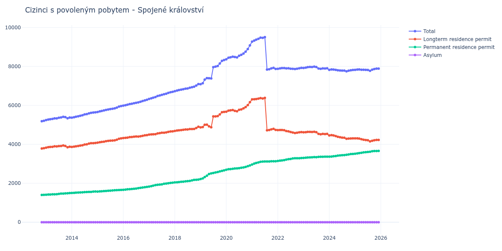

# Spojené království

## Souhrnné statistiky (Min/Max pro rok) / Summary Statistics (Min/Max per year)

| Year   | Total Min/Max   | Longterm Residence Permit Min/Max   | Permanent Residence Permit Min/Max   | Asylum Min/Max   |
|--------|-----------------|-------------------------------------|--------------------------------------|------------------|
| 2012   | 5 187 / 5 210   | 3 785 / 3 805                       | 1 402 / 1 405                        | 0 / 0            |
| 2013   | 5 245 / 5 413   | 3 830 / 3 942                       | 1 415 / 1 497                        | 0 / 0            |
| 2014   | 5 369 / 5 647   | 3 867 / 4 070                       | 1 502 / 1 577                        | 0 / 0            |
| 2015   | 5 662 / 5 966   | 4 087 / 4 308                       | 1 575 / 1 658                        | 0 / 0            |
| 2016   | 5 990 / 6 288   | 4 324 / 4 474                       | 1 666 / 1 814                        | 0 / 0            |
| 2017   | 6 331 / 6 698   | 4 500 / 4 668                       | 1 831 / 2 030                        | 0 / 0            |
| 2018   | 6 731 / 7 093   | 4 687 / 4 902                       | 2 044 / 2 191                        | 0 / 0            |
| 2019   | 7 091 / 8 332   | 4 873 / 5 666                       | 2 218 / 2 666                        | 0 / 0            |
| 2020   | 8 369 / 9 084   | 5 675 / 6 167                       | 2 694 / 2 917                        | 0 / 0            |
| 2021   | 7 840 / 9 506   | 4 722 / 6 383                       | 2 964 / 3 133                        | 0 / 0            |
| 2022   | 7 869 / 7 928   | 4 582 / 4 739                       | 3 149 / 3 296                        | 0 / 0            |
| 2023   | 7 880 / 7 991   | 4 519 / 4 647                       | 3 302 / 3 368                        | 0 / 0            |
| 2024   | 7 749 / 7 848   | 4 286 / 4 473                       | 3 369 / 3 507                        | 0 / 2            |
| 2025   | 7 776 / 7 889   | 4 153 / 4 308                       | 3 517 / 3 661                        | 2 / 2            |

## Detailní tabulka / Detailed Data Table

| Date     | Total           | Longterm Residence Permit   | Permanent Residence Permit   | Asylum     |
|----------|-----------------|-----------------------------|------------------------------|------------|
| **2012** |                 |                             |                              |            |
| 11.2012  | 5 187           | 3 785                       | 1 402                        | 0          |
| 12.2012  | 5 210 (+0.44%)  | 3 805 (+0.53%)              | 1 405 (+0.21%)               | 0          |
| **2013** |                 |                             |                              |            |
| 01.2013  | 5 245 (+0.67%)  | 3 830 (+0.66%)              | 1 415 (+0.71%)               | 0          |
| 02.2013  | 5 276 (+0.59%)  | 3 855 (+0.65%)              | 1 421 (+0.42%)               | 0          |
| 03.2013  | 5 290 (+0.27%)  | 3 865 (+0.26%)              | 1 425 (+0.28%)               | 0          |
| 04.2013  | 5 308 (+0.34%)  | 3 874 (+0.23%)              | 1 434 (+0.63%)               | 0          |
| 05.2013  | 5 333 (+0.47%)  | 3 899 (+0.65%)              | 1 434 (+0.00%)               | 0          |
| 06.2013  | 5 335 (+0.04%)  | 3 895 (-0.10%)              | 1 440 (+0.42%)               | 0          |
| 07.2013  | 5 363 (+0.52%)  | 3 910 (+0.39%)              | 1 453 (+0.90%)               | 0          |
| 08.2013  | 5 382 (+0.35%)  | 3 913 (+0.08%)              | 1 469 (+1.10%)               | 0          |
| 09.2013  | 5 413 (+0.58%)  | 3 942 (+0.74%)              | 1 471 (+0.14%)               | 0          |
| 10.2013  | 5 399 (-0.26%)  | 3 917 (-0.63%)              | 1 482 (+0.75%)               | 0          |
| 11.2013  | 5 340 (-1.09%)  | 3 853 (-1.63%)              | 1 487 (+0.34%)               | 0          |
| 12.2013  | 5 376 (+0.67%)  | 3 879 (+0.67%)              | 1 497 (+0.67%)               | 0          |
| **2014** |                 |                             |                              |            |
| 01.2014  | 5 369 (-0.13%)  | 3 867 (-0.31%)              | 1 502 (+0.33%)               | 0          |
| 02.2014  | 5 391 (+0.41%)  | 3 883 (+0.41%)              | 1 508 (+0.40%)               | 0          |
| 03.2014  | 5 418 (+0.50%)  | 3 899 (+0.41%)              | 1 519 (+0.73%)               | 0          |
| 04.2014  | 5 440 (+0.41%)  | 3 913 (+0.36%)              | 1 527 (+0.53%)               | 0          |
| 05.2014  | 5 467 (+0.50%)  | 3 934 (+0.54%)              | 1 533 (+0.39%)               | 0          |
| 06.2014  | 5 493 (+0.48%)  | 3 955 (+0.53%)              | 1 538 (+0.33%)               | 0          |
| 07.2014  | 5 537 (+0.80%)  | 3 989 (+0.86%)              | 1 548 (+0.65%)               | 0          |
| 08.2014  | 5 552 (+0.27%)  | 4 000 (+0.28%)              | 1 552 (+0.26%)               | 0          |
| 09.2014  | 5 592 (+0.72%)  | 4 037 (+0.92%)              | 1 555 (+0.19%)               | 0          |
| 10.2014  | 5 619 (+0.48%)  | 4 059 (+0.54%)              | 1 560 (+0.32%)               | 0          |
| 11.2014  | 5 634 (+0.27%)  | 4 062 (+0.07%)              | 1 572 (+0.77%)               | 0          |
| 12.2014  | 5 647 (+0.23%)  | 4 070 (+0.20%)              | 1 577 (+0.32%)               | 0          |
| **2015** |                 |                             |                              |            |
| 01.2015  | 5 662 (+0.27%)  | 4 087 (+0.42%)              | 1 575 (-0.13%)               | 0          |
| 02.2015  | 5 692 (+0.53%)  | 4 107 (+0.49%)              | 1 585 (+0.63%)               | 0          |
| 03.2015  | 5 713 (+0.37%)  | 4 122 (+0.37%)              | 1 591 (+0.38%)               | 0          |
| 04.2015  | 5 739 (+0.46%)  | 4 137 (+0.36%)              | 1 602 (+0.69%)               | 0          |
| 05.2015  | 5 767 (+0.49%)  | 4 160 (+0.56%)              | 1 607 (+0.31%)               | 0          |
| 06.2015  | 5 792 (+0.43%)  | 4 177 (+0.41%)              | 1 615 (+0.50%)               | 0          |
| 07.2015  | 5 812 (+0.35%)  | 4 189 (+0.29%)              | 1 623 (+0.50%)               | 0          |
| 08.2015  | 5 825 (+0.22%)  | 4 192 (+0.07%)              | 1 633 (+0.62%)               | 0          |
| 09.2015  | 5 848 (+0.39%)  | 4 203 (+0.26%)              | 1 645 (+0.73%)               | 0          |
| 10.2015  | 5 887 (+0.67%)  | 4 237 (+0.81%)              | 1 650 (+0.30%)               | 0          |
| 11.2015  | 5 942 (+0.93%)  | 4 288 (+1.20%)              | 1 654 (+0.24%)               | 0          |
| 12.2015  | 5 966 (+0.40%)  | 4 308 (+0.47%)              | 1 658 (+0.24%)               | 0          |
| **2016** |                 |                             |                              |            |
| 01.2016  | 5 990 (+0.40%)  | 4 324 (+0.37%)              | 1 666 (+0.48%)               | 0          |
| 02.2016  | 6 009 (+0.32%)  | 4 335 (+0.25%)              | 1 674 (+0.48%)               | 0          |
| 03.2016  | 6 035 (+0.43%)  | 4 345 (+0.23%)              | 1 690 (+0.96%)               | 0          |
| 04.2016  | 6 069 (+0.56%)  | 4 373 (+0.64%)              | 1 696 (+0.36%)               | 0          |
| 05.2016  | 6 085 (+0.26%)  | 4 379 (+0.14%)              | 1 706 (+0.59%)               | 0          |
| 06.2016  | 6 111 (+0.43%)  | 4 395 (+0.37%)              | 1 716 (+0.59%)               | 0          |
| 07.2016  | 6 135 (+0.39%)  | 4 404 (+0.20%)              | 1 731 (+0.87%)               | 0          |
| 08.2016  | 6 153 (+0.29%)  | 4 401 (-0.07%)              | 1 752 (+1.21%)               | 0          |
| 09.2016  | 6 186 (+0.54%)  | 4 417 (+0.36%)              | 1 769 (+0.97%)               | 0          |
| 10.2016  | 6 222 (+0.58%)  | 4 438 (+0.48%)              | 1 784 (+0.85%)               | 0          |
| 11.2016  | 6 258 (+0.58%)  | 4 461 (+0.52%)              | 1 797 (+0.73%)               | 0          |
| 12.2016  | 6 288 (+0.48%)  | 4 474 (+0.29%)              | 1 814 (+0.95%)               | 0          |
| **2017** |                 |                             |                              |            |
| 01.2017  | 6 331 (+0.68%)  | 4 500 (+0.58%)              | 1 831 (+0.94%)               | 0          |
| 02.2017  | 6 363 (+0.51%)  | 4 512 (+0.27%)              | 1 851 (+1.09%)               | 0          |
| 03.2017  | 6 395 (+0.50%)  | 4 515 (+0.07%)              | 1 880 (+1.57%)               | 0          |
| 04.2017  | 6 426 (+0.48%)  | 4 522 (+0.16%)              | 1 904 (+1.28%)               | 0          |
| 05.2017  | 6 480 (+0.84%)  | 4 558 (+0.80%)              | 1 922 (+0.95%)               | 0          |
| 06.2017  | 6 510 (+0.46%)  | 4 574 (+0.35%)              | 1 936 (+0.73%)               | 0          |
| 07.2017  | 6 540 (+0.46%)  | 4 595 (+0.46%)              | 1 945 (+0.46%)               | 0          |
| 08.2017  | 6 573 (+0.50%)  | 4 599 (+0.09%)              | 1 974 (+1.49%)               | 0          |
| 09.2017  | 6 600 (+0.41%)  | 4 614 (+0.33%)              | 1 986 (+0.61%)               | 0          |
| 10.2017  | 6 642 (+0.64%)  | 4 638 (+0.52%)              | 2 004 (+0.91%)               | 0          |
| 11.2017  | 6 678 (+0.54%)  | 4 661 (+0.50%)              | 2 017 (+0.65%)               | 0          |
| 12.2017  | 6 698 (+0.30%)  | 4 668 (+0.15%)              | 2 030 (+0.64%)               | 0          |
| **2018** |                 |                             |                              |            |
| 01.2018  | 6 731 (+0.49%)  | 4 687 (+0.41%)              | 2 044 (+0.69%)               | 0          |
| 02.2018  | 6 762 (+0.46%)  | 4 711 (+0.51%)              | 2 051 (+0.34%)               | 0          |
| 03.2018  | 6 787 (+0.37%)  | 4 722 (+0.23%)              | 2 065 (+0.68%)               | 0          |
| 04.2018  | 6 811 (+0.35%)  | 4 733 (+0.23%)              | 2 078 (+0.63%)               | 0          |
| 05.2018  | 6 831 (+0.29%)  | 4 748 (+0.32%)              | 2 083 (+0.24%)               | 0          |
| 06.2018  | 6 860 (+0.42%)  | 4 762 (+0.29%)              | 2 098 (+0.72%)               | 0          |
| 07.2018  | 6 870 (+0.15%)  | 4 762 (+0.00%)              | 2 108 (+0.48%)               | 0          |
| 08.2018  | 6 905 (+0.51%)  | 4 783 (+0.44%)              | 2 122 (+0.66%)               | 0          |
| 09.2018  | 6 936 (+0.45%)  | 4 786 (+0.06%)              | 2 150 (+1.32%)               | 0          |
| 10.2018  | 6 963 (+0.39%)  | 4 790 (+0.08%)              | 2 173 (+1.07%)               | 0          |
| 11.2018  | 7 020 (+0.82%)  | 4 837 (+0.98%)              | 2 183 (+0.46%)               | 0          |
| 12.2018  | 7 093 (+1.04%)  | 4 902 (+1.34%)              | 2 191 (+0.37%)               | 0          |
| **2019** |                 |                             |                              |            |
| 01.2019  | 7 091 (-0.03%)  | 4 873 (-0.59%)              | 2 218 (+1.23%)               | 0          |
| 02.2019  | 7 140 (+0.69%)  | 4 888 (+0.31%)              | 2 252 (+1.53%)               | 0          |
| 03.2019  | 7 323 (+2.56%)  | 5 004 (+2.37%)              | 2 319 (+2.98%)               | 0          |
| 04.2019  | 7 401 (+1.07%)  | 5 009 (+0.10%)              | 2 392 (+3.15%)               | 0          |
| 05.2019  | 7 398 (-0.04%)  | 4 924 (-1.70%)              | 2 474 (+3.43%)               | 0          |
| 06.2019  | 7 383 (-0.20%)  | 4 875 (-1.00%)              | 2 508 (+1.37%)               | 0          |
| 07.2019  | 7 967 (+7.91%)  | 5 435 (+11.49%)             | 2 532 (+0.96%)               | 0          |
| 08.2019  | 7 991 (+0.30%)  | 5 437 (+0.04%)              | 2 554 (+0.87%)               | 0          |
| 09.2019  | 8 026 (+0.44%)  | 5 449 (+0.22%)              | 2 577 (+0.90%)               | 0          |
| 10.2019  | 8 150 (+1.54%)  | 5 538 (+1.63%)              | 2 612 (+1.36%)               | 0          |
| 11.2019  | 8 289 (+1.71%)  | 5 651 (+2.04%)              | 2 638 (+1.00%)               | 0          |
| 12.2019  | 8 332 (+0.52%)  | 5 666 (+0.27%)              | 2 666 (+1.06%)               | 0          |
| **2020** |                 |                             |                              |            |
| 01.2020  | 8 369 (+0.44%)  | 5 675 (+0.16%)              | 2 694 (+1.05%)               | 0          |
| 02.2020  | 8 450 (+0.97%)  | 5 728 (+0.93%)              | 2 722 (+1.04%)               | 0          |
| 03.2020  | 8 470 (+0.24%)  | 5 744 (+0.28%)              | 2 726 (+0.15%)               | 0          |
| 04.2020  | 8 504 (+0.40%)  | 5 761 (+0.30%)              | 2 743 (+0.62%)               | 0          |
| 05.2020  | 8 483 (-0.25%)  | 5 720 (-0.71%)              | 2 763 (+0.73%)               | 0          |
| 06.2020  | 8 462 (-0.25%)  | 5 698 (-0.38%)              | 2 764 (+0.04%)               | 0          |
| 07.2020  | 8 551 (+1.05%)  | 5 775 (+1.35%)              | 2 776 (+0.43%)               | 0          |
| 08.2020  | 8 597 (+0.54%)  | 5 797 (+0.38%)              | 2 800 (+0.86%)               | 0          |
| 09.2020  | 8 663 (+0.77%)  | 5 851 (+0.93%)              | 2 812 (+0.43%)               | 0          |
| 10.2020  | 8 757 (+1.09%)  | 5 915 (+1.09%)              | 2 842 (+1.07%)               | 0          |
| 11.2020  | 8 896 (+1.59%)  | 6 015 (+1.69%)              | 2 881 (+1.37%)               | 0          |
| 12.2020  | 9 084 (+2.11%)  | 6 167 (+2.53%)              | 2 917 (+1.25%)               | 0          |
| **2021** |                 |                             |                              |            |
| 01.2021  | 9 273 (+2.08%)  | 6 309 (+2.30%)              | 2 964 (+1.61%)               | 0          |
| 02.2021  | 9 327 (+0.58%)  | 6 316 (+0.11%)              | 3 011 (+1.59%)               | 0          |
| 03.2021  | 9 375 (+0.51%)  | 6 329 (+0.21%)              | 3 046 (+1.16%)               | 0          |
| 04.2021  | 9 420 (+0.48%)  | 6 348 (+0.30%)              | 3 072 (+0.85%)               | 0          |
| 05.2021  | 9 478 (+0.62%)  | 6 376 (+0.44%)              | 3 102 (+0.98%)               | 0          |
| 06.2021  | 9 470 (-0.08%)  | 6 354 (-0.35%)              | 3 116 (+0.45%)               | 0          |
| 07.2021  | 9 506 (+0.38%)  | 6 383 (+0.46%)              | 3 123 (+0.22%)               | 0          |
| 08.2021  | 7 840 (-17.53%) | 4 722 (-26.02%)             | 3 118 (-0.16%)               | 0          |
| 09.2021  | 7 859 (+0.24%)  | 4 738 (+0.34%)              | 3 121 (+0.10%)               | 0          |
| 10.2021  | 7 899 (+0.51%)  | 4 768 (+0.63%)              | 3 131 (+0.32%)               | 0          |
| 11.2021  | 7 927 (+0.35%)  | 4 796 (+0.59%)              | 3 131 (+0.00%)               | 0          |
| 12.2021  | 7 875 (-0.66%)  | 4 742 (-1.13%)              | 3 133 (+0.06%)               | 0          |
| **2022** |                 |                             |                              |            |
| 01.2022  | 7 879 (+0.05%)  | 4 730 (-0.25%)              | 3 149 (+0.51%)               | 0          |
| 02.2022  | 7 901 (+0.28%)  | 4 738 (+0.17%)              | 3 163 (+0.44%)               | 0          |
| 03.2022  | 7 914 (+0.16%)  | 4 739 (+0.02%)              | 3 175 (+0.38%)               | 0          |
| 04.2022  | 7 916 (+0.03%)  | 4 727 (-0.25%)              | 3 189 (+0.44%)               | 0          |
| 05.2022  | 7 902 (-0.18%)  | 4 685 (-0.89%)              | 3 217 (+0.88%)               | 0          |
| 06.2022  | 7 903 (+0.01%)  | 4 667 (-0.38%)              | 3 236 (+0.59%)               | 0          |
| 07.2022  | 7 882 (-0.27%)  | 4 634 (-0.71%)              | 3 248 (+0.37%)               | 0          |
| 08.2022  | 7 880 (-0.03%)  | 4 606 (-0.60%)              | 3 274 (+0.80%)               | 0          |
| 09.2022  | 7 869 (-0.14%)  | 4 582 (-0.52%)              | 3 287 (+0.40%)               | 0          |
| 10.2022  | 7 882 (+0.17%)  | 4 595 (+0.28%)              | 3 287 (+0.00%)               | 0          |
| 11.2022  | 7 907 (+0.32%)  | 4 619 (+0.52%)              | 3 288 (+0.03%)               | 0          |
| 12.2022  | 7 928 (+0.27%)  | 4 632 (+0.28%)              | 3 296 (+0.24%)               | 0          |
| **2023** |                 |                             |                              |            |
| 01.2023  | 7 920 (-0.10%)  | 4 618 (-0.30%)              | 3 302 (+0.18%)               | 0          |
| 02.2023  | 7 938 (+0.23%)  | 4 622 (+0.09%)              | 3 316 (+0.42%)               | 0          |
| 03.2023  | 7 965 (+0.34%)  | 4 640 (+0.39%)              | 3 325 (+0.27%)               | 0          |
| 04.2023  | 7 974 (+0.11%)  | 4 642 (+0.04%)              | 3 332 (+0.21%)               | 0          |
| 05.2023  | 7 970 (-0.05%)  | 4 633 (-0.19%)              | 3 337 (+0.15%)               | 0          |
| 06.2023  | 7 991 (+0.26%)  | 4 647 (+0.30%)              | 3 344 (+0.21%)               | 0          |
| 07.2023  | 7 969 (-0.28%)  | 4 626 (-0.45%)              | 3 343 (-0.03%)               | 0          |
| 08.2023  | 7 894 (-0.94%)  | 4 538 (-1.90%)              | 3 356 (+0.39%)               | 0          |
| 09.2023  | 7 880 (-0.18%)  | 4 519 (-0.42%)              | 3 361 (+0.15%)               | 0          |
| 10.2023  | 7 900 (+0.25%)  | 4 539 (+0.44%)              | 3 361 (+0.00%)               | 0          |
| 11.2023  | 7 896 (-0.05%)  | 4 528 (-0.24%)              | 3 368 (+0.21%)               | 0          |
| 12.2023  | 7 905 (+0.11%)  | 4 540 (+0.27%)              | 3 365 (-0.09%)               | 0          |
| **2024** |                 |                             |                              |            |
| 01.2024  | 7 825 (-1.01%)  | 4 456 (-1.85%)              | 3 369 (+0.12%)               | 0          |
| 02.2024  | 7 848 (+0.29%)  | 4 473 (+0.38%)              | 3 375 (+0.18%)               | 0          |
| 03.2024  | 7 842 (-0.08%)  | 4 455 (-0.40%)              | 3 387 (+0.36%)               | 0          |
| 04.2024  | 7 826 (-0.20%)  | 4 426 (-0.65%)              | 3 400 (+0.38%)               | 0          |
| 05.2024  | 7 806 (-0.26%)  | 4 387 (-0.88%)              | 3 419 (+0.56%)               | 0          |
| 06.2024  | 7 795 (-0.14%)  | 4 364 (-0.52%)              | 3 431 (+0.35%)               | 0          |
| 07.2024  | 7 785 (-0.13%)  | 4 343 (-0.48%)              | 3 442 (+0.32%)               | 0          |
| 08.2024  | 7 788 (+0.04%)  | 4 338 (-0.12%)              | 3 450 (+0.23%)               | 0          |
| 09.2024  | 7 749 (-0.50%)  | 4 286 (-1.20%)              | 3 463 (+0.38%)               | 0          |
| 10.2024  | 7 781 (+0.41%)  | 4 297 (+0.26%)              | 3 482 (+0.55%)               | 2          |
| 11.2024  | 7 803 (+0.28%)  | 4 301 (+0.09%)              | 3 500 (+0.52%)               | 2 (+0.00%) |
| 12.2024  | 7 817 (+0.18%)  | 4 308 (+0.16%)              | 3 507 (+0.20%)               | 2 (+0.00%) |
| **2025** |                 |                             |                              |            |
| 01.2025  | 7 827 (+0.13%)  | 4 308 (+0.00%)              | 3 517 (+0.29%)               | 2 (+0.00%) |
| 02.2025  | 7 839 (+0.15%)  | 4 305 (-0.07%)              | 3 532 (+0.43%)               | 2 (+0.00%) |
| 03.2025  | 7 847 (+0.10%)  | 4 297 (-0.19%)              | 3 548 (+0.45%)               | 2 (+0.00%) |
| 04.2025  | 7 830 (-0.22%)  | 4 263 (-0.79%)              | 3 565 (+0.48%)               | 2 (+0.00%) |
| 05.2025  | 7 829 (-0.01%)  | 4 240 (-0.54%)              | 3 587 (+0.62%)               | 2 (+0.00%) |
| 06.2025  | 7 825 (-0.05%)  | 4 223 (-0.40%)              | 3 600 (+0.36%)               | 2 (+0.00%) |
| 07.2025  | 7 822 (-0.04%)  | 4 211 (-0.28%)              | 3 609 (+0.25%)               | 2 (+0.00%) |
| 08.2025  | 7 776 (-0.59%)  | 4 153 (-1.38%)              | 3 621 (+0.33%)               | 2 (+0.00%) |
| 09.2025  | 7 835 (+0.76%)  | 4 185 (+0.77%)              | 3 648 (+0.75%)               | 2 (+0.00%) |
| 10.2025  | 7 869 (+0.43%)  | 4 209 (+0.57%)              | 3 658 (+0.27%)               | 2 (+0.00%) |
| 11.2025  | 7 887 (+0.23%)  | 4 225 (+0.38%)              | 3 660 (+0.05%)               | 2 (+0.00%) |
| 12.2025  | 7 889 (+0.03%)  | 4 226 (+0.02%)              | 3 661 (+0.03%)               | 2 (+0.00%) |
