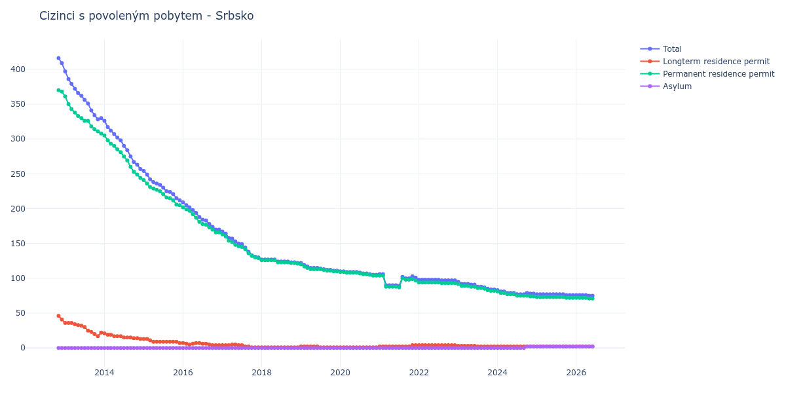

# Srbsko

## Souhrnné statistiky (Min/Max pro rok) / Summary Statistics (Min/Max per year)

| Year   | Total     | Longterm Residence Permit   | Permanent Residence Permit   | Asylum   |
|--------|-----------|-----------------------------|------------------------------|----------|
| 2012   | 409 / 416 | 41 / 46                     | 368 / 370                    | 0 / 0    |
| 2013   | 328 / 397 | 17 / 36                     | 308 / 361                    | 0 / 0    |
| 2014   | 257 / 326 | 13 / 21                     | 244 / 305                    | 0 / 0    |
| 2015   | 212 / 254 | 7 / 13                      | 205 / 241                    | 0 / 0    |
| 2016   | 170 / 209 | 4 / 7                       | 166 / 202                    | 0 / 0    |
| 2017   | 130 / 167 | 1 / 5                       | 129 / 163                    | 0 / 0    |
| 2018   | 122 / 127 | 1 / 1                       | 121 / 126                    | 0 / 0    |
| 2019   | 111 / 122 | 1 / 2                       | 110 / 120                    | 0 / 0    |
| 2020   | 105 / 110 | 1 / 1                       | 104 / 109                    | 0 / 0    |
| 2021   | 89 / 106  | 2 / 4                       | 87 / 104                     | 0 / 0    |
| 2022   | 97 / 98   | 4 / 4                       | 93 / 94                      | 0 / 0    |
| 2023   | 84 / 95   | 2 / 3                       | 82 / 92                      | 0 / 0    |
| 2024   | 77 / 83   | 2 / 2                       | 74 / 81                      | 0 / 2    |
| 2025   | 76 / 77   | 2 / 2                       | 72 / 73                      | 2 / 2    |
| 2026   | 75 / 76   | 2 / 2                       | 71 / 72                      | 2 / 2    |

## Detailní tabulka / Detailed Data Table

| Date     | Total         | Longterm Residence Permit   | Permanent Residence Permit   | Asylum     |
|----------|---------------|-----------------------------|------------------------------|------------|
| **2012** |               |                             |                              |            |
| 11.2012  | 416           | 46                          | 370                          | 0          |
| 12.2012  | 409 (-1.68%)  | 41 (-10.87%)                | 368 (-0.54%)                 | 0          |
| **2013** |               |                             |                              |            |
| 01.2013  | 397 (-2.93%)  | 36 (-12.20%)                | 361 (-1.90%)                 | 0          |
| 02.2013  | 386 (-2.77%)  | 36 (+0.00%)                 | 350 (-3.05%)                 | 0          |
| 03.2013  | 379 (-1.81%)  | 36 (+0.00%)                 | 343 (-2.00%)                 | 0          |
| 04.2013  | 372 (-1.85%)  | 34 (-5.56%)                 | 338 (-1.46%)                 | 0          |
| 05.2013  | 366 (-1.61%)  | 33 (-2.94%)                 | 333 (-1.48%)                 | 0          |
| 06.2013  | 362 (-1.09%)  | 32 (-3.03%)                 | 330 (-0.90%)                 | 0          |
| 07.2013  | 356 (-1.66%)  | 30 (-6.25%)                 | 326 (-1.21%)                 | 0          |
| 08.2013  | 351 (-1.40%)  | 25 (-16.67%)                | 326 (+0.00%)                 | 0          |
| 09.2013  | 341 (-2.85%)  | 23 (-8.00%)                 | 318 (-2.45%)                 | 0          |
| 10.2013  | 334 (-2.05%)  | 20 (-13.04%)                | 314 (-1.26%)                 | 0          |
| 11.2013  | 328 (-1.80%)  | 17 (-15.00%)                | 311 (-0.96%)                 | 0          |
| 12.2013  | 330 (+0.61%)  | 22 (+29.41%)                | 308 (-0.96%)                 | 0          |
| **2014** |               |                             |                              |            |
| 01.2014  | 326 (-1.21%)  | 21 (-4.55%)                 | 305 (-0.97%)                 | 0          |
| 02.2014  | 317 (-2.76%)  | 19 (-9.52%)                 | 298 (-2.30%)                 | 0          |
| 03.2014  | 312 (-1.58%)  | 19 (+0.00%)                 | 293 (-1.68%)                 | 0          |
| 04.2014  | 307 (-1.60%)  | 17 (-10.53%)                | 290 (-1.02%)                 | 0          |
| 05.2014  | 302 (-1.63%)  | 17 (+0.00%)                 | 285 (-1.72%)                 | 0          |
| 06.2014  | 298 (-1.32%)  | 17 (+0.00%)                 | 281 (-1.40%)                 | 0          |
| 07.2014  | 290 (-2.68%)  | 15 (-11.76%)                | 275 (-2.14%)                 | 0          |
| 08.2014  | 284 (-2.07%)  | 15 (+0.00%)                 | 269 (-2.18%)                 | 0          |
| 09.2014  | 275 (-3.17%)  | 15 (+0.00%)                 | 260 (-3.35%)                 | 0          |
| 10.2014  | 267 (-2.91%)  | 14 (-6.67%)                 | 253 (-2.69%)                 | 0          |
| 11.2014  | 263 (-1.50%)  | 14 (+0.00%)                 | 249 (-1.58%)                 | 0          |
| 12.2014  | 257 (-2.28%)  | 13 (-7.14%)                 | 244 (-2.01%)                 | 0          |
| **2015** |               |                             |                              |            |
| 01.2015  | 254 (-1.17%)  | 13 (+0.00%)                 | 241 (-1.23%)                 | 0          |
| 02.2015  | 249 (-1.97%)  | 13 (+0.00%)                 | 236 (-2.07%)                 | 0          |
| 03.2015  | 242 (-2.81%)  | 11 (-15.38%)                | 231 (-2.12%)                 | 0          |
| 04.2015  | 238 (-1.65%)  | 9 (-18.18%)                 | 229 (-0.87%)                 | 0          |
| 05.2015  | 236 (-0.84%)  | 9 (+0.00%)                  | 227 (-0.87%)                 | 0          |
| 06.2015  | 234 (-0.85%)  | 9 (+0.00%)                  | 225 (-0.88%)                 | 0          |
| 07.2015  | 230 (-1.71%)  | 9 (+0.00%)                  | 221 (-1.78%)                 | 0          |
| 08.2015  | 225 (-2.17%)  | 9 (+0.00%)                  | 216 (-2.26%)                 | 0          |
| 09.2015  | 224 (-0.44%)  | 9 (+0.00%)                  | 215 (-0.46%)                 | 0          |
| 10.2015  | 221 (-1.34%)  | 9 (+0.00%)                  | 212 (-1.40%)                 | 0          |
| 11.2015  | 215 (-2.71%)  | 9 (+0.00%)                  | 206 (-2.83%)                 | 0          |
| 12.2015  | 212 (-1.40%)  | 7 (-22.22%)                 | 205 (-0.49%)                 | 0          |
| **2016** |               |                             |                              |            |
| 01.2016  | 209 (-1.42%)  | 7 (+0.00%)                  | 202 (-1.46%)                 | 0          |
| 02.2016  | 205 (-1.91%)  | 6 (-14.29%)                 | 199 (-1.49%)                 | 0          |
| 03.2016  | 202 (-1.46%)  | 5 (-16.67%)                 | 197 (-1.01%)                 | 0          |
| 04.2016  | 198 (-1.98%)  | 6 (+20.00%)                 | 192 (-2.54%)                 | 0          |
| 05.2016  | 194 (-2.02%)  | 7 (+16.67%)                 | 187 (-2.60%)                 | 0          |
| 06.2016  | 188 (-3.09%)  | 7 (+0.00%)                  | 181 (-3.21%)                 | 0          |
| 07.2016  | 184 (-2.13%)  | 6 (-14.29%)                 | 178 (-1.66%)                 | 0          |
| 08.2016  | 183 (-0.54%)  | 6 (+0.00%)                  | 177 (-0.56%)                 | 0          |
| 09.2016  | 178 (-2.73%)  | 5 (-16.67%)                 | 173 (-2.26%)                 | 0          |
| 10.2016  | 174 (-2.25%)  | 4 (-20.00%)                 | 170 (-1.73%)                 | 0          |
| 11.2016  | 170 (-2.30%)  | 4 (+0.00%)                  | 166 (-2.35%)                 | 0          |
| 12.2016  | 170 (+0.00%)  | 4 (+0.00%)                  | 166 (+0.00%)                 | 0          |
| **2017** |               |                             |                              |            |
| 01.2017  | 167 (-1.76%)  | 4 (+0.00%)                  | 163 (-1.81%)                 | 0          |
| 02.2017  | 164 (-1.80%)  | 4 (+0.00%)                  | 160 (-1.84%)                 | 0          |
| 03.2017  | 158 (-3.66%)  | 4 (+0.00%)                  | 154 (-3.75%)                 | 0          |
| 04.2017  | 157 (-0.63%)  | 5 (+25.00%)                 | 152 (-1.30%)                 | 0          |
| 05.2017  | 153 (-2.55%)  | 5 (+0.00%)                  | 148 (-2.63%)                 | 0          |
| 06.2017  | 150 (-1.96%)  | 4 (-20.00%)                 | 146 (-1.35%)                 | 0          |
| 07.2017  | 149 (-0.67%)  | 4 (+0.00%)                  | 145 (-0.68%)                 | 0          |
| 08.2017  | 144 (-3.36%)  | 2 (-50.00%)                 | 142 (-2.07%)                 | 0          |
| 09.2017  | 138 (-4.17%)  | 2 (+0.00%)                  | 136 (-4.23%)                 | 0          |
| 10.2017  | 133 (-3.62%)  | 1 (-50.00%)                 | 132 (-2.94%)                 | 0          |
| 11.2017  | 131 (-1.50%)  | 1 (+0.00%)                  | 130 (-1.52%)                 | 0          |
| 12.2017  | 130 (-0.76%)  | 1 (+0.00%)                  | 129 (-0.77%)                 | 0          |
| **2018** |               |                             |                              |            |
| 01.2018  | 127 (-2.31%)  | 1 (+0.00%)                  | 126 (-2.33%)                 | 0          |
| 02.2018  | 127 (+0.00%)  | 1 (+0.00%)                  | 126 (+0.00%)                 | 0          |
| 03.2018  | 127 (+0.00%)  | 1 (+0.00%)                  | 126 (+0.00%)                 | 0          |
| 04.2018  | 127 (+0.00%)  | 1 (+0.00%)                  | 126 (+0.00%)                 | 0          |
| 05.2018  | 127 (+0.00%)  | 1 (+0.00%)                  | 126 (+0.00%)                 | 0          |
| 06.2018  | 124 (-2.36%)  | 1 (+0.00%)                  | 123 (-2.38%)                 | 0          |
| 07.2018  | 124 (+0.00%)  | 1 (+0.00%)                  | 123 (+0.00%)                 | 0          |
| 08.2018  | 124 (+0.00%)  | 1 (+0.00%)                  | 123 (+0.00%)                 | 0          |
| 09.2018  | 124 (+0.00%)  | 1 (+0.00%)                  | 123 (+0.00%)                 | 0          |
| 10.2018  | 123 (-0.81%)  | 1 (+0.00%)                  | 122 (-0.81%)                 | 0          |
| 11.2018  | 123 (+0.00%)  | 1 (+0.00%)                  | 122 (+0.00%)                 | 0          |
| 12.2018  | 122 (-0.81%)  | 1 (+0.00%)                  | 121 (-0.82%)                 | 0          |
| **2019** |               |                             |                              |            |
| 01.2019  | 122 (+0.00%)  | 2 (+100.00%)                | 120 (-0.83%)                 | 0          |
| 02.2019  | 119 (-2.46%)  | 2 (+0.00%)                  | 117 (-2.50%)                 | 0          |
| 03.2019  | 117 (-1.68%)  | 2 (+0.00%)                  | 115 (-1.71%)                 | 0          |
| 04.2019  | 115 (-1.71%)  | 2 (+0.00%)                  | 113 (-1.74%)                 | 0          |
| 05.2019  | 115 (+0.00%)  | 2 (+0.00%)                  | 113 (+0.00%)                 | 0          |
| 06.2019  | 115 (+0.00%)  | 2 (+0.00%)                  | 113 (+0.00%)                 | 0          |
| 07.2019  | 114 (-0.87%)  | 1 (-50.00%)                 | 113 (+0.00%)                 | 0          |
| 08.2019  | 113 (-0.88%)  | 1 (+0.00%)                  | 112 (-0.88%)                 | 0          |
| 09.2019  | 112 (-0.88%)  | 1 (+0.00%)                  | 111 (-0.89%)                 | 0          |
| 10.2019  | 112 (+0.00%)  | 1 (+0.00%)                  | 111 (+0.00%)                 | 0          |
| 11.2019  | 111 (-0.89%)  | 1 (+0.00%)                  | 110 (-0.90%)                 | 0          |
| 12.2019  | 111 (+0.00%)  | 1 (+0.00%)                  | 110 (+0.00%)                 | 0          |
| **2020** |               |                             |                              |            |
| 01.2020  | 110 (-0.90%)  | 1 (+0.00%)                  | 109 (-0.91%)                 | 0          |
| 02.2020  | 110 (+0.00%)  | 1 (+0.00%)                  | 109 (+0.00%)                 | 0          |
| 03.2020  | 109 (-0.91%)  | 1 (+0.00%)                  | 108 (-0.92%)                 | 0          |
| 04.2020  | 109 (+0.00%)  | 1 (+0.00%)                  | 108 (+0.00%)                 | 0          |
| 05.2020  | 109 (+0.00%)  | 1 (+0.00%)                  | 108 (+0.00%)                 | 0          |
| 06.2020  | 109 (+0.00%)  | 1 (+0.00%)                  | 108 (+0.00%)                 | 0          |
| 07.2020  | 108 (-0.92%)  | 1 (+0.00%)                  | 107 (-0.93%)                 | 0          |
| 08.2020  | 107 (-0.93%)  | 1 (+0.00%)                  | 106 (-0.93%)                 | 0          |
| 09.2020  | 107 (+0.00%)  | 1 (+0.00%)                  | 106 (+0.00%)                 | 0          |
| 10.2020  | 106 (-0.93%)  | 1 (+0.00%)                  | 105 (-0.94%)                 | 0          |
| 11.2020  | 105 (-0.94%)  | 1 (+0.00%)                  | 104 (-0.95%)                 | 0          |
| 12.2020  | 105 (+0.00%)  | 1 (+0.00%)                  | 104 (+0.00%)                 | 0          |
| **2021** |               |                             |                              |            |
| 01.2021  | 106 (+0.95%)  | 2 (+100.00%)                | 104 (+0.00%)                 | 0          |
| 02.2021  | 106 (+0.00%)  | 2 (+0.00%)                  | 104 (+0.00%)                 | 0          |
| 03.2021  | 90 (-15.09%)  | 2 (+0.00%)                  | 88 (-15.38%)                 | 0          |
| 04.2021  | 90 (+0.00%)   | 2 (+0.00%)                  | 88 (+0.00%)                  | 0          |
| 05.2021  | 90 (+0.00%)   | 2 (+0.00%)                  | 88 (+0.00%)                  | 0          |
| 06.2021  | 90 (+0.00%)   | 2 (+0.00%)                  | 88 (+0.00%)                  | 0          |
| 07.2021  | 89 (-1.11%)   | 2 (+0.00%)                  | 87 (-1.14%)                  | 0          |
| 08.2021  | 102 (+14.61%) | 2 (+0.00%)                  | 100 (+14.94%)                | 0          |
| 09.2021  | 100 (-1.96%)  | 2 (+0.00%)                  | 98 (-2.00%)                  | 0          |
| 10.2021  | 100 (+0.00%)  | 2 (+0.00%)                  | 98 (+0.00%)                  | 0          |
| 11.2021  | 103 (+3.00%)  | 4 (+100.00%)                | 99 (+1.02%)                  | 0          |
| 12.2021  | 101 (-1.94%)  | 4 (+0.00%)                  | 97 (-2.02%)                  | 0          |
| **2022** |               |                             |                              |            |
| 01.2022  | 98 (-2.97%)   | 4 (+0.00%)                  | 94 (-3.09%)                  | 0          |
| 02.2022  | 98 (+0.00%)   | 4 (+0.00%)                  | 94 (+0.00%)                  | 0          |
| 03.2022  | 98 (+0.00%)   | 4 (+0.00%)                  | 94 (+0.00%)                  | 0          |
| 04.2022  | 98 (+0.00%)   | 4 (+0.00%)                  | 94 (+0.00%)                  | 0          |
| 05.2022  | 98 (+0.00%)   | 4 (+0.00%)                  | 94 (+0.00%)                  | 0          |
| 06.2022  | 98 (+0.00%)   | 4 (+0.00%)                  | 94 (+0.00%)                  | 0          |
| 07.2022  | 98 (+0.00%)   | 4 (+0.00%)                  | 94 (+0.00%)                  | 0          |
| 08.2022  | 97 (-1.02%)   | 4 (+0.00%)                  | 93 (-1.06%)                  | 0          |
| 09.2022  | 97 (+0.00%)   | 4 (+0.00%)                  | 93 (+0.00%)                  | 0          |
| 10.2022  | 97 (+0.00%)   | 4 (+0.00%)                  | 93 (+0.00%)                  | 0          |
| 11.2022  | 97 (+0.00%)   | 4 (+0.00%)                  | 93 (+0.00%)                  | 0          |
| 12.2022  | 97 (+0.00%)   | 4 (+0.00%)                  | 93 (+0.00%)                  | 0          |
| **2023** |               |                             |                              |            |
| 01.2023  | 95 (-2.06%)   | 3 (-25.00%)                 | 92 (-1.08%)                  | 0          |
| 02.2023  | 92 (-3.16%)   | 3 (+0.00%)                  | 89 (-3.26%)                  | 0          |
| 03.2023  | 92 (+0.00%)   | 3 (+0.00%)                  | 89 (+0.00%)                  | 0          |
| 04.2023  | 92 (+0.00%)   | 3 (+0.00%)                  | 89 (+0.00%)                  | 0          |
| 05.2023  | 91 (-1.09%)   | 3 (+0.00%)                  | 88 (-1.12%)                  | 0          |
| 06.2023  | 91 (+0.00%)   | 3 (+0.00%)                  | 88 (+0.00%)                  | 0          |
| 07.2023  | 88 (-3.30%)   | 2 (-33.33%)                 | 86 (-2.27%)                  | 0          |
| 08.2023  | 88 (+0.00%)   | 2 (+0.00%)                  | 86 (+0.00%)                  | 0          |
| 09.2023  | 87 (-1.14%)   | 2 (+0.00%)                  | 85 (-1.16%)                  | 0          |
| 10.2023  | 85 (-2.30%)   | 2 (+0.00%)                  | 83 (-2.35%)                  | 0          |
| 11.2023  | 84 (-1.18%)   | 2 (+0.00%)                  | 82 (-1.20%)                  | 0          |
| 12.2023  | 84 (+0.00%)   | 2 (+0.00%)                  | 82 (+0.00%)                  | 0          |
| **2024** |               |                             |                              |            |
| 01.2024  | 83 (-1.19%)   | 2 (+0.00%)                  | 81 (-1.22%)                  | 0          |
| 02.2024  | 81 (-2.41%)   | 2 (+0.00%)                  | 79 (-2.47%)                  | 0          |
| 03.2024  | 81 (+0.00%)   | 2 (+0.00%)                  | 79 (+0.00%)                  | 0          |
| 04.2024  | 79 (-2.47%)   | 2 (+0.00%)                  | 77 (-2.53%)                  | 0          |
| 05.2024  | 79 (+0.00%)   | 2 (+0.00%)                  | 77 (+0.00%)                  | 0          |
| 06.2024  | 79 (+0.00%)   | 2 (+0.00%)                  | 77 (+0.00%)                  | 0          |
| 07.2024  | 77 (-2.53%)   | 2 (+0.00%)                  | 75 (-2.60%)                  | 0          |
| 08.2024  | 77 (+0.00%)   | 2 (+0.00%)                  | 75 (+0.00%)                  | 0          |
| 09.2024  | 77 (+0.00%)   | 2 (+0.00%)                  | 75 (+0.00%)                  | 0          |
| 10.2024  | 79 (+2.60%)   | 2 (+0.00%)                  | 75 (+0.00%)                  | 2          |
| 11.2024  | 78 (-1.27%)   | 2 (+0.00%)                  | 74 (-1.33%)                  | 2 (+0.00%) |
| 12.2024  | 78 (+0.00%)   | 2 (+0.00%)                  | 74 (+0.00%)                  | 2 (+0.00%) |
| **2025** |               |                             |                              |            |
| 01.2025  | 77 (-1.28%)   | 2 (+0.00%)                  | 73 (-1.35%)                  | 2 (+0.00%) |
| 02.2025  | 77 (+0.00%)   | 2 (+0.00%)                  | 73 (+0.00%)                  | 2 (+0.00%) |
| 03.2025  | 77 (+0.00%)   | 2 (+0.00%)                  | 73 (+0.00%)                  | 2 (+0.00%) |
| 04.2025  | 77 (+0.00%)   | 2 (+0.00%)                  | 73 (+0.00%)                  | 2 (+0.00%) |
| 05.2025  | 77 (+0.00%)   | 2 (+0.00%)                  | 73 (+0.00%)                  | 2 (+0.00%) |
| 06.2025  | 77 (+0.00%)   | 2 (+0.00%)                  | 73 (+0.00%)                  | 2 (+0.00%) |
| 07.2025  | 77 (+0.00%)   | 2 (+0.00%)                  | 73 (+0.00%)                  | 2 (+0.00%) |
| 08.2025  | 77 (+0.00%)   | 2 (+0.00%)                  | 73 (+0.00%)                  | 2 (+0.00%) |
| 09.2025  | 77 (+0.00%)   | 2 (+0.00%)                  | 73 (+0.00%)                  | 2 (+0.00%) |
| 10.2025  | 76 (-1.30%)   | 2 (+0.00%)                  | 72 (-1.37%)                  | 2 (+0.00%) |
| 11.2025  | 76 (+0.00%)   | 2 (+0.00%)                  | 72 (+0.00%)                  | 2 (+0.00%) |
| 12.2025  | 76 (+0.00%)   | 2 (+0.00%)                  | 72 (+0.00%)                  | 2 (+0.00%) |
| **2026** |               |                             |                              |            |
| 01.2026  | 76 (+0.00%)   | 2 (+0.00%)                  | 72 (+0.00%)                  | 2 (+0.00%) |
| 02.2026  | 76 (+0.00%)   | 2 (+0.00%)                  | 72 (+0.00%)                  | 2 (+0.00%) |
| 03.2026  | 76 (+0.00%)   | 2 (+0.00%)                  | 72 (+0.00%)                  | 2 (+0.00%) |
| 04.2026  | 76 (+0.00%)   | 2 (+0.00%)                  | 72 (+0.00%)                  | 2 (+0.00%) |
| 05.2026  | 75 (-1.32%)   | 2 (+0.00%)                  | 71 (-1.39%)                  | 2 (+0.00%) |
| 06.2026  | 75 (+0.00%)   | 2 (+0.00%)                  | 71 (+0.00%)                  | 2 (+0.00%) |
