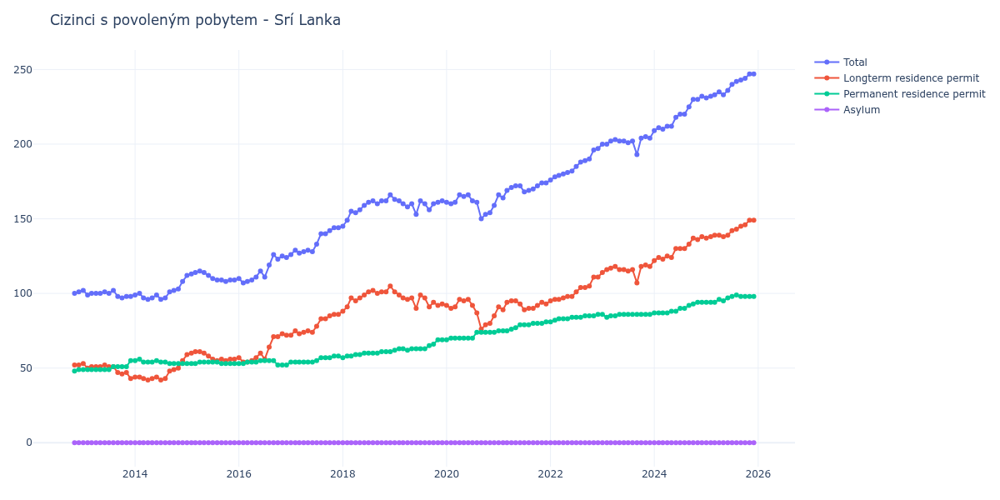

# Srí Lanka

## Souhrnné statistiky (Min/Max pro rok) / Summary Statistics (Min/Max per year)

| Year   | Total Min/Max   | Longterm Residence Permit Min/Max   | Permanent Residence Permit Min/Max   | Asylum Min/Max   |
|--------|-----------------|-------------------------------------|--------------------------------------|------------------|
| 2012   | 100 / 101       | 52 / 52                             | 48 / 49                              | 0 / 0            |
| 2013   | 97 / 102        | 43 / 53                             | 49 / 55                              | 0 / 0            |
| 2014   | 96 / 108        | 42 / 55                             | 53 / 56                              | 0 / 0            |
| 2015   | 108 / 115       | 55 / 61                             | 53 / 54                              | 0 / 0            |
| 2016   | 107 / 126       | 54 / 73                             | 52 / 55                              | 0 / 0            |
| 2017   | 126 / 144       | 72 / 86                             | 54 / 58                              | 0 / 0            |
| 2018   | 145 / 166       | 88 / 105                            | 57 / 61                              | 0 / 0            |
| 2019   | 153 / 163       | 90 / 101                            | 62 / 69                              | 0 / 0            |
| 2020   | 150 / 166       | 76 / 96                             | 69 / 74                              | 0 / 0            |
| 2021   | 164 / 174       | 89 / 95                             | 75 / 81                              | 0 / 0            |
| 2022   | 176 / 197       | 95 / 111                            | 81 / 86                              | 0 / 0            |
| 2023   | 193 / 205       | 107 / 119                           | 84 / 86                              | 0 / 0            |
| 2024   | 209 / 232       | 122 / 138                           | 87 / 94                              | 0 / 0            |
| 2025   | 231 / 247       | 137 / 149                           | 94 / 99                              | 0 / 0            |

## Detailní tabulka / Detailed Data Table

| Date     | Total        | Longterm Residence Permit   | Permanent Residence Permit   | Asylum   |
|----------|--------------|-----------------------------|------------------------------|----------|
| **2012** |              |                             |                              |          |
| 11.2012  | 100          | 52                          | 48                           | 0        |
| 12.2012  | 101 (+1.00%) | 52 (+0.00%)                 | 49 (+2.08%)                  | 0        |
| **2013** |              |                             |                              |          |
| 01.2013  | 102 (+0.99%) | 53 (+1.92%)                 | 49 (+0.00%)                  | 0        |
| 02.2013  | 99 (-2.94%)  | 50 (-5.66%)                 | 49 (+0.00%)                  | 0        |
| 03.2013  | 100 (+1.01%) | 51 (+2.00%)                 | 49 (+0.00%)                  | 0        |
| 04.2013  | 100 (+0.00%) | 51 (+0.00%)                 | 49 (+0.00%)                  | 0        |
| 05.2013  | 100 (+0.00%) | 51 (+0.00%)                 | 49 (+0.00%)                  | 0        |
| 06.2013  | 101 (+1.00%) | 52 (+1.96%)                 | 49 (+0.00%)                  | 0        |
| 07.2013  | 100 (-0.99%) | 51 (-1.92%)                 | 49 (+0.00%)                  | 0        |
| 08.2013  | 102 (+2.00%) | 51 (+0.00%)                 | 51 (+4.08%)                  | 0        |
| 09.2013  | 98 (-3.92%)  | 47 (-7.84%)                 | 51 (+0.00%)                  | 0        |
| 10.2013  | 97 (-1.02%)  | 46 (-2.13%)                 | 51 (+0.00%)                  | 0        |
| 11.2013  | 98 (+1.03%)  | 47 (+2.17%)                 | 51 (+0.00%)                  | 0        |
| 12.2013  | 98 (+0.00%)  | 43 (-8.51%)                 | 55 (+7.84%)                  | 0        |
| **2014** |              |                             |                              |          |
| 01.2014  | 99 (+1.02%)  | 44 (+2.33%)                 | 55 (+0.00%)                  | 0        |
| 02.2014  | 100 (+1.01%) | 44 (+0.00%)                 | 56 (+1.82%)                  | 0        |
| 03.2014  | 97 (-3.00%)  | 43 (-2.27%)                 | 54 (-3.57%)                  | 0        |
| 04.2014  | 96 (-1.03%)  | 42 (-2.33%)                 | 54 (+0.00%)                  | 0        |
| 05.2014  | 97 (+1.04%)  | 43 (+2.38%)                 | 54 (+0.00%)                  | 0        |
| 06.2014  | 99 (+2.06%)  | 44 (+2.33%)                 | 55 (+1.85%)                  | 0        |
| 07.2014  | 96 (-3.03%)  | 42 (-4.55%)                 | 54 (-1.82%)                  | 0        |
| 08.2014  | 97 (+1.04%)  | 43 (+2.38%)                 | 54 (+0.00%)                  | 0        |
| 09.2014  | 101 (+4.12%) | 48 (+11.63%)                | 53 (-1.85%)                  | 0        |
| 10.2014  | 102 (+0.99%) | 49 (+2.08%)                 | 53 (+0.00%)                  | 0        |
| 11.2014  | 103 (+0.98%) | 50 (+2.04%)                 | 53 (+0.00%)                  | 0        |
| 12.2014  | 108 (+4.85%) | 55 (+10.00%)                | 53 (+0.00%)                  | 0        |
| **2015** |              |                             |                              |          |
| 01.2015  | 112 (+3.70%) | 59 (+7.27%)                 | 53 (+0.00%)                  | 0        |
| 02.2015  | 113 (+0.89%) | 60 (+1.69%)                 | 53 (+0.00%)                  | 0        |
| 03.2015  | 114 (+0.88%) | 61 (+1.67%)                 | 53 (+0.00%)                  | 0        |
| 04.2015  | 115 (+0.88%) | 61 (+0.00%)                 | 54 (+1.89%)                  | 0        |
| 05.2015  | 114 (-0.87%) | 60 (-1.64%)                 | 54 (+0.00%)                  | 0        |
| 06.2015  | 112 (-1.75%) | 58 (-3.33%)                 | 54 (+0.00%)                  | 0        |
| 07.2015  | 110 (-1.79%) | 56 (-3.45%)                 | 54 (+0.00%)                  | 0        |
| 08.2015  | 109 (-0.91%) | 55 (-1.79%)                 | 54 (+0.00%)                  | 0        |
| 09.2015  | 109 (+0.00%) | 56 (+1.82%)                 | 53 (-1.85%)                  | 0        |
| 10.2015  | 108 (-0.92%) | 55 (-1.79%)                 | 53 (+0.00%)                  | 0        |
| 11.2015  | 109 (+0.93%) | 56 (+1.82%)                 | 53 (+0.00%)                  | 0        |
| 12.2015  | 109 (+0.00%) | 56 (+0.00%)                 | 53 (+0.00%)                  | 0        |
| **2016** |              |                             |                              |          |
| 01.2016  | 110 (+0.92%) | 57 (+1.79%)                 | 53 (+0.00%)                  | 0        |
| 02.2016  | 107 (-2.73%) | 54 (-5.26%)                 | 53 (+0.00%)                  | 0        |
| 03.2016  | 108 (+0.93%) | 54 (+0.00%)                 | 54 (+1.89%)                  | 0        |
| 04.2016  | 109 (+0.93%) | 55 (+1.85%)                 | 54 (+0.00%)                  | 0        |
| 05.2016  | 111 (+1.83%) | 57 (+3.64%)                 | 54 (+0.00%)                  | 0        |
| 06.2016  | 115 (+3.60%) | 60 (+5.26%)                 | 55 (+1.85%)                  | 0        |
| 07.2016  | 111 (-3.48%) | 56 (-6.67%)                 | 55 (+0.00%)                  | 0        |
| 08.2016  | 119 (+7.21%) | 64 (+14.29%)                | 55 (+0.00%)                  | 0        |
| 09.2016  | 126 (+5.88%) | 71 (+10.94%)                | 55 (+0.00%)                  | 0        |
| 10.2016  | 123 (-2.38%) | 71 (+0.00%)                 | 52 (-5.45%)                  | 0        |
| 11.2016  | 125 (+1.63%) | 73 (+2.82%)                 | 52 (+0.00%)                  | 0        |
| 12.2016  | 124 (-0.80%) | 72 (-1.37%)                 | 52 (+0.00%)                  | 0        |
| **2017** |              |                             |                              |          |
| 01.2017  | 126 (+1.61%) | 72 (+0.00%)                 | 54 (+3.85%)                  | 0        |
| 02.2017  | 129 (+2.38%) | 75 (+4.17%)                 | 54 (+0.00%)                  | 0        |
| 03.2017  | 127 (-1.55%) | 73 (-2.67%)                 | 54 (+0.00%)                  | 0        |
| 04.2017  | 128 (+0.79%) | 74 (+1.37%)                 | 54 (+0.00%)                  | 0        |
| 05.2017  | 129 (+0.78%) | 75 (+1.35%)                 | 54 (+0.00%)                  | 0        |
| 06.2017  | 128 (-0.78%) | 74 (-1.33%)                 | 54 (+0.00%)                  | 0        |
| 07.2017  | 133 (+3.91%) | 78 (+5.41%)                 | 55 (+1.85%)                  | 0        |
| 08.2017  | 140 (+5.26%) | 83 (+6.41%)                 | 57 (+3.64%)                  | 0        |
| 09.2017  | 140 (+0.00%) | 83 (+0.00%)                 | 57 (+0.00%)                  | 0        |
| 10.2017  | 142 (+1.43%) | 85 (+2.41%)                 | 57 (+0.00%)                  | 0        |
| 11.2017  | 144 (+1.41%) | 86 (+1.18%)                 | 58 (+1.75%)                  | 0        |
| 12.2017  | 144 (+0.00%) | 86 (+0.00%)                 | 58 (+0.00%)                  | 0        |
| **2018** |              |                             |                              |          |
| 01.2018  | 145 (+0.69%) | 88 (+2.33%)                 | 57 (-1.72%)                  | 0        |
| 02.2018  | 149 (+2.76%) | 91 (+3.41%)                 | 58 (+1.75%)                  | 0        |
| 03.2018  | 155 (+4.03%) | 97 (+6.59%)                 | 58 (+0.00%)                  | 0        |
| 04.2018  | 154 (-0.65%) | 95 (-2.06%)                 | 59 (+1.72%)                  | 0        |
| 05.2018  | 156 (+1.30%) | 97 (+2.11%)                 | 59 (+0.00%)                  | 0        |
| 06.2018  | 159 (+1.92%) | 99 (+2.06%)                 | 60 (+1.69%)                  | 0        |
| 07.2018  | 161 (+1.26%) | 101 (+2.02%)                | 60 (+0.00%)                  | 0        |
| 08.2018  | 162 (+0.62%) | 102 (+0.99%)                | 60 (+0.00%)                  | 0        |
| 09.2018  | 160 (-1.23%) | 100 (-1.96%)                | 60 (+0.00%)                  | 0        |
| 10.2018  | 162 (+1.25%) | 101 (+1.00%)                | 61 (+1.67%)                  | 0        |
| 11.2018  | 162 (+0.00%) | 101 (+0.00%)                | 61 (+0.00%)                  | 0        |
| 12.2018  | 166 (+2.47%) | 105 (+3.96%)                | 61 (+0.00%)                  | 0        |
| **2019** |              |                             |                              |          |
| 01.2019  | 163 (-1.81%) | 101 (-3.81%)                | 62 (+1.64%)                  | 0        |
| 02.2019  | 162 (-0.61%) | 99 (-1.98%)                 | 63 (+1.61%)                  | 0        |
| 03.2019  | 160 (-1.23%) | 97 (-2.02%)                 | 63 (+0.00%)                  | 0        |
| 04.2019  | 158 (-1.25%) | 96 (-1.03%)                 | 62 (-1.59%)                  | 0        |
| 05.2019  | 160 (+1.27%) | 97 (+1.04%)                 | 63 (+1.61%)                  | 0        |
| 06.2019  | 153 (-4.37%) | 90 (-7.22%)                 | 63 (+0.00%)                  | 0        |
| 07.2019  | 162 (+5.88%) | 99 (+10.00%)                | 63 (+0.00%)                  | 0        |
| 08.2019  | 160 (-1.23%) | 97 (-2.02%)                 | 63 (+0.00%)                  | 0        |
| 09.2019  | 156 (-2.50%) | 91 (-6.19%)                 | 65 (+3.17%)                  | 0        |
| 10.2019  | 160 (+2.56%) | 94 (+3.30%)                 | 66 (+1.54%)                  | 0        |
| 11.2019  | 161 (+0.63%) | 92 (-2.13%)                 | 69 (+4.55%)                  | 0        |
| 12.2019  | 162 (+0.62%) | 93 (+1.09%)                 | 69 (+0.00%)                  | 0        |
| **2020** |              |                             |                              |          |
| 01.2020  | 161 (-0.62%) | 92 (-1.08%)                 | 69 (+0.00%)                  | 0        |
| 02.2020  | 160 (-0.62%) | 90 (-2.17%)                 | 70 (+1.45%)                  | 0        |
| 03.2020  | 161 (+0.63%) | 91 (+1.11%)                 | 70 (+0.00%)                  | 0        |
| 04.2020  | 166 (+3.11%) | 96 (+5.49%)                 | 70 (+0.00%)                  | 0        |
| 05.2020  | 165 (-0.60%) | 95 (-1.04%)                 | 70 (+0.00%)                  | 0        |
| 06.2020  | 166 (+0.61%) | 96 (+1.05%)                 | 70 (+0.00%)                  | 0        |
| 07.2020  | 162 (-2.41%) | 92 (-4.17%)                 | 70 (+0.00%)                  | 0        |
| 08.2020  | 161 (-0.62%) | 87 (-5.43%)                 | 74 (+5.71%)                  | 0        |
| 09.2020  | 150 (-6.83%) | 76 (-12.64%)                | 74 (+0.00%)                  | 0        |
| 10.2020  | 153 (+2.00%) | 79 (+3.95%)                 | 74 (+0.00%)                  | 0        |
| 11.2020  | 154 (+0.65%) | 80 (+1.27%)                 | 74 (+0.00%)                  | 0        |
| 12.2020  | 159 (+3.25%) | 85 (+6.25%)                 | 74 (+0.00%)                  | 0        |
| **2021** |              |                             |                              |          |
| 01.2021  | 166 (+4.40%) | 91 (+7.06%)                 | 75 (+1.35%)                  | 0        |
| 02.2021  | 164 (-1.20%) | 89 (-2.20%)                 | 75 (+0.00%)                  | 0        |
| 03.2021  | 169 (+3.05%) | 94 (+5.62%)                 | 75 (+0.00%)                  | 0        |
| 04.2021  | 171 (+1.18%) | 95 (+1.06%)                 | 76 (+1.33%)                  | 0        |
| 05.2021  | 172 (+0.58%) | 95 (+0.00%)                 | 77 (+1.32%)                  | 0        |
| 06.2021  | 172 (+0.00%) | 93 (-2.11%)                 | 79 (+2.60%)                  | 0        |
| 07.2021  | 168 (-2.33%) | 89 (-4.30%)                 | 79 (+0.00%)                  | 0        |
| 08.2021  | 169 (+0.60%) | 90 (+1.12%)                 | 79 (+0.00%)                  | 0        |
| 09.2021  | 170 (+0.59%) | 90 (+0.00%)                 | 80 (+1.27%)                  | 0        |
| 10.2021  | 172 (+1.18%) | 92 (+2.22%)                 | 80 (+0.00%)                  | 0        |
| 11.2021  | 174 (+1.16%) | 94 (+2.17%)                 | 80 (+0.00%)                  | 0        |
| 12.2021  | 174 (+0.00%) | 93 (-1.06%)                 | 81 (+1.25%)                  | 0        |
| **2022** |              |                             |                              |          |
| 01.2022  | 176 (+1.15%) | 95 (+2.15%)                 | 81 (+0.00%)                  | 0        |
| 02.2022  | 178 (+1.14%) | 96 (+1.05%)                 | 82 (+1.23%)                  | 0        |
| 03.2022  | 179 (+0.56%) | 96 (+0.00%)                 | 83 (+1.22%)                  | 0        |
| 04.2022  | 180 (+0.56%) | 97 (+1.04%)                 | 83 (+0.00%)                  | 0        |
| 05.2022  | 181 (+0.56%) | 98 (+1.03%)                 | 83 (+0.00%)                  | 0        |
| 06.2022  | 182 (+0.55%) | 98 (+0.00%)                 | 84 (+1.20%)                  | 0        |
| 07.2022  | 185 (+1.65%) | 101 (+3.06%)                | 84 (+0.00%)                  | 0        |
| 08.2022  | 188 (+1.62%) | 104 (+2.97%)                | 84 (+0.00%)                  | 0        |
| 09.2022  | 189 (+0.53%) | 104 (+0.00%)                | 85 (+1.19%)                  | 0        |
| 10.2022  | 190 (+0.53%) | 105 (+0.96%)                | 85 (+0.00%)                  | 0        |
| 11.2022  | 196 (+3.16%) | 111 (+5.71%)                | 85 (+0.00%)                  | 0        |
| 12.2022  | 197 (+0.51%) | 111 (+0.00%)                | 86 (+1.18%)                  | 0        |
| **2023** |              |                             |                              |          |
| 01.2023  | 200 (+1.52%) | 114 (+2.70%)                | 86 (+0.00%)                  | 0        |
| 02.2023  | 200 (+0.00%) | 116 (+1.75%)                | 84 (-2.33%)                  | 0        |
| 03.2023  | 202 (+1.00%) | 117 (+0.86%)                | 85 (+1.19%)                  | 0        |
| 04.2023  | 203 (+0.50%) | 118 (+0.85%)                | 85 (+0.00%)                  | 0        |
| 05.2023  | 202 (-0.49%) | 116 (-1.69%)                | 86 (+1.18%)                  | 0        |
| 06.2023  | 202 (+0.00%) | 116 (+0.00%)                | 86 (+0.00%)                  | 0        |
| 07.2023  | 201 (-0.50%) | 115 (-0.86%)                | 86 (+0.00%)                  | 0        |
| 08.2023  | 202 (+0.50%) | 116 (+0.87%)                | 86 (+0.00%)                  | 0        |
| 09.2023  | 193 (-4.46%) | 107 (-7.76%)                | 86 (+0.00%)                  | 0        |
| 10.2023  | 204 (+5.70%) | 118 (+10.28%)               | 86 (+0.00%)                  | 0        |
| 11.2023  | 205 (+0.49%) | 119 (+0.85%)                | 86 (+0.00%)                  | 0        |
| 12.2023  | 204 (-0.49%) | 118 (-0.84%)                | 86 (+0.00%)                  | 0        |
| **2024** |              |                             |                              |          |
| 01.2024  | 209 (+2.45%) | 122 (+3.39%)                | 87 (+1.16%)                  | 0        |
| 02.2024  | 211 (+0.96%) | 124 (+1.64%)                | 87 (+0.00%)                  | 0        |
| 03.2024  | 210 (-0.47%) | 123 (-0.81%)                | 87 (+0.00%)                  | 0        |
| 04.2024  | 212 (+0.95%) | 125 (+1.63%)                | 87 (+0.00%)                  | 0        |
| 05.2024  | 212 (+0.00%) | 124 (-0.80%)                | 88 (+1.15%)                  | 0        |
| 06.2024  | 218 (+2.83%) | 130 (+4.84%)                | 88 (+0.00%)                  | 0        |
| 07.2024  | 220 (+0.92%) | 130 (+0.00%)                | 90 (+2.27%)                  | 0        |
| 08.2024  | 220 (+0.00%) | 130 (+0.00%)                | 90 (+0.00%)                  | 0        |
| 09.2024  | 225 (+2.27%) | 133 (+2.31%)                | 92 (+2.22%)                  | 0        |
| 10.2024  | 230 (+2.22%) | 137 (+3.01%)                | 93 (+1.09%)                  | 0        |
| 11.2024  | 230 (+0.00%) | 136 (-0.73%)                | 94 (+1.08%)                  | 0        |
| 12.2024  | 232 (+0.87%) | 138 (+1.47%)                | 94 (+0.00%)                  | 0        |
| **2025** |              |                             |                              |          |
| 01.2025  | 231 (-0.43%) | 137 (-0.72%)                | 94 (+0.00%)                  | 0        |
| 02.2025  | 232 (+0.43%) | 138 (+0.73%)                | 94 (+0.00%)                  | 0        |
| 03.2025  | 233 (+0.43%) | 139 (+0.72%)                | 94 (+0.00%)                  | 0        |
| 04.2025  | 235 (+0.86%) | 139 (+0.00%)                | 96 (+2.13%)                  | 0        |
| 05.2025  | 233 (-0.85%) | 138 (-0.72%)                | 95 (-1.04%)                  | 0        |
| 06.2025  | 236 (+1.29%) | 139 (+0.72%)                | 97 (+2.11%)                  | 0        |
| 07.2025  | 240 (+1.69%) | 142 (+2.16%)                | 98 (+1.03%)                  | 0        |
| 08.2025  | 242 (+0.83%) | 143 (+0.70%)                | 99 (+1.02%)                  | 0        |
| 09.2025  | 243 (+0.41%) | 145 (+1.40%)                | 98 (-1.01%)                  | 0        |
| 10.2025  | 244 (+0.41%) | 146 (+0.69%)                | 98 (+0.00%)                  | 0        |
| 11.2025  | 247 (+1.23%) | 149 (+2.05%)                | 98 (+0.00%)                  | 0        |
| 12.2025  | 247 (+0.00%) | 149 (+0.00%)                | 98 (+0.00%)                  | 0        |
