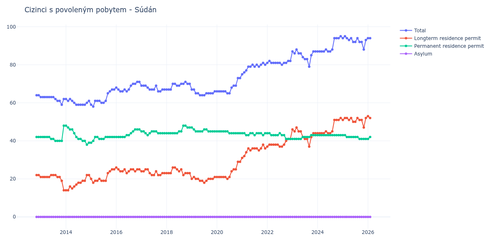

# Súdán

## Souhrnné statistiky (Min/Max pro rok) / Summary Statistics (Min/Max per year)

| Year   | Total   | Longterm Residence Permit   | Permanent Residence Permit   | Asylum   |
|--------|---------|-----------------------------|------------------------------|----------|
| 2012   | 64 / 64 | 22 / 22                     | 42 / 42                      | 0 / 0    |
| 2013   | 59 / 63 | 14 / 22                     | 40 / 48                      | 0 / 0    |
| 2014   | 59 / 62 | 14 / 22                     | 38 / 48                      | 0 / 0    |
| 2015   | 58 / 67 | 18 / 25                     | 39 / 42                      | 0 / 0    |
| 2016   | 66 / 71 | 23 / 26                     | 42 / 46                      | 0 / 0    |
| 2017   | 66 / 69 | 22 / 25                     | 43 / 45                      | 0 / 0    |
| 2018   | 67 / 71 | 22 / 26                     | 44 / 48                      | 0 / 0    |
| 2019   | 64 / 67 | 18 / 21                     | 45 / 47                      | 0 / 0    |
| 2020   | 65 / 73 | 20 / 29                     | 44 / 45                      | 0 / 0    |
| 2021   | 75 / 81 | 31 / 38                     | 43 / 44                      | 0 / 0    |
| 2022   | 80 / 82 | 37 / 41                     | 41 / 44                      | 0 / 0    |
| 2023   | 79 / 88 | 37 / 47                     | 41 / 43                      | 0 / 0    |
| 2024   | 87 / 95 | 44 / 52                     | 43 / 43                      | 0 / 0    |
| 2025   | 88 / 95 | 47 / 52                     | 41 / 43                      | 0 / 0    |
| 2026   | 94 / 94 | 52 / 53                     | 41 / 42                      | 0 / 0    |

## Detailní tabulka / Detailed Data Table

| Date     | Total       | Longterm Residence Permit   | Permanent Residence Permit   | Asylum   |
|----------|-------------|-----------------------------|------------------------------|----------|
| **2012** |             |                             |                              |          |
| 11.2012  | 64          | 22                          | 42                           | 0        |
| 12.2012  | 64 (+0.00%) | 22 (+0.00%)                 | 42 (+0.00%)                  | 0        |
| **2013** |             |                             |                              |          |
| 01.2013  | 63 (-1.56%) | 21 (-4.55%)                 | 42 (+0.00%)                  | 0        |
| 02.2013  | 63 (+0.00%) | 21 (+0.00%)                 | 42 (+0.00%)                  | 0        |
| 03.2013  | 63 (+0.00%) | 21 (+0.00%)                 | 42 (+0.00%)                  | 0        |
| 04.2013  | 63 (+0.00%) | 21 (+0.00%)                 | 42 (+0.00%)                  | 0        |
| 05.2013  | 63 (+0.00%) | 21 (+0.00%)                 | 42 (+0.00%)                  | 0        |
| 06.2013  | 63 (+0.00%) | 22 (+4.76%)                 | 41 (-2.38%)                  | 0        |
| 07.2013  | 63 (+0.00%) | 22 (+0.00%)                 | 41 (+0.00%)                  | 0        |
| 08.2013  | 62 (-1.59%) | 22 (+0.00%)                 | 40 (-2.44%)                  | 0        |
| 09.2013  | 61 (-1.61%) | 21 (-4.55%)                 | 40 (+0.00%)                  | 0        |
| 10.2013  | 61 (+0.00%) | 21 (+0.00%)                 | 40 (+0.00%)                  | 0        |
| 11.2013  | 59 (-3.28%) | 19 (-9.52%)                 | 40 (+0.00%)                  | 0        |
| 12.2013  | 62 (+5.08%) | 14 (-26.32%)                | 48 (+20.00%)                 | 0        |
| **2014** |             |                             |                              |          |
| 01.2014  | 62 (+0.00%) | 14 (+0.00%)                 | 48 (+0.00%)                  | 0        |
| 02.2014  | 61 (-1.61%) | 14 (+0.00%)                 | 47 (-2.08%)                  | 0        |
| 03.2014  | 62 (+1.64%) | 16 (+14.29%)                | 46 (-2.13%)                  | 0        |
| 04.2014  | 61 (-1.61%) | 15 (-6.25%)                 | 46 (+0.00%)                  | 0        |
| 05.2014  | 60 (-1.64%) | 16 (+6.67%)                 | 44 (-4.35%)                  | 0        |
| 06.2014  | 59 (-1.67%) | 17 (+6.25%)                 | 42 (-4.55%)                  | 0        |
| 07.2014  | 59 (+0.00%) | 18 (+5.88%)                 | 41 (-2.38%)                  | 0        |
| 08.2014  | 59 (+0.00%) | 18 (+0.00%)                 | 41 (+0.00%)                  | 0        |
| 09.2014  | 59 (+0.00%) | 19 (+5.56%)                 | 40 (-2.44%)                  | 0        |
| 10.2014  | 59 (+0.00%) | 19 (+0.00%)                 | 40 (+0.00%)                  | 0        |
| 11.2014  | 60 (+1.69%) | 22 (+15.79%)                | 38 (-5.00%)                  | 0        |
| 12.2014  | 61 (+1.67%) | 22 (+0.00%)                 | 39 (+2.63%)                  | 0        |
| **2015** |             |                             |                              |          |
| 01.2015  | 59 (-3.28%) | 20 (-9.09%)                 | 39 (+0.00%)                  | 0        |
| 02.2015  | 58 (-1.69%) | 18 (-10.00%)                | 40 (+2.56%)                  | 0        |
| 03.2015  | 61 (+5.17%) | 19 (+5.56%)                 | 42 (+5.00%)                  | 0        |
| 04.2015  | 61 (+0.00%) | 19 (+0.00%)                 | 42 (+0.00%)                  | 0        |
| 05.2015  | 61 (+0.00%) | 20 (+5.26%)                 | 41 (-2.38%)                  | 0        |
| 06.2015  | 60 (-1.64%) | 19 (-5.00%)                 | 41 (+0.00%)                  | 0        |
| 07.2015  | 60 (+0.00%) | 19 (+0.00%)                 | 41 (+0.00%)                  | 0        |
| 08.2015  | 61 (+1.67%) | 19 (+0.00%)                 | 42 (+2.44%)                  | 0        |
| 09.2015  | 65 (+6.56%) | 23 (+21.05%)                | 42 (+0.00%)                  | 0        |
| 10.2015  | 66 (+1.54%) | 24 (+4.35%)                 | 42 (+0.00%)                  | 0        |
| 11.2015  | 67 (+1.52%) | 25 (+4.17%)                 | 42 (+0.00%)                  | 0        |
| 12.2015  | 67 (+0.00%) | 25 (+0.00%)                 | 42 (+0.00%)                  | 0        |
| **2016** |             |                             |                              |          |
| 01.2016  | 68 (+1.49%) | 26 (+4.00%)                 | 42 (+0.00%)                  | 0        |
| 02.2016  | 67 (-1.47%) | 25 (-3.85%)                 | 42 (+0.00%)                  | 0        |
| 03.2016  | 66 (-1.49%) | 24 (-4.00%)                 | 42 (+0.00%)                  | 0        |
| 04.2016  | 66 (+0.00%) | 24 (+0.00%)                 | 42 (+0.00%)                  | 0        |
| 05.2016  | 67 (+1.52%) | 25 (+4.17%)                 | 42 (+0.00%)                  | 0        |
| 06.2016  | 66 (-1.49%) | 23 (-8.00%)                 | 43 (+2.38%)                  | 0        |
| 07.2016  | 67 (+1.52%) | 24 (+4.35%)                 | 43 (+0.00%)                  | 0        |
| 08.2016  | 69 (+2.99%) | 25 (+4.17%)                 | 44 (+2.33%)                  | 0        |
| 09.2016  | 70 (+1.45%) | 25 (+0.00%)                 | 45 (+2.27%)                  | 0        |
| 10.2016  | 70 (+0.00%) | 24 (-4.00%)                 | 46 (+2.22%)                  | 0        |
| 11.2016  | 71 (+1.43%) | 25 (+4.17%)                 | 46 (+0.00%)                  | 0        |
| 12.2016  | 71 (+0.00%) | 25 (+0.00%)                 | 46 (+0.00%)                  | 0        |
| **2017** |             |                             |                              |          |
| 01.2017  | 69 (-2.82%) | 24 (-4.00%)                 | 45 (-2.17%)                  | 0        |
| 02.2017  | 69 (+0.00%) | 24 (+0.00%)                 | 45 (+0.00%)                  | 0        |
| 03.2017  | 69 (+0.00%) | 25 (+4.17%)                 | 44 (-2.22%)                  | 0        |
| 04.2017  | 68 (-1.45%) | 25 (+0.00%)                 | 43 (-2.27%)                  | 0        |
| 05.2017  | 67 (-1.47%) | 23 (-8.00%)                 | 44 (+2.33%)                  | 0        |
| 06.2017  | 67 (+0.00%) | 22 (-4.35%)                 | 45 (+2.27%)                  | 0        |
| 07.2017  | 67 (+0.00%) | 22 (+0.00%)                 | 45 (+0.00%)                  | 0        |
| 08.2017  | 69 (+2.99%) | 24 (+9.09%)                 | 45 (+0.00%)                  | 0        |
| 09.2017  | 66 (-4.35%) | 22 (-8.33%)                 | 44 (-2.22%)                  | 0        |
| 10.2017  | 66 (+0.00%) | 22 (+0.00%)                 | 44 (+0.00%)                  | 0        |
| 11.2017  | 67 (+1.52%) | 23 (+4.55%)                 | 44 (+0.00%)                  | 0        |
| 12.2017  | 67 (+0.00%) | 23 (+0.00%)                 | 44 (+0.00%)                  | 0        |
| **2018** |             |                             |                              |          |
| 01.2018  | 67 (+0.00%) | 23 (+0.00%)                 | 44 (+0.00%)                  | 0        |
| 02.2018  | 67 (+0.00%) | 23 (+0.00%)                 | 44 (+0.00%)                  | 0        |
| 03.2018  | 67 (+0.00%) | 23 (+0.00%)                 | 44 (+0.00%)                  | 0        |
| 04.2018  | 70 (+4.48%) | 26 (+13.04%)                | 44 (+0.00%)                  | 0        |
| 05.2018  | 70 (+0.00%) | 26 (+0.00%)                 | 44 (+0.00%)                  | 0        |
| 06.2018  | 69 (-1.43%) | 25 (-3.85%)                 | 44 (+0.00%)                  | 0        |
| 07.2018  | 69 (+0.00%) | 24 (-4.00%)                 | 45 (+2.27%)                  | 0        |
| 08.2018  | 70 (+1.45%) | 25 (+4.17%)                 | 45 (+0.00%)                  | 0        |
| 09.2018  | 70 (+0.00%) | 22 (-12.00%)                | 48 (+6.67%)                  | 0        |
| 10.2018  | 71 (+1.43%) | 23 (+4.55%)                 | 48 (+0.00%)                  | 0        |
| 11.2018  | 70 (-1.41%) | 23 (+0.00%)                 | 47 (-2.08%)                  | 0        |
| 12.2018  | 70 (+0.00%) | 23 (+0.00%)                 | 47 (+0.00%)                  | 0        |
| **2019** |             |                             |                              |          |
| 01.2019  | 67 (-4.29%) | 20 (-13.04%)                | 47 (+0.00%)                  | 0        |
| 02.2019  | 67 (+0.00%) | 21 (+5.00%)                 | 46 (-2.13%)                  | 0        |
| 03.2019  | 65 (-2.99%) | 20 (-4.76%)                 | 45 (-2.17%)                  | 0        |
| 04.2019  | 65 (+0.00%) | 20 (+0.00%)                 | 45 (+0.00%)                  | 0        |
| 05.2019  | 64 (-1.54%) | 19 (-5.00%)                 | 45 (+0.00%)                  | 0        |
| 06.2019  | 64 (+0.00%) | 19 (+0.00%)                 | 45 (+0.00%)                  | 0        |
| 07.2019  | 64 (+0.00%) | 18 (-5.26%)                 | 46 (+2.22%)                  | 0        |
| 08.2019  | 65 (+1.56%) | 19 (+5.56%)                 | 46 (+0.00%)                  | 0        |
| 09.2019  | 65 (+0.00%) | 20 (+5.26%)                 | 45 (-2.17%)                  | 0        |
| 10.2019  | 65 (+0.00%) | 20 (+0.00%)                 | 45 (+0.00%)                  | 0        |
| 11.2019  | 65 (+0.00%) | 20 (+0.00%)                 | 45 (+0.00%)                  | 0        |
| 12.2019  | 66 (+1.54%) | 21 (+5.00%)                 | 45 (+0.00%)                  | 0        |
| **2020** |             |                             |                              |          |
| 01.2020  | 66 (+0.00%) | 21 (+0.00%)                 | 45 (+0.00%)                  | 0        |
| 02.2020  | 66 (+0.00%) | 21 (+0.00%)                 | 45 (+0.00%)                  | 0        |
| 03.2020  | 66 (+0.00%) | 21 (+0.00%)                 | 45 (+0.00%)                  | 0        |
| 04.2020  | 66 (+0.00%) | 21 (+0.00%)                 | 45 (+0.00%)                  | 0        |
| 05.2020  | 66 (+0.00%) | 21 (+0.00%)                 | 45 (+0.00%)                  | 0        |
| 06.2020  | 65 (-1.52%) | 20 (-4.76%)                 | 45 (+0.00%)                  | 0        |
| 07.2020  | 65 (+0.00%) | 21 (+5.00%)                 | 44 (-2.22%)                  | 0        |
| 08.2020  | 68 (+4.62%) | 24 (+14.29%)                | 44 (+0.00%)                  | 0        |
| 09.2020  | 69 (+1.47%) | 25 (+4.17%)                 | 44 (+0.00%)                  | 0        |
| 10.2020  | 69 (+0.00%) | 25 (+0.00%)                 | 44 (+0.00%)                  | 0        |
| 11.2020  | 73 (+5.80%) | 29 (+16.00%)                | 44 (+0.00%)                  | 0        |
| 12.2020  | 73 (+0.00%) | 29 (+0.00%)                 | 44 (+0.00%)                  | 0        |
| **2021** |             |                             |                              |          |
| 01.2021  | 75 (+2.74%) | 31 (+6.90%)                 | 44 (+0.00%)                  | 0        |
| 02.2021  | 76 (+1.33%) | 32 (+3.23%)                 | 44 (+0.00%)                  | 0        |
| 03.2021  | 77 (+1.32%) | 34 (+6.25%)                 | 43 (-2.27%)                  | 0        |
| 04.2021  | 79 (+2.60%) | 36 (+5.88%)                 | 43 (+0.00%)                  | 0        |
| 05.2021  | 79 (+0.00%) | 35 (-2.78%)                 | 44 (+2.33%)                  | 0        |
| 06.2021  | 80 (+1.27%) | 36 (+2.86%)                 | 44 (+0.00%)                  | 0        |
| 07.2021  | 79 (-1.25%) | 36 (+0.00%)                 | 43 (-2.27%)                  | 0        |
| 08.2021  | 80 (+1.27%) | 36 (+0.00%)                 | 44 (+2.33%)                  | 0        |
| 09.2021  | 79 (-1.25%) | 35 (-2.78%)                 | 44 (+0.00%)                  | 0        |
| 10.2021  | 80 (+1.27%) | 36 (+2.86%)                 | 44 (+0.00%)                  | 0        |
| 11.2021  | 81 (+1.25%) | 38 (+5.56%)                 | 43 (-2.27%)                  | 0        |
| 12.2021  | 80 (-1.23%) | 36 (-5.26%)                 | 44 (+2.33%)                  | 0        |
| **2022** |             |                             |                              |          |
| 01.2022  | 81 (+1.25%) | 37 (+2.78%)                 | 44 (+0.00%)                  | 0        |
| 02.2022  | 82 (+1.23%) | 38 (+2.70%)                 | 44 (+0.00%)                  | 0        |
| 03.2022  | 81 (-1.22%) | 38 (+0.00%)                 | 43 (-2.27%)                  | 0        |
| 04.2022  | 81 (+0.00%) | 38 (+0.00%)                 | 43 (+0.00%)                  | 0        |
| 05.2022  | 81 (+0.00%) | 38 (+0.00%)                 | 43 (+0.00%)                  | 0        |
| 06.2022  | 81 (+0.00%) | 38 (+0.00%)                 | 43 (+0.00%)                  | 0        |
| 07.2022  | 81 (+0.00%) | 37 (-2.63%)                 | 44 (+2.33%)                  | 0        |
| 08.2022  | 80 (-1.23%) | 37 (+0.00%)                 | 43 (-2.27%)                  | 0        |
| 09.2022  | 81 (+1.25%) | 38 (+2.70%)                 | 43 (+0.00%)                  | 0        |
| 10.2022  | 81 (+0.00%) | 40 (+5.26%)                 | 41 (-4.65%)                  | 0        |
| 11.2022  | 82 (+1.23%) | 41 (+2.50%)                 | 41 (+0.00%)                  | 0        |
| 12.2022  | 82 (+0.00%) | 41 (+0.00%)                 | 41 (+0.00%)                  | 0        |
| **2023** |             |                             |                              |          |
| 01.2023  | 87 (+6.10%) | 46 (+12.20%)                | 41 (+0.00%)                  | 0        |
| 02.2023  | 86 (-1.15%) | 45 (-2.17%)                 | 41 (+0.00%)                  | 0        |
| 03.2023  | 88 (+2.33%) | 47 (+4.44%)                 | 41 (+0.00%)                  | 0        |
| 04.2023  | 86 (-2.27%) | 45 (-4.26%)                 | 41 (+0.00%)                  | 0        |
| 05.2023  | 86 (+0.00%) | 45 (+0.00%)                 | 41 (+0.00%)                  | 0        |
| 06.2023  | 84 (-2.33%) | 42 (-6.67%)                 | 42 (+2.44%)                  | 0        |
| 07.2023  | 83 (-1.19%) | 41 (-2.38%)                 | 42 (+0.00%)                  | 0        |
| 08.2023  | 83 (+0.00%) | 41 (+0.00%)                 | 42 (+0.00%)                  | 0        |
| 09.2023  | 79 (-4.82%) | 37 (-9.76%)                 | 42 (+0.00%)                  | 0        |
| 10.2023  | 85 (+7.59%) | 42 (+13.51%)                | 43 (+2.38%)                  | 0        |
| 11.2023  | 87 (+2.35%) | 44 (+4.76%)                 | 43 (+0.00%)                  | 0        |
| 12.2023  | 87 (+0.00%) | 44 (+0.00%)                 | 43 (+0.00%)                  | 0        |
| **2024** |             |                             |                              |          |
| 01.2024  | 87 (+0.00%) | 44 (+0.00%)                 | 43 (+0.00%)                  | 0        |
| 02.2024  | 87 (+0.00%) | 44 (+0.00%)                 | 43 (+0.00%)                  | 0        |
| 03.2024  | 87 (+0.00%) | 44 (+0.00%)                 | 43 (+0.00%)                  | 0        |
| 04.2024  | 87 (+0.00%) | 44 (+0.00%)                 | 43 (+0.00%)                  | 0        |
| 05.2024  | 88 (+1.15%) | 45 (+2.27%)                 | 43 (+0.00%)                  | 0        |
| 06.2024  | 87 (-1.14%) | 44 (-2.22%)                 | 43 (+0.00%)                  | 0        |
| 07.2024  | 87 (+0.00%) | 44 (+0.00%)                 | 43 (+0.00%)                  | 0        |
| 08.2024  | 88 (+1.15%) | 45 (+2.27%)                 | 43 (+0.00%)                  | 0        |
| 09.2024  | 94 (+6.82%) | 51 (+13.33%)                | 43 (+0.00%)                  | 0        |
| 10.2024  | 94 (+0.00%) | 51 (+0.00%)                 | 43 (+0.00%)                  | 0        |
| 11.2024  | 94 (+0.00%) | 51 (+0.00%)                 | 43 (+0.00%)                  | 0        |
| 12.2024  | 95 (+1.06%) | 52 (+1.96%)                 | 43 (+0.00%)                  | 0        |
| **2025** |             |                             |                              |          |
| 01.2025  | 94 (-1.05%) | 51 (-1.92%)                 | 43 (+0.00%)                  | 0        |
| 02.2025  | 95 (+1.06%) | 52 (+1.96%)                 | 43 (+0.00%)                  | 0        |
| 03.2025  | 94 (-1.05%) | 52 (+0.00%)                 | 42 (-2.33%)                  | 0        |
| 04.2025  | 93 (-1.06%) | 51 (-1.92%)                 | 42 (+0.00%)                  | 0        |
| 05.2025  | 94 (+1.08%) | 52 (+1.96%)                 | 42 (+0.00%)                  | 0        |
| 06.2025  | 92 (-2.13%) | 50 (-3.85%)                 | 42 (+0.00%)                  | 0        |
| 07.2025  | 92 (+0.00%) | 50 (+0.00%)                 | 42 (+0.00%)                  | 0        |
| 08.2025  | 94 (+2.17%) | 52 (+4.00%)                 | 42 (+0.00%)                  | 0        |
| 09.2025  | 92 (-2.13%) | 51 (-1.92%)                 | 41 (-2.38%)                  | 0        |
| 10.2025  | 92 (+0.00%) | 51 (+0.00%)                 | 41 (+0.00%)                  | 0        |
| 11.2025  | 88 (-4.35%) | 47 (-7.84%)                 | 41 (+0.00%)                  | 0        |
| 12.2025  | 93 (+5.68%) | 52 (+10.64%)                | 41 (+0.00%)                  | 0        |
| **2026** |             |                             |                              |          |
| 01.2026  | 94 (+1.08%) | 53 (+1.92%)                 | 41 (+0.00%)                  | 0        |
| 02.2026  | 94 (+0.00%) | 52 (-1.89%)                 | 42 (+2.44%)                  | 0        |
