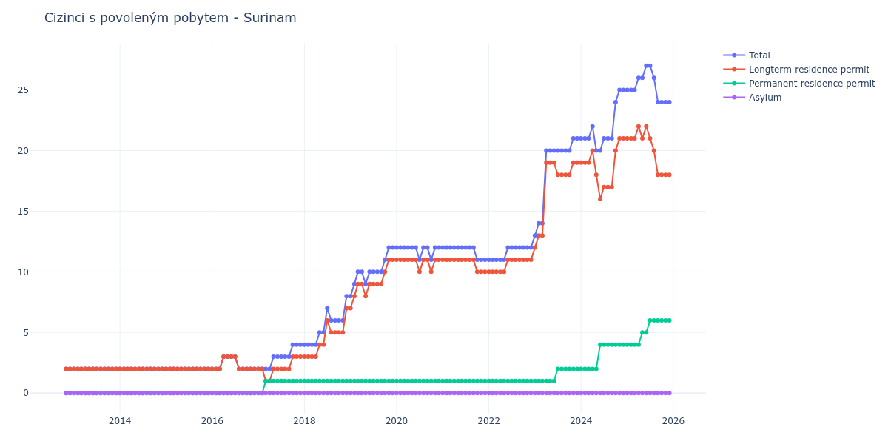

# Surinam

## Souhrnné statistiky (Min/Max pro rok) / Summary Statistics (Min/Max per year)

| Year   | Total Min/Max   | Longterm Residence Permit Min/Max   | Permanent Residence Permit Min/Max   | Asylum Min/Max   |
|--------|-----------------|-------------------------------------|--------------------------------------|------------------|
| 2012   | 2 / 2           | 2 / 2                               | 0 / 0                                | 0 / 0            |
| 2013   | 2 / 2           | 2 / 2                               | 0 / 0                                | 0 / 0            |
| 2014   | 2 / 2           | 2 / 2                               | 0 / 0                                | 0 / 0            |
| 2015   | 2 / 2           | 2 / 2                               | 0 / 0                                | 0 / 0            |
| 2016   | 2 / 3           | 2 / 3                               | 0 / 0                                | 0 / 0            |
| 2017   | 2 / 4           | 1 / 3                               | 0 / 1                                | 0 / 0            |
| 2018   | 4 / 8           | 3 / 7                               | 1 / 1                                | 0 / 0            |
| 2019   | 8 / 12          | 7 / 11                              | 1 / 1                                | 0 / 0            |
| 2020   | 11 / 12         | 10 / 11                             | 1 / 1                                | 0 / 0            |
| 2021   | 11 / 12         | 10 / 11                             | 1 / 1                                | 0 / 0            |
| 2022   | 11 / 12         | 10 / 11                             | 1 / 1                                | 0 / 0            |
| 2023   | 13 / 21         | 12 / 19                             | 1 / 2                                | 0 / 0            |
| 2024   | 20 / 25         | 16 / 21                             | 2 / 4                                | 0 / 0            |
| 2025   | 24 / 27         | 18 / 22                             | 4 / 6                                | 0 / 0            |

## Detailní tabulka / Detailed Data Table

| Date     | Total        | Longterm Residence Permit   | Permanent Residence Permit   | Asylum   |
|----------|--------------|-----------------------------|------------------------------|----------|
| **2012** |              |                             |                              |          |
| 11.2012  | 2            | 2                           | 0                            | 0        |
| 12.2012  | 2 (+0.00%)   | 2 (+0.00%)                  | 0                            | 0        |
| **2013** |              |                             |                              |          |
| 01.2013  | 2 (+0.00%)   | 2 (+0.00%)                  | 0                            | 0        |
| 02.2013  | 2 (+0.00%)   | 2 (+0.00%)                  | 0                            | 0        |
| 03.2013  | 2 (+0.00%)   | 2 (+0.00%)                  | 0                            | 0        |
| 04.2013  | 2 (+0.00%)   | 2 (+0.00%)                  | 0                            | 0        |
| 05.2013  | 2 (+0.00%)   | 2 (+0.00%)                  | 0                            | 0        |
| 06.2013  | 2 (+0.00%)   | 2 (+0.00%)                  | 0                            | 0        |
| 07.2013  | 2 (+0.00%)   | 2 (+0.00%)                  | 0                            | 0        |
| 08.2013  | 2 (+0.00%)   | 2 (+0.00%)                  | 0                            | 0        |
| 09.2013  | 2 (+0.00%)   | 2 (+0.00%)                  | 0                            | 0        |
| 10.2013  | 2 (+0.00%)   | 2 (+0.00%)                  | 0                            | 0        |
| 11.2013  | 2 (+0.00%)   | 2 (+0.00%)                  | 0                            | 0        |
| 12.2013  | 2 (+0.00%)   | 2 (+0.00%)                  | 0                            | 0        |
| **2014** |              |                             |                              |          |
| 01.2014  | 2 (+0.00%)   | 2 (+0.00%)                  | 0                            | 0        |
| 02.2014  | 2 (+0.00%)   | 2 (+0.00%)                  | 0                            | 0        |
| 03.2014  | 2 (+0.00%)   | 2 (+0.00%)                  | 0                            | 0        |
| 04.2014  | 2 (+0.00%)   | 2 (+0.00%)                  | 0                            | 0        |
| 05.2014  | 2 (+0.00%)   | 2 (+0.00%)                  | 0                            | 0        |
| 06.2014  | 2 (+0.00%)   | 2 (+0.00%)                  | 0                            | 0        |
| 07.2014  | 2 (+0.00%)   | 2 (+0.00%)                  | 0                            | 0        |
| 08.2014  | 2 (+0.00%)   | 2 (+0.00%)                  | 0                            | 0        |
| 09.2014  | 2 (+0.00%)   | 2 (+0.00%)                  | 0                            | 0        |
| 10.2014  | 2 (+0.00%)   | 2 (+0.00%)                  | 0                            | 0        |
| 11.2014  | 2 (+0.00%)   | 2 (+0.00%)                  | 0                            | 0        |
| 12.2014  | 2 (+0.00%)   | 2 (+0.00%)                  | 0                            | 0        |
| **2015** |              |                             |                              |          |
| 01.2015  | 2 (+0.00%)   | 2 (+0.00%)                  | 0                            | 0        |
| 02.2015  | 2 (+0.00%)   | 2 (+0.00%)                  | 0                            | 0        |
| 03.2015  | 2 (+0.00%)   | 2 (+0.00%)                  | 0                            | 0        |
| 04.2015  | 2 (+0.00%)   | 2 (+0.00%)                  | 0                            | 0        |
| 05.2015  | 2 (+0.00%)   | 2 (+0.00%)                  | 0                            | 0        |
| 06.2015  | 2 (+0.00%)   | 2 (+0.00%)                  | 0                            | 0        |
| 07.2015  | 2 (+0.00%)   | 2 (+0.00%)                  | 0                            | 0        |
| 08.2015  | 2 (+0.00%)   | 2 (+0.00%)                  | 0                            | 0        |
| 09.2015  | 2 (+0.00%)   | 2 (+0.00%)                  | 0                            | 0        |
| 10.2015  | 2 (+0.00%)   | 2 (+0.00%)                  | 0                            | 0        |
| 11.2015  | 2 (+0.00%)   | 2 (+0.00%)                  | 0                            | 0        |
| 12.2015  | 2 (+0.00%)   | 2 (+0.00%)                  | 0                            | 0        |
| **2016** |              |                             |                              |          |
| 01.2016  | 2 (+0.00%)   | 2 (+0.00%)                  | 0                            | 0        |
| 02.2016  | 2 (+0.00%)   | 2 (+0.00%)                  | 0                            | 0        |
| 03.2016  | 2 (+0.00%)   | 2 (+0.00%)                  | 0                            | 0        |
| 04.2016  | 3 (+50.00%)  | 3 (+50.00%)                 | 0                            | 0        |
| 05.2016  | 3 (+0.00%)   | 3 (+0.00%)                  | 0                            | 0        |
| 06.2016  | 3 (+0.00%)   | 3 (+0.00%)                  | 0                            | 0        |
| 07.2016  | 3 (+0.00%)   | 3 (+0.00%)                  | 0                            | 0        |
| 08.2016  | 2 (-33.33%)  | 2 (-33.33%)                 | 0                            | 0        |
| 09.2016  | 2 (+0.00%)   | 2 (+0.00%)                  | 0                            | 0        |
| 10.2016  | 2 (+0.00%)   | 2 (+0.00%)                  | 0                            | 0        |
| 11.2016  | 2 (+0.00%)   | 2 (+0.00%)                  | 0                            | 0        |
| 12.2016  | 2 (+0.00%)   | 2 (+0.00%)                  | 0                            | 0        |
| **2017** |              |                             |                              |          |
| 01.2017  | 2 (+0.00%)   | 2 (+0.00%)                  | 0                            | 0        |
| 02.2017  | 2 (+0.00%)   | 2 (+0.00%)                  | 0                            | 0        |
| 03.2017  | 2 (+0.00%)   | 1 (-50.00%)                 | 1                            | 0        |
| 04.2017  | 2 (+0.00%)   | 1 (+0.00%)                  | 1 (+0.00%)                   | 0        |
| 05.2017  | 3 (+50.00%)  | 2 (+100.00%)                | 1 (+0.00%)                   | 0        |
| 06.2017  | 3 (+0.00%)   | 2 (+0.00%)                  | 1 (+0.00%)                   | 0        |
| 07.2017  | 3 (+0.00%)   | 2 (+0.00%)                  | 1 (+0.00%)                   | 0        |
| 08.2017  | 3 (+0.00%)   | 2 (+0.00%)                  | 1 (+0.00%)                   | 0        |
| 09.2017  | 3 (+0.00%)   | 2 (+0.00%)                  | 1 (+0.00%)                   | 0        |
| 10.2017  | 4 (+33.33%)  | 3 (+50.00%)                 | 1 (+0.00%)                   | 0        |
| 11.2017  | 4 (+0.00%)   | 3 (+0.00%)                  | 1 (+0.00%)                   | 0        |
| 12.2017  | 4 (+0.00%)   | 3 (+0.00%)                  | 1 (+0.00%)                   | 0        |
| **2018** |              |                             |                              |          |
| 01.2018  | 4 (+0.00%)   | 3 (+0.00%)                  | 1 (+0.00%)                   | 0        |
| 02.2018  | 4 (+0.00%)   | 3 (+0.00%)                  | 1 (+0.00%)                   | 0        |
| 03.2018  | 4 (+0.00%)   | 3 (+0.00%)                  | 1 (+0.00%)                   | 0        |
| 04.2018  | 4 (+0.00%)   | 3 (+0.00%)                  | 1 (+0.00%)                   | 0        |
| 05.2018  | 5 (+25.00%)  | 4 (+33.33%)                 | 1 (+0.00%)                   | 0        |
| 06.2018  | 5 (+0.00%)   | 4 (+0.00%)                  | 1 (+0.00%)                   | 0        |
| 07.2018  | 7 (+40.00%)  | 6 (+50.00%)                 | 1 (+0.00%)                   | 0        |
| 08.2018  | 6 (-14.29%)  | 5 (-16.67%)                 | 1 (+0.00%)                   | 0        |
| 09.2018  | 6 (+0.00%)   | 5 (+0.00%)                  | 1 (+0.00%)                   | 0        |
| 10.2018  | 6 (+0.00%)   | 5 (+0.00%)                  | 1 (+0.00%)                   | 0        |
| 11.2018  | 6 (+0.00%)   | 5 (+0.00%)                  | 1 (+0.00%)                   | 0        |
| 12.2018  | 8 (+33.33%)  | 7 (+40.00%)                 | 1 (+0.00%)                   | 0        |
| **2019** |              |                             |                              |          |
| 01.2019  | 8 (+0.00%)   | 7 (+0.00%)                  | 1 (+0.00%)                   | 0        |
| 02.2019  | 9 (+12.50%)  | 8 (+14.29%)                 | 1 (+0.00%)                   | 0        |
| 03.2019  | 10 (+11.11%) | 9 (+12.50%)                 | 1 (+0.00%)                   | 0        |
| 04.2019  | 10 (+0.00%)  | 9 (+0.00%)                  | 1 (+0.00%)                   | 0        |
| 05.2019  | 9 (-10.00%)  | 8 (-11.11%)                 | 1 (+0.00%)                   | 0        |
| 06.2019  | 10 (+11.11%) | 9 (+12.50%)                 | 1 (+0.00%)                   | 0        |
| 07.2019  | 10 (+0.00%)  | 9 (+0.00%)                  | 1 (+0.00%)                   | 0        |
| 08.2019  | 10 (+0.00%)  | 9 (+0.00%)                  | 1 (+0.00%)                   | 0        |
| 09.2019  | 10 (+0.00%)  | 9 (+0.00%)                  | 1 (+0.00%)                   | 0        |
| 10.2019  | 11 (+10.00%) | 10 (+11.11%)                | 1 (+0.00%)                   | 0        |
| 11.2019  | 12 (+9.09%)  | 11 (+10.00%)                | 1 (+0.00%)                   | 0        |
| 12.2019  | 12 (+0.00%)  | 11 (+0.00%)                 | 1 (+0.00%)                   | 0        |
| **2020** |              |                             |                              |          |
| 01.2020  | 12 (+0.00%)  | 11 (+0.00%)                 | 1 (+0.00%)                   | 0        |
| 02.2020  | 12 (+0.00%)  | 11 (+0.00%)                 | 1 (+0.00%)                   | 0        |
| 03.2020  | 12 (+0.00%)  | 11 (+0.00%)                 | 1 (+0.00%)                   | 0        |
| 04.2020  | 12 (+0.00%)  | 11 (+0.00%)                 | 1 (+0.00%)                   | 0        |
| 05.2020  | 12 (+0.00%)  | 11 (+0.00%)                 | 1 (+0.00%)                   | 0        |
| 06.2020  | 12 (+0.00%)  | 11 (+0.00%)                 | 1 (+0.00%)                   | 0        |
| 07.2020  | 11 (-8.33%)  | 10 (-9.09%)                 | 1 (+0.00%)                   | 0        |
| 08.2020  | 12 (+9.09%)  | 11 (+10.00%)                | 1 (+0.00%)                   | 0        |
| 09.2020  | 12 (+0.00%)  | 11 (+0.00%)                 | 1 (+0.00%)                   | 0        |
| 10.2020  | 11 (-8.33%)  | 10 (-9.09%)                 | 1 (+0.00%)                   | 0        |
| 11.2020  | 12 (+9.09%)  | 11 (+10.00%)                | 1 (+0.00%)                   | 0        |
| 12.2020  | 12 (+0.00%)  | 11 (+0.00%)                 | 1 (+0.00%)                   | 0        |
| **2021** |              |                             |                              |          |
| 01.2021  | 12 (+0.00%)  | 11 (+0.00%)                 | 1 (+0.00%)                   | 0        |
| 02.2021  | 12 (+0.00%)  | 11 (+0.00%)                 | 1 (+0.00%)                   | 0        |
| 03.2021  | 12 (+0.00%)  | 11 (+0.00%)                 | 1 (+0.00%)                   | 0        |
| 04.2021  | 12 (+0.00%)  | 11 (+0.00%)                 | 1 (+0.00%)                   | 0        |
| 05.2021  | 12 (+0.00%)  | 11 (+0.00%)                 | 1 (+0.00%)                   | 0        |
| 06.2021  | 12 (+0.00%)  | 11 (+0.00%)                 | 1 (+0.00%)                   | 0        |
| 07.2021  | 12 (+0.00%)  | 11 (+0.00%)                 | 1 (+0.00%)                   | 0        |
| 08.2021  | 12 (+0.00%)  | 11 (+0.00%)                 | 1 (+0.00%)                   | 0        |
| 09.2021  | 12 (+0.00%)  | 11 (+0.00%)                 | 1 (+0.00%)                   | 0        |
| 10.2021  | 11 (-8.33%)  | 10 (-9.09%)                 | 1 (+0.00%)                   | 0        |
| 11.2021  | 11 (+0.00%)  | 10 (+0.00%)                 | 1 (+0.00%)                   | 0        |
| 12.2021  | 11 (+0.00%)  | 10 (+0.00%)                 | 1 (+0.00%)                   | 0        |
| **2022** |              |                             |                              |          |
| 01.2022  | 11 (+0.00%)  | 10 (+0.00%)                 | 1 (+0.00%)                   | 0        |
| 02.2022  | 11 (+0.00%)  | 10 (+0.00%)                 | 1 (+0.00%)                   | 0        |
| 03.2022  | 11 (+0.00%)  | 10 (+0.00%)                 | 1 (+0.00%)                   | 0        |
| 04.2022  | 11 (+0.00%)  | 10 (+0.00%)                 | 1 (+0.00%)                   | 0        |
| 05.2022  | 11 (+0.00%)  | 10 (+0.00%)                 | 1 (+0.00%)                   | 0        |
| 06.2022  | 12 (+9.09%)  | 11 (+10.00%)                | 1 (+0.00%)                   | 0        |
| 07.2022  | 12 (+0.00%)  | 11 (+0.00%)                 | 1 (+0.00%)                   | 0        |
| 08.2022  | 12 (+0.00%)  | 11 (+0.00%)                 | 1 (+0.00%)                   | 0        |
| 09.2022  | 12 (+0.00%)  | 11 (+0.00%)                 | 1 (+0.00%)                   | 0        |
| 10.2022  | 12 (+0.00%)  | 11 (+0.00%)                 | 1 (+0.00%)                   | 0        |
| 11.2022  | 12 (+0.00%)  | 11 (+0.00%)                 | 1 (+0.00%)                   | 0        |
| 12.2022  | 12 (+0.00%)  | 11 (+0.00%)                 | 1 (+0.00%)                   | 0        |
| **2023** |              |                             |                              |          |
| 01.2023  | 13 (+8.33%)  | 12 (+9.09%)                 | 1 (+0.00%)                   | 0        |
| 02.2023  | 14 (+7.69%)  | 13 (+8.33%)                 | 1 (+0.00%)                   | 0        |
| 03.2023  | 14 (+0.00%)  | 13 (+0.00%)                 | 1 (+0.00%)                   | 0        |
| 04.2023  | 20 (+42.86%) | 19 (+46.15%)                | 1 (+0.00%)                   | 0        |
| 05.2023  | 20 (+0.00%)  | 19 (+0.00%)                 | 1 (+0.00%)                   | 0        |
| 06.2023  | 20 (+0.00%)  | 19 (+0.00%)                 | 1 (+0.00%)                   | 0        |
| 07.2023  | 20 (+0.00%)  | 18 (-5.26%)                 | 2 (+100.00%)                 | 0        |
| 08.2023  | 20 (+0.00%)  | 18 (+0.00%)                 | 2 (+0.00%)                   | 0        |
| 09.2023  | 20 (+0.00%)  | 18 (+0.00%)                 | 2 (+0.00%)                   | 0        |
| 10.2023  | 20 (+0.00%)  | 18 (+0.00%)                 | 2 (+0.00%)                   | 0        |
| 11.2023  | 21 (+5.00%)  | 19 (+5.56%)                 | 2 (+0.00%)                   | 0        |
| 12.2023  | 21 (+0.00%)  | 19 (+0.00%)                 | 2 (+0.00%)                   | 0        |
| **2024** |              |                             |                              |          |
| 01.2024  | 21 (+0.00%)  | 19 (+0.00%)                 | 2 (+0.00%)                   | 0        |
| 02.2024  | 21 (+0.00%)  | 19 (+0.00%)                 | 2 (+0.00%)                   | 0        |
| 03.2024  | 21 (+0.00%)  | 19 (+0.00%)                 | 2 (+0.00%)                   | 0        |
| 04.2024  | 22 (+4.76%)  | 20 (+5.26%)                 | 2 (+0.00%)                   | 0        |
| 05.2024  | 20 (-9.09%)  | 18 (-10.00%)                | 2 (+0.00%)                   | 0        |
| 06.2024  | 20 (+0.00%)  | 16 (-11.11%)                | 4 (+100.00%)                 | 0        |
| 07.2024  | 21 (+5.00%)  | 17 (+6.25%)                 | 4 (+0.00%)                   | 0        |
| 08.2024  | 21 (+0.00%)  | 17 (+0.00%)                 | 4 (+0.00%)                   | 0        |
| 09.2024  | 21 (+0.00%)  | 17 (+0.00%)                 | 4 (+0.00%)                   | 0        |
| 10.2024  | 24 (+14.29%) | 20 (+17.65%)                | 4 (+0.00%)                   | 0        |
| 11.2024  | 25 (+4.17%)  | 21 (+5.00%)                 | 4 (+0.00%)                   | 0        |
| 12.2024  | 25 (+0.00%)  | 21 (+0.00%)                 | 4 (+0.00%)                   | 0        |
| **2025** |              |                             |                              |          |
| 01.2025  | 25 (+0.00%)  | 21 (+0.00%)                 | 4 (+0.00%)                   | 0        |
| 02.2025  | 25 (+0.00%)  | 21 (+0.00%)                 | 4 (+0.00%)                   | 0        |
| 03.2025  | 25 (+0.00%)  | 21 (+0.00%)                 | 4 (+0.00%)                   | 0        |
| 04.2025  | 26 (+4.00%)  | 22 (+4.76%)                 | 4 (+0.00%)                   | 0        |
| 05.2025  | 26 (+0.00%)  | 21 (-4.55%)                 | 5 (+25.00%)                  | 0        |
| 06.2025  | 27 (+3.85%)  | 22 (+4.76%)                 | 5 (+0.00%)                   | 0        |
| 07.2025  | 27 (+0.00%)  | 21 (-4.55%)                 | 6 (+20.00%)                  | 0        |
| 08.2025  | 26 (-3.70%)  | 20 (-4.76%)                 | 6 (+0.00%)                   | 0        |
| 09.2025  | 24 (-7.69%)  | 18 (-10.00%)                | 6 (+0.00%)                   | 0        |
| 10.2025  | 24 (+0.00%)  | 18 (+0.00%)                 | 6 (+0.00%)                   | 0        |
| 11.2025  | 24 (+0.00%)  | 18 (+0.00%)                 | 6 (+0.00%)                   | 0        |
| 12.2025  | 24 (+0.00%)  | 18 (+0.00%)                 | 6 (+0.00%)                   | 0        |
