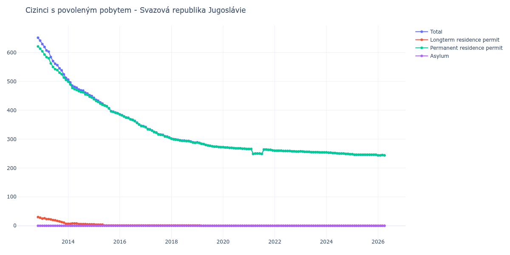

# Svazová republika Jugoslávie

## Souhrnné statistiky (Min/Max pro rok) / Summary Statistics (Min/Max per year)

| Year   | Total     | Longterm Residence Permit   | Permanent Residence Permit   | Asylum   |
|--------|-----------|-----------------------------|------------------------------|----------|
| 2012   | 641 / 651 | 28 / 30                     | 613 / 621                    | 0 / 0    |
| 2013   | 512 / 629 | 7 / 26                      | 505 / 604                    | 0 / 0    |
| 2014   | 449 / 506 | 5 / 8                       | 444 / 499                    | 0 / 0    |
| 2015   | 390 / 443 | 1 / 5                       | 389 / 438                    | 0 / 0    |
| 2016   | 345 / 386 | 1 / 1                       | 344 / 385                    | 0 / 0    |
| 2017   | 306 / 342 | 1 / 1                       | 305 / 341                    | 0 / 0    |
| 2018   | 288 / 302 | 1 / 1                       | 287 / 301                    | 0 / 0    |
| 2019   | 272 / 289 | 0 / 1                       | 272 / 288                    | 0 / 0    |
| 2020   | 266 / 272 | 0 / 0                       | 266 / 272                    | 0 / 0    |
| 2021   | 249 / 266 | 0 / 0                       | 249 / 266                    | 0 / 0    |
| 2022   | 257 / 260 | 0 / 0                       | 257 / 260                    | 0 / 0    |
| 2023   | 254 / 258 | 0 / 0                       | 254 / 258                    | 0 / 0    |
| 2024   | 248 / 254 | 0 / 0                       | 248 / 254                    | 0 / 0    |
| 2025   | 246 / 248 | 0 / 0                       | 246 / 248                    | 0 / 0    |
| 2026   | 244 / 245 | 0 / 0                       | 244 / 245                    | 0 / 0    |

## Detailní tabulka / Detailed Data Table

| Date     | Total        | Longterm Residence Permit   | Permanent Residence Permit   | Asylum   |
|----------|--------------|-----------------------------|------------------------------|----------|
| **2012** |              |                             |                              |          |
| 11.2012  | 651          | 30                          | 621                          | 0        |
| 12.2012  | 641 (-1.54%) | 28 (-6.67%)                 | 613 (-1.29%)                 | 0        |
| **2013** |              |                             |                              |          |
| 01.2013  | 629 (-1.87%) | 25 (-10.71%)                | 604 (-1.47%)                 | 0        |
| 02.2013  | 619 (-1.59%) | 26 (+4.00%)                 | 593 (-1.82%)                 | 0        |
| 03.2013  | 607 (-1.94%) | 23 (-11.54%)                | 584 (-1.52%)                 | 0        |
| 04.2013  | 603 (-0.66%) | 23 (+0.00%)                 | 580 (-0.68%)                 | 0        |
| 05.2013  | 584 (-3.15%) | 22 (-4.35%)                 | 562 (-3.10%)                 | 0        |
| 06.2013  | 570 (-2.40%) | 20 (-9.09%)                 | 550 (-2.14%)                 | 0        |
| 07.2013  | 561 (-1.58%) | 19 (-5.00%)                 | 542 (-1.45%)                 | 0        |
| 08.2013  | 556 (-0.89%) | 17 (-10.53%)                | 539 (-0.55%)                 | 0        |
| 09.2013  | 545 (-1.98%) | 15 (-11.76%)                | 530 (-1.67%)                 | 0        |
| 10.2013  | 538 (-1.28%) | 13 (-13.33%)                | 525 (-0.94%)                 | 0        |
| 11.2013  | 524 (-2.60%) | 11 (-15.38%)                | 513 (-2.29%)                 | 0        |
| 12.2013  | 512 (-2.29%) | 7 (-36.36%)                 | 505 (-1.56%)                 | 0        |
| **2014** |              |                             |                              |          |
| 01.2014  | 506 (-1.17%) | 7 (+0.00%)                  | 499 (-1.19%)                 | 0        |
| 02.2014  | 496 (-1.98%) | 7 (+0.00%)                  | 489 (-2.00%)                 | 0        |
| 03.2014  | 485 (-2.22%) | 8 (+14.29%)                 | 477 (-2.45%)                 | 0        |
| 04.2014  | 481 (-0.82%) | 8 (+0.00%)                  | 473 (-0.84%)                 | 0        |
| 05.2014  | 478 (-0.62%) | 8 (+0.00%)                  | 470 (-0.63%)                 | 0        |
| 06.2014  | 472 (-1.26%) | 6 (-25.00%)                 | 466 (-0.85%)                 | 0        |
| 07.2014  | 469 (-0.64%) | 6 (+0.00%)                  | 463 (-0.64%)                 | 0        |
| 08.2014  | 468 (-0.21%) | 6 (+0.00%)                  | 462 (-0.22%)                 | 0        |
| 09.2014  | 461 (-1.50%) | 6 (+0.00%)                  | 455 (-1.52%)                 | 0        |
| 10.2014  | 458 (-0.65%) | 5 (-16.67%)                 | 453 (-0.44%)                 | 0        |
| 11.2014  | 452 (-1.31%) | 5 (+0.00%)                  | 447 (-1.32%)                 | 0        |
| 12.2014  | 449 (-0.66%) | 5 (+0.00%)                  | 444 (-0.67%)                 | 0        |
| **2015** |              |                             |                              |          |
| 01.2015  | 443 (-1.34%) | 5 (+0.00%)                  | 438 (-1.35%)                 | 0        |
| 02.2015  | 436 (-1.58%) | 4 (-20.00%)                 | 432 (-1.37%)                 | 0        |
| 03.2015  | 433 (-0.69%) | 4 (+0.00%)                  | 429 (-0.69%)                 | 0        |
| 04.2015  | 427 (-1.39%) | 4 (+0.00%)                  | 423 (-1.40%)                 | 0        |
| 05.2015  | 423 (-0.94%) | 4 (+0.00%)                  | 419 (-0.95%)                 | 0        |
| 06.2015  | 417 (-1.42%) | 1 (-75.00%)                 | 416 (-0.72%)                 | 0        |
| 07.2015  | 414 (-0.72%) | 1 (+0.00%)                  | 413 (-0.72%)                 | 0        |
| 08.2015  | 407 (-1.69%) | 1 (+0.00%)                  | 406 (-1.69%)                 | 0        |
| 09.2015  | 397 (-2.46%) | 1 (+0.00%)                  | 396 (-2.46%)                 | 0        |
| 10.2015  | 395 (-0.50%) | 1 (+0.00%)                  | 394 (-0.51%)                 | 0        |
| 11.2015  | 392 (-0.76%) | 1 (+0.00%)                  | 391 (-0.76%)                 | 0        |
| 12.2015  | 390 (-0.51%) | 1 (+0.00%)                  | 389 (-0.51%)                 | 0        |
| **2016** |              |                             |                              |          |
| 01.2016  | 386 (-1.03%) | 1 (+0.00%)                  | 385 (-1.03%)                 | 0        |
| 02.2016  | 383 (-0.78%) | 1 (+0.00%)                  | 382 (-0.78%)                 | 0        |
| 03.2016  | 379 (-1.04%) | 1 (+0.00%)                  | 378 (-1.05%)                 | 0        |
| 04.2016  | 375 (-1.06%) | 1 (+0.00%)                  | 374 (-1.06%)                 | 0        |
| 05.2016  | 374 (-0.27%) | 1 (+0.00%)                  | 373 (-0.27%)                 | 0        |
| 06.2016  | 369 (-1.34%) | 1 (+0.00%)                  | 368 (-1.34%)                 | 0        |
| 07.2016  | 367 (-0.54%) | 1 (+0.00%)                  | 366 (-0.54%)                 | 0        |
| 08.2016  | 363 (-1.09%) | 1 (+0.00%)                  | 362 (-1.09%)                 | 0        |
| 09.2016  | 357 (-1.65%) | 1 (+0.00%)                  | 356 (-1.66%)                 | 0        |
| 10.2016  | 351 (-1.68%) | 1 (+0.00%)                  | 350 (-1.69%)                 | 0        |
| 11.2016  | 346 (-1.42%) | 1 (+0.00%)                  | 345 (-1.43%)                 | 0        |
| 12.2016  | 345 (-0.29%) | 1 (+0.00%)                  | 344 (-0.29%)                 | 0        |
| **2017** |              |                             |                              |          |
| 01.2017  | 342 (-0.87%) | 1 (+0.00%)                  | 341 (-0.87%)                 | 0        |
| 02.2017  | 335 (-2.05%) | 1 (+0.00%)                  | 334 (-2.05%)                 | 0        |
| 03.2017  | 334 (-0.30%) | 1 (+0.00%)                  | 333 (-0.30%)                 | 0        |
| 04.2017  | 330 (-1.20%) | 1 (+0.00%)                  | 329 (-1.20%)                 | 0        |
| 05.2017  | 325 (-1.52%) | 1 (+0.00%)                  | 324 (-1.52%)                 | 0        |
| 06.2017  | 323 (-0.62%) | 1 (+0.00%)                  | 322 (-0.62%)                 | 0        |
| 07.2017  | 317 (-1.86%) | 1 (+0.00%)                  | 316 (-1.86%)                 | 0        |
| 08.2017  | 316 (-0.32%) | 1 (+0.00%)                  | 315 (-0.32%)                 | 0        |
| 09.2017  | 315 (-0.32%) | 1 (+0.00%)                  | 314 (-0.32%)                 | 0        |
| 10.2017  | 310 (-1.59%) | 1 (+0.00%)                  | 309 (-1.59%)                 | 0        |
| 11.2017  | 309 (-0.32%) | 1 (+0.00%)                  | 308 (-0.32%)                 | 0        |
| 12.2017  | 306 (-0.97%) | 1 (+0.00%)                  | 305 (-0.97%)                 | 0        |
| **2018** |              |                             |                              |          |
| 01.2018  | 302 (-1.31%) | 1 (+0.00%)                  | 301 (-1.31%)                 | 0        |
| 02.2018  | 300 (-0.66%) | 1 (+0.00%)                  | 299 (-0.66%)                 | 0        |
| 03.2018  | 299 (-0.33%) | 1 (+0.00%)                  | 298 (-0.33%)                 | 0        |
| 04.2018  | 298 (-0.33%) | 1 (+0.00%)                  | 297 (-0.34%)                 | 0        |
| 05.2018  | 296 (-0.67%) | 1 (+0.00%)                  | 295 (-0.67%)                 | 0        |
| 06.2018  | 295 (-0.34%) | 1 (+0.00%)                  | 294 (-0.34%)                 | 0        |
| 07.2018  | 295 (+0.00%) | 1 (+0.00%)                  | 294 (+0.00%)                 | 0        |
| 08.2018  | 294 (-0.34%) | 1 (+0.00%)                  | 293 (-0.34%)                 | 0        |
| 09.2018  | 294 (+0.00%) | 1 (+0.00%)                  | 293 (+0.00%)                 | 0        |
| 10.2018  | 292 (-0.68%) | 1 (+0.00%)                  | 291 (-0.68%)                 | 0        |
| 11.2018  | 289 (-1.03%) | 1 (+0.00%)                  | 288 (-1.03%)                 | 0        |
| 12.2018  | 288 (-0.35%) | 1 (+0.00%)                  | 287 (-0.35%)                 | 0        |
| **2019** |              |                             |                              |          |
| 01.2019  | 289 (+0.35%) | 1 (+0.00%)                  | 288 (+0.35%)                 | 0        |
| 02.2019  | 287 (-0.69%) | 1 (+0.00%)                  | 286 (-0.69%)                 | 0        |
| 03.2019  | 284 (-1.05%) | 0 (-100.00%)                | 284 (-0.70%)                 | 0        |
| 04.2019  | 283 (-0.35%) | 0                           | 283 (-0.35%)                 | 0        |
| 05.2019  | 280 (-1.06%) | 0                           | 280 (-1.06%)                 | 0        |
| 06.2019  | 278 (-0.71%) | 0                           | 278 (-0.71%)                 | 0        |
| 07.2019  | 277 (-0.36%) | 0                           | 277 (-0.36%)                 | 0        |
| 08.2019  | 275 (-0.72%) | 0                           | 275 (-0.72%)                 | 0        |
| 09.2019  | 274 (-0.36%) | 0                           | 274 (-0.36%)                 | 0        |
| 10.2019  | 274 (+0.00%) | 0                           | 274 (+0.00%)                 | 0        |
| 11.2019  | 273 (-0.36%) | 0                           | 273 (-0.36%)                 | 0        |
| 12.2019  | 272 (-0.37%) | 0                           | 272 (-0.37%)                 | 0        |
| **2020** |              |                             |                              |          |
| 01.2020  | 272 (+0.00%) | 0                           | 272 (+0.00%)                 | 0        |
| 02.2020  | 271 (-0.37%) | 0                           | 271 (-0.37%)                 | 0        |
| 03.2020  | 271 (+0.00%) | 0                           | 271 (+0.00%)                 | 0        |
| 04.2020  | 270 (-0.37%) | 0                           | 270 (-0.37%)                 | 0        |
| 05.2020  | 270 (+0.00%) | 0                           | 270 (+0.00%)                 | 0        |
| 06.2020  | 269 (-0.37%) | 0                           | 269 (-0.37%)                 | 0        |
| 07.2020  | 268 (-0.37%) | 0                           | 268 (-0.37%)                 | 0        |
| 08.2020  | 268 (+0.00%) | 0                           | 268 (+0.00%)                 | 0        |
| 09.2020  | 268 (+0.00%) | 0                           | 268 (+0.00%)                 | 0        |
| 10.2020  | 267 (-0.37%) | 0                           | 267 (-0.37%)                 | 0        |
| 11.2020  | 267 (+0.00%) | 0                           | 267 (+0.00%)                 | 0        |
| 12.2020  | 266 (-0.37%) | 0                           | 266 (-0.37%)                 | 0        |
| **2021** |              |                             |                              |          |
| 01.2021  | 266 (+0.00%) | 0                           | 266 (+0.00%)                 | 0        |
| 02.2021  | 266 (+0.00%) | 0                           | 266 (+0.00%)                 | 0        |
| 03.2021  | 249 (-6.39%) | 0                           | 249 (-6.39%)                 | 0        |
| 04.2021  | 250 (+0.40%) | 0                           | 250 (+0.40%)                 | 0        |
| 05.2021  | 250 (+0.00%) | 0                           | 250 (+0.00%)                 | 0        |
| 06.2021  | 250 (+0.00%) | 0                           | 250 (+0.00%)                 | 0        |
| 07.2021  | 249 (-0.40%) | 0                           | 249 (-0.40%)                 | 0        |
| 08.2021  | 264 (+6.02%) | 0                           | 264 (+6.02%)                 | 0        |
| 09.2021  | 264 (+0.00%) | 0                           | 264 (+0.00%)                 | 0        |
| 10.2021  | 263 (-0.38%) | 0                           | 263 (-0.38%)                 | 0        |
| 11.2021  | 263 (+0.00%) | 0                           | 263 (+0.00%)                 | 0        |
| 12.2021  | 261 (-0.76%) | 0                           | 261 (-0.76%)                 | 0        |
| **2022** |              |                             |                              |          |
| 01.2022  | 260 (-0.38%) | 0                           | 260 (-0.38%)                 | 0        |
| 02.2022  | 260 (+0.00%) | 0                           | 260 (+0.00%)                 | 0        |
| 03.2022  | 260 (+0.00%) | 0                           | 260 (+0.00%)                 | 0        |
| 04.2022  | 260 (+0.00%) | 0                           | 260 (+0.00%)                 | 0        |
| 05.2022  | 259 (-0.38%) | 0                           | 259 (-0.38%)                 | 0        |
| 06.2022  | 259 (+0.00%) | 0                           | 259 (+0.00%)                 | 0        |
| 07.2022  | 259 (+0.00%) | 0                           | 259 (+0.00%)                 | 0        |
| 08.2022  | 259 (+0.00%) | 0                           | 259 (+0.00%)                 | 0        |
| 09.2022  | 258 (-0.39%) | 0                           | 258 (-0.39%)                 | 0        |
| 10.2022  | 258 (+0.00%) | 0                           | 258 (+0.00%)                 | 0        |
| 11.2022  | 257 (-0.39%) | 0                           | 257 (-0.39%)                 | 0        |
| 12.2022  | 257 (+0.00%) | 0                           | 257 (+0.00%)                 | 0        |
| **2023** |              |                             |                              |          |
| 01.2023  | 258 (+0.39%) | 0                           | 258 (+0.39%)                 | 0        |
| 02.2023  | 257 (-0.39%) | 0                           | 257 (-0.39%)                 | 0        |
| 03.2023  | 256 (-0.39%) | 0                           | 256 (-0.39%)                 | 0        |
| 04.2023  | 256 (+0.00%) | 0                           | 256 (+0.00%)                 | 0        |
| 05.2023  | 256 (+0.00%) | 0                           | 256 (+0.00%)                 | 0        |
| 06.2023  | 255 (-0.39%) | 0                           | 255 (-0.39%)                 | 0        |
| 07.2023  | 255 (+0.00%) | 0                           | 255 (+0.00%)                 | 0        |
| 08.2023  | 255 (+0.00%) | 0                           | 255 (+0.00%)                 | 0        |
| 09.2023  | 255 (+0.00%) | 0                           | 255 (+0.00%)                 | 0        |
| 10.2023  | 254 (-0.39%) | 0                           | 254 (-0.39%)                 | 0        |
| 11.2023  | 254 (+0.00%) | 0                           | 254 (+0.00%)                 | 0        |
| 12.2023  | 254 (+0.00%) | 0                           | 254 (+0.00%)                 | 0        |
| **2024** |              |                             |                              |          |
| 01.2024  | 254 (+0.00%) | 0                           | 254 (+0.00%)                 | 0        |
| 02.2024  | 253 (-0.39%) | 0                           | 253 (-0.39%)                 | 0        |
| 03.2024  | 253 (+0.00%) | 0                           | 253 (+0.00%)                 | 0        |
| 04.2024  | 252 (-0.40%) | 0                           | 252 (-0.40%)                 | 0        |
| 05.2024  | 252 (+0.00%) | 0                           | 252 (+0.00%)                 | 0        |
| 06.2024  | 251 (-0.40%) | 0                           | 251 (-0.40%)                 | 0        |
| 07.2024  | 250 (-0.40%) | 0                           | 250 (-0.40%)                 | 0        |
| 08.2024  | 250 (+0.00%) | 0                           | 250 (+0.00%)                 | 0        |
| 09.2024  | 250 (+0.00%) | 0                           | 250 (+0.00%)                 | 0        |
| 10.2024  | 249 (-0.40%) | 0                           | 249 (-0.40%)                 | 0        |
| 11.2024  | 249 (+0.00%) | 0                           | 249 (+0.00%)                 | 0        |
| 12.2024  | 248 (-0.40%) | 0                           | 248 (-0.40%)                 | 0        |
| **2025** |              |                             |                              |          |
| 01.2025  | 248 (+0.00%) | 0                           | 248 (+0.00%)                 | 0        |
| 02.2025  | 246 (-0.81%) | 0                           | 246 (-0.81%)                 | 0        |
| 03.2025  | 246 (+0.00%) | 0                           | 246 (+0.00%)                 | 0        |
| 04.2025  | 246 (+0.00%) | 0                           | 246 (+0.00%)                 | 0        |
| 05.2025  | 246 (+0.00%) | 0                           | 246 (+0.00%)                 | 0        |
| 06.2025  | 246 (+0.00%) | 0                           | 246 (+0.00%)                 | 0        |
| 07.2025  | 246 (+0.00%) | 0                           | 246 (+0.00%)                 | 0        |
| 08.2025  | 246 (+0.00%) | 0                           | 246 (+0.00%)                 | 0        |
| 09.2025  | 246 (+0.00%) | 0                           | 246 (+0.00%)                 | 0        |
| 10.2025  | 246 (+0.00%) | 0                           | 246 (+0.00%)                 | 0        |
| 11.2025  | 246 (+0.00%) | 0                           | 246 (+0.00%)                 | 0        |
| 12.2025  | 246 (+0.00%) | 0                           | 246 (+0.00%)                 | 0        |
| **2026** |              |                             |                              |          |
| 01.2026  | 244 (-0.81%) | 0                           | 244 (-0.81%)                 | 0        |
| 02.2026  | 244 (+0.00%) | 0                           | 244 (+0.00%)                 | 0        |
| 03.2026  | 245 (+0.41%) | 0                           | 245 (+0.41%)                 | 0        |
| 04.2026  | 244 (-0.41%) | 0                           | 244 (-0.41%)                 | 0        |
