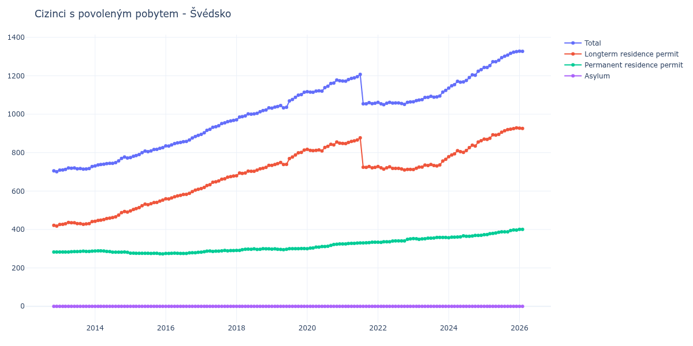

# Švédsko

## Souhrnné statistiky (Min/Max pro rok) / Summary Statistics (Min/Max per year)

| Year   | Total         | Longterm Residence Permit   | Permanent Residence Permit   | Asylum   |
|--------|---------------|-----------------------------|------------------------------|----------|
| 2012   | 701 / 705     | 418 / 422                   | 283 / 283                    | 0 / 0    |
| 2013   | 709 / 728     | 426 / 441                   | 283 / 287                    | 0 / 0    |
| 2014   | 731 / 777     | 443 / 494                   | 281 / 289                    | 0 / 0    |
| 2015   | 774 / 826     | 497 / 553                   | 273 / 277                    | 0 / 0    |
| 2016   | 834 / 890     | 559 / 609                   | 275 / 281                    | 0 / 0    |
| 2017   | 895 / 968     | 613 / 678                   | 282 / 291                    | 0 / 0    |
| 2018   | 971 / 1 033   | 680 / 734                   | 291 / 300                    | 0 / 0    |
| 2019   | 1 032 / 1 114 | 734 / 813                   | 295 / 301                    | 0 / 0    |
| 2020   | 1 114 / 1 178 | 809 / 855                   | 300 / 325                    | 0 / 0    |
| 2021   | 1 054 / 1 207 | 721 / 877                   | 325 / 334                    | 0 / 0    |
| 2022   | 1 050 / 1 064 | 710 / 728                   | 333 / 351                    | 0 / 0    |
| 2023   | 1 065 / 1 124 | 712 / 765                   | 349 / 359                    | 0 / 0    |
| 2024   | 1 136 / 1 232 | 779 / 862                   | 357 / 370                    | 0 / 0    |
| 2025   | 1 243 / 1 326 | 869 / 929                   | 373 / 398                    | 0 / 0    |
| 2026   | 1 327 / 1 328 | 926 / 927                   | 401 / 401                    | 0 / 0    |

## Detailní tabulka / Detailed Data Table

| Date     | Total           | Longterm Residence Permit   | Permanent Residence Permit   | Asylum   |
|----------|-----------------|-----------------------------|------------------------------|----------|
| **2012** |                 |                             |                              |          |
| 11.2012  | 705             | 422                         | 283                          | 0        |
| 12.2012  | 701 (-0.57%)    | 418 (-0.95%)                | 283 (+0.00%)                 | 0        |
| **2013** |                 |                             |                              |          |
| 01.2013  | 709 (+1.14%)    | 426 (+1.91%)                | 283 (+0.00%)                 | 0        |
| 02.2013  | 710 (+0.14%)    | 427 (+0.23%)                | 283 (+0.00%)                 | 0        |
| 03.2013  | 713 (+0.42%)    | 430 (+0.70%)                | 283 (+0.00%)                 | 0        |
| 04.2013  | 720 (+0.98%)    | 437 (+1.63%)                | 283 (+0.00%)                 | 0        |
| 05.2013  | 719 (-0.14%)    | 435 (-0.46%)                | 284 (+0.35%)                 | 0        |
| 06.2013  | 720 (+0.14%)    | 435 (+0.00%)                | 285 (+0.35%)                 | 0        |
| 07.2013  | 716 (-0.56%)    | 431 (-0.92%)                | 285 (+0.00%)                 | 0        |
| 08.2013  | 717 (+0.14%)    | 431 (+0.00%)                | 286 (+0.35%)                 | 0        |
| 09.2013  | 714 (-0.42%)    | 427 (-0.93%)                | 287 (+0.35%)                 | 0        |
| 10.2013  | 715 (+0.14%)    | 429 (+0.47%)                | 286 (-0.35%)                 | 0        |
| 11.2013  | 717 (+0.28%)    | 431 (+0.47%)                | 286 (+0.00%)                 | 0        |
| 12.2013  | 728 (+1.53%)    | 441 (+2.32%)                | 287 (+0.35%)                 | 0        |
| **2014** |                 |                             |                              |          |
| 01.2014  | 731 (+0.41%)    | 443 (+0.45%)                | 288 (+0.35%)                 | 0        |
| 02.2014  | 736 (+0.68%)    | 447 (+0.90%)                | 289 (+0.35%)                 | 0        |
| 03.2014  | 738 (+0.27%)    | 449 (+0.45%)                | 289 (+0.00%)                 | 0        |
| 04.2014  | 740 (+0.27%)    | 452 (+0.67%)                | 288 (-0.35%)                 | 0        |
| 05.2014  | 743 (+0.41%)    | 457 (+1.11%)                | 286 (-0.69%)                 | 0        |
| 06.2014  | 744 (+0.13%)    | 459 (+0.44%)                | 285 (-0.35%)                 | 0        |
| 07.2014  | 744 (+0.00%)    | 462 (+0.65%)                | 282 (-1.05%)                 | 0        |
| 08.2014  | 748 (+0.54%)    | 466 (+0.87%)                | 282 (+0.00%)                 | 0        |
| 09.2014  | 757 (+1.20%)    | 475 (+1.93%)                | 282 (+0.00%)                 | 0        |
| 10.2014  | 770 (+1.72%)    | 488 (+2.74%)                | 282 (+0.00%)                 | 0        |
| 11.2014  | 777 (+0.91%)    | 494 (+1.23%)                | 283 (+0.35%)                 | 0        |
| 12.2014  | 772 (-0.64%)    | 491 (-0.61%)                | 281 (-0.71%)                 | 0        |
| **2015** |                 |                             |                              |          |
| 01.2015  | 774 (+0.26%)    | 497 (+1.22%)                | 277 (-1.42%)                 | 0        |
| 02.2015  | 781 (+0.90%)    | 504 (+1.41%)                | 277 (+0.00%)                 | 0        |
| 03.2015  | 785 (+0.51%)    | 509 (+0.99%)                | 276 (-0.36%)                 | 0        |
| 04.2015  | 790 (+0.64%)    | 514 (+0.98%)                | 276 (+0.00%)                 | 0        |
| 05.2015  | 800 (+1.27%)    | 524 (+1.95%)                | 276 (+0.00%)                 | 0        |
| 06.2015  | 808 (+1.00%)    | 532 (+1.53%)                | 276 (+0.00%)                 | 0        |
| 07.2015  | 805 (-0.37%)    | 529 (-0.56%)                | 276 (+0.00%)                 | 0        |
| 08.2015  | 809 (+0.50%)    | 534 (+0.95%)                | 275 (-0.36%)                 | 0        |
| 09.2015  | 816 (+0.87%)    | 540 (+1.12%)                | 276 (+0.36%)                 | 0        |
| 10.2015  | 817 (+0.12%)    | 541 (+0.19%)                | 276 (+0.00%)                 | 0        |
| 11.2015  | 822 (+0.61%)    | 548 (+1.29%)                | 274 (-0.72%)                 | 0        |
| 12.2015  | 826 (+0.49%)    | 553 (+0.91%)                | 273 (-0.36%)                 | 0        |
| **2016** |                 |                             |                              |          |
| 01.2016  | 835 (+1.09%)    | 560 (+1.27%)                | 275 (+0.73%)                 | 0        |
| 02.2016  | 834 (-0.12%)    | 559 (-0.18%)                | 275 (+0.00%)                 | 0        |
| 03.2016  | 840 (+0.72%)    | 564 (+0.89%)                | 276 (+0.36%)                 | 0        |
| 04.2016  | 847 (+0.83%)    | 570 (+1.06%)                | 277 (+0.36%)                 | 0        |
| 05.2016  | 851 (+0.47%)    | 575 (+0.88%)                | 276 (-0.36%)                 | 0        |
| 06.2016  | 853 (+0.24%)    | 578 (+0.52%)                | 275 (-0.36%)                 | 0        |
| 07.2016  | 857 (+0.47%)    | 582 (+0.69%)                | 275 (+0.00%)                 | 0        |
| 08.2016  | 858 (+0.12%)    | 583 (+0.17%)                | 275 (+0.00%)                 | 0        |
| 09.2016  | 866 (+0.93%)    | 588 (+0.86%)                | 278 (+1.09%)                 | 0        |
| 10.2016  | 876 (+1.15%)    | 597 (+1.53%)                | 279 (+0.36%)                 | 0        |
| 11.2016  | 884 (+0.91%)    | 605 (+1.34%)                | 279 (+0.00%)                 | 0        |
| 12.2016  | 890 (+0.68%)    | 609 (+0.66%)                | 281 (+0.72%)                 | 0        |
| **2017** |                 |                             |                              |          |
| 01.2017  | 895 (+0.56%)    | 613 (+0.66%)                | 282 (+0.36%)                 | 0        |
| 02.2017  | 903 (+0.89%)    | 619 (+0.98%)                | 284 (+0.71%)                 | 0        |
| 03.2017  | 916 (+1.44%)    | 629 (+1.62%)                | 287 (+1.06%)                 | 0        |
| 04.2017  | 921 (+0.55%)    | 633 (+0.64%)                | 288 (+0.35%)                 | 0        |
| 05.2017  | 932 (+1.19%)    | 646 (+2.05%)                | 286 (-0.69%)                 | 0        |
| 06.2017  | 935 (+0.32%)    | 648 (+0.31%)                | 287 (+0.35%)                 | 0        |
| 07.2017  | 940 (+0.53%)    | 653 (+0.77%)                | 287 (+0.00%)                 | 0        |
| 08.2017  | 951 (+1.17%)    | 662 (+1.38%)                | 289 (+0.70%)                 | 0        |
| 09.2017  | 955 (+0.42%)    | 664 (+0.30%)                | 291 (+0.69%)                 | 0        |
| 10.2017  | 961 (+0.63%)    | 672 (+1.20%)                | 289 (-0.69%)                 | 0        |
| 11.2017  | 965 (+0.42%)    | 675 (+0.45%)                | 290 (+0.35%)                 | 0        |
| 12.2017  | 968 (+0.31%)    | 678 (+0.44%)                | 290 (+0.00%)                 | 0        |
| **2018** |                 |                             |                              |          |
| 01.2018  | 971 (+0.31%)    | 680 (+0.29%)                | 291 (+0.34%)                 | 0        |
| 02.2018  | 985 (+1.44%)    | 694 (+2.06%)                | 291 (+0.00%)                 | 0        |
| 03.2018  | 987 (+0.20%)    | 692 (-0.29%)                | 295 (+1.37%)                 | 0        |
| 04.2018  | 991 (+0.41%)    | 694 (+0.29%)                | 297 (+0.68%)                 | 0        |
| 05.2018  | 1 002 (+1.11%)  | 704 (+1.44%)                | 298 (+0.34%)                 | 0        |
| 06.2018  | 1 000 (-0.20%)  | 703 (-0.14%)                | 297 (-0.34%)                 | 0        |
| 07.2018  | 1 002 (+0.20%)  | 703 (+0.00%)                | 299 (+0.67%)                 | 0        |
| 08.2018  | 1 005 (+0.30%)  | 709 (+0.85%)                | 296 (-1.00%)                 | 0        |
| 09.2018  | 1 013 (+0.80%)  | 716 (+0.99%)                | 297 (+0.34%)                 | 0        |
| 10.2018  | 1 019 (+0.59%)  | 719 (+0.42%)                | 300 (+1.01%)                 | 0        |
| 11.2018  | 1 022 (+0.29%)  | 723 (+0.56%)                | 299 (-0.33%)                 | 0        |
| 12.2018  | 1 033 (+1.08%)  | 734 (+1.52%)                | 299 (+0.00%)                 | 0        |
| **2019** |                 |                             |                              |          |
| 01.2019  | 1 032 (-0.10%)  | 734 (+0.00%)                | 298 (-0.33%)                 | 0        |
| 02.2019  | 1 037 (+0.48%)  | 738 (+0.54%)                | 299 (+0.34%)                 | 0        |
| 03.2019  | 1 040 (+0.29%)  | 743 (+0.68%)                | 297 (-0.67%)                 | 0        |
| 04.2019  | 1 045 (+0.48%)  | 749 (+0.81%)                | 296 (-0.34%)                 | 0        |
| 05.2019  | 1 033 (-1.15%)  | 738 (-1.47%)                | 295 (-0.34%)                 | 0        |
| 06.2019  | 1 036 (+0.29%)  | 739 (+0.14%)                | 297 (+0.68%)                 | 0        |
| 07.2019  | 1 069 (+3.19%)  | 769 (+4.06%)                | 300 (+1.01%)                 | 0        |
| 08.2019  | 1 077 (+0.75%)  | 777 (+1.04%)                | 300 (+0.00%)                 | 0        |
| 09.2019  | 1 088 (+1.02%)  | 788 (+1.42%)                | 300 (+0.00%)                 | 0        |
| 10.2019  | 1 099 (+1.01%)  | 799 (+1.40%)                | 300 (+0.00%)                 | 0        |
| 11.2019  | 1 102 (+0.27%)  | 801 (+0.25%)                | 301 (+0.33%)                 | 0        |
| 12.2019  | 1 114 (+1.09%)  | 813 (+1.50%)                | 301 (+0.00%)                 | 0        |
| **2020** |                 |                             |                              |          |
| 01.2020  | 1 117 (+0.27%)  | 817 (+0.49%)                | 300 (-0.33%)                 | 0        |
| 02.2020  | 1 115 (-0.18%)  | 812 (-0.61%)                | 303 (+1.00%)                 | 0        |
| 03.2020  | 1 114 (-0.09%)  | 810 (-0.25%)                | 304 (+0.33%)                 | 0        |
| 04.2020  | 1 120 (+0.54%)  | 812 (+0.25%)                | 308 (+1.32%)                 | 0        |
| 05.2020  | 1 122 (+0.18%)  | 814 (+0.25%)                | 308 (+0.00%)                 | 0        |
| 06.2020  | 1 120 (-0.18%)  | 809 (-0.61%)                | 311 (+0.97%)                 | 0        |
| 07.2020  | 1 138 (+1.61%)  | 827 (+2.22%)                | 311 (+0.00%)                 | 0        |
| 08.2020  | 1 146 (+0.70%)  | 833 (+0.73%)                | 313 (+0.64%)                 | 0        |
| 09.2020  | 1 160 (+1.22%)  | 843 (+1.20%)                | 317 (+1.28%)                 | 0        |
| 10.2020  | 1 162 (+0.17%)  | 840 (-0.36%)                | 322 (+1.58%)                 | 0        |
| 11.2020  | 1 178 (+1.38%)  | 855 (+1.79%)                | 323 (+0.31%)                 | 0        |
| 12.2020  | 1 174 (-0.34%)  | 849 (-0.70%)                | 325 (+0.62%)                 | 0        |
| **2021** |                 |                             |                              |          |
| 01.2021  | 1 173 (-0.09%)  | 848 (-0.12%)                | 325 (+0.00%)                 | 0        |
| 02.2021  | 1 172 (-0.09%)  | 847 (-0.12%)                | 325 (+0.00%)                 | 0        |
| 03.2021  | 1 180 (+0.68%)  | 853 (+0.71%)                | 327 (+0.62%)                 | 0        |
| 04.2021  | 1 186 (+0.51%)  | 858 (+0.59%)                | 328 (+0.31%)                 | 0        |
| 05.2021  | 1 189 (+0.25%)  | 861 (+0.35%)                | 328 (+0.00%)                 | 0        |
| 06.2021  | 1 195 (+0.50%)  | 866 (+0.58%)                | 329 (+0.30%)                 | 0        |
| 07.2021  | 1 207 (+1.00%)  | 877 (+1.27%)                | 330 (+0.30%)                 | 0        |
| 08.2021  | 1 054 (-12.68%) | 724 (-17.45%)               | 330 (+0.00%)                 | 0        |
| 09.2021  | 1 054 (+0.00%)  | 723 (-0.14%)                | 331 (+0.30%)                 | 0        |
| 10.2021  | 1 060 (+0.57%)  | 728 (+0.69%)                | 332 (+0.30%)                 | 0        |
| 11.2021  | 1 055 (-0.47%)  | 721 (-0.96%)                | 334 (+0.60%)                 | 0        |
| 12.2021  | 1 057 (+0.19%)  | 723 (+0.28%)                | 334 (+0.00%)                 | 0        |
| **2022** |                 |                             |                              |          |
| 01.2022  | 1 062 (+0.47%)  | 728 (+0.69%)                | 334 (+0.00%)                 | 0        |
| 02.2022  | 1 054 (-0.75%)  | 721 (-0.96%)                | 333 (-0.30%)                 | 0        |
| 03.2022  | 1 050 (-0.38%)  | 714 (-0.97%)                | 336 (+0.90%)                 | 0        |
| 04.2022  | 1 057 (+0.67%)  | 721 (+0.98%)                | 336 (+0.00%)                 | 0        |
| 05.2022  | 1 062 (+0.47%)  | 726 (+0.69%)                | 336 (+0.00%)                 | 0        |
| 06.2022  | 1 058 (-0.38%)  | 718 (-1.10%)                | 340 (+1.19%)                 | 0        |
| 07.2022  | 1 059 (+0.09%)  | 718 (+0.00%)                | 341 (+0.29%)                 | 0        |
| 08.2022  | 1 059 (+0.00%)  | 718 (+0.00%)                | 341 (+0.00%)                 | 0        |
| 09.2022  | 1 056 (-0.28%)  | 715 (-0.42%)                | 341 (+0.00%)                 | 0        |
| 10.2022  | 1 051 (-0.47%)  | 710 (-0.70%)                | 341 (+0.00%)                 | 0        |
| 11.2022  | 1 062 (+1.05%)  | 713 (+0.42%)                | 349 (+2.35%)                 | 0        |
| 12.2022  | 1 064 (+0.19%)  | 713 (+0.00%)                | 351 (+0.57%)                 | 0        |
| **2023** |                 |                             |                              |          |
| 01.2023  | 1 065 (+0.09%)  | 712 (-0.14%)                | 353 (+0.57%)                 | 0        |
| 02.2023  | 1 071 (+0.56%)  | 719 (+0.98%)                | 352 (-0.28%)                 | 0        |
| 03.2023  | 1 074 (+0.28%)  | 725 (+0.83%)                | 349 (-0.85%)                 | 0        |
| 04.2023  | 1 076 (+0.19%)  | 725 (+0.00%)                | 351 (+0.57%)                 | 0        |
| 05.2023  | 1 087 (+1.02%)  | 735 (+1.38%)                | 352 (+0.28%)                 | 0        |
| 06.2023  | 1 088 (+0.09%)  | 733 (-0.27%)                | 355 (+0.85%)                 | 0        |
| 07.2023  | 1 093 (+0.46%)  | 738 (+0.68%)                | 355 (+0.00%)                 | 0        |
| 08.2023  | 1 089 (-0.37%)  | 733 (-0.68%)                | 356 (+0.28%)                 | 0        |
| 09.2023  | 1 090 (+0.09%)  | 731 (-0.27%)                | 359 (+0.84%)                 | 0        |
| 10.2023  | 1 095 (+0.46%)  | 736 (+0.68%)                | 359 (+0.00%)                 | 0        |
| 11.2023  | 1 115 (+1.83%)  | 756 (+2.72%)                | 359 (+0.00%)                 | 0        |
| 12.2023  | 1 124 (+0.81%)  | 765 (+1.19%)                | 359 (+0.00%)                 | 0        |
| **2024** |                 |                             |                              |          |
| 01.2024  | 1 136 (+1.07%)  | 779 (+1.83%)                | 357 (-0.56%)                 | 0        |
| 02.2024  | 1 148 (+1.06%)  | 788 (+1.16%)                | 360 (+0.84%)                 | 0        |
| 03.2024  | 1 154 (+0.52%)  | 794 (+0.76%)                | 360 (+0.00%)                 | 0        |
| 04.2024  | 1 171 (+1.47%)  | 810 (+2.02%)                | 361 (+0.28%)                 | 0        |
| 05.2024  | 1 167 (-0.34%)  | 805 (-0.62%)                | 362 (+0.28%)                 | 0        |
| 06.2024  | 1 168 (+0.09%)  | 801 (-0.50%)                | 367 (+1.38%)                 | 0        |
| 07.2024  | 1 176 (+0.68%)  | 811 (+1.25%)                | 365 (-0.54%)                 | 0        |
| 08.2024  | 1 191 (+1.28%)  | 826 (+1.85%)                | 365 (+0.00%)                 | 0        |
| 09.2024  | 1 205 (+1.18%)  | 839 (+1.57%)                | 366 (+0.27%)                 | 0        |
| 10.2024  | 1 203 (-0.17%)  | 834 (-0.60%)                | 369 (+0.82%)                 | 0        |
| 11.2024  | 1 224 (+1.75%)  | 855 (+2.52%)                | 369 (+0.00%)                 | 0        |
| 12.2024  | 1 232 (+0.65%)  | 862 (+0.82%)                | 370 (+0.27%)                 | 0        |
| **2025** |                 |                             |                              |          |
| 01.2025  | 1 243 (+0.89%)  | 870 (+0.93%)                | 373 (+0.81%)                 | 0        |
| 02.2025  | 1 243 (+0.00%)  | 869 (-0.11%)                | 374 (+0.27%)                 | 0        |
| 03.2025  | 1 253 (+0.80%)  | 875 (+0.69%)                | 378 (+1.07%)                 | 0        |
| 04.2025  | 1 273 (+1.60%)  | 893 (+2.06%)                | 380 (+0.53%)                 | 0        |
| 05.2025  | 1 273 (+0.00%)  | 891 (-0.22%)                | 382 (+0.53%)                 | 0        |
| 06.2025  | 1 281 (+0.63%)  | 895 (+0.45%)                | 386 (+1.05%)                 | 0        |
| 07.2025  | 1 294 (+1.01%)  | 906 (+1.23%)                | 388 (+0.52%)                 | 0        |
| 08.2025  | 1 302 (+0.62%)  | 914 (+0.88%)                | 388 (+0.00%)                 | 0        |
| 09.2025  | 1 308 (+0.46%)  | 920 (+0.66%)                | 388 (+0.00%)                 | 0        |
| 10.2025  | 1 317 (+0.69%)  | 922 (+0.22%)                | 395 (+1.80%)                 | 0        |
| 11.2025  | 1 323 (+0.46%)  | 925 (+0.33%)                | 398 (+0.76%)                 | 0        |
| 12.2025  | 1 326 (+0.23%)  | 929 (+0.43%)                | 397 (-0.25%)                 | 0        |
| **2026** |                 |                             |                              |          |
| 01.2026  | 1 328 (+0.15%)  | 927 (-0.22%)                | 401 (+1.01%)                 | 0        |
| 02.2026  | 1 327 (-0.08%)  | 926 (-0.11%)                | 401 (+0.00%)                 | 0        |
