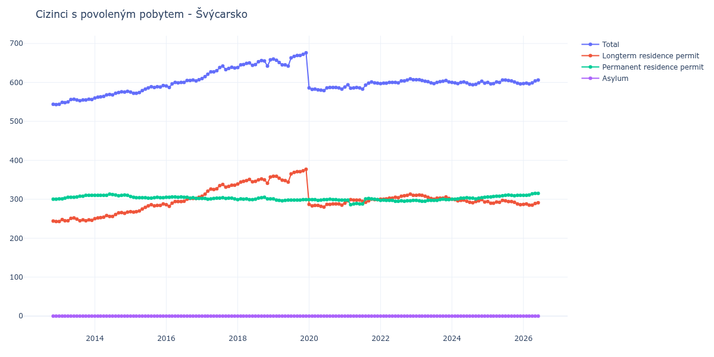

# Švýcarsko

## Souhrnné statistiky (Min/Max pro rok) / Summary Statistics (Min/Max per year)

| Year   | Total     | Longterm Residence Permit   | Permanent Residence Permit   | Asylum   |
|--------|-----------|-----------------------------|------------------------------|----------|
| 2012   | 543 / 544 | 243 / 244                   | 300 / 300                    | 0 / 0    |
| 2013   | 544 / 557 | 243 / 252                   | 301 / 310                    | 0 / 0    |
| 2014   | 560 / 577 | 250 / 267                   | 309 / 313                    | 0 / 0    |
| 2015   | 572 / 592 | 267 / 288                   | 303 / 307                    | 0 / 0    |
| 2016   | 587 / 607 | 282 / 305                   | 302 / 306                    | 0 / 0    |
| 2017   | 610 / 642 | 308 / 338                   | 300 / 304                    | 0 / 0    |
| 2018   | 638 / 658 | 339 / 357                   | 299 / 305                    | 0 / 0    |
| 2019   | 642 / 676 | 344 / 377                   | 296 / 301                    | 0 / 0    |
| 2020   | 579 / 587 | 280 / 288                   | 297 / 300                    | 0 / 0    |
| 2021   | 583 / 601 | 290 / 300                   | 286 / 302                    | 0 / 0    |
| 2022   | 597 / 609 | 300 / 313                   | 295 / 298                    | 0 / 0    |
| 2023   | 597 / 607 | 300 / 311                   | 295 / 300                    | 0 / 0    |
| 2024   | 594 / 603 | 291 / 300                   | 300 / 305                    | 0 / 0    |
| 2025   | 596 / 606 | 286 / 297                   | 306 / 311                    | 0 / 0    |
| 2026   | 596 / 606 | 285 / 291                   | 310 / 315                    | 0 / 0    |

## Detailní tabulka / Detailed Data Table

| Date     | Total         | Longterm Residence Permit   | Permanent Residence Permit   | Asylum   |
|----------|---------------|-----------------------------|------------------------------|----------|
| **2012** |               |                             |                              |          |
| 11.2012  | 544           | 244                         | 300                          | 0        |
| 12.2012  | 543 (-0.18%)  | 243 (-0.41%)                | 300 (+0.00%)                 | 0        |
| **2013** |               |                             |                              |          |
| 01.2013  | 544 (+0.18%)  | 243 (+0.00%)                | 301 (+0.33%)                 | 0        |
| 02.2013  | 549 (+0.92%)  | 248 (+2.06%)                | 301 (+0.00%)                 | 0        |
| 03.2013  | 548 (-0.18%)  | 245 (-1.21%)                | 303 (+0.66%)                 | 0        |
| 04.2013  | 550 (+0.36%)  | 245 (+0.00%)                | 305 (+0.66%)                 | 0        |
| 05.2013  | 556 (+1.09%)  | 251 (+2.45%)                | 305 (+0.00%)                 | 0        |
| 06.2013  | 557 (+0.18%)  | 252 (+0.40%)                | 305 (+0.00%)                 | 0        |
| 07.2013  | 555 (-0.36%)  | 249 (-1.19%)                | 306 (+0.33%)                 | 0        |
| 08.2013  | 553 (-0.36%)  | 245 (-1.61%)                | 308 (+0.65%)                 | 0        |
| 09.2013  | 555 (+0.36%)  | 247 (+0.82%)                | 308 (+0.00%)                 | 0        |
| 10.2013  | 555 (+0.00%)  | 245 (-0.81%)                | 310 (+0.65%)                 | 0        |
| 11.2013  | 557 (+0.36%)  | 247 (+0.82%)                | 310 (+0.00%)                 | 0        |
| 12.2013  | 556 (-0.18%)  | 246 (-0.40%)                | 310 (+0.00%)                 | 0        |
| **2014** |               |                             |                              |          |
| 01.2014  | 560 (+0.72%)  | 250 (+1.63%)                | 310 (+0.00%)                 | 0        |
| 02.2014  | 562 (+0.36%)  | 252 (+0.80%)                | 310 (+0.00%)                 | 0        |
| 03.2014  | 563 (+0.18%)  | 253 (+0.40%)                | 310 (+0.00%)                 | 0        |
| 04.2014  | 564 (+0.18%)  | 254 (+0.40%)                | 310 (+0.00%)                 | 0        |
| 05.2014  | 568 (+0.71%)  | 258 (+1.57%)                | 310 (+0.00%)                 | 0        |
| 06.2014  | 569 (+0.18%)  | 256 (-0.78%)                | 313 (+0.97%)                 | 0        |
| 07.2014  | 568 (-0.18%)  | 256 (+0.00%)                | 312 (-0.32%)                 | 0        |
| 08.2014  | 572 (+0.70%)  | 261 (+1.95%)                | 311 (-0.32%)                 | 0        |
| 09.2014  | 574 (+0.35%)  | 265 (+1.53%)                | 309 (-0.64%)                 | 0        |
| 10.2014  | 576 (+0.35%)  | 266 (+0.38%)                | 310 (+0.32%)                 | 0        |
| 11.2014  | 575 (-0.17%)  | 264 (-0.75%)                | 311 (+0.32%)                 | 0        |
| 12.2014  | 577 (+0.35%)  | 267 (+1.14%)                | 310 (-0.32%)                 | 0        |
| **2015** |               |                             |                              |          |
| 01.2015  | 575 (-0.35%)  | 268 (+0.37%)                | 307 (-0.97%)                 | 0        |
| 02.2015  | 572 (-0.52%)  | 267 (-0.37%)                | 305 (-0.65%)                 | 0        |
| 03.2015  | 572 (+0.00%)  | 268 (+0.37%)                | 304 (-0.33%)                 | 0        |
| 04.2015  | 574 (+0.35%)  | 270 (+0.75%)                | 304 (+0.00%)                 | 0        |
| 05.2015  | 579 (+0.87%)  | 275 (+1.85%)                | 304 (+0.00%)                 | 0        |
| 06.2015  | 583 (+0.69%)  | 279 (+1.45%)                | 304 (+0.00%)                 | 0        |
| 07.2015  | 586 (+0.51%)  | 283 (+1.43%)                | 303 (-0.33%)                 | 0        |
| 08.2015  | 589 (+0.51%)  | 286 (+1.06%)                | 303 (+0.00%)                 | 0        |
| 09.2015  | 587 (-0.34%)  | 283 (-1.05%)                | 304 (+0.33%)                 | 0        |
| 10.2015  | 589 (+0.34%)  | 284 (+0.35%)                | 305 (+0.33%)                 | 0        |
| 11.2015  | 588 (-0.17%)  | 284 (+0.00%)                | 304 (-0.33%)                 | 0        |
| 12.2015  | 592 (+0.68%)  | 288 (+1.41%)                | 304 (+0.00%)                 | 0        |
| **2016** |               |                             |                              |          |
| 01.2016  | 591 (-0.17%)  | 286 (-0.69%)                | 305 (+0.33%)                 | 0        |
| 02.2016  | 587 (-0.68%)  | 282 (-1.40%)                | 305 (+0.00%)                 | 0        |
| 03.2016  | 596 (+1.53%)  | 290 (+2.84%)                | 306 (+0.33%)                 | 0        |
| 04.2016  | 600 (+0.67%)  | 294 (+1.38%)                | 306 (+0.00%)                 | 0        |
| 05.2016  | 599 (-0.17%)  | 294 (+0.00%)                | 305 (-0.33%)                 | 0        |
| 06.2016  | 600 (+0.17%)  | 294 (+0.00%)                | 306 (+0.33%)                 | 0        |
| 07.2016  | 600 (+0.00%)  | 295 (+0.34%)                | 305 (-0.33%)                 | 0        |
| 08.2016  | 605 (+0.83%)  | 300 (+1.69%)                | 305 (+0.00%)                 | 0        |
| 09.2016  | 605 (+0.00%)  | 302 (+0.67%)                | 303 (-0.66%)                 | 0        |
| 10.2016  | 606 (+0.17%)  | 302 (+0.00%)                | 304 (+0.33%)                 | 0        |
| 11.2016  | 604 (-0.33%)  | 302 (+0.00%)                | 302 (-0.66%)                 | 0        |
| 12.2016  | 607 (+0.50%)  | 305 (+0.99%)                | 302 (+0.00%)                 | 0        |
| **2017** |               |                             |                              |          |
| 01.2017  | 610 (+0.49%)  | 308 (+0.98%)                | 302 (+0.00%)                 | 0        |
| 02.2017  | 615 (+0.82%)  | 313 (+1.62%)                | 302 (+0.00%)                 | 0        |
| 03.2017  | 621 (+0.98%)  | 321 (+2.56%)                | 300 (-0.66%)                 | 0        |
| 04.2017  | 627 (+0.97%)  | 326 (+1.56%)                | 301 (+0.33%)                 | 0        |
| 05.2017  | 627 (+0.00%)  | 325 (-0.31%)                | 302 (+0.33%)                 | 0        |
| 06.2017  | 630 (+0.48%)  | 327 (+0.62%)                | 303 (+0.33%)                 | 0        |
| 07.2017  | 638 (+1.27%)  | 335 (+2.45%)                | 303 (+0.00%)                 | 0        |
| 08.2017  | 642 (+0.63%)  | 338 (+0.90%)                | 304 (+0.33%)                 | 0        |
| 09.2017  | 633 (-1.40%)  | 331 (-2.07%)                | 302 (-0.66%)                 | 0        |
| 10.2017  | 636 (+0.47%)  | 333 (+0.60%)                | 303 (+0.33%)                 | 0        |
| 11.2017  | 639 (+0.47%)  | 336 (+0.90%)                | 303 (+0.00%)                 | 0        |
| 12.2017  | 637 (-0.31%)  | 336 (+0.00%)                | 301 (-0.66%)                 | 0        |
| **2018** |               |                             |                              |          |
| 01.2018  | 638 (+0.16%)  | 339 (+0.89%)                | 299 (-0.66%)                 | 0        |
| 02.2018  | 645 (+1.10%)  | 344 (+1.47%)                | 301 (+0.67%)                 | 0        |
| 03.2018  | 646 (+0.16%)  | 346 (+0.58%)                | 300 (-0.33%)                 | 0        |
| 04.2018  | 649 (+0.46%)  | 348 (+0.58%)                | 301 (+0.33%)                 | 0        |
| 05.2018  | 650 (+0.15%)  | 351 (+0.86%)                | 299 (-0.66%)                 | 0        |
| 06.2018  | 644 (-0.92%)  | 345 (-1.71%)                | 299 (+0.00%)                 | 0        |
| 07.2018  | 646 (+0.31%)  | 346 (+0.29%)                | 300 (+0.33%)                 | 0        |
| 08.2018  | 653 (+1.08%)  | 350 (+1.16%)                | 303 (+1.00%)                 | 0        |
| 09.2018  | 656 (+0.46%)  | 352 (+0.57%)                | 304 (+0.33%)                 | 0        |
| 10.2018  | 655 (-0.15%)  | 350 (-0.57%)                | 305 (+0.33%)                 | 0        |
| 11.2018  | 642 (-1.98%)  | 341 (-2.57%)                | 301 (-1.31%)                 | 0        |
| 12.2018  | 658 (+2.49%)  | 357 (+4.69%)                | 301 (+0.00%)                 | 0        |
| **2019** |               |                             |                              |          |
| 01.2019  | 660 (+0.30%)  | 359 (+0.56%)                | 301 (+0.00%)                 | 0        |
| 02.2019  | 657 (-0.45%)  | 359 (+0.00%)                | 298 (-1.00%)                 | 0        |
| 03.2019  | 651 (-0.91%)  | 354 (-1.39%)                | 297 (-0.34%)                 | 0        |
| 04.2019  | 645 (-0.92%)  | 349 (-1.41%)                | 296 (-0.34%)                 | 0        |
| 05.2019  | 645 (+0.00%)  | 348 (-0.29%)                | 297 (+0.34%)                 | 0        |
| 06.2019  | 642 (-0.47%)  | 344 (-1.15%)                | 298 (+0.34%)                 | 0        |
| 07.2019  | 663 (+3.27%)  | 365 (+6.10%)                | 298 (+0.00%)                 | 0        |
| 08.2019  | 667 (+0.60%)  | 369 (+1.10%)                | 298 (+0.00%)                 | 0        |
| 09.2019  | 669 (+0.30%)  | 371 (+0.54%)                | 298 (+0.00%)                 | 0        |
| 10.2019  | 669 (+0.00%)  | 371 (+0.00%)                | 298 (+0.00%)                 | 0        |
| 11.2019  | 672 (+0.45%)  | 373 (+0.54%)                | 299 (+0.34%)                 | 0        |
| 12.2019  | 676 (+0.60%)  | 377 (+1.07%)                | 299 (+0.00%)                 | 0        |
| **2020** |               |                             |                              |          |
| 01.2020  | 586 (-13.31%) | 287 (-23.87%)               | 299 (+0.00%)                 | 0        |
| 02.2020  | 582 (-0.68%)  | 283 (-1.39%)                | 299 (+0.00%)                 | 0        |
| 03.2020  | 583 (+0.17%)  | 284 (+0.35%)                | 299 (+0.00%)                 | 0        |
| 04.2020  | 581 (-0.34%)  | 284 (+0.00%)                | 297 (-0.67%)                 | 0        |
| 05.2020  | 580 (-0.17%)  | 282 (-0.70%)                | 298 (+0.34%)                 | 0        |
| 06.2020  | 579 (-0.17%)  | 280 (-0.71%)                | 299 (+0.34%)                 | 0        |
| 07.2020  | 586 (+1.21%)  | 287 (+2.50%)                | 299 (+0.00%)                 | 0        |
| 08.2020  | 587 (+0.17%)  | 287 (+0.00%)                | 300 (+0.33%)                 | 0        |
| 09.2020  | 587 (+0.00%)  | 288 (+0.35%)                | 299 (-0.33%)                 | 0        |
| 10.2020  | 587 (+0.00%)  | 288 (+0.00%)                | 299 (+0.00%)                 | 0        |
| 11.2020  | 586 (-0.17%)  | 288 (+0.00%)                | 298 (-0.33%)                 | 0        |
| 12.2020  | 583 (-0.51%)  | 285 (-1.04%)                | 298 (+0.00%)                 | 0        |
| **2021** |               |                             |                              |          |
| 01.2021  | 588 (+0.86%)  | 290 (+1.75%)                | 298 (+0.00%)                 | 0        |
| 02.2021  | 594 (+1.02%)  | 296 (+2.07%)                | 298 (+0.00%)                 | 0        |
| 03.2021  | 585 (-1.52%)  | 299 (+1.01%)                | 286 (-4.03%)                 | 0        |
| 04.2021  | 586 (+0.17%)  | 298 (-0.33%)                | 288 (+0.70%)                 | 0        |
| 05.2021  | 587 (+0.17%)  | 298 (+0.00%)                | 289 (+0.35%)                 | 0        |
| 06.2021  | 586 (-0.17%)  | 298 (+0.00%)                | 288 (-0.35%)                 | 0        |
| 07.2021  | 583 (-0.51%)  | 295 (-1.01%)                | 288 (+0.00%)                 | 0        |
| 08.2021  | 593 (+1.72%)  | 292 (-1.02%)                | 301 (+4.51%)                 | 0        |
| 09.2021  | 598 (+0.84%)  | 296 (+1.37%)                | 302 (+0.33%)                 | 0        |
| 10.2021  | 601 (+0.50%)  | 300 (+1.35%)                | 301 (-0.33%)                 | 0        |
| 11.2021  | 599 (-0.33%)  | 299 (-0.33%)                | 300 (-0.33%)                 | 0        |
| 12.2021  | 598 (-0.17%)  | 299 (+0.00%)                | 299 (-0.33%)                 | 0        |
| **2022** |               |                             |                              |          |
| 01.2022  | 597 (-0.17%)  | 300 (+0.33%)                | 297 (-0.67%)                 | 0        |
| 02.2022  | 598 (+0.17%)  | 300 (+0.00%)                | 298 (+0.34%)                 | 0        |
| 03.2022  | 598 (+0.00%)  | 301 (+0.33%)                | 297 (-0.34%)                 | 0        |
| 04.2022  | 600 (+0.33%)  | 303 (+0.66%)                | 297 (+0.00%)                 | 0        |
| 05.2022  | 600 (+0.00%)  | 303 (+0.00%)                | 297 (+0.00%)                 | 0        |
| 06.2022  | 600 (+0.00%)  | 305 (+0.66%)                | 295 (-0.67%)                 | 0        |
| 07.2022  | 599 (-0.17%)  | 304 (-0.33%)                | 295 (+0.00%)                 | 0        |
| 08.2022  | 604 (+0.83%)  | 308 (+1.32%)                | 296 (+0.34%)                 | 0        |
| 09.2022  | 604 (+0.00%)  | 309 (+0.32%)                | 295 (-0.34%)                 | 0        |
| 10.2022  | 606 (+0.33%)  | 310 (+0.32%)                | 296 (+0.34%)                 | 0        |
| 11.2022  | 609 (+0.50%)  | 313 (+0.97%)                | 296 (+0.00%)                 | 0        |
| 12.2022  | 607 (-0.33%)  | 310 (-0.96%)                | 297 (+0.34%)                 | 0        |
| **2023** |               |                             |                              |          |
| 01.2023  | 607 (+0.00%)  | 310 (+0.00%)                | 297 (+0.00%)                 | 0        |
| 02.2023  | 607 (+0.00%)  | 311 (+0.32%)                | 296 (-0.34%)                 | 0        |
| 03.2023  | 605 (-0.33%)  | 310 (-0.32%)                | 295 (-0.34%)                 | 0        |
| 04.2023  | 603 (-0.33%)  | 308 (-0.65%)                | 295 (+0.00%)                 | 0        |
| 05.2023  | 602 (-0.17%)  | 305 (-0.97%)                | 297 (+0.68%)                 | 0        |
| 06.2023  | 599 (-0.50%)  | 302 (-0.98%)                | 297 (+0.00%)                 | 0        |
| 07.2023  | 597 (-0.33%)  | 300 (-0.66%)                | 297 (+0.00%)                 | 0        |
| 08.2023  | 600 (+0.50%)  | 303 (+1.00%)                | 297 (+0.00%)                 | 0        |
| 09.2023  | 602 (+0.33%)  | 303 (+0.00%)                | 299 (+0.67%)                 | 0        |
| 10.2023  | 603 (+0.17%)  | 303 (+0.00%)                | 300 (+0.33%)                 | 0        |
| 11.2023  | 605 (+0.33%)  | 306 (+0.99%)                | 299 (-0.33%)                 | 0        |
| 12.2023  | 601 (-0.66%)  | 302 (-1.31%)                | 299 (+0.00%)                 | 0        |
| **2024** |               |                             |                              |          |
| 01.2024  | 600 (-0.17%)  | 300 (-0.66%)                | 300 (+0.33%)                 | 0        |
| 02.2024  | 599 (-0.17%)  | 299 (-0.33%)                | 300 (+0.00%)                 | 0        |
| 03.2024  | 597 (-0.33%)  | 296 (-1.00%)                | 301 (+0.33%)                 | 0        |
| 04.2024  | 600 (+0.50%)  | 297 (+0.34%)                | 303 (+0.66%)                 | 0        |
| 05.2024  | 601 (+0.17%)  | 298 (+0.34%)                | 303 (+0.00%)                 | 0        |
| 06.2024  | 599 (-0.33%)  | 295 (-1.01%)                | 304 (+0.33%)                 | 0        |
| 07.2024  | 595 (-0.67%)  | 292 (-1.02%)                | 303 (-0.33%)                 | 0        |
| 08.2024  | 594 (-0.17%)  | 291 (-0.34%)                | 303 (+0.00%)                 | 0        |
| 09.2024  | 595 (+0.17%)  | 294 (+1.03%)                | 301 (-0.66%)                 | 0        |
| 10.2024  | 599 (+0.67%)  | 296 (+0.68%)                | 303 (+0.66%)                 | 0        |
| 11.2024  | 603 (+0.67%)  | 299 (+1.01%)                | 304 (+0.33%)                 | 0        |
| 12.2024  | 598 (-0.83%)  | 293 (-2.01%)                | 305 (+0.33%)                 | 0        |
| **2025** |               |                             |                              |          |
| 01.2025  | 600 (+0.33%)  | 294 (+0.34%)                | 306 (+0.33%)                 | 0        |
| 02.2025  | 596 (-0.67%)  | 290 (-1.36%)                | 306 (+0.00%)                 | 0        |
| 03.2025  | 597 (+0.17%)  | 290 (+0.00%)                | 307 (+0.33%)                 | 0        |
| 04.2025  | 601 (+0.67%)  | 293 (+1.03%)                | 308 (+0.33%)                 | 0        |
| 05.2025  | 600 (-0.17%)  | 292 (-0.34%)                | 308 (+0.00%)                 | 0        |
| 06.2025  | 606 (+1.00%)  | 297 (+1.71%)                | 309 (+0.32%)                 | 0        |
| 07.2025  | 606 (+0.00%)  | 296 (-0.34%)                | 310 (+0.32%)                 | 0        |
| 08.2025  | 605 (-0.17%)  | 294 (-0.68%)                | 311 (+0.32%)                 | 0        |
| 09.2025  | 604 (-0.17%)  | 294 (+0.00%)                | 310 (-0.32%)                 | 0        |
| 10.2025  | 601 (-0.50%)  | 292 (-0.68%)                | 309 (-0.32%)                 | 0        |
| 11.2025  | 598 (-0.50%)  | 288 (-1.37%)                | 310 (+0.32%)                 | 0        |
| 12.2025  | 596 (-0.33%)  | 286 (-0.69%)                | 310 (+0.00%)                 | 0        |
| **2026** |               |                             |                              |          |
| 01.2026  | 597 (+0.17%)  | 287 (+0.35%)                | 310 (+0.00%)                 | 0        |
| 02.2026  | 598 (+0.17%)  | 288 (+0.35%)                | 310 (+0.00%)                 | 0        |
| 03.2026  | 596 (-0.33%)  | 285 (-1.04%)                | 311 (+0.32%)                 | 0        |
| 04.2026  | 599 (+0.50%)  | 285 (+0.00%)                | 314 (+0.96%)                 | 0        |
| 05.2026  | 604 (+0.83%)  | 289 (+1.40%)                | 315 (+0.32%)                 | 0        |
| 06.2026  | 606 (+0.33%)  | 291 (+0.69%)                | 315 (+0.00%)                 | 0        |
