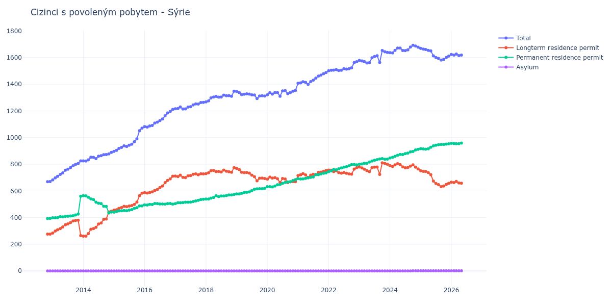

# Sýrie

## Souhrnné statistiky (Min/Max pro rok) / Summary Statistics (Min/Max per year)

| Year   | Total         | Longterm Residence Permit   | Permanent Residence Permit   | Asylum   |
|--------|---------------|-----------------------------|------------------------------|----------|
| 2012   | 669 / 670     | 276 / 276                   | 393 / 394                    | 0 / 0    |
| 2013   | 683 / 825     | 265 / 380                   | 399 / 560                    | 0 / 0    |
| 2014   | 824 / 889     | 261 / 447                   | 435 / 564                    | 0 / 0    |
| 2015   | 897 / 1 071   | 456 / 583                   | 441 / 488                    | 0 / 0    |
| 2016   | 1 078 / 1 211 | 584 / 710                   | 494 / 506                    | 0 / 0    |
| 2017   | 1 214 / 1 264 | 700 / 728                   | 505 / 537                    | 0 / 0    |
| 2018   | 1 268 / 1 348 | 729 / 774                   | 539 / 574                    | 0 / 0    |
| 2019   | 1 292 / 1 346 | 676 / 769                   | 577 / 619                    | 0 / 0    |
| 2020   | 1 310 / 1 353 | 662 / 704                   | 630 / 684                    | 0 / 0    |
| 2021   | 1 399 / 1 487 | 701 / 752                   | 689 / 735                    | 0 / 0    |
| 2022   | 1 501 / 1 569 | 726 / 774                   | 745 / 798                    | 0 / 0    |
| 2023   | 1 559 / 1 653 | 724 / 811                   | 799 / 842                    | 0 / 0    |
| 2024   | 1 635 / 1 692 | 765 / 804                   | 847 / 912                    | 0 / 1    |
| 2025   | 1 581 / 1 669 | 632 / 751                   | 913 / 953                    | 1 / 1    |
| 2026   | 1 615 / 1 626 | 658 / 671                   | 954 / 959                    | 1 / 1    |

## Detailní tabulka / Detailed Data Table

| Date     | Total          | Longterm Residence Permit   | Permanent Residence Permit   | Asylum     |
|----------|----------------|-----------------------------|------------------------------|------------|
| **2012** |                |                             |                              |            |
| 11.2012  | 669            | 276                         | 393                          | 0          |
| 12.2012  | 670 (+0.15%)   | 276 (+0.00%)                | 394 (+0.25%)                 | 0          |
| **2013** |                |                             |                              |            |
| 01.2013  | 683 (+1.94%)   | 284 (+2.90%)                | 399 (+1.27%)                 | 0          |
| 02.2013  | 698 (+2.20%)   | 299 (+5.28%)                | 399 (+0.00%)                 | 0          |
| 03.2013  | 709 (+1.58%)   | 309 (+3.34%)                | 400 (+0.25%)                 | 0          |
| 04.2013  | 724 (+2.12%)   | 317 (+2.59%)                | 407 (+1.75%)                 | 0          |
| 05.2013  | 735 (+1.52%)   | 330 (+4.10%)                | 405 (-0.49%)                 | 0          |
| 06.2013  | 755 (+2.72%)   | 346 (+4.85%)                | 409 (+0.99%)                 | 0          |
| 07.2013  | 763 (+1.06%)   | 353 (+2.02%)                | 410 (+0.24%)                 | 0          |
| 08.2013  | 774 (+1.44%)   | 362 (+2.55%)                | 412 (+0.49%)                 | 0          |
| 09.2013  | 789 (+1.94%)   | 375 (+3.59%)                | 414 (+0.49%)                 | 0          |
| 10.2013  | 799 (+1.27%)   | 379 (+1.07%)                | 420 (+1.45%)                 | 0          |
| 11.2013  | 806 (+0.88%)   | 380 (+0.26%)                | 426 (+1.43%)                 | 0          |
| 12.2013  | 825 (+2.36%)   | 265 (-30.26%)               | 560 (+31.46%)                | 0          |
| **2014** |                |                             |                              |            |
| 01.2014  | 825 (+0.00%)   | 261 (-1.51%)                | 564 (+0.71%)                 | 0          |
| 02.2014  | 824 (-0.12%)   | 261 (+0.00%)                | 563 (-0.18%)                 | 0          |
| 03.2014  | 833 (+1.09%)   | 280 (+7.28%)                | 553 (-1.78%)                 | 0          |
| 04.2014  | 853 (+2.40%)   | 313 (+11.79%)               | 540 (-2.35%)                 | 0          |
| 05.2014  | 852 (-0.12%)   | 317 (+1.28%)                | 535 (-0.93%)                 | 0          |
| 06.2014  | 842 (-1.17%)   | 327 (+3.15%)                | 515 (-3.74%)                 | 0          |
| 07.2014  | 860 (+2.14%)   | 352 (+7.65%)                | 508 (-1.36%)                 | 0          |
| 08.2014  | 864 (+0.47%)   | 359 (+1.99%)                | 505 (-0.59%)                 | 0          |
| 09.2014  | 872 (+0.93%)   | 387 (+7.80%)                | 485 (-3.96%)                 | 0          |
| 10.2014  | 873 (+0.11%)   | 389 (+0.52%)                | 484 (-0.21%)                 | 0          |
| 11.2014  | 878 (+0.57%)   | 443 (+13.88%)               | 435 (-10.12%)                | 0          |
| 12.2014  | 889 (+1.25%)   | 447 (+0.90%)                | 442 (+1.61%)                 | 0          |
| **2015** |                |                             |                              |            |
| 01.2015  | 897 (+0.90%)   | 456 (+2.01%)                | 441 (-0.23%)                 | 0          |
| 02.2015  | 904 (+0.78%)   | 459 (+0.66%)                | 445 (+0.91%)                 | 0          |
| 03.2015  | 919 (+1.66%)   | 469 (+2.18%)                | 450 (+1.12%)                 | 0          |
| 04.2015  | 926 (+0.76%)   | 475 (+1.28%)                | 451 (+0.22%)                 | 0          |
| 05.2015  | 938 (+1.30%)   | 485 (+2.11%)                | 453 (+0.44%)                 | 0          |
| 06.2015  | 933 (-0.53%)   | 482 (-0.62%)                | 451 (-0.44%)                 | 0          |
| 07.2015  | 943 (+1.07%)   | 487 (+1.04%)                | 456 (+1.11%)                 | 0          |
| 08.2015  | 950 (+0.74%)   | 490 (+0.62%)                | 460 (+0.88%)                 | 0          |
| 09.2015  | 968 (+1.89%)   | 499 (+1.84%)                | 469 (+1.96%)                 | 0          |
| 10.2015  | 990 (+2.27%)   | 516 (+3.41%)                | 474 (+1.07%)                 | 0          |
| 11.2015  | 1 052 (+6.26%) | 564 (+9.30%)                | 488 (+2.95%)                 | 0          |
| 12.2015  | 1 071 (+1.81%) | 583 (+3.37%)                | 488 (+0.00%)                 | 0          |
| **2016** |                |                             |                              |            |
| 01.2016  | 1 082 (+1.03%) | 587 (+0.69%)                | 495 (+1.43%)                 | 0          |
| 02.2016  | 1 078 (-0.37%) | 584 (-0.51%)                | 494 (-0.20%)                 | 0          |
| 03.2016  | 1 087 (+0.83%) | 588 (+0.68%)                | 499 (+1.01%)                 | 0          |
| 04.2016  | 1 091 (+0.37%) | 593 (+0.85%)                | 498 (-0.20%)                 | 0          |
| 05.2016  | 1 109 (+1.65%) | 603 (+1.69%)                | 506 (+1.61%)                 | 0          |
| 06.2016  | 1 116 (+0.63%) | 611 (+1.33%)                | 505 (-0.20%)                 | 0          |
| 07.2016  | 1 127 (+0.99%) | 625 (+2.29%)                | 502 (-0.59%)                 | 0          |
| 08.2016  | 1 139 (+1.06%) | 637 (+1.92%)                | 502 (+0.00%)                 | 0          |
| 09.2016  | 1 163 (+2.11%) | 662 (+3.92%)                | 501 (-0.20%)                 | 0          |
| 10.2016  | 1 184 (+1.81%) | 679 (+2.57%)                | 505 (+0.80%)                 | 0          |
| 11.2016  | 1 196 (+1.01%) | 690 (+1.62%)                | 506 (+0.20%)                 | 0          |
| 12.2016  | 1 211 (+1.25%) | 710 (+2.90%)                | 501 (-0.99%)                 | 0          |
| **2017** |                |                             |                              |            |
| 01.2017  | 1 216 (+0.41%) | 711 (+0.14%)                | 505 (+0.80%)                 | 0          |
| 02.2017  | 1 218 (+0.16%) | 707 (-0.56%)                | 511 (+1.19%)                 | 0          |
| 03.2017  | 1 229 (+0.90%) | 718 (+1.56%)                | 511 (+0.00%)                 | 0          |
| 04.2017  | 1 214 (-1.22%) | 702 (-2.23%)                | 512 (+0.20%)                 | 0          |
| 05.2017  | 1 215 (+0.08%) | 700 (-0.28%)                | 515 (+0.59%)                 | 0          |
| 06.2017  | 1 228 (+1.07%) | 713 (+1.86%)                | 515 (+0.00%)                 | 0          |
| 07.2017  | 1 231 (+0.24%) | 715 (+0.28%)                | 516 (+0.19%)                 | 0          |
| 08.2017  | 1 245 (+1.14%) | 725 (+1.40%)                | 520 (+0.78%)                 | 0          |
| 09.2017  | 1 252 (+0.56%) | 727 (+0.28%)                | 525 (+0.96%)                 | 0          |
| 10.2017  | 1 251 (-0.08%) | 721 (-0.83%)                | 530 (+0.95%)                 | 0          |
| 11.2017  | 1 263 (+0.96%) | 728 (+0.97%)                | 535 (+0.94%)                 | 0          |
| 12.2017  | 1 264 (+0.08%) | 727 (-0.14%)                | 537 (+0.37%)                 | 0          |
| **2018** |                |                             |                              |            |
| 01.2018  | 1 268 (+0.32%) | 729 (+0.28%)                | 539 (+0.37%)                 | 0          |
| 02.2018  | 1 275 (+0.55%) | 736 (+0.96%)                | 539 (+0.00%)                 | 0          |
| 03.2018  | 1 297 (+1.73%) | 751 (+2.04%)                | 546 (+1.30%)                 | 0          |
| 04.2018  | 1 304 (+0.54%) | 753 (+0.27%)                | 551 (+0.92%)                 | 0          |
| 05.2018  | 1 309 (+0.38%) | 745 (-1.06%)                | 564 (+2.36%)                 | 0          |
| 06.2018  | 1 303 (-0.46%) | 746 (+0.13%)                | 557 (-1.24%)                 | 0          |
| 07.2018  | 1 304 (+0.08%) | 742 (-0.54%)                | 562 (+0.90%)                 | 0          |
| 08.2018  | 1 318 (+1.07%) | 756 (+1.89%)                | 562 (+0.00%)                 | 0          |
| 09.2018  | 1 313 (-0.38%) | 748 (-1.06%)                | 565 (+0.53%)                 | 0          |
| 10.2018  | 1 314 (+0.08%) | 744 (-0.53%)                | 570 (+0.88%)                 | 0          |
| 11.2018  | 1 310 (-0.30%) | 740 (-0.54%)                | 570 (+0.00%)                 | 0          |
| 12.2018  | 1 348 (+2.90%) | 774 (+4.59%)                | 574 (+0.70%)                 | 0          |
| **2019** |                |                             |                              |            |
| 01.2019  | 1 346 (-0.15%) | 769 (-0.65%)                | 577 (+0.52%)                 | 0          |
| 02.2019  | 1 337 (-0.67%) | 760 (-1.17%)                | 577 (+0.00%)                 | 0          |
| 03.2019  | 1 322 (-1.12%) | 740 (-2.63%)                | 582 (+0.87%)                 | 0          |
| 04.2019  | 1 325 (+0.23%) | 737 (-0.41%)                | 588 (+1.03%)                 | 0          |
| 05.2019  | 1 328 (+0.23%) | 738 (+0.14%)                | 590 (+0.34%)                 | 0          |
| 06.2019  | 1 326 (-0.15%) | 733 (-0.68%)                | 593 (+0.51%)                 | 0          |
| 07.2019  | 1 320 (-0.45%) | 718 (-2.05%)                | 602 (+1.52%)                 | 0          |
| 08.2019  | 1 319 (-0.08%) | 706 (-1.67%)                | 613 (+1.83%)                 | 0          |
| 09.2019  | 1 292 (-2.05%) | 676 (-4.25%)                | 616 (+0.49%)                 | 0          |
| 10.2019  | 1 312 (+1.55%) | 695 (+2.81%)                | 617 (+0.16%)                 | 0          |
| 11.2019  | 1 313 (+0.08%) | 696 (+0.14%)                | 617 (+0.00%)                 | 0          |
| 12.2019  | 1 312 (-0.08%) | 693 (-0.43%)                | 619 (+0.32%)                 | 0          |
| **2020** |                |                             |                              |            |
| 01.2020  | 1 320 (+0.61%) | 688 (-0.72%)                | 632 (+2.10%)                 | 0          |
| 02.2020  | 1 336 (+1.21%) | 704 (+2.33%)                | 632 (+0.00%)                 | 0          |
| 03.2020  | 1 326 (-0.75%) | 696 (-1.14%)                | 630 (-0.32%)                 | 0          |
| 04.2020  | 1 337 (+0.83%) | 700 (+0.57%)                | 637 (+1.11%)                 | 0          |
| 05.2020  | 1 337 (+0.00%) | 691 (-1.29%)                | 646 (+1.41%)                 | 0          |
| 06.2020  | 1 310 (-2.02%) | 662 (-4.20%)                | 648 (+0.31%)                 | 0          |
| 07.2020  | 1 350 (+3.05%) | 693 (+4.68%)                | 657 (+1.39%)                 | 0          |
| 08.2020  | 1 352 (+0.15%) | 689 (-0.58%)                | 663 (+0.91%)                 | 0          |
| 09.2020  | 1 329 (-1.70%) | 662 (-3.92%)                | 667 (+0.60%)                 | 0          |
| 10.2020  | 1 337 (+0.60%) | 668 (+0.91%)                | 669 (+0.30%)                 | 0          |
| 11.2020  | 1 348 (+0.82%) | 670 (+0.30%)                | 678 (+1.35%)                 | 0          |
| 12.2020  | 1 353 (+0.37%) | 669 (-0.15%)                | 684 (+0.88%)                 | 0          |
| **2021** |                |                             |                              |            |
| 01.2021  | 1 407 (+3.99%) | 715 (+6.88%)                | 692 (+1.17%)                 | 0          |
| 02.2021  | 1 410 (+0.21%) | 721 (+0.84%)                | 689 (-0.43%)                 | 0          |
| 03.2021  | 1 419 (+0.64%) | 729 (+1.11%)                | 690 (+0.15%)                 | 0          |
| 04.2021  | 1 414 (-0.35%) | 720 (-1.23%)                | 694 (+0.58%)                 | 0          |
| 05.2021  | 1 399 (-1.06%) | 701 (-2.64%)                | 698 (+0.58%)                 | 0          |
| 06.2021  | 1 420 (+1.50%) | 718 (+2.43%)                | 702 (+0.57%)                 | 0          |
| 07.2021  | 1 430 (+0.70%) | 725 (+0.97%)                | 705 (+0.43%)                 | 0          |
| 08.2021  | 1 445 (+1.05%) | 723 (-0.28%)                | 722 (+2.41%)                 | 0          |
| 09.2021  | 1 461 (+1.11%) | 739 (+2.21%)                | 722 (+0.00%)                 | 0          |
| 10.2021  | 1 468 (+0.48%) | 741 (+0.27%)                | 727 (+0.69%)                 | 0          |
| 11.2021  | 1 479 (+0.75%) | 747 (+0.81%)                | 732 (+0.69%)                 | 0          |
| 12.2021  | 1 487 (+0.54%) | 752 (+0.67%)                | 735 (+0.41%)                 | 0          |
| **2022** |                |                             |                              |            |
| 01.2022  | 1 501 (+0.94%) | 756 (+0.53%)                | 745 (+1.36%)                 | 0          |
| 02.2022  | 1 505 (+0.27%) | 755 (-0.13%)                | 750 (+0.67%)                 | 0          |
| 03.2022  | 1 506 (+0.07%) | 745 (-1.32%)                | 761 (+1.47%)                 | 0          |
| 04.2022  | 1 509 (+0.20%) | 751 (+0.81%)                | 758 (-0.39%)                 | 0          |
| 05.2022  | 1 503 (-0.40%) | 737 (-1.86%)                | 766 (+1.06%)                 | 0          |
| 06.2022  | 1 505 (+0.13%) | 733 (-0.54%)                | 772 (+0.78%)                 | 0          |
| 07.2022  | 1 516 (+0.73%) | 738 (+0.68%)                | 778 (+0.78%)                 | 0          |
| 08.2022  | 1 513 (-0.20%) | 732 (-0.81%)                | 781 (+0.39%)                 | 0          |
| 09.2022  | 1 516 (+0.20%) | 727 (-0.68%)                | 789 (+1.02%)                 | 0          |
| 10.2022  | 1 523 (+0.46%) | 726 (-0.14%)                | 797 (+1.01%)                 | 0          |
| 11.2022  | 1 562 (+2.56%) | 764 (+5.23%)                | 798 (+0.13%)                 | 0          |
| 12.2022  | 1 569 (+0.45%) | 774 (+1.31%)                | 795 (-0.38%)                 | 0          |
| **2023** |                |                             |                              |            |
| 01.2023  | 1 578 (+0.57%) | 779 (+0.65%)                | 799 (+0.50%)                 | 0          |
| 02.2023  | 1 574 (-0.25%) | 772 (-0.90%)                | 802 (+0.38%)                 | 0          |
| 03.2023  | 1 570 (-0.25%) | 763 (-1.17%)                | 807 (+0.62%)                 | 0          |
| 04.2023  | 1 559 (-0.70%) | 752 (-1.44%)                | 807 (+0.00%)                 | 0          |
| 05.2023  | 1 561 (+0.13%) | 745 (-0.93%)                | 816 (+1.12%)                 | 0          |
| 06.2023  | 1 598 (+2.37%) | 774 (+3.89%)                | 824 (+0.98%)                 | 0          |
| 07.2023  | 1 608 (+0.63%) | 778 (+0.52%)                | 830 (+0.73%)                 | 0          |
| 08.2023  | 1 614 (+0.37%) | 779 (+0.13%)                | 835 (+0.60%)                 | 0          |
| 09.2023  | 1 563 (-3.16%) | 724 (-7.06%)                | 839 (+0.48%)                 | 0          |
| 10.2023  | 1 653 (+5.76%) | 811 (+12.02%)               | 842 (+0.36%)                 | 0          |
| 11.2023  | 1 643 (-0.60%) | 806 (-0.62%)                | 837 (-0.59%)                 | 0          |
| 12.2023  | 1 638 (-0.30%) | 800 (-0.74%)                | 838 (+0.12%)                 | 0          |
| **2024** |                |                             |                              |            |
| 01.2024  | 1 637 (-0.06%) | 790 (-1.25%)                | 847 (+1.07%)                 | 0          |
| 02.2024  | 1 635 (-0.12%) | 783 (-0.89%)                | 852 (+0.59%)                 | 0          |
| 03.2024  | 1 654 (+1.16%) | 795 (+1.53%)                | 859 (+0.82%)                 | 0          |
| 04.2024  | 1 671 (+1.03%) | 804 (+1.13%)                | 867 (+0.93%)                 | 0          |
| 05.2024  | 1 671 (+0.00%) | 797 (-0.87%)                | 874 (+0.81%)                 | 0          |
| 06.2024  | 1 653 (-1.08%) | 780 (-2.13%)                | 873 (-0.11%)                 | 0          |
| 07.2024  | 1 652 (-0.06%) | 773 (-0.90%)                | 879 (+0.69%)                 | 0          |
| 08.2024  | 1 658 (+0.36%) | 775 (+0.26%)                | 883 (+0.46%)                 | 0          |
| 09.2024  | 1 679 (+1.27%) | 786 (+1.42%)                | 893 (+1.13%)                 | 0          |
| 10.2024  | 1 692 (+0.77%) | 795 (+1.15%)                | 896 (+0.34%)                 | 1          |
| 11.2024  | 1 686 (-0.35%) | 778 (-2.14%)                | 907 (+1.23%)                 | 1 (+0.00%) |
| 12.2024  | 1 678 (-0.47%) | 765 (-1.67%)                | 912 (+0.55%)                 | 1 (+0.00%) |
| **2025** |                |                             |                              |            |
| 01.2025  | 1 669 (-0.54%) | 751 (-1.83%)                | 917 (+0.55%)                 | 1 (+0.00%) |
| 02.2025  | 1 663 (-0.36%) | 747 (-0.53%)                | 915 (-0.22%)                 | 1 (+0.00%) |
| 03.2025  | 1 660 (-0.18%) | 746 (-0.13%)                | 913 (-0.22%)                 | 1 (+0.00%) |
| 04.2025  | 1 654 (-0.36%) | 737 (-1.21%)                | 916 (+0.33%)                 | 1 (+0.00%) |
| 05.2025  | 1 650 (-0.24%) | 722 (-2.04%)                | 927 (+1.20%)                 | 1 (+0.00%) |
| 06.2025  | 1 613 (-2.24%) | 674 (-6.65%)                | 938 (+1.19%)                 | 1 (+0.00%) |
| 07.2025  | 1 600 (-0.81%) | 656 (-2.67%)                | 943 (+0.53%)                 | 1 (+0.00%) |
| 08.2025  | 1 594 (-0.38%) | 647 (-1.37%)                | 946 (+0.32%)                 | 1 (+0.00%) |
| 09.2025  | 1 581 (-0.82%) | 632 (-2.32%)                | 948 (+0.21%)                 | 1 (+0.00%) |
| 10.2025  | 1 586 (+0.32%) | 637 (+0.79%)                | 948 (+0.00%)                 | 1 (+0.00%) |
| 11.2025  | 1 600 (+0.88%) | 648 (+1.73%)                | 951 (+0.32%)                 | 1 (+0.00%) |
| 12.2025  | 1 611 (+0.69%) | 657 (+1.39%)                | 953 (+0.21%)                 | 1 (+0.00%) |
| **2026** |                |                             |                              |            |
| 01.2026  | 1 623 (+0.74%) | 665 (+1.22%)                | 957 (+0.42%)                 | 1 (+0.00%) |
| 02.2026  | 1 618 (-0.31%) | 662 (-0.45%)                | 955 (-0.21%)                 | 1 (+0.00%) |
| 03.2026  | 1 626 (+0.49%) | 671 (+1.36%)                | 954 (-0.10%)                 | 1 (+0.00%) |
| 04.2026  | 1 615 (-0.68%) | 660 (-1.64%)                | 954 (+0.00%)                 | 1 (+0.00%) |
| 05.2026  | 1 618 (+0.19%) | 658 (-0.30%)                | 959 (+0.52%)                 | 1 (+0.00%) |
