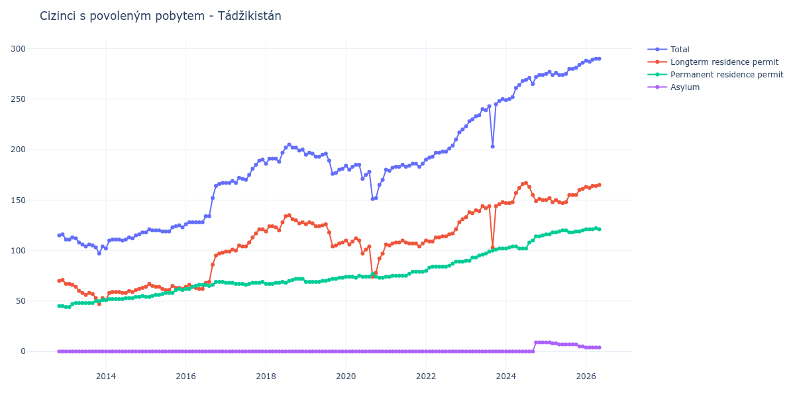

# Tádžikistán

## Souhrnné statistiky (Min/Max pro rok) / Summary Statistics (Min/Max per year)

| Year   | Total     | Longterm Residence Permit   | Permanent Residence Permit   | Asylum   |
|--------|-----------|-----------------------------|------------------------------|----------|
| 2012   | 115 / 116 | 70 / 71                     | 45 / 45                      | 0 / 0    |
| 2013   | 97 / 113  | 47 / 67                     | 44 / 51                      | 0 / 0    |
| 2014   | 102 / 118 | 51 / 63                     | 51 / 55                      | 0 / 0    |
| 2015   | 118 / 125 | 61 / 67                     | 54 / 62                      | 0 / 0    |
| 2016   | 126 / 167 | 62 / 98                     | 62 / 69                      | 0 / 0    |
| 2017   | 167 / 190 | 99 / 121                    | 66 / 69                      | 0 / 0    |
| 2018   | 186 / 205 | 119 / 135                   | 67 / 72                      | 0 / 0    |
| 2019   | 176 / 197 | 104 / 128                   | 69 / 73                      | 0 / 0    |
| 2020   | 151 / 185 | 74 / 112                    | 73 / 77                      | 0 / 0    |
| 2021   | 179 / 186 | 104 / 110                   | 74 / 79                      | 0 / 0    |
| 2022   | 190 / 220 | 109 / 131                   | 80 / 89                      | 0 / 0    |
| 2023   | 203 / 250 | 103 / 148                   | 90 / 102                     | 0 / 0    |
| 2024   | 249 / 274 | 147 / 167                   | 102 / 115                    | 0 / 9    |
| 2025   | 274 / 286 | 147 / 161                   | 116 / 120                    | 5 / 9    |

## Detailní tabulka / Detailed Data Table

| Date     | Total         | Longterm Residence Permit   | Permanent Residence Permit   | Asylum      |
|----------|---------------|-----------------------------|------------------------------|-------------|
| **2012** |               |                             |                              |             |
| 11.2012  | 115           | 70                          | 45                           | 0           |
| 12.2012  | 116 (+0.87%)  | 71 (+1.43%)                 | 45 (+0.00%)                  | 0           |
| **2013** |               |                             |                              |             |
| 01.2013  | 111 (-4.31%)  | 67 (-5.63%)                 | 44 (-2.22%)                  | 0           |
| 02.2013  | 111 (+0.00%)  | 67 (+0.00%)                 | 44 (+0.00%)                  | 0           |
| 03.2013  | 113 (+1.80%)  | 66 (-1.49%)                 | 47 (+6.82%)                  | 0           |
| 04.2013  | 112 (-0.88%)  | 64 (-3.03%)                 | 48 (+2.13%)                  | 0           |
| 05.2013  | 108 (-3.57%)  | 60 (-6.25%)                 | 48 (+0.00%)                  | 0           |
| 06.2013  | 106 (-1.85%)  | 58 (-3.33%)                 | 48 (+0.00%)                  | 0           |
| 07.2013  | 104 (-1.89%)  | 56 (-3.45%)                 | 48 (+0.00%)                  | 0           |
| 08.2013  | 106 (+1.92%)  | 58 (+3.57%)                 | 48 (+0.00%)                  | 0           |
| 09.2013  | 105 (-0.94%)  | 57 (-1.72%)                 | 48 (+0.00%)                  | 0           |
| 10.2013  | 103 (-1.90%)  | 53 (-7.02%)                 | 50 (+4.17%)                  | 0           |
| 11.2013  | 97 (-5.83%)   | 47 (-11.32%)                | 50 (+0.00%)                  | 0           |
| 12.2013  | 104 (+7.22%)  | 53 (+12.77%)                | 51 (+2.00%)                  | 0           |
| **2014** |               |                             |                              |             |
| 01.2014  | 102 (-1.92%)  | 51 (-3.77%)                 | 51 (+0.00%)                  | 0           |
| 02.2014  | 110 (+7.84%)  | 58 (+13.73%)                | 52 (+1.96%)                  | 0           |
| 03.2014  | 111 (+0.91%)  | 59 (+1.72%)                 | 52 (+0.00%)                  | 0           |
| 04.2014  | 111 (+0.00%)  | 59 (+0.00%)                 | 52 (+0.00%)                  | 0           |
| 05.2014  | 111 (+0.00%)  | 59 (+0.00%)                 | 52 (+0.00%)                  | 0           |
| 06.2014  | 110 (-0.90%)  | 58 (-1.69%)                 | 52 (+0.00%)                  | 0           |
| 07.2014  | 111 (+0.91%)  | 58 (+0.00%)                 | 53 (+1.92%)                  | 0           |
| 08.2014  | 113 (+1.80%)  | 60 (+3.45%)                 | 53 (+0.00%)                  | 0           |
| 09.2014  | 112 (-0.88%)  | 59 (-1.67%)                 | 53 (+0.00%)                  | 0           |
| 10.2014  | 115 (+2.68%)  | 61 (+3.39%)                 | 54 (+1.89%)                  | 0           |
| 11.2014  | 116 (+0.87%)  | 62 (+1.64%)                 | 54 (+0.00%)                  | 0           |
| 12.2014  | 118 (+1.72%)  | 63 (+1.61%)                 | 55 (+1.85%)                  | 0           |
| **2015** |               |                             |                              |             |
| 01.2015  | 118 (+0.00%)  | 64 (+1.59%)                 | 54 (-1.82%)                  | 0           |
| 02.2015  | 121 (+2.54%)  | 67 (+4.69%)                 | 54 (+0.00%)                  | 0           |
| 03.2015  | 120 (-0.83%)  | 65 (-2.99%)                 | 55 (+1.85%)                  | 0           |
| 04.2015  | 120 (+0.00%)  | 64 (-1.54%)                 | 56 (+1.82%)                  | 0           |
| 05.2015  | 120 (+0.00%)  | 64 (+0.00%)                 | 56 (+0.00%)                  | 0           |
| 06.2015  | 119 (-0.83%)  | 62 (-3.12%)                 | 57 (+1.79%)                  | 0           |
| 07.2015  | 119 (+0.00%)  | 61 (-1.61%)                 | 58 (+1.75%)                  | 0           |
| 08.2015  | 119 (+0.00%)  | 61 (+0.00%)                 | 58 (+0.00%)                  | 0           |
| 09.2015  | 123 (+3.36%)  | 65 (+6.56%)                 | 58 (+0.00%)                  | 0           |
| 10.2015  | 124 (+0.81%)  | 63 (-3.08%)                 | 61 (+5.17%)                  | 0           |
| 11.2015  | 125 (+0.81%)  | 63 (+0.00%)                 | 62 (+1.64%)                  | 0           |
| 12.2015  | 123 (-1.60%)  | 62 (-1.59%)                 | 61 (-1.61%)                  | 0           |
| **2016** |               |                             |                              |             |
| 01.2016  | 126 (+2.44%)  | 64 (+3.23%)                 | 62 (+1.64%)                  | 0           |
| 02.2016  | 128 (+1.59%)  | 66 (+3.12%)                 | 62 (+0.00%)                  | 0           |
| 03.2016  | 128 (+0.00%)  | 64 (-3.03%)                 | 64 (+3.23%)                  | 0           |
| 04.2016  | 128 (+0.00%)  | 63 (-1.56%)                 | 65 (+1.56%)                  | 0           |
| 05.2016  | 128 (+0.00%)  | 62 (-1.59%)                 | 66 (+1.54%)                  | 0           |
| 06.2016  | 128 (+0.00%)  | 62 (+0.00%)                 | 66 (+0.00%)                  | 0           |
| 07.2016  | 134 (+4.69%)  | 68 (+9.68%)                 | 66 (+0.00%)                  | 0           |
| 08.2016  | 134 (+0.00%)  | 69 (+1.47%)                 | 65 (-1.52%)                  | 0           |
| 09.2016  | 152 (+13.43%) | 86 (+24.64%)                | 66 (+1.54%)                  | 0           |
| 10.2016  | 164 (+7.89%)  | 95 (+10.47%)                | 69 (+4.55%)                  | 0           |
| 11.2016  | 166 (+1.22%)  | 97 (+2.11%)                 | 69 (+0.00%)                  | 0           |
| 12.2016  | 167 (+0.60%)  | 98 (+1.03%)                 | 69 (+0.00%)                  | 0           |
| **2017** |               |                             |                              |             |
| 01.2017  | 167 (+0.00%)  | 99 (+1.02%)                 | 68 (-1.45%)                  | 0           |
| 02.2017  | 167 (+0.00%)  | 99 (+0.00%)                 | 68 (+0.00%)                  | 0           |
| 03.2017  | 169 (+1.20%)  | 101 (+2.02%)                | 68 (+0.00%)                  | 0           |
| 04.2017  | 167 (-1.18%)  | 100 (-0.99%)                | 67 (-1.47%)                  | 0           |
| 05.2017  | 172 (+2.99%)  | 105 (+5.00%)                | 67 (+0.00%)                  | 0           |
| 06.2017  | 171 (-0.58%)  | 104 (-0.95%)                | 67 (+0.00%)                  | 0           |
| 07.2017  | 170 (-0.58%)  | 104 (+0.00%)                | 66 (-1.49%)                  | 0           |
| 08.2017  | 175 (+2.94%)  | 108 (+3.85%)                | 67 (+1.52%)                  | 0           |
| 09.2017  | 181 (+3.43%)  | 113 (+4.63%)                | 68 (+1.49%)                  | 0           |
| 10.2017  | 185 (+2.21%)  | 117 (+3.54%)                | 68 (+0.00%)                  | 0           |
| 11.2017  | 189 (+2.16%)  | 121 (+3.42%)                | 68 (+0.00%)                  | 0           |
| 12.2017  | 190 (+0.53%)  | 121 (+0.00%)                | 69 (+1.47%)                  | 0           |
| **2018** |               |                             |                              |             |
| 01.2018  | 186 (-2.11%)  | 119 (-1.65%)                | 67 (-2.90%)                  | 0           |
| 02.2018  | 191 (+2.69%)  | 124 (+4.20%)                | 67 (+0.00%)                  | 0           |
| 03.2018  | 191 (+0.00%)  | 124 (+0.00%)                | 67 (+0.00%)                  | 0           |
| 04.2018  | 191 (+0.00%)  | 123 (-0.81%)                | 68 (+1.49%)                  | 0           |
| 05.2018  | 188 (-1.57%)  | 120 (-2.44%)                | 68 (+0.00%)                  | 0           |
| 06.2018  | 197 (+4.79%)  | 128 (+6.67%)                | 69 (+1.47%)                  | 0           |
| 07.2018  | 202 (+2.54%)  | 134 (+4.69%)                | 68 (-1.45%)                  | 0           |
| 08.2018  | 205 (+1.49%)  | 135 (+0.75%)                | 70 (+2.94%)                  | 0           |
| 09.2018  | 202 (-1.46%)  | 131 (-2.96%)                | 71 (+1.43%)                  | 0           |
| 10.2018  | 202 (+0.00%)  | 130 (-0.76%)                | 72 (+1.41%)                  | 0           |
| 11.2018  | 199 (-1.49%)  | 127 (-2.31%)                | 72 (+0.00%)                  | 0           |
| 12.2018  | 200 (+0.50%)  | 128 (+0.79%)                | 72 (+0.00%)                  | 0           |
| **2019** |               |                             |                              |             |
| 01.2019  | 195 (-2.50%)  | 126 (-1.56%)                | 69 (-4.17%)                  | 0           |
| 02.2019  | 197 (+1.03%)  | 128 (+1.59%)                | 69 (+0.00%)                  | 0           |
| 03.2019  | 196 (-0.51%)  | 127 (-0.78%)                | 69 (+0.00%)                  | 0           |
| 04.2019  | 193 (-1.53%)  | 124 (-2.36%)                | 69 (+0.00%)                  | 0           |
| 05.2019  | 193 (+0.00%)  | 124 (+0.00%)                | 69 (+0.00%)                  | 0           |
| 06.2019  | 195 (+1.04%)  | 125 (+0.81%)                | 70 (+1.45%)                  | 0           |
| 07.2019  | 196 (+0.51%)  | 126 (+0.80%)                | 70 (+0.00%)                  | 0           |
| 08.2019  | 189 (-3.57%)  | 118 (-6.35%)                | 71 (+1.43%)                  | 0           |
| 09.2019  | 176 (-6.88%)  | 104 (-11.86%)               | 72 (+1.41%)                  | 0           |
| 10.2019  | 177 (+0.57%)  | 105 (+0.96%)                | 72 (+0.00%)                  | 0           |
| 11.2019  | 180 (+1.69%)  | 107 (+1.90%)                | 73 (+1.39%)                  | 0           |
| 12.2019  | 181 (+0.56%)  | 108 (+0.93%)                | 73 (+0.00%)                  | 0           |
| **2020** |               |                             |                              |             |
| 01.2020  | 184 (+1.66%)  | 110 (+1.85%)                | 74 (+1.37%)                  | 0           |
| 02.2020  | 180 (-2.17%)  | 106 (-3.64%)                | 74 (+0.00%)                  | 0           |
| 03.2020  | 183 (+1.67%)  | 109 (+2.83%)                | 74 (+0.00%)                  | 0           |
| 04.2020  | 185 (+1.09%)  | 112 (+2.75%)                | 73 (-1.35%)                  | 0           |
| 05.2020  | 185 (+0.00%)  | 110 (-1.79%)                | 75 (+2.74%)                  | 0           |
| 06.2020  | 171 (-7.57%)  | 97 (-11.82%)                | 74 (-1.33%)                  | 0           |
| 07.2020  | 175 (+2.34%)  | 101 (+4.12%)                | 74 (+0.00%)                  | 0           |
| 08.2020  | 178 (+1.71%)  | 104 (+2.97%)                | 74 (+0.00%)                  | 0           |
| 09.2020  | 151 (-15.17%) | 74 (-28.85%)                | 77 (+4.05%)                  | 0           |
| 10.2020  | 152 (+0.66%)  | 78 (+5.41%)                 | 74 (-3.90%)                  | 0           |
| 11.2020  | 165 (+8.55%)  | 92 (+17.95%)                | 73 (-1.35%)                  | 0           |
| 12.2020  | 170 (+3.03%)  | 97 (+5.43%)                 | 73 (+0.00%)                  | 0           |
| **2021** |               |                             |                              |             |
| 01.2021  | 180 (+5.88%)  | 106 (+9.28%)                | 74 (+1.37%)                  | 0           |
| 02.2021  | 179 (-0.56%)  | 105 (-0.94%)                | 74 (+0.00%)                  | 0           |
| 03.2021  | 182 (+1.68%)  | 107 (+1.90%)                | 75 (+1.35%)                  | 0           |
| 04.2021  | 183 (+0.55%)  | 108 (+0.93%)                | 75 (+0.00%)                  | 0           |
| 05.2021  | 183 (+0.00%)  | 108 (+0.00%)                | 75 (+0.00%)                  | 0           |
| 06.2021  | 185 (+1.09%)  | 110 (+1.85%)                | 75 (+0.00%)                  | 0           |
| 07.2021  | 183 (-1.08%)  | 108 (-1.82%)                | 75 (+0.00%)                  | 0           |
| 08.2021  | 184 (+0.55%)  | 107 (-0.93%)                | 77 (+2.67%)                  | 0           |
| 09.2021  | 186 (+1.09%)  | 107 (+0.00%)                | 79 (+2.60%)                  | 0           |
| 10.2021  | 186 (+0.00%)  | 107 (+0.00%)                | 79 (+0.00%)                  | 0           |
| 11.2021  | 183 (-1.61%)  | 104 (-2.80%)                | 79 (+0.00%)                  | 0           |
| 12.2021  | 186 (+1.64%)  | 107 (+2.88%)                | 79 (+0.00%)                  | 0           |
| **2022** |               |                             |                              |             |
| 01.2022  | 190 (+2.15%)  | 110 (+2.80%)                | 80 (+1.27%)                  | 0           |
| 02.2022  | 192 (+1.05%)  | 109 (-0.91%)                | 83 (+3.75%)                  | 0           |
| 03.2022  | 193 (+0.52%)  | 109 (+0.00%)                | 84 (+1.20%)                  | 0           |
| 04.2022  | 197 (+2.07%)  | 113 (+3.67%)                | 84 (+0.00%)                  | 0           |
| 05.2022  | 197 (+0.00%)  | 113 (+0.00%)                | 84 (+0.00%)                  | 0           |
| 06.2022  | 198 (+0.51%)  | 114 (+0.88%)                | 84 (+0.00%)                  | 0           |
| 07.2022  | 198 (+0.00%)  | 114 (+0.00%)                | 84 (+0.00%)                  | 0           |
| 08.2022  | 201 (+1.52%)  | 116 (+1.75%)                | 85 (+1.19%)                  | 0           |
| 09.2022  | 204 (+1.49%)  | 117 (+0.86%)                | 87 (+2.35%)                  | 0           |
| 10.2022  | 210 (+2.94%)  | 121 (+3.42%)                | 89 (+2.30%)                  | 0           |
| 11.2022  | 217 (+3.33%)  | 128 (+5.79%)                | 89 (+0.00%)                  | 0           |
| 12.2022  | 220 (+1.38%)  | 131 (+2.34%)                | 89 (+0.00%)                  | 0           |
| **2023** |               |                             |                              |             |
| 01.2023  | 223 (+1.36%)  | 133 (+1.53%)                | 90 (+1.12%)                  | 0           |
| 02.2023  | 228 (+2.24%)  | 138 (+3.76%)                | 90 (+0.00%)                  | 0           |
| 03.2023  | 230 (+0.88%)  | 137 (-0.72%)                | 93 (+3.33%)                  | 0           |
| 04.2023  | 233 (+1.30%)  | 140 (+2.19%)                | 93 (+0.00%)                  | 0           |
| 05.2023  | 234 (+0.43%)  | 139 (-0.71%)                | 95 (+2.15%)                  | 0           |
| 06.2023  | 240 (+2.56%)  | 144 (+3.60%)                | 96 (+1.05%)                  | 0           |
| 07.2023  | 239 (-0.42%)  | 142 (-1.39%)                | 97 (+1.04%)                  | 0           |
| 08.2023  | 243 (+1.67%)  | 144 (+1.41%)                | 99 (+2.06%)                  | 0           |
| 09.2023  | 203 (-16.46%) | 103 (-28.47%)               | 100 (+1.01%)                 | 0           |
| 10.2023  | 245 (+20.69%) | 144 (+39.81%)               | 101 (+1.00%)                 | 0           |
| 11.2023  | 248 (+1.22%)  | 146 (+1.39%)                | 102 (+0.99%)                 | 0           |
| 12.2023  | 250 (+0.81%)  | 148 (+1.37%)                | 102 (+0.00%)                 | 0           |
| **2024** |               |                             |                              |             |
| 01.2024  | 249 (-0.40%)  | 147 (-0.68%)                | 102 (+0.00%)                 | 0           |
| 02.2024  | 250 (+0.40%)  | 147 (+0.00%)                | 103 (+0.98%)                 | 0           |
| 03.2024  | 252 (+0.80%)  | 148 (+0.68%)                | 104 (+0.97%)                 | 0           |
| 04.2024  | 261 (+3.57%)  | 157 (+6.08%)                | 104 (+0.00%)                 | 0           |
| 05.2024  | 264 (+1.15%)  | 162 (+3.18%)                | 102 (-1.92%)                 | 0           |
| 06.2024  | 268 (+1.52%)  | 166 (+2.47%)                | 102 (+0.00%)                 | 0           |
| 07.2024  | 269 (+0.37%)  | 167 (+0.60%)                | 102 (+0.00%)                 | 0           |
| 08.2024  | 271 (+0.74%)  | 163 (-2.40%)                | 108 (+5.88%)                 | 0           |
| 09.2024  | 265 (-2.21%)  | 155 (-4.91%)                | 110 (+1.85%)                 | 0           |
| 10.2024  | 272 (+2.64%)  | 149 (-3.87%)                | 114 (+3.64%)                 | 9           |
| 11.2024  | 274 (+0.74%)  | 151 (+1.34%)                | 114 (+0.00%)                 | 9 (+0.00%)  |
| 12.2024  | 274 (+0.00%)  | 150 (-0.66%)                | 115 (+0.88%)                 | 9 (+0.00%)  |
| **2025** |               |                             |                              |             |
| 01.2025  | 275 (+0.36%)  | 150 (+0.00%)                | 116 (+0.87%)                 | 9 (+0.00%)  |
| 02.2025  | 277 (+0.73%)  | 152 (+1.33%)                | 116 (+0.00%)                 | 9 (+0.00%)  |
| 03.2025  | 274 (-1.08%)  | 148 (-2.63%)                | 118 (+1.72%)                 | 8 (-11.11%) |
| 04.2025  | 276 (+0.73%)  | 150 (+1.35%)                | 118 (+0.00%)                 | 8 (+0.00%)  |
| 05.2025  | 274 (-0.72%)  | 148 (-1.33%)                | 119 (+0.85%)                 | 7 (-12.50%) |
| 06.2025  | 274 (+0.00%)  | 147 (-0.68%)                | 120 (+0.84%)                 | 7 (+0.00%)  |
| 07.2025  | 275 (+0.36%)  | 148 (+0.68%)                | 120 (+0.00%)                 | 7 (+0.00%)  |
| 08.2025  | 280 (+1.82%)  | 155 (+4.73%)                | 118 (-1.67%)                 | 7 (+0.00%)  |
| 09.2025  | 280 (+0.00%)  | 155 (+0.00%)                | 118 (+0.00%)                 | 7 (+0.00%)  |
| 10.2025  | 281 (+0.36%)  | 155 (+0.00%)                | 119 (+0.85%)                 | 7 (+0.00%)  |
| 11.2025  | 284 (+1.07%)  | 160 (+3.23%)                | 119 (+0.00%)                 | 5 (-28.57%) |
| 12.2025  | 286 (+0.70%)  | 161 (+0.63%)                | 120 (+0.84%)                 | 5 (+0.00%)  |
