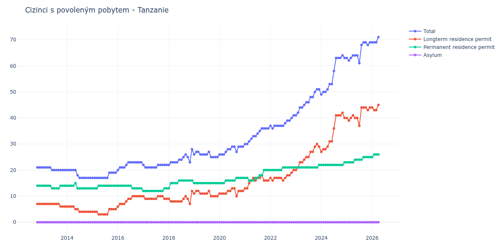

# Tanzanie

## Souhrnné statistiky (Min/Max pro rok) / Summary Statistics (Min/Max per year)

| Year   | Total   | Longterm Residence Permit   | Permanent Residence Permit   | Asylum   |
|--------|---------|-----------------------------|------------------------------|----------|
| 2012   | 21 / 21 | 7 / 7                       | 14 / 14                      | 0 / 0    |
| 2013   | 20 / 21 | 6 / 7                       | 13 / 14                      | 0 / 0    |
| 2014   | 17 / 20 | 4 / 6                       | 13 / 15                      | 0 / 0    |
| 2015   | 17 / 19 | 3 / 5                       | 13 / 14                      | 0 / 0    |
| 2016   | 20 / 23 | 6 / 10                      | 13 / 14                      | 0 / 0    |
| 2017   | 21 / 22 | 9 / 10                      | 12 / 13                      | 0 / 0    |
| 2018   | 22 / 28 | 7 / 12                      | 13 / 16                      | 0 / 0    |
| 2019   | 25 / 27 | 10 / 12                     | 15 / 15                      | 0 / 0    |
| 2020   | 26 / 29 | 10 / 13                     | 15 / 17                      | 0 / 0    |
| 2021   | 30 / 36 | 13 / 18                     | 16 / 20                      | 0 / 0    |
| 2022   | 36 / 41 | 16 / 20                     | 20 / 21                      | 0 / 0    |
| 2023   | 41 / 51 | 20 / 30                     | 21 / 22                      | 0 / 0    |
| 2024   | 49 / 64 | 27 / 42                     | 22 / 23                      | 0 / 0    |
| 2025   | 61 / 69 | 37 / 44                     | 23 / 25                      | 0 / 0    |
| 2026   | 69 / 71 | 43 / 45                     | 25 / 26                      | 0 / 0    |

## Detailní tabulka / Detailed Data Table

| Date     | Total        | Longterm Residence Permit   | Permanent Residence Permit   | Asylum   |
|----------|--------------|-----------------------------|------------------------------|----------|
| **2012** |              |                             |                              |          |
| 11.2012  | 21           | 7                           | 14                           | 0        |
| 12.2012  | 21 (+0.00%)  | 7 (+0.00%)                  | 14 (+0.00%)                  | 0        |
| **2013** |              |                             |                              |          |
| 01.2013  | 21 (+0.00%)  | 7 (+0.00%)                  | 14 (+0.00%)                  | 0        |
| 02.2013  | 21 (+0.00%)  | 7 (+0.00%)                  | 14 (+0.00%)                  | 0        |
| 03.2013  | 21 (+0.00%)  | 7 (+0.00%)                  | 14 (+0.00%)                  | 0        |
| 04.2013  | 21 (+0.00%)  | 7 (+0.00%)                  | 14 (+0.00%)                  | 0        |
| 05.2013  | 21 (+0.00%)  | 7 (+0.00%)                  | 14 (+0.00%)                  | 0        |
| 06.2013  | 20 (-4.76%)  | 7 (+0.00%)                  | 13 (-7.14%)                  | 0        |
| 07.2013  | 20 (+0.00%)  | 7 (+0.00%)                  | 13 (+0.00%)                  | 0        |
| 08.2013  | 20 (+0.00%)  | 7 (+0.00%)                  | 13 (+0.00%)                  | 0        |
| 09.2013  | 20 (+0.00%)  | 7 (+0.00%)                  | 13 (+0.00%)                  | 0        |
| 10.2013  | 20 (+0.00%)  | 6 (-14.29%)                 | 14 (+7.69%)                  | 0        |
| 11.2013  | 20 (+0.00%)  | 6 (+0.00%)                  | 14 (+0.00%)                  | 0        |
| 12.2013  | 20 (+0.00%)  | 6 (+0.00%)                  | 14 (+0.00%)                  | 0        |
| **2014** |              |                             |                              |          |
| 01.2014  | 20 (+0.00%)  | 6 (+0.00%)                  | 14 (+0.00%)                  | 0        |
| 02.2014  | 20 (+0.00%)  | 6 (+0.00%)                  | 14 (+0.00%)                  | 0        |
| 03.2014  | 20 (+0.00%)  | 6 (+0.00%)                  | 14 (+0.00%)                  | 0        |
| 04.2014  | 20 (+0.00%)  | 6 (+0.00%)                  | 14 (+0.00%)                  | 0        |
| 05.2014  | 20 (+0.00%)  | 5 (-16.67%)                 | 15 (+7.14%)                  | 0        |
| 06.2014  | 18 (-10.00%) | 5 (+0.00%)                  | 13 (-13.33%)                 | 0        |
| 07.2014  | 17 (-5.56%)  | 4 (-20.00%)                 | 13 (+0.00%)                  | 0        |
| 08.2014  | 17 (+0.00%)  | 4 (+0.00%)                  | 13 (+0.00%)                  | 0        |
| 09.2014  | 17 (+0.00%)  | 4 (+0.00%)                  | 13 (+0.00%)                  | 0        |
| 10.2014  | 17 (+0.00%)  | 4 (+0.00%)                  | 13 (+0.00%)                  | 0        |
| 11.2014  | 17 (+0.00%)  | 4 (+0.00%)                  | 13 (+0.00%)                  | 0        |
| 12.2014  | 17 (+0.00%)  | 4 (+0.00%)                  | 13 (+0.00%)                  | 0        |
| **2015** |              |                             |                              |          |
| 01.2015  | 17 (+0.00%)  | 4 (+0.00%)                  | 13 (+0.00%)                  | 0        |
| 02.2015  | 17 (+0.00%)  | 4 (+0.00%)                  | 13 (+0.00%)                  | 0        |
| 03.2015  | 17 (+0.00%)  | 4 (+0.00%)                  | 13 (+0.00%)                  | 0        |
| 04.2015  | 17 (+0.00%)  | 3 (-25.00%)                 | 14 (+7.69%)                  | 0        |
| 05.2015  | 17 (+0.00%)  | 3 (+0.00%)                  | 14 (+0.00%)                  | 0        |
| 06.2015  | 17 (+0.00%)  | 3 (+0.00%)                  | 14 (+0.00%)                  | 0        |
| 07.2015  | 17 (+0.00%)  | 3 (+0.00%)                  | 14 (+0.00%)                  | 0        |
| 08.2015  | 17 (+0.00%)  | 3 (+0.00%)                  | 14 (+0.00%)                  | 0        |
| 09.2015  | 19 (+11.76%) | 5 (+66.67%)                 | 14 (+0.00%)                  | 0        |
| 10.2015  | 19 (+0.00%)  | 5 (+0.00%)                  | 14 (+0.00%)                  | 0        |
| 11.2015  | 19 (+0.00%)  | 5 (+0.00%)                  | 14 (+0.00%)                  | 0        |
| 12.2015  | 19 (+0.00%)  | 5 (+0.00%)                  | 14 (+0.00%)                  | 0        |
| **2016** |              |                             |                              |          |
| 01.2016  | 20 (+5.26%)  | 6 (+20.00%)                 | 14 (+0.00%)                  | 0        |
| 02.2016  | 21 (+5.00%)  | 7 (+16.67%)                 | 14 (+0.00%)                  | 0        |
| 03.2016  | 21 (+0.00%)  | 7 (+0.00%)                  | 14 (+0.00%)                  | 0        |
| 04.2016  | 21 (+0.00%)  | 7 (+0.00%)                  | 14 (+0.00%)                  | 0        |
| 05.2016  | 22 (+4.76%)  | 8 (+14.29%)                 | 14 (+0.00%)                  | 0        |
| 06.2016  | 23 (+4.55%)  | 9 (+12.50%)                 | 14 (+0.00%)                  | 0        |
| 07.2016  | 23 (+0.00%)  | 9 (+0.00%)                  | 14 (+0.00%)                  | 0        |
| 08.2016  | 23 (+0.00%)  | 10 (+11.11%)                | 13 (-7.14%)                  | 0        |
| 09.2016  | 23 (+0.00%)  | 10 (+0.00%)                 | 13 (+0.00%)                  | 0        |
| 10.2016  | 23 (+0.00%)  | 10 (+0.00%)                 | 13 (+0.00%)                  | 0        |
| 11.2016  | 23 (+0.00%)  | 10 (+0.00%)                 | 13 (+0.00%)                  | 0        |
| 12.2016  | 23 (+0.00%)  | 10 (+0.00%)                 | 13 (+0.00%)                  | 0        |
| **2017** |              |                             |                              |          |
| 01.2017  | 22 (-4.35%)  | 10 (+0.00%)                 | 12 (-7.69%)                  | 0        |
| 02.2017  | 21 (-4.55%)  | 9 (-10.00%)                 | 12 (+0.00%)                  | 0        |
| 03.2017  | 21 (+0.00%)  | 9 (+0.00%)                  | 12 (+0.00%)                  | 0        |
| 04.2017  | 21 (+0.00%)  | 9 (+0.00%)                  | 12 (+0.00%)                  | 0        |
| 05.2017  | 21 (+0.00%)  | 9 (+0.00%)                  | 12 (+0.00%)                  | 0        |
| 06.2017  | 21 (+0.00%)  | 9 (+0.00%)                  | 12 (+0.00%)                  | 0        |
| 07.2017  | 21 (+0.00%)  | 9 (+0.00%)                  | 12 (+0.00%)                  | 0        |
| 08.2017  | 22 (+4.76%)  | 10 (+11.11%)                | 12 (+0.00%)                  | 0        |
| 09.2017  | 22 (+0.00%)  | 10 (+0.00%)                 | 12 (+0.00%)                  | 0        |
| 10.2017  | 22 (+0.00%)  | 10 (+0.00%)                 | 12 (+0.00%)                  | 0        |
| 11.2017  | 22 (+0.00%)  | 9 (-10.00%)                 | 13 (+8.33%)                  | 0        |
| 12.2017  | 22 (+0.00%)  | 9 (+0.00%)                  | 13 (+0.00%)                  | 0        |
| **2018** |              |                             |                              |          |
| 01.2018  | 22 (+0.00%)  | 9 (+0.00%)                  | 13 (+0.00%)                  | 0        |
| 02.2018  | 23 (+4.55%)  | 8 (-11.11%)                 | 15 (+15.38%)                 | 0        |
| 03.2018  | 23 (+0.00%)  | 8 (+0.00%)                  | 15 (+0.00%)                  | 0        |
| 04.2018  | 23 (+0.00%)  | 8 (+0.00%)                  | 15 (+0.00%)                  | 0        |
| 05.2018  | 23 (+0.00%)  | 8 (+0.00%)                  | 15 (+0.00%)                  | 0        |
| 06.2018  | 24 (+4.35%)  | 8 (+0.00%)                  | 16 (+6.67%)                  | 0        |
| 07.2018  | 24 (+0.00%)  | 8 (+0.00%)                  | 16 (+0.00%)                  | 0        |
| 08.2018  | 25 (+4.17%)  | 9 (+12.50%)                 | 16 (+0.00%)                  | 0        |
| 09.2018  | 26 (+4.00%)  | 10 (+11.11%)                | 16 (+0.00%)                  | 0        |
| 10.2018  | 25 (-3.85%)  | 9 (-10.00%)                 | 16 (+0.00%)                  | 0        |
| 11.2018  | 23 (-8.00%)  | 7 (-22.22%)                 | 16 (+0.00%)                  | 0        |
| 12.2018  | 28 (+21.74%) | 12 (+71.43%)                | 16 (+0.00%)                  | 0        |
| **2019** |              |                             |                              |          |
| 01.2019  | 26 (-7.14%)  | 11 (-8.33%)                 | 15 (-6.25%)                  | 0        |
| 02.2019  | 27 (+3.85%)  | 12 (+9.09%)                 | 15 (+0.00%)                  | 0        |
| 03.2019  | 27 (+0.00%)  | 12 (+0.00%)                 | 15 (+0.00%)                  | 0        |
| 04.2019  | 26 (-3.70%)  | 11 (-8.33%)                 | 15 (+0.00%)                  | 0        |
| 05.2019  | 26 (+0.00%)  | 11 (+0.00%)                 | 15 (+0.00%)                  | 0        |
| 06.2019  | 26 (+0.00%)  | 11 (+0.00%)                 | 15 (+0.00%)                  | 0        |
| 07.2019  | 26 (+0.00%)  | 11 (+0.00%)                 | 15 (+0.00%)                  | 0        |
| 08.2019  | 27 (+3.85%)  | 12 (+9.09%)                 | 15 (+0.00%)                  | 0        |
| 09.2019  | 25 (-7.41%)  | 10 (-16.67%)                | 15 (+0.00%)                  | 0        |
| 10.2019  | 25 (+0.00%)  | 10 (+0.00%)                 | 15 (+0.00%)                  | 0        |
| 11.2019  | 25 (+0.00%)  | 10 (+0.00%)                 | 15 (+0.00%)                  | 0        |
| 12.2019  | 25 (+0.00%)  | 10 (+0.00%)                 | 15 (+0.00%)                  | 0        |
| **2020** |              |                             |                              |          |
| 01.2020  | 26 (+4.00%)  | 11 (+10.00%)                | 15 (+0.00%)                  | 0        |
| 02.2020  | 26 (+0.00%)  | 11 (+0.00%)                 | 15 (+0.00%)                  | 0        |
| 03.2020  | 26 (+0.00%)  | 11 (+0.00%)                 | 15 (+0.00%)                  | 0        |
| 04.2020  | 27 (+3.85%)  | 11 (+0.00%)                 | 16 (+6.67%)                  | 0        |
| 05.2020  | 28 (+3.70%)  | 12 (+9.09%)                 | 16 (+0.00%)                  | 0        |
| 06.2020  | 28 (+0.00%)  | 12 (+0.00%)                 | 16 (+0.00%)                  | 0        |
| 07.2020  | 29 (+3.57%)  | 13 (+8.33%)                 | 16 (+0.00%)                  | 0        |
| 08.2020  | 29 (+0.00%)  | 13 (+0.00%)                 | 16 (+0.00%)                  | 0        |
| 09.2020  | 27 (-6.90%)  | 10 (-23.08%)                | 17 (+6.25%)                  | 0        |
| 10.2020  | 29 (+7.41%)  | 12 (+20.00%)                | 17 (+0.00%)                  | 0        |
| 11.2020  | 29 (+0.00%)  | 12 (+0.00%)                 | 17 (+0.00%)                  | 0        |
| 12.2020  | 29 (+0.00%)  | 12 (+0.00%)                 | 17 (+0.00%)                  | 0        |
| **2021** |              |                             |                              |          |
| 01.2021  | 30 (+3.45%)  | 13 (+8.33%)                 | 17 (+0.00%)                  | 0        |
| 02.2021  | 30 (+0.00%)  | 13 (+0.00%)                 | 17 (+0.00%)                  | 0        |
| 03.2021  | 31 (+3.33%)  | 15 (+15.38%)                | 16 (-5.88%)                  | 0        |
| 04.2021  | 32 (+3.23%)  | 16 (+6.67%)                 | 16 (+0.00%)                  | 0        |
| 05.2021  | 33 (+3.12%)  | 17 (+6.25%)                 | 16 (+0.00%)                  | 0        |
| 06.2021  | 33 (+0.00%)  | 16 (-5.88%)                 | 17 (+6.25%)                  | 0        |
| 07.2021  | 34 (+3.03%)  | 17 (+6.25%)                 | 17 (+0.00%)                  | 0        |
| 08.2021  | 35 (+2.94%)  | 17 (+0.00%)                 | 18 (+5.88%)                  | 0        |
| 09.2021  | 36 (+2.86%)  | 18 (+5.88%)                 | 18 (+0.00%)                  | 0        |
| 10.2021  | 36 (+0.00%)  | 16 (-11.11%)                | 20 (+11.11%)                 | 0        |
| 11.2021  | 36 (+0.00%)  | 16 (+0.00%)                 | 20 (+0.00%)                  | 0        |
| 12.2021  | 36 (+0.00%)  | 16 (+0.00%)                 | 20 (+0.00%)                  | 0        |
| **2022** |              |                             |                              |          |
| 01.2022  | 37 (+2.78%)  | 17 (+6.25%)                 | 20 (+0.00%)                  | 0        |
| 02.2022  | 36 (-2.70%)  | 16 (-5.88%)                 | 20 (+0.00%)                  | 0        |
| 03.2022  | 37 (+2.78%)  | 17 (+6.25%)                 | 20 (+0.00%)                  | 0        |
| 04.2022  | 37 (+0.00%)  | 17 (+0.00%)                 | 20 (+0.00%)                  | 0        |
| 05.2022  | 37 (+0.00%)  | 17 (+0.00%)                 | 20 (+0.00%)                  | 0        |
| 06.2022  | 37 (+0.00%)  | 17 (+0.00%)                 | 20 (+0.00%)                  | 0        |
| 07.2022  | 37 (+0.00%)  | 16 (-5.88%)                 | 21 (+5.00%)                  | 0        |
| 08.2022  | 38 (+2.70%)  | 17 (+6.25%)                 | 21 (+0.00%)                  | 0        |
| 09.2022  | 39 (+2.63%)  | 18 (+5.88%)                 | 21 (+0.00%)                  | 0        |
| 10.2022  | 39 (+0.00%)  | 18 (+0.00%)                 | 21 (+0.00%)                  | 0        |
| 11.2022  | 40 (+2.56%)  | 19 (+5.56%)                 | 21 (+0.00%)                  | 0        |
| 12.2022  | 41 (+2.50%)  | 20 (+5.26%)                 | 21 (+0.00%)                  | 0        |
| **2023** |              |                             |                              |          |
| 01.2023  | 41 (+0.00%)  | 20 (+0.00%)                 | 21 (+0.00%)                  | 0        |
| 02.2023  | 42 (+2.44%)  | 21 (+5.00%)                 | 21 (+0.00%)                  | 0        |
| 03.2023  | 44 (+4.76%)  | 23 (+9.52%)                 | 21 (+0.00%)                  | 0        |
| 04.2023  | 44 (+0.00%)  | 23 (+0.00%)                 | 21 (+0.00%)                  | 0        |
| 05.2023  | 45 (+2.27%)  | 24 (+4.35%)                 | 21 (+0.00%)                  | 0        |
| 06.2023  | 46 (+2.22%)  | 25 (+4.17%)                 | 21 (+0.00%)                  | 0        |
| 07.2023  | 46 (+0.00%)  | 25 (+0.00%)                 | 21 (+0.00%)                  | 0        |
| 08.2023  | 48 (+4.35%)  | 27 (+8.00%)                 | 21 (+0.00%)                  | 0        |
| 09.2023  | 48 (+0.00%)  | 27 (+0.00%)                 | 21 (+0.00%)                  | 0        |
| 10.2023  | 50 (+4.17%)  | 29 (+7.41%)                 | 21 (+0.00%)                  | 0        |
| 11.2023  | 51 (+2.00%)  | 30 (+3.45%)                 | 21 (+0.00%)                  | 0        |
| 12.2023  | 51 (+0.00%)  | 29 (-3.33%)                 | 22 (+4.76%)                  | 0        |
| **2024** |              |                             |                              |          |
| 01.2024  | 49 (-3.92%)  | 27 (-6.90%)                 | 22 (+0.00%)                  | 0        |
| 02.2024  | 50 (+2.04%)  | 28 (+3.70%)                 | 22 (+0.00%)                  | 0        |
| 03.2024  | 50 (+0.00%)  | 28 (+0.00%)                 | 22 (+0.00%)                  | 0        |
| 04.2024  | 51 (+2.00%)  | 29 (+3.57%)                 | 22 (+0.00%)                  | 0        |
| 05.2024  | 53 (+3.92%)  | 31 (+6.90%)                 | 22 (+0.00%)                  | 0        |
| 06.2024  | 53 (+0.00%)  | 31 (+0.00%)                 | 22 (+0.00%)                  | 0        |
| 07.2024  | 58 (+9.43%)  | 36 (+16.13%)                | 22 (+0.00%)                  | 0        |
| 08.2024  | 63 (+8.62%)  | 41 (+13.89%)                | 22 (+0.00%)                  | 0        |
| 09.2024  | 63 (+0.00%)  | 41 (+0.00%)                 | 22 (+0.00%)                  | 0        |
| 10.2024  | 63 (+0.00%)  | 41 (+0.00%)                 | 22 (+0.00%)                  | 0        |
| 11.2024  | 64 (+1.59%)  | 42 (+2.44%)                 | 22 (+0.00%)                  | 0        |
| 12.2024  | 63 (-1.56%)  | 40 (-4.76%)                 | 23 (+4.55%)                  | 0        |
| **2025** |              |                             |                              |          |
| 01.2025  | 63 (+0.00%)  | 40 (+0.00%)                 | 23 (+0.00%)                  | 0        |
| 02.2025  | 62 (-1.59%)  | 39 (-2.50%)                 | 23 (+0.00%)                  | 0        |
| 03.2025  | 63 (+1.61%)  | 40 (+2.56%)                 | 23 (+0.00%)                  | 0        |
| 04.2025  | 64 (+1.59%)  | 41 (+2.50%)                 | 23 (+0.00%)                  | 0        |
| 05.2025  | 64 (+0.00%)  | 40 (-2.44%)                 | 24 (+4.35%)                  | 0        |
| 06.2025  | 64 (+0.00%)  | 40 (+0.00%)                 | 24 (+0.00%)                  | 0        |
| 07.2025  | 61 (-4.69%)  | 37 (-7.50%)                 | 24 (+0.00%)                  | 0        |
| 08.2025  | 68 (+11.48%) | 44 (+18.92%)                | 24 (+0.00%)                  | 0        |
| 09.2025  | 69 (+1.47%)  | 44 (+0.00%)                 | 25 (+4.17%)                  | 0        |
| 10.2025  | 69 (+0.00%)  | 44 (+0.00%)                 | 25 (+0.00%)                  | 0        |
| 11.2025  | 68 (-1.45%)  | 43 (-2.27%)                 | 25 (+0.00%)                  | 0        |
| 12.2025  | 69 (+1.47%)  | 44 (+2.33%)                 | 25 (+0.00%)                  | 0        |
| **2026** |              |                             |                              |          |
| 01.2026  | 69 (+0.00%)  | 44 (+0.00%)                 | 25 (+0.00%)                  | 0        |
| 02.2026  | 69 (+0.00%)  | 43 (-2.27%)                 | 26 (+4.00%)                  | 0        |
| 03.2026  | 69 (+0.00%)  | 43 (+0.00%)                 | 26 (+0.00%)                  | 0        |
| 04.2026  | 71 (+2.90%)  | 45 (+4.65%)                 | 26 (+0.00%)                  | 0        |
