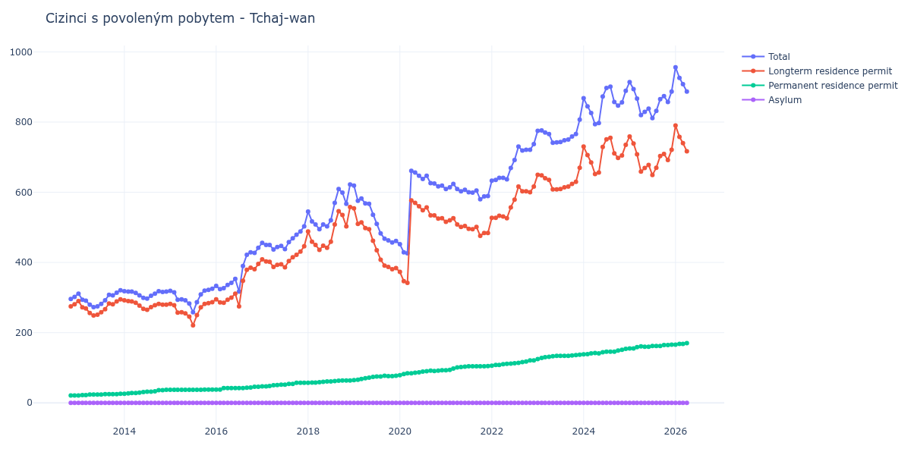

# Tchaj-wan

## Souhrnné statistiky (Min/Max pro rok) / Summary Statistics (Min/Max per year)

| Year   | Total     | Longterm Residence Permit   | Permanent Residence Permit   | Asylum   |
|--------|-----------|-----------------------------|------------------------------|----------|
| 2012   | 296 / 302 | 275 / 281                   | 21 / 21                      | 0 / 0    |
| 2013   | 273 / 321 | 249 / 295                   | 21 / 26                      | 0 / 0    |
| 2014   | 297 / 318 | 265 / 292                   | 26 / 37                      | 0 / 0    |
| 2015   | 258 / 325 | 221 / 287                   | 37 / 38                      | 0 / 0    |
| 2016   | 317 / 442 | 275 / 396                   | 38 / 46                      | 0 / 0    |
| 2017   | 437 / 503 | 386 / 446                   | 47 / 57                      | 0 / 0    |
| 2018   | 495 / 622 | 436 / 558                   | 57 / 64                      | 0 / 0    |
| 2019   | 457 / 619 | 381 / 554                   | 65 / 77                      | 0 / 0    |
| 2020   | 426 / 661 | 342 / 577                   | 79 / 93                      | 0 / 0    |
| 2021   | 580 / 624 | 476 / 526                   | 93 / 105                     | 0 / 0    |
| 2022   | 633 / 737 | 526 / 616                   | 106 / 121                    | 0 / 0    |
| 2023   | 741 / 807 | 608 / 670                   | 125 / 137                    | 0 / 0    |
| 2024   | 794 / 901 | 652 / 755                   | 138 / 154                    | 0 / 0    |
| 2025   | 811 / 914 | 649 / 759                   | 155 / 166                    | 0 / 0    |
| 2026   | 887 / 956 | 717 / 790                   | 166 / 170                    | 0 / 0    |

## Detailní tabulka / Detailed Data Table

| Date     | Total         | Longterm Residence Permit   | Permanent Residence Permit   | Asylum   |
|----------|---------------|-----------------------------|------------------------------|----------|
| **2012** |               |                             |                              |          |
| 11.2012  | 296           | 275                         | 21                           | 0        |
| 12.2012  | 302 (+2.03%)  | 281 (+2.18%)                | 21 (+0.00%)                  | 0        |
| **2013** |               |                             |                              |          |
| 01.2013  | 311 (+2.98%)  | 290 (+3.20%)                | 21 (+0.00%)                  | 0        |
| 02.2013  | 294 (-5.47%)  | 272 (-6.21%)                | 22 (+4.76%)                  | 0        |
| 03.2013  | 291 (-1.02%)  | 269 (-1.10%)                | 22 (+0.00%)                  | 0        |
| 04.2013  | 280 (-3.78%)  | 256 (-4.83%)                | 24 (+9.09%)                  | 0        |
| 05.2013  | 273 (-2.50%)  | 249 (-2.73%)                | 24 (+0.00%)                  | 0        |
| 06.2013  | 275 (+0.73%)  | 251 (+0.80%)                | 24 (+0.00%)                  | 0        |
| 07.2013  | 282 (+2.55%)  | 258 (+2.79%)                | 24 (+0.00%)                  | 0        |
| 08.2013  | 292 (+3.55%)  | 267 (+3.49%)                | 25 (+4.17%)                  | 0        |
| 09.2013  | 308 (+5.48%)  | 283 (+5.99%)                | 25 (+0.00%)                  | 0        |
| 10.2013  | 306 (-0.65%)  | 281 (-0.71%)                | 25 (+0.00%)                  | 0        |
| 11.2013  | 314 (+2.61%)  | 289 (+2.85%)                | 25 (+0.00%)                  | 0        |
| 12.2013  | 321 (+2.23%)  | 295 (+2.08%)                | 26 (+4.00%)                  | 0        |
| **2014** |               |                             |                              |          |
| 01.2014  | 318 (-0.93%)  | 292 (-1.02%)                | 26 (+0.00%)                  | 0        |
| 02.2014  | 317 (-0.31%)  | 290 (-0.68%)                | 27 (+3.85%)                  | 0        |
| 03.2014  | 317 (+0.00%)  | 289 (-0.34%)                | 28 (+3.70%)                  | 0        |
| 04.2014  | 313 (-1.26%)  | 285 (-1.38%)                | 28 (+0.00%)                  | 0        |
| 05.2014  | 306 (-2.24%)  | 277 (-2.81%)                | 29 (+3.57%)                  | 0        |
| 06.2014  | 299 (-2.29%)  | 268 (-3.25%)                | 31 (+6.90%)                  | 0        |
| 07.2014  | 297 (-0.67%)  | 265 (-1.12%)                | 32 (+3.23%)                  | 0        |
| 08.2014  | 305 (+2.69%)  | 273 (+3.02%)                | 32 (+0.00%)                  | 0        |
| 09.2014  | 311 (+1.97%)  | 278 (+1.83%)                | 33 (+3.12%)                  | 0        |
| 10.2014  | 318 (+2.25%)  | 282 (+1.44%)                | 36 (+9.09%)                  | 0        |
| 11.2014  | 316 (-0.63%)  | 280 (-0.71%)                | 36 (+0.00%)                  | 0        |
| 12.2014  | 317 (+0.32%)  | 280 (+0.00%)                | 37 (+2.78%)                  | 0        |
| **2015** |               |                             |                              |          |
| 01.2015  | 319 (+0.63%)  | 282 (+0.71%)                | 37 (+0.00%)                  | 0        |
| 02.2015  | 315 (-1.25%)  | 278 (-1.42%)                | 37 (+0.00%)                  | 0        |
| 03.2015  | 294 (-6.67%)  | 257 (-7.55%)                | 37 (+0.00%)                  | 0        |
| 04.2015  | 295 (+0.34%)  | 258 (+0.39%)                | 37 (+0.00%)                  | 0        |
| 05.2015  | 292 (-1.02%)  | 255 (-1.16%)                | 37 (+0.00%)                  | 0        |
| 06.2015  | 283 (-3.08%)  | 246 (-3.53%)                | 37 (+0.00%)                  | 0        |
| 07.2015  | 258 (-8.83%)  | 221 (-10.16%)               | 37 (+0.00%)                  | 0        |
| 08.2015  | 287 (+11.24%) | 250 (+13.12%)               | 37 (+0.00%)                  | 0        |
| 09.2015  | 309 (+7.67%)  | 272 (+8.80%)                | 37 (+0.00%)                  | 0        |
| 10.2015  | 320 (+3.56%)  | 282 (+3.68%)                | 38 (+2.70%)                  | 0        |
| 11.2015  | 322 (+0.63%)  | 284 (+0.71%)                | 38 (+0.00%)                  | 0        |
| 12.2015  | 325 (+0.93%)  | 287 (+1.06%)                | 38 (+0.00%)                  | 0        |
| **2016** |               |                             |                              |          |
| 01.2016  | 333 (+2.46%)  | 295 (+2.79%)                | 38 (+0.00%)                  | 0        |
| 02.2016  | 324 (-2.70%)  | 286 (-3.05%)                | 38 (+0.00%)                  | 0        |
| 03.2016  | 327 (+0.93%)  | 285 (-0.35%)                | 42 (+10.53%)                 | 0        |
| 04.2016  | 336 (+2.75%)  | 294 (+3.16%)                | 42 (+0.00%)                  | 0        |
| 05.2016  | 342 (+1.79%)  | 300 (+2.04%)                | 42 (+0.00%)                  | 0        |
| 06.2016  | 353 (+3.22%)  | 311 (+3.67%)                | 42 (+0.00%)                  | 0        |
| 07.2016  | 317 (-10.20%) | 275 (-11.58%)               | 42 (+0.00%)                  | 0        |
| 08.2016  | 390 (+23.03%) | 348 (+26.55%)               | 42 (+0.00%)                  | 0        |
| 09.2016  | 422 (+8.21%)  | 379 (+8.91%)                | 43 (+2.38%)                  | 0        |
| 10.2016  | 429 (+1.66%)  | 385 (+1.58%)                | 44 (+2.33%)                  | 0        |
| 11.2016  | 427 (-0.47%)  | 381 (-1.04%)                | 46 (+4.55%)                  | 0        |
| 12.2016  | 442 (+3.51%)  | 396 (+3.94%)                | 46 (+0.00%)                  | 0        |
| **2017** |               |                             |                              |          |
| 01.2017  | 456 (+3.17%)  | 409 (+3.28%)                | 47 (+2.17%)                  | 0        |
| 02.2017  | 450 (-1.32%)  | 403 (-1.47%)                | 47 (+0.00%)                  | 0        |
| 03.2017  | 450 (+0.00%)  | 402 (-0.25%)                | 48 (+2.13%)                  | 0        |
| 04.2017  | 437 (-2.89%)  | 387 (-3.73%)                | 50 (+4.17%)                  | 0        |
| 05.2017  | 444 (+1.60%)  | 393 (+1.55%)                | 51 (+2.00%)                  | 0        |
| 06.2017  | 447 (+0.68%)  | 395 (+0.51%)                | 52 (+1.96%)                  | 0        |
| 07.2017  | 438 (-2.01%)  | 386 (-2.28%)                | 52 (+0.00%)                  | 0        |
| 08.2017  | 458 (+4.57%)  | 404 (+4.66%)                | 54 (+3.85%)                  | 0        |
| 09.2017  | 469 (+2.40%)  | 415 (+2.72%)                | 54 (+0.00%)                  | 0        |
| 10.2017  | 479 (+2.13%)  | 422 (+1.69%)                | 57 (+5.56%)                  | 0        |
| 11.2017  | 488 (+1.88%)  | 431 (+2.13%)                | 57 (+0.00%)                  | 0        |
| 12.2017  | 503 (+3.07%)  | 446 (+3.48%)                | 57 (+0.00%)                  | 0        |
| **2018** |               |                             |                              |          |
| 01.2018  | 545 (+8.35%)  | 488 (+9.42%)                | 57 (+0.00%)                  | 0        |
| 02.2018  | 517 (-5.14%)  | 459 (-5.94%)                | 58 (+1.75%)                  | 0        |
| 03.2018  | 508 (-1.74%)  | 450 (-1.96%)                | 58 (+0.00%)                  | 0        |
| 04.2018  | 495 (-2.56%)  | 436 (-3.11%)                | 59 (+1.72%)                  | 0        |
| 05.2018  | 508 (+2.63%)  | 448 (+2.75%)                | 60 (+1.69%)                  | 0        |
| 06.2018  | 503 (-0.98%)  | 442 (-1.34%)                | 61 (+1.67%)                  | 0        |
| 07.2018  | 520 (+3.38%)  | 459 (+3.85%)                | 61 (+0.00%)                  | 0        |
| 08.2018  | 570 (+9.62%)  | 508 (+10.68%)               | 62 (+1.64%)                  | 0        |
| 09.2018  | 609 (+6.84%)  | 546 (+7.48%)                | 63 (+1.61%)                  | 0        |
| 10.2018  | 599 (-1.64%)  | 535 (-2.01%)                | 64 (+1.59%)                  | 0        |
| 11.2018  | 567 (-5.34%)  | 503 (-5.98%)                | 64 (+0.00%)                  | 0        |
| 12.2018  | 622 (+9.70%)  | 558 (+10.93%)               | 64 (+0.00%)                  | 0        |
| **2019** |               |                             |                              |          |
| 01.2019  | 619 (-0.48%)  | 554 (-0.72%)                | 65 (+1.56%)                  | 0        |
| 02.2019  | 576 (-6.95%)  | 510 (-7.94%)                | 66 (+1.54%)                  | 0        |
| 03.2019  | 582 (+1.04%)  | 514 (+0.78%)                | 68 (+3.03%)                  | 0        |
| 04.2019  | 568 (-2.41%)  | 498 (-3.11%)                | 70 (+2.94%)                  | 0        |
| 05.2019  | 567 (-0.18%)  | 495 (-0.60%)                | 72 (+2.86%)                  | 0        |
| 06.2019  | 536 (-5.47%)  | 462 (-6.67%)                | 74 (+2.78%)                  | 0        |
| 07.2019  | 510 (-4.85%)  | 435 (-5.84%)                | 75 (+1.35%)                  | 0        |
| 08.2019  | 483 (-5.29%)  | 408 (-6.21%)                | 75 (+0.00%)                  | 0        |
| 09.2019  | 468 (-3.11%)  | 391 (-4.17%)                | 77 (+2.67%)                  | 0        |
| 10.2019  | 463 (-1.07%)  | 387 (-1.02%)                | 76 (-1.30%)                  | 0        |
| 11.2019  | 457 (-1.30%)  | 381 (-1.55%)                | 76 (+0.00%)                  | 0        |
| 12.2019  | 461 (+0.88%)  | 384 (+0.79%)                | 77 (+1.32%)                  | 0        |
| **2020** |               |                             |                              |          |
| 01.2020  | 452 (-1.95%)  | 373 (-2.86%)                | 79 (+2.60%)                  | 0        |
| 02.2020  | 429 (-5.09%)  | 347 (-6.97%)                | 82 (+3.80%)                  | 0        |
| 03.2020  | 426 (-0.70%)  | 342 (-1.44%)                | 84 (+2.44%)                  | 0        |
| 04.2020  | 661 (+55.16%) | 577 (+68.71%)               | 84 (+0.00%)                  | 0        |
| 05.2020  | 656 (-0.76%)  | 570 (-1.21%)                | 86 (+2.38%)                  | 0        |
| 06.2020  | 647 (-1.37%)  | 560 (-1.75%)                | 87 (+1.16%)                  | 0        |
| 07.2020  | 638 (-1.39%)  | 549 (-1.96%)                | 89 (+2.30%)                  | 0        |
| 08.2020  | 647 (+1.41%)  | 557 (+1.46%)                | 90 (+1.12%)                  | 0        |
| 09.2020  | 626 (-3.25%)  | 534 (-4.13%)                | 92 (+2.22%)                  | 0        |
| 10.2020  | 625 (-0.16%)  | 534 (+0.00%)                | 91 (-1.09%)                  | 0        |
| 11.2020  | 617 (-1.28%)  | 525 (-1.69%)                | 92 (+1.10%)                  | 0        |
| 12.2020  | 619 (+0.32%)  | 526 (+0.19%)                | 93 (+1.09%)                  | 0        |
| **2021** |               |                             |                              |          |
| 01.2021  | 609 (-1.62%)  | 516 (-1.90%)                | 93 (+0.00%)                  | 0        |
| 02.2021  | 614 (+0.82%)  | 520 (+0.78%)                | 94 (+1.08%)                  | 0        |
| 03.2021  | 624 (+1.63%)  | 526 (+1.15%)                | 98 (+4.26%)                  | 0        |
| 04.2021  | 609 (-2.40%)  | 508 (-3.42%)                | 101 (+3.06%)                 | 0        |
| 05.2021  | 603 (-0.99%)  | 501 (-1.38%)                | 102 (+0.99%)                 | 0        |
| 06.2021  | 607 (+0.66%)  | 504 (+0.60%)                | 103 (+0.98%)                 | 0        |
| 07.2021  | 600 (-1.15%)  | 496 (-1.59%)                | 104 (+0.97%)                 | 0        |
| 08.2021  | 599 (-0.17%)  | 495 (-0.20%)                | 104 (+0.00%)                 | 0        |
| 09.2021  | 605 (+1.00%)  | 501 (+1.21%)                | 104 (+0.00%)                 | 0        |
| 10.2021  | 580 (-4.13%)  | 476 (-4.99%)                | 104 (+0.00%)                 | 0        |
| 11.2021  | 588 (+1.38%)  | 484 (+1.68%)                | 104 (+0.00%)                 | 0        |
| 12.2021  | 589 (+0.17%)  | 484 (+0.00%)                | 105 (+0.96%)                 | 0        |
| **2022** |               |                             |                              |          |
| 01.2022  | 633 (+7.47%)  | 527 (+8.88%)                | 106 (+0.95%)                 | 0        |
| 02.2022  | 635 (+0.32%)  | 527 (+0.00%)                | 108 (+1.89%)                 | 0        |
| 03.2022  | 641 (+0.94%)  | 533 (+1.14%)                | 108 (+0.00%)                 | 0        |
| 04.2022  | 641 (+0.00%)  | 531 (-0.38%)                | 110 (+1.85%)                 | 0        |
| 05.2022  | 637 (-0.62%)  | 526 (-0.94%)                | 111 (+0.91%)                 | 0        |
| 06.2022  | 669 (+5.02%)  | 557 (+5.89%)                | 112 (+0.90%)                 | 0        |
| 07.2022  | 692 (+3.44%)  | 579 (+3.95%)                | 113 (+0.89%)                 | 0        |
| 08.2022  | 730 (+5.49%)  | 616 (+6.39%)                | 114 (+0.88%)                 | 0        |
| 09.2022  | 719 (-1.51%)  | 603 (-2.11%)                | 116 (+1.75%)                 | 0        |
| 10.2022  | 721 (+0.28%)  | 603 (+0.00%)                | 118 (+1.72%)                 | 0        |
| 11.2022  | 721 (+0.00%)  | 600 (-0.50%)                | 121 (+2.54%)                 | 0        |
| 12.2022  | 737 (+2.22%)  | 616 (+2.67%)                | 121 (+0.00%)                 | 0        |
| **2023** |               |                             |                              |          |
| 01.2023  | 775 (+5.16%)  | 650 (+5.52%)                | 125 (+3.31%)                 | 0        |
| 02.2023  | 776 (+0.13%)  | 648 (-0.31%)                | 128 (+2.40%)                 | 0        |
| 03.2023  | 770 (-0.77%)  | 640 (-1.23%)                | 130 (+1.56%)                 | 0        |
| 04.2023  | 766 (-0.52%)  | 635 (-0.78%)                | 131 (+0.77%)                 | 0        |
| 05.2023  | 741 (-3.26%)  | 608 (-4.25%)                | 133 (+1.53%)                 | 0        |
| 06.2023  | 742 (+0.13%)  | 608 (+0.00%)                | 134 (+0.75%)                 | 0        |
| 07.2023  | 743 (+0.13%)  | 609 (+0.16%)                | 134 (+0.00%)                 | 0        |
| 08.2023  | 748 (+0.67%)  | 614 (+0.82%)                | 134 (+0.00%)                 | 0        |
| 09.2023  | 750 (+0.27%)  | 616 (+0.33%)                | 134 (+0.00%)                 | 0        |
| 10.2023  | 759 (+1.20%)  | 624 (+1.30%)                | 135 (+0.75%)                 | 0        |
| 11.2023  | 766 (+0.92%)  | 630 (+0.96%)                | 136 (+0.74%)                 | 0        |
| 12.2023  | 807 (+5.35%)  | 670 (+6.35%)                | 137 (+0.74%)                 | 0        |
| **2024** |               |                             |                              |          |
| 01.2024  | 868 (+7.56%)  | 730 (+8.96%)                | 138 (+0.73%)                 | 0        |
| 02.2024  | 845 (-2.65%)  | 706 (-3.29%)                | 139 (+0.72%)                 | 0        |
| 03.2024  | 826 (-2.25%)  | 685 (-2.97%)                | 141 (+1.44%)                 | 0        |
| 04.2024  | 794 (-3.87%)  | 652 (-4.82%)                | 142 (+0.71%)                 | 0        |
| 05.2024  | 797 (+0.38%)  | 656 (+0.61%)                | 141 (-0.70%)                 | 0        |
| 06.2024  | 873 (+9.54%)  | 729 (+11.13%)               | 144 (+2.13%)                 | 0        |
| 07.2024  | 897 (+2.75%)  | 751 (+3.02%)                | 146 (+1.39%)                 | 0        |
| 08.2024  | 901 (+0.45%)  | 755 (+0.53%)                | 146 (+0.00%)                 | 0        |
| 09.2024  | 857 (-4.88%)  | 711 (-5.83%)                | 146 (+0.00%)                 | 0        |
| 10.2024  | 847 (-1.17%)  | 698 (-1.83%)                | 149 (+2.05%)                 | 0        |
| 11.2024  | 856 (+1.06%)  | 705 (+1.00%)                | 151 (+1.34%)                 | 0        |
| 12.2024  | 889 (+3.86%)  | 735 (+4.26%)                | 154 (+1.99%)                 | 0        |
| **2025** |               |                             |                              |          |
| 01.2025  | 914 (+2.81%)  | 759 (+3.27%)                | 155 (+0.65%)                 | 0        |
| 02.2025  | 894 (-2.19%)  | 739 (-2.64%)                | 155 (+0.00%)                 | 0        |
| 03.2025  | 867 (-3.02%)  | 708 (-4.19%)                | 159 (+2.58%)                 | 0        |
| 04.2025  | 820 (-5.42%)  | 659 (-6.92%)                | 161 (+1.26%)                 | 0        |
| 05.2025  | 829 (+1.10%)  | 669 (+1.52%)                | 160 (-0.62%)                 | 0        |
| 06.2025  | 838 (+1.09%)  | 678 (+1.35%)                | 160 (+0.00%)                 | 0        |
| 07.2025  | 811 (-3.22%)  | 649 (-4.28%)                | 162 (+1.25%)                 | 0        |
| 08.2025  | 832 (+2.59%)  | 670 (+3.24%)                | 162 (+0.00%)                 | 0        |
| 09.2025  | 865 (+3.97%)  | 703 (+4.93%)                | 162 (+0.00%)                 | 0        |
| 10.2025  | 874 (+1.04%)  | 709 (+0.85%)                | 165 (+1.85%)                 | 0        |
| 11.2025  | 857 (-1.95%)  | 692 (-2.40%)                | 165 (+0.00%)                 | 0        |
| 12.2025  | 887 (+3.50%)  | 721 (+4.19%)                | 166 (+0.61%)                 | 0        |
| **2026** |               |                             |                              |          |
| 01.2026  | 956 (+7.78%)  | 790 (+9.57%)                | 166 (+0.00%)                 | 0        |
| 02.2026  | 926 (-3.14%)  | 758 (-4.05%)                | 168 (+1.20%)                 | 0        |
| 03.2026  | 908 (-1.94%)  | 740 (-2.37%)                | 168 (+0.00%)                 | 0        |
| 04.2026  | 887 (-2.31%)  | 717 (-3.11%)                | 170 (+1.19%)                 | 0        |
