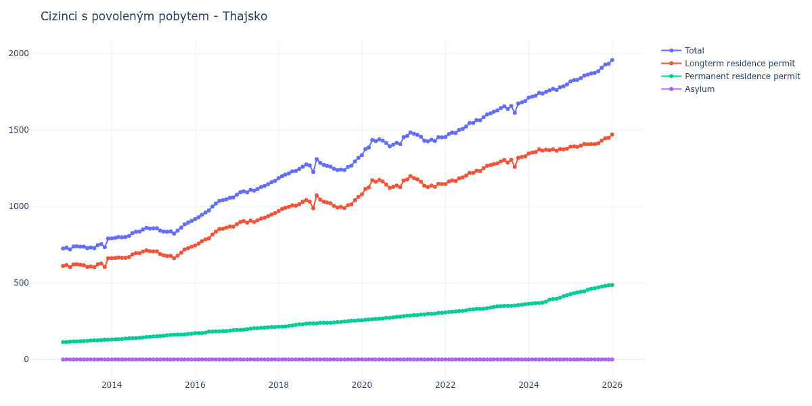

# Thajsko

## Souhrnné statistiky (Min/Max pro rok) / Summary Statistics (Min/Max per year)

| Year   | Total         | Longterm Residence Permit   | Permanent Residence Permit   | Asylum   |
|--------|---------------|-----------------------------|------------------------------|----------|
| 2012   | 725 / 731     | 611 / 617                   | 114 / 114                    | 0 / 0    |
| 2013   | 720 / 790     | 603 / 661                   | 116 / 129                    | 0 / 0    |
| 2014   | 792 / 860     | 662 / 713                   | 130 / 148                    | 0 / 0    |
| 2015   | 823 / 905     | 662 / 737                   | 150 / 168                    | 0 / 0    |
| 2016   | 918 / 1 059   | 745 / 869                   | 172 / 191                    | 0 / 0    |
| 2017   | 1 077 / 1 168 | 885 / 956                   | 192 / 212                    | 0 / 0    |
| 2018   | 1 185 / 1 309 | 970 / 1 073                 | 215 / 236                    | 0 / 0    |
| 2019   | 1 238 / 1 318 | 990 / 1 062                 | 240 / 256                    | 0 / 0    |
| 2020   | 1 336 / 1 439 | 1 079 / 1 173               | 257 / 280                    | 0 / 0    |
| 2021   | 1 426 / 1 484 | 1 128 / 1 198               | 283 / 305                    | 0 / 0    |
| 2022   | 1 454 / 1 583 | 1 147 / 1 251               | 307 / 332                    | 0 / 0    |
| 2023   | 1 601 / 1 689 | 1 259 / 1 328               | 335 / 361                    | 0 / 0    |
| 2024   | 1 711 / 1 798 | 1 347 / 1 378               | 364 / 420                    | 0 / 0    |
| 2025   | 1 818 / 1 933 | 1 390 / 1 448               | 427 / 485                    | 0 / 0    |
| 2026   | 1 957 / 1 957 | 1 470 / 1 470               | 487 / 487                    | 0 / 0    |

## Detailní tabulka / Detailed Data Table

| Date     | Total          | Longterm Residence Permit   | Permanent Residence Permit   | Asylum   |
|----------|----------------|-----------------------------|------------------------------|----------|
| **2012** |                |                             |                              |          |
| 11.2012  | 725            | 611                         | 114                          | 0        |
| 12.2012  | 731 (+0.83%)   | 617 (+0.98%)                | 114 (+0.00%)                 | 0        |
| **2013** |                |                             |                              |          |
| 01.2013  | 720 (-1.50%)   | 604 (-2.11%)                | 116 (+1.75%)                 | 0        |
| 02.2013  | 739 (+2.64%)   | 621 (+2.81%)                | 118 (+1.72%)                 | 0        |
| 03.2013  | 740 (+0.14%)   | 622 (+0.16%)                | 118 (+0.00%)                 | 0        |
| 04.2013  | 738 (-0.27%)   | 619 (-0.48%)                | 119 (+0.85%)                 | 0        |
| 05.2013  | 737 (-0.14%)   | 616 (-0.48%)                | 121 (+1.68%)                 | 0        |
| 06.2013  | 727 (-1.36%)   | 605 (-1.79%)                | 122 (+0.83%)                 | 0        |
| 07.2013  | 732 (+0.69%)   | 608 (+0.50%)                | 124 (+1.64%)                 | 0        |
| 08.2013  | 728 (-0.55%)   | 603 (-0.82%)                | 125 (+0.81%)                 | 0        |
| 09.2013  | 747 (+2.61%)   | 622 (+3.15%)                | 125 (+0.00%)                 | 0        |
| 10.2013  | 754 (+0.94%)   | 627 (+0.80%)                | 127 (+1.60%)                 | 0        |
| 11.2013  | 734 (-2.65%)   | 605 (-3.51%)                | 129 (+1.57%)                 | 0        |
| 12.2013  | 790 (+7.63%)   | 661 (+9.26%)                | 129 (+0.00%)                 | 0        |
| **2014** |                |                             |                              |          |
| 01.2014  | 792 (+0.25%)   | 662 (+0.15%)                | 130 (+0.78%)                 | 0        |
| 02.2014  | 795 (+0.38%)   | 663 (+0.15%)                | 132 (+1.54%)                 | 0        |
| 03.2014  | 800 (+0.63%)   | 667 (+0.60%)                | 133 (+0.76%)                 | 0        |
| 04.2014  | 798 (-0.25%)   | 664 (-0.45%)                | 134 (+0.75%)                 | 0        |
| 05.2014  | 801 (+0.38%)   | 664 (+0.00%)                | 137 (+2.24%)                 | 0        |
| 06.2014  | 807 (+0.75%)   | 669 (+0.75%)                | 138 (+0.73%)                 | 0        |
| 07.2014  | 826 (+2.35%)   | 687 (+2.69%)                | 139 (+0.72%)                 | 0        |
| 08.2014  | 835 (+1.09%)   | 696 (+1.31%)                | 139 (+0.00%)                 | 0        |
| 09.2014  | 836 (+0.12%)   | 694 (-0.29%)                | 142 (+2.16%)                 | 0        |
| 10.2014  | 849 (+1.56%)   | 705 (+1.59%)                | 144 (+1.41%)                 | 0        |
| 11.2014  | 860 (+1.30%)   | 713 (+1.13%)                | 147 (+2.08%)                 | 0        |
| 12.2014  | 856 (-0.47%)   | 708 (-0.70%)                | 148 (+0.68%)                 | 0        |
| **2015** |                |                             |                              |          |
| 01.2015  | 857 (+0.12%)   | 707 (-0.14%)                | 150 (+1.35%)                 | 0        |
| 02.2015  | 858 (+0.12%)   | 707 (+0.00%)                | 151 (+0.67%)                 | 0        |
| 03.2015  | 842 (-1.86%)   | 689 (-2.55%)                | 153 (+1.32%)                 | 0        |
| 04.2015  | 836 (-0.71%)   | 681 (-1.16%)                | 155 (+1.31%)                 | 0        |
| 05.2015  | 835 (-0.12%)   | 677 (-0.59%)                | 158 (+1.94%)                 | 0        |
| 06.2015  | 837 (+0.24%)   | 677 (+0.00%)                | 160 (+1.27%)                 | 0        |
| 07.2015  | 823 (-1.67%)   | 662 (-2.22%)                | 161 (+0.63%)                 | 0        |
| 08.2015  | 842 (+2.31%)   | 679 (+2.57%)                | 163 (+1.24%)                 | 0        |
| 09.2015  | 861 (+2.26%)   | 698 (+2.80%)                | 163 (+0.00%)                 | 0        |
| 10.2015  | 883 (+2.56%)   | 719 (+3.01%)                | 164 (+0.61%)                 | 0        |
| 11.2015  | 894 (+1.25%)   | 727 (+1.11%)                | 167 (+1.83%)                 | 0        |
| 12.2015  | 905 (+1.23%)   | 737 (+1.38%)                | 168 (+0.60%)                 | 0        |
| **2016** |                |                             |                              |          |
| 01.2016  | 918 (+1.44%)   | 745 (+1.09%)                | 173 (+2.98%)                 | 0        |
| 02.2016  | 930 (+1.31%)   | 757 (+1.61%)                | 173 (+0.00%)                 | 0        |
| 03.2016  | 945 (+1.61%)   | 773 (+2.11%)                | 172 (-0.58%)                 | 0        |
| 04.2016  | 961 (+1.69%)   | 785 (+1.55%)                | 176 (+2.33%)                 | 0        |
| 05.2016  | 974 (+1.35%)   | 792 (+0.89%)                | 182 (+3.41%)                 | 0        |
| 06.2016  | 999 (+2.57%)   | 817 (+3.16%)                | 182 (+0.00%)                 | 0        |
| 07.2016  | 1 019 (+2.00%) | 836 (+2.33%)                | 183 (+0.55%)                 | 0        |
| 08.2016  | 1 037 (+1.77%) | 853 (+2.03%)                | 184 (+0.55%)                 | 0        |
| 09.2016  | 1 041 (+0.39%) | 855 (+0.23%)                | 186 (+1.09%)                 | 0        |
| 10.2016  | 1 047 (+0.58%) | 861 (+0.70%)                | 186 (+0.00%)                 | 0        |
| 11.2016  | 1 057 (+0.96%) | 869 (+0.93%)                | 188 (+1.08%)                 | 0        |
| 12.2016  | 1 059 (+0.19%) | 868 (-0.12%)                | 191 (+1.60%)                 | 0        |
| **2017** |                |                             |                              |          |
| 01.2017  | 1 077 (+1.70%) | 885 (+1.96%)                | 192 (+0.52%)                 | 0        |
| 02.2017  | 1 093 (+1.49%) | 899 (+1.58%)                | 194 (+1.04%)                 | 0        |
| 03.2017  | 1 099 (+0.55%) | 904 (+0.56%)                | 195 (+0.52%)                 | 0        |
| 04.2017  | 1 092 (-0.64%) | 894 (-1.11%)                | 198 (+1.54%)                 | 0        |
| 05.2017  | 1 109 (+1.56%) | 908 (+1.57%)                | 201 (+1.52%)                 | 0        |
| 06.2017  | 1 103 (-0.54%) | 899 (-0.99%)                | 204 (+1.49%)                 | 0        |
| 07.2017  | 1 115 (+1.09%) | 910 (+1.22%)                | 205 (+0.49%)                 | 0        |
| 08.2017  | 1 128 (+1.17%) | 921 (+1.21%)                | 207 (+0.98%)                 | 0        |
| 09.2017  | 1 134 (+0.53%) | 926 (+0.54%)                | 208 (+0.48%)                 | 0        |
| 10.2017  | 1 146 (+1.06%) | 936 (+1.08%)                | 210 (+0.96%)                 | 0        |
| 11.2017  | 1 159 (+1.13%) | 947 (+1.18%)                | 212 (+0.95%)                 | 0        |
| 12.2017  | 1 168 (+0.78%) | 956 (+0.95%)                | 212 (+0.00%)                 | 0        |
| **2018** |                |                             |                              |          |
| 01.2018  | 1 185 (+1.46%) | 970 (+1.46%)                | 215 (+1.42%)                 | 0        |
| 02.2018  | 1 199 (+1.18%) | 984 (+1.44%)                | 215 (+0.00%)                 | 0        |
| 03.2018  | 1 208 (+0.75%) | 992 (+0.81%)                | 216 (+0.47%)                 | 0        |
| 04.2018  | 1 216 (+0.66%) | 997 (+0.50%)                | 219 (+1.39%)                 | 0        |
| 05.2018  | 1 229 (+1.07%) | 1 007 (+1.00%)              | 222 (+1.37%)                 | 0        |
| 06.2018  | 1 232 (+0.24%) | 1 005 (-0.20%)              | 227 (+2.25%)                 | 0        |
| 07.2018  | 1 245 (+1.06%) | 1 015 (+1.00%)              | 230 (+1.32%)                 | 0        |
| 08.2018  | 1 260 (+1.20%) | 1 030 (+1.48%)              | 230 (+0.00%)                 | 0        |
| 09.2018  | 1 275 (+1.19%) | 1 041 (+1.07%)              | 234 (+1.74%)                 | 0        |
| 10.2018  | 1 268 (-0.55%) | 1 032 (-0.86%)              | 236 (+0.85%)                 | 0        |
| 11.2018  | 1 225 (-3.39%) | 989 (-4.17%)                | 236 (+0.00%)                 | 0        |
| 12.2018  | 1 309 (+6.86%) | 1 073 (+8.49%)              | 236 (+0.00%)                 | 0        |
| **2019** |                |                             |                              |          |
| 01.2019  | 1 285 (-1.83%) | 1 045 (-2.61%)              | 240 (+1.69%)                 | 0        |
| 02.2019  | 1 272 (-1.01%) | 1 032 (-1.24%)              | 240 (+0.00%)                 | 0        |
| 03.2019  | 1 266 (-0.47%) | 1 026 (-0.58%)              | 240 (+0.00%)                 | 0        |
| 04.2019  | 1 260 (-0.47%) | 1 020 (-0.58%)              | 240 (+0.00%)                 | 0        |
| 05.2019  | 1 246 (-1.11%) | 1 004 (-1.57%)              | 242 (+0.83%)                 | 0        |
| 06.2019  | 1 238 (-0.64%) | 994 (-1.00%)                | 244 (+0.83%)                 | 0        |
| 07.2019  | 1 242 (+0.32%) | 997 (+0.30%)                | 245 (+0.41%)                 | 0        |
| 08.2019  | 1 238 (-0.32%) | 990 (-0.70%)                | 248 (+1.22%)                 | 0        |
| 09.2019  | 1 258 (+1.62%) | 1 008 (+1.82%)              | 250 (+0.81%)                 | 0        |
| 10.2019  | 1 267 (+0.72%) | 1 014 (+0.60%)              | 253 (+1.20%)                 | 0        |
| 11.2019  | 1 295 (+2.21%) | 1 042 (+2.76%)              | 253 (+0.00%)                 | 0        |
| 12.2019  | 1 318 (+1.78%) | 1 062 (+1.92%)              | 256 (+1.19%)                 | 0        |
| **2020** |                |                             |                              |          |
| 01.2020  | 1 336 (+1.37%) | 1 079 (+1.60%)              | 257 (+0.39%)                 | 0        |
| 02.2020  | 1 375 (+2.92%) | 1 115 (+3.34%)              | 260 (+1.17%)                 | 0        |
| 03.2020  | 1 385 (+0.73%) | 1 124 (+0.81%)              | 261 (+0.38%)                 | 0        |
| 04.2020  | 1 435 (+3.61%) | 1 172 (+4.27%)              | 263 (+0.77%)                 | 0        |
| 05.2020  | 1 427 (-0.56%) | 1 162 (-0.85%)              | 265 (+0.76%)                 | 0        |
| 06.2020  | 1 439 (+0.84%) | 1 173 (+0.95%)              | 266 (+0.38%)                 | 0        |
| 07.2020  | 1 431 (-0.56%) | 1 163 (-0.85%)              | 268 (+0.75%)                 | 0        |
| 08.2020  | 1 415 (-1.12%) | 1 143 (-1.72%)              | 272 (+1.49%)                 | 0        |
| 09.2020  | 1 393 (-1.55%) | 1 121 (-1.92%)              | 272 (+0.00%)                 | 0        |
| 10.2020  | 1 404 (+0.79%) | 1 129 (+0.71%)              | 275 (+1.10%)                 | 0        |
| 11.2020  | 1 416 (+0.85%) | 1 137 (+0.71%)              | 279 (+1.45%)                 | 0        |
| 12.2020  | 1 407 (-0.64%) | 1 127 (-0.88%)              | 280 (+0.36%)                 | 0        |
| **2021** |                |                             |                              |          |
| 01.2021  | 1 453 (+3.27%) | 1 170 (+3.82%)              | 283 (+1.07%)                 | 0        |
| 02.2021  | 1 462 (+0.62%) | 1 176 (+0.51%)              | 286 (+1.06%)                 | 0        |
| 03.2021  | 1 484 (+1.50%) | 1 198 (+1.87%)              | 286 (+0.00%)                 | 0        |
| 04.2021  | 1 475 (-0.61%) | 1 185 (-1.09%)              | 290 (+1.40%)                 | 0        |
| 05.2021  | 1 468 (-0.47%) | 1 178 (-0.59%)              | 290 (+0.00%)                 | 0        |
| 06.2021  | 1 456 (-0.82%) | 1 162 (-1.36%)              | 294 (+1.38%)                 | 0        |
| 07.2021  | 1 430 (-1.79%) | 1 136 (-2.24%)              | 294 (+0.00%)                 | 0        |
| 08.2021  | 1 426 (-0.28%) | 1 128 (-0.70%)              | 298 (+1.36%)                 | 0        |
| 09.2021  | 1 436 (+0.70%) | 1 137 (+0.80%)              | 299 (+0.34%)                 | 0        |
| 10.2021  | 1 429 (-0.49%) | 1 129 (-0.70%)              | 300 (+0.33%)                 | 0        |
| 11.2021  | 1 453 (+1.68%) | 1 148 (+1.68%)              | 305 (+1.67%)                 | 0        |
| 12.2021  | 1 452 (-0.07%) | 1 147 (-0.09%)              | 305 (+0.00%)                 | 0        |
| **2022** |                |                             |                              |          |
| 01.2022  | 1 454 (+0.14%) | 1 147 (+0.00%)              | 307 (+0.66%)                 | 0        |
| 02.2022  | 1 474 (+1.38%) | 1 163 (+1.39%)              | 311 (+1.30%)                 | 0        |
| 03.2022  | 1 483 (+0.61%) | 1 171 (+0.69%)              | 312 (+0.32%)                 | 0        |
| 04.2022  | 1 481 (-0.13%) | 1 167 (-0.34%)              | 314 (+0.64%)                 | 0        |
| 05.2022  | 1 500 (+1.28%) | 1 184 (+1.46%)              | 316 (+0.64%)                 | 0        |
| 06.2022  | 1 507 (+0.47%) | 1 190 (+0.51%)              | 317 (+0.32%)                 | 0        |
| 07.2022  | 1 523 (+1.06%) | 1 202 (+1.01%)              | 321 (+1.26%)                 | 0        |
| 08.2022  | 1 546 (+1.51%) | 1 220 (+1.50%)              | 326 (+1.56%)                 | 0        |
| 09.2022  | 1 546 (+0.00%) | 1 219 (-0.08%)              | 327 (+0.31%)                 | 0        |
| 10.2022  | 1 564 (+1.16%) | 1 233 (+1.15%)              | 331 (+1.22%)                 | 0        |
| 11.2022  | 1 563 (-0.06%) | 1 232 (-0.08%)              | 331 (+0.00%)                 | 0        |
| 12.2022  | 1 583 (+1.28%) | 1 251 (+1.54%)              | 332 (+0.30%)                 | 0        |
| **2023** |                |                             |                              |          |
| 01.2023  | 1 601 (+1.14%) | 1 266 (+1.20%)              | 335 (+0.90%)                 | 0        |
| 02.2023  | 1 609 (+0.50%) | 1 270 (+0.32%)              | 339 (+1.19%)                 | 0        |
| 03.2023  | 1 620 (+0.68%) | 1 277 (+0.55%)              | 343 (+1.18%)                 | 0        |
| 04.2023  | 1 628 (+0.49%) | 1 281 (+0.31%)              | 347 (+1.17%)                 | 0        |
| 05.2023  | 1 643 (+0.92%) | 1 295 (+1.09%)              | 348 (+0.29%)                 | 0        |
| 06.2023  | 1 654 (+0.67%) | 1 304 (+0.69%)              | 350 (+0.57%)                 | 0        |
| 07.2023  | 1 637 (-1.03%) | 1 287 (-1.30%)              | 350 (+0.00%)                 | 0        |
| 08.2023  | 1 656 (+1.16%) | 1 305 (+1.40%)              | 351 (+0.29%)                 | 0        |
| 09.2023  | 1 612 (-2.66%) | 1 259 (-3.52%)              | 353 (+0.57%)                 | 0        |
| 10.2023  | 1 673 (+3.78%) | 1 318 (+4.69%)              | 355 (+0.57%)                 | 0        |
| 11.2023  | 1 681 (+0.48%) | 1 323 (+0.38%)              | 358 (+0.85%)                 | 0        |
| 12.2023  | 1 689 (+0.48%) | 1 328 (+0.38%)              | 361 (+0.84%)                 | 0        |
| **2024** |                |                             |                              |          |
| 01.2024  | 1 711 (+1.30%) | 1 347 (+1.43%)              | 364 (+0.83%)                 | 0        |
| 02.2024  | 1 718 (+0.41%) | 1 352 (+0.37%)              | 366 (+0.55%)                 | 0        |
| 03.2024  | 1 724 (+0.35%) | 1 356 (+0.30%)              | 368 (+0.55%)                 | 0        |
| 04.2024  | 1 742 (+1.04%) | 1 373 (+1.25%)              | 369 (+0.27%)                 | 0        |
| 05.2024  | 1 738 (-0.23%) | 1 366 (-0.51%)              | 372 (+0.81%)                 | 0        |
| 06.2024  | 1 749 (+0.63%) | 1 371 (+0.37%)              | 378 (+1.61%)                 | 0        |
| 07.2024  | 1 759 (+0.57%) | 1 368 (-0.22%)              | 391 (+3.44%)                 | 0        |
| 08.2024  | 1 769 (+0.57%) | 1 374 (+0.44%)              | 395 (+1.02%)                 | 0        |
| 09.2024  | 1 761 (-0.45%) | 1 364 (-0.73%)              | 397 (+0.51%)                 | 0        |
| 10.2024  | 1 779 (+1.02%) | 1 375 (+0.81%)              | 404 (+1.76%)                 | 0        |
| 11.2024  | 1 786 (+0.39%) | 1 373 (-0.15%)              | 413 (+2.23%)                 | 0        |
| 12.2024  | 1 798 (+0.67%) | 1 378 (+0.36%)              | 420 (+1.69%)                 | 0        |
| **2025** |                |                             |                              |          |
| 01.2025  | 1 818 (+1.11%) | 1 391 (+0.94%)              | 427 (+1.67%)                 | 0        |
| 02.2025  | 1 826 (+0.44%) | 1 393 (+0.14%)              | 433 (+1.41%)                 | 0        |
| 03.2025  | 1 828 (+0.11%) | 1 390 (-0.22%)              | 438 (+1.15%)                 | 0        |
| 04.2025  | 1 839 (+0.60%) | 1 397 (+0.50%)              | 442 (+0.91%)                 | 0        |
| 05.2025  | 1 855 (+0.87%) | 1 409 (+0.86%)              | 446 (+0.90%)                 | 0        |
| 06.2025  | 1 862 (+0.38%) | 1 406 (-0.21%)              | 456 (+2.24%)                 | 0        |
| 07.2025  | 1 870 (+0.43%) | 1 408 (+0.14%)              | 462 (+1.32%)                 | 0        |
| 08.2025  | 1 873 (+0.16%) | 1 407 (-0.07%)              | 466 (+0.87%)                 | 0        |
| 09.2025  | 1 884 (+0.59%) | 1 413 (+0.43%)              | 471 (+1.07%)                 | 0        |
| 10.2025  | 1 907 (+1.22%) | 1 431 (+1.27%)              | 476 (+1.06%)                 | 0        |
| 11.2025  | 1 927 (+1.05%) | 1 446 (+1.05%)              | 481 (+1.05%)                 | 0        |
| 12.2025  | 1 933 (+0.31%) | 1 448 (+0.14%)              | 485 (+0.83%)                 | 0        |
| **2026** |                |                             |                              |          |
| 01.2026  | 1 957 (+1.24%) | 1 470 (+1.52%)              | 487 (+0.41%)                 | 0        |
