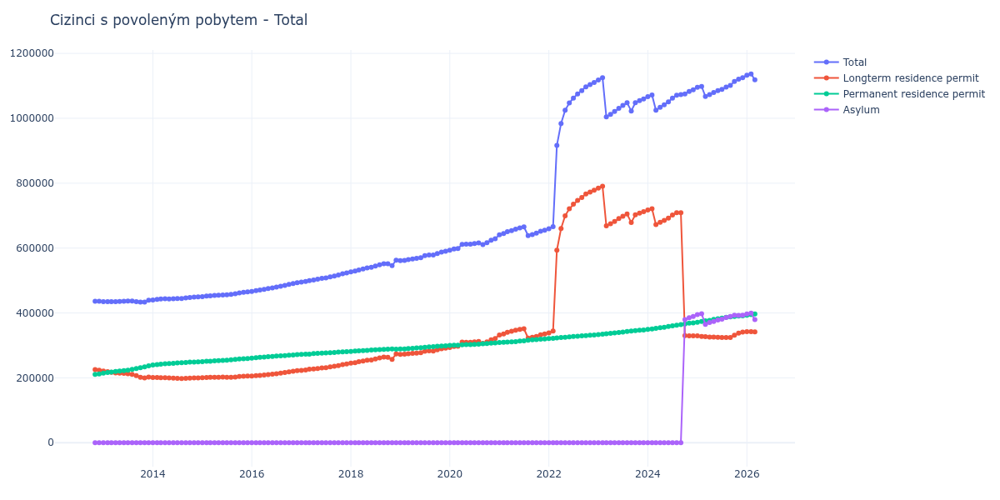

# Total

## Souhrnné statistiky (Min/Max pro rok) / Summary Statistics (Min/Max per year)

| Year   | Total                 | Longterm Residence Permit   | Permanent Residence Permit   | Asylum            |
|--------|-----------------------|-----------------------------|------------------------------|-------------------|
| 2012   | 435 742 / 436 176     | 223 511 / 225 415           | 210 761 / 212 231            | 0 / 0             |
| 2013   | 433 167 / 438 964     | 199 744 / 220 609           | 214 302 / 236 971            | 0 / 0             |
| 2014   | 440 111 / 449 291     | 197 906 / 200 861           | 239 250 / 249 351            | 0 / 0             |
| 2015   | 450 467 / 464 860     | 200 600 / 205 272           | 249 867 / 259 588            | 0 / 0             |
| 2016   | 466 494 / 493 525     | 205 747 / 222 155           | 260 747 / 271 370            | 0 / 0             |
| 2017   | 495 273 / 523 628     | 223 068 / 242 930           | 272 205 / 280 698            | 0 / 0             |
| 2018   | 526 733 / 562 548     | 245 208 / 273 881           | 281 525 / 288 770            | 0 / 0             |
| 2019   | 561 394 / 590 283     | 272 474 / 291 631           | 288 920 / 298 652            | 0 / 0             |
| 2020   | 593 127 / 628 942     | 293 477 / 321 381           | 299 650 / 307 561            | 0 / 0             |
| 2021   | 638 488 / 665 364     | 322 335 / 351 328           | 308 618 / 319 787            | 0 / 0             |
| 2022   | 659 722 / 1 110 077   | 338 680 / 778 080           | 321 042 / 331 997            | 0 / 0             |
| 2023   | 1 004 615 / 1 125 381 | 668 435 / 790 680           | 333 538 / 347 669            | 0 / 0             |
| 2024   | 1 024 729 / 1 088 082 | 329 248 / 721 029           | 349 445 / 369 526            | 0 / 388 879       |
| 2025   | 1 067 301 / 1 125 378 | 324 018 / 341 093           | 371 382 / 391 229            | 364 602 / 397 246 |
| 2026   | 1 118 698 / 1 136 691 | 341 911 / 342 438           | 393 016 / 396 969            | 379 818 / 399 632 |

## Detailní tabulka / Detailed Data Table

| Date     | Total               | Longterm Residence Permit   | Permanent Residence Permit   | Asylum           |
|----------|---------------------|-----------------------------|------------------------------|------------------|
| **2012** |                     |                             |                              |                  |
| 11.2012  | 436 176             | 225 415                     | 210 761                      | 0                |
| 12.2012  | 435 742 (-0.10%)    | 223 511 (-0.84%)            | 212 231 (+0.70%)             | 0                |
| **2013** |                     |                             |                              |                  |
| 01.2013  | 434 911 (-0.19%)    | 220 609 (-1.30%)            | 214 302 (+0.98%)             | 0                |
| 02.2013  | 434 913 (+0.00%)    | 218 785 (-0.83%)            | 216 128 (+0.85%)             | 0                |
| 03.2013  | 434 737 (-0.04%)    | 216 774 (-0.92%)            | 217 963 (+0.85%)             | 0                |
| 04.2013  | 434 850 (+0.03%)    | 215 372 (-0.65%)            | 219 478 (+0.70%)             | 0                |
| 05.2013  | 435 544 (+0.16%)    | 214 611 (-0.35%)            | 220 933 (+0.66%)             | 0                |
| 06.2013  | 436 097 (+0.13%)    | 213 700 (-0.42%)            | 222 397 (+0.66%)             | 0                |
| 07.2013  | 436 450 (+0.08%)    | 212 644 (-0.49%)            | 223 806 (+0.63%)             | 0                |
| 08.2013  | 436 679 (+0.05%)    | 210 787 (-0.87%)            | 225 892 (+0.93%)             | 0                |
| 09.2013  | 435 026 (-0.38%)    | 206 631 (-1.97%)            | 228 395 (+1.11%)             | 0                |
| 10.2013  | 433 167 (-0.43%)    | 201 778 (-2.35%)            | 231 389 (+1.31%)             | 0                |
| 11.2013  | 433 458 (+0.07%)    | 199 744 (-1.01%)            | 233 714 (+1.00%)             | 0                |
| 12.2013  | 438 964 (+1.27%)    | 201 993 (+1.13%)            | 236 971 (+1.39%)             | 0                |
| **2014** |                     |                             |                              |                  |
| 01.2014  | 440 111 (+0.26%)    | 200 861 (-0.56%)            | 239 250 (+0.96%)             | 0                |
| 02.2014  | 441 745 (+0.37%)    | 200 704 (-0.08%)            | 241 041 (+0.75%)             | 0                |
| 03.2014  | 442 968 (+0.28%)    | 200 649 (-0.03%)            | 242 319 (+0.53%)             | 0                |
| 04.2014  | 443 510 (+0.12%)    | 200 408 (-0.12%)            | 243 102 (+0.32%)             | 0                |
| 05.2014  | 443 383 (-0.03%)    | 199 588 (-0.41%)            | 243 795 (+0.29%)             | 0                |
| 06.2014  | 443 907 (+0.12%)    | 199 028 (-0.28%)            | 244 879 (+0.44%)             | 0                |
| 07.2014  | 444 192 (+0.06%)    | 198 335 (-0.35%)            | 245 857 (+0.40%)             | 0                |
| 08.2014  | 444 306 (+0.03%)    | 197 906 (-0.22%)            | 246 400 (+0.22%)             | 0                |
| 09.2014  | 446 123 (+0.41%)    | 198 641 (+0.37%)            | 247 482 (+0.44%)             | 0                |
| 10.2014  | 447 577 (+0.33%)    | 199 285 (+0.32%)            | 248 292 (+0.33%)             | 0                |
| 11.2014  | 448 732 (+0.26%)    | 200 015 (+0.37%)            | 248 717 (+0.17%)             | 0                |
| 12.2014  | 449 291 (+0.12%)    | 199 940 (-0.04%)            | 249 351 (+0.25%)             | 0                |
| **2015** |                     |                             |                              |                  |
| 01.2015  | 450 467 (+0.26%)    | 200 600 (+0.33%)            | 249 867 (+0.21%)             | 0                |
| 02.2015  | 451 954 (+0.33%)    | 201 174 (+0.29%)            | 250 780 (+0.37%)             | 0                |
| 03.2015  | 452 886 (+0.21%)    | 201 527 (+0.18%)            | 251 359 (+0.23%)             | 0                |
| 04.2015  | 453 996 (+0.25%)    | 201 922 (+0.20%)            | 252 074 (+0.28%)             | 0                |
| 05.2015  | 454 640 (+0.14%)    | 201 787 (-0.07%)            | 252 853 (+0.31%)             | 0                |
| 06.2015  | 455 568 (+0.20%)    | 201 987 (+0.10%)            | 253 581 (+0.29%)             | 0                |
| 07.2015  | 456 058 (+0.11%)    | 201 513 (-0.23%)            | 254 545 (+0.38%)             | 0                |
| 08.2015  | 457 460 (+0.31%)    | 201 753 (+0.12%)            | 255 707 (+0.46%)             | 0                |
| 09.2015  | 459 222 (+0.39%)    | 202 378 (+0.31%)            | 256 844 (+0.44%)             | 0                |
| 10.2015  | 461 885 (+0.58%)    | 203 978 (+0.79%)            | 257 907 (+0.41%)             | 0                |
| 11.2015  | 463 598 (+0.37%)    | 204 644 (+0.33%)            | 258 954 (+0.41%)             | 0                |
| 12.2015  | 464 860 (+0.27%)    | 205 272 (+0.31%)            | 259 588 (+0.24%)             | 0                |
| **2016** |                     |                             |                              |                  |
| 01.2016  | 466 494 (+0.35%)    | 205 747 (+0.23%)            | 260 747 (+0.45%)             | 0                |
| 02.2016  | 468 919 (+0.52%)    | 206 854 (+0.54%)            | 262 065 (+0.51%)             | 0                |
| 03.2016  | 470 789 (+0.40%)    | 207 393 (+0.26%)            | 263 396 (+0.51%)             | 0                |
| 04.2016  | 472 907 (+0.45%)    | 208 729 (+0.64%)            | 264 178 (+0.30%)             | 0                |
| 05.2016  | 475 476 (+0.54%)    | 210 027 (+0.62%)            | 265 449 (+0.48%)             | 0                |
| 06.2016  | 477 068 (+0.33%)    | 211 009 (+0.47%)            | 266 059 (+0.23%)             | 0                |
| 07.2016  | 479 402 (+0.49%)    | 212 264 (+0.59%)            | 267 138 (+0.41%)             | 0                |
| 08.2016  | 482 394 (+0.62%)    | 214 464 (+1.04%)            | 267 930 (+0.30%)             | 0                |
| 09.2016  | 484 931 (+0.53%)    | 216 456 (+0.93%)            | 268 475 (+0.20%)             | 0                |
| 10.2016  | 488 020 (+0.64%)    | 218 482 (+0.94%)            | 269 538 (+0.40%)             | 0                |
| 11.2016  | 490 637 (+0.54%)    | 220 128 (+0.75%)            | 270 509 (+0.36%)             | 0                |
| 12.2016  | 493 525 (+0.59%)    | 222 155 (+0.92%)            | 271 370 (+0.32%)             | 0                |
| **2017** |                     |                             |                              |                  |
| 01.2017  | 495 273 (+0.35%)    | 223 068 (+0.41%)            | 272 205 (+0.31%)             | 0                |
| 02.2017  | 497 174 (+0.38%)    | 224 286 (+0.55%)            | 272 888 (+0.25%)             | 0                |
| 03.2017  | 499 364 (+0.44%)    | 226 406 (+0.95%)            | 272 958 (+0.03%)             | 0                |
| 04.2017  | 501 770 (+0.48%)    | 227 191 (+0.35%)            | 274 579 (+0.59%)             | 0                |
| 05.2017  | 504 075 (+0.46%)    | 228 767 (+0.69%)            | 275 308 (+0.27%)             | 0                |
| 06.2017  | 506 930 (+0.57%)    | 230 682 (+0.84%)            | 276 248 (+0.34%)             | 0                |
| 07.2017  | 507 843 (+0.18%)    | 231 087 (+0.18%)            | 276 756 (+0.18%)             | 0                |
| 08.2017  | 511 387 (+0.70%)    | 233 699 (+1.13%)            | 277 688 (+0.34%)             | 0                |
| 09.2017  | 513 875 (+0.49%)    | 235 502 (+0.77%)            | 278 373 (+0.25%)             | 0                |
| 10.2017  | 516 984 (+0.61%)    | 237 638 (+0.91%)            | 279 346 (+0.35%)             | 0                |
| 11.2017  | 520 970 (+0.77%)    | 240 844 (+1.35%)            | 280 126 (+0.28%)             | 0                |
| 12.2017  | 523 628 (+0.51%)    | 242 930 (+0.87%)            | 280 698 (+0.20%)             | 0                |
| **2018** |                     |                             |                              |                  |
| 01.2018  | 526 733 (+0.59%)    | 245 208 (+0.94%)            | 281 525 (+0.29%)             | 0                |
| 02.2018  | 529 190 (+0.47%)    | 246 721 (+0.62%)            | 282 469 (+0.34%)             | 0                |
| 03.2018  | 532 589 (+0.64%)    | 249 507 (+1.13%)            | 283 082 (+0.22%)             | 0                |
| 04.2018  | 535 443 (+0.54%)    | 251 513 (+0.80%)            | 283 930 (+0.30%)             | 0                |
| 05.2018  | 539 121 (+0.69%)    | 254 391 (+1.14%)            | 284 730 (+0.28%)             | 0                |
| 06.2018  | 540 697 (+0.29%)    | 255 125 (+0.29%)            | 285 572 (+0.30%)             | 0                |
| 07.2018  | 544 395 (+0.68%)    | 258 116 (+1.17%)            | 286 279 (+0.25%)             | 0                |
| 08.2018  | 548 314 (+0.72%)    | 261 399 (+1.27%)            | 286 915 (+0.22%)             | 0                |
| 09.2018  | 551 712 (+0.62%)    | 263 876 (+0.95%)            | 287 836 (+0.32%)             | 0                |
| 10.2018  | 551 967 (+0.05%)    | 263 532 (-0.13%)            | 288 435 (+0.21%)             | 0                |
| 11.2018  | 545 679 (-1.14%)    | 256 909 (-2.51%)            | 288 770 (+0.12%)             | 0                |
| 12.2018  | 562 548 (+3.09%)    | 273 881 (+6.61%)            | 288 667 (-0.04%)             | 0                |
| **2019** |                     |                             |                              |                  |
| 01.2019  | 561 394 (-0.21%)    | 272 474 (-0.51%)            | 288 920 (+0.09%)             | 0                |
| 02.2019  | 562 218 (+0.15%)    | 272 998 (+0.19%)            | 289 220 (+0.10%)             | 0                |
| 03.2019  | 564 268 (+0.36%)    | 274 256 (+0.46%)            | 290 012 (+0.27%)             | 0                |
| 04.2019  | 566 377 (+0.37%)    | 275 301 (+0.38%)            | 291 076 (+0.37%)             | 0                |
| 05.2019  | 568 438 (+0.36%)    | 276 307 (+0.37%)            | 292 131 (+0.36%)             | 0                |
| 06.2019  | 570 315 (+0.33%)    | 277 203 (+0.32%)            | 293 112 (+0.34%)             | 0                |
| 07.2019  | 576 420 (+1.07%)    | 282 236 (+1.82%)            | 294 184 (+0.37%)             | 0                |
| 08.2019  | 578 458 (+0.35%)    | 283 319 (+0.38%)            | 295 139 (+0.32%)             | 0                |
| 09.2019  | 578 817 (+0.06%)    | 282 634 (-0.24%)            | 296 183 (+0.35%)             | 0                |
| 10.2019  | 583 191 (+0.76%)    | 286 103 (+1.23%)            | 297 088 (+0.31%)             | 0                |
| 11.2019  | 587 501 (+0.74%)    | 289 510 (+1.19%)            | 297 991 (+0.30%)             | 0                |
| 12.2019  | 590 283 (+0.47%)    | 291 631 (+0.73%)            | 298 652 (+0.22%)             | 0                |
| **2020** |                     |                             |                              |                  |
| 01.2020  | 593 127 (+0.48%)    | 293 477 (+0.63%)            | 299 650 (+0.33%)             | 0                |
| 02.2020  | 596 988 (+0.65%)    | 296 504 (+1.03%)            | 300 484 (+0.28%)             | 0                |
| 03.2020  | 598 434 (+0.24%)    | 297 584 (+0.36%)            | 300 850 (+0.12%)             | 0                |
| 04.2020  | 611 524 (+2.19%)    | 309 959 (+4.16%)            | 301 565 (+0.24%)             | 0                |
| 05.2020  | 612 058 (+0.09%)    | 309 804 (-0.05%)            | 302 254 (+0.23%)             | 0                |
| 06.2020  | 612 154 (+0.02%)    | 309 646 (-0.05%)            | 302 508 (+0.08%)             | 0                |
| 07.2020  | 614 143 (+0.32%)    | 310 922 (+0.41%)            | 303 221 (+0.24%)             | 0                |
| 08.2020  | 616 078 (+0.32%)    | 312 122 (+0.39%)            | 303 956 (+0.24%)             | 0                |
| 09.2020  | 610 891 (-0.84%)    | 306 072 (-1.94%)            | 304 819 (+0.28%)             | 0                |
| 10.2020  | 616 745 (+0.96%)    | 311 002 (+1.61%)            | 305 743 (+0.30%)             | 0                |
| 11.2020  | 624 003 (+1.18%)    | 317 074 (+1.95%)            | 306 929 (+0.39%)             | 0                |
| 12.2020  | 628 942 (+0.79%)    | 321 381 (+1.36%)            | 307 561 (+0.21%)             | 0                |
| **2021** |                     |                             |                              |                  |
| 01.2021  | 640 689 (+1.87%)    | 332 071 (+3.33%)            | 308 618 (+0.34%)             | 0                |
| 02.2021  | 644 750 (+0.63%)    | 335 182 (+0.94%)            | 309 568 (+0.31%)             | 0                |
| 03.2021  | 650 260 (+0.85%)    | 340 341 (+1.54%)            | 309 919 (+0.11%)             | 0                |
| 04.2021  | 654 063 (+0.58%)    | 343 465 (+0.92%)            | 310 598 (+0.22%)             | 0                |
| 05.2021  | 658 235 (+0.64%)    | 346 529 (+0.89%)            | 311 706 (+0.36%)             | 0                |
| 06.2021  | 662 281 (+0.61%)    | 349 208 (+0.77%)            | 313 073 (+0.44%)             | 0                |
| 07.2021  | 665 364 (+0.47%)    | 351 328 (+0.61%)            | 314 036 (+0.31%)             | 0                |
| 08.2021  | 638 488 (-4.04%)    | 322 335 (-8.25%)            | 316 153 (+0.67%)             | 0                |
| 09.2021  | 641 661 (+0.50%)    | 324 659 (+0.72%)            | 317 002 (+0.27%)             | 0                |
| 10.2021  | 645 869 (+0.66%)    | 327 700 (+0.94%)            | 318 169 (+0.37%)             | 0                |
| 11.2021  | 651 616 (+0.89%)    | 332 501 (+1.47%)            | 319 115 (+0.30%)             | 0                |
| 12.2021  | 654 784 (+0.49%)    | 334 997 (+0.75%)            | 319 787 (+0.21%)             | 0                |
| **2022** |                     |                             |                              |                  |
| 01.2022  | 659 722 (+0.75%)    | 338 680 (+1.10%)            | 321 042 (+0.39%)             | 0                |
| 02.2022  | 666 083 (+0.96%)    | 344 084 (+1.60%)            | 321 999 (+0.30%)             | 0                |
| 03.2022  | 916 405 (+37.58%)   | 593 377 (+72.45%)           | 323 028 (+0.32%)             | 0                |
| 04.2022  | 984 091 (+7.39%)    | 660 072 (+11.24%)           | 324 019 (+0.31%)             | 0                |
| 05.2022  | 1 024 691 (+4.13%)  | 699 428 (+5.96%)            | 325 263 (+0.38%)             | 0                |
| 06.2022  | 1 047 398 (+2.22%)  | 721 200 (+3.11%)            | 326 198 (+0.29%)             | 0                |
| 07.2022  | 1 062 456 (+1.44%)  | 735 239 (+1.95%)            | 327 217 (+0.31%)             | 0                |
| 08.2022  | 1 074 931 (+1.17%)  | 747 005 (+1.60%)            | 327 926 (+0.22%)             | 0                |
| 09.2022  | 1 084 998 (+0.94%)  | 755 794 (+1.18%)            | 329 204 (+0.39%)             | 0                |
| 10.2022  | 1 097 074 (+1.11%)  | 766 712 (+1.44%)            | 330 362 (+0.35%)             | 0                |
| 11.2022  | 1 104 008 (+0.63%)  | 772 646 (+0.77%)            | 331 362 (+0.30%)             | 0                |
| 12.2022  | 1 110 077 (+0.55%)  | 778 080 (+0.70%)            | 331 997 (+0.19%)             | 0                |
| **2023** |                     |                             |                              |                  |
| 01.2023  | 1 118 368 (+0.75%)  | 784 830 (+0.87%)            | 333 538 (+0.46%)             | 0                |
| 02.2023  | 1 125 381 (+0.63%)  | 790 680 (+0.75%)            | 334 701 (+0.35%)             | 0                |
| 03.2023  | 1 004 615 (-10.73%) | 668 435 (-15.46%)           | 336 180 (+0.44%)             | 0                |
| 04.2023  | 1 012 294 (+0.76%)  | 675 059 (+0.99%)            | 337 235 (+0.31%)             | 0                |
| 05.2023  | 1 020 810 (+0.84%)  | 682 066 (+1.04%)            | 338 744 (+0.45%)             | 0                |
| 06.2023  | 1 030 774 (+0.98%)  | 690 815 (+1.28%)            | 339 959 (+0.36%)             | 0                |
| 07.2023  | 1 039 471 (+0.84%)  | 698 197 (+1.07%)            | 341 274 (+0.39%)             | 0                |
| 08.2023  | 1 047 806 (+0.80%)  | 704 965 (+0.97%)            | 342 841 (+0.46%)             | 0                |
| 09.2023  | 1 022 631 (-2.40%)  | 678 614 (-3.74%)            | 344 017 (+0.34%)             | 0                |
| 10.2023  | 1 047 803 (+2.46%)  | 702 573 (+3.53%)            | 345 230 (+0.35%)             | 0                |
| 11.2023  | 1 054 464 (+0.64%)  | 707 881 (+0.76%)            | 346 583 (+0.39%)             | 0                |
| 12.2023  | 1 059 747 (+0.50%)  | 712 078 (+0.59%)            | 347 669 (+0.31%)             | 0                |
| **2024** |                     |                             |                              |                  |
| 01.2024  | 1 066 611 (+0.65%)  | 717 166 (+0.71%)            | 349 445 (+0.51%)             | 0                |
| 02.2024  | 1 071 913 (+0.50%)  | 721 029 (+0.54%)            | 350 884 (+0.41%)             | 0                |
| 03.2024  | 1 024 729 (-4.40%)  | 672 116 (-6.78%)            | 352 613 (+0.49%)             | 0                |
| 04.2024  | 1 033 977 (+0.90%)  | 679 399 (+1.08%)            | 354 578 (+0.56%)             | 0                |
| 05.2024  | 1 041 450 (+0.72%)  | 685 487 (+0.90%)            | 355 963 (+0.39%)             | 0                |
| 06.2024  | 1 050 610 (+0.88%)  | 692 538 (+1.03%)            | 358 072 (+0.59%)             | 0                |
| 07.2024  | 1 062 177 (+1.10%)  | 701 874 (+1.35%)            | 360 303 (+0.62%)             | 0                |
| 08.2024  | 1 071 355 (+0.86%)  | 709 168 (+1.04%)            | 362 187 (+0.52%)             | 0                |
| 09.2024  | 1 073 142 (+0.17%)  | 708 878 (-0.04%)            | 364 264 (+0.57%)             | 0                |
| 10.2024  | 1 075 338 (+0.20%)  | 329 807 (-53.47%)           | 366 285 (+0.55%)             | 379 246          |
| 11.2024  | 1 082 871 (+0.70%)  | 329 248 (-0.17%)            | 368 608 (+0.63%)             | 385 015 (+1.52%) |
| 12.2024  | 1 088 082 (+0.48%)  | 329 677 (+0.13%)            | 369 526 (+0.25%)             | 388 879 (+1.00%) |
| **2025** |                     |                             |                              |                  |
| 01.2025  | 1 095 340 (+0.67%)  | 329 281 (-0.12%)            | 371 382 (+0.50%)             | 394 677 (+1.49%) |
| 02.2025  | 1 098 465 (+0.29%)  | 327 746 (-0.47%)            | 373 473 (+0.56%)             | 397 246 (+0.65%) |
| 03.2025  | 1 067 301 (-2.84%)  | 327 092 (-0.20%)            | 375 607 (+0.57%)             | 364 602 (-8.22%) |
| 04.2025  | 1 073 037 (+0.54%)  | 325 465 (-0.50%)            | 377 087 (+0.39%)             | 370 485 (+1.61%) |
| 05.2025  | 1 079 228 (+0.58%)  | 325 554 (+0.03%)            | 379 937 (+0.76%)             | 373 737 (+0.88%) |
| 06.2025  | 1 085 483 (+0.58%)  | 324 922 (-0.19%)            | 382 140 (+0.58%)             | 378 421 (+1.25%) |
| 07.2025  | 1 089 153 (+0.34%)  | 324 183 (-0.23%)            | 384 291 (+0.56%)             | 380 679 (+0.60%) |
| 08.2025  | 1 096 182 (+0.65%)  | 324 018 (-0.05%)            | 386 310 (+0.53%)             | 385 854 (+1.36%) |
| 09.2025  | 1 101 584 (+0.49%)  | 324 374 (+0.11%)            | 387 901 (+0.41%)             | 389 309 (+0.90%) |
| 10.2025  | 1 113 416 (+1.07%)  | 331 494 (+2.19%)            | 388 919 (+0.26%)             | 393 003 (+0.95%) |
| 11.2025  | 1 120 716 (+0.66%)  | 337 640 (+1.85%)            | 390 406 (+0.38%)             | 392 670 (-0.08%) |
| 12.2025  | 1 125 378 (+0.42%)  | 341 093 (+1.02%)            | 391 229 (+0.21%)             | 393 056 (+0.10%) |
| **2026** |                     |                             |                              |                  |
| 01.2026  | 1 132 640 (+0.65%)  | 342 438 (+0.39%)            | 393 016 (+0.46%)             | 397 186 (+1.05%) |
| 02.2026  | 1 136 691 (+0.36%)  | 342 318 (-0.04%)            | 394 741 (+0.44%)             | 399 632 (+0.62%) |
| 03.2026  | 1 118 698 (-1.58%)  | 341 911 (-0.12%)            | 396 969 (+0.56%)             | 379 818 (-4.96%) |
