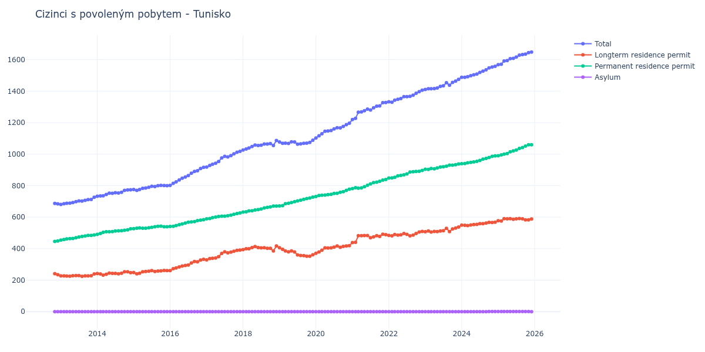

# Tunisko

## Souhrnné statistiky (Min/Max pro rok) / Summary Statistics (Min/Max per year)

| Year   | Total Min/Max   | Longterm Residence Permit Min/Max   | Permanent Residence Permit Min/Max   | Asylum Min/Max   |
|--------|-----------------|-------------------------------------|--------------------------------------|------------------|
| 2012   | 684 / 687       | 235 / 241                           | 446 / 449                            | 0 / 0            |
| 2013   | 681 / 726       | 224 / 239                           | 454 / 487                            | 0 / 0            |
| 2014   | 733 / 774       | 232 / 253                           | 491 / 526                            | 0 / 0            |
| 2015   | 770 / 802       | 240 / 262                           | 527 / 543                            | 0 / 0            |
| 2016   | 802 / 916       | 261 / 332                           | 541 / 584                            | 0 / 0            |
| 2017   | 918 / 1 018     | 329 / 391                           | 589 / 627                            | 0 / 0            |
| 2018   | 1 026 / 1 087   | 385 / 417                           | 632 / 670                            | 0 / 0            |
| 2019   | 1 063 / 1 088   | 352 / 406                           | 671 / 727                            | 0 / 0            |
| 2020   | 1 102 / 1 196   | 371 / 419                           | 731 / 777                            | 0 / 0            |
| 2021   | 1 220 / 1 328   | 439 / 492                           | 781 / 839                            | 0 / 0            |
| 2022   | 1 330 / 1 406   | 481 / 509                           | 848 / 897                            | 0 / 0            |
| 2023   | 1 411 / 1 475   | 506 / 537                           | 903 / 938                            | 0 / 0            |
| 2024   | 1 488 / 1 558   | 547 / 568                           | 939 / 989                            | 0 / 1            |
| 2025   | 1 568 / 1 648   | 575 / 591                           | 990 / 1 060                          | 0 / 1            |

## Detailní tabulka / Detailed Data Table

| Date     | Total          | Longterm Residence Permit   | Permanent Residence Permit   | Asylum       |
|----------|----------------|-----------------------------|------------------------------|--------------|
| **2012** |                |                             |                              |              |
| 11.2012  | 687            | 241                         | 446                          | 0            |
| 12.2012  | 684 (-0.44%)   | 235 (-2.49%)                | 449 (+0.67%)                 | 0            |
| **2013** |                |                             |                              |              |
| 01.2013  | 681 (-0.44%)   | 227 (-3.40%)                | 454 (+1.11%)                 | 0            |
| 02.2013  | 685 (+0.59%)   | 227 (+0.00%)                | 458 (+0.88%)                 | 0            |
| 03.2013  | 688 (+0.44%)   | 226 (-0.44%)                | 462 (+0.87%)                 | 0            |
| 04.2013  | 689 (+0.15%)   | 225 (-0.44%)                | 464 (+0.43%)                 | 0            |
| 05.2013  | 693 (+0.58%)   | 228 (+1.33%)                | 465 (+0.22%)                 | 0            |
| 06.2013  | 698 (+0.72%)   | 229 (+0.44%)                | 469 (+0.86%)                 | 0            |
| 07.2013  | 703 (+0.72%)   | 229 (+0.00%)                | 474 (+1.07%)                 | 0            |
| 08.2013  | 702 (-0.14%)   | 224 (-2.18%)                | 478 (+0.84%)                 | 0            |
| 09.2013  | 707 (+0.71%)   | 227 (+1.34%)                | 480 (+0.42%)                 | 0            |
| 10.2013  | 711 (+0.57%)   | 227 (+0.00%)                | 484 (+0.83%)                 | 0            |
| 11.2013  | 712 (+0.14%)   | 228 (+0.44%)                | 484 (+0.00%)                 | 0            |
| 12.2013  | 726 (+1.97%)   | 239 (+4.82%)                | 487 (+0.62%)                 | 0            |
| **2014** |                |                             |                              |              |
| 01.2014  | 733 (+0.96%)   | 242 (+1.26%)                | 491 (+0.82%)                 | 0            |
| 02.2014  | 735 (+0.27%)   | 239 (-1.24%)                | 496 (+1.02%)                 | 0            |
| 03.2014  | 736 (+0.14%)   | 232 (-2.93%)                | 504 (+1.61%)                 | 0            |
| 04.2014  | 744 (+1.09%)   | 237 (+2.16%)                | 507 (+0.60%)                 | 0            |
| 05.2014  | 752 (+1.08%)   | 245 (+3.38%)                | 507 (+0.00%)                 | 0            |
| 06.2014  | 751 (-0.13%)   | 243 (-0.82%)                | 508 (+0.20%)                 | 0            |
| 07.2014  | 755 (+0.53%)   | 243 (+0.00%)                | 512 (+0.79%)                 | 0            |
| 08.2014  | 753 (-0.26%)   | 240 (-1.23%)                | 513 (+0.20%)                 | 0            |
| 09.2014  | 758 (+0.66%)   | 244 (+1.67%)                | 514 (+0.19%)                 | 0            |
| 10.2014  | 770 (+1.58%)   | 253 (+3.69%)                | 517 (+0.58%)                 | 0            |
| 11.2014  | 773 (+0.39%)   | 253 (+0.00%)                | 520 (+0.58%)                 | 0            |
| 12.2014  | 774 (+0.13%)   | 248 (-1.98%)                | 526 (+1.15%)                 | 0            |
| **2015** |                |                             |                              |              |
| 01.2015  | 776 (+0.26%)   | 249 (+0.40%)                | 527 (+0.19%)                 | 0            |
| 02.2015  | 770 (-0.77%)   | 240 (-3.61%)                | 530 (+0.57%)                 | 0            |
| 03.2015  | 776 (+0.78%)   | 244 (+1.67%)                | 532 (+0.38%)                 | 0            |
| 04.2015  | 783 (+0.90%)   | 253 (+3.69%)                | 530 (-0.38%)                 | 0            |
| 05.2015  | 785 (+0.26%)   | 255 (+0.79%)                | 530 (+0.00%)                 | 0            |
| 06.2015  | 790 (+0.64%)   | 257 (+0.78%)                | 533 (+0.57%)                 | 0            |
| 07.2015  | 796 (+0.76%)   | 261 (+1.56%)                | 535 (+0.38%)                 | 0            |
| 08.2015  | 794 (-0.25%)   | 255 (-2.30%)                | 539 (+0.75%)                 | 0            |
| 09.2015  | 800 (+0.76%)   | 258 (+1.18%)                | 542 (+0.56%)                 | 0            |
| 10.2015  | 802 (+0.25%)   | 259 (+0.39%)                | 543 (+0.18%)                 | 0            |
| 11.2015  | 801 (-0.12%)   | 262 (+1.16%)                | 539 (-0.74%)                 | 0            |
| 12.2015  | 800 (-0.12%)   | 261 (-0.38%)                | 539 (+0.00%)                 | 0            |
| **2016** |                |                             |                              |              |
| 01.2016  | 802 (+0.25%)   | 261 (+0.00%)                | 541 (+0.37%)                 | 0            |
| 02.2016  | 815 (+1.62%)   | 273 (+4.60%)                | 542 (+0.18%)                 | 0            |
| 03.2016  | 824 (+1.10%)   | 277 (+1.47%)                | 547 (+0.92%)                 | 0            |
| 04.2016  | 836 (+1.46%)   | 284 (+2.53%)                | 552 (+0.91%)                 | 0            |
| 05.2016  | 847 (+1.32%)   | 290 (+2.11%)                | 557 (+0.91%)                 | 0            |
| 06.2016  | 855 (+0.94%)   | 293 (+1.03%)                | 562 (+0.90%)                 | 0            |
| 07.2016  | 864 (+1.05%)   | 296 (+1.02%)                | 568 (+1.07%)                 | 0            |
| 08.2016  | 879 (+1.74%)   | 309 (+4.39%)                | 570 (+0.35%)                 | 0            |
| 09.2016  | 890 (+1.25%)   | 318 (+2.91%)                | 572 (+0.35%)                 | 0            |
| 10.2016  | 895 (+0.56%)   | 317 (-0.31%)                | 578 (+1.05%)                 | 0            |
| 11.2016  | 909 (+1.56%)   | 328 (+3.47%)                | 581 (+0.52%)                 | 0            |
| 12.2016  | 916 (+0.77%)   | 332 (+1.22%)                | 584 (+0.52%)                 | 0            |
| **2017** |                |                             |                              |              |
| 01.2017  | 918 (+0.22%)   | 329 (-0.90%)                | 589 (+0.86%)                 | 0            |
| 02.2017  | 928 (+1.09%)   | 337 (+2.43%)                | 591 (+0.34%)                 | 0            |
| 03.2017  | 936 (+0.86%)   | 339 (+0.59%)                | 597 (+1.02%)                 | 0            |
| 04.2017  | 942 (+0.64%)   | 341 (+0.59%)                | 601 (+0.67%)                 | 0            |
| 05.2017  | 953 (+1.17%)   | 349 (+2.35%)                | 604 (+0.50%)                 | 0            |
| 06.2017  | 976 (+2.41%)   | 370 (+6.02%)                | 606 (+0.33%)                 | 0            |
| 07.2017  | 986 (+1.02%)   | 380 (+2.70%)                | 606 (+0.00%)                 | 0            |
| 08.2017  | 982 (-0.41%)   | 373 (-1.84%)                | 609 (+0.50%)                 | 0            |
| 09.2017  | 991 (+0.92%)   | 378 (+1.34%)                | 613 (+0.66%)                 | 0            |
| 10.2017  | 1 002 (+1.11%) | 384 (+1.59%)                | 618 (+0.82%)                 | 0            |
| 11.2017  | 1 012 (+1.00%) | 389 (+1.30%)                | 623 (+0.81%)                 | 0            |
| 12.2017  | 1 018 (+0.59%) | 391 (+0.51%)                | 627 (+0.64%)                 | 0            |
| **2018** |                |                             |                              |              |
| 01.2018  | 1 026 (+0.79%) | 394 (+0.77%)                | 632 (+0.80%)                 | 0            |
| 02.2018  | 1 033 (+0.68%) | 399 (+1.27%)                | 634 (+0.32%)                 | 0            |
| 03.2018  | 1 039 (+0.58%) | 399 (+0.00%)                | 640 (+0.95%)                 | 0            |
| 04.2018  | 1 048 (+0.87%) | 407 (+2.01%)                | 641 (+0.16%)                 | 0            |
| 05.2018  | 1 058 (+0.95%) | 413 (+1.47%)                | 645 (+0.62%)                 | 0            |
| 06.2018  | 1 055 (-0.28%) | 407 (-1.45%)                | 648 (+0.47%)                 | 0            |
| 07.2018  | 1 057 (+0.19%) | 405 (-0.49%)                | 652 (+0.62%)                 | 0            |
| 08.2018  | 1 064 (+0.66%) | 406 (+0.25%)                | 658 (+0.92%)                 | 0            |
| 09.2018  | 1 064 (+0.00%) | 402 (-0.99%)                | 662 (+0.61%)                 | 0            |
| 10.2018  | 1 067 (+0.28%) | 402 (+0.00%)                | 665 (+0.45%)                 | 0            |
| 11.2018  | 1 055 (-1.12%) | 385 (-4.23%)                | 670 (+0.75%)                 | 0            |
| 12.2018  | 1 087 (+3.03%) | 417 (+8.31%)                | 670 (+0.00%)                 | 0            |
| **2019** |                |                             |                              |              |
| 01.2019  | 1 077 (-0.92%) | 406 (-2.64%)                | 671 (+0.15%)                 | 0            |
| 02.2019  | 1 069 (-0.74%) | 396 (-2.46%)                | 673 (+0.30%)                 | 0            |
| 03.2019  | 1 070 (+0.09%) | 385 (-2.78%)                | 685 (+1.78%)                 | 0            |
| 04.2019  | 1 068 (-0.19%) | 380 (-1.30%)                | 688 (+0.44%)                 | 0            |
| 05.2019  | 1 078 (+0.94%) | 385 (+1.32%)                | 693 (+0.73%)                 | 0            |
| 06.2019  | 1 077 (-0.09%) | 379 (-1.56%)                | 698 (+0.72%)                 | 0            |
| 07.2019  | 1 063 (-1.30%) | 360 (-5.01%)                | 703 (+0.72%)                 | 0            |
| 08.2019  | 1 065 (+0.19%) | 357 (-0.83%)                | 708 (+0.71%)                 | 0            |
| 09.2019  | 1 069 (+0.38%) | 356 (-0.28%)                | 713 (+0.71%)                 | 0            |
| 10.2019  | 1 070 (+0.09%) | 352 (-1.12%)                | 718 (+0.70%)                 | 0            |
| 11.2019  | 1 074 (+0.37%) | 352 (+0.00%)                | 722 (+0.56%)                 | 0            |
| 12.2019  | 1 088 (+1.30%) | 361 (+2.56%)                | 727 (+0.69%)                 | 0            |
| **2020** |                |                             |                              |              |
| 01.2020  | 1 102 (+1.29%) | 371 (+2.77%)                | 731 (+0.55%)                 | 0            |
| 02.2020  | 1 116 (+1.27%) | 379 (+2.16%)                | 737 (+0.82%)                 | 0            |
| 03.2020  | 1 129 (+1.16%) | 390 (+2.90%)                | 739 (+0.27%)                 | 0            |
| 04.2020  | 1 145 (+1.42%) | 405 (+3.85%)                | 740 (+0.14%)                 | 0            |
| 05.2020  | 1 147 (+0.17%) | 404 (-0.25%)                | 743 (+0.41%)                 | 0            |
| 06.2020  | 1 150 (+0.26%) | 405 (+0.25%)                | 745 (+0.27%)                 | 0            |
| 07.2020  | 1 160 (+0.87%) | 410 (+1.23%)                | 750 (+0.67%)                 | 0            |
| 08.2020  | 1 168 (+0.69%) | 417 (+1.71%)                | 751 (+0.13%)                 | 0            |
| 09.2020  | 1 167 (-0.09%) | 409 (-1.92%)                | 758 (+0.93%)                 | 0            |
| 10.2020  | 1 176 (+0.77%) | 414 (+1.22%)                | 762 (+0.53%)                 | 0            |
| 11.2020  | 1 187 (+0.94%) | 417 (+0.72%)                | 770 (+1.05%)                 | 0            |
| 12.2020  | 1 196 (+0.76%) | 419 (+0.48%)                | 777 (+0.91%)                 | 0            |
| **2021** |                |                             |                              |              |
| 01.2021  | 1 220 (+2.01%) | 439 (+4.77%)                | 781 (+0.51%)                 | 0            |
| 02.2021  | 1 227 (+0.57%) | 440 (+0.23%)                | 787 (+0.77%)                 | 0            |
| 03.2021  | 1 266 (+3.18%) | 482 (+9.55%)                | 784 (-0.38%)                 | 0            |
| 04.2021  | 1 268 (+0.16%) | 482 (+0.00%)                | 786 (+0.26%)                 | 0            |
| 05.2021  | 1 276 (+0.63%) | 483 (+0.21%)                | 793 (+0.89%)                 | 0            |
| 06.2021  | 1 286 (+0.78%) | 483 (+0.00%)                | 803 (+1.26%)                 | 0            |
| 07.2021  | 1 280 (-0.47%) | 469 (-2.90%)                | 811 (+1.00%)                 | 0            |
| 08.2021  | 1 294 (+1.09%) | 475 (+1.28%)                | 819 (+0.99%)                 | 0            |
| 09.2021  | 1 304 (+0.77%) | 482 (+1.47%)                | 822 (+0.37%)                 | 0            |
| 10.2021  | 1 306 (+0.15%) | 478 (-0.83%)                | 828 (+0.73%)                 | 0            |
| 11.2021  | 1 327 (+1.61%) | 492 (+2.93%)                | 835 (+0.85%)                 | 0            |
| 12.2021  | 1 328 (+0.08%) | 489 (-0.61%)                | 839 (+0.48%)                 | 0            |
| **2022** |                |                             |                              |              |
| 01.2022  | 1 332 (+0.30%) | 484 (-1.02%)                | 848 (+1.07%)                 | 0            |
| 02.2022  | 1 330 (-0.15%) | 481 (-0.62%)                | 849 (+0.12%)                 | 0            |
| 03.2022  | 1 343 (+0.98%) | 490 (+1.87%)                | 853 (+0.47%)                 | 0            |
| 04.2022  | 1 348 (+0.37%) | 486 (-0.82%)                | 862 (+1.06%)                 | 0            |
| 05.2022  | 1 353 (+0.37%) | 488 (+0.41%)                | 865 (+0.35%)                 | 0            |
| 06.2022  | 1 365 (+0.89%) | 496 (+1.64%)                | 869 (+0.46%)                 | 0            |
| 07.2022  | 1 365 (+0.00%) | 491 (-1.01%)                | 874 (+0.58%)                 | 0            |
| 08.2022  | 1 367 (+0.15%) | 481 (-2.04%)                | 886 (+1.37%)                 | 0            |
| 09.2022  | 1 374 (+0.51%) | 486 (+1.04%)                | 888 (+0.23%)                 | 0            |
| 10.2022  | 1 386 (+0.87%) | 496 (+2.06%)                | 890 (+0.23%)                 | 0            |
| 11.2022  | 1 397 (+0.79%) | 506 (+2.02%)                | 891 (+0.11%)                 | 0            |
| 12.2022  | 1 406 (+0.64%) | 509 (+0.59%)                | 897 (+0.67%)                 | 0            |
| **2023** |                |                             |                              |              |
| 01.2023  | 1 411 (+0.36%) | 507 (-0.39%)                | 904 (+0.78%)                 | 0            |
| 02.2023  | 1 415 (+0.28%) | 512 (+0.99%)                | 903 (-0.11%)                 | 0            |
| 03.2023  | 1 415 (+0.00%) | 506 (-1.17%)                | 909 (+0.66%)                 | 0            |
| 04.2023  | 1 416 (+0.07%) | 509 (+0.59%)                | 907 (-0.22%)                 | 0            |
| 05.2023  | 1 420 (+0.28%) | 508 (-0.20%)                | 912 (+0.55%)                 | 0            |
| 06.2023  | 1 430 (+0.70%) | 512 (+0.79%)                | 918 (+0.66%)                 | 0            |
| 07.2023  | 1 434 (+0.28%) | 514 (+0.39%)                | 920 (+0.22%)                 | 0            |
| 08.2023  | 1 453 (+1.32%) | 529 (+2.92%)                | 924 (+0.43%)                 | 0            |
| 09.2023  | 1 438 (-1.03%) | 508 (-3.97%)                | 930 (+0.65%)                 | 0            |
| 10.2023  | 1 455 (+1.18%) | 525 (+3.35%)                | 930 (+0.00%)                 | 0            |
| 11.2023  | 1 464 (+0.62%) | 531 (+1.14%)                | 933 (+0.32%)                 | 0            |
| 12.2023  | 1 475 (+0.75%) | 537 (+1.13%)                | 938 (+0.54%)                 | 0            |
| **2024** |                |                             |                              |              |
| 01.2024  | 1 488 (+0.88%) | 549 (+2.23%)                | 939 (+0.11%)                 | 0            |
| 02.2024  | 1 488 (+0.00%) | 548 (-0.18%)                | 940 (+0.11%)                 | 0            |
| 03.2024  | 1 492 (+0.27%) | 547 (-0.18%)                | 945 (+0.53%)                 | 0            |
| 04.2024  | 1 498 (+0.40%) | 550 (+0.55%)                | 948 (+0.32%)                 | 0            |
| 05.2024  | 1 504 (+0.40%) | 553 (+0.55%)                | 951 (+0.32%)                 | 0            |
| 06.2024  | 1 508 (+0.27%) | 554 (+0.18%)                | 954 (+0.32%)                 | 0            |
| 07.2024  | 1 519 (+0.73%) | 559 (+0.90%)                | 960 (+0.63%)                 | 0            |
| 08.2024  | 1 527 (+0.53%) | 559 (+0.00%)                | 968 (+0.83%)                 | 0            |
| 09.2024  | 1 535 (+0.52%) | 562 (+0.54%)                | 973 (+0.52%)                 | 0            |
| 10.2024  | 1 547 (+0.78%) | 567 (+0.89%)                | 979 (+0.62%)                 | 1            |
| 11.2024  | 1 553 (+0.39%) | 566 (-0.18%)                | 986 (+0.72%)                 | 1 (+0.00%)   |
| 12.2024  | 1 558 (+0.32%) | 568 (+0.35%)                | 989 (+0.30%)                 | 1 (+0.00%)   |
| **2025** |                |                             |                              |              |
| 01.2025  | 1 568 (+0.64%) | 577 (+1.58%)                | 990 (+0.10%)                 | 1 (+0.00%)   |
| 02.2025  | 1 571 (+0.19%) | 575 (-0.35%)                | 995 (+0.51%)                 | 1 (+0.00%)   |
| 03.2025  | 1 591 (+1.27%) | 590 (+2.61%)                | 1 000 (+0.50%)               | 1 (+0.00%)   |
| 04.2025  | 1 594 (+0.19%) | 589 (-0.17%)                | 1 004 (+0.40%)               | 1 (+0.00%)   |
| 05.2025  | 1 606 (+0.75%) | 590 (+0.17%)                | 1 015 (+1.10%)               | 1 (+0.00%)   |
| 06.2025  | 1 608 (+0.12%) | 587 (-0.51%)                | 1 020 (+0.49%)               | 1 (+0.00%)   |
| 07.2025  | 1 616 (+0.50%) | 589 (+0.34%)                | 1 026 (+0.59%)               | 1 (+0.00%)   |
| 08.2025  | 1 628 (+0.74%) | 591 (+0.34%)                | 1 036 (+0.97%)               | 1 (+0.00%)   |
| 09.2025  | 1 632 (+0.25%) | 589 (-0.34%)                | 1 042 (+0.58%)               | 1 (+0.00%)   |
| 10.2025  | 1 635 (+0.18%) | 583 (-1.02%)                | 1 051 (+0.86%)               | 1 (+0.00%)   |
| 11.2025  | 1 644 (+0.55%) | 583 (+0.00%)                | 1 060 (+0.86%)               | 1 (+0.00%)   |
| 12.2025  | 1 648 (+0.24%) | 588 (+0.86%)                | 1 060 (+0.00%)               | 0 (-100.00%) |
