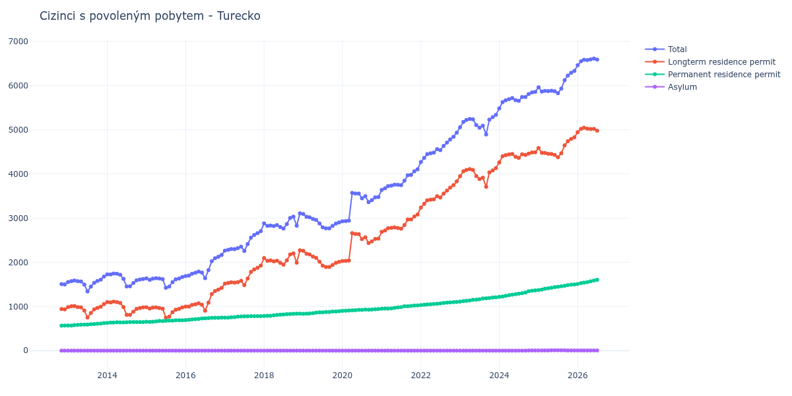

# Turecko

## Souhrnné statistiky (Min/Max pro rok) / Summary Statistics (Min/Max per year)

| Year   | Total         | Longterm Residence Permit   | Permanent Residence Permit   | Asylum   |
|--------|---------------|-----------------------------|------------------------------|----------|
| 2012   | 1 499 / 1 505 | 933 / 942                   | 563 / 566                    | 0 / 0    |
| 2013   | 1 342 / 1 678 | 750 / 1 053                 | 568 / 625                    | 0 / 0    |
| 2014   | 1 452 / 1 746 | 810 / 1 110                 | 626 / 647                    | 0 / 0    |
| 2015   | 1 423 / 1 667 | 745 / 983                   | 651 / 689                    | 0 / 0    |
| 2016   | 1 639 / 2 165 | 905 / 1 418                 | 692 / 747                    | 0 / 0    |
| 2017   | 2 258 / 2 703 | 1 482 / 1 922               | 747 / 782                    | 0 / 0    |
| 2018   | 2 766 / 3 109 | 1 948 / 2 272               | 786 / 837                    | 0 / 0    |
| 2019   | 2 769 / 3 094 | 1 894 / 2 260               | 834 / 894                    | 0 / 0    |
| 2020   | 2 929 / 3 570 | 2 030 / 2 658               | 899 / 941                    | 0 / 0    |
| 2021   | 3 639 / 4 107 | 2 690 / 3 082               | 949 / 1 025                  | 0 / 0    |
| 2022   | 4 271 / 4 935 | 3 240 / 3 832               | 1 031 / 1 103                | 0 / 0    |
| 2023   | 4 892 / 5 340 | 3 709 / 4 132               | 1 110 / 1 208                | 0 / 0    |
| 2024   | 5 482 / 5 857 | 4 263 / 4 491               | 1 219 / 1 362                | 0 / 4    |
| 2025   | 5 829 / 6 333 | 4 378 / 4 831               | 1 372 / 1 498                | 4 / 7    |
| 2026   | 6 461 / 6 612 | 4 946 / 5 045               | 1 511 / 1 603                | 4 / 4    |

## Detailní tabulka / Detailed Data Table

| Date     | Total           | Longterm Residence Permit   | Permanent Residence Permit   | Asylum      |
|----------|-----------------|-----------------------------|------------------------------|-------------|
| **2012** |                 |                             |                              |             |
| 11.2012  | 1 505           | 942                         | 563                          | 0           |
| 12.2012  | 1 499 (-0.40%)  | 933 (-0.96%)                | 566 (+0.53%)                 | 0           |
| **2013** |                 |                             |                              |             |
| 01.2013  | 1 553 (+3.60%)  | 985 (+5.57%)                | 568 (+0.35%)                 | 0           |
| 02.2013  | 1 573 (+1.29%)  | 1 004 (+1.93%)              | 569 (+0.18%)                 | 0           |
| 03.2013  | 1 587 (+0.89%)  | 1 009 (+0.50%)              | 578 (+1.58%)                 | 0           |
| 04.2013  | 1 572 (-0.95%)  | 988 (-2.08%)                | 584 (+1.04%)                 | 0           |
| 05.2013  | 1 564 (-0.51%)  | 977 (-1.11%)                | 587 (+0.51%)                 | 0           |
| 06.2013  | 1 496 (-4.35%)  | 907 (-7.16%)                | 589 (+0.34%)                 | 0           |
| 07.2013  | 1 342 (-10.29%) | 750 (-17.31%)               | 592 (+0.51%)                 | 0           |
| 08.2013  | 1 448 (+7.90%)  | 851 (+13.47%)               | 597 (+0.84%)                 | 0           |
| 09.2013  | 1 535 (+6.01%)  | 935 (+9.87%)                | 600 (+0.50%)                 | 0           |
| 10.2013  | 1 577 (+2.74%)  | 969 (+3.64%)                | 608 (+1.33%)                 | 0           |
| 11.2013  | 1 606 (+1.84%)  | 994 (+2.58%)                | 612 (+0.66%)                 | 0           |
| 12.2013  | 1 678 (+4.48%)  | 1 053 (+5.94%)              | 625 (+2.12%)                 | 0           |
| **2014** |                 |                             |                              |             |
| 01.2014  | 1 724 (+2.74%)  | 1 098 (+4.27%)              | 626 (+0.16%)                 | 0           |
| 02.2014  | 1 727 (+0.17%)  | 1 092 (-0.55%)              | 635 (+1.44%)                 | 0           |
| 03.2014  | 1 746 (+1.10%)  | 1 110 (+1.65%)              | 636 (+0.16%)                 | 0           |
| 04.2014  | 1 740 (-0.34%)  | 1 099 (-0.99%)              | 641 (+0.79%)                 | 0           |
| 05.2014  | 1 717 (-1.32%)  | 1 078 (-1.91%)              | 639 (-0.31%)                 | 0           |
| 06.2014  | 1 625 (-5.36%)  | 986 (-8.53%)                | 639 (+0.00%)                 | 0           |
| 07.2014  | 1 452 (-10.65%) | 810 (-17.85%)               | 642 (+0.47%)                 | 0           |
| 08.2014  | 1 456 (+0.28%)  | 810 (+0.00%)                | 646 (+0.62%)                 | 0           |
| 09.2014  | 1 530 (+5.08%)  | 883 (+9.01%)                | 647 (+0.15%)                 | 0           |
| 10.2014  | 1 591 (+3.99%)  | 946 (+7.13%)                | 645 (-0.31%)                 | 0           |
| 11.2014  | 1 609 (+1.13%)  | 963 (+1.80%)                | 646 (+0.16%)                 | 0           |
| 12.2014  | 1 623 (+0.87%)  | 977 (+1.45%)                | 646 (+0.00%)                 | 0           |
| **2015** |                 |                             |                              |             |
| 01.2015  | 1 635 (+0.74%)  | 983 (+0.61%)                | 652 (+0.93%)                 | 0           |
| 02.2015  | 1 602 (-2.02%)  | 951 (-3.26%)                | 651 (-0.15%)                 | 0           |
| 03.2015  | 1 630 (+1.75%)  | 975 (+2.52%)                | 655 (+0.61%)                 | 0           |
| 04.2015  | 1 640 (+0.61%)  | 977 (+0.21%)                | 663 (+1.22%)                 | 0           |
| 05.2015  | 1 634 (-0.37%)  | 963 (-1.43%)                | 671 (+1.21%)                 | 0           |
| 06.2015  | 1 619 (-0.92%)  | 949 (-1.45%)                | 670 (-0.15%)                 | 0           |
| 07.2015  | 1 423 (-12.11%) | 745 (-21.50%)               | 678 (+1.19%)                 | 0           |
| 08.2015  | 1 450 (+1.90%)  | 770 (+3.36%)                | 680 (+0.29%)                 | 0           |
| 09.2015  | 1 550 (+6.90%)  | 869 (+12.86%)               | 681 (+0.15%)                 | 0           |
| 10.2015  | 1 613 (+4.06%)  | 927 (+6.67%)                | 686 (+0.73%)                 | 0           |
| 11.2015  | 1 634 (+1.30%)  | 945 (+1.94%)                | 689 (+0.44%)                 | 0           |
| 12.2015  | 1 667 (+2.02%)  | 978 (+3.49%)                | 689 (+0.00%)                 | 0           |
| **2016** |                 |                             |                              |             |
| 01.2016  | 1 689 (+1.32%)  | 997 (+1.94%)                | 692 (+0.44%)                 | 0           |
| 02.2016  | 1 698 (+0.53%)  | 998 (+0.10%)                | 700 (+1.16%)                 | 0           |
| 03.2016  | 1 740 (+2.47%)  | 1 034 (+3.61%)              | 706 (+0.86%)                 | 0           |
| 04.2016  | 1 764 (+1.38%)  | 1 051 (+1.64%)              | 713 (+0.99%)                 | 0           |
| 05.2016  | 1 790 (+1.47%)  | 1 071 (+1.90%)              | 719 (+0.84%)                 | 0           |
| 06.2016  | 1 767 (-1.28%)  | 1 038 (-3.08%)              | 729 (+1.39%)                 | 0           |
| 07.2016  | 1 639 (-7.24%)  | 905 (-12.81%)               | 734 (+0.69%)                 | 0           |
| 08.2016  | 1 822 (+11.17%) | 1 086 (+20.00%)             | 736 (+0.27%)                 | 0           |
| 09.2016  | 2 023 (+11.03%) | 1 281 (+17.96%)             | 742 (+0.82%)                 | 0           |
| 10.2016  | 2 093 (+3.46%)  | 1 349 (+5.31%)              | 744 (+0.27%)                 | 0           |
| 11.2016  | 2 126 (+1.58%)  | 1 382 (+2.45%)              | 744 (+0.00%)                 | 0           |
| 12.2016  | 2 165 (+1.83%)  | 1 418 (+2.60%)              | 747 (+0.40%)                 | 0           |
| **2017** |                 |                             |                              |             |
| 01.2017  | 2 265 (+4.62%)  | 1 518 (+7.05%)              | 747 (+0.00%)                 | 0           |
| 02.2017  | 2 281 (+0.71%)  | 1 533 (+0.99%)              | 748 (+0.13%)                 | 0           |
| 03.2017  | 2 301 (+0.88%)  | 1 547 (+0.91%)              | 754 (+0.80%)                 | 0           |
| 04.2017  | 2 297 (-0.17%)  | 1 538 (-0.58%)              | 759 (+0.66%)                 | 0           |
| 05.2017  | 2 321 (+1.04%)  | 1 551 (+0.85%)              | 770 (+1.45%)                 | 0           |
| 06.2017  | 2 353 (+1.38%)  | 1 581 (+1.93%)              | 772 (+0.26%)                 | 0           |
| 07.2017  | 2 258 (-4.04%)  | 1 482 (-6.26%)              | 776 (+0.52%)                 | 0           |
| 08.2017  | 2 412 (+6.82%)  | 1 634 (+10.26%)             | 778 (+0.26%)                 | 0           |
| 09.2017  | 2 560 (+6.14%)  | 1 781 (+9.00%)              | 779 (+0.13%)                 | 0           |
| 10.2017  | 2 619 (+2.30%)  | 1 837 (+3.14%)              | 782 (+0.39%)                 | 0           |
| 11.2017  | 2 659 (+1.53%)  | 1 877 (+2.18%)              | 782 (+0.00%)                 | 0           |
| 12.2017  | 2 703 (+1.65%)  | 1 922 (+2.40%)              | 781 (-0.13%)                 | 0           |
| **2018** |                 |                             |                              |             |
| 01.2018  | 2 880 (+6.55%)  | 2 094 (+8.95%)              | 786 (+0.64%)                 | 0           |
| 02.2018  | 2 823 (-1.98%)  | 2 034 (-2.87%)              | 789 (+0.38%)                 | 0           |
| 03.2018  | 2 832 (+0.32%)  | 2 044 (+0.49%)              | 788 (-0.13%)                 | 0           |
| 04.2018  | 2 821 (-0.39%)  | 2 021 (-1.13%)              | 800 (+1.52%)                 | 0           |
| 05.2018  | 2 843 (+0.78%)  | 2 035 (+0.69%)              | 808 (+1.00%)                 | 0           |
| 06.2018  | 2 799 (-1.55%)  | 1 986 (-2.41%)              | 813 (+0.62%)                 | 0           |
| 07.2018  | 2 766 (-1.18%)  | 1 948 (-1.91%)              | 818 (+0.62%)                 | 0           |
| 08.2018  | 2 867 (+3.65%)  | 2 042 (+4.83%)              | 825 (+0.86%)                 | 0           |
| 09.2018  | 3 005 (+4.81%)  | 2 176 (+6.56%)              | 829 (+0.48%)                 | 0           |
| 10.2018  | 3 034 (+0.97%)  | 2 200 (+1.10%)              | 834 (+0.60%)                 | 0           |
| 11.2018  | 2 828 (-6.79%)  | 1 992 (-9.45%)              | 836 (+0.24%)                 | 0           |
| 12.2018  | 3 109 (+9.94%)  | 2 272 (+14.06%)             | 837 (+0.12%)                 | 0           |
| **2019** |                 |                             |                              |             |
| 01.2019  | 3 094 (-0.48%)  | 2 260 (-0.53%)              | 834 (-0.36%)                 | 0           |
| 02.2019  | 3 028 (-2.13%)  | 2 193 (-2.96%)              | 835 (+0.12%)                 | 0           |
| 03.2019  | 3 020 (-0.26%)  | 2 178 (-0.68%)              | 842 (+0.84%)                 | 0           |
| 04.2019  | 2 980 (-1.32%)  | 2 131 (-2.16%)              | 849 (+0.83%)                 | 0           |
| 05.2019  | 2 960 (-0.67%)  | 2 100 (-1.45%)              | 860 (+1.30%)                 | 0           |
| 06.2019  | 2 882 (-2.64%)  | 2 014 (-4.10%)              | 868 (+0.93%)                 | 0           |
| 07.2019  | 2 792 (-3.12%)  | 1 924 (-4.47%)              | 868 (+0.00%)                 | 0           |
| 08.2019  | 2 769 (-0.82%)  | 1 894 (-1.56%)              | 875 (+0.81%)                 | 0           |
| 09.2019  | 2 769 (+0.00%)  | 1 894 (+0.00%)              | 875 (+0.00%)                 | 0           |
| 10.2019  | 2 824 (+1.99%)  | 1 939 (+2.38%)              | 885 (+1.14%)                 | 0           |
| 11.2019  | 2 875 (+1.81%)  | 1 988 (+2.53%)              | 887 (+0.23%)                 | 0           |
| 12.2019  | 2 902 (+0.94%)  | 2 008 (+1.01%)              | 894 (+0.79%)                 | 0           |
| **2020** |                 |                             |                              |             |
| 01.2020  | 2 929 (+0.93%)  | 2 030 (+1.10%)              | 899 (+0.56%)                 | 0           |
| 02.2020  | 2 934 (+0.17%)  | 2 031 (+0.05%)              | 903 (+0.44%)                 | 0           |
| 03.2020  | 2 945 (+0.37%)  | 2 038 (+0.34%)              | 907 (+0.44%)                 | 0           |
| 04.2020  | 3 570 (+21.22%) | 2 658 (+30.42%)             | 912 (+0.55%)                 | 0           |
| 05.2020  | 3 558 (-0.34%)  | 2 641 (-0.64%)              | 917 (+0.55%)                 | 0           |
| 06.2020  | 3 557 (-0.03%)  | 2 636 (-0.19%)              | 921 (+0.44%)                 | 0           |
| 07.2020  | 3 448 (-3.06%)  | 2 524 (-4.25%)              | 924 (+0.33%)                 | 0           |
| 08.2020  | 3 497 (+1.42%)  | 2 568 (+1.74%)              | 929 (+0.54%)                 | 0           |
| 09.2020  | 3 363 (-3.83%)  | 2 435 (-5.18%)              | 928 (-0.11%)                 | 0           |
| 10.2020  | 3 406 (+1.28%)  | 2 474 (+1.60%)              | 932 (+0.43%)                 | 0           |
| 11.2020  | 3 469 (+1.85%)  | 2 530 (+2.26%)              | 939 (+0.75%)                 | 0           |
| 12.2020  | 3 476 (+0.20%)  | 2 535 (+0.20%)              | 941 (+0.21%)                 | 0           |
| **2021** |                 |                             |                              |             |
| 01.2021  | 3 639 (+4.69%)  | 2 690 (+6.11%)              | 949 (+0.85%)                 | 0           |
| 02.2021  | 3 674 (+0.96%)  | 2 721 (+1.15%)              | 953 (+0.42%)                 | 0           |
| 03.2021  | 3 724 (+1.36%)  | 2 773 (+1.91%)              | 951 (-0.21%)                 | 0           |
| 04.2021  | 3 737 (+0.35%)  | 2 781 (+0.29%)              | 956 (+0.53%)                 | 0           |
| 05.2021  | 3 758 (+0.56%)  | 2 791 (+0.36%)              | 967 (+1.15%)                 | 0           |
| 06.2021  | 3 754 (-0.11%)  | 2 775 (-0.57%)              | 979 (+1.24%)                 | 0           |
| 07.2021  | 3 747 (-0.19%)  | 2 759 (-0.58%)              | 988 (+0.92%)                 | 0           |
| 08.2021  | 3 846 (+2.64%)  | 2 841 (+2.97%)              | 1 005 (+1.72%)               | 0           |
| 09.2021  | 3 972 (+3.28%)  | 2 968 (+4.47%)              | 1 004 (-0.10%)               | 0           |
| 10.2021  | 3 980 (+0.20%)  | 2 968 (+0.00%)              | 1 012 (+0.80%)               | 0           |
| 11.2021  | 4 059 (+1.98%)  | 3 038 (+2.36%)              | 1 021 (+0.89%)               | 0           |
| 12.2021  | 4 107 (+1.18%)  | 3 082 (+1.45%)              | 1 025 (+0.39%)               | 0           |
| **2022** |                 |                             |                              |             |
| 01.2022  | 4 271 (+3.99%)  | 3 240 (+5.13%)              | 1 031 (+0.59%)               | 0           |
| 02.2022  | 4 363 (+2.15%)  | 3 325 (+2.62%)              | 1 038 (+0.68%)               | 0           |
| 03.2022  | 4 450 (+1.99%)  | 3 404 (+2.38%)              | 1 046 (+0.77%)               | 0           |
| 04.2022  | 4 468 (+0.40%)  | 3 418 (+0.41%)              | 1 050 (+0.38%)               | 0           |
| 05.2022  | 4 482 (+0.31%)  | 3 425 (+0.20%)              | 1 057 (+0.67%)               | 0           |
| 06.2022  | 4 560 (+1.74%)  | 3 498 (+2.13%)              | 1 062 (+0.47%)               | 0           |
| 07.2022  | 4 537 (-0.50%)  | 3 467 (-0.89%)              | 1 070 (+0.75%)               | 0           |
| 08.2022  | 4 636 (+2.18%)  | 3 557 (+2.60%)              | 1 079 (+0.84%)               | 0           |
| 09.2022  | 4 711 (+1.62%)  | 3 625 (+1.91%)              | 1 086 (+0.65%)               | 0           |
| 10.2022  | 4 781 (+1.49%)  | 3 689 (+1.77%)              | 1 092 (+0.55%)               | 0           |
| 11.2022  | 4 843 (+1.30%)  | 3 746 (+1.55%)              | 1 097 (+0.46%)               | 0           |
| 12.2022  | 4 935 (+1.90%)  | 3 832 (+2.30%)              | 1 103 (+0.55%)               | 0           |
| **2023** |                 |                             |                              |             |
| 01.2023  | 5 057 (+2.47%)  | 3 947 (+3.00%)              | 1 110 (+0.63%)               | 0           |
| 02.2023  | 5 179 (+2.41%)  | 4 059 (+2.84%)              | 1 120 (+0.90%)               | 0           |
| 03.2023  | 5 221 (+0.81%)  | 4 091 (+0.79%)              | 1 130 (+0.89%)               | 0           |
| 04.2023  | 5 245 (+0.46%)  | 4 109 (+0.44%)              | 1 136 (+0.53%)               | 0           |
| 05.2023  | 5 239 (-0.11%)  | 4 090 (-0.46%)              | 1 149 (+1.14%)               | 0           |
| 06.2023  | 5 108 (-2.50%)  | 3 952 (-3.37%)              | 1 156 (+0.61%)               | 0           |
| 07.2023  | 5 048 (-1.17%)  | 3 886 (-1.67%)              | 1 162 (+0.52%)               | 0           |
| 08.2023  | 5 093 (+0.89%)  | 3 914 (+0.72%)              | 1 179 (+1.46%)               | 0           |
| 09.2023  | 4 892 (-3.95%)  | 3 709 (-5.24%)              | 1 183 (+0.34%)               | 0           |
| 10.2023  | 5 229 (+6.89%)  | 4 036 (+8.82%)              | 1 193 (+0.85%)               | 0           |
| 11.2023  | 5 284 (+1.05%)  | 4 081 (+1.11%)              | 1 203 (+0.84%)               | 0           |
| 12.2023  | 5 340 (+1.06%)  | 4 132 (+1.25%)              | 1 208 (+0.42%)               | 0           |
| **2024** |                 |                             |                              |             |
| 01.2024  | 5 482 (+2.66%)  | 4 263 (+3.17%)              | 1 219 (+0.91%)               | 0           |
| 02.2024  | 5 626 (+2.63%)  | 4 401 (+3.24%)              | 1 225 (+0.49%)               | 0           |
| 03.2024  | 5 668 (+0.75%)  | 4 427 (+0.59%)              | 1 241 (+1.31%)               | 0           |
| 04.2024  | 5 694 (+0.46%)  | 4 440 (+0.29%)              | 1 254 (+1.05%)               | 0           |
| 05.2024  | 5 719 (+0.44%)  | 4 453 (+0.29%)              | 1 266 (+0.96%)               | 0           |
| 06.2024  | 5 670 (-0.86%)  | 4 391 (-1.39%)              | 1 279 (+1.03%)               | 0           |
| 07.2024  | 5 654 (-0.28%)  | 4 365 (-0.59%)              | 1 289 (+0.78%)               | 0           |
| 08.2024  | 5 743 (+1.57%)  | 4 444 (+1.81%)              | 1 299 (+0.78%)               | 0           |
| 09.2024  | 5 743 (+0.00%)  | 4 429 (-0.34%)              | 1 314 (+1.15%)               | 0           |
| 10.2024  | 5 807 (+1.11%)  | 4 460 (+0.70%)              | 1 343 (+2.21%)               | 4           |
| 11.2024  | 5 846 (+0.67%)  | 4 485 (+0.56%)              | 1 357 (+1.04%)               | 4 (+0.00%)  |
| 12.2024  | 5 857 (+0.19%)  | 4 491 (+0.13%)              | 1 362 (+0.37%)               | 4 (+0.00%)  |
| **2025** |                 |                             |                              |             |
| 01.2025  | 5 962 (+1.79%)  | 4 586 (+2.12%)              | 1 372 (+0.73%)               | 4 (+0.00%)  |
| 02.2025  | 5 864 (-1.64%)  | 4 478 (-2.35%)              | 1 382 (+0.73%)               | 4 (+0.00%)  |
| 03.2025  | 5 880 (+0.27%)  | 4 477 (-0.02%)              | 1 399 (+1.23%)               | 4 (+0.00%)  |
| 04.2025  | 5 875 (-0.09%)  | 4 457 (-0.45%)              | 1 413 (+1.00%)               | 5 (+25.00%) |
| 05.2025  | 5 883 (+0.14%)  | 4 454 (-0.07%)              | 1 422 (+0.64%)               | 7 (+40.00%) |
| 06.2025  | 5 874 (-0.15%)  | 4 429 (-0.56%)              | 1 438 (+1.13%)               | 7 (+0.00%)  |
| 07.2025  | 5 829 (-0.77%)  | 4 378 (-1.15%)              | 1 444 (+0.42%)               | 7 (+0.00%)  |
| 08.2025  | 5 931 (+1.75%)  | 4 467 (+2.03%)              | 1 457 (+0.90%)               | 7 (+0.00%)  |
| 09.2025  | 6 123 (+3.24%)  | 4 647 (+4.03%)              | 1 469 (+0.82%)               | 7 (+0.00%)  |
| 10.2025  | 6 227 (+1.70%)  | 4 740 (+2.00%)              | 1 483 (+0.95%)               | 4 (-42.86%) |
| 11.2025  | 6 291 (+1.03%)  | 4 794 (+1.14%)              | 1 493 (+0.67%)               | 4 (+0.00%)  |
| 12.2025  | 6 333 (+0.67%)  | 4 831 (+0.77%)              | 1 498 (+0.33%)               | 4 (+0.00%)  |
| **2026** |                 |                             |                              |             |
| 01.2026  | 6 461 (+2.02%)  | 4 946 (+2.38%)              | 1 511 (+0.87%)               | 4 (+0.00%)  |
| 02.2026  | 6 551 (+1.39%)  | 5 021 (+1.52%)              | 1 526 (+0.99%)               | 4 (+0.00%)  |
| 03.2026  | 6 587 (+0.55%)  | 5 045 (+0.48%)              | 1 538 (+0.79%)               | 4 (+0.00%)  |
| 04.2026  | 6 579 (-0.12%)  | 5 023 (-0.44%)              | 1 552 (+0.91%)               | 4 (+0.00%)  |
| 05.2026  | 6 592 (+0.20%)  | 5 018 (-0.10%)              | 1 570 (+1.16%)               | 4 (+0.00%)  |
| 06.2026  | 6 612 (+0.30%)  | 5 022 (+0.08%)              | 1 586 (+1.02%)               | 4 (+0.00%)  |
| 07.2026  | 6 588 (-0.36%)  | 4 981 (-0.82%)              | 1 603 (+1.07%)               | 4 (+0.00%)  |
