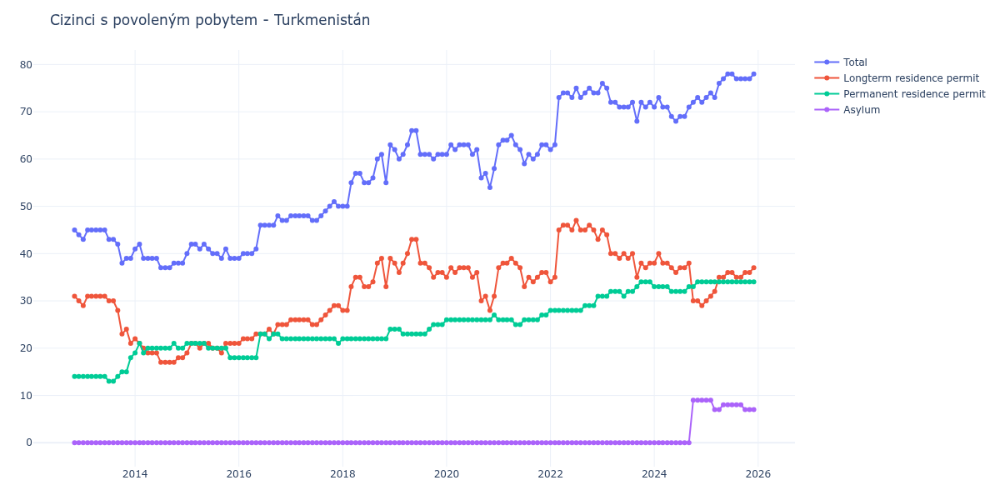

# Turkmenistán

## Souhrnné statistiky (Min/Max pro rok) / Summary Statistics (Min/Max per year)

| Year   | Total Min/Max   | Longterm Residence Permit Min/Max   | Permanent Residence Permit Min/Max   | Asylum Min/Max   |
|--------|-----------------|-------------------------------------|--------------------------------------|------------------|
| 2012   | 44 / 45         | 30 / 31                             | 14 / 14                              | 0 / 0            |
| 2013   | 38 / 45         | 21 / 31                             | 13 / 18                              | 0 / 0            |
| 2014   | 37 / 42         | 17 / 22                             | 19 / 21                              | 0 / 0            |
| 2015   | 39 / 42         | 19 / 21                             | 18 / 21                              | 0 / 0            |
| 2016   | 39 / 48         | 21 / 25                             | 18 / 23                              | 0 / 0            |
| 2017   | 47 / 51         | 25 / 29                             | 21 / 22                              | 0 / 0            |
| 2018   | 50 / 63         | 28 / 39                             | 22 / 24                              | 0 / 0            |
| 2019   | 60 / 66         | 35 / 43                             | 23 / 25                              | 0 / 0            |
| 2020   | 54 / 63         | 28 / 37                             | 26 / 27                              | 0 / 0            |
| 2021   | 59 / 65         | 33 / 39                             | 25 / 27                              | 0 / 0            |
| 2022   | 62 / 75         | 34 / 47                             | 28 / 31                              | 0 / 0            |
| 2023   | 68 / 76         | 35 / 45                             | 31 / 34                              | 0 / 0            |
| 2024   | 68 / 73         | 29 / 40                             | 32 / 34                              | 0 / 9            |
| 2025   | 73 / 78         | 30 / 37                             | 34 / 34                              | 7 / 9            |

## Detailní tabulka / Detailed Data Table

| Date     | Total        | Longterm Residence Permit   | Permanent Residence Permit   | Asylum      |
|----------|--------------|-----------------------------|------------------------------|-------------|
| **2012** |              |                             |                              |             |
| 11.2012  | 45           | 31                          | 14                           | 0           |
| 12.2012  | 44 (-2.22%)  | 30 (-3.23%)                 | 14 (+0.00%)                  | 0           |
| **2013** |              |                             |                              |             |
| 01.2013  | 43 (-2.27%)  | 29 (-3.33%)                 | 14 (+0.00%)                  | 0           |
| 02.2013  | 45 (+4.65%)  | 31 (+6.90%)                 | 14 (+0.00%)                  | 0           |
| 03.2013  | 45 (+0.00%)  | 31 (+0.00%)                 | 14 (+0.00%)                  | 0           |
| 04.2013  | 45 (+0.00%)  | 31 (+0.00%)                 | 14 (+0.00%)                  | 0           |
| 05.2013  | 45 (+0.00%)  | 31 (+0.00%)                 | 14 (+0.00%)                  | 0           |
| 06.2013  | 45 (+0.00%)  | 31 (+0.00%)                 | 14 (+0.00%)                  | 0           |
| 07.2013  | 43 (-4.44%)  | 30 (-3.23%)                 | 13 (-7.14%)                  | 0           |
| 08.2013  | 43 (+0.00%)  | 30 (+0.00%)                 | 13 (+0.00%)                  | 0           |
| 09.2013  | 42 (-2.33%)  | 28 (-6.67%)                 | 14 (+7.69%)                  | 0           |
| 10.2013  | 38 (-9.52%)  | 23 (-17.86%)                | 15 (+7.14%)                  | 0           |
| 11.2013  | 39 (+2.63%)  | 24 (+4.35%)                 | 15 (+0.00%)                  | 0           |
| 12.2013  | 39 (+0.00%)  | 21 (-12.50%)                | 18 (+20.00%)                 | 0           |
| **2014** |              |                             |                              |             |
| 01.2014  | 41 (+5.13%)  | 22 (+4.76%)                 | 19 (+5.56%)                  | 0           |
| 02.2014  | 42 (+2.44%)  | 21 (-4.55%)                 | 21 (+10.53%)                 | 0           |
| 03.2014  | 39 (-7.14%)  | 20 (-4.76%)                 | 19 (-9.52%)                  | 0           |
| 04.2014  | 39 (+0.00%)  | 19 (-5.00%)                 | 20 (+5.26%)                  | 0           |
| 05.2014  | 39 (+0.00%)  | 19 (+0.00%)                 | 20 (+0.00%)                  | 0           |
| 06.2014  | 39 (+0.00%)  | 19 (+0.00%)                 | 20 (+0.00%)                  | 0           |
| 07.2014  | 37 (-5.13%)  | 17 (-10.53%)                | 20 (+0.00%)                  | 0           |
| 08.2014  | 37 (+0.00%)  | 17 (+0.00%)                 | 20 (+0.00%)                  | 0           |
| 09.2014  | 37 (+0.00%)  | 17 (+0.00%)                 | 20 (+0.00%)                  | 0           |
| 10.2014  | 38 (+2.70%)  | 17 (+0.00%)                 | 21 (+5.00%)                  | 0           |
| 11.2014  | 38 (+0.00%)  | 18 (+5.88%)                 | 20 (-4.76%)                  | 0           |
| 12.2014  | 38 (+0.00%)  | 18 (+0.00%)                 | 20 (+0.00%)                  | 0           |
| **2015** |              |                             |                              |             |
| 01.2015  | 40 (+5.26%)  | 19 (+5.56%)                 | 21 (+5.00%)                  | 0           |
| 02.2015  | 42 (+5.00%)  | 21 (+10.53%)                | 21 (+0.00%)                  | 0           |
| 03.2015  | 42 (+0.00%)  | 21 (+0.00%)                 | 21 (+0.00%)                  | 0           |
| 04.2015  | 41 (-2.38%)  | 20 (-4.76%)                 | 21 (+0.00%)                  | 0           |
| 05.2015  | 42 (+2.44%)  | 21 (+5.00%)                 | 21 (+0.00%)                  | 0           |
| 06.2015  | 41 (-2.38%)  | 21 (+0.00%)                 | 20 (-4.76%)                  | 0           |
| 07.2015  | 40 (-2.44%)  | 20 (-4.76%)                 | 20 (+0.00%)                  | 0           |
| 08.2015  | 40 (+0.00%)  | 20 (+0.00%)                 | 20 (+0.00%)                  | 0           |
| 09.2015  | 39 (-2.50%)  | 19 (-5.00%)                 | 20 (+0.00%)                  | 0           |
| 10.2015  | 41 (+5.13%)  | 21 (+10.53%)                | 20 (+0.00%)                  | 0           |
| 11.2015  | 39 (-4.88%)  | 21 (+0.00%)                 | 18 (-10.00%)                 | 0           |
| 12.2015  | 39 (+0.00%)  | 21 (+0.00%)                 | 18 (+0.00%)                  | 0           |
| **2016** |              |                             |                              |             |
| 01.2016  | 39 (+0.00%)  | 21 (+0.00%)                 | 18 (+0.00%)                  | 0           |
| 02.2016  | 40 (+2.56%)  | 22 (+4.76%)                 | 18 (+0.00%)                  | 0           |
| 03.2016  | 40 (+0.00%)  | 22 (+0.00%)                 | 18 (+0.00%)                  | 0           |
| 04.2016  | 40 (+0.00%)  | 22 (+0.00%)                 | 18 (+0.00%)                  | 0           |
| 05.2016  | 41 (+2.50%)  | 23 (+4.55%)                 | 18 (+0.00%)                  | 0           |
| 06.2016  | 46 (+12.20%) | 23 (+0.00%)                 | 23 (+27.78%)                 | 0           |
| 07.2016  | 46 (+0.00%)  | 23 (+0.00%)                 | 23 (+0.00%)                  | 0           |
| 08.2016  | 46 (+0.00%)  | 24 (+4.35%)                 | 22 (-4.35%)                  | 0           |
| 09.2016  | 46 (+0.00%)  | 23 (-4.17%)                 | 23 (+4.55%)                  | 0           |
| 10.2016  | 48 (+4.35%)  | 25 (+8.70%)                 | 23 (+0.00%)                  | 0           |
| 11.2016  | 47 (-2.08%)  | 25 (+0.00%)                 | 22 (-4.35%)                  | 0           |
| 12.2016  | 47 (+0.00%)  | 25 (+0.00%)                 | 22 (+0.00%)                  | 0           |
| **2017** |              |                             |                              |             |
| 01.2017  | 48 (+2.13%)  | 26 (+4.00%)                 | 22 (+0.00%)                  | 0           |
| 02.2017  | 48 (+0.00%)  | 26 (+0.00%)                 | 22 (+0.00%)                  | 0           |
| 03.2017  | 48 (+0.00%)  | 26 (+0.00%)                 | 22 (+0.00%)                  | 0           |
| 04.2017  | 48 (+0.00%)  | 26 (+0.00%)                 | 22 (+0.00%)                  | 0           |
| 05.2017  | 48 (+0.00%)  | 26 (+0.00%)                 | 22 (+0.00%)                  | 0           |
| 06.2017  | 47 (-2.08%)  | 25 (-3.85%)                 | 22 (+0.00%)                  | 0           |
| 07.2017  | 47 (+0.00%)  | 25 (+0.00%)                 | 22 (+0.00%)                  | 0           |
| 08.2017  | 48 (+2.13%)  | 26 (+4.00%)                 | 22 (+0.00%)                  | 0           |
| 09.2017  | 49 (+2.08%)  | 27 (+3.85%)                 | 22 (+0.00%)                  | 0           |
| 10.2017  | 50 (+2.04%)  | 28 (+3.70%)                 | 22 (+0.00%)                  | 0           |
| 11.2017  | 51 (+2.00%)  | 29 (+3.57%)                 | 22 (+0.00%)                  | 0           |
| 12.2017  | 50 (-1.96%)  | 29 (+0.00%)                 | 21 (-4.55%)                  | 0           |
| **2018** |              |                             |                              |             |
| 01.2018  | 50 (+0.00%)  | 28 (-3.45%)                 | 22 (+4.76%)                  | 0           |
| 02.2018  | 50 (+0.00%)  | 28 (+0.00%)                 | 22 (+0.00%)                  | 0           |
| 03.2018  | 55 (+10.00%) | 33 (+17.86%)                | 22 (+0.00%)                  | 0           |
| 04.2018  | 57 (+3.64%)  | 35 (+6.06%)                 | 22 (+0.00%)                  | 0           |
| 05.2018  | 57 (+0.00%)  | 35 (+0.00%)                 | 22 (+0.00%)                  | 0           |
| 06.2018  | 55 (-3.51%)  | 33 (-5.71%)                 | 22 (+0.00%)                  | 0           |
| 07.2018  | 55 (+0.00%)  | 33 (+0.00%)                 | 22 (+0.00%)                  | 0           |
| 08.2018  | 56 (+1.82%)  | 34 (+3.03%)                 | 22 (+0.00%)                  | 0           |
| 09.2018  | 60 (+7.14%)  | 38 (+11.76%)                | 22 (+0.00%)                  | 0           |
| 10.2018  | 61 (+1.67%)  | 39 (+2.63%)                 | 22 (+0.00%)                  | 0           |
| 11.2018  | 55 (-9.84%)  | 33 (-15.38%)                | 22 (+0.00%)                  | 0           |
| 12.2018  | 63 (+14.55%) | 39 (+18.18%)                | 24 (+9.09%)                  | 0           |
| **2019** |              |                             |                              |             |
| 01.2019  | 62 (-1.59%)  | 38 (-2.56%)                 | 24 (+0.00%)                  | 0           |
| 02.2019  | 60 (-3.23%)  | 36 (-5.26%)                 | 24 (+0.00%)                  | 0           |
| 03.2019  | 61 (+1.67%)  | 38 (+5.56%)                 | 23 (-4.17%)                  | 0           |
| 04.2019  | 63 (+3.28%)  | 40 (+5.26%)                 | 23 (+0.00%)                  | 0           |
| 05.2019  | 66 (+4.76%)  | 43 (+7.50%)                 | 23 (+0.00%)                  | 0           |
| 06.2019  | 66 (+0.00%)  | 43 (+0.00%)                 | 23 (+0.00%)                  | 0           |
| 07.2019  | 61 (-7.58%)  | 38 (-11.63%)                | 23 (+0.00%)                  | 0           |
| 08.2019  | 61 (+0.00%)  | 38 (+0.00%)                 | 23 (+0.00%)                  | 0           |
| 09.2019  | 61 (+0.00%)  | 37 (-2.63%)                 | 24 (+4.35%)                  | 0           |
| 10.2019  | 60 (-1.64%)  | 35 (-5.41%)                 | 25 (+4.17%)                  | 0           |
| 11.2019  | 61 (+1.67%)  | 36 (+2.86%)                 | 25 (+0.00%)                  | 0           |
| 12.2019  | 61 (+0.00%)  | 36 (+0.00%)                 | 25 (+0.00%)                  | 0           |
| **2020** |              |                             |                              |             |
| 01.2020  | 61 (+0.00%)  | 35 (-2.78%)                 | 26 (+4.00%)                  | 0           |
| 02.2020  | 63 (+3.28%)  | 37 (+5.71%)                 | 26 (+0.00%)                  | 0           |
| 03.2020  | 62 (-1.59%)  | 36 (-2.70%)                 | 26 (+0.00%)                  | 0           |
| 04.2020  | 63 (+1.61%)  | 37 (+2.78%)                 | 26 (+0.00%)                  | 0           |
| 05.2020  | 63 (+0.00%)  | 37 (+0.00%)                 | 26 (+0.00%)                  | 0           |
| 06.2020  | 63 (+0.00%)  | 37 (+0.00%)                 | 26 (+0.00%)                  | 0           |
| 07.2020  | 61 (-3.17%)  | 35 (-5.41%)                 | 26 (+0.00%)                  | 0           |
| 08.2020  | 62 (+1.64%)  | 36 (+2.86%)                 | 26 (+0.00%)                  | 0           |
| 09.2020  | 56 (-9.68%)  | 30 (-16.67%)                | 26 (+0.00%)                  | 0           |
| 10.2020  | 57 (+1.79%)  | 31 (+3.33%)                 | 26 (+0.00%)                  | 0           |
| 11.2020  | 54 (-5.26%)  | 28 (-9.68%)                 | 26 (+0.00%)                  | 0           |
| 12.2020  | 58 (+7.41%)  | 31 (+10.71%)                | 27 (+3.85%)                  | 0           |
| **2021** |              |                             |                              |             |
| 01.2021  | 63 (+8.62%)  | 37 (+19.35%)                | 26 (-3.70%)                  | 0           |
| 02.2021  | 64 (+1.59%)  | 38 (+2.70%)                 | 26 (+0.00%)                  | 0           |
| 03.2021  | 64 (+0.00%)  | 38 (+0.00%)                 | 26 (+0.00%)                  | 0           |
| 04.2021  | 65 (+1.56%)  | 39 (+2.63%)                 | 26 (+0.00%)                  | 0           |
| 05.2021  | 63 (-3.08%)  | 38 (-2.56%)                 | 25 (-3.85%)                  | 0           |
| 06.2021  | 62 (-1.59%)  | 37 (-2.63%)                 | 25 (+0.00%)                  | 0           |
| 07.2021  | 59 (-4.84%)  | 33 (-10.81%)                | 26 (+4.00%)                  | 0           |
| 08.2021  | 61 (+3.39%)  | 35 (+6.06%)                 | 26 (+0.00%)                  | 0           |
| 09.2021  | 60 (-1.64%)  | 34 (-2.86%)                 | 26 (+0.00%)                  | 0           |
| 10.2021  | 61 (+1.67%)  | 35 (+2.94%)                 | 26 (+0.00%)                  | 0           |
| 11.2021  | 63 (+3.28%)  | 36 (+2.86%)                 | 27 (+3.85%)                  | 0           |
| 12.2021  | 63 (+0.00%)  | 36 (+0.00%)                 | 27 (+0.00%)                  | 0           |
| **2022** |              |                             |                              |             |
| 01.2022  | 62 (-1.59%)  | 34 (-5.56%)                 | 28 (+3.70%)                  | 0           |
| 02.2022  | 63 (+1.61%)  | 35 (+2.94%)                 | 28 (+0.00%)                  | 0           |
| 03.2022  | 73 (+15.87%) | 45 (+28.57%)                | 28 (+0.00%)                  | 0           |
| 04.2022  | 74 (+1.37%)  | 46 (+2.22%)                 | 28 (+0.00%)                  | 0           |
| 05.2022  | 74 (+0.00%)  | 46 (+0.00%)                 | 28 (+0.00%)                  | 0           |
| 06.2022  | 73 (-1.35%)  | 45 (-2.17%)                 | 28 (+0.00%)                  | 0           |
| 07.2022  | 75 (+2.74%)  | 47 (+4.44%)                 | 28 (+0.00%)                  | 0           |
| 08.2022  | 73 (-2.67%)  | 45 (-4.26%)                 | 28 (+0.00%)                  | 0           |
| 09.2022  | 74 (+1.37%)  | 45 (+0.00%)                 | 29 (+3.57%)                  | 0           |
| 10.2022  | 75 (+1.35%)  | 46 (+2.22%)                 | 29 (+0.00%)                  | 0           |
| 11.2022  | 74 (-1.33%)  | 45 (-2.17%)                 | 29 (+0.00%)                  | 0           |
| 12.2022  | 74 (+0.00%)  | 43 (-4.44%)                 | 31 (+6.90%)                  | 0           |
| **2023** |              |                             |                              |             |
| 01.2023  | 76 (+2.70%)  | 45 (+4.65%)                 | 31 (+0.00%)                  | 0           |
| 02.2023  | 75 (-1.32%)  | 44 (-2.22%)                 | 31 (+0.00%)                  | 0           |
| 03.2023  | 72 (-4.00%)  | 40 (-9.09%)                 | 32 (+3.23%)                  | 0           |
| 04.2023  | 72 (+0.00%)  | 40 (+0.00%)                 | 32 (+0.00%)                  | 0           |
| 05.2023  | 71 (-1.39%)  | 39 (-2.50%)                 | 32 (+0.00%)                  | 0           |
| 06.2023  | 71 (+0.00%)  | 40 (+2.56%)                 | 31 (-3.12%)                  | 0           |
| 07.2023  | 71 (+0.00%)  | 39 (-2.50%)                 | 32 (+3.23%)                  | 0           |
| 08.2023  | 72 (+1.41%)  | 40 (+2.56%)                 | 32 (+0.00%)                  | 0           |
| 09.2023  | 68 (-5.56%)  | 35 (-12.50%)                | 33 (+3.12%)                  | 0           |
| 10.2023  | 72 (+5.88%)  | 38 (+8.57%)                 | 34 (+3.03%)                  | 0           |
| 11.2023  | 71 (-1.39%)  | 37 (-2.63%)                 | 34 (+0.00%)                  | 0           |
| 12.2023  | 72 (+1.41%)  | 38 (+2.70%)                 | 34 (+0.00%)                  | 0           |
| **2024** |              |                             |                              |             |
| 01.2024  | 71 (-1.39%)  | 38 (+0.00%)                 | 33 (-2.94%)                  | 0           |
| 02.2024  | 73 (+2.82%)  | 40 (+5.26%)                 | 33 (+0.00%)                  | 0           |
| 03.2024  | 71 (-2.74%)  | 38 (-5.00%)                 | 33 (+0.00%)                  | 0           |
| 04.2024  | 71 (+0.00%)  | 38 (+0.00%)                 | 33 (+0.00%)                  | 0           |
| 05.2024  | 69 (-2.82%)  | 37 (-2.63%)                 | 32 (-3.03%)                  | 0           |
| 06.2024  | 68 (-1.45%)  | 36 (-2.70%)                 | 32 (+0.00%)                  | 0           |
| 07.2024  | 69 (+1.47%)  | 37 (+2.78%)                 | 32 (+0.00%)                  | 0           |
| 08.2024  | 69 (+0.00%)  | 37 (+0.00%)                 | 32 (+0.00%)                  | 0           |
| 09.2024  | 71 (+2.90%)  | 38 (+2.70%)                 | 33 (+3.12%)                  | 0           |
| 10.2024  | 72 (+1.41%)  | 30 (-21.05%)                | 33 (+0.00%)                  | 9           |
| 11.2024  | 73 (+1.39%)  | 30 (+0.00%)                 | 34 (+3.03%)                  | 9 (+0.00%)  |
| 12.2024  | 72 (-1.37%)  | 29 (-3.33%)                 | 34 (+0.00%)                  | 9 (+0.00%)  |
| **2025** |              |                             |                              |             |
| 01.2025  | 73 (+1.39%)  | 30 (+3.45%)                 | 34 (+0.00%)                  | 9 (+0.00%)  |
| 02.2025  | 74 (+1.37%)  | 31 (+3.33%)                 | 34 (+0.00%)                  | 9 (+0.00%)  |
| 03.2025  | 73 (-1.35%)  | 32 (+3.23%)                 | 34 (+0.00%)                  | 7 (-22.22%) |
| 04.2025  | 76 (+4.11%)  | 35 (+9.38%)                 | 34 (+0.00%)                  | 7 (+0.00%)  |
| 05.2025  | 77 (+1.32%)  | 35 (+0.00%)                 | 34 (+0.00%)                  | 8 (+14.29%) |
| 06.2025  | 78 (+1.30%)  | 36 (+2.86%)                 | 34 (+0.00%)                  | 8 (+0.00%)  |
| 07.2025  | 78 (+0.00%)  | 36 (+0.00%)                 | 34 (+0.00%)                  | 8 (+0.00%)  |
| 08.2025  | 77 (-1.28%)  | 35 (-2.78%)                 | 34 (+0.00%)                  | 8 (+0.00%)  |
| 09.2025  | 77 (+0.00%)  | 35 (+0.00%)                 | 34 (+0.00%)                  | 8 (+0.00%)  |
| 10.2025  | 77 (+0.00%)  | 36 (+2.86%)                 | 34 (+0.00%)                  | 7 (-12.50%) |
| 11.2025  | 77 (+0.00%)  | 36 (+0.00%)                 | 34 (+0.00%)                  | 7 (+0.00%)  |
| 12.2025  | 78 (+1.30%)  | 37 (+2.78%)                 | 34 (+0.00%)                  | 7 (+0.00%)  |
