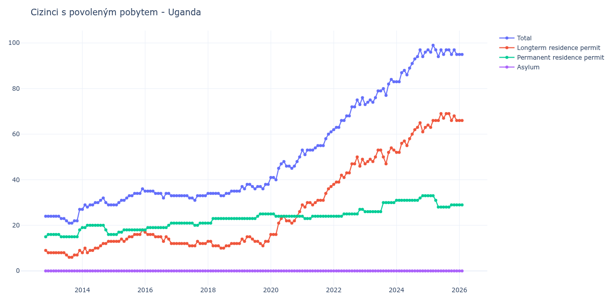

# Uganda

## Souhrnné statistiky (Min/Max pro rok) / Summary Statistics (Min/Max per year)

| Year   | Total   | Longterm Residence Permit   | Permanent Residence Permit   | Asylum   |
|--------|---------|-----------------------------|------------------------------|----------|
| 2012   | 24 / 24 | 8 / 9                       | 15 / 16                      | 0 / 0    |
| 2013   | 21 / 27 | 6 / 9                       | 15 / 18                      | 0 / 0    |
| 2014   | 27 / 32 | 8 / 13                      | 16 / 20                      | 0 / 0    |
| 2015   | 29 / 36 | 13 / 18                     | 16 / 18                      | 0 / 0    |
| 2016   | 32 / 35 | 12 / 17                     | 18 / 21                      | 0 / 0    |
| 2017   | 31 / 33 | 11 / 13                     | 20 / 21                      | 0 / 0    |
| 2018   | 33 / 35 | 10 / 13                     | 21 / 23                      | 0 / 0    |
| 2019   | 35 / 38 | 11 / 15                     | 23 / 25                      | 0 / 0    |
| 2020   | 40 / 50 | 16 / 26                     | 24 / 25                      | 0 / 0    |
| 2021   | 51 / 61 | 28 / 37                     | 23 / 24                      | 0 / 0    |
| 2022   | 62 / 76 | 38 / 50                     | 24 / 27                      | 0 / 0    |
| 2023   | 73 / 84 | 47 / 54                     | 26 / 30                      | 0 / 0    |
| 2024   | 83 / 97 | 52 / 65                     | 31 / 33                      | 0 / 0    |
| 2025   | 94 / 99 | 63 / 69                     | 28 / 33                      | 0 / 0    |
| 2026   | 95 / 95 | 66 / 66                     | 29 / 29                      | 0 / 0    |

## Detailní tabulka / Detailed Data Table

| Date     | Total        | Longterm Residence Permit   | Permanent Residence Permit   | Asylum   |
|----------|--------------|-----------------------------|------------------------------|----------|
| **2012** |              |                             |                              |          |
| 11.2012  | 24           | 9                           | 15                           | 0        |
| 12.2012  | 24 (+0.00%)  | 8 (-11.11%)                 | 16 (+6.67%)                  | 0        |
| **2013** |              |                             |                              |          |
| 01.2013  | 24 (+0.00%)  | 8 (+0.00%)                  | 16 (+0.00%)                  | 0        |
| 02.2013  | 24 (+0.00%)  | 8 (+0.00%)                  | 16 (+0.00%)                  | 0        |
| 03.2013  | 24 (+0.00%)  | 8 (+0.00%)                  | 16 (+0.00%)                  | 0        |
| 04.2013  | 24 (+0.00%)  | 8 (+0.00%)                  | 16 (+0.00%)                  | 0        |
| 05.2013  | 23 (-4.17%)  | 8 (+0.00%)                  | 15 (-6.25%)                  | 0        |
| 06.2013  | 23 (+0.00%)  | 8 (+0.00%)                  | 15 (+0.00%)                  | 0        |
| 07.2013  | 22 (-4.35%)  | 7 (-12.50%)                 | 15 (+0.00%)                  | 0        |
| 08.2013  | 21 (-4.55%)  | 6 (-14.29%)                 | 15 (+0.00%)                  | 0        |
| 09.2013  | 21 (+0.00%)  | 6 (+0.00%)                  | 15 (+0.00%)                  | 0        |
| 10.2013  | 22 (+4.76%)  | 7 (+16.67%)                 | 15 (+0.00%)                  | 0        |
| 11.2013  | 22 (+0.00%)  | 7 (+0.00%)                  | 15 (+0.00%)                  | 0        |
| 12.2013  | 27 (+22.73%) | 9 (+28.57%)                 | 18 (+20.00%)                 | 0        |
| **2014** |              |                             |                              |          |
| 01.2014  | 27 (+0.00%)  | 8 (-11.11%)                 | 19 (+5.56%)                  | 0        |
| 02.2014  | 29 (+7.41%)  | 10 (+25.00%)                | 19 (+0.00%)                  | 0        |
| 03.2014  | 28 (-3.45%)  | 8 (-20.00%)                 | 20 (+5.26%)                  | 0        |
| 04.2014  | 29 (+3.57%)  | 9 (+12.50%)                 | 20 (+0.00%)                  | 0        |
| 05.2014  | 29 (+0.00%)  | 9 (+0.00%)                  | 20 (+0.00%)                  | 0        |
| 06.2014  | 30 (+3.45%)  | 10 (+11.11%)                | 20 (+0.00%)                  | 0        |
| 07.2014  | 30 (+0.00%)  | 10 (+0.00%)                 | 20 (+0.00%)                  | 0        |
| 08.2014  | 31 (+3.33%)  | 11 (+10.00%)                | 20 (+0.00%)                  | 0        |
| 09.2014  | 32 (+3.23%)  | 12 (+9.09%)                 | 20 (+0.00%)                  | 0        |
| 10.2014  | 30 (-6.25%)  | 12 (+0.00%)                 | 18 (-10.00%)                 | 0        |
| 11.2014  | 29 (-3.33%)  | 13 (+8.33%)                 | 16 (-11.11%)                 | 0        |
| 12.2014  | 29 (+0.00%)  | 13 (+0.00%)                 | 16 (+0.00%)                  | 0        |
| **2015** |              |                             |                              |          |
| 01.2015  | 29 (+0.00%)  | 13 (+0.00%)                 | 16 (+0.00%)                  | 0        |
| 02.2015  | 29 (+0.00%)  | 13 (+0.00%)                 | 16 (+0.00%)                  | 0        |
| 03.2015  | 30 (+3.45%)  | 13 (+0.00%)                 | 17 (+6.25%)                  | 0        |
| 04.2015  | 31 (+3.33%)  | 14 (+7.69%)                 | 17 (+0.00%)                  | 0        |
| 05.2015  | 31 (+0.00%)  | 13 (-7.14%)                 | 18 (+5.88%)                  | 0        |
| 06.2015  | 32 (+3.23%)  | 14 (+7.69%)                 | 18 (+0.00%)                  | 0        |
| 07.2015  | 33 (+3.12%)  | 15 (+7.14%)                 | 18 (+0.00%)                  | 0        |
| 08.2015  | 33 (+0.00%)  | 15 (+0.00%)                 | 18 (+0.00%)                  | 0        |
| 09.2015  | 34 (+3.03%)  | 16 (+6.67%)                 | 18 (+0.00%)                  | 0        |
| 10.2015  | 34 (+0.00%)  | 16 (+0.00%)                 | 18 (+0.00%)                  | 0        |
| 11.2015  | 34 (+0.00%)  | 16 (+0.00%)                 | 18 (+0.00%)                  | 0        |
| 12.2015  | 36 (+5.88%)  | 18 (+12.50%)                | 18 (+0.00%)                  | 0        |
| **2016** |              |                             |                              |          |
| 01.2016  | 35 (-2.78%)  | 17 (-5.56%)                 | 18 (+0.00%)                  | 0        |
| 02.2016  | 35 (+0.00%)  | 16 (-5.88%)                 | 19 (+5.56%)                  | 0        |
| 03.2016  | 35 (+0.00%)  | 16 (+0.00%)                 | 19 (+0.00%)                  | 0        |
| 04.2016  | 35 (+0.00%)  | 16 (+0.00%)                 | 19 (+0.00%)                  | 0        |
| 05.2016  | 34 (-2.86%)  | 15 (-6.25%)                 | 19 (+0.00%)                  | 0        |
| 06.2016  | 34 (+0.00%)  | 15 (+0.00%)                 | 19 (+0.00%)                  | 0        |
| 07.2016  | 34 (+0.00%)  | 15 (+0.00%)                 | 19 (+0.00%)                  | 0        |
| 08.2016  | 32 (-5.88%)  | 13 (-13.33%)                | 19 (+0.00%)                  | 0        |
| 09.2016  | 34 (+6.25%)  | 15 (+15.38%)                | 19 (+0.00%)                  | 0        |
| 10.2016  | 34 (+0.00%)  | 14 (-6.67%)                 | 20 (+5.26%)                  | 0        |
| 11.2016  | 33 (-2.94%)  | 12 (-14.29%)                | 21 (+5.00%)                  | 0        |
| 12.2016  | 33 (+0.00%)  | 12 (+0.00%)                 | 21 (+0.00%)                  | 0        |
| **2017** |              |                             |                              |          |
| 01.2017  | 33 (+0.00%)  | 12 (+0.00%)                 | 21 (+0.00%)                  | 0        |
| 02.2017  | 33 (+0.00%)  | 12 (+0.00%)                 | 21 (+0.00%)                  | 0        |
| 03.2017  | 33 (+0.00%)  | 12 (+0.00%)                 | 21 (+0.00%)                  | 0        |
| 04.2017  | 33 (+0.00%)  | 12 (+0.00%)                 | 21 (+0.00%)                  | 0        |
| 05.2017  | 33 (+0.00%)  | 12 (+0.00%)                 | 21 (+0.00%)                  | 0        |
| 06.2017  | 32 (-3.03%)  | 11 (-8.33%)                 | 21 (+0.00%)                  | 0        |
| 07.2017  | 32 (+0.00%)  | 11 (+0.00%)                 | 21 (+0.00%)                  | 0        |
| 08.2017  | 31 (-3.12%)  | 11 (+0.00%)                 | 20 (-4.76%)                  | 0        |
| 09.2017  | 33 (+6.45%)  | 13 (+18.18%)                | 20 (+0.00%)                  | 0        |
| 10.2017  | 33 (+0.00%)  | 12 (-7.69%)                 | 21 (+5.00%)                  | 0        |
| 11.2017  | 33 (+0.00%)  | 12 (+0.00%)                 | 21 (+0.00%)                  | 0        |
| 12.2017  | 33 (+0.00%)  | 12 (+0.00%)                 | 21 (+0.00%)                  | 0        |
| **2018** |              |                             |                              |          |
| 01.2018  | 34 (+3.03%)  | 13 (+8.33%)                 | 21 (+0.00%)                  | 0        |
| 02.2018  | 34 (+0.00%)  | 13 (+0.00%)                 | 21 (+0.00%)                  | 0        |
| 03.2018  | 34 (+0.00%)  | 11 (-15.38%)                | 23 (+9.52%)                  | 0        |
| 04.2018  | 34 (+0.00%)  | 11 (+0.00%)                 | 23 (+0.00%)                  | 0        |
| 05.2018  | 34 (+0.00%)  | 11 (+0.00%)                 | 23 (+0.00%)                  | 0        |
| 06.2018  | 33 (-2.94%)  | 10 (-9.09%)                 | 23 (+0.00%)                  | 0        |
| 07.2018  | 33 (+0.00%)  | 10 (+0.00%)                 | 23 (+0.00%)                  | 0        |
| 08.2018  | 34 (+3.03%)  | 11 (+10.00%)                | 23 (+0.00%)                  | 0        |
| 09.2018  | 34 (+0.00%)  | 11 (+0.00%)                 | 23 (+0.00%)                  | 0        |
| 10.2018  | 35 (+2.94%)  | 12 (+9.09%)                 | 23 (+0.00%)                  | 0        |
| 11.2018  | 35 (+0.00%)  | 12 (+0.00%)                 | 23 (+0.00%)                  | 0        |
| 12.2018  | 35 (+0.00%)  | 12 (+0.00%)                 | 23 (+0.00%)                  | 0        |
| **2019** |              |                             |                              |          |
| 01.2019  | 35 (+0.00%)  | 12 (+0.00%)                 | 23 (+0.00%)                  | 0        |
| 02.2019  | 37 (+5.71%)  | 14 (+16.67%)                | 23 (+0.00%)                  | 0        |
| 03.2019  | 36 (-2.70%)  | 13 (-7.14%)                 | 23 (+0.00%)                  | 0        |
| 04.2019  | 38 (+5.56%)  | 15 (+15.38%)                | 23 (+0.00%)                  | 0        |
| 05.2019  | 38 (+0.00%)  | 15 (+0.00%)                 | 23 (+0.00%)                  | 0        |
| 06.2019  | 37 (-2.63%)  | 14 (-6.67%)                 | 23 (+0.00%)                  | 0        |
| 07.2019  | 36 (-2.70%)  | 13 (-7.14%)                 | 23 (+0.00%)                  | 0        |
| 08.2019  | 37 (+2.78%)  | 13 (+0.00%)                 | 24 (+4.35%)                  | 0        |
| 09.2019  | 37 (+0.00%)  | 12 (-7.69%)                 | 25 (+4.17%)                  | 0        |
| 10.2019  | 36 (-2.70%)  | 11 (-8.33%)                 | 25 (+0.00%)                  | 0        |
| 11.2019  | 38 (+5.56%)  | 13 (+18.18%)                | 25 (+0.00%)                  | 0        |
| 12.2019  | 38 (+0.00%)  | 13 (+0.00%)                 | 25 (+0.00%)                  | 0        |
| **2020** |              |                             |                              |          |
| 01.2020  | 41 (+7.89%)  | 16 (+23.08%)                | 25 (+0.00%)                  | 0        |
| 02.2020  | 41 (+0.00%)  | 16 (+0.00%)                 | 25 (+0.00%)                  | 0        |
| 03.2020  | 40 (-2.44%)  | 16 (+0.00%)                 | 24 (-4.00%)                  | 0        |
| 04.2020  | 45 (+12.50%) | 21 (+31.25%)                | 24 (+0.00%)                  | 0        |
| 05.2020  | 47 (+4.44%)  | 23 (+9.52%)                 | 24 (+0.00%)                  | 0        |
| 06.2020  | 48 (+2.13%)  | 24 (+4.35%)                 | 24 (+0.00%)                  | 0        |
| 07.2020  | 46 (-4.17%)  | 22 (-8.33%)                 | 24 (+0.00%)                  | 0        |
| 08.2020  | 46 (+0.00%)  | 22 (+0.00%)                 | 24 (+0.00%)                  | 0        |
| 09.2020  | 45 (-2.17%)  | 21 (-4.55%)                 | 24 (+0.00%)                  | 0        |
| 10.2020  | 46 (+2.22%)  | 22 (+4.76%)                 | 24 (+0.00%)                  | 0        |
| 11.2020  | 48 (+4.35%)  | 24 (+9.09%)                 | 24 (+0.00%)                  | 0        |
| 12.2020  | 50 (+4.17%)  | 26 (+8.33%)                 | 24 (+0.00%)                  | 0        |
| **2021** |              |                             |                              |          |
| 01.2021  | 53 (+6.00%)  | 29 (+11.54%)                | 24 (+0.00%)                  | 0        |
| 02.2021  | 51 (-3.77%)  | 28 (-3.45%)                 | 23 (-4.17%)                  | 0        |
| 03.2021  | 53 (+3.92%)  | 30 (+7.14%)                 | 23 (+0.00%)                  | 0        |
| 04.2021  | 53 (+0.00%)  | 30 (+0.00%)                 | 23 (+0.00%)                  | 0        |
| 05.2021  | 53 (+0.00%)  | 29 (-3.33%)                 | 24 (+4.35%)                  | 0        |
| 06.2021  | 54 (+1.89%)  | 30 (+3.45%)                 | 24 (+0.00%)                  | 0        |
| 07.2021  | 55 (+1.85%)  | 31 (+3.33%)                 | 24 (+0.00%)                  | 0        |
| 08.2021  | 55 (+0.00%)  | 31 (+0.00%)                 | 24 (+0.00%)                  | 0        |
| 09.2021  | 55 (+0.00%)  | 31 (+0.00%)                 | 24 (+0.00%)                  | 0        |
| 10.2021  | 58 (+5.45%)  | 34 (+9.68%)                 | 24 (+0.00%)                  | 0        |
| 11.2021  | 60 (+3.45%)  | 36 (+5.88%)                 | 24 (+0.00%)                  | 0        |
| 12.2021  | 61 (+1.67%)  | 37 (+2.78%)                 | 24 (+0.00%)                  | 0        |
| **2022** |              |                             |                              |          |
| 01.2022  | 62 (+1.64%)  | 38 (+2.70%)                 | 24 (+0.00%)                  | 0        |
| 02.2022  | 63 (+1.61%)  | 39 (+2.63%)                 | 24 (+0.00%)                  | 0        |
| 03.2022  | 63 (+0.00%)  | 39 (+0.00%)                 | 24 (+0.00%)                  | 0        |
| 04.2022  | 66 (+4.76%)  | 42 (+7.69%)                 | 24 (+0.00%)                  | 0        |
| 05.2022  | 66 (+0.00%)  | 41 (-2.38%)                 | 25 (+4.17%)                  | 0        |
| 06.2022  | 68 (+3.03%)  | 43 (+4.88%)                 | 25 (+0.00%)                  | 0        |
| 07.2022  | 68 (+0.00%)  | 43 (+0.00%)                 | 25 (+0.00%)                  | 0        |
| 08.2022  | 72 (+5.88%)  | 47 (+9.30%)                 | 25 (+0.00%)                  | 0        |
| 09.2022  | 72 (+0.00%)  | 47 (+0.00%)                 | 25 (+0.00%)                  | 0        |
| 10.2022  | 75 (+4.17%)  | 50 (+6.38%)                 | 25 (+0.00%)                  | 0        |
| 11.2022  | 73 (-2.67%)  | 46 (-8.00%)                 | 27 (+8.00%)                  | 0        |
| 12.2022  | 76 (+4.11%)  | 49 (+6.52%)                 | 27 (+0.00%)                  | 0        |
| **2023** |              |                             |                              |          |
| 01.2023  | 73 (-3.95%)  | 47 (-4.08%)                 | 26 (-3.70%)                  | 0        |
| 02.2023  | 74 (+1.37%)  | 48 (+2.13%)                 | 26 (+0.00%)                  | 0        |
| 03.2023  | 75 (+1.35%)  | 49 (+2.08%)                 | 26 (+0.00%)                  | 0        |
| 04.2023  | 74 (-1.33%)  | 48 (-2.04%)                 | 26 (+0.00%)                  | 0        |
| 05.2023  | 76 (+2.70%)  | 50 (+4.17%)                 | 26 (+0.00%)                  | 0        |
| 06.2023  | 79 (+3.95%)  | 53 (+6.00%)                 | 26 (+0.00%)                  | 0        |
| 07.2023  | 79 (+0.00%)  | 53 (+0.00%)                 | 26 (+0.00%)                  | 0        |
| 08.2023  | 80 (+1.27%)  | 50 (-5.66%)                 | 30 (+15.38%)                 | 0        |
| 09.2023  | 77 (-3.75%)  | 47 (-6.00%)                 | 30 (+0.00%)                  | 0        |
| 10.2023  | 82 (+6.49%)  | 52 (+10.64%)                | 30 (+0.00%)                  | 0        |
| 11.2023  | 84 (+2.44%)  | 54 (+3.85%)                 | 30 (+0.00%)                  | 0        |
| 12.2023  | 83 (-1.19%)  | 53 (-1.85%)                 | 30 (+0.00%)                  | 0        |
| **2024** |              |                             |                              |          |
| 01.2024  | 83 (+0.00%)  | 52 (-1.89%)                 | 31 (+3.33%)                  | 0        |
| 02.2024  | 83 (+0.00%)  | 52 (+0.00%)                 | 31 (+0.00%)                  | 0        |
| 03.2024  | 87 (+4.82%)  | 56 (+7.69%)                 | 31 (+0.00%)                  | 0        |
| 04.2024  | 88 (+1.15%)  | 57 (+1.79%)                 | 31 (+0.00%)                  | 0        |
| 05.2024  | 86 (-2.27%)  | 55 (-3.51%)                 | 31 (+0.00%)                  | 0        |
| 06.2024  | 89 (+3.49%)  | 58 (+5.45%)                 | 31 (+0.00%)                  | 0        |
| 07.2024  | 91 (+2.25%)  | 60 (+3.45%)                 | 31 (+0.00%)                  | 0        |
| 08.2024  | 93 (+2.20%)  | 62 (+3.33%)                 | 31 (+0.00%)                  | 0        |
| 09.2024  | 94 (+1.08%)  | 63 (+1.61%)                 | 31 (+0.00%)                  | 0        |
| 10.2024  | 97 (+3.19%)  | 65 (+3.17%)                 | 32 (+3.23%)                  | 0        |
| 11.2024  | 94 (-3.09%)  | 61 (-6.15%)                 | 33 (+3.12%)                  | 0        |
| 12.2024  | 96 (+2.13%)  | 63 (+3.28%)                 | 33 (+0.00%)                  | 0        |
| **2025** |              |                             |                              |          |
| 01.2025  | 97 (+1.04%)  | 64 (+1.59%)                 | 33 (+0.00%)                  | 0        |
| 02.2025  | 96 (-1.03%)  | 63 (-1.56%)                 | 33 (+0.00%)                  | 0        |
| 03.2025  | 99 (+3.12%)  | 66 (+4.76%)                 | 33 (+0.00%)                  | 0        |
| 04.2025  | 97 (-2.02%)  | 66 (+0.00%)                 | 31 (-6.06%)                  | 0        |
| 05.2025  | 94 (-3.09%)  | 66 (+0.00%)                 | 28 (-9.68%)                  | 0        |
| 06.2025  | 97 (+3.19%)  | 69 (+4.55%)                 | 28 (+0.00%)                  | 0        |
| 07.2025  | 95 (-2.06%)  | 67 (-2.90%)                 | 28 (+0.00%)                  | 0        |
| 08.2025  | 97 (+2.11%)  | 69 (+2.99%)                 | 28 (+0.00%)                  | 0        |
| 09.2025  | 97 (+0.00%)  | 69 (+0.00%)                 | 28 (+0.00%)                  | 0        |
| 10.2025  | 95 (-2.06%)  | 66 (-4.35%)                 | 29 (+3.57%)                  | 0        |
| 11.2025  | 97 (+2.11%)  | 68 (+3.03%)                 | 29 (+0.00%)                  | 0        |
| 12.2025  | 95 (-2.06%)  | 66 (-2.94%)                 | 29 (+0.00%)                  | 0        |
| **2026** |              |                             |                              |          |
| 01.2026  | 95 (+0.00%)  | 66 (+0.00%)                 | 29 (+0.00%)                  | 0        |
| 02.2026  | 95 (+0.00%)  | 66 (+0.00%)                 | 29 (+0.00%)                  | 0        |
