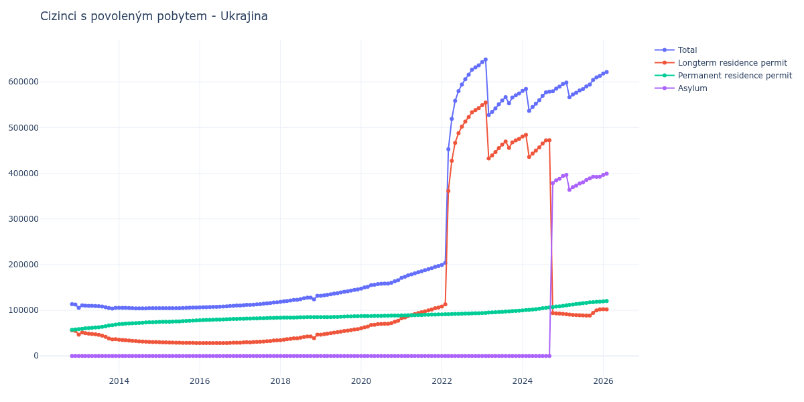

# Ukrajina

## Souhrnné statistiky (Min/Max pro rok) / Summary Statistics (Min/Max per year)

| Year   | Total             | Longterm Residence Permit   | Permanent Residence Permit   | Asylum            |
|--------|-------------------|-----------------------------|------------------------------|-------------------|
| 2012   | 112 647 / 113 318 | 54 877 / 56 227             | 57 091 / 57 770              | 0 / 0             |
| 2013   | 103 871 / 110 682 | 36 273 / 51 166             | 58 650 / 68 648              | 0 / 0             |
| 2014   | 104 057 / 105 186 | 30 357 / 35 569             | 69 535 / 74 031              | 0 / 0             |
| 2015   | 104 375 / 106 019 | 28 416 / 30 114             | 74 286 / 77 603              | 0 / 0             |
| 2016   | 106 182 / 110 245 | 28 079 / 29 036             | 77 931 / 81 209              | 0 / 0             |
| 2017   | 110 514 / 117 480 | 29 122 / 33 992             | 81 392 / 83 488              | 0 / 0             |
| 2018   | 118 293 / 131 709 | 34 638 / 46 713             | 83 655 / 85 032              | 0 / 0             |
| 2019   | 131 691 / 145 518 | 46 752 / 58 588             | 84 896 / 86 930              | 0 / 0             |
| 2020   | 147 551 / 165 654 | 60 418 / 77 176             | 87 133 / 88 478              | 0 / 0             |
| 2021   | 171 012 / 196 875 | 82 338 / 106 099            | 88 674 / 90 776              | 0 / 0             |
| 2022   | 199 210 / 636 282 | 108 225 / 542 737           | 90 985 / 93 545              | 0 / 0             |
| 2023   | 527 268 / 649 035 | 432 400 / 554 630           | 94 032 / 99 069              | 0 / 0             |
| 2024   | 536 558 / 589 456 | 92 843 / 484 161            | 99 727 / 108 546             | 0 / 388 067       |
| 2025   | 566 151 / 612 953 | 88 191 / 101 902            | 109 566 / 118 718            | 363 838 / 396 421 |
| 2026   | 618 332 / 621 445 | 102 102 / 102 258           | 119 609 / 120 433            | 396 465 / 398 910 |

## Detailní tabulka / Detailed Data Table

| Date     | Total              | Longterm Residence Permit   | Permanent Residence Permit   | Asylum           |
|----------|--------------------|-----------------------------|------------------------------|------------------|
| **2012** |                    |                             |                              |                  |
| 11.2012  | 113 318            | 56 227                      | 57 091                       | 0                |
| 12.2012  | 112 647 (-0.59%)   | 54 877 (-2.40%)             | 57 770 (+1.19%)              | 0                |
| **2013** |                    |                             |                              |                  |
| 01.2013  | 105 235 (-6.58%)   | 46 585 (-15.11%)            | 58 650 (+1.52%)              | 0                |
| 02.2013  | 110 682 (+5.18%)   | 51 166 (+9.83%)             | 59 516 (+1.48%)              | 0                |
| 03.2013  | 110 075 (-0.55%)   | 49 718 (-2.83%)             | 60 357 (+1.41%)              | 0                |
| 04.2013  | 109 816 (-0.24%)   | 48 842 (-1.76%)             | 60 974 (+1.02%)              | 0                |
| 05.2013  | 109 611 (-0.19%)   | 47 972 (-1.78%)             | 61 639 (+1.09%)              | 0                |
| 06.2013  | 109 316 (-0.27%)   | 47 145 (-1.72%)             | 62 171 (+0.86%)              | 0                |
| 07.2013  | 108 891 (-0.39%)   | 46 123 (-2.17%)             | 62 768 (+0.96%)              | 0                |
| 08.2013  | 108 157 (-0.67%)   | 44 498 (-3.52%)             | 63 659 (+1.42%)              | 0                |
| 09.2013  | 106 714 (-1.33%)   | 41 730 (-6.22%)             | 64 984 (+2.08%)              | 0                |
| 10.2013  | 104 720 (-1.87%)   | 38 161 (-8.55%)             | 66 559 (+2.42%)              | 0                |
| 11.2013  | 103 871 (-0.81%)   | 36 273 (-4.95%)             | 67 598 (+1.56%)              | 0                |
| 12.2013  | 105 239 (+1.32%)   | 36 591 (+0.88%)             | 68 648 (+1.55%)              | 0                |
| **2014** |                    |                             |                              |                  |
| 01.2014  | 105 104 (-0.13%)   | 35 569 (-2.79%)             | 69 535 (+1.29%)              | 0                |
| 02.2014  | 105 186 (+0.08%)   | 35 009 (-1.57%)             | 70 177 (+0.92%)              | 0                |
| 03.2014  | 105 167 (-0.02%)   | 34 471 (-1.54%)             | 70 696 (+0.74%)              | 0                |
| 04.2014  | 104 889 (-0.26%)   | 33 868 (-1.75%)             | 71 021 (+0.46%)              | 0                |
| 05.2014  | 104 518 (-0.35%)   | 33 178 (-2.04%)             | 71 340 (+0.45%)              | 0                |
| 06.2014  | 104 290 (-0.22%)   | 32 509 (-2.02%)             | 71 781 (+0.62%)              | 0                |
| 07.2014  | 104 188 (-0.10%)   | 31 958 (-1.69%)             | 72 230 (+0.63%)              | 0                |
| 08.2014  | 104 057 (-0.13%)   | 31 436 (-1.63%)             | 72 621 (+0.54%)              | 0                |
| 09.2014  | 104 272 (+0.21%)   | 31 050 (-1.23%)             | 73 222 (+0.83%)              | 0                |
| 10.2014  | 104 370 (+0.09%)   | 30 794 (-0.82%)             | 73 576 (+0.48%)              | 0                |
| 11.2014  | 104 391 (+0.02%)   | 30 552 (-0.79%)             | 73 839 (+0.36%)              | 0                |
| 12.2014  | 104 388 (-0.00%)   | 30 357 (-0.64%)             | 74 031 (+0.26%)              | 0                |
| **2015** |                    |                             |                              |                  |
| 01.2015  | 104 400 (+0.01%)   | 30 114 (-0.80%)             | 74 286 (+0.34%)              | 0                |
| 02.2015  | 104 546 (+0.14%)   | 29 859 (-0.85%)             | 74 687 (+0.54%)              | 0                |
| 03.2015  | 104 433 (-0.11%)   | 29 651 (-0.70%)             | 74 782 (+0.13%)              | 0                |
| 04.2015  | 104 379 (-0.05%)   | 29 432 (-0.74%)             | 74 947 (+0.22%)              | 0                |
| 05.2015  | 104 375 (-0.00%)   | 29 229 (-0.69%)             | 75 146 (+0.27%)              | 0                |
| 06.2015  | 104 438 (+0.06%)   | 29 049 (-0.62%)             | 75 389 (+0.32%)              | 0                |
| 07.2015  | 104 558 (+0.11%)   | 28 839 (-0.72%)             | 75 719 (+0.44%)              | 0                |
| 08.2015  | 104 866 (+0.29%)   | 28 677 (-0.56%)             | 76 189 (+0.62%)              | 0                |
| 09.2015  | 105 153 (+0.27%)   | 28 504 (-0.60%)             | 76 649 (+0.60%)              | 0                |
| 10.2015  | 105 597 (+0.42%)   | 28 593 (+0.31%)             | 77 004 (+0.46%)              | 0                |
| 11.2015  | 105 826 (+0.22%)   | 28 424 (-0.59%)             | 77 402 (+0.52%)              | 0                |
| 12.2015  | 106 019 (+0.18%)   | 28 416 (-0.03%)             | 77 603 (+0.26%)              | 0                |
| **2016** |                    |                             |                              |                  |
| 01.2016  | 106 182 (+0.15%)   | 28 251 (-0.58%)             | 77 931 (+0.42%)              | 0                |
| 02.2016  | 106 637 (+0.43%)   | 28 253 (+0.01%)             | 78 384 (+0.58%)              | 0                |
| 03.2016  | 106 788 (+0.14%)   | 28 079 (-0.62%)             | 78 709 (+0.41%)              | 0                |
| 04.2016  | 107 110 (+0.30%)   | 28 181 (+0.36%)             | 78 929 (+0.28%)              | 0                |
| 05.2016  | 107 397 (+0.27%)   | 28 181 (+0.00%)             | 79 216 (+0.36%)              | 0                |
| 06.2016  | 107 614 (+0.20%)   | 28 118 (-0.22%)             | 79 496 (+0.35%)              | 0                |
| 07.2016  | 107 855 (+0.22%)   | 28 112 (-0.02%)             | 79 743 (+0.31%)              | 0                |
| 08.2016  | 108 220 (+0.34%)   | 28 215 (+0.37%)             | 80 005 (+0.33%)              | 0                |
| 09.2016  | 108 533 (+0.29%)   | 28 354 (+0.49%)             | 80 179 (+0.22%)              | 0                |
| 10.2016  | 109 243 (+0.65%)   | 28 656 (+1.07%)             | 80 587 (+0.51%)              | 0                |
| 11.2016  | 109 753 (+0.47%)   | 28 826 (+0.59%)             | 80 927 (+0.42%)              | 0                |
| 12.2016  | 110 245 (+0.45%)   | 29 036 (+0.73%)             | 81 209 (+0.35%)              | 0                |
| **2017** |                    |                             |                              |                  |
| 01.2017  | 110 514 (+0.24%)   | 29 122 (+0.30%)             | 81 392 (+0.23%)              | 0                |
| 02.2017  | 111 016 (+0.45%)   | 29 527 (+1.39%)             | 81 489 (+0.12%)              | 0                |
| 03.2017  | 111 722 (+0.64%)   | 30 073 (+1.85%)             | 81 649 (+0.20%)              | 0                |
| 04.2017  | 111 750 (+0.03%)   | 29 866 (-0.69%)             | 81 884 (+0.29%)              | 0                |
| 05.2017  | 112 279 (+0.47%)   | 30 258 (+1.31%)             | 82 021 (+0.17%)              | 0                |
| 06.2017  | 112 956 (+0.60%)   | 30 721 (+1.53%)             | 82 235 (+0.26%)              | 0                |
| 07.2017  | 113 397 (+0.39%)   | 31 066 (+1.12%)             | 82 331 (+0.12%)              | 0                |
| 08.2017  | 114 284 (+0.78%)   | 31 669 (+1.94%)             | 82 615 (+0.34%)              | 0                |
| 09.2017  | 115 019 (+0.64%)   | 32 165 (+1.57%)             | 82 854 (+0.29%)              | 0                |
| 10.2017  | 115 997 (+0.85%)   | 32 816 (+2.02%)             | 83 181 (+0.39%)              | 0                |
| 11.2017  | 116 998 (+0.86%)   | 33 578 (+2.32%)             | 83 420 (+0.29%)              | 0                |
| 12.2017  | 117 480 (+0.41%)   | 33 992 (+1.23%)             | 83 488 (+0.08%)              | 0                |
| **2018** |                    |                             |                              |                  |
| 01.2018  | 118 293 (+0.69%)   | 34 638 (+1.90%)             | 83 655 (+0.20%)              | 0                |
| 02.2018  | 119 423 (+0.96%)   | 35 601 (+2.78%)             | 83 822 (+0.20%)              | 0                |
| 03.2018  | 120 431 (+0.84%)   | 36 570 (+2.72%)             | 83 861 (+0.05%)              | 0                |
| 04.2018  | 121 458 (+0.85%)   | 37 455 (+2.42%)             | 84 003 (+0.17%)              | 0                |
| 05.2018  | 122 563 (+0.91%)   | 38 419 (+2.57%)             | 84 144 (+0.17%)              | 0                |
| 06.2018  | 122 763 (+0.16%)   | 38 449 (+0.08%)             | 84 314 (+0.20%)              | 0                |
| 07.2018  | 124 379 (+1.32%)   | 39 837 (+3.61%)             | 84 542 (+0.27%)              | 0                |
| 08.2018  | 126 068 (+1.36%)   | 41 382 (+3.88%)             | 84 686 (+0.17%)              | 0                |
| 09.2018  | 127 530 (+1.16%)   | 42 619 (+2.99%)             | 84 911 (+0.27%)              | 0                |
| 10.2018  | 127 501 (-0.02%)   | 42 523 (-0.23%)             | 84 978 (+0.08%)              | 0                |
| 11.2018  | 123 883 (-2.84%)   | 38 851 (-8.64%)             | 85 032 (+0.06%)              | 0                |
| 12.2018  | 131 709 (+6.32%)   | 46 713 (+20.24%)            | 84 996 (-0.04%)              | 0                |
| **2019** |                    |                             |                              |                  |
| 01.2019  | 131 691 (-0.01%)   | 46 752 (+0.08%)             | 84 939 (-0.07%)              | 0                |
| 02.2019  | 132 627 (+0.71%)   | 47 731 (+2.09%)             | 84 896 (-0.05%)              | 0                |
| 03.2019  | 133 706 (+0.81%)   | 48 718 (+2.07%)             | 84 988 (+0.11%)              | 0                |
| 04.2019  | 134 889 (+0.88%)   | 49 693 (+2.00%)             | 85 196 (+0.24%)              | 0                |
| 05.2019  | 136 266 (+1.02%)   | 50 894 (+2.42%)             | 85 372 (+0.21%)              | 0                |
| 06.2019  | 137 674 (+1.03%)   | 52 125 (+2.42%)             | 85 549 (+0.21%)              | 0                |
| 07.2019  | 138 969 (+0.94%)   | 53 145 (+1.96%)             | 85 824 (+0.32%)              | 0                |
| 08.2019  | 140 503 (+1.10%)   | 54 459 (+2.47%)             | 86 044 (+0.26%)              | 0                |
| 09.2019  | 141 580 (+0.77%)   | 55 221 (+1.40%)             | 86 359 (+0.37%)              | 0                |
| 10.2019  | 142 960 (+0.97%)   | 56 422 (+2.17%)             | 86 538 (+0.21%)              | 0                |
| 11.2019  | 144 529 (+1.10%)   | 57 768 (+2.39%)             | 86 761 (+0.26%)              | 0                |
| 12.2019  | 145 518 (+0.68%)   | 58 588 (+1.42%)             | 86 930 (+0.19%)              | 0                |
| **2020** |                    |                             |                              |                  |
| 01.2020  | 147 551 (+1.40%)   | 60 418 (+3.12%)             | 87 133 (+0.23%)              | 0                |
| 02.2020  | 150 104 (+1.73%)   | 62 830 (+3.99%)             | 87 274 (+0.16%)              | 0                |
| 03.2020  | 151 481 (+0.92%)   | 64 149 (+2.10%)             | 87 332 (+0.07%)              | 0                |
| 04.2020  | 155 222 (+2.47%)   | 67 800 (+5.69%)             | 87 422 (+0.10%)              | 0                |
| 05.2020  | 155 662 (+0.28%)   | 68 135 (+0.49%)             | 87 527 (+0.12%)              | 0                |
| 06.2020  | 157 289 (+1.05%)   | 69 722 (+2.33%)             | 87 567 (+0.05%)              | 0                |
| 07.2020  | 157 908 (+0.39%)   | 70 198 (+0.68%)             | 87 710 (+0.16%)              | 0                |
| 08.2020  | 158 281 (+0.24%)   | 70 431 (+0.33%)             | 87 850 (+0.16%)              | 0                |
| 09.2020  | 158 300 (+0.01%)   | 70 246 (-0.26%)             | 88 054 (+0.23%)              | 0                |
| 10.2020  | 160 267 (+1.24%)   | 72 049 (+2.57%)             | 88 218 (+0.19%)              | 0                |
| 11.2020  | 163 369 (+1.94%)   | 74 918 (+3.98%)             | 88 451 (+0.26%)              | 0                |
| 12.2020  | 165 654 (+1.40%)   | 77 176 (+3.01%)             | 88 478 (+0.03%)              | 0                |
| **2021** |                    |                             |                              |                  |
| 01.2021  | 171 012 (+3.23%)   | 82 338 (+6.69%)             | 88 674 (+0.22%)              | 0                |
| 02.2021  | 173 304 (+1.34%)   | 84 442 (+2.56%)             | 88 862 (+0.21%)              | 0                |
| 03.2021  | 176 204 (+1.67%)   | 87 277 (+3.36%)             | 88 927 (+0.07%)              | 0                |
| 04.2021  | 178 474 (+1.29%)   | 89 456 (+2.50%)             | 89 018 (+0.10%)              | 0                |
| 05.2021  | 180 801 (+1.30%)   | 91 575 (+2.37%)             | 89 226 (+0.23%)              | 0                |
| 06.2021  | 183 250 (+1.35%)   | 93 772 (+2.40%)             | 89 478 (+0.28%)              | 0                |
| 07.2021  | 185 195 (+1.06%)   | 95 541 (+1.89%)             | 89 654 (+0.20%)              | 0                |
| 08.2021  | 187 591 (+1.29%)   | 97 431 (+1.98%)             | 90 160 (+0.56%)              | 0                |
| 09.2021  | 189 912 (+1.24%)   | 99 608 (+2.23%)             | 90 304 (+0.16%)              | 0                |
| 10.2021  | 192 145 (+1.18%)   | 101 607 (+2.01%)            | 90 538 (+0.26%)              | 0                |
| 11.2021  | 194 999 (+1.49%)   | 104 323 (+2.67%)            | 90 676 (+0.15%)              | 0                |
| 12.2021  | 196 875 (+0.96%)   | 106 099 (+1.70%)            | 90 776 (+0.11%)              | 0                |
| **2022** |                    |                             |                              |                  |
| 01.2022  | 199 210 (+1.19%)   | 108 225 (+2.00%)            | 90 985 (+0.23%)              | 0                |
| 02.2022  | 204 018 (+2.41%)   | 112 845 (+4.27%)            | 91 173 (+0.21%)              | 0                |
| 03.2022  | 452 657 (+121.87%) | 361 275 (+220.15%)          | 91 382 (+0.23%)              | 0                |
| 04.2022  | 518 938 (+14.64%)  | 427 326 (+18.28%)           | 91 612 (+0.25%)              | 0                |
| 05.2022  | 558 474 (+7.62%)   | 466 602 (+9.19%)            | 91 872 (+0.28%)              | 0                |
| 06.2022  | 579 843 (+3.83%)   | 487 791 (+4.54%)            | 92 052 (+0.20%)              | 0                |
| 07.2022  | 594 166 (+2.47%)   | 501 853 (+2.88%)            | 92 313 (+0.28%)              | 0                |
| 08.2022  | 605 765 (+1.95%)   | 513 108 (+2.24%)            | 92 657 (+0.37%)              | 0                |
| 09.2022  | 615 616 (+1.63%)   | 522 816 (+1.89%)            | 92 800 (+0.15%)              | 0                |
| 10.2022  | 626 500 (+1.77%)   | 533 355 (+2.02%)            | 93 145 (+0.37%)              | 0                |
| 11.2022  | 631 705 (+0.83%)   | 538 338 (+0.93%)            | 93 367 (+0.24%)              | 0                |
| 12.2022  | 636 282 (+0.72%)   | 542 737 (+0.82%)            | 93 545 (+0.19%)              | 0                |
| **2023** |                    |                             |                              |                  |
| 01.2023  | 643 070 (+1.07%)   | 549 038 (+1.16%)            | 94 032 (+0.52%)              | 0                |
| 02.2023  | 649 035 (+0.93%)   | 554 630 (+1.02%)            | 94 405 (+0.40%)              | 0                |
| 03.2023  | 527 268 (-18.76%)  | 432 400 (-22.04%)           | 94 868 (+0.49%)              | 0                |
| 04.2023  | 534 212 (+1.32%)   | 439 029 (+1.53%)            | 95 183 (+0.33%)              | 0                |
| 05.2023  | 541 990 (+1.46%)   | 446 364 (+1.67%)            | 95 626 (+0.47%)              | 0                |
| 06.2023  | 551 113 (+1.68%)   | 455 094 (+1.96%)            | 96 019 (+0.41%)              | 0                |
| 07.2023  | 559 243 (+1.48%)   | 462 699 (+1.67%)            | 96 544 (+0.55%)              | 0                |
| 08.2023  | 566 519 (+1.30%)   | 469 348 (+1.44%)            | 97 171 (+0.65%)              | 0                |
| 09.2023  | 553 011 (-2.38%)   | 455 345 (-2.98%)            | 97 666 (+0.51%)              | 0                |
| 10.2023  | 565 646 (+2.28%)   | 467 467 (+2.66%)            | 98 179 (+0.53%)              | 0                |
| 11.2023  | 570 672 (+0.89%)   | 472 021 (+0.97%)            | 98 651 (+0.48%)              | 0                |
| 12.2023  | 574 447 (+0.66%)   | 475 378 (+0.71%)            | 99 069 (+0.42%)              | 0                |
| **2024** |                    |                             |                              |                  |
| 01.2024  | 580 248 (+1.01%)   | 480 521 (+1.08%)            | 99 727 (+0.66%)              | 0                |
| 02.2024  | 584 472 (+0.73%)   | 484 161 (+0.76%)            | 100 311 (+0.59%)             | 0                |
| 03.2024  | 536 558 (-8.20%)   | 435 582 (-10.03%)           | 100 976 (+0.66%)             | 0                |
| 04.2024  | 544 828 (+1.54%)   | 443 096 (+1.73%)            | 101 732 (+0.75%)             | 0                |
| 05.2024  | 552 166 (+1.35%)   | 449 730 (+1.50%)            | 102 436 (+0.69%)             | 0                |
| 06.2024  | 559 836 (+1.39%)   | 456 424 (+1.49%)            | 103 412 (+0.95%)             | 0                |
| 07.2024  | 569 480 (+1.72%)   | 465 116 (+1.90%)            | 104 364 (+0.92%)             | 0                |
| 08.2024  | 577 032 (+1.33%)   | 471 823 (+1.44%)            | 105 209 (+0.81%)             | 0                |
| 09.2024  | 578 454 (+0.25%)   | 472 289 (+0.10%)            | 106 165 (+0.91%)             | 0                |
| 10.2024  | 579 508 (+0.18%)   | 93 972 (-80.10%)            | 107 097 (+0.88%)             | 378 439          |
| 11.2024  | 585 331 (+1.00%)   | 93 057 (-0.97%)             | 108 069 (+0.91%)             | 384 205 (+1.52%) |
| 12.2024  | 589 456 (+0.70%)   | 92 843 (-0.23%)             | 108 546 (+0.44%)             | 388 067 (+1.01%) |
| **2025** |                    |                             |                              |                  |
| 01.2025  | 595 454 (+1.02%)   | 92 030 (-0.88%)             | 109 566 (+0.94%)             | 393 858 (+1.49%) |
| 02.2025  | 598 311 (+0.48%)   | 91 308 (-0.78%)             | 110 582 (+0.93%)             | 396 421 (+0.65%) |
| 03.2025  | 566 151 (-5.38%)   | 90 632 (-0.74%)             | 111 681 (+0.99%)             | 363 838 (-8.22%) |
| 04.2025  | 572 250 (+1.08%)   | 89 896 (-0.81%)             | 112 649 (+0.87%)             | 369 705 (+1.61%) |
| 05.2025  | 575 938 (+0.64%)   | 89 440 (-0.51%)             | 113 550 (+0.80%)             | 372 948 (+0.88%) |
| 06.2025  | 581 184 (+0.91%)   | 89 023 (-0.47%)             | 114 537 (+0.87%)             | 377 624 (+1.25%) |
| 07.2025  | 584 188 (+0.52%)   | 88 834 (-0.21%)             | 115 482 (+0.83%)             | 379 872 (+0.60%) |
| 08.2025  | 589 887 (+0.98%)   | 88 433 (-0.45%)             | 116 411 (+0.80%)             | 385 043 (+1.36%) |
| 09.2025  | 593 922 (+0.68%)   | 88 191 (-0.27%)             | 117 216 (+0.69%)             | 388 515 (+0.90%) |
| 10.2025  | 604 332 (+1.75%)   | 94 419 (+7.06%)             | 117 672 (+0.39%)             | 392 241 (+0.96%) |
| 11.2025  | 609 947 (+0.93%)   | 99 723 (+5.62%)             | 118 288 (+0.52%)             | 391 936 (-0.08%) |
| 12.2025  | 612 953 (+0.49%)   | 101 902 (+2.19%)            | 118 718 (+0.36%)             | 392 333 (+0.10%) |
| **2026** |                    |                             |                              |                  |
| 01.2026  | 618 332 (+0.88%)   | 102 258 (+0.35%)            | 119 609 (+0.75%)             | 396 465 (+1.05%) |
| 02.2026  | 621 445 (+0.50%)   | 102 102 (-0.15%)            | 120 433 (+0.69%)             | 398 910 (+0.62%) |
