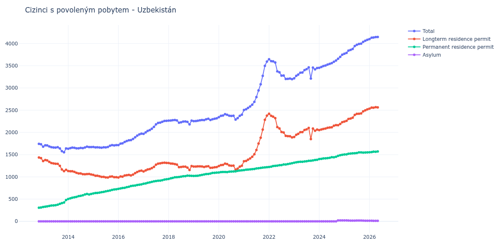

# Uzbekistán

## Souhrnné statistiky (Min/Max pro rok) / Summary Statistics (Min/Max per year)

| Year   | Total         | Longterm Residence Permit   | Permanent Residence Permit   | Asylum   |
|--------|---------------|-----------------------------|------------------------------|----------|
| 2012   | 1 733 / 1 743 | 1 421 / 1 436               | 307 / 312                    | 0 / 0    |
| 2013   | 1 553 / 1 710 | 1 129 / 1 379               | 324 / 480                    | 0 / 0    |
| 2014   | 1 634 / 1 679 | 1 054 / 1 131               | 503 / 616                    | 0 / 0    |
| 2015   | 1 656 / 1 716 | 987 / 1 044                 | 628 / 721                    | 0 / 0    |
| 2016   | 1 716 / 1 973 | 986 / 1 141                 | 730 / 832                    | 0 / 0    |
| 2017   | 1 968 / 2 261 | 1 122 / 1 320               | 846 / 947                    | 0 / 0    |
| 2018   | 2 181 / 2 279 | 1 155 / 1 312               | 954 / 1 028                  | 0 / 0    |
| 2019   | 2 255 / 2 316 | 1 205 / 1 240               | 1 022 / 1 096                | 0 / 0    |
| 2020   | 2 288 / 2 410 | 1 163 / 1 299               | 1 100 / 1 147                | 0 / 0    |
| 2021   | 2 504 / 3 595 | 1 351 / 2 377               | 1 153 / 1 218                | 0 / 0    |
| 2022   | 3 197 / 3 645 | 1 889 / 2 421               | 1 224 / 1 308                | 0 / 0    |
| 2023   | 3 213 / 3 462 | 1 850 / 2 101               | 1 319 / 1 384                | 0 / 0    |
| 2024   | 3 453 / 3 748 | 2 053 / 2 230               | 1 400 / 1 498                | 0 / 21   |
| 2025   | 3 769 / 4 083 | 2 245 / 2 518               | 1 503 / 1 551                | 15 / 21  |

## Detailní tabulka / Detailed Data Table

| Date     | Total          | Longterm Residence Permit   | Permanent Residence Permit   | Asylum       |
|----------|----------------|-----------------------------|------------------------------|--------------|
| **2012** |                |                             |                              |              |
| 11.2012  | 1 743          | 1 436                       | 307                          | 0            |
| 12.2012  | 1 733 (-0.57%) | 1 421 (-1.04%)              | 312 (+1.63%)                 | 0            |
| **2013** |                |                             |                              |              |
| 01.2013  | 1 680 (-3.06%) | 1 356 (-4.57%)              | 324 (+3.85%)                 | 0            |
| 02.2013  | 1 710 (+1.79%) | 1 379 (+1.70%)              | 331 (+2.16%)                 | 0            |
| 03.2013  | 1 709 (-0.06%) | 1 371 (-0.58%)              | 338 (+2.11%)                 | 0            |
| 04.2013  | 1 685 (-1.40%) | 1 338 (-2.41%)              | 347 (+2.66%)                 | 0            |
| 05.2013  | 1 668 (-1.01%) | 1 313 (-1.87%)              | 355 (+2.31%)                 | 0            |
| 06.2013  | 1 662 (-0.36%) | 1 303 (-0.76%)              | 359 (+1.13%)                 | 0            |
| 07.2013  | 1 659 (-0.18%) | 1 295 (-0.61%)              | 364 (+1.39%)                 | 0            |
| 08.2013  | 1 668 (+0.54%) | 1 293 (-0.15%)              | 375 (+3.02%)                 | 0            |
| 09.2013  | 1 641 (-1.62%) | 1 248 (-3.48%)              | 393 (+4.80%)                 | 0            |
| 10.2013  | 1 578 (-3.84%) | 1 167 (-6.49%)              | 411 (+4.58%)                 | 0            |
| 11.2013  | 1 553 (-1.58%) | 1 129 (-3.26%)              | 424 (+3.16%)                 | 0            |
| 12.2013  | 1 640 (+5.60%) | 1 160 (+2.75%)              | 480 (+13.21%)                | 0            |
| **2014** |                |                             |                              |              |
| 01.2014  | 1 634 (-0.37%) | 1 131 (-2.50%)              | 503 (+4.79%)                 | 0            |
| 02.2014  | 1 646 (+0.73%) | 1 128 (-0.27%)              | 518 (+2.98%)                 | 0            |
| 03.2014  | 1 659 (+0.79%) | 1 126 (-0.18%)              | 533 (+2.90%)                 | 0            |
| 04.2014  | 1 654 (-0.30%) | 1 112 (-1.24%)              | 542 (+1.69%)                 | 0            |
| 05.2014  | 1 643 (-0.67%) | 1 092 (-1.80%)              | 551 (+1.66%)                 | 0            |
| 06.2014  | 1 643 (+0.00%) | 1 077 (-1.37%)              | 566 (+2.72%)                 | 0            |
| 07.2014  | 1 652 (+0.55%) | 1 078 (+0.09%)              | 574 (+1.41%)                 | 0            |
| 08.2014  | 1 647 (-0.30%) | 1 061 (-1.58%)              | 586 (+2.09%)                 | 0            |
| 09.2014  | 1 662 (+0.91%) | 1 058 (-0.28%)              | 604 (+3.07%)                 | 0            |
| 10.2014  | 1 679 (+1.02%) | 1 063 (+0.47%)              | 616 (+1.99%)                 | 0            |
| 11.2014  | 1 670 (-0.54%) | 1 065 (+0.19%)              | 605 (-1.79%)                 | 0            |
| 12.2014  | 1 670 (+0.00%) | 1 054 (-1.03%)              | 616 (+1.82%)                 | 0            |
| **2015** |                |                             |                              |              |
| 01.2015  | 1 672 (+0.12%) | 1 044 (-0.95%)              | 628 (+1.95%)                 | 0            |
| 02.2015  | 1 664 (-0.48%) | 1 026 (-1.72%)              | 638 (+1.59%)                 | 0            |
| 03.2015  | 1 665 (+0.06%) | 1 026 (+0.00%)              | 639 (+0.16%)                 | 0            |
| 04.2015  | 1 662 (-0.18%) | 1 015 (-1.07%)              | 647 (+1.25%)                 | 0            |
| 05.2015  | 1 656 (-0.36%) | 1 001 (-1.38%)              | 655 (+1.24%)                 | 0            |
| 06.2015  | 1 665 (+0.54%) | 1 001 (+0.00%)              | 664 (+1.37%)                 | 0            |
| 07.2015  | 1 663 (-0.12%) | 989 (-1.20%)                | 674 (+1.51%)                 | 0            |
| 08.2015  | 1 672 (+0.54%) | 987 (-0.20%)                | 685 (+1.63%)                 | 0            |
| 09.2015  | 1 700 (+1.67%) | 1 006 (+1.93%)              | 694 (+1.31%)                 | 0            |
| 10.2015  | 1 716 (+0.94%) | 1 009 (+0.30%)              | 707 (+1.87%)                 | 0            |
| 11.2015  | 1 709 (-0.41%) | 993 (-1.59%)                | 716 (+1.27%)                 | 0            |
| 12.2015  | 1 715 (+0.35%) | 994 (+0.10%)                | 721 (+0.70%)                 | 0            |
| **2016** |                |                             |                              |              |
| 01.2016  | 1 716 (+0.06%) | 986 (-0.80%)                | 730 (+1.25%)                 | 0            |
| 02.2016  | 1 749 (+1.92%) | 1 009 (+2.33%)              | 740 (+1.37%)                 | 0            |
| 03.2016  | 1 756 (+0.40%) | 1 006 (-0.30%)              | 750 (+1.35%)                 | 0            |
| 04.2016  | 1 786 (+1.71%) | 1 032 (+2.58%)              | 754 (+0.53%)                 | 0            |
| 05.2016  | 1 807 (+1.18%) | 1 039 (+0.68%)              | 768 (+1.86%)                 | 0            |
| 06.2016  | 1 822 (+0.83%) | 1 044 (+0.48%)              | 778 (+1.30%)                 | 0            |
| 07.2016  | 1 828 (+0.33%) | 1 033 (-1.05%)              | 795 (+2.19%)                 | 0            |
| 08.2016  | 1 853 (+1.37%) | 1 052 (+1.84%)              | 801 (+0.75%)                 | 0            |
| 09.2016  | 1 891 (+2.05%) | 1 084 (+3.04%)              | 807 (+0.75%)                 | 0            |
| 10.2016  | 1 929 (+2.01%) | 1 111 (+2.49%)              | 818 (+1.36%)                 | 0            |
| 11.2016  | 1 956 (+1.40%) | 1 131 (+1.80%)              | 825 (+0.86%)                 | 0            |
| 12.2016  | 1 973 (+0.87%) | 1 141 (+0.88%)              | 832 (+0.85%)                 | 0            |
| **2017** |                |                             |                              |              |
| 01.2017  | 1 968 (-0.25%) | 1 122 (-1.67%)              | 846 (+1.68%)                 | 0            |
| 02.2017  | 2 000 (+1.63%) | 1 146 (+2.14%)              | 854 (+0.95%)                 | 0            |
| 03.2017  | 2 033 (+1.65%) | 1 166 (+1.75%)              | 867 (+1.52%)                 | 0            |
| 04.2017  | 2 053 (+0.98%) | 1 176 (+0.86%)              | 877 (+1.15%)                 | 0            |
| 05.2017  | 2 084 (+1.51%) | 1 197 (+1.79%)              | 887 (+1.14%)                 | 0            |
| 06.2017  | 2 124 (+1.92%) | 1 225 (+2.34%)              | 899 (+1.35%)                 | 0            |
| 07.2017  | 2 181 (+2.68%) | 1 275 (+4.08%)              | 906 (+0.78%)                 | 0            |
| 08.2017  | 2 213 (+1.47%) | 1 299 (+1.88%)              | 914 (+0.88%)                 | 0            |
| 09.2017  | 2 222 (+0.41%) | 1 305 (+0.46%)              | 917 (+0.33%)                 | 0            |
| 10.2017  | 2 240 (+0.81%) | 1 315 (+0.77%)              | 925 (+0.87%)                 | 0            |
| 11.2017  | 2 259 (+0.85%) | 1 320 (+0.38%)              | 939 (+1.51%)                 | 0            |
| 12.2017  | 2 261 (+0.09%) | 1 314 (-0.45%)              | 947 (+0.85%)                 | 0            |
| **2018** |                |                             |                              |              |
| 01.2018  | 2 266 (+0.22%) | 1 312 (-0.15%)              | 954 (+0.74%)                 | 0            |
| 02.2018  | 2 269 (+0.13%) | 1 301 (-0.84%)              | 968 (+1.47%)                 | 0            |
| 03.2018  | 2 276 (+0.31%) | 1 298 (-0.23%)              | 978 (+1.03%)                 | 0            |
| 04.2018  | 2 279 (+0.13%) | 1 289 (-0.69%)              | 990 (+1.23%)                 | 0            |
| 05.2018  | 2 270 (-0.39%) | 1 276 (-1.01%)              | 994 (+0.40%)                 | 0            |
| 06.2018  | 2 218 (-2.29%) | 1 219 (-4.47%)              | 999 (+0.50%)                 | 0            |
| 07.2018  | 2 229 (+0.50%) | 1 224 (+0.41%)              | 1 005 (+0.60%)               | 0            |
| 08.2018  | 2 244 (+0.67%) | 1 229 (+0.41%)              | 1 015 (+1.00%)               | 0            |
| 09.2018  | 2 247 (+0.13%) | 1 229 (+0.00%)              | 1 018 (+0.30%)               | 0            |
| 10.2018  | 2 237 (-0.45%) | 1 209 (-1.63%)              | 1 028 (+0.98%)               | 0            |
| 11.2018  | 2 181 (-2.50%) | 1 155 (-4.47%)              | 1 026 (-0.19%)               | 0            |
| 12.2018  | 2 266 (+3.90%) | 1 243 (+7.62%)              | 1 023 (-0.29%)               | 0            |
| **2019** |                |                             |                              |              |
| 01.2019  | 2 255 (-0.49%) | 1 233 (-0.80%)              | 1 022 (-0.10%)               | 0            |
| 02.2019  | 2 256 (+0.04%) | 1 233 (+0.00%)              | 1 023 (+0.10%)               | 0            |
| 03.2019  | 2 263 (+0.31%) | 1 237 (+0.32%)              | 1 026 (+0.29%)               | 0            |
| 04.2019  | 2 272 (+0.40%) | 1 237 (+0.00%)              | 1 035 (+0.88%)               | 0            |
| 05.2019  | 2 280 (+0.35%) | 1 234 (-0.24%)              | 1 046 (+1.06%)               | 0            |
| 06.2019  | 2 277 (-0.13%) | 1 222 (-0.97%)              | 1 055 (+0.86%)               | 0            |
| 07.2019  | 2 297 (+0.88%) | 1 234 (+0.98%)              | 1 063 (+0.76%)               | 0            |
| 08.2019  | 2 307 (+0.44%) | 1 240 (+0.49%)              | 1 067 (+0.38%)               | 0            |
| 09.2019  | 2 280 (-1.17%) | 1 205 (-2.82%)              | 1 075 (+0.75%)               | 0            |
| 10.2019  | 2 297 (+0.75%) | 1 207 (+0.17%)              | 1 090 (+1.40%)               | 0            |
| 11.2019  | 2 307 (+0.44%) | 1 215 (+0.66%)              | 1 092 (+0.18%)               | 0            |
| 12.2019  | 2 316 (+0.39%) | 1 220 (+0.41%)              | 1 096 (+0.37%)               | 0            |
| **2020** |                |                             |                              |              |
| 01.2020  | 2 343 (+1.17%) | 1 243 (+1.89%)              | 1 100 (+0.36%)               | 0            |
| 02.2020  | 2 374 (+1.32%) | 1 266 (+1.85%)              | 1 108 (+0.73%)               | 0            |
| 03.2020  | 2 381 (+0.29%) | 1 271 (+0.39%)              | 1 110 (+0.18%)               | 0            |
| 04.2020  | 2 410 (+1.22%) | 1 299 (+2.20%)              | 1 111 (+0.09%)               | 0            |
| 05.2020  | 2 397 (-0.54%) | 1 288 (-0.85%)              | 1 109 (-0.18%)               | 0            |
| 06.2020  | 2 375 (-0.92%) | 1 257 (-2.41%)              | 1 118 (+0.81%)               | 0            |
| 07.2020  | 2 371 (-0.17%) | 1 250 (-0.56%)              | 1 121 (+0.27%)               | 0            |
| 08.2020  | 2 376 (+0.21%) | 1 254 (+0.32%)              | 1 122 (+0.09%)               | 0            |
| 09.2020  | 2 288 (-3.70%) | 1 163 (-7.26%)              | 1 125 (+0.27%)               | 0            |
| 10.2020  | 2 323 (+1.53%) | 1 186 (+1.98%)              | 1 137 (+1.07%)               | 0            |
| 11.2020  | 2 374 (+2.20%) | 1 231 (+3.79%)              | 1 143 (+0.53%)               | 0            |
| 12.2020  | 2 399 (+1.05%) | 1 252 (+1.71%)              | 1 147 (+0.35%)               | 0            |
| **2021** |                |                             |                              |              |
| 01.2021  | 2 504 (+4.38%) | 1 351 (+7.91%)              | 1 153 (+0.52%)               | 0            |
| 02.2021  | 2 522 (+0.72%) | 1 360 (+0.67%)              | 1 162 (+0.78%)               | 0            |
| 03.2021  | 2 552 (+1.19%) | 1 387 (+1.99%)              | 1 165 (+0.26%)               | 0            |
| 04.2021  | 2 585 (+1.29%) | 1 416 (+2.09%)              | 1 169 (+0.34%)               | 0            |
| 05.2021  | 2 625 (+1.55%) | 1 452 (+2.54%)              | 1 173 (+0.34%)               | 0            |
| 06.2021  | 2 687 (+2.36%) | 1 509 (+3.93%)              | 1 178 (+0.43%)               | 0            |
| 07.2021  | 2 796 (+4.06%) | 1 606 (+6.43%)              | 1 190 (+1.02%)               | 0            |
| 08.2021  | 2 945 (+5.33%) | 1 750 (+8.97%)              | 1 195 (+0.42%)               | 0            |
| 09.2021  | 3 084 (+4.72%) | 1 882 (+7.54%)              | 1 202 (+0.59%)               | 0            |
| 10.2021  | 3 273 (+6.13%) | 2 065 (+9.72%)              | 1 208 (+0.50%)               | 0            |
| 11.2021  | 3 498 (+6.87%) | 2 285 (+10.65%)             | 1 213 (+0.41%)               | 0            |
| 12.2021  | 3 595 (+2.77%) | 2 377 (+4.03%)              | 1 218 (+0.41%)               | 0            |
| **2022** |                |                             |                              |              |
| 01.2022  | 3 645 (+1.39%) | 2 421 (+1.85%)              | 1 224 (+0.49%)               | 0            |
| 02.2022  | 3 604 (-1.12%) | 2 373 (-1.98%)              | 1 231 (+0.57%)               | 0            |
| 03.2022  | 3 598 (-0.17%) | 2 355 (-0.76%)              | 1 243 (+0.97%)               | 0            |
| 04.2022  | 3 572 (-0.72%) | 2 323 (-1.36%)              | 1 249 (+0.48%)               | 0            |
| 05.2022  | 3 375 (-5.52%) | 2 121 (-8.70%)              | 1 254 (+0.40%)               | 0            |
| 06.2022  | 3 352 (-0.68%) | 2 090 (-1.46%)              | 1 262 (+0.64%)               | 0            |
| 07.2022  | 3 277 (-2.24%) | 2 011 (-3.78%)              | 1 266 (+0.32%)               | 0            |
| 08.2022  | 3 279 (+0.06%) | 1 999 (-0.60%)              | 1 280 (+1.11%)               | 0            |
| 09.2022  | 3 203 (-2.32%) | 1 923 (-3.80%)              | 1 280 (+0.00%)               | 0            |
| 10.2022  | 3 204 (+0.03%) | 1 916 (-0.36%)              | 1 288 (+0.63%)               | 0            |
| 11.2022  | 3 212 (+0.25%) | 1 915 (-0.05%)              | 1 297 (+0.70%)               | 0            |
| 12.2022  | 3 197 (-0.47%) | 1 889 (-1.36%)              | 1 308 (+0.85%)               | 0            |
| **2023** |                |                             |                              |              |
| 01.2023  | 3 216 (+0.59%) | 1 897 (+0.42%)              | 1 319 (+0.84%)               | 0            |
| 02.2023  | 3 274 (+1.80%) | 1 946 (+2.58%)              | 1 328 (+0.68%)               | 0            |
| 03.2023  | 3 302 (+0.86%) | 1 967 (+1.08%)              | 1 335 (+0.53%)               | 0            |
| 04.2023  | 3 344 (+1.27%) | 2 005 (+1.93%)              | 1 339 (+0.30%)               | 0            |
| 05.2023  | 3 349 (+0.15%) | 2 008 (+0.15%)              | 1 341 (+0.15%)               | 0            |
| 06.2023  | 3 402 (+1.58%) | 2 055 (+2.34%)              | 1 347 (+0.45%)               | 0            |
| 07.2023  | 3 422 (+0.59%) | 2 069 (+0.68%)              | 1 353 (+0.45%)               | 0            |
| 08.2023  | 3 462 (+1.17%) | 2 101 (+1.55%)              | 1 361 (+0.59%)               | 0            |
| 09.2023  | 3 213 (-7.19%) | 1 850 (-11.95%)             | 1 363 (+0.15%)               | 0            |
| 10.2023  | 3 458 (+7.63%) | 2 088 (+12.86%)             | 1 370 (+0.51%)               | 0            |
| 11.2023  | 3 419 (-1.13%) | 2 039 (-2.35%)              | 1 380 (+0.73%)               | 0            |
| 12.2023  | 3 448 (+0.85%) | 2 064 (+1.23%)              | 1 384 (+0.29%)               | 0            |
| **2024** |                |                             |                              |              |
| 01.2024  | 3 453 (+0.15%) | 2 053 (-0.53%)              | 1 400 (+1.16%)               | 0            |
| 02.2024  | 3 473 (+0.58%) | 2 067 (+0.68%)              | 1 406 (+0.43%)               | 0            |
| 03.2024  | 3 494 (+0.60%) | 2 079 (+0.58%)              | 1 415 (+0.64%)               | 0            |
| 04.2024  | 3 506 (+0.34%) | 2 088 (+0.43%)              | 1 418 (+0.21%)               | 0            |
| 05.2024  | 3 525 (+0.54%) | 2 103 (+0.72%)              | 1 422 (+0.28%)               | 0            |
| 06.2024  | 3 542 (+0.48%) | 2 112 (+0.43%)              | 1 430 (+0.56%)               | 0            |
| 07.2024  | 3 559 (+0.48%) | 2 116 (+0.19%)              | 1 443 (+0.91%)               | 0            |
| 08.2024  | 3 590 (+0.87%) | 2 150 (+1.61%)              | 1 440 (-0.21%)               | 0            |
| 09.2024  | 3 618 (+0.78%) | 2 165 (+0.70%)              | 1 453 (+0.90%)               | 0            |
| 10.2024  | 3 658 (+1.11%) | 2 163 (-0.09%)              | 1 474 (+1.45%)               | 21           |
| 11.2024  | 3 699 (+1.12%) | 2 190 (+1.25%)              | 1 488 (+0.95%)               | 21 (+0.00%)  |
| 12.2024  | 3 748 (+1.32%) | 2 230 (+1.83%)              | 1 498 (+0.67%)               | 20 (-4.76%)  |
| **2025** |                |                             |                              |              |
| 01.2025  | 3 769 (+0.56%) | 2 245 (+0.67%)              | 1 503 (+0.33%)               | 21 (+5.00%)  |
| 02.2025  | 3 789 (+0.53%) | 2 261 (+0.71%)              | 1 507 (+0.27%)               | 21 (+0.00%)  |
| 03.2025  | 3 841 (+1.37%) | 2 303 (+1.86%)              | 1 520 (+0.86%)               | 18 (-14.29%) |
| 04.2025  | 3 856 (+0.39%) | 2 313 (+0.43%)              | 1 526 (+0.39%)               | 17 (-5.56%)  |
| 05.2025  | 3 878 (+0.57%) | 2 332 (+0.82%)              | 1 529 (+0.20%)               | 17 (+0.00%)  |
| 06.2025  | 3 944 (+1.70%) | 2 394 (+2.66%)              | 1 533 (+0.26%)               | 17 (+0.00%)  |
| 07.2025  | 3 972 (+0.71%) | 2 417 (+0.96%)              | 1 537 (+0.26%)               | 18 (+5.88%)  |
| 08.2025  | 3 989 (+0.43%) | 2 420 (+0.12%)              | 1 551 (+0.91%)               | 18 (+0.00%)  |
| 09.2025  | 3 997 (+0.20%) | 2 428 (+0.33%)              | 1 551 (+0.00%)               | 18 (+0.00%)  |
| 10.2025  | 4 036 (+0.98%) | 2 474 (+1.89%)              | 1 546 (-0.32%)               | 16 (-11.11%) |
| 11.2025  | 4 062 (+0.64%) | 2 498 (+0.97%)              | 1 549 (+0.19%)               | 15 (-6.25%)  |
| 12.2025  | 4 083 (+0.52%) | 2 518 (+0.80%)              | 1 550 (+0.06%)               | 15 (+0.00%)  |
