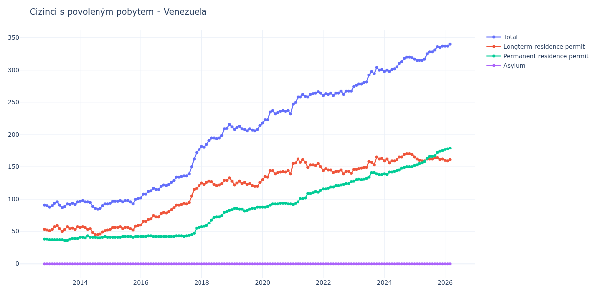

# Venezuela

## Souhrnné statistiky (Min/Max pro rok) / Summary Statistics (Min/Max per year)

| Year   | Total     | Longterm Residence Permit   | Permanent Residence Permit   | Asylum   |
|--------|-----------|-----------------------------|------------------------------|----------|
| 2012   | 90 / 91   | 52 / 53                     | 38 / 38                      | 0 / 0    |
| 2013   | 87 / 96   | 50 / 59                     | 36 / 39                      | 0 / 0    |
| 2014   | 85 / 98   | 45 / 57                     | 40 / 43                      | 0 / 0    |
| 2015   | 93 / 101  | 52 / 59                     | 41 / 42                      | 0 / 0    |
| 2016   | 102 / 123 | 60 / 81                     | 42 / 43                      | 0 / 0    |
| 2017   | 126 / 177 | 84 / 121                    | 42 / 56                      | 0 / 0    |
| 2018   | 181 / 216 | 121 / 133                   | 57 / 83                      | 0 / 0    |
| 2019   | 206 / 214 | 120 / 128                   | 82 / 88                      | 0 / 0    |
| 2020   | 218 / 237 | 130 / 144                   | 88 / 94                      | 0 / 0    |
| 2021   | 247 / 266 | 149 / 162                   | 92 / 114                     | 0 / 0    |
| 2022   | 260 / 267 | 139 / 147                   | 116 / 127                    | 0 / 0    |
| 2023   | 274 / 304 | 146 / 165                   | 128 / 141                    | 0 / 0    |
| 2024   | 298 / 320 | 156 / 170                   | 138 / 150                    | 0 / 0    |
| 2025   | 315 / 337 | 159 / 165                   | 152 / 175                    | 0 / 0    |

## Detailní tabulka / Detailed Data Table

| Date     | Total        | Longterm Residence Permit   | Permanent Residence Permit   | Asylum   |
|----------|--------------|-----------------------------|------------------------------|----------|
| **2012** |              |                             |                              |          |
| 11.2012  | 91           | 53                          | 38                           | 0        |
| 12.2012  | 90 (-1.10%)  | 52 (-1.89%)                 | 38 (+0.00%)                  | 0        |
| **2013** |              |                             |                              |          |
| 01.2013  | 88 (-2.22%)  | 51 (-1.92%)                 | 37 (-2.63%)                  | 0        |
| 02.2013  | 90 (+2.27%)  | 53 (+3.92%)                 | 37 (+0.00%)                  | 0        |
| 03.2013  | 94 (+4.44%)  | 57 (+7.55%)                 | 37 (+0.00%)                  | 0        |
| 04.2013  | 96 (+2.13%)  | 59 (+3.51%)                 | 37 (+0.00%)                  | 0        |
| 05.2013  | 91 (-5.21%)  | 54 (-8.47%)                 | 37 (+0.00%)                  | 0        |
| 06.2013  | 87 (-4.40%)  | 50 (-7.41%)                 | 37 (+0.00%)                  | 0        |
| 07.2013  | 89 (+2.30%)  | 53 (+6.00%)                 | 36 (-2.70%)                  | 0        |
| 08.2013  | 93 (+4.49%)  | 57 (+7.55%)                 | 36 (+0.00%)                  | 0        |
| 09.2013  | 92 (-1.08%)  | 54 (-5.26%)                 | 38 (+5.56%)                  | 0        |
| 10.2013  | 94 (+2.17%)  | 55 (+1.85%)                 | 39 (+2.63%)                  | 0        |
| 11.2013  | 92 (-2.13%)  | 53 (-3.64%)                 | 39 (+0.00%)                  | 0        |
| 12.2013  | 96 (+4.35%)  | 57 (+7.55%)                 | 39 (+0.00%)                  | 0        |
| **2014** |              |                             |                              |          |
| 01.2014  | 97 (+1.04%)  | 56 (-1.75%)                 | 41 (+5.13%)                  | 0        |
| 02.2014  | 98 (+1.03%)  | 57 (+1.79%)                 | 41 (+0.00%)                  | 0        |
| 03.2014  | 96 (-2.04%)  | 56 (-1.75%)                 | 40 (-2.44%)                  | 0        |
| 04.2014  | 96 (+0.00%)  | 53 (-5.36%)                 | 43 (+7.50%)                  | 0        |
| 05.2014  | 95 (-1.04%)  | 54 (+1.89%)                 | 41 (-4.65%)                  | 0        |
| 06.2014  | 89 (-6.32%)  | 48 (-11.11%)                | 41 (+0.00%)                  | 0        |
| 07.2014  | 86 (-3.37%)  | 45 (-6.25%)                 | 41 (+0.00%)                  | 0        |
| 08.2014  | 85 (-1.16%)  | 45 (+0.00%)                 | 40 (-2.44%)                  | 0        |
| 09.2014  | 86 (+1.18%)  | 46 (+2.22%)                 | 40 (+0.00%)                  | 0        |
| 10.2014  | 90 (+4.65%)  | 49 (+6.52%)                 | 41 (+2.50%)                  | 0        |
| 11.2014  | 93 (+3.33%)  | 51 (+4.08%)                 | 42 (+2.44%)                  | 0        |
| 12.2014  | 93 (+0.00%)  | 52 (+1.96%)                 | 41 (-2.38%)                  | 0        |
| **2015** |              |                             |                              |          |
| 01.2015  | 94 (+1.08%)  | 53 (+1.92%)                 | 41 (+0.00%)                  | 0        |
| 02.2015  | 97 (+3.19%)  | 56 (+5.66%)                 | 41 (+0.00%)                  | 0        |
| 03.2015  | 97 (+0.00%)  | 56 (+0.00%)                 | 41 (+0.00%)                  | 0        |
| 04.2015  | 97 (+0.00%)  | 56 (+0.00%)                 | 41 (+0.00%)                  | 0        |
| 05.2015  | 98 (+1.03%)  | 57 (+1.79%)                 | 41 (+0.00%)                  | 0        |
| 06.2015  | 96 (-2.04%)  | 54 (-5.26%)                 | 42 (+2.44%)                  | 0        |
| 07.2015  | 98 (+2.08%)  | 56 (+3.70%)                 | 42 (+0.00%)                  | 0        |
| 08.2015  | 98 (+0.00%)  | 56 (+0.00%)                 | 42 (+0.00%)                  | 0        |
| 09.2015  | 96 (-2.04%)  | 54 (-3.57%)                 | 42 (+0.00%)                  | 0        |
| 10.2015  | 93 (-3.12%)  | 52 (-3.70%)                 | 41 (-2.38%)                  | 0        |
| 11.2015  | 100 (+7.53%) | 58 (+11.54%)                | 42 (+2.44%)                  | 0        |
| 12.2015  | 101 (+1.00%) | 59 (+1.72%)                 | 42 (+0.00%)                  | 0        |
| **2016** |              |                             |                              |          |
| 01.2016  | 102 (+0.99%) | 60 (+1.69%)                 | 42 (+0.00%)                  | 0        |
| 02.2016  | 108 (+5.88%) | 66 (+10.00%)                | 42 (+0.00%)                  | 0        |
| 03.2016  | 108 (+0.00%) | 66 (+0.00%)                 | 42 (+0.00%)                  | 0        |
| 04.2016  | 112 (+3.70%) | 69 (+4.55%)                 | 43 (+2.38%)                  | 0        |
| 05.2016  | 113 (+0.89%) | 70 (+1.45%)                 | 43 (+0.00%)                  | 0        |
| 06.2016  | 117 (+3.54%) | 75 (+7.14%)                 | 42 (-2.33%)                  | 0        |
| 07.2016  | 115 (-1.71%) | 73 (-2.67%)                 | 42 (+0.00%)                  | 0        |
| 08.2016  | 115 (+0.00%) | 73 (+0.00%)                 | 42 (+0.00%)                  | 0        |
| 09.2016  | 120 (+4.35%) | 78 (+6.85%)                 | 42 (+0.00%)                  | 0        |
| 10.2016  | 122 (+1.67%) | 80 (+2.56%)                 | 42 (+0.00%)                  | 0        |
| 11.2016  | 121 (-0.82%) | 79 (-1.25%)                 | 42 (+0.00%)                  | 0        |
| 12.2016  | 123 (+1.65%) | 81 (+2.53%)                 | 42 (+0.00%)                  | 0        |
| **2017** |              |                             |                              |          |
| 01.2017  | 126 (+2.44%) | 84 (+3.70%)                 | 42 (+0.00%)                  | 0        |
| 02.2017  | 129 (+2.38%) | 87 (+3.57%)                 | 42 (+0.00%)                  | 0        |
| 03.2017  | 134 (+3.88%) | 91 (+4.60%)                 | 43 (+2.38%)                  | 0        |
| 04.2017  | 134 (+0.00%) | 91 (+0.00%)                 | 43 (+0.00%)                  | 0        |
| 05.2017  | 135 (+0.75%) | 92 (+1.10%)                 | 43 (+0.00%)                  | 0        |
| 06.2017  | 136 (+0.74%) | 94 (+2.17%)                 | 42 (-2.33%)                  | 0        |
| 07.2017  | 136 (+0.00%) | 93 (-1.06%)                 | 43 (+2.38%)                  | 0        |
| 08.2017  | 139 (+2.21%) | 95 (+2.15%)                 | 44 (+2.33%)                  | 0        |
| 09.2017  | 150 (+7.91%) | 105 (+10.53%)               | 45 (+2.27%)                  | 0        |
| 10.2017  | 162 (+8.00%) | 115 (+9.52%)                | 47 (+4.44%)                  | 0        |
| 11.2017  | 172 (+6.17%) | 117 (+1.74%)                | 55 (+17.02%)                 | 0        |
| 12.2017  | 177 (+2.91%) | 121 (+3.42%)                | 56 (+1.82%)                  | 0        |
| **2018** |              |                             |                              |          |
| 01.2018  | 182 (+2.82%) | 125 (+3.31%)                | 57 (+1.79%)                  | 0        |
| 02.2018  | 181 (-0.55%) | 123 (-1.60%)                | 58 (+1.75%)                  | 0        |
| 03.2018  | 185 (+2.21%) | 126 (+2.44%)                | 59 (+1.72%)                  | 0        |
| 04.2018  | 191 (+3.24%) | 128 (+1.59%)                | 63 (+6.78%)                  | 0        |
| 05.2018  | 195 (+2.09%) | 127 (-0.78%)                | 68 (+7.94%)                  | 0        |
| 06.2018  | 195 (+0.00%) | 123 (-3.15%)                | 72 (+5.88%)                  | 0        |
| 07.2018  | 194 (-0.51%) | 121 (-1.63%)                | 73 (+1.39%)                  | 0        |
| 08.2018  | 195 (+0.52%) | 122 (+0.83%)                | 73 (+0.00%)                  | 0        |
| 09.2018  | 199 (+2.05%) | 124 (+1.64%)                | 75 (+2.74%)                  | 0        |
| 10.2018  | 209 (+5.03%) | 129 (+4.03%)                | 80 (+6.67%)                  | 0        |
| 11.2018  | 210 (+0.48%) | 129 (+0.00%)                | 81 (+1.25%)                  | 0        |
| 12.2018  | 216 (+2.86%) | 133 (+3.10%)                | 83 (+2.47%)                  | 0        |
| **2019** |              |                             |                              |          |
| 01.2019  | 212 (-1.85%) | 128 (-3.76%)                | 84 (+1.20%)                  | 0        |
| 02.2019  | 208 (-1.89%) | 122 (-4.69%)                | 86 (+2.38%)                  | 0        |
| 03.2019  | 211 (+1.44%) | 125 (+2.46%)                | 86 (+0.00%)                  | 0        |
| 04.2019  | 213 (+0.95%) | 128 (+2.40%)                | 85 (-1.16%)                  | 0        |
| 05.2019  | 209 (-1.88%) | 124 (-3.12%)                | 85 (+0.00%)                  | 0        |
| 06.2019  | 208 (-0.48%) | 126 (+1.61%)                | 82 (-3.53%)                  | 0        |
| 07.2019  | 206 (-0.96%) | 123 (-2.38%)                | 83 (+1.22%)                  | 0        |
| 08.2019  | 209 (+1.46%) | 124 (+0.81%)                | 85 (+2.41%)                  | 0        |
| 09.2019  | 207 (-0.96%) | 121 (-2.42%)                | 86 (+1.18%)                  | 0        |
| 10.2019  | 206 (-0.48%) | 120 (-0.83%)                | 86 (+0.00%)                  | 0        |
| 11.2019  | 208 (+0.97%) | 120 (+0.00%)                | 88 (+2.33%)                  | 0        |
| 12.2019  | 214 (+2.88%) | 126 (+5.00%)                | 88 (+0.00%)                  | 0        |
| **2020** |              |                             |                              |          |
| 01.2020  | 218 (+1.87%) | 130 (+3.17%)                | 88 (+0.00%)                  | 0        |
| 02.2020  | 223 (+2.29%) | 135 (+3.85%)                | 88 (+0.00%)                  | 0        |
| 03.2020  | 223 (+0.00%) | 134 (-0.74%)                | 89 (+1.14%)                  | 0        |
| 04.2020  | 235 (+5.38%) | 144 (+7.46%)                | 91 (+2.25%)                  | 0        |
| 05.2020  | 237 (+0.85%) | 144 (+0.00%)                | 93 (+2.20%)                  | 0        |
| 06.2020  | 232 (-2.11%) | 139 (-3.47%)                | 93 (+0.00%)                  | 0        |
| 07.2020  | 234 (+0.86%) | 141 (+1.44%)                | 93 (+0.00%)                  | 0        |
| 08.2020  | 236 (+0.85%) | 142 (+0.71%)                | 94 (+1.08%)                  | 0        |
| 09.2020  | 237 (+0.42%) | 143 (+0.70%)                | 94 (+0.00%)                  | 0        |
| 10.2020  | 236 (-0.42%) | 142 (-0.70%)                | 94 (+0.00%)                  | 0        |
| 11.2020  | 237 (+0.42%) | 144 (+1.41%)                | 93 (-1.06%)                  | 0        |
| 12.2020  | 232 (-2.11%) | 139 (-3.47%)                | 93 (+0.00%)                  | 0        |
| **2021** |              |                             |                              |          |
| 01.2021  | 247 (+6.47%) | 155 (+11.51%)               | 92 (-1.08%)                  | 0        |
| 02.2021  | 250 (+1.21%) | 156 (+0.65%)                | 94 (+2.17%)                  | 0        |
| 03.2021  | 258 (+3.20%) | 162 (+3.85%)                | 96 (+2.13%)                  | 0        |
| 04.2021  | 258 (+0.00%) | 157 (-3.09%)                | 101 (+5.21%)                 | 0        |
| 05.2021  | 262 (+1.55%) | 161 (+2.55%)                | 101 (+0.00%)                 | 0        |
| 06.2021  | 259 (-1.15%) | 157 (-2.48%)                | 102 (+0.99%)                 | 0        |
| 07.2021  | 258 (-0.39%) | 149 (-5.10%)                | 109 (+6.86%)                 | 0        |
| 08.2021  | 262 (+1.55%) | 153 (+2.68%)                | 109 (+0.00%)                 | 0        |
| 09.2021  | 263 (+0.38%) | 153 (+0.00%)                | 110 (+0.92%)                 | 0        |
| 10.2021  | 264 (+0.38%) | 152 (-0.65%)                | 112 (+1.82%)                 | 0        |
| 11.2021  | 266 (+0.76%) | 155 (+1.97%)                | 111 (-0.89%)                 | 0        |
| 12.2021  | 264 (-0.75%) | 150 (-3.23%)                | 114 (+2.70%)                 | 0        |
| **2022** |              |                             |                              |          |
| 01.2022  | 260 (-1.52%) | 144 (-4.00%)                | 116 (+1.75%)                 | 0        |
| 02.2022  | 263 (+1.15%) | 147 (+2.08%)                | 116 (+0.00%)                 | 0        |
| 03.2022  | 262 (-0.38%) | 145 (-1.36%)                | 117 (+0.86%)                 | 0        |
| 04.2022  | 264 (+0.76%) | 145 (+0.00%)                | 119 (+1.71%)                 | 0        |
| 05.2022  | 260 (-1.52%) | 141 (-2.76%)                | 119 (+0.00%)                 | 0        |
| 06.2022  | 264 (+1.54%) | 143 (+1.42%)                | 121 (+1.68%)                 | 0        |
| 07.2022  | 264 (+0.00%) | 143 (+0.00%)                | 121 (+0.00%)                 | 0        |
| 08.2022  | 267 (+1.14%) | 145 (+1.40%)                | 122 (+0.83%)                 | 0        |
| 09.2022  | 262 (-1.87%) | 139 (-4.14%)                | 123 (+0.82%)                 | 0        |
| 10.2022  | 267 (+1.91%) | 143 (+2.88%)                | 124 (+0.81%)                 | 0        |
| 11.2022  | 267 (+0.00%) | 143 (+0.00%)                | 124 (+0.00%)                 | 0        |
| 12.2022  | 267 (+0.00%) | 140 (-2.10%)                | 127 (+2.42%)                 | 0        |
| **2023** |              |                             |                              |          |
| 01.2023  | 274 (+2.62%) | 146 (+4.29%)                | 128 (+0.79%)                 | 0        |
| 02.2023  | 276 (+0.73%) | 146 (+0.00%)                | 130 (+1.56%)                 | 0        |
| 03.2023  | 278 (+0.72%) | 147 (+0.68%)                | 131 (+0.77%)                 | 0        |
| 04.2023  | 278 (+0.00%) | 148 (+0.68%)                | 130 (-0.76%)                 | 0        |
| 05.2023  | 280 (+0.72%) | 149 (+0.68%)                | 131 (+0.77%)                 | 0        |
| 06.2023  | 281 (+0.36%) | 149 (+0.00%)                | 132 (+0.76%)                 | 0        |
| 07.2023  | 292 (+3.91%) | 158 (+6.04%)                | 134 (+1.52%)                 | 0        |
| 08.2023  | 298 (+2.05%) | 157 (-0.63%)                | 141 (+5.22%)                 | 0        |
| 09.2023  | 294 (-1.34%) | 153 (-2.55%)                | 141 (+0.00%)                 | 0        |
| 10.2023  | 304 (+3.40%) | 165 (+7.84%)                | 139 (-1.42%)                 | 0        |
| 11.2023  | 300 (-1.32%) | 162 (-1.82%)                | 138 (-0.72%)                 | 0        |
| 12.2023  | 301 (+0.33%) | 163 (+0.62%)                | 138 (+0.00%)                 | 0        |
| **2024** |              |                             |                              |          |
| 01.2024  | 298 (-1.00%) | 159 (-2.45%)                | 139 (+0.72%)                 | 0        |
| 02.2024  | 300 (+0.67%) | 162 (+1.89%)                | 138 (-0.72%)                 | 0        |
| 03.2024  | 298 (-0.67%) | 156 (-3.70%)                | 142 (+2.90%)                 | 0        |
| 04.2024  | 301 (+1.01%) | 159 (+1.92%)                | 142 (+0.00%)                 | 0        |
| 05.2024  | 302 (+0.33%) | 159 (+0.00%)                | 143 (+0.70%)                 | 0        |
| 06.2024  | 305 (+0.99%) | 161 (+1.26%)                | 144 (+0.70%)                 | 0        |
| 07.2024  | 310 (+1.64%) | 165 (+2.48%)                | 145 (+0.69%)                 | 0        |
| 08.2024  | 313 (+0.97%) | 165 (+0.00%)                | 148 (+2.07%)                 | 0        |
| 09.2024  | 318 (+1.60%) | 169 (+2.42%)                | 149 (+0.68%)                 | 0        |
| 10.2024  | 320 (+0.63%) | 170 (+0.59%)                | 150 (+0.67%)                 | 0        |
| 11.2024  | 320 (+0.00%) | 170 (+0.00%)                | 150 (+0.00%)                 | 0        |
| 12.2024  | 319 (-0.31%) | 169 (-0.59%)                | 150 (+0.00%)                 | 0        |
| **2025** |              |                             |                              |          |
| 01.2025  | 317 (-0.63%) | 165 (-2.37%)                | 152 (+1.33%)                 | 0        |
| 02.2025  | 315 (-0.63%) | 162 (-1.82%)                | 153 (+0.66%)                 | 0        |
| 03.2025  | 315 (+0.00%) | 160 (-1.23%)                | 155 (+1.31%)                 | 0        |
| 04.2025  | 315 (+0.00%) | 159 (-0.62%)                | 156 (+0.65%)                 | 0        |
| 05.2025  | 317 (+0.63%) | 159 (+0.00%)                | 158 (+1.28%)                 | 0        |
| 06.2025  | 325 (+2.52%) | 162 (+1.89%)                | 163 (+3.16%)                 | 0        |
| 07.2025  | 328 (+0.92%) | 162 (+0.00%)                | 166 (+1.84%)                 | 0        |
| 08.2025  | 328 (+0.00%) | 162 (+0.00%)                | 166 (+0.00%)                 | 0        |
| 09.2025  | 331 (+0.91%) | 164 (+1.23%)                | 167 (+0.60%)                 | 0        |
| 10.2025  | 336 (+1.51%) | 164 (+0.00%)                | 172 (+2.99%)                 | 0        |
| 11.2025  | 335 (-0.30%) | 161 (-1.83%)                | 174 (+1.16%)                 | 0        |
| 12.2025  | 337 (+0.60%) | 162 (+0.62%)                | 175 (+0.57%)                 | 0        |
