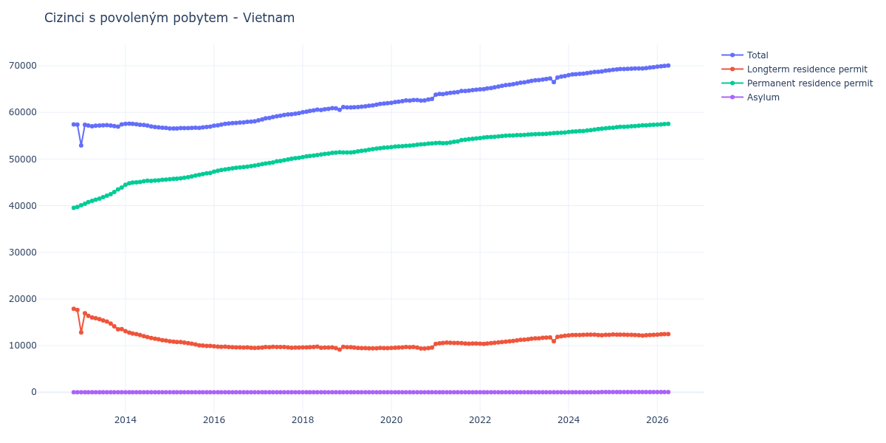

# Vietnam

## Souhrnné statistiky (Min/Max pro rok) / Summary Statistics (Min/Max per year)

| Year   | Total           | Longterm Residence Permit   | Permanent Residence Permit   | Asylum   |
|--------|-----------------|-----------------------------|------------------------------|----------|
| 2012   | 57 360 / 57 411 | 17 638 / 17 901             | 39 510 / 39 722              | 0 / 0    |
| 2013   | 52 897 / 57 406 | 12 826 / 16 919             | 40 071 / 43 875              | 0 / 0    |
| 2014   | 56 666 / 57 579 | 11 084 / 13 084             | 44 467 / 45 582              | 0 / 0    |
| 2015   | 56 556 / 56 958 | 9 925 / 10 915              | 45 646 / 47 019              | 0 / 0    |
| 2016   | 57 130 / 58 080 | 9 509 / 9 859               | 47 271 / 48 571              | 0 / 0    |
| 2017   | 58 276 / 59 808 | 9 533 / 9 734               | 48 743 / 50 249              | 0 / 0    |
| 2018   | 60 016 / 61 143 | 9 130 / 9 759               | 50 413 / 51 427              | 0 / 0    |
| 2019   | 61 056 / 61 952 | 9 414 / 9 663               | 51 393 / 52 478              | 0 / 0    |
| 2020   | 62 044 / 62 884 | 9 366 / 9 701               | 52 557 / 53 320              | 0 / 0    |
| 2021   | 63 778 / 64 851 | 10 363 / 10 638             | 53 359 / 54 390              | 0 / 0    |
| 2022   | 64 920 / 66 340 | 10 379 / 11 235             | 54 497 / 55 105              | 0 / 0    |
| 2023   | 66 427 / 67 783 | 10 916 / 12 106             | 55 150 / 55 677              | 0 / 0    |
| 2024   | 67 966 / 69 015 | 12 172 / 12 341             | 55 794 / 56 644              | 0 / 49   |
| 2025   | 69 117 / 69 685 | 12 159 / 12 368             | 56 701 / 57 324              | 40 / 48  |
| 2026   | 69 786 / 70 036 | 12 362 / 12 478             | 57 384 / 57 518              | 40 / 40  |

## Detailní tabulka / Detailed Data Table

| Date     | Total           | Longterm Residence Permit   | Permanent Residence Permit   | Asylum       |
|----------|-----------------|-----------------------------|------------------------------|--------------|
| **2012** |                 |                             |                              |              |
| 11.2012  | 57 411          | 17 901                      | 39 510                       | 0            |
| 12.2012  | 57 360 (-0.09%) | 17 638 (-1.47%)             | 39 722 (+0.54%)              | 0            |
| **2013** |                 |                             |                              |              |
| 01.2013  | 52 897 (-7.78%) | 12 826 (-27.28%)            | 40 071 (+0.88%)              | 0            |
| 02.2013  | 57 335 (+8.39%) | 16 919 (+31.91%)            | 40 416 (+0.86%)              | 0            |
| 03.2013  | 57 159 (-0.31%) | 16 388 (-3.14%)             | 40 771 (+0.88%)              | 0            |
| 04.2013  | 57 026 (-0.23%) | 16 010 (-2.31%)             | 41 016 (+0.60%)              | 0            |
| 05.2013  | 57 141 (+0.20%) | 15 871 (-0.87%)             | 41 270 (+0.62%)              | 0            |
| 06.2013  | 57 187 (+0.08%) | 15 671 (-1.26%)             | 41 516 (+0.60%)              | 0            |
| 07.2013  | 57 206 (+0.03%) | 15 396 (-1.75%)             | 41 810 (+0.71%)              | 0            |
| 08.2013  | 57 274 (+0.12%) | 15 146 (-1.62%)             | 42 128 (+0.76%)              | 0            |
| 09.2013  | 57 177 (-0.17%) | 14 704 (-2.92%)             | 42 473 (+0.82%)              | 0            |
| 10.2013  | 57 053 (-0.22%) | 14 118 (-3.99%)             | 42 935 (+1.09%)              | 0            |
| 11.2013  | 56 945 (-0.19%) | 13 479 (-4.53%)             | 43 466 (+1.24%)              | 0            |
| 12.2013  | 57 406 (+0.81%) | 13 531 (+0.39%)             | 43 875 (+0.94%)              | 0            |
| **2014** |                 |                             |                              |              |
| 01.2014  | 57 551 (+0.25%) | 13 084 (-3.30%)             | 44 467 (+1.35%)              | 0            |
| 02.2014  | 57 579 (+0.05%) | 12 769 (-2.41%)             | 44 810 (+0.77%)              | 0            |
| 03.2014  | 57 544 (-0.06%) | 12 588 (-1.42%)             | 44 956 (+0.33%)              | 0            |
| 04.2014  | 57 451 (-0.16%) | 12 445 (-1.14%)             | 45 006 (+0.11%)              | 0            |
| 05.2014  | 57 338 (-0.20%) | 12 256 (-1.52%)             | 45 082 (+0.17%)              | 0            |
| 06.2014  | 57 289 (-0.09%) | 12 048 (-1.70%)             | 45 241 (+0.35%)              | 0            |
| 07.2014  | 57 170 (-0.21%) | 11 836 (-1.76%)             | 45 334 (+0.21%)              | 0            |
| 08.2014  | 56 962 (-0.36%) | 11 650 (-1.57%)             | 45 312 (-0.05%)              | 0            |
| 09.2014  | 56 855 (-0.19%) | 11 474 (-1.51%)             | 45 381 (+0.15%)              | 0            |
| 10.2014  | 56 769 (-0.15%) | 11 341 (-1.16%)             | 45 428 (+0.10%)              | 0            |
| 11.2014  | 56 703 (-0.12%) | 11 177 (-1.45%)             | 45 526 (+0.22%)              | 0            |
| 12.2014  | 56 666 (-0.07%) | 11 084 (-0.83%)             | 45 582 (+0.12%)              | 0            |
| **2015** |                 |                             |                              |              |
| 01.2015  | 56 561 (-0.19%) | 10 915 (-1.52%)             | 45 646 (+0.14%)              | 0            |
| 02.2015  | 56 556 (-0.01%) | 10 825 (-0.82%)             | 45 731 (+0.19%)              | 0            |
| 03.2015  | 56 559 (+0.01%) | 10 760 (-0.60%)             | 45 799 (+0.15%)              | 0            |
| 04.2015  | 56 610 (+0.09%) | 10 755 (-0.05%)             | 45 855 (+0.12%)              | 0            |
| 05.2015  | 56 606 (-0.01%) | 10 637 (-1.10%)             | 45 969 (+0.25%)              | 0            |
| 06.2015  | 56 623 (+0.03%) | 10 515 (-1.15%)             | 46 108 (+0.30%)              | 0            |
| 07.2015  | 56 665 (+0.07%) | 10 395 (-1.14%)             | 46 270 (+0.35%)              | 0            |
| 08.2015  | 56 695 (+0.05%) | 10 234 (-1.55%)             | 46 461 (+0.41%)              | 0            |
| 09.2015  | 56 659 (-0.06%) | 10 067 (-1.63%)             | 46 592 (+0.28%)              | 0            |
| 10.2015  | 56 781 (+0.22%) | 10 024 (-0.43%)             | 46 757 (+0.35%)              | 0            |
| 11.2015  | 56 857 (+0.13%) | 9 925 (-0.99%)              | 46 932 (+0.37%)              | 0            |
| 12.2015  | 56 958 (+0.18%) | 9 939 (+0.14%)              | 47 019 (+0.19%)              | 0            |
| **2016** |                 |                             |                              |              |
| 01.2016  | 57 130 (+0.30%) | 9 859 (-0.80%)              | 47 271 (+0.54%)              | 0            |
| 02.2016  | 57 226 (+0.17%) | 9 755 (-1.05%)              | 47 471 (+0.42%)              | 0            |
| 03.2016  | 57 389 (+0.28%) | 9 730 (-0.26%)              | 47 659 (+0.40%)              | 0            |
| 04.2016  | 57 529 (+0.24%) | 9 757 (+0.28%)              | 47 772 (+0.24%)              | 0            |
| 05.2016  | 57 602 (+0.13%) | 9 714 (-0.44%)              | 47 888 (+0.24%)              | 0            |
| 06.2016  | 57 680 (+0.14%) | 9 672 (-0.43%)              | 48 008 (+0.25%)              | 0            |
| 07.2016  | 57 741 (+0.11%) | 9 620 (-0.54%)              | 48 121 (+0.24%)              | 0            |
| 08.2016  | 57 806 (+0.11%) | 9 604 (-0.17%)              | 48 202 (+0.17%)              | 0            |
| 09.2016  | 57 841 (+0.06%) | 9 575 (-0.30%)              | 48 266 (+0.13%)              | 0            |
| 10.2016  | 57 958 (+0.20%) | 9 607 (+0.33%)              | 48 351 (+0.18%)              | 0            |
| 11.2016  | 58 014 (+0.10%) | 9 540 (-0.70%)              | 48 474 (+0.25%)              | 0            |
| 12.2016  | 58 080 (+0.11%) | 9 509 (-0.32%)              | 48 571 (+0.20%)              | 0            |
| **2017** |                 |                             |                              |              |
| 01.2017  | 58 276 (+0.34%) | 9 533 (+0.25%)              | 48 743 (+0.35%)              | 0            |
| 02.2017  | 58 497 (+0.38%) | 9 577 (+0.46%)              | 48 920 (+0.36%)              | 0            |
| 03.2017  | 58 716 (+0.37%) | 9 677 (+1.04%)              | 49 039 (+0.24%)              | 0            |
| 04.2017  | 58 792 (+0.13%) | 9 650 (-0.28%)              | 49 142 (+0.21%)              | 0            |
| 05.2017  | 58 991 (+0.34%) | 9 734 (+0.87%)              | 49 257 (+0.23%)              | 0            |
| 06.2017  | 59 163 (+0.29%) | 9 682 (-0.53%)              | 49 481 (+0.45%)              | 0            |
| 07.2017  | 59 279 (+0.20%) | 9 683 (+0.01%)              | 49 596 (+0.23%)              | 0            |
| 08.2017  | 59 432 (+0.26%) | 9 690 (+0.07%)              | 49 742 (+0.29%)              | 0            |
| 09.2017  | 59 534 (+0.17%) | 9 626 (-0.66%)              | 49 908 (+0.33%)              | 0            |
| 10.2017  | 59 582 (+0.08%) | 9 534 (-0.96%)              | 50 048 (+0.28%)              | 0            |
| 11.2017  | 59 727 (+0.24%) | 9 563 (+0.30%)              | 50 164 (+0.23%)              | 0            |
| 12.2017  | 59 808 (+0.14%) | 9 559 (-0.04%)              | 50 249 (+0.17%)              | 0            |
| **2018** |                 |                             |                              |              |
| 01.2018  | 60 016 (+0.35%) | 9 603 (+0.46%)              | 50 413 (+0.33%)              | 0            |
| 02.2018  | 60 154 (+0.23%) | 9 599 (-0.04%)              | 50 555 (+0.28%)              | 0            |
| 03.2018  | 60 296 (+0.24%) | 9 656 (+0.59%)              | 50 640 (+0.17%)              | 0            |
| 04.2018  | 60 413 (+0.19%) | 9 701 (+0.47%)              | 50 712 (+0.14%)              | 0            |
| 05.2018  | 60 594 (+0.30%) | 9 759 (+0.60%)              | 50 835 (+0.24%)              | 0            |
| 06.2018  | 60 506 (-0.15%) | 9 543 (-2.21%)              | 50 963 (+0.25%)              | 0            |
| 07.2018  | 60 640 (+0.22%) | 9 567 (+0.25%)              | 51 073 (+0.22%)              | 0            |
| 08.2018  | 60 745 (+0.17%) | 9 567 (+0.00%)              | 51 178 (+0.21%)              | 0            |
| 09.2018  | 60 913 (+0.28%) | 9 607 (+0.42%)              | 51 306 (+0.25%)              | 0            |
| 10.2018  | 60 853 (-0.10%) | 9 474 (-1.38%)              | 51 379 (+0.14%)              | 0            |
| 11.2018  | 60 557 (-0.49%) | 9 130 (-3.63%)              | 51 427 (+0.09%)              | 0            |
| 12.2018  | 61 143 (+0.97%) | 9 738 (+6.66%)              | 51 405 (-0.04%)              | 0            |
| **2019** |                 |                             |                              |              |
| 01.2019  | 61 056 (-0.14%) | 9 663 (-0.77%)              | 51 393 (-0.02%)              | 0            |
| 02.2019  | 61 063 (+0.01%) | 9 646 (-0.18%)              | 51 417 (+0.05%)              | 0            |
| 03.2019  | 61 086 (+0.04%) | 9 590 (-0.58%)              | 51 496 (+0.15%)              | 0            |
| 04.2019  | 61 131 (+0.07%) | 9 488 (-1.06%)              | 51 643 (+0.29%)              | 0            |
| 05.2019  | 61 200 (+0.11%) | 9 464 (-0.25%)              | 51 736 (+0.18%)              | 0            |
| 06.2019  | 61 297 (+0.16%) | 9 457 (-0.07%)              | 51 840 (+0.20%)              | 0            |
| 07.2019  | 61 421 (+0.20%) | 9 436 (-0.22%)              | 51 985 (+0.28%)              | 0            |
| 08.2019  | 61 507 (+0.14%) | 9 414 (-0.23%)              | 52 093 (+0.21%)              | 0            |
| 09.2019  | 61 638 (+0.21%) | 9 422 (+0.08%)              | 52 216 (+0.24%)              | 0            |
| 10.2019  | 61 802 (+0.27%) | 9 479 (+0.60%)              | 52 323 (+0.20%)              | 0            |
| 11.2019  | 61 876 (+0.12%) | 9 462 (-0.18%)              | 52 414 (+0.17%)              | 0            |
| 12.2019  | 61 952 (+0.12%) | 9 474 (+0.13%)              | 52 478 (+0.12%)              | 0            |
| **2020** |                 |                             |                              |              |
| 01.2020  | 62 044 (+0.15%) | 9 487 (+0.14%)              | 52 557 (+0.15%)              | 0            |
| 02.2020  | 62 203 (+0.26%) | 9 546 (+0.62%)              | 52 657 (+0.19%)              | 0            |
| 03.2020  | 62 290 (+0.14%) | 9 579 (+0.35%)              | 52 711 (+0.10%)              | 0            |
| 04.2020  | 62 387 (+0.16%) | 9 628 (+0.51%)              | 52 759 (+0.09%)              | 0            |
| 05.2020  | 62 544 (+0.25%) | 9 701 (+0.76%)              | 52 843 (+0.16%)              | 0            |
| 06.2020  | 62 525 (-0.03%) | 9 657 (-0.45%)              | 52 868 (+0.05%)              | 0            |
| 07.2020  | 62 637 (+0.18%) | 9 685 (+0.29%)              | 52 952 (+0.16%)              | 0            |
| 08.2020  | 62 634 (-0.00%) | 9 587 (-1.01%)              | 53 047 (+0.18%)              | 0            |
| 09.2020  | 62 523 (-0.18%) | 9 382 (-2.14%)              | 53 141 (+0.18%)              | 0            |
| 10.2020  | 62 552 (+0.05%) | 9 366 (-0.17%)              | 53 186 (+0.08%)              | 0            |
| 11.2020  | 62 755 (+0.32%) | 9 470 (+1.11%)              | 53 285 (+0.19%)              | 0            |
| 12.2020  | 62 884 (+0.21%) | 9 564 (+0.99%)              | 53 320 (+0.07%)              | 0            |
| **2021** |                 |                             |                              |              |
| 01.2021  | 63 778 (+1.42%) | 10 363 (+8.35%)             | 53 415 (+0.18%)              | 0            |
| 02.2021  | 63 946 (+0.26%) | 10 475 (+1.08%)             | 53 471 (+0.10%)              | 0            |
| 03.2021  | 63 921 (-0.04%) | 10 562 (+0.83%)             | 53 359 (-0.21%)              | 0            |
| 04.2021  | 64 074 (+0.24%) | 10 638 (+0.72%)             | 53 436 (+0.14%)              | 0            |
| 05.2021  | 64 161 (+0.14%) | 10 610 (-0.26%)             | 53 551 (+0.22%)              | 0            |
| 06.2021  | 64 261 (+0.16%) | 10 574 (-0.34%)             | 53 687 (+0.25%)              | 0            |
| 07.2021  | 64 319 (+0.09%) | 10 554 (-0.19%)             | 53 765 (+0.15%)              | 0            |
| 08.2021  | 64 581 (+0.41%) | 10 517 (-0.35%)             | 54 064 (+0.56%)              | 0            |
| 09.2021  | 64 576 (-0.01%) | 10 443 (-0.70%)             | 54 133 (+0.13%)              | 0            |
| 10.2021  | 64 661 (+0.13%) | 10 400 (-0.41%)             | 54 261 (+0.24%)              | 0            |
| 11.2021  | 64 779 (+0.18%) | 10 439 (+0.37%)             | 54 340 (+0.15%)              | 0            |
| 12.2021  | 64 851 (+0.11%) | 10 461 (+0.21%)             | 54 390 (+0.09%)              | 0            |
| **2022** |                 |                             |                              |              |
| 01.2022  | 64 920 (+0.11%) | 10 423 (-0.36%)             | 54 497 (+0.20%)              | 0            |
| 02.2022  | 64 974 (+0.08%) | 10 379 (-0.42%)             | 54 595 (+0.18%)              | 0            |
| 03.2022  | 65 130 (+0.24%) | 10 450 (+0.68%)             | 54 680 (+0.16%)              | 0            |
| 04.2022  | 65 217 (+0.13%) | 10 508 (+0.56%)             | 54 709 (+0.05%)              | 0            |
| 05.2022  | 65 368 (+0.23%) | 10 587 (+0.75%)             | 54 781 (+0.13%)              | 0            |
| 06.2022  | 65 527 (+0.24%) | 10 682 (+0.90%)             | 54 845 (+0.12%)              | 0            |
| 07.2022  | 65 689 (+0.25%) | 10 766 (+0.79%)             | 54 923 (+0.14%)              | 0            |
| 08.2022  | 65 856 (+0.25%) | 10 860 (+0.87%)             | 54 996 (+0.13%)              | 0            |
| 09.2022  | 65 938 (+0.12%) | 10 917 (+0.52%)             | 55 021 (+0.05%)              | 0            |
| 10.2022  | 66 054 (+0.18%) | 10 995 (+0.71%)             | 55 059 (+0.07%)              | 0            |
| 11.2022  | 66 211 (+0.24%) | 11 112 (+1.06%)             | 55 099 (+0.07%)              | 0            |
| 12.2022  | 66 340 (+0.19%) | 11 235 (+1.11%)             | 55 105 (+0.01%)              | 0            |
| **2023** |                 |                             |                              |              |
| 01.2023  | 66 427 (+0.13%) | 11 277 (+0.37%)             | 55 150 (+0.08%)              | 0            |
| 02.2023  | 66 605 (+0.27%) | 11 375 (+0.87%)             | 55 230 (+0.15%)              | 0            |
| 03.2023  | 66 751 (+0.22%) | 11 480 (+0.92%)             | 55 271 (+0.07%)              | 0            |
| 04.2023  | 66 869 (+0.18%) | 11 566 (+0.75%)             | 55 303 (+0.06%)              | 0            |
| 05.2023  | 66 928 (+0.09%) | 11 571 (+0.04%)             | 55 357 (+0.10%)              | 0            |
| 06.2023  | 67 047 (+0.18%) | 11 675 (+0.90%)             | 55 372 (+0.03%)              | 0            |
| 07.2023  | 67 136 (+0.13%) | 11 722 (+0.40%)             | 55 414 (+0.08%)              | 0            |
| 08.2023  | 67 247 (+0.17%) | 11 762 (+0.34%)             | 55 485 (+0.13%)              | 0            |
| 09.2023  | 66 471 (-1.15%) | 10 916 (-7.19%)             | 55 555 (+0.13%)              | 0            |
| 10.2023  | 67 475 (+1.51%) | 11 874 (+8.78%)             | 55 601 (+0.08%)              | 0            |
| 11.2023  | 67 653 (+0.26%) | 12 006 (+1.11%)             | 55 647 (+0.08%)              | 0            |
| 12.2023  | 67 783 (+0.19%) | 12 106 (+0.83%)             | 55 677 (+0.05%)              | 0            |
| **2024** |                 |                             |                              |              |
| 01.2024  | 67 966 (+0.27%) | 12 172 (+0.55%)             | 55 794 (+0.21%)              | 0            |
| 02.2024  | 68 147 (+0.27%) | 12 280 (+0.89%)             | 55 867 (+0.13%)              | 0            |
| 03.2024  | 68 181 (+0.05%) | 12 282 (+0.02%)             | 55 899 (+0.06%)              | 0            |
| 04.2024  | 68 266 (+0.12%) | 12 279 (-0.02%)             | 55 987 (+0.16%)              | 0            |
| 05.2024  | 68 311 (+0.07%) | 12 325 (+0.37%)             | 55 986 (-0.00%)              | 0            |
| 06.2024  | 68 431 (+0.18%) | 12 341 (+0.13%)             | 56 090 (+0.19%)              | 0            |
| 07.2024  | 68 538 (+0.16%) | 12 338 (-0.02%)             | 56 200 (+0.20%)              | 0            |
| 08.2024  | 68 649 (+0.16%) | 12 328 (-0.08%)             | 56 321 (+0.22%)              | 0            |
| 09.2024  | 68 679 (+0.04%) | 12 264 (-0.52%)             | 56 415 (+0.17%)              | 0            |
| 10.2024  | 68 778 (+0.14%) | 12 228 (-0.29%)             | 56 501 (+0.15%)              | 49           |
| 11.2024  | 68 941 (+0.24%) | 12 293 (+0.53%)             | 56 599 (+0.17%)              | 49 (+0.00%)  |
| 12.2024  | 69 015 (+0.11%) | 12 323 (+0.24%)             | 56 644 (+0.08%)              | 48 (-2.04%)  |
| **2025** |                 |                             |                              |              |
| 01.2025  | 69 117 (+0.15%) | 12 368 (+0.37%)             | 56 701 (+0.10%)              | 48 (+0.00%)  |
| 02.2025  | 69 215 (+0.14%) | 12 364 (-0.03%)             | 56 803 (+0.18%)              | 48 (+0.00%)  |
| 03.2025  | 69 281 (+0.10%) | 12 359 (-0.04%)             | 56 880 (+0.14%)              | 42 (-12.50%) |
| 04.2025  | 69 292 (+0.02%) | 12 330 (-0.23%)             | 56 919 (+0.07%)              | 43 (+2.38%)  |
| 05.2025  | 69 309 (+0.02%) | 12 310 (-0.16%)             | 56 956 (+0.07%)              | 43 (+0.00%)  |
| 06.2025  | 69 348 (+0.06%) | 12 300 (-0.08%)             | 57 005 (+0.09%)              | 43 (+0.00%)  |
| 07.2025  | 69 397 (+0.07%) | 12 284 (-0.13%)             | 57 069 (+0.11%)              | 44 (+2.33%)  |
| 08.2025  | 69 419 (+0.03%) | 12 231 (-0.43%)             | 57 144 (+0.13%)              | 44 (+0.00%)  |
| 09.2025  | 69 413 (-0.01%) | 12 159 (-0.59%)             | 57 209 (+0.11%)              | 45 (+2.27%)  |
| 10.2025  | 69 486 (+0.11%) | 12 214 (+0.45%)             | 57 229 (+0.03%)              | 43 (-4.44%)  |
| 11.2025  | 69 594 (+0.16%) | 12 260 (+0.38%)             | 57 294 (+0.11%)              | 40 (-6.98%)  |
| 12.2025  | 69 685 (+0.13%) | 12 321 (+0.50%)             | 57 324 (+0.05%)              | 40 (+0.00%)  |
| **2026** |                 |                             |                              |              |
| 01.2026  | 69 786 (+0.14%) | 12 362 (+0.33%)             | 57 384 (+0.10%)              | 40 (+0.00%)  |
| 02.2026  | 69 890 (+0.15%) | 12 429 (+0.54%)             | 57 421 (+0.06%)              | 40 (+0.00%)  |
| 03.2026  | 69 966 (+0.11%) | 12 452 (+0.19%)             | 57 474 (+0.09%)              | 40 (+0.00%)  |
| 04.2026  | 70 036 (+0.10%) | 12 478 (+0.21%)             | 57 518 (+0.08%)              | 40 (+0.00%)  |
