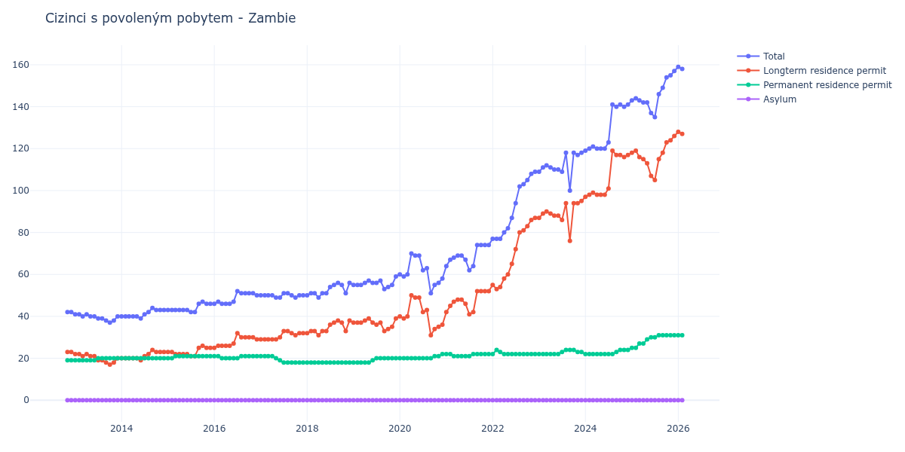

# Zambie

## Souhrnné statistiky (Min/Max pro rok) / Summary Statistics (Min/Max per year)

| Year   | Total     | Longterm Residence Permit   | Permanent Residence Permit   | Asylum   |
|--------|-----------|-----------------------------|------------------------------|----------|
| 2012   | 42 / 42   | 23 / 23                     | 19 / 19                      | 0 / 0    |
| 2013   | 37 / 41   | 17 / 22                     | 19 / 20                      | 0 / 0    |
| 2014   | 39 / 44   | 19 / 24                     | 20 / 20                      | 0 / 0    |
| 2015   | 42 / 47   | 21 / 26                     | 20 / 21                      | 0 / 0    |
| 2016   | 46 / 52   | 25 / 32                     | 20 / 21                      | 0 / 0    |
| 2017   | 49 / 51   | 29 / 33                     | 18 / 21                      | 0 / 0    |
| 2018   | 49 / 56   | 31 / 38                     | 18 / 18                      | 0 / 0    |
| 2019   | 53 / 59   | 33 / 39                     | 18 / 20                      | 0 / 0    |
| 2020   | 51 / 70   | 31 / 50                     | 20 / 22                      | 0 / 0    |
| 2021   | 62 / 74   | 41 / 52                     | 21 / 22                      | 0 / 0    |
| 2022   | 77 / 109  | 53 / 87                     | 22 / 24                      | 0 / 0    |
| 2023   | 100 / 118 | 76 / 95                     | 22 / 24                      | 0 / 0    |
| 2024   | 119 / 141 | 97 / 119                    | 22 / 24                      | 0 / 0    |
| 2025   | 135 / 157 | 105 / 126                   | 25 / 31                      | 0 / 0    |
| 2026   | 158 / 159 | 127 / 128                   | 31 / 31                      | 0 / 0    |

## Detailní tabulka / Detailed Data Table

| Date     | Total         | Longterm Residence Permit   | Permanent Residence Permit   | Asylum   |
|----------|---------------|-----------------------------|------------------------------|----------|
| **2012** |               |                             |                              |          |
| 11.2012  | 42            | 23                          | 19                           | 0        |
| 12.2012  | 42 (+0.00%)   | 23 (+0.00%)                 | 19 (+0.00%)                  | 0        |
| **2013** |               |                             |                              |          |
| 01.2013  | 41 (-2.38%)   | 22 (-4.35%)                 | 19 (+0.00%)                  | 0        |
| 02.2013  | 41 (+0.00%)   | 22 (+0.00%)                 | 19 (+0.00%)                  | 0        |
| 03.2013  | 40 (-2.44%)   | 21 (-4.55%)                 | 19 (+0.00%)                  | 0        |
| 04.2013  | 41 (+2.50%)   | 22 (+4.76%)                 | 19 (+0.00%)                  | 0        |
| 05.2013  | 40 (-2.44%)   | 21 (-4.55%)                 | 19 (+0.00%)                  | 0        |
| 06.2013  | 40 (+0.00%)   | 21 (+0.00%)                 | 19 (+0.00%)                  | 0        |
| 07.2013  | 39 (-2.50%)   | 19 (-9.52%)                 | 20 (+5.26%)                  | 0        |
| 08.2013  | 39 (+0.00%)   | 19 (+0.00%)                 | 20 (+0.00%)                  | 0        |
| 09.2013  | 38 (-2.56%)   | 18 (-5.26%)                 | 20 (+0.00%)                  | 0        |
| 10.2013  | 37 (-2.63%)   | 17 (-5.56%)                 | 20 (+0.00%)                  | 0        |
| 11.2013  | 38 (+2.70%)   | 18 (+5.88%)                 | 20 (+0.00%)                  | 0        |
| 12.2013  | 40 (+5.26%)   | 20 (+11.11%)                | 20 (+0.00%)                  | 0        |
| **2014** |               |                             |                              |          |
| 01.2014  | 40 (+0.00%)   | 20 (+0.00%)                 | 20 (+0.00%)                  | 0        |
| 02.2014  | 40 (+0.00%)   | 20 (+0.00%)                 | 20 (+0.00%)                  | 0        |
| 03.2014  | 40 (+0.00%)   | 20 (+0.00%)                 | 20 (+0.00%)                  | 0        |
| 04.2014  | 40 (+0.00%)   | 20 (+0.00%)                 | 20 (+0.00%)                  | 0        |
| 05.2014  | 40 (+0.00%)   | 20 (+0.00%)                 | 20 (+0.00%)                  | 0        |
| 06.2014  | 39 (-2.50%)   | 19 (-5.00%)                 | 20 (+0.00%)                  | 0        |
| 07.2014  | 41 (+5.13%)   | 21 (+10.53%)                | 20 (+0.00%)                  | 0        |
| 08.2014  | 42 (+2.44%)   | 22 (+4.76%)                 | 20 (+0.00%)                  | 0        |
| 09.2014  | 44 (+4.76%)   | 24 (+9.09%)                 | 20 (+0.00%)                  | 0        |
| 10.2014  | 43 (-2.27%)   | 23 (-4.17%)                 | 20 (+0.00%)                  | 0        |
| 11.2014  | 43 (+0.00%)   | 23 (+0.00%)                 | 20 (+0.00%)                  | 0        |
| 12.2014  | 43 (+0.00%)   | 23 (+0.00%)                 | 20 (+0.00%)                  | 0        |
| **2015** |               |                             |                              |          |
| 01.2015  | 43 (+0.00%)   | 23 (+0.00%)                 | 20 (+0.00%)                  | 0        |
| 02.2015  | 43 (+0.00%)   | 23 (+0.00%)                 | 20 (+0.00%)                  | 0        |
| 03.2015  | 43 (+0.00%)   | 22 (-4.35%)                 | 21 (+5.00%)                  | 0        |
| 04.2015  | 43 (+0.00%)   | 22 (+0.00%)                 | 21 (+0.00%)                  | 0        |
| 05.2015  | 43 (+0.00%)   | 22 (+0.00%)                 | 21 (+0.00%)                  | 0        |
| 06.2015  | 43 (+0.00%)   | 22 (+0.00%)                 | 21 (+0.00%)                  | 0        |
| 07.2015  | 42 (-2.33%)   | 21 (-4.55%)                 | 21 (+0.00%)                  | 0        |
| 08.2015  | 42 (+0.00%)   | 21 (+0.00%)                 | 21 (+0.00%)                  | 0        |
| 09.2015  | 46 (+9.52%)   | 25 (+19.05%)                | 21 (+0.00%)                  | 0        |
| 10.2015  | 47 (+2.17%)   | 26 (+4.00%)                 | 21 (+0.00%)                  | 0        |
| 11.2015  | 46 (-2.13%)   | 25 (-3.85%)                 | 21 (+0.00%)                  | 0        |
| 12.2015  | 46 (+0.00%)   | 25 (+0.00%)                 | 21 (+0.00%)                  | 0        |
| **2016** |               |                             |                              |          |
| 01.2016  | 46 (+0.00%)   | 25 (+0.00%)                 | 21 (+0.00%)                  | 0        |
| 02.2016  | 47 (+2.17%)   | 26 (+4.00%)                 | 21 (+0.00%)                  | 0        |
| 03.2016  | 46 (-2.13%)   | 26 (+0.00%)                 | 20 (-4.76%)                  | 0        |
| 04.2016  | 46 (+0.00%)   | 26 (+0.00%)                 | 20 (+0.00%)                  | 0        |
| 05.2016  | 46 (+0.00%)   | 26 (+0.00%)                 | 20 (+0.00%)                  | 0        |
| 06.2016  | 47 (+2.17%)   | 27 (+3.85%)                 | 20 (+0.00%)                  | 0        |
| 07.2016  | 52 (+10.64%)  | 32 (+18.52%)                | 20 (+0.00%)                  | 0        |
| 08.2016  | 51 (-1.92%)   | 30 (-6.25%)                 | 21 (+5.00%)                  | 0        |
| 09.2016  | 51 (+0.00%)   | 30 (+0.00%)                 | 21 (+0.00%)                  | 0        |
| 10.2016  | 51 (+0.00%)   | 30 (+0.00%)                 | 21 (+0.00%)                  | 0        |
| 11.2016  | 51 (+0.00%)   | 30 (+0.00%)                 | 21 (+0.00%)                  | 0        |
| 12.2016  | 50 (-1.96%)   | 29 (-3.33%)                 | 21 (+0.00%)                  | 0        |
| **2017** |               |                             |                              |          |
| 01.2017  | 50 (+0.00%)   | 29 (+0.00%)                 | 21 (+0.00%)                  | 0        |
| 02.2017  | 50 (+0.00%)   | 29 (+0.00%)                 | 21 (+0.00%)                  | 0        |
| 03.2017  | 50 (+0.00%)   | 29 (+0.00%)                 | 21 (+0.00%)                  | 0        |
| 04.2017  | 50 (+0.00%)   | 29 (+0.00%)                 | 21 (+0.00%)                  | 0        |
| 05.2017  | 49 (-2.00%)   | 29 (+0.00%)                 | 20 (-4.76%)                  | 0        |
| 06.2017  | 49 (+0.00%)   | 30 (+3.45%)                 | 19 (-5.00%)                  | 0        |
| 07.2017  | 51 (+4.08%)   | 33 (+10.00%)                | 18 (-5.26%)                  | 0        |
| 08.2017  | 51 (+0.00%)   | 33 (+0.00%)                 | 18 (+0.00%)                  | 0        |
| 09.2017  | 50 (-1.96%)   | 32 (-3.03%)                 | 18 (+0.00%)                  | 0        |
| 10.2017  | 49 (-2.00%)   | 31 (-3.12%)                 | 18 (+0.00%)                  | 0        |
| 11.2017  | 50 (+2.04%)   | 32 (+3.23%)                 | 18 (+0.00%)                  | 0        |
| 12.2017  | 50 (+0.00%)   | 32 (+0.00%)                 | 18 (+0.00%)                  | 0        |
| **2018** |               |                             |                              |          |
| 01.2018  | 50 (+0.00%)   | 32 (+0.00%)                 | 18 (+0.00%)                  | 0        |
| 02.2018  | 51 (+2.00%)   | 33 (+3.12%)                 | 18 (+0.00%)                  | 0        |
| 03.2018  | 51 (+0.00%)   | 33 (+0.00%)                 | 18 (+0.00%)                  | 0        |
| 04.2018  | 49 (-3.92%)   | 31 (-6.06%)                 | 18 (+0.00%)                  | 0        |
| 05.2018  | 51 (+4.08%)   | 33 (+6.45%)                 | 18 (+0.00%)                  | 0        |
| 06.2018  | 51 (+0.00%)   | 33 (+0.00%)                 | 18 (+0.00%)                  | 0        |
| 07.2018  | 54 (+5.88%)   | 36 (+9.09%)                 | 18 (+0.00%)                  | 0        |
| 08.2018  | 55 (+1.85%)   | 37 (+2.78%)                 | 18 (+0.00%)                  | 0        |
| 09.2018  | 56 (+1.82%)   | 38 (+2.70%)                 | 18 (+0.00%)                  | 0        |
| 10.2018  | 55 (-1.79%)   | 37 (-2.63%)                 | 18 (+0.00%)                  | 0        |
| 11.2018  | 51 (-7.27%)   | 33 (-10.81%)                | 18 (+0.00%)                  | 0        |
| 12.2018  | 56 (+9.80%)   | 38 (+15.15%)                | 18 (+0.00%)                  | 0        |
| **2019** |               |                             |                              |          |
| 01.2019  | 55 (-1.79%)   | 37 (-2.63%)                 | 18 (+0.00%)                  | 0        |
| 02.2019  | 55 (+0.00%)   | 37 (+0.00%)                 | 18 (+0.00%)                  | 0        |
| 03.2019  | 55 (+0.00%)   | 37 (+0.00%)                 | 18 (+0.00%)                  | 0        |
| 04.2019  | 56 (+1.82%)   | 38 (+2.70%)                 | 18 (+0.00%)                  | 0        |
| 05.2019  | 57 (+1.79%)   | 39 (+2.63%)                 | 18 (+0.00%)                  | 0        |
| 06.2019  | 56 (-1.75%)   | 37 (-5.13%)                 | 19 (+5.56%)                  | 0        |
| 07.2019  | 56 (+0.00%)   | 36 (-2.70%)                 | 20 (+5.26%)                  | 0        |
| 08.2019  | 57 (+1.79%)   | 37 (+2.78%)                 | 20 (+0.00%)                  | 0        |
| 09.2019  | 53 (-7.02%)   | 33 (-10.81%)                | 20 (+0.00%)                  | 0        |
| 10.2019  | 54 (+1.89%)   | 34 (+3.03%)                 | 20 (+0.00%)                  | 0        |
| 11.2019  | 55 (+1.85%)   | 35 (+2.94%)                 | 20 (+0.00%)                  | 0        |
| 12.2019  | 59 (+7.27%)   | 39 (+11.43%)                | 20 (+0.00%)                  | 0        |
| **2020** |               |                             |                              |          |
| 01.2020  | 60 (+1.69%)   | 40 (+2.56%)                 | 20 (+0.00%)                  | 0        |
| 02.2020  | 59 (-1.67%)   | 39 (-2.50%)                 | 20 (+0.00%)                  | 0        |
| 03.2020  | 60 (+1.69%)   | 40 (+2.56%)                 | 20 (+0.00%)                  | 0        |
| 04.2020  | 70 (+16.67%)  | 50 (+25.00%)                | 20 (+0.00%)                  | 0        |
| 05.2020  | 69 (-1.43%)   | 49 (-2.00%)                 | 20 (+0.00%)                  | 0        |
| 06.2020  | 69 (+0.00%)   | 49 (+0.00%)                 | 20 (+0.00%)                  | 0        |
| 07.2020  | 62 (-10.14%)  | 42 (-14.29%)                | 20 (+0.00%)                  | 0        |
| 08.2020  | 63 (+1.61%)   | 43 (+2.38%)                 | 20 (+0.00%)                  | 0        |
| 09.2020  | 51 (-19.05%)  | 31 (-27.91%)                | 20 (+0.00%)                  | 0        |
| 10.2020  | 55 (+7.84%)   | 34 (+9.68%)                 | 21 (+5.00%)                  | 0        |
| 11.2020  | 56 (+1.82%)   | 35 (+2.94%)                 | 21 (+0.00%)                  | 0        |
| 12.2020  | 58 (+3.57%)   | 36 (+2.86%)                 | 22 (+4.76%)                  | 0        |
| **2021** |               |                             |                              |          |
| 01.2021  | 64 (+10.34%)  | 42 (+16.67%)                | 22 (+0.00%)                  | 0        |
| 02.2021  | 67 (+4.69%)   | 45 (+7.14%)                 | 22 (+0.00%)                  | 0        |
| 03.2021  | 68 (+1.49%)   | 47 (+4.44%)                 | 21 (-4.55%)                  | 0        |
| 04.2021  | 69 (+1.47%)   | 48 (+2.13%)                 | 21 (+0.00%)                  | 0        |
| 05.2021  | 69 (+0.00%)   | 48 (+0.00%)                 | 21 (+0.00%)                  | 0        |
| 06.2021  | 67 (-2.90%)   | 46 (-4.17%)                 | 21 (+0.00%)                  | 0        |
| 07.2021  | 62 (-7.46%)   | 41 (-10.87%)                | 21 (+0.00%)                  | 0        |
| 08.2021  | 64 (+3.23%)   | 42 (+2.44%)                 | 22 (+4.76%)                  | 0        |
| 09.2021  | 74 (+15.62%)  | 52 (+23.81%)                | 22 (+0.00%)                  | 0        |
| 10.2021  | 74 (+0.00%)   | 52 (+0.00%)                 | 22 (+0.00%)                  | 0        |
| 11.2021  | 74 (+0.00%)   | 52 (+0.00%)                 | 22 (+0.00%)                  | 0        |
| 12.2021  | 74 (+0.00%)   | 52 (+0.00%)                 | 22 (+0.00%)                  | 0        |
| **2022** |               |                             |                              |          |
| 01.2022  | 77 (+4.05%)   | 55 (+5.77%)                 | 22 (+0.00%)                  | 0        |
| 02.2022  | 77 (+0.00%)   | 53 (-3.64%)                 | 24 (+9.09%)                  | 0        |
| 03.2022  | 77 (+0.00%)   | 54 (+1.89%)                 | 23 (-4.17%)                  | 0        |
| 04.2022  | 80 (+3.90%)   | 58 (+7.41%)                 | 22 (-4.35%)                  | 0        |
| 05.2022  | 82 (+2.50%)   | 60 (+3.45%)                 | 22 (+0.00%)                  | 0        |
| 06.2022  | 87 (+6.10%)   | 65 (+8.33%)                 | 22 (+0.00%)                  | 0        |
| 07.2022  | 94 (+8.05%)   | 72 (+10.77%)                | 22 (+0.00%)                  | 0        |
| 08.2022  | 102 (+8.51%)  | 80 (+11.11%)                | 22 (+0.00%)                  | 0        |
| 09.2022  | 103 (+0.98%)  | 81 (+1.25%)                 | 22 (+0.00%)                  | 0        |
| 10.2022  | 105 (+1.94%)  | 83 (+2.47%)                 | 22 (+0.00%)                  | 0        |
| 11.2022  | 108 (+2.86%)  | 86 (+3.61%)                 | 22 (+0.00%)                  | 0        |
| 12.2022  | 109 (+0.93%)  | 87 (+1.16%)                 | 22 (+0.00%)                  | 0        |
| **2023** |               |                             |                              |          |
| 01.2023  | 109 (+0.00%)  | 87 (+0.00%)                 | 22 (+0.00%)                  | 0        |
| 02.2023  | 111 (+1.83%)  | 89 (+2.30%)                 | 22 (+0.00%)                  | 0        |
| 03.2023  | 112 (+0.90%)  | 90 (+1.12%)                 | 22 (+0.00%)                  | 0        |
| 04.2023  | 111 (-0.89%)  | 89 (-1.11%)                 | 22 (+0.00%)                  | 0        |
| 05.2023  | 110 (-0.90%)  | 88 (-1.12%)                 | 22 (+0.00%)                  | 0        |
| 06.2023  | 110 (+0.00%)  | 88 (+0.00%)                 | 22 (+0.00%)                  | 0        |
| 07.2023  | 109 (-0.91%)  | 86 (-2.27%)                 | 23 (+4.55%)                  | 0        |
| 08.2023  | 118 (+8.26%)  | 94 (+9.30%)                 | 24 (+4.35%)                  | 0        |
| 09.2023  | 100 (-15.25%) | 76 (-19.15%)                | 24 (+0.00%)                  | 0        |
| 10.2023  | 118 (+18.00%) | 94 (+23.68%)                | 24 (+0.00%)                  | 0        |
| 11.2023  | 117 (-0.85%)  | 94 (+0.00%)                 | 23 (-4.17%)                  | 0        |
| 12.2023  | 118 (+0.85%)  | 95 (+1.06%)                 | 23 (+0.00%)                  | 0        |
| **2024** |               |                             |                              |          |
| 01.2024  | 119 (+0.85%)  | 97 (+2.11%)                 | 22 (-4.35%)                  | 0        |
| 02.2024  | 120 (+0.84%)  | 98 (+1.03%)                 | 22 (+0.00%)                  | 0        |
| 03.2024  | 121 (+0.83%)  | 99 (+1.02%)                 | 22 (+0.00%)                  | 0        |
| 04.2024  | 120 (-0.83%)  | 98 (-1.01%)                 | 22 (+0.00%)                  | 0        |
| 05.2024  | 120 (+0.00%)  | 98 (+0.00%)                 | 22 (+0.00%)                  | 0        |
| 06.2024  | 120 (+0.00%)  | 98 (+0.00%)                 | 22 (+0.00%)                  | 0        |
| 07.2024  | 123 (+2.50%)  | 101 (+3.06%)                | 22 (+0.00%)                  | 0        |
| 08.2024  | 141 (+14.63%) | 119 (+17.82%)               | 22 (+0.00%)                  | 0        |
| 09.2024  | 140 (-0.71%)  | 117 (-1.68%)                | 23 (+4.55%)                  | 0        |
| 10.2024  | 141 (+0.71%)  | 117 (+0.00%)                | 24 (+4.35%)                  | 0        |
| 11.2024  | 140 (-0.71%)  | 116 (-0.85%)                | 24 (+0.00%)                  | 0        |
| 12.2024  | 141 (+0.71%)  | 117 (+0.86%)                | 24 (+0.00%)                  | 0        |
| **2025** |               |                             |                              |          |
| 01.2025  | 143 (+1.42%)  | 118 (+0.85%)                | 25 (+4.17%)                  | 0        |
| 02.2025  | 144 (+0.70%)  | 119 (+0.85%)                | 25 (+0.00%)                  | 0        |
| 03.2025  | 143 (-0.69%)  | 116 (-2.52%)                | 27 (+8.00%)                  | 0        |
| 04.2025  | 142 (-0.70%)  | 115 (-0.86%)                | 27 (+0.00%)                  | 0        |
| 05.2025  | 142 (+0.00%)  | 113 (-1.74%)                | 29 (+7.41%)                  | 0        |
| 06.2025  | 137 (-3.52%)  | 107 (-5.31%)                | 30 (+3.45%)                  | 0        |
| 07.2025  | 135 (-1.46%)  | 105 (-1.87%)                | 30 (+0.00%)                  | 0        |
| 08.2025  | 146 (+8.15%)  | 115 (+9.52%)                | 31 (+3.33%)                  | 0        |
| 09.2025  | 149 (+2.05%)  | 118 (+2.61%)                | 31 (+0.00%)                  | 0        |
| 10.2025  | 154 (+3.36%)  | 123 (+4.24%)                | 31 (+0.00%)                  | 0        |
| 11.2025  | 155 (+0.65%)  | 124 (+0.81%)                | 31 (+0.00%)                  | 0        |
| 12.2025  | 157 (+1.29%)  | 126 (+1.61%)                | 31 (+0.00%)                  | 0        |
| **2026** |               |                             |                              |          |
| 01.2026  | 159 (+1.27%)  | 128 (+1.59%)                | 31 (+0.00%)                  | 0        |
| 02.2026  | 158 (-0.63%)  | 127 (-0.78%)                | 31 (+0.00%)                  | 0        |
