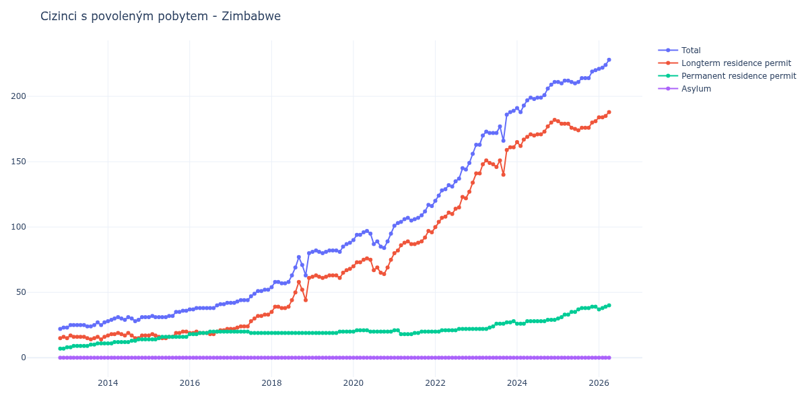

# Zimbabwe

## Souhrnné statistiky (Min/Max pro rok) / Summary Statistics (Min/Max per year)

| Year   | Total     | Longterm Residence Permit   | Permanent Residence Permit   | Asylum   |
|--------|-----------|-----------------------------|------------------------------|----------|
| 2012   | 22 / 23   | 15 / 16                     | 7 / 7                        | 0 / 0    |
| 2013   | 23 / 27   | 14 / 17                     | 8 / 11                       | 0 / 0    |
| 2014   | 28 / 31   | 15 / 19                     | 11 / 14                      | 0 / 0    |
| 2015   | 31 / 36   | 15 / 20                     | 14 / 16                      | 0 / 0    |
| 2016   | 37 / 42   | 18 / 22                     | 18 / 20                      | 0 / 0    |
| 2017   | 42 / 52   | 22 / 33                     | 19 / 20                      | 0 / 0    |
| 2018   | 54 / 80   | 35 / 61                     | 19 / 19                      | 0 / 0    |
| 2019   | 80 / 88   | 61 / 68                     | 19 / 20                      | 0 / 0    |
| 2020   | 84 / 97   | 64 / 76                     | 20 / 21                      | 0 / 0    |
| 2021   | 101 / 117 | 80 / 97                     | 18 / 21                      | 0 / 0    |
| 2022   | 120 / 156 | 100 / 134                   | 20 / 22                      | 0 / 0    |
| 2023   | 163 / 189 | 140 / 161                   | 22 / 28                      | 0 / 0    |
| 2024   | 188 / 211 | 162 / 182                   | 26 / 29                      | 0 / 0    |
| 2025   | 210 / 220 | 174 / 181                   | 30 / 39                      | 0 / 0    |
| 2026   | 221 / 228 | 184 / 188                   | 37 / 40                      | 0 / 0    |

## Detailní tabulka / Detailed Data Table

| Date     | Total         | Longterm Residence Permit   | Permanent Residence Permit   | Asylum   |
|----------|---------------|-----------------------------|------------------------------|----------|
| **2012** |               |                             |                              |          |
| 11.2012  | 22            | 15                          | 7                            | 0        |
| 12.2012  | 23 (+4.55%)   | 16 (+6.67%)                 | 7 (+0.00%)                   | 0        |
| **2013** |               |                             |                              |          |
| 01.2013  | 23 (+0.00%)   | 15 (-6.25%)                 | 8 (+14.29%)                  | 0        |
| 02.2013  | 25 (+8.70%)   | 17 (+13.33%)                | 8 (+0.00%)                   | 0        |
| 03.2013  | 25 (+0.00%)   | 16 (-5.88%)                 | 9 (+12.50%)                  | 0        |
| 04.2013  | 25 (+0.00%)   | 16 (+0.00%)                 | 9 (+0.00%)                   | 0        |
| 05.2013  | 25 (+0.00%)   | 16 (+0.00%)                 | 9 (+0.00%)                   | 0        |
| 06.2013  | 25 (+0.00%)   | 16 (+0.00%)                 | 9 (+0.00%)                   | 0        |
| 07.2013  | 24 (-4.00%)   | 15 (-6.25%)                 | 9 (+0.00%)                   | 0        |
| 08.2013  | 24 (+0.00%)   | 14 (-6.67%)                 | 10 (+11.11%)                 | 0        |
| 09.2013  | 25 (+4.17%)   | 15 (+7.14%)                 | 10 (+0.00%)                  | 0        |
| 10.2013  | 27 (+8.00%)   | 16 (+6.67%)                 | 11 (+10.00%)                 | 0        |
| 11.2013  | 25 (-7.41%)   | 14 (-12.50%)                | 11 (+0.00%)                  | 0        |
| 12.2013  | 27 (+8.00%)   | 16 (+14.29%)                | 11 (+0.00%)                  | 0        |
| **2014** |               |                             |                              |          |
| 01.2014  | 28 (+3.70%)   | 17 (+6.25%)                 | 11 (+0.00%)                  | 0        |
| 02.2014  | 29 (+3.57%)   | 18 (+5.88%)                 | 11 (+0.00%)                  | 0        |
| 03.2014  | 30 (+3.45%)   | 18 (+0.00%)                 | 12 (+9.09%)                  | 0        |
| 04.2014  | 31 (+3.33%)   | 19 (+5.56%)                 | 12 (+0.00%)                  | 0        |
| 05.2014  | 30 (-3.23%)   | 18 (-5.26%)                 | 12 (+0.00%)                  | 0        |
| 06.2014  | 29 (-3.33%)   | 17 (-5.56%)                 | 12 (+0.00%)                  | 0        |
| 07.2014  | 31 (+6.90%)   | 19 (+11.76%)                | 12 (+0.00%)                  | 0        |
| 08.2014  | 30 (-3.23%)   | 17 (-10.53%)                | 13 (+8.33%)                  | 0        |
| 09.2014  | 28 (-6.67%)   | 15 (-11.76%)                | 13 (+0.00%)                  | 0        |
| 10.2014  | 29 (+3.57%)   | 15 (+0.00%)                 | 14 (+7.69%)                  | 0        |
| 11.2014  | 31 (+6.90%)   | 17 (+13.33%)                | 14 (+0.00%)                  | 0        |
| 12.2014  | 31 (+0.00%)   | 17 (+0.00%)                 | 14 (+0.00%)                  | 0        |
| **2015** |               |                             |                              |          |
| 01.2015  | 31 (+0.00%)   | 17 (+0.00%)                 | 14 (+0.00%)                  | 0        |
| 02.2015  | 32 (+3.23%)   | 18 (+5.88%)                 | 14 (+0.00%)                  | 0        |
| 03.2015  | 31 (-3.12%)   | 17 (-5.56%)                 | 14 (+0.00%)                  | 0        |
| 04.2015  | 31 (+0.00%)   | 16 (-5.88%)                 | 15 (+7.14%)                  | 0        |
| 05.2015  | 31 (+0.00%)   | 15 (-6.25%)                 | 16 (+6.67%)                  | 0        |
| 06.2015  | 31 (+0.00%)   | 15 (+0.00%)                 | 16 (+0.00%)                  | 0        |
| 07.2015  | 32 (+3.23%)   | 16 (+6.67%)                 | 16 (+0.00%)                  | 0        |
| 08.2015  | 32 (+0.00%)   | 16 (+0.00%)                 | 16 (+0.00%)                  | 0        |
| 09.2015  | 35 (+9.38%)   | 19 (+18.75%)                | 16 (+0.00%)                  | 0        |
| 10.2015  | 35 (+0.00%)   | 19 (+0.00%)                 | 16 (+0.00%)                  | 0        |
| 11.2015  | 36 (+2.86%)   | 20 (+5.26%)                 | 16 (+0.00%)                  | 0        |
| 12.2015  | 36 (+0.00%)   | 20 (+0.00%)                 | 16 (+0.00%)                  | 0        |
| **2016** |               |                             |                              |          |
| 01.2016  | 37 (+2.78%)   | 19 (-5.00%)                 | 18 (+12.50%)                 | 0        |
| 02.2016  | 37 (+0.00%)   | 19 (+0.00%)                 | 18 (+0.00%)                  | 0        |
| 03.2016  | 38 (+2.70%)   | 20 (+5.26%)                 | 18 (+0.00%)                  | 0        |
| 04.2016  | 38 (+0.00%)   | 19 (-5.00%)                 | 19 (+5.56%)                  | 0        |
| 05.2016  | 38 (+0.00%)   | 19 (+0.00%)                 | 19 (+0.00%)                  | 0        |
| 06.2016  | 38 (+0.00%)   | 19 (+0.00%)                 | 19 (+0.00%)                  | 0        |
| 07.2016  | 38 (+0.00%)   | 18 (-5.26%)                 | 20 (+5.26%)                  | 0        |
| 08.2016  | 38 (+0.00%)   | 18 (+0.00%)                 | 20 (+0.00%)                  | 0        |
| 09.2016  | 40 (+5.26%)   | 20 (+11.11%)                | 20 (+0.00%)                  | 0        |
| 10.2016  | 41 (+2.50%)   | 21 (+5.00%)                 | 20 (+0.00%)                  | 0        |
| 11.2016  | 41 (+0.00%)   | 21 (+0.00%)                 | 20 (+0.00%)                  | 0        |
| 12.2016  | 42 (+2.44%)   | 22 (+4.76%)                 | 20 (+0.00%)                  | 0        |
| **2017** |               |                             |                              |          |
| 01.2017  | 42 (+0.00%)   | 22 (+0.00%)                 | 20 (+0.00%)                  | 0        |
| 02.2017  | 42 (+0.00%)   | 22 (+0.00%)                 | 20 (+0.00%)                  | 0        |
| 03.2017  | 43 (+2.38%)   | 23 (+4.55%)                 | 20 (+0.00%)                  | 0        |
| 04.2017  | 44 (+2.33%)   | 24 (+4.35%)                 | 20 (+0.00%)                  | 0        |
| 05.2017  | 44 (+0.00%)   | 24 (+0.00%)                 | 20 (+0.00%)                  | 0        |
| 06.2017  | 44 (+0.00%)   | 24 (+0.00%)                 | 20 (+0.00%)                  | 0        |
| 07.2017  | 47 (+6.82%)   | 28 (+16.67%)                | 19 (-5.00%)                  | 0        |
| 08.2017  | 49 (+4.26%)   | 30 (+7.14%)                 | 19 (+0.00%)                  | 0        |
| 09.2017  | 51 (+4.08%)   | 32 (+6.67%)                 | 19 (+0.00%)                  | 0        |
| 10.2017  | 51 (+0.00%)   | 32 (+0.00%)                 | 19 (+0.00%)                  | 0        |
| 11.2017  | 52 (+1.96%)   | 33 (+3.12%)                 | 19 (+0.00%)                  | 0        |
| 12.2017  | 52 (+0.00%)   | 33 (+0.00%)                 | 19 (+0.00%)                  | 0        |
| **2018** |               |                             |                              |          |
| 01.2018  | 54 (+3.85%)   | 35 (+6.06%)                 | 19 (+0.00%)                  | 0        |
| 02.2018  | 58 (+7.41%)   | 39 (+11.43%)                | 19 (+0.00%)                  | 0        |
| 03.2018  | 58 (+0.00%)   | 39 (+0.00%)                 | 19 (+0.00%)                  | 0        |
| 04.2018  | 57 (-1.72%)   | 38 (-2.56%)                 | 19 (+0.00%)                  | 0        |
| 05.2018  | 57 (+0.00%)   | 38 (+0.00%)                 | 19 (+0.00%)                  | 0        |
| 06.2018  | 58 (+1.75%)   | 39 (+2.63%)                 | 19 (+0.00%)                  | 0        |
| 07.2018  | 63 (+8.62%)   | 44 (+12.82%)                | 19 (+0.00%)                  | 0        |
| 08.2018  | 69 (+9.52%)   | 50 (+13.64%)                | 19 (+0.00%)                  | 0        |
| 09.2018  | 77 (+11.59%)  | 58 (+16.00%)                | 19 (+0.00%)                  | 0        |
| 10.2018  | 71 (-7.79%)   | 52 (-10.34%)                | 19 (+0.00%)                  | 0        |
| 11.2018  | 63 (-11.27%)  | 44 (-15.38%)                | 19 (+0.00%)                  | 0        |
| 12.2018  | 80 (+26.98%)  | 61 (+38.64%)                | 19 (+0.00%)                  | 0        |
| **2019** |               |                             |                              |          |
| 01.2019  | 81 (+1.25%)   | 62 (+1.64%)                 | 19 (+0.00%)                  | 0        |
| 02.2019  | 82 (+1.23%)   | 63 (+1.61%)                 | 19 (+0.00%)                  | 0        |
| 03.2019  | 81 (-1.22%)   | 62 (-1.59%)                 | 19 (+0.00%)                  | 0        |
| 04.2019  | 80 (-1.23%)   | 61 (-1.61%)                 | 19 (+0.00%)                  | 0        |
| 05.2019  | 81 (+1.25%)   | 62 (+1.64%)                 | 19 (+0.00%)                  | 0        |
| 06.2019  | 82 (+1.23%)   | 63 (+1.61%)                 | 19 (+0.00%)                  | 0        |
| 07.2019  | 82 (+0.00%)   | 63 (+0.00%)                 | 19 (+0.00%)                  | 0        |
| 08.2019  | 82 (+0.00%)   | 63 (+0.00%)                 | 19 (+0.00%)                  | 0        |
| 09.2019  | 81 (-1.22%)   | 61 (-3.17%)                 | 20 (+5.26%)                  | 0        |
| 10.2019  | 85 (+4.94%)   | 65 (+6.56%)                 | 20 (+0.00%)                  | 0        |
| 11.2019  | 87 (+2.35%)   | 67 (+3.08%)                 | 20 (+0.00%)                  | 0        |
| 12.2019  | 88 (+1.15%)   | 68 (+1.49%)                 | 20 (+0.00%)                  | 0        |
| **2020** |               |                             |                              |          |
| 01.2020  | 90 (+2.27%)   | 70 (+2.94%)                 | 20 (+0.00%)                  | 0        |
| 02.2020  | 94 (+4.44%)   | 73 (+4.29%)                 | 21 (+5.00%)                  | 0        |
| 03.2020  | 94 (+0.00%)   | 73 (+0.00%)                 | 21 (+0.00%)                  | 0        |
| 04.2020  | 96 (+2.13%)   | 75 (+2.74%)                 | 21 (+0.00%)                  | 0        |
| 05.2020  | 97 (+1.04%)   | 76 (+1.33%)                 | 21 (+0.00%)                  | 0        |
| 06.2020  | 95 (-2.06%)   | 75 (-1.32%)                 | 20 (-4.76%)                  | 0        |
| 07.2020  | 87 (-8.42%)   | 67 (-10.67%)                | 20 (+0.00%)                  | 0        |
| 08.2020  | 89 (+2.30%)   | 69 (+2.99%)                 | 20 (+0.00%)                  | 0        |
| 09.2020  | 85 (-4.49%)   | 65 (-5.80%)                 | 20 (+0.00%)                  | 0        |
| 10.2020  | 84 (-1.18%)   | 64 (-1.54%)                 | 20 (+0.00%)                  | 0        |
| 11.2020  | 89 (+5.95%)   | 69 (+7.81%)                 | 20 (+0.00%)                  | 0        |
| 12.2020  | 95 (+6.74%)   | 75 (+8.70%)                 | 20 (+0.00%)                  | 0        |
| **2021** |               |                             |                              |          |
| 01.2021  | 101 (+6.32%)  | 80 (+6.67%)                 | 21 (+5.00%)                  | 0        |
| 02.2021  | 103 (+1.98%)  | 82 (+2.50%)                 | 21 (+0.00%)                  | 0        |
| 03.2021  | 104 (+0.97%)  | 86 (+4.88%)                 | 18 (-14.29%)                 | 0        |
| 04.2021  | 106 (+1.92%)  | 88 (+2.33%)                 | 18 (+0.00%)                  | 0        |
| 05.2021  | 107 (+0.94%)  | 89 (+1.14%)                 | 18 (+0.00%)                  | 0        |
| 06.2021  | 105 (-1.87%)  | 87 (-2.25%)                 | 18 (+0.00%)                  | 0        |
| 07.2021  | 106 (+0.95%)  | 87 (+0.00%)                 | 19 (+5.56%)                  | 0        |
| 08.2021  | 107 (+0.94%)  | 88 (+1.15%)                 | 19 (+0.00%)                  | 0        |
| 09.2021  | 109 (+1.87%)  | 89 (+1.14%)                 | 20 (+5.26%)                  | 0        |
| 10.2021  | 112 (+2.75%)  | 92 (+3.37%)                 | 20 (+0.00%)                  | 0        |
| 11.2021  | 117 (+4.46%)  | 97 (+5.43%)                 | 20 (+0.00%)                  | 0        |
| 12.2021  | 116 (-0.85%)  | 96 (-1.03%)                 | 20 (+0.00%)                  | 0        |
| **2022** |               |                             |                              |          |
| 01.2022  | 120 (+3.45%)  | 100 (+4.17%)                | 20 (+0.00%)                  | 0        |
| 02.2022  | 124 (+3.33%)  | 104 (+4.00%)                | 20 (+0.00%)                  | 0        |
| 03.2022  | 128 (+3.23%)  | 107 (+2.88%)                | 21 (+5.00%)                  | 0        |
| 04.2022  | 129 (+0.78%)  | 108 (+0.93%)                | 21 (+0.00%)                  | 0        |
| 05.2022  | 132 (+2.33%)  | 111 (+2.78%)                | 21 (+0.00%)                  | 0        |
| 06.2022  | 131 (-0.76%)  | 110 (-0.90%)                | 21 (+0.00%)                  | 0        |
| 07.2022  | 135 (+3.05%)  | 114 (+3.64%)                | 21 (+0.00%)                  | 0        |
| 08.2022  | 137 (+1.48%)  | 115 (+0.88%)                | 22 (+4.76%)                  | 0        |
| 09.2022  | 145 (+5.84%)  | 123 (+6.96%)                | 22 (+0.00%)                  | 0        |
| 10.2022  | 144 (-0.69%)  | 122 (-0.81%)                | 22 (+0.00%)                  | 0        |
| 11.2022  | 149 (+3.47%)  | 127 (+4.10%)                | 22 (+0.00%)                  | 0        |
| 12.2022  | 156 (+4.70%)  | 134 (+5.51%)                | 22 (+0.00%)                  | 0        |
| **2023** |               |                             |                              |          |
| 01.2023  | 163 (+4.49%)  | 141 (+5.22%)                | 22 (+0.00%)                  | 0        |
| 02.2023  | 163 (+0.00%)  | 141 (+0.00%)                | 22 (+0.00%)                  | 0        |
| 03.2023  | 170 (+4.29%)  | 148 (+4.96%)                | 22 (+0.00%)                  | 0        |
| 04.2023  | 173 (+1.76%)  | 151 (+2.03%)                | 22 (+0.00%)                  | 0        |
| 05.2023  | 172 (-0.58%)  | 149 (-1.32%)                | 23 (+4.55%)                  | 0        |
| 06.2023  | 172 (+0.00%)  | 148 (-0.67%)                | 24 (+4.35%)                  | 0        |
| 07.2023  | 172 (+0.00%)  | 146 (-1.35%)                | 26 (+8.33%)                  | 0        |
| 08.2023  | 177 (+2.91%)  | 151 (+3.42%)                | 26 (+0.00%)                  | 0        |
| 09.2023  | 166 (-6.21%)  | 140 (-7.28%)                | 26 (+0.00%)                  | 0        |
| 10.2023  | 186 (+12.05%) | 159 (+13.57%)               | 27 (+3.85%)                  | 0        |
| 11.2023  | 188 (+1.08%)  | 161 (+1.26%)                | 27 (+0.00%)                  | 0        |
| 12.2023  | 189 (+0.53%)  | 161 (+0.00%)                | 28 (+3.70%)                  | 0        |
| **2024** |               |                             |                              |          |
| 01.2024  | 191 (+1.06%)  | 165 (+2.48%)                | 26 (-7.14%)                  | 0        |
| 02.2024  | 188 (-1.57%)  | 162 (-1.82%)                | 26 (+0.00%)                  | 0        |
| 03.2024  | 193 (+2.66%)  | 167 (+3.09%)                | 26 (+0.00%)                  | 0        |
| 04.2024  | 197 (+2.07%)  | 169 (+1.20%)                | 28 (+7.69%)                  | 0        |
| 05.2024  | 199 (+1.02%)  | 171 (+1.18%)                | 28 (+0.00%)                  | 0        |
| 06.2024  | 198 (-0.50%)  | 170 (-0.58%)                | 28 (+0.00%)                  | 0        |
| 07.2024  | 199 (+0.51%)  | 171 (+0.59%)                | 28 (+0.00%)                  | 0        |
| 08.2024  | 199 (+0.00%)  | 171 (+0.00%)                | 28 (+0.00%)                  | 0        |
| 09.2024  | 201 (+1.01%)  | 173 (+1.17%)                | 28 (+0.00%)                  | 0        |
| 10.2024  | 206 (+2.49%)  | 177 (+2.31%)                | 29 (+3.57%)                  | 0        |
| 11.2024  | 209 (+1.46%)  | 180 (+1.69%)                | 29 (+0.00%)                  | 0        |
| 12.2024  | 211 (+0.96%)  | 182 (+1.11%)                | 29 (+0.00%)                  | 0        |
| **2025** |               |                             |                              |          |
| 01.2025  | 211 (+0.00%)  | 181 (-0.55%)                | 30 (+3.45%)                  | 0        |
| 02.2025  | 210 (-0.47%)  | 179 (-1.10%)                | 31 (+3.33%)                  | 0        |
| 03.2025  | 212 (+0.95%)  | 179 (+0.00%)                | 33 (+6.45%)                  | 0        |
| 04.2025  | 212 (+0.00%)  | 179 (+0.00%)                | 33 (+0.00%)                  | 0        |
| 05.2025  | 211 (-0.47%)  | 176 (-1.68%)                | 35 (+6.06%)                  | 0        |
| 06.2025  | 210 (-0.47%)  | 175 (-0.57%)                | 35 (+0.00%)                  | 0        |
| 07.2025  | 211 (+0.48%)  | 174 (-0.57%)                | 37 (+5.71%)                  | 0        |
| 08.2025  | 214 (+1.42%)  | 176 (+1.15%)                | 38 (+2.70%)                  | 0        |
| 09.2025  | 214 (+0.00%)  | 176 (+0.00%)                | 38 (+0.00%)                  | 0        |
| 10.2025  | 214 (+0.00%)  | 176 (+0.00%)                | 38 (+0.00%)                  | 0        |
| 11.2025  | 219 (+2.34%)  | 180 (+2.27%)                | 39 (+2.63%)                  | 0        |
| 12.2025  | 220 (+0.46%)  | 181 (+0.56%)                | 39 (+0.00%)                  | 0        |
| **2026** |               |                             |                              |          |
| 01.2026  | 221 (+0.45%)  | 184 (+1.66%)                | 37 (-5.13%)                  | 0        |
| 02.2026  | 222 (+0.45%)  | 184 (+0.00%)                | 38 (+2.70%)                  | 0        |
| 03.2026  | 224 (+0.90%)  | 185 (+0.54%)                | 39 (+2.63%)                  | 0        |
| 04.2026  | 228 (+1.79%)  | 188 (+1.62%)                | 40 (+2.56%)                  | 0        |
