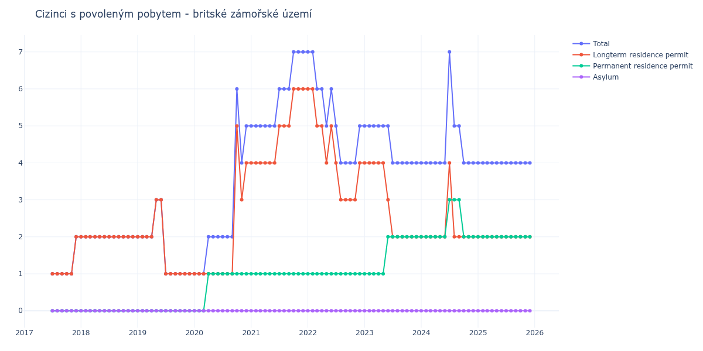

# britské zámořské území

## Souhrnné statistiky (Min/Max pro rok) / Summary Statistics (Min/Max per year)

| Year   | Total Min/Max   | Longterm Residence Permit Min/Max   | Permanent Residence Permit Min/Max   | Asylum Min/Max   |
|--------|-----------------|-------------------------------------|--------------------------------------|------------------|
| 2017   | 1 / 2           | 1 / 2                               | 0 / 0                                | 0 / 0            |
| 2018   | 2 / 2           | 2 / 2                               | 0 / 0                                | 0 / 0            |
| 2019   | 1 / 3           | 1 / 3                               | 0 / 0                                | 0 / 0            |
| 2020   | 1 / 6           | 1 / 5                               | 0 / 1                                | 0 / 0            |
| 2021   | 5 / 7           | 4 / 6                               | 1 / 1                                | 0 / 0            |
| 2022   | 4 / 7           | 3 / 6                               | 1 / 1                                | 0 / 0            |
| 2023   | 4 / 5           | 2 / 4                               | 1 / 2                                | 0 / 0            |
| 2024   | 4 / 7           | 2 / 4                               | 2 / 3                                | 0 / 0            |
| 2025   | 4 / 4           | 2 / 2                               | 2 / 2                                | 0 / 0            |

## Detailní tabulka / Detailed Data Table

| Date     | Total        | Longterm Residence Permit   | Permanent Residence Permit   | Asylum   |
|----------|--------------|-----------------------------|------------------------------|----------|
| **2017** |              |                             |                              |          |
| 07.2017  | 1            | 1                           | 0                            | 0        |
| 08.2017  | 1 (+0.00%)   | 1 (+0.00%)                  | 0                            | 0        |
| 09.2017  | 1 (+0.00%)   | 1 (+0.00%)                  | 0                            | 0        |
| 10.2017  | 1 (+0.00%)   | 1 (+0.00%)                  | 0                            | 0        |
| 11.2017  | 1 (+0.00%)   | 1 (+0.00%)                  | 0                            | 0        |
| 12.2017  | 2 (+100.00%) | 2 (+100.00%)                | 0                            | 0        |
| **2018** |              |                             |                              |          |
| 01.2018  | 2 (+0.00%)   | 2 (+0.00%)                  | 0                            | 0        |
| 02.2018  | 2 (+0.00%)   | 2 (+0.00%)                  | 0                            | 0        |
| 03.2018  | 2 (+0.00%)   | 2 (+0.00%)                  | 0                            | 0        |
| 04.2018  | 2 (+0.00%)   | 2 (+0.00%)                  | 0                            | 0        |
| 05.2018  | 2 (+0.00%)   | 2 (+0.00%)                  | 0                            | 0        |
| 06.2018  | 2 (+0.00%)   | 2 (+0.00%)                  | 0                            | 0        |
| 07.2018  | 2 (+0.00%)   | 2 (+0.00%)                  | 0                            | 0        |
| 08.2018  | 2 (+0.00%)   | 2 (+0.00%)                  | 0                            | 0        |
| 09.2018  | 2 (+0.00%)   | 2 (+0.00%)                  | 0                            | 0        |
| 10.2018  | 2 (+0.00%)   | 2 (+0.00%)                  | 0                            | 0        |
| 11.2018  | 2 (+0.00%)   | 2 (+0.00%)                  | 0                            | 0        |
| 12.2018  | 2 (+0.00%)   | 2 (+0.00%)                  | 0                            | 0        |
| **2019** |              |                             |                              |          |
| 01.2019  | 2 (+0.00%)   | 2 (+0.00%)                  | 0                            | 0        |
| 02.2019  | 2 (+0.00%)   | 2 (+0.00%)                  | 0                            | 0        |
| 03.2019  | 2 (+0.00%)   | 2 (+0.00%)                  | 0                            | 0        |
| 04.2019  | 2 (+0.00%)   | 2 (+0.00%)                  | 0                            | 0        |
| 05.2019  | 3 (+50.00%)  | 3 (+50.00%)                 | 0                            | 0        |
| 06.2019  | 3 (+0.00%)   | 3 (+0.00%)                  | 0                            | 0        |
| 07.2019  | 1 (-66.67%)  | 1 (-66.67%)                 | 0                            | 0        |
| 08.2019  | 1 (+0.00%)   | 1 (+0.00%)                  | 0                            | 0        |
| 09.2019  | 1 (+0.00%)   | 1 (+0.00%)                  | 0                            | 0        |
| 10.2019  | 1 (+0.00%)   | 1 (+0.00%)                  | 0                            | 0        |
| 11.2019  | 1 (+0.00%)   | 1 (+0.00%)                  | 0                            | 0        |
| 12.2019  | 1 (+0.00%)   | 1 (+0.00%)                  | 0                            | 0        |
| **2020** |              |                             |                              |          |
| 01.2020  | 1 (+0.00%)   | 1 (+0.00%)                  | 0                            | 0        |
| 02.2020  | 1 (+0.00%)   | 1 (+0.00%)                  | 0                            | 0        |
| 03.2020  | 1 (+0.00%)   | 1 (+0.00%)                  | 0                            | 0        |
| 04.2020  | 2 (+100.00%) | 1 (+0.00%)                  | 1                            | 0        |
| 05.2020  | 2 (+0.00%)   | 1 (+0.00%)                  | 1 (+0.00%)                   | 0        |
| 06.2020  | 2 (+0.00%)   | 1 (+0.00%)                  | 1 (+0.00%)                   | 0        |
| 07.2020  | 2 (+0.00%)   | 1 (+0.00%)                  | 1 (+0.00%)                   | 0        |
| 08.2020  | 2 (+0.00%)   | 1 (+0.00%)                  | 1 (+0.00%)                   | 0        |
| 09.2020  | 2 (+0.00%)   | 1 (+0.00%)                  | 1 (+0.00%)                   | 0        |
| 10.2020  | 6 (+200.00%) | 5 (+400.00%)                | 1 (+0.00%)                   | 0        |
| 11.2020  | 4 (-33.33%)  | 3 (-40.00%)                 | 1 (+0.00%)                   | 0        |
| 12.2020  | 5 (+25.00%)  | 4 (+33.33%)                 | 1 (+0.00%)                   | 0        |
| **2021** |              |                             |                              |          |
| 01.2021  | 5 (+0.00%)   | 4 (+0.00%)                  | 1 (+0.00%)                   | 0        |
| 02.2021  | 5 (+0.00%)   | 4 (+0.00%)                  | 1 (+0.00%)                   | 0        |
| 03.2021  | 5 (+0.00%)   | 4 (+0.00%)                  | 1 (+0.00%)                   | 0        |
| 04.2021  | 5 (+0.00%)   | 4 (+0.00%)                  | 1 (+0.00%)                   | 0        |
| 05.2021  | 5 (+0.00%)   | 4 (+0.00%)                  | 1 (+0.00%)                   | 0        |
| 06.2021  | 5 (+0.00%)   | 4 (+0.00%)                  | 1 (+0.00%)                   | 0        |
| 07.2021  | 6 (+20.00%)  | 5 (+25.00%)                 | 1 (+0.00%)                   | 0        |
| 08.2021  | 6 (+0.00%)   | 5 (+0.00%)                  | 1 (+0.00%)                   | 0        |
| 09.2021  | 6 (+0.00%)   | 5 (+0.00%)                  | 1 (+0.00%)                   | 0        |
| 10.2021  | 7 (+16.67%)  | 6 (+20.00%)                 | 1 (+0.00%)                   | 0        |
| 11.2021  | 7 (+0.00%)   | 6 (+0.00%)                  | 1 (+0.00%)                   | 0        |
| 12.2021  | 7 (+0.00%)   | 6 (+0.00%)                  | 1 (+0.00%)                   | 0        |
| **2022** |              |                             |                              |          |
| 01.2022  | 7 (+0.00%)   | 6 (+0.00%)                  | 1 (+0.00%)                   | 0        |
| 02.2022  | 7 (+0.00%)   | 6 (+0.00%)                  | 1 (+0.00%)                   | 0        |
| 03.2022  | 6 (-14.29%)  | 5 (-16.67%)                 | 1 (+0.00%)                   | 0        |
| 04.2022  | 6 (+0.00%)   | 5 (+0.00%)                  | 1 (+0.00%)                   | 0        |
| 05.2022  | 5 (-16.67%)  | 4 (-20.00%)                 | 1 (+0.00%)                   | 0        |
| 06.2022  | 6 (+20.00%)  | 5 (+25.00%)                 | 1 (+0.00%)                   | 0        |
| 07.2022  | 5 (-16.67%)  | 4 (-20.00%)                 | 1 (+0.00%)                   | 0        |
| 08.2022  | 4 (-20.00%)  | 3 (-25.00%)                 | 1 (+0.00%)                   | 0        |
| 09.2022  | 4 (+0.00%)   | 3 (+0.00%)                  | 1 (+0.00%)                   | 0        |
| 10.2022  | 4 (+0.00%)   | 3 (+0.00%)                  | 1 (+0.00%)                   | 0        |
| 11.2022  | 4 (+0.00%)   | 3 (+0.00%)                  | 1 (+0.00%)                   | 0        |
| 12.2022  | 5 (+25.00%)  | 4 (+33.33%)                 | 1 (+0.00%)                   | 0        |
| **2023** |              |                             |                              |          |
| 01.2023  | 5 (+0.00%)   | 4 (+0.00%)                  | 1 (+0.00%)                   | 0        |
| 02.2023  | 5 (+0.00%)   | 4 (+0.00%)                  | 1 (+0.00%)                   | 0        |
| 03.2023  | 5 (+0.00%)   | 4 (+0.00%)                  | 1 (+0.00%)                   | 0        |
| 04.2023  | 5 (+0.00%)   | 4 (+0.00%)                  | 1 (+0.00%)                   | 0        |
| 05.2023  | 5 (+0.00%)   | 4 (+0.00%)                  | 1 (+0.00%)                   | 0        |
| 06.2023  | 5 (+0.00%)   | 3 (-25.00%)                 | 2 (+100.00%)                 | 0        |
| 07.2023  | 4 (-20.00%)  | 2 (-33.33%)                 | 2 (+0.00%)                   | 0        |
| 08.2023  | 4 (+0.00%)   | 2 (+0.00%)                  | 2 (+0.00%)                   | 0        |
| 09.2023  | 4 (+0.00%)   | 2 (+0.00%)                  | 2 (+0.00%)                   | 0        |
| 10.2023  | 4 (+0.00%)   | 2 (+0.00%)                  | 2 (+0.00%)                   | 0        |
| 11.2023  | 4 (+0.00%)   | 2 (+0.00%)                  | 2 (+0.00%)                   | 0        |
| 12.2023  | 4 (+0.00%)   | 2 (+0.00%)                  | 2 (+0.00%)                   | 0        |
| **2024** |              |                             |                              |          |
| 01.2024  | 4 (+0.00%)   | 2 (+0.00%)                  | 2 (+0.00%)                   | 0        |
| 02.2024  | 4 (+0.00%)   | 2 (+0.00%)                  | 2 (+0.00%)                   | 0        |
| 03.2024  | 4 (+0.00%)   | 2 (+0.00%)                  | 2 (+0.00%)                   | 0        |
| 04.2024  | 4 (+0.00%)   | 2 (+0.00%)                  | 2 (+0.00%)                   | 0        |
| 05.2024  | 4 (+0.00%)   | 2 (+0.00%)                  | 2 (+0.00%)                   | 0        |
| 06.2024  | 4 (+0.00%)   | 2 (+0.00%)                  | 2 (+0.00%)                   | 0        |
| 07.2024  | 7 (+75.00%)  | 4 (+100.00%)                | 3 (+50.00%)                  | 0        |
| 08.2024  | 5 (-28.57%)  | 2 (-50.00%)                 | 3 (+0.00%)                   | 0        |
| 09.2024  | 5 (+0.00%)   | 2 (+0.00%)                  | 3 (+0.00%)                   | 0        |
| 10.2024  | 4 (-20.00%)  | 2 (+0.00%)                  | 2 (-33.33%)                  | 0        |
| 11.2024  | 4 (+0.00%)   | 2 (+0.00%)                  | 2 (+0.00%)                   | 0        |
| 12.2024  | 4 (+0.00%)   | 2 (+0.00%)                  | 2 (+0.00%)                   | 0        |
| **2025** |              |                             |                              |          |
| 01.2025  | 4 (+0.00%)   | 2 (+0.00%)                  | 2 (+0.00%)                   | 0        |
| 02.2025  | 4 (+0.00%)   | 2 (+0.00%)                  | 2 (+0.00%)                   | 0        |
| 03.2025  | 4 (+0.00%)   | 2 (+0.00%)                  | 2 (+0.00%)                   | 0        |
| 04.2025  | 4 (+0.00%)   | 2 (+0.00%)                  | 2 (+0.00%)                   | 0        |
| 05.2025  | 4 (+0.00%)   | 2 (+0.00%)                  | 2 (+0.00%)                   | 0        |
| 06.2025  | 4 (+0.00%)   | 2 (+0.00%)                  | 2 (+0.00%)                   | 0        |
| 07.2025  | 4 (+0.00%)   | 2 (+0.00%)                  | 2 (+0.00%)                   | 0        |
| 08.2025  | 4 (+0.00%)   | 2 (+0.00%)                  | 2 (+0.00%)                   | 0        |
| 09.2025  | 4 (+0.00%)   | 2 (+0.00%)                  | 2 (+0.00%)                   | 0        |
| 10.2025  | 4 (+0.00%)   | 2 (+0.00%)                  | 2 (+0.00%)                   | 0        |
| 11.2025  | 4 (+0.00%)   | 2 (+0.00%)                  | 2 (+0.00%)                   | 0        |
| 12.2025  | 4 (+0.00%)   | 2 (+0.00%)                  | 2 (+0.00%)                   | 0        |
